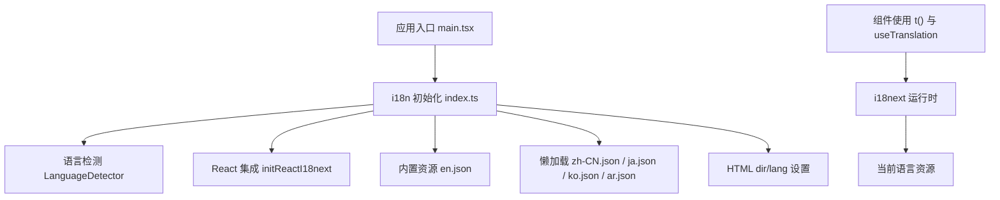
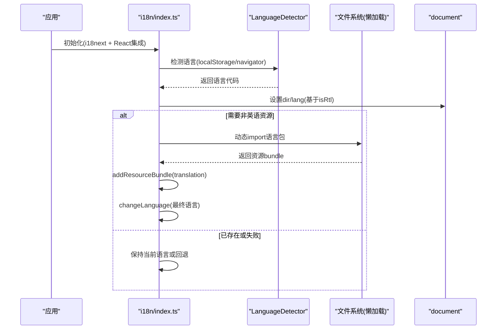
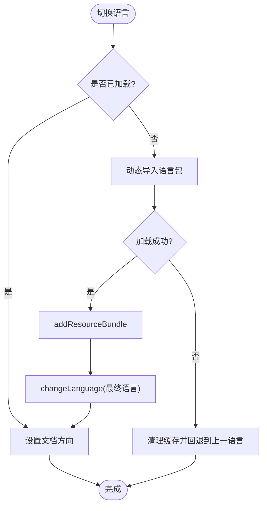
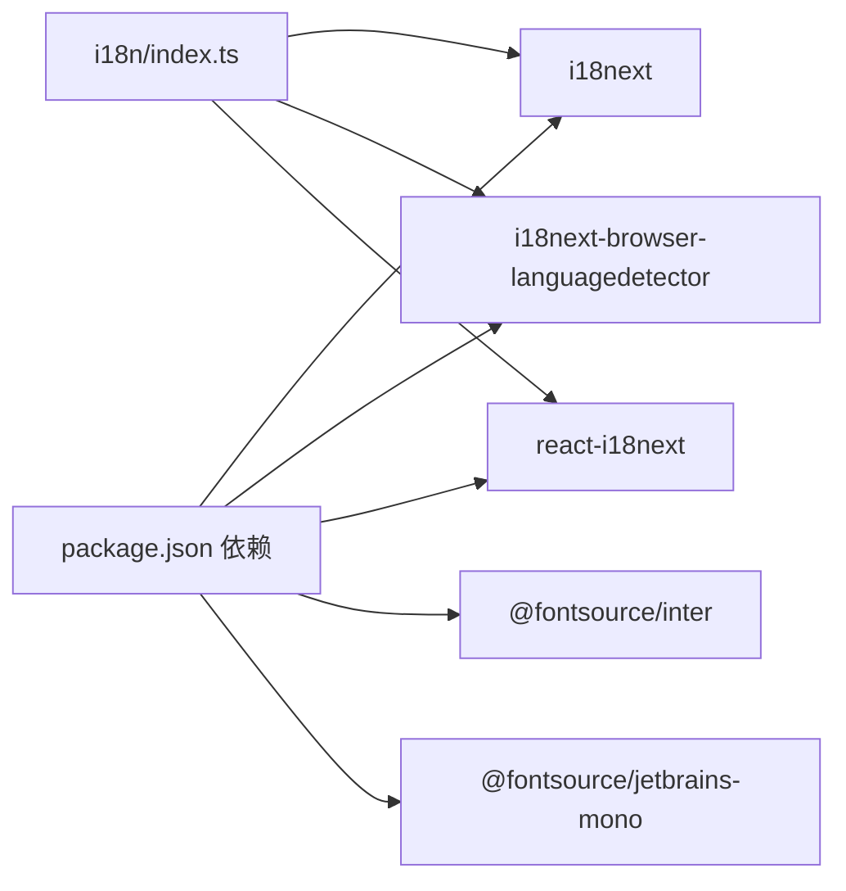

# 国际化

<cite>
**本文引用的文件**
- [frontend/src/i18n/index.ts](file://frontend/src/i18n/index.ts)
- [frontend/src/i18next.d.ts](file://frontend/src/i18next.d.ts)
- [frontend/package.json](file://frontend/package.json)
- [frontend/src/main.tsx](file://frontend/src/main.tsx)
- [frontend/src/i18n/locales/en.json](file://frontend/src/i18n/locales/en.json)
- [frontend/src/i18n/locales/zh-CN.json](file://frontend/src/i18n/locales/zh-CN.json)
- [frontend/src/i18n/locales/ar.json](file://frontend/src/i18n/locales/ar.json)
- [frontend/src/i18n/locales/ja.json](file://frontend/src/i18n/locales/ja.json)
- [frontend/src/i18n/locales/ko.json](file://frontend/src/i18n/locales/ko.json)
- [frontend/src/i18n/__tests__/i18n.test.ts](file://frontend/src/i18n/__tests__/i18n.test.ts)
</cite>

## 目录
1. [简介](#简介)
2. [项目结构](#项目结构)
3. [核心组件](#核心组件)
4. [架构总览](#架构总览)
5. [详细组件分析](#详细组件分析)
6. [依赖关系分析](#依赖关系分析)
7. [性能考量](#性能考量)
8. [故障排查指南](#故障排查指南)
9. [结论](#结论)
10. [附录](#附录)

## 简介
本文件为 Vibe-Trading 前端应用的国际化系统提供完整技术文档，覆盖多语言支持架构、语言包管理、动态语言切换机制、支持的语种与翻译文件组织、文本插值与复数处理、日期时间格式化策略、RTL（从右到左）语言支持与字体适配方案、翻译工作流程与质量检查、以及 i18next 配置、命名空间管理与性能优化技巧。

## 项目结构
国际化相关代码集中在 frontend/src/i18n 目录下：
- index.ts：i18next 初始化、语言检测、资源懒加载、RTL 方向控制、语言切换事件处理
- locales：各语言 JSON 资源文件（en、zh-CN、ja、ko、ar），统一使用默认命名空间 translation
- __tests__：包含键一致性、插值变量一致性与 RTL 工具函数的测试用例
- i18next.d.ts：TypeScript 类型声明，绑定默认命名空间与资源类型

图表来源
- [frontend/src/main.tsx:1-10](file://frontend/src/main.tsx#L1-L10)
- [frontend/src/i18n/index.ts:123-157](file://frontend/src/i18n/index.ts#L123-L157)

章节来源
- [frontend/src/main.tsx:1-10](file://frontend/src/main.tsx#L1-L10)
- [frontend/src/i18n/index.ts:1-160](file://frontend/src/i18n/index.ts#L1-L160)

## 核心组件
- 语言注册与常量
  - 支持语言列表包含英语、中文（zh-CN）、日语、韩语、阿拉伯语；其中阿拉伯语标记为 RTL
- 资源懒加载
  - 非英语语言通过动态 import 按需加载，避免首屏体积过大
- 语言检测与持久化
  - 优先读取 localStorage 中保存的语言，其次回退到浏览器 navigator.language（仅浏览器环境）
- 文档方向与语言属性
  - 根据语言自动设置 document.documentElement 的 dir 和 lang 属性，以支持 RTL 布局
- 错误回退
  - 当目标语言加载失败时，回退到上一次稳定语言并清理缓存，确保 UI 始终可用
- TypeScript 类型
  - 通过 i18next.d.ts 将默认命名空间与资源类型绑定，获得编译期提示与校验

章节来源
- [frontend/src/i18n/index.ts:7-33](file://frontend/src/i18n/index.ts#L7-L33)
- [frontend/src/i18n/index.ts:40-80](file://frontend/src/i18n/index.ts#L40-L80)
- [frontend/src/i18n/index.ts:82-121](file://frontend/src/i18n/index.ts#L82-L121)
- [frontend/src/i18n/index.ts:123-157](file://frontend/src/i18n/index.ts#L123-L157)
- [frontend/src/i18next.d.ts:1-12](file://frontend/src/i18next.d.ts#L1-L12)

## 架构总览
下图展示从应用启动到语言切换的完整流程，包括资源懒加载、RTL 方向设置与错误回退。

图表来源
- [frontend/src/i18n/index.ts:82-121](file://frontend/src/i18n/index.ts#L82-L121)
- [frontend/src/i18n/index.ts:123-157](file://frontend/src/i18n/index.ts#L123-L157)

## 详细组件分析

### i18next 初始化与配置
- 插件组合
  - 使用 LanguageDetector 进行语言检测
  - 使用 initReactI18next 与 React 集成
- 资源注入
  - 初始注入英语资源作为默认与回退
  - 其他语言通过懒加载在首次使用时注入
- 检测顺序与缓存
  - 浏览器环境按 ["localStorage", "navigator"] 顺序检测
  - 使用 localStorage 缓存用户选择
- 插值与转义
  - 关闭 HTML 转义（escapeValue: false），由上层组件负责安全渲染
- 支持语言清单
  - supportedLngs 显式声明所有支持的语言代码，保留区域码（如 zh-CN）

章节来源
- [frontend/src/i18n/index.ts:123-157](file://frontend/src/i18n/index.ts#L123-L157)
- [frontend/src/i18n/index.ts:7-16](file://frontend/src/i18n/index.ts#L7-L16)

### 语言包管理与命名空间
- 命名空间
  - 统一使用默认命名空间 translation，便于集中管理与类型推断
- 资源结构
  - 每个语言文件均为扁平化的嵌套对象，键路径一致，便于跨语言一致性校验
- 类型绑定
  - 通过 i18next.d.ts 将 resources 类型与英文资源结构对齐，获得 TS 智能提示

章节来源
- [frontend/src/i18next.d.ts:1-12](file://frontend/src/i18next.d.ts#L1-L12)
- [frontend/src/i18n/locales/en.json:1-800](file://frontend/src/i18n/locales/en.json#L1-L800)

### 动态语言切换机制
- 事件驱动
  - 监听 languageChanged 事件，同步更新文档方向与懒加载资源
- 懒加载与并发保护
  - 使用 Set 记录已加载语言，Map 记录正在加载的语言，避免重复请求
- 回退策略
  - 若目标语言加载失败，清理缓存并回退到上一次稳定语言，保证界面可用性

图表来源
- [frontend/src/i18n/index.ts:40-80](file://frontend/src/i18n/index.ts#L40-L80)
- [frontend/src/i18n/index.ts:82-121](file://frontend/src/i18n/index.ts#L82-L121)

### RTL 语言支持与字体适配
- RTL 识别
  - isRtl 函数根据 SUPPORTED_LANGUAGES 中的 dir 字段判断是否为 RTL
  - 支持区域变体匹配（如 ar-EG）
- 文档方向
  - applyDocumentDirection 设置 document.documentElement 的 dir 与 lang 属性
- 字体与排版
  - 项目引入 Inter 与 JetBrains Mono 字体，适用于拉丁字符与等宽显示
  - RTL 语言（阿拉伯语）通过 dir="rtl" 触发整体布局镜像，侧边栏等元素可据此调整位置

章节来源
- [frontend/src/i18n/index.ts:65-80](file://frontend/src/i18n/index.ts#L65-L80)
- [frontend/package.json:17-20](file://frontend/package.json#L17-L20)

### 文本插值与复数形式
- 插值
  - 使用 {{variable}} 语法进行文本插值，例如计数、文件名、错误信息等
  - 关闭 HTML 转义，组件需自行处理安全渲染
- 复数形式
  - 通过 i18next 的复数规则与插值变量实现（如 running: "{{count}} running"）
  - 测试用例验证各语言文件中插值变量的一致性

章节来源
- [frontend/src/i18n/locales/en.json:46-52](file://frontend/src/i18n/locales/en.json#L46-L52)
- [frontend/src/i18n/__tests__/i18n.test.ts:87-108](file://frontend/src/i18n/__tests__/i18n.test.ts#L87-L108)

### 日期时间格式化
- 当前策略
  - 未启用 i18next 的日期时间格式化插件；日期时间格式由业务层或第三方库处理
- 建议
  - 如需统一本地化日期时间，可在后续引入 date-fns-tz 或 dayjs 配合 i18next 插件进行格式化

[本节为通用指导，不直接分析具体文件]

### 组件中使用国际化
- 图表组件示例
  - 使用 i18n.t("charts.noPriceData") 等键获取文案
- 页面与交互
  - 通过 react-i18next 提供的 hooks 或高阶组件访问 t 函数与 useTranslation

章节来源
- [frontend/src/components/charts/CandlestickChart.tsx:271-271](file://frontend/src/components/charts/CandlestickChart.tsx#L271-L271)
- [frontend/src/components/charts/CorrelationMatrix.tsx:119-119](file://frontend/src/components/charts/CorrelationMatrix.tsx#L119-L119)
- [frontend/src/components/charts/EquityChart.tsx:121-121](file://frontend/src/components/charts/EquityChart.tsx#L121-L121)

## 依赖关系分析
- 运行时依赖
  - i18next：核心国际化库
  - i18next-browser-languagedetector：浏览器语言检测
  - react-i18next：React 集成
- 构建与类型
  - TypeScript 类型通过 i18next.d.ts 绑定默认命名空间与资源结构
- 字体依赖
  - @fontsource/inter 与 @fontsource/jetbrains-mono 用于界面字体

图表来源
- [frontend/package.json:23-29](file://frontend/package.json#L23-L29)
- [frontend/package.json:17-20](file://frontend/package.json#L17-L20)
- [frontend/src/i18n/index.ts:1-4](file://frontend/src/i18n/index.ts#L1-L4)

章节来源
- [frontend/package.json:17-29](file://frontend/package.json#L17-L29)
- [frontend/src/i18n/index.ts:1-4](file://frontend/src/i18n/index.ts#L1-L4)

## 性能考量
- 首屏优化
  - 仅注入英语资源，其他语言按需懒加载，减少初始包体积
- 并发与重试
  - 使用 Map 去重并发加载，最多尝试两次加载，提升鲁棒性
- 缓存策略
  - 使用 localStorage 缓存用户语言选择，避免重复检测
- 回退机制
  - 加载失败时回退到上一次稳定语言，保障用户体验
- 类型安全
  - 通过 TypeScript 类型定义减少运行时错误

章节来源
- [frontend/src/i18n/index.ts:21-33](file://frontend/src/i18n/index.ts#L21-L33)
- [frontend/src/i18n/index.ts:40-63](file://frontend/src/i18n/index.ts#L40-L63)
- [frontend/src/i18n/index.ts:107-121](file://frontend/src/i18n/index.ts#L107-L121)

## 故障排查指南
- 语言无法切换
  - 检查 localStorage 中是否存在无效语言代码
  - 查看控制台警告信息，确认是否发生加载失败并回退
- 文案缺失或键不一致
  - 运行单元测试，确保所有语言文件与英文源文件键路径一致
- RTL 布局异常
  - 确认 document.documentElement 的 dir 是否正确设置为 rtl
  - 检查 CSS 是否针对 RTL 做了适配（如侧边栏位置）
- 插值变量不匹配
  - 使用测试用例验证各语言文件中插值变量集合是否与英文一致

章节来源
- [frontend/src/i18n/__tests__/i18n.test.ts:51-66](file://frontend/src/i18n/__tests__/i18n.test.ts#L51-L66)
- [frontend/src/i18n/__tests__/i18n.test.ts:90-108](file://frontend/src/i18n/__tests__/i18n.test.ts#L90-L108)
- [frontend/src/i18n/__tests__/i18n.test.ts:112-152](file://frontend/src/i18n/__tests__/i18n.test.ts#L112-L152)

## 结论
Vibe-Trading 前端的国际化系统基于 i18next 构建，采用默认命名空间与 JSON 资源文件管理多语言内容。通过语言检测、懒加载与事件驱动的切换机制，实现了高性能与良好的用户体验。RTL 语言（阿拉伯语）通过文档方向设置得到支持，字体与布局可据此适配。完善的测试覆盖了键一致性与插值变量一致性，保障了翻译质量。未来可考虑引入日期时间格式化插件以进一步提升本地化能力。

## 附录

### 支持的语种与文件组织
- 支持语种
  - 英语（en）
  - 中文（zh-CN）
  - 日语（ja）
  - 韩语（ko）
  - 阿拉伯语（ar，RTL）
- 文件组织
  - 每个语言对应一个 JSON 文件，位于 frontend/src/i18n/locales
  - 统一使用默认命名空间 translation

章节来源
- [frontend/src/i18n/index.ts:7-16](file://frontend/src/i18n/index.ts#L7-L16)
- [frontend/src/i18n/locales/en.json:1-800](file://frontend/src/i18n/locales/en.json#L1-L800)
- [frontend/src/i18n/locales/zh-CN.json:1-800](file://frontend/src/i18n/locales/zh-CN.json#L1-L800)
- [frontend/src/i18n/locales/ar.json:1-200](file://frontend/src/i18n/locales/ar.json#L1-L200)

### 翻译工作流程与质量检查
- 工作流
  - 新增或修改文案时，优先更新英文源文件（en.json）
  - 同步更新其他语言文件，保持键路径与插值变量一致
- 质量检查
  - 运行单元测试，验证键一致性与插值变量一致性
  - 人工校对 RTL 语言的文案与布局效果

章节来源
- [frontend/src/i18n/__tests__/i18n.test.ts:51-66](file://frontend/src/i18n/__tests__/i18n.test.ts#L51-L66)
- [frontend/src/i18n/__tests__/i18n.test.ts:90-108](file://frontend/src/i18n/__tests__/i18n.test.ts#L90-L108)

### 更新策略
- 版本管理
  - 语言文件随应用版本发布，确保前后端与 UI 文案一致
- 回滚策略
  - 若新版本出现文案问题，可通过回退语言文件或修复后重新发布
- 持续集成
  - 建议在 CI 中运行国际化测试，防止键不一致与插值变量缺失

[本节为通用指导，不直接分析具体文件]