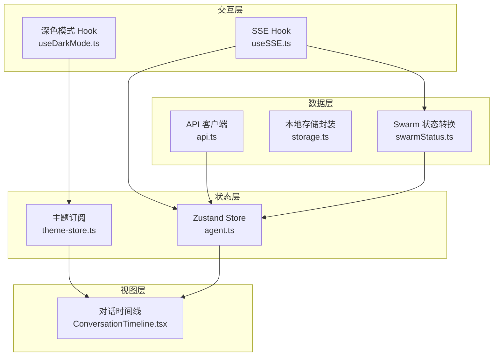
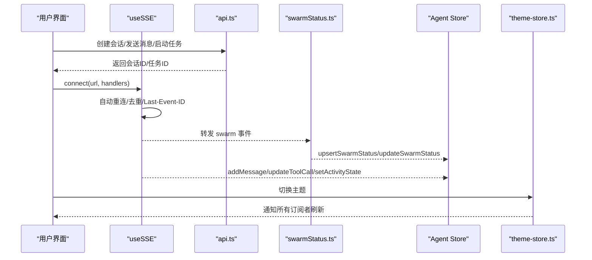
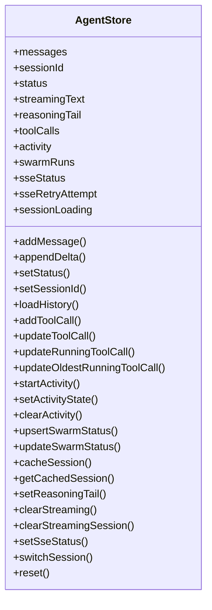
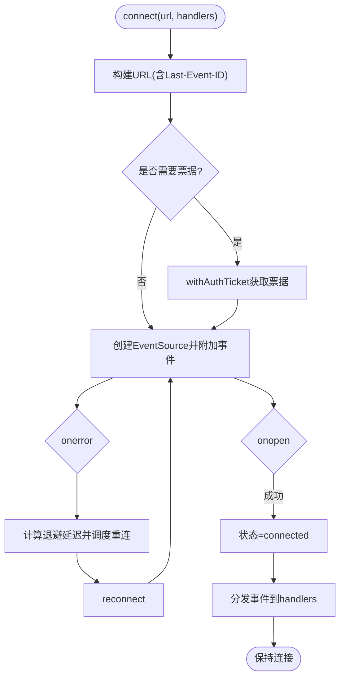
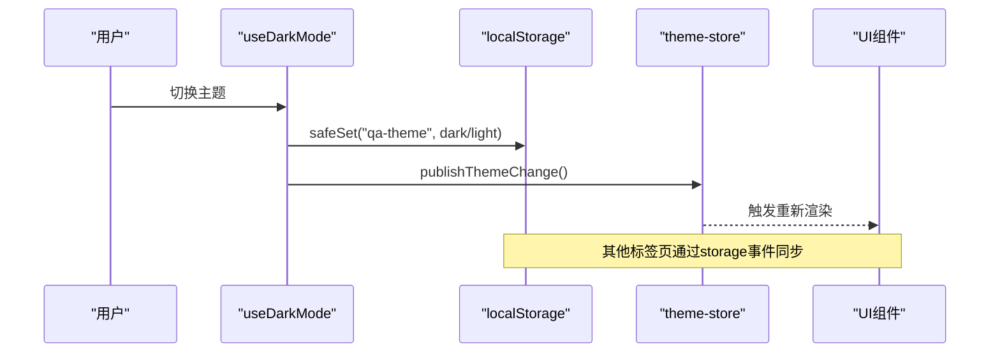
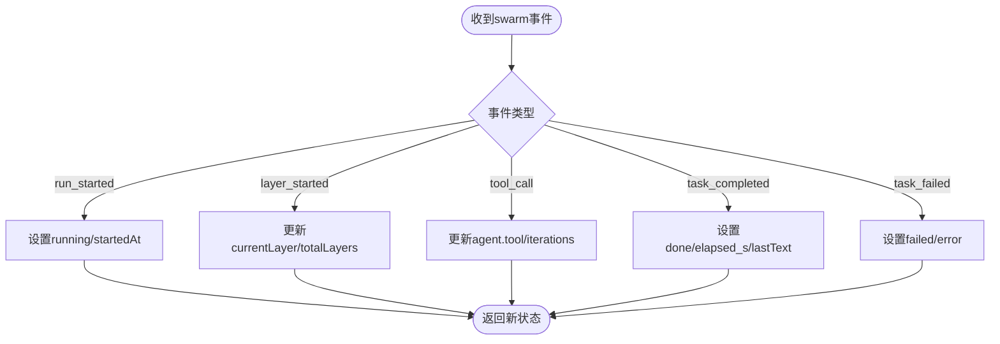
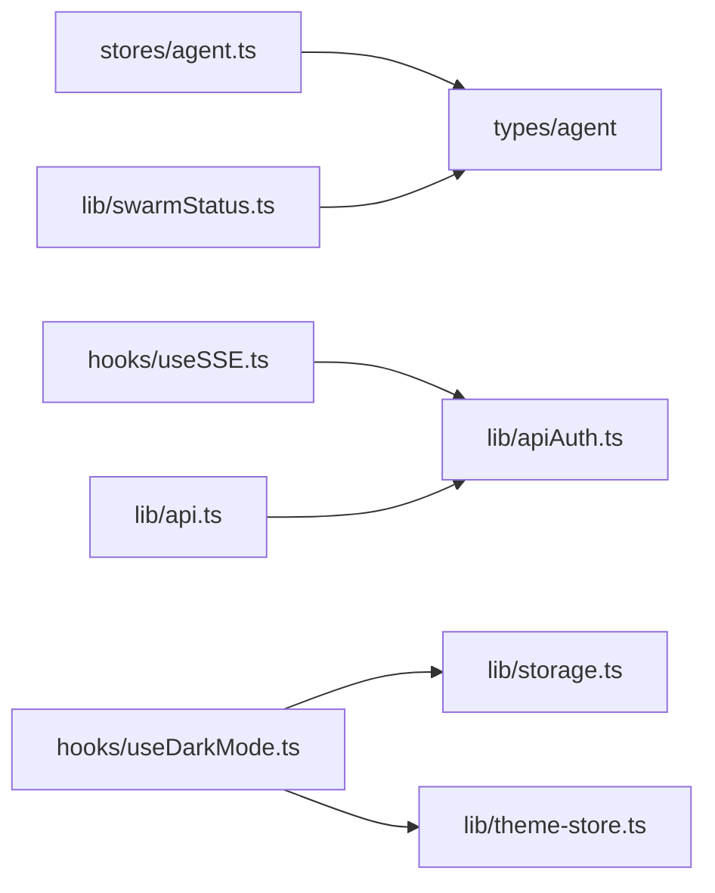
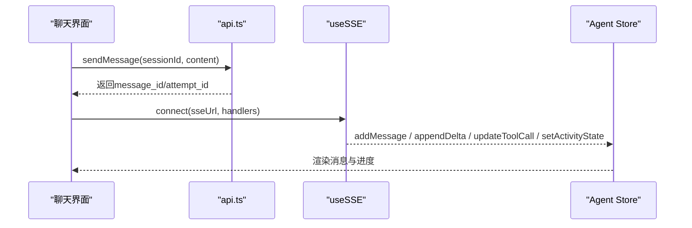

# 状态管理

<cite>
**本文引用的文件**
- [frontend/src/stores/agent.ts](file://frontend/src/stores/agent.ts)
- [frontend/src/hooks/useSSE.ts](file://frontend/src/hooks/useSSE.ts)
- [frontend/src/hooks/useDarkMode.ts](file://frontend/src/hooks/useDarkMode.ts)
- [frontend/src/lib/storage.ts](file://frontend/src/lib/storage.ts)
- [frontend/src/lib/theme-store.ts](file://frontend/src/lib/theme-store.ts)
- [frontend/src/lib/api.ts](file://frontend/src/lib/api.ts)
- [frontend/src/lib/swarmStatus.ts](file://frontend/src/lib/swarmStatus.ts)
- [frontend/src/components/chat/ConversationTimeline.tsx](file://frontend/src/components/chat/ConversationTimeline.tsx)
</cite>

## 目录
1. [简介](#简介)
2. [项目结构](#项目结构)
3. [核心组件](#核心组件)
4. [架构总览](#架构总览)
5. [详细组件分析](#详细组件分析)
6. [依赖关系分析](#依赖关系分析)
7. [性能考量](#性能考量)
8. [故障排查指南](#故障排查指南)
9. [结论](#结论)
10. [附录](#附录)

## 简介
本文件为 Vibe-Trading 前端应用的状态管理系统提供完整文档，覆盖全局状态管理架构、本地存储策略与持久化机制、Agent 会话与运行状态、主题切换与深色模式、实时状态更新（SSE）、离线处理与状态迁移方案。同时给出状态调试工具建议、性能监控与优化策略，以及最佳实践与常见问题解决方案。

## 项目结构
前端采用 React + TypeScript + Zustand 构建，状态管理集中在 stores 目录；实时通信通过自定义 Hook useSSE 封装 SSE；主题与深色模式由 hooks 与 lib 层协作实现；API 调用统一在 lib/api.ts 中集中管理；Swarm 多智能体运行状态通过专用转换器归一化后写入 Agent Store。

图表来源
- [frontend/src/stores/agent.ts:1-336](file://frontend/src/stores/agent.ts#L1-L336)
- [frontend/src/hooks/useSSE.ts:1-216](file://frontend/src/hooks/useSSE.ts#L1-L216)
- [frontend/src/hooks/useDarkMode.ts:1-80](file://frontend/src/hooks/useDarkMode.ts#L1-L80)
- [frontend/src/lib/storage.ts:1-30](file://frontend/src/lib/storage.ts#L1-L30)
- [frontend/src/lib/theme-store.ts:1-28](file://frontend/src/lib/theme-store.ts#L1-L28)
- [frontend/src/lib/api.ts:1-296](file://frontend/src/lib/api.ts#L1-L296)
- [frontend/src/lib/swarmStatus.ts:1-336](file://frontend/src/lib/swarmStatus.ts#L1-L336)
- [frontend/src/components/chat/ConversationTimeline.tsx:1-82](file://frontend/src/components/chat/ConversationTimeline.tsx#L1-L82)

章节来源
- [frontend/src/stores/agent.ts:1-336](file://frontend/src/stores/agent.ts#L1-L336)
- [frontend/src/hooks/useSSE.ts:1-216](file://frontend/src/hooks/useSSE.ts#L1-L216)
- [frontend/src/hooks/useDarkMode.ts:1-80](file://frontend/src/hooks/useDarkMode.ts#L1-L80)
- [frontend/src/lib/storage.ts:1-30](file://frontend/src/lib/storage.ts#L1-L30)
- [frontend/src/lib/theme-store.ts:1-28](file://frontend/src/lib/theme-store.ts#L1-L28)
- [frontend/src/lib/api.ts:1-296](file://frontend/src/lib/api.ts#L1-L296)
- [frontend/src/lib/swarmStatus.ts:1-336](file://frontend/src/lib/swarmStatus.ts#L1-L336)
- [frontend/src/components/chat/ConversationTimeline.tsx:1-82](file://frontend/src/components/chat/ConversationTimeline.tsx#L1-L82)

## 核心组件
- Agent Store（Zustand）：维护消息、会话、流式文本、推理尾段、工具调用、活动阶段、Swarm 运行状态、SSE 连接状态等，并提供增删改查与缓存方法。
- SSE Hook：封装 EventSource，支持自动重连、指数退避、去重、Last-Event-ID 续传、认证票据获取与事件分发。
- 主题系统：基于 DOM class 与外部 store 发布/订阅，结合 localStorage 持久化用户偏好，并监听系统主题变化。
- API 客户端：统一请求封装、错误处理、鉴权头注入、SSE URL 生成与 Swarm/Alpha/Runner 等接口。
- Swarm 状态转换：将后端事件归一化为前端可渲染的 SwarmRunStatus，并增量更新。
- 对话时间线：根据滚动位置高亮最近的用户消息，提升长对话导航体验。

章节来源
- [frontend/src/stores/agent.ts:1-336](file://frontend/src/stores/agent.ts#L1-L336)
- [frontend/src/hooks/useSSE.ts:1-216](file://frontend/src/hooks/useSSE.ts#L1-L216)
- [frontend/src/hooks/useDarkMode.ts:1-80](file://frontend/src/hooks/useDarkMode.ts#L1-L80)
- [frontend/src/lib/api.ts:1-296](file://frontend/src/lib/api.ts#L1-L296)
- [frontend/src/lib/swarmStatus.ts:1-336](file://frontend/src/lib/swarmStatus.ts#L1-L336)
- [frontend/src/components/chat/ConversationTimeline.tsx:1-82](file://frontend/src/components/chat/ConversationTimeline.tsx#L1-L82)

## 架构总览
整体状态流遵循“事件驱动 + 单向数据流”：
- 用户操作触发 API 或 SSE 事件。
- useSSE 接收后端事件，经 swarmStatus 转换或直接分派到 Agent Store。
- Agent Store 作为单一事实源，被 UI 订阅并渲染。
- 主题状态通过 theme-store 发布/订阅，避免重复状态副本。
- 本地存储仅用于轻量配置（如主题），不承载业务主状态。

图表来源
- [frontend/src/hooks/useSSE.ts:1-216](file://frontend/src/hooks/useSSE.ts#L1-L216)
- [frontend/src/lib/api.ts:1-296](file://frontend/src/lib/api.ts#L1-L296)
- [frontend/src/lib/swarmStatus.ts:1-336](file://frontend/src/lib/swarmStatus.ts#L1-L336)
- [frontend/src/stores/agent.ts:1-336](file://frontend/src/stores/agent.ts#L1-L336)
- [frontend/src/lib/theme-store.ts:1-28](file://frontend/src/lib/theme-store.ts#L1-L28)

## 详细组件分析

### Agent Store（Zustand）
- 职责：集中管理会话消息、流式输出、工具调用、活动阶段、Swarm 运行状态、SSE 连接状态、会话缓存与切换。
- 关键能力：
  - 会话与历史：loadHistory 合并历史与在线占位消息并按时间排序；switchSession 重置并保留正在运行的 streamingSessionId。
  - 流式更新：appendDelta 追加流式文本；setReasoningTail 维护推理尾段；clearStreaming 清理流态。
  - 工具调用与活动：addToolCall/updateToolCall/updateRunningToolCall/updateOldestRunningToolCall 同步工具执行；startActivity/setActivityState/clearActivity 管理活动生命周期。
  - Swarm 状态：upsertSwarmStatus/updateSwarmStatus 增量更新多智能体运行状态。
  - SSE 状态：setSseStatus 记录连接与重试次数。
  - 缓存：cacheSession/getCachedSession 维护有限容量的内存会话缓存。
- 复杂度与性能：
  - 消息列表追加与排序为 O(n)，适合中等规模会话；超长会话建议分页或虚拟滚动。
  - 工具调用数组频繁更新，注意批量更新以减少重渲染。
  - 使用不可变更新模式，配合 React 细粒度订阅减少无关组件重渲染。

图表来源
- [frontend/src/stores/agent.ts:1-336](file://frontend/src/stores/agent.ts#L1-L336)

章节来源
- [frontend/src/stores/agent.ts:1-336](file://frontend/src/stores/agent.ts#L1-L336)

### SSE Hook（实时状态更新）
- 职责：封装 EventSource，提供连接、断开、状态查询、状态变更回调；内置自动重连、指数退避、事件去重、Last-Event-ID 续传。
- 关键点：
  - 已知事件类型白名单过滤，降低无效处理开销。
  - 认证票据：当存在 API Key 时，先申请一次性票据再连接，避免 Authorization 头限制。
  - 去重：LRU Set 维护最近事件 ID，防止网络抖动导致重复处理。
  - 重连：失败后按初始延迟与退避因子计算下一次尝试，最大延迟封顶。
  - 状态：disconnected/connected/reconnecting，供 UI 显示连接指示。

图表来源
- [frontend/src/hooks/useSSE.ts:1-216](file://frontend/src/hooks/useSSE.ts#L1-L216)
- [frontend/src/lib/api.ts:181-188](file://frontend/src/lib/api.ts#L181-L188)

章节来源
- [frontend/src/hooks/useSSE.ts:1-216](file://frontend/src/hooks/useSSE.ts#L1-L216)
- [frontend/src/lib/api.ts:181-188](file://frontend/src/lib/api.ts#L181-L188)

### 主题与深色模式（本地存储与跨标签同步）
- 职责：读取/保存用户主题偏好，同步 DOM class 与 colorScheme，跨标签页通过 storage 事件同步，监听系统主题变化。
- 关键点：
  - 优先使用已保存偏好，否则回退到系统主题。
  - 通过 publishThemeChange 通知所有订阅者（如图表、代码高亮）。
  - 使用 safeGet/safeSet 包装 localStorage，确保受限环境降级为内存默认值。

图表来源
- [frontend/src/hooks/useDarkMode.ts:1-80](file://frontend/src/hooks/useDarkMode.ts#L1-L80)
- [frontend/src/lib/storage.ts:1-30](file://frontend/src/lib/storage.ts#L1-L30)
- [frontend/src/lib/theme-store.ts:1-28](file://frontend/src/lib/theme-store.ts#L1-L28)

章节来源
- [frontend/src/hooks/useDarkMode.ts:1-80](file://frontend/src/hooks/useDarkMode.ts#L1-L80)
- [frontend/src/lib/storage.ts:1-30](file://frontend/src/lib/storage.ts#L1-L30)
- [frontend/src/lib/theme-store.ts:1-28](file://frontend/src/lib/theme-store.ts#L1-L28)

### Swarm 状态转换与增量更新
- 职责：将后端 swarm 事件转换为统一的 SwarmRunStatus，并支持增量更新。
- 关键点：
  - 从 started 事件构建初始状态，包括 runId、preset、agents、时间戳等。
  - applySwarmEvent 对 layer_started/run_started/tool_call/task_completed 等事件进行增量更新。
  - 兼容多种字段命名与时戳格式，保证鲁棒性。

图表来源
- [frontend/src/lib/swarmStatus.ts:1-336](file://frontend/src/lib/swarmStatus.ts#L1-L336)

章节来源
- [frontend/src/lib/swarmStatus.ts:1-336](file://frontend/src/lib/swarmStatus.ts#L1-L336)

### 对话时间线与滚动高亮
- 职责：在长对话中根据滚动位置高亮最近的用户消息，提供快速跳转。
- 关键点：
  - 使用 requestAnimationFrame 节流滚动计算。
  - 仅关注最近若干条用户消息以提升性能。
  - 点击按钮平滑滚动至目标消息。

章节来源
- [frontend/src/components/chat/ConversationTimeline.tsx:1-82](file://frontend/src/components/chat/ConversationTimeline.tsx#L1-L82)

## 依赖关系分析
- Agent Store 依赖：
  - types/agent（消息与状态类型定义，位于同目录导入）。
  - 无直接外部库依赖（除 Zustand）。
- useSSE 依赖：
  - apiAuth（获取认证票据）。
  - 浏览器 EventSource API。
- 主题系统依赖：
  - storage（安全读写 localStorage）。
  - theme-store（发布/订阅主题变更）。
- API 客户端依赖：
  - i18n（国际化错误提示）。
  - apiAuth（鉴权头与票据）。
- Swarm 状态转换：
  - types/agent（SwarmRunStatus 等类型）。

图表来源
- [frontend/src/stores/agent.ts:1-336](file://frontend/src/stores/agent.ts#L1-L336)
- [frontend/src/hooks/useSSE.ts:1-216](file://frontend/src/hooks/useSSE.ts#L1-L216)
- [frontend/src/hooks/useDarkMode.ts:1-80](file://frontend/src/hooks/useDarkMode.ts#L1-L80)
- [frontend/src/lib/storage.ts:1-30](file://frontend/src/lib/storage.ts#L1-L30)
- [frontend/src/lib/theme-store.ts:1-28](file://frontend/src/lib/theme-store.ts#L1-L28)
- [frontend/src/lib/api.ts:1-296](file://frontend/src/lib/api.ts#L1-L296)
- [frontend/src/lib/swarmStatus.ts:1-336](file://frontend/src/lib/swarmStatus.ts#L1-L336)

章节来源
- [frontend/src/stores/agent.ts:1-336](file://frontend/src/stores/agent.ts#L1-L336)
- [frontend/src/hooks/useSSE.ts:1-216](file://frontend/src/hooks/useSSE.ts#L1-L216)
- [frontend/src/hooks/useDarkMode.ts:1-80](file://frontend/src/hooks/useDarkMode.ts#L1-L80)
- [frontend/src/lib/storage.ts:1-30](file://frontend/src/lib/storage.ts#L1-L30)
- [frontend/src/lib/theme-store.ts:1-28](file://frontend/src/lib/theme-store.ts#L1-L28)
- [frontend/src/lib/api.ts:1-296](file://frontend/src/lib/api.ts#L1-L296)
- [frontend/src/lib/swarmStatus.ts:1-336](file://frontend/src/lib/swarmStatus.ts#L1-L336)

## 性能考量
- 消息与工具调用更新：
  - 避免在高频回调中进行深拷贝大对象；尽量增量更新并复用引用。
  - 对超长会话考虑分页加载或虚拟列表。
- SSE 事件处理：
  - 使用 LRU 去重控制内存占用；合理设置 dedupeCapacity。
  - 指数退避避免雪崩重连；必要时增加最大重试次数上限。
- 主题切换：
  - 通过发布/订阅避免重复计算；仅在必要时触发重渲染。
- 滚动高亮：
  - 使用 requestAnimationFrame 节流；限制扫描范围。

[本节为通用指导，无需具体文件来源]

## 故障排查指南
- SSE 连接问题：
  - 检查 withAuthTicket 是否成功；确认后端事件路由与事件类型白名单。
  - 观察 sseStatus 与 sseRetryAttempt，定位断连与重连频率。
- 主题不同步：
  - 确认 safeGet/safeSet 未抛出异常；检查 storage 事件是否触发。
  - 验证 document.documentElement.classList 是否包含 "dark"。
- Swarm 状态异常：
  - 核对后端事件字段与映射逻辑；检查时间戳解析与状态规范化。
- 会话切换闪烁：
  - 确认 switchSession 保留了 streamingSessionId；避免误清空流态。

章节来源
- [frontend/src/hooks/useSSE.ts:1-216](file://frontend/src/hooks/useSSE.ts#L1-L216)
- [frontend/src/hooks/useDarkMode.ts:1-80](file://frontend/src/hooks/useDarkMode.ts#L1-L80)
- [frontend/src/lib/swarmStatus.ts:1-336](file://frontend/src/lib/swarmStatus.ts#L1-L336)
- [frontend/src/stores/agent.ts:1-336](file://frontend/src/stores/agent.ts#L1-L336)

## 结论
Vibe-Trading 前端状态管理以 Zustand 为核心，结合 SSE Hook 实现实时状态更新，主题系统通过发布/订阅与本地存储保障一致性与持久化。Swarm 状态转换模块增强了后端事件的鲁棒性与可读性。整体架构清晰、可扩展性强，适合复杂交互场景。建议在大规模数据场景下引入虚拟化与分页，进一步优化性能与用户体验。

[本节为总结，无需具体文件来源]

## 附录

### 状态更新流程（示例：发送消息并接收流式响应）

图表来源
- [frontend/src/lib/api.ts:143-159](file://frontend/src/lib/api.ts#L143-L159)
- [frontend/src/hooks/useSSE.ts:1-216](file://frontend/src/hooks/useSSE.ts#L1-L216)
- [frontend/src/stores/agent.ts:1-336](file://frontend/src/stores/agent.ts#L1-L336)

### 离线状态处理与恢复
- 本地存储：主题偏好通过 localStorage 持久化，受限环境自动降级。
- 会话缓存：内存级会话缓存用于快速切换与恢复，重启后丢失。
- SSE 续传：利用 Last-Event-ID 在网络恢复后继续接收后续事件。
- 建议：对关键业务状态（如未完成的任务）可考虑 IndexedDB 持久化与迁移策略。

章节来源
- [frontend/src/lib/storage.ts:1-30](file://frontend/src/lib/storage.ts#L1-L30)
- [frontend/src/stores/agent.ts:282-297](file://frontend/src/stores/agent.ts#L282-L297)
- [frontend/src/hooks/useSSE.ts:63-69](file://frontend/src/hooks/useSSE.ts#L63-L69)

### 状态迁移方案（建议）
- 版本化：为持久化状态添加 schema_version 字段，启动时检测并迁移。
- 渐进式：旧字段兼容新逻辑，逐步废弃旧字段。
- 回滚策略：迁移脚本幂等，支持回滚到上一版本。
- 测试覆盖：针对迁移路径编写单元测试，确保数据一致性。

[本节为通用指导，无需具体文件来源]

### 状态调试工具（建议）
- 启用 Zustand 中间件（如 devtools）以可视化状态树与动作历史。
- 在 useSSE 中添加日志钩子，记录事件类型、去重命中与重连次数。
- 在主题切换处添加断点，验证 DOM class 与 colorScheme 同步。
- 对 Swarm 状态转换增加校验与告警，捕获异常事件。

[本节为通用指导，无需具体文件来源]

### 最佳实践
- 单一事实源：所有业务状态集中于 Agent Store，避免分散状态。
- 不可变更新：使用函数式更新，确保可预测性与可追踪性。
- 事件驱动：通过 SSE 事件驱动状态变更，减少轮询。
- 容错设计：对本地存储与网络请求做降级与重试处理。
- 性能优先：节流滚动、限制扫描范围、合理使用缓存与去重。

[本节为通用指导，无需具体文件来源]