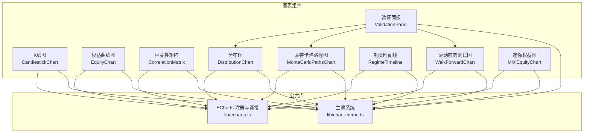
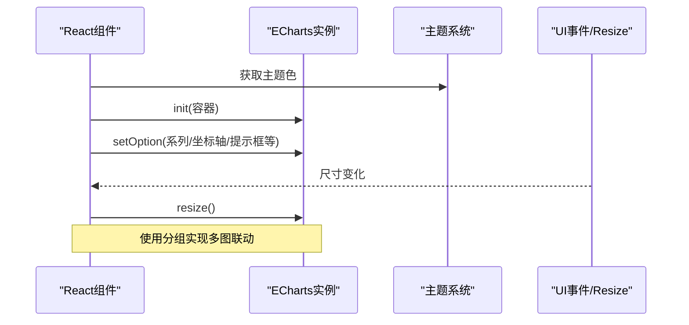
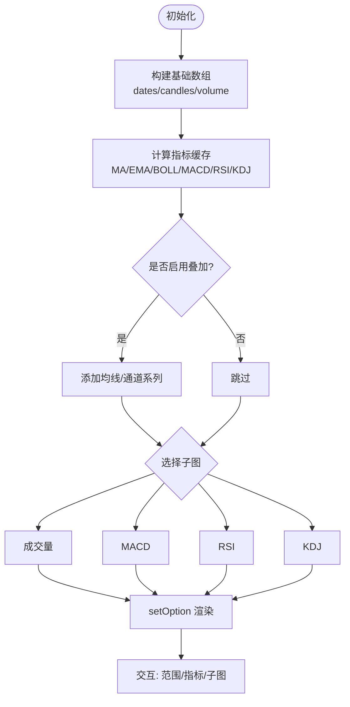
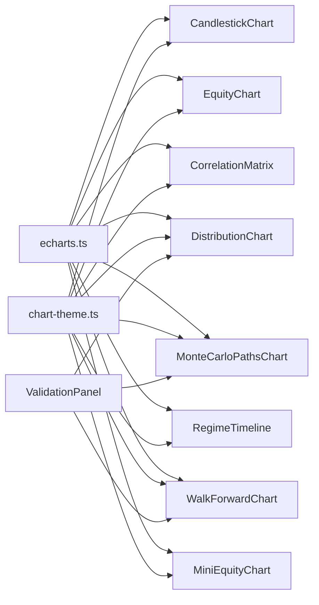

# 图表组件

<cite>
**本文引用的文件**
- [CandlestickChart.tsx](file://frontend/src/components/charts/CandlestickChart.tsx)
- [EquityChart.tsx](file://frontend/src/components/charts/EquityChart.tsx)
- [CorrelationMatrix.tsx](file://frontend/src/components/charts/CorrelationMatrix.tsx)
- [DistributionChart.tsx](file://frontend/src/components/charts/DistributionChart.tsx)
- [MonteCarloPathsChart.tsx](file://frontend/src/components/charts/MonteCarloPathsChart.tsx)
- [RegimeTimeline.tsx](file://frontend/src/components/charts/RegimeTimeline.tsx)
- [ValidationPanel.tsx](file://frontend/src/components/charts/ValidationPanel.tsx)
- [WalkForwardChart.tsx](file://frontend/src/components/charts/WalkForwardChart.tsx)
- [MiniEquityChart.tsx](file://frontend/src/components/charts/MiniEquityChart.tsx)
- [echarts.ts](file://frontend/src/lib/echarts.ts)
- [chart-theme.ts](file://frontend/src/lib/chart-theme.ts)
</cite>

## 目录
1. [简介](#简介)
2. [项目结构](#项目结构)
3. [核心组件](#核心组件)
4. [架构总览](#架构总览)
5. [详细组件分析](#详细组件分析)
6. [依赖关系分析](#依赖关系分析)
7. [性能考量](#性能考量)
8. [故障排查指南](#故障排查指南)
9. [结论](#结论)
10. [附录](#附录)

## 简介
本文件为 Vibe-Trading 前端应用的图表组件提供系统化文档，覆盖 K线图（CandlestickChart）、权益曲线图（EquityChart）、相关性矩阵（CorrelationMatrix）、分布图（DistributionChart）、蒙特卡洛路径图（MonteCarloPathsChart）、制度时间线（RegimeTimeline）、验证面板（ValidationPanel）、滚动前向测试图（WalkForwardChart）与迷你权益图（MiniEquityChart）。内容包含：
- 数据格式要求、配置选项、交互功能
- ECharts 集成方式与主题系统
- 性能优化策略与最佳实践
- 自定义图表开发指南

## 项目结构
图表组件集中于 frontend/src/components/charts，统一通过 lib/echarts 注册 ECharts 模块，并通过 lib/chart-theme 获取主题色。各组件遵循“受控 props + useEffect 初始化实例 + setOption 更新”的 React 模式，并使用 ResizeObserver 进行自适应。

**图示来源**
- [CandlestickChart.tsx:1-10](file://frontend/src/components/charts/CandlestickChart.tsx#L1-L10)
- [EquityChart.tsx:1-7](file://frontend/src/components/charts/EquityChart.tsx#L1-L7)
- [CorrelationMatrix.tsx:1-5](file://frontend/src/components/charts/CorrelationMatrix.tsx#L1-L5)
- [DistributionChart.tsx:1-5](file://frontend/src/components/charts/DistributionChart.tsx#L1-L5)
- [MonteCarloPathsChart.tsx:1-7](file://frontend/src/components/charts/MonteCarloPathsChart.tsx#L1-L7)
- [RegimeTimeline.tsx:1-6](file://frontend/src/components/charts/RegimeTimeline.tsx#L1-L6)
- [ValidationPanel.tsx:1-6](file://frontend/src/components/charts/ValidationPanel.tsx#L1-L6)
- [WalkForwardChart.tsx:1-6](file://frontend/src/components/charts/WalkForwardChart.tsx#L1-L6)
- [MiniEquityChart.tsx:1-4](file://frontend/src/components/charts/MiniEquityChart.tsx#L1-L4)
- [echarts.ts:1-37](file://frontend/src/lib/echarts.ts#L1-L37)
- [chart-theme.ts:1-66](file://frontend/src/lib/chart-theme.ts#L1-L66)

**章节来源**
- [CandlestickChart.tsx:1-329](file://frontend/src/components/charts/CandlestickChart.tsx#L1-L329)
- [EquityChart.tsx:1-125](file://frontend/src/components/charts/EquityChart.tsx#L1-L125)
- [CorrelationMatrix.tsx:1-123](file://frontend/src/components/charts/CorrelationMatrix.tsx#L1-L123)
- [DistributionChart.tsx:1-110](file://frontend/src/components/charts/DistributionChart.tsx#L1-L110)
- [MonteCarloPathsChart.tsx:1-140](file://frontend/src/components/charts/MonteCarloPathsChart.tsx#L1-L140)
- [RegimeTimeline.tsx:1-145](file://frontend/src/components/charts/RegimeTimeline.tsx#L1-L145)
- [ValidationPanel.tsx:1-237](file://frontend/src/components/charts/ValidationPanel.tsx#L1-L237)
- [WalkForwardChart.tsx:1-108](file://frontend/src/components/charts/WalkForwardChart.tsx#L1-L108)
- [MiniEquityChart.tsx:1-59](file://frontend/src/components/charts/MiniEquityChart.tsx#L1-L59)
- [echarts.ts:1-37](file://frontend/src/lib/echarts.ts#L1-L37)
- [chart-theme.ts:1-66](file://frontend/src/lib/chart-theme.ts#L1-L66)

## 核心组件
- CandlestickChart：K线图，支持多指标叠加、子图切换（成交量/MACD/RSI/KDJ）、时间范围筛选、交易标记点、工具栏缩放与导出。
- EquityChart：权益曲线与回撤百分比双轴图，带最大回撤标注。
- CorrelationMatrix：相关性热力图，支持颜色映射与标签显示。
- DistributionChart：模拟分布直方图，支持观测值标记线与置信区间带状区域。
- MonteCarloPathsChart：蒙特卡洛扇形图，展示样本路径、中位数与分位带。
- RegimeTimeline：制度切换时间线，展示密度、平滑曲线与进入/退出阈值。
- ValidationPanel：组合面板，聚合蒙特卡洛、Bootstrap 与滚动前向测试结果，含统计卡片与图表。
- WalkForwardChart：滚动前向测试窗口收益柱状图与夏普率折线。
- MiniEquityChart：迷你权益曲线，用于紧凑布局展示趋势。

**章节来源**
- [CandlestickChart.tsx:29-329](file://frontend/src/components/charts/CandlestickChart.tsx#L29-L329)
- [EquityChart.tsx:9-125](file://frontend/src/components/charts/EquityChart.tsx#L9-L125)
- [CorrelationMatrix.tsx:7-123](file://frontend/src/components/charts/CorrelationMatrix.tsx#L7-L123)
- [DistributionChart.tsx:6-110](file://frontend/src/components/charts/DistributionChart.tsx#L6-L110)
- [MonteCarloPathsChart.tsx:9-140](file://frontend/src/components/charts/MonteCarloPathsChart.tsx#L9-L140)
- [RegimeTimeline.tsx:8-145](file://frontend/src/components/charts/RegimeTimeline.tsx#L8-L145)
- [ValidationPanel.tsx:8-237](file://frontend/src/components/charts/ValidationPanel.tsx#L8-L237)
- [WalkForwardChart.tsx:10-108](file://frontend/src/components/charts/WalkForwardChart.tsx#L10-L108)
- [MiniEquityChart.tsx:6-59](file://frontend/src/components/charts/MiniEquityChart.tsx#L6-L59)

## 架构总览
所有图表均基于 ECharts 构建，通过统一的注册入口启用所需图表类型与组件，并共享主题系统。多个图表可加入同一分组以实现联动（如缩放同步）。

**图示来源**
- [echarts.ts:16-34](file://frontend/src/lib/echarts.ts#L16-L34)
- [chart-theme.ts:25-65](file://frontend/src/lib/chart-theme.ts#L25-L65)
- [CandlestickChart.tsx:87-110](file://frontend/src/components/charts/CandlestickChart.tsx#L87-L110)
- [EquityChart.tsx:18-24](file://frontend/src/components/charts/EquityChart.tsx#L18-L24)

## 详细组件分析

### K线图（CandlestickChart）
- 数据格式
  - data: PriceBar[]，字段包含 time/open/high/low/close/volume
  - markers?: TradeMarker[]，字段包含 time/price/side/qty/reason
  - indicators?: Record<string, IndicatorPoint[]>，按时间对齐的值序列
- 配置选项
  - 时间范围：1M/3M/6M/1Y/ALL，控制可见K线数量
  - 叠加指标：MA5/10/20/60、EMA12/26、BOLL通道
  - 子图：vol/macd/rsi/kdj
  - 工具栏：保存图片、缩放、还原
- 交互功能
  - 时间范围按钮切换
  - 指标下拉菜单勾选/取消
  - 子图切换按钮
  - 鼠标悬停提示框显示OHLC、涨跌幅、成交量、指标值
  - 交易标记点（买入/卖出）
- 性能优化
  - useMemo 缓存基础数组与指标计算结果
  - Map 查找后端指标值 O(1)
  - ResizeObserver + requestAnimationFrame 防抖 resize
  - 仅 setOption 不销毁实例
  - 数据缩放 slider 限制渲染范围

**图示来源**
- [CandlestickChart.tsx:53-85](file://frontend/src/components/charts/CandlestickChart.tsx#L53-L85)
- [CandlestickChart.tsx:112-268](file://frontend/src/components/charts/CandlestickChart.tsx#L112-L268)

**章节来源**
- [CandlestickChart.tsx:29-329](file://frontend/src/components/charts/CandlestickChart.tsx#L29-L329)

### 权益曲线图（EquityChart）
- 数据格式
  - data: EquityPoint[]，字段包含 time/equity/drawdown
- 配置选项
  - 双轴：权益（数值轴）与回撤百分比（百分比轴）
  - 最大回撤标注线
- 交互功能
  - 提示框显示日期、权益与回撤
  - 工具栏保存图片与重置
- 性能优化
  - ResizeObserver + rAF 防抖
  - 避免重复创建实例

**章节来源**
- [EquityChart.tsx:9-125](file://frontend/src/components/charts/EquityChart.tsx#L9-L125)

### 相关性矩阵（CorrelationMatrix）
- 数据格式
  - labels: string[]
  - matrix: number[][]，对称相关系数矩阵
- 配置选项
  - visualMap 颜色映射 [-1, 1]
  - 小矩阵时显示单元格数值标签
- 交互功能
  - 提示框显示两资产相关系数
  - 高亮强调
- 性能优化
  - 仅在数据或主题变化时重建

**章节来源**
- [CorrelationMatrix.tsx:7-123](file://frontend/src/components/charts/CorrelationMatrix.tsx#L7-L123)

### 分布图（DistributionChart）
- 数据格式
  - samples: number[]，模拟样本
  - markerValue: number，观测值
  - markerLabel: string，观测值标签
  - bandFrom/bandTo/bandLabel?: 可选置信区间
- 配置选项
  - 自动分箱数与宽度
  - 垂直标记线与可选面积带
- 交互功能
  - 提示框显示区间计数
- 性能优化
  - 简单直方图计算，无复杂动画

**章节来源**
- [DistributionChart.tsx:6-110](file://frontend/src/components/charts/DistributionChart.tsx#L6-L110)

### 蒙特卡洛路径图（MonteCarloPathsChart）
- 数据格式
  - paths.steps: number[]，交易序号
  - paths.samples: number[][]，多条模拟路径
  - paths.band_p5/p25/p50/p75/p95: number[]，分位带与中位数
  - paths.actual: number[]，实际路径
- 配置选项
  - 扇形带：P5–P95、P25–P75
  - 中位数虚线、实际路径粗线
- 交互功能
  - 提示框显示步骤与数值
- 性能优化
  - 样本路径关闭动画与交互以提升性能
  - 堆叠 area 实现半透明带

**章节来源**
- [MonteCarloPathsChart.tsx:9-140](file://frontend/src/components/charts/MonteCarloPathsChart.tsx#L9-L140)

### 制度时间线（RegimeTimeline）
- 数据格式
  - data.dates: string[]，时间轴
  - data.density: number[]，制度密度
  - data.smoothed: number[]，平滑后密度
  - data.episodes: {start,end}[]，制度片段
  - data.params.enter_threshold/exit_threshold: 阈值
- 配置选项
  - 两条线：密度与平滑密度
  - 区域标注制度片段
  - 水平阈值线及标签
- 交互功能
  - 提示框显示日期与各系列值
- 性能优化
  - 仅数据变化时重建

**章节来源**
- [RegimeTimeline.tsx:8-145](file://frontend/src/components/charts/RegimeTimeline.tsx#L8-L145)

### 验证面板（ValidationPanel）
- 数据格式
  - data.monte_carlo / bootstrap / walk_forward 三块可选
  - 每块包含统计指标与可选图表数据
- 配置选项
  - compact?: boolean，紧凑模式去边框与内边距
- 交互功能
  - 统计卡片展示关键指标
  - 根据数据可用性切换图表或降级展示（进度条）
- 性能优化
  - 按需渲染子图表，避免空数据绘制

**章节来源**
- [ValidationPanel.tsx:8-237](file://frontend/src/components/charts/ValidationPanel.tsx#L8-L237)

### 滚动前向测试图（WalkForwardChart）
- 数据格式
  - windows: Window[]，每个窗口包含 window/start/end/return/sharpe/max_dd/trades/win_rate
- 配置选项
  - 双轴：收益百分比柱状图与夏普率折线
- 交互功能
  - 提示框显示窗口区间与指标
- 性能优化
  - 简单柱状+折线，无复杂动画

**章节来源**
- [WalkForwardChart.tsx:10-108](file://frontend/src/components/charts/WalkForwardChart.tsx#L10-L108)

### 迷你权益图（MiniEquityChart）
- 数据格式
  - data: {time, equity}[]，至少两个点
- 配置选项
  - 隐藏坐标轴，仅展示趋势线
  - 根据首尾差决定颜色
- 交互功能
  - 无交互，纯展示
- 性能优化
  - 轻量级单一线系列

**章节来源**
- [MiniEquityChart.tsx:6-59](file://frontend/src/components/charts/MiniEquityChart.tsx#L6-L59)

## 依赖关系分析
- ECharts 注册与连接
  - 统一在 lib/echarts.ts 注册所需图表与组件，并提供 connectCharts 将多个图表加入同一分组以联动
- 主题系统
  - lib/chart-theme.ts 从 CSS 变量读取颜色，区分明暗主题与中文本地化下的涨跌色反转
- 组件耦合
  - ValidationPanel 组合 DistributionChart、MonteCarloPathsChart、WalkForwardChart
  - 其他图表独立，仅依赖 echarts 与 chart-theme

**图示来源**
- [echarts.ts:16-34](file://frontend/src/lib/echarts.ts#L16-L34)
- [chart-theme.ts:25-65](file://frontend/src/lib/chart-theme.ts#L25-L65)
- [ValidationPanel.tsx:4-6](file://frontend/src/components/charts/ValidationPanel.tsx#L4-L6)

**章节来源**
- [echarts.ts:1-37](file://frontend/src/lib/echarts.ts#L1-37)
- [chart-theme.ts:1-66](file://frontend/src/lib/chart-theme.ts#L1-L66)
- [ValidationPanel.tsx:1-237](file://frontend/src/components/charts/ValidationPanel.tsx#L1-L237)

## 性能考量
- 实例复用与增量更新
  - 所有图表在首次挂载时创建 ECharts 实例，后续通过 setOption 更新，避免频繁销毁重建
- 响应式优化
  - 使用 ResizeObserver + requestAnimationFrame 防抖 resize，减少重绘开销
- 数据预处理与缓存
  - CandlestickChart 使用 useMemo 缓存基础数组与指标计算；后端指标通过 Map 做 O(1) 查找
- 渲染优化
  - 大量样本路径关闭动画与交互（MonteCarloPathsChart）
  - 合理的数据缩放（dataZoom）限制可视范围，降低渲染压力
- 主题与国际化
  - 主题缓存避免重复计算；中文本地化下涨跌色反转提升可读性

[本节为通用指导，无需特定文件引用]

## 故障排查指南
- 图表不显示
  - 检查传入数据是否为空或长度不足（如 MiniEquityChart 需要至少两个点）
  - 确认容器高度已设置且可见
- 主题颜色异常
  - 检查 CSS 变量是否正确定义（--success/--danger/--info/--warning/--chart-grid/--chart-text/--chart-axis）
  - 明暗主题切换后需重新获取主题
- 联动失效
  - 确保调用 connectCharts 并将图表加入同一分组（CHART_GROUP）
- 性能卡顿
  - 减少同时渲染的图表数量
  - 对大数据集启用 dataZoom 限制可视范围
  - 关闭不必要的动画与交互

**章节来源**
- [MiniEquityChart.tsx:15-18](file://frontend/src/components/charts/MiniEquityChart.tsx#L15-L18)
- [chart-theme.ts:25-65](file://frontend/src/lib/chart-theme.ts#L25-L65)
- [echarts.ts:25-34](file://frontend/src/lib/echarts.ts#L25-L34)
- [CandlestickChart.tsx:206-256](file://frontend/src/components/charts/CandlestickChart.tsx#L206-L256)

## 结论
本套图表组件基于 ECharts 构建了统一的前端可视化体系，具备丰富的交互能力与良好的性能表现。通过主题系统与模块化注册，保证了视觉一致性与扩展性。建议在实际使用中遵循数据预处理、实例复用与响应式优化的最佳实践，以获得流畅的用户体验。

[本节为总结，无需特定文件引用]

## 附录

### ECharts 集成要点
- 注册图表与组件：在 lib/echarts.ts 中引入所需图表类型与组件，并启用 CanvasRenderer
- 多图联动：通过 CHART_GROUP 与 connectCharts 将多个图表加入同一分组
- 主题接入：通过 getChartTheme 获取主题对象，应用到 tooltip/grid/axis/series 等配置

**章节来源**
- [echarts.ts:1-37](file://frontend/src/lib/echarts.ts#L1-L37)
- [chart-theme.ts:25-65](file://frontend/src/lib/chart-theme.ts#L25-L65)

### 数据可视化最佳实践
- 数据归一化与格式化：统一数值精度与单位（如百分比、金额缩写）
- 交互设计：提供清晰的提示框、图例与工具栏操作
- 可访问性：保证对比度与键盘可达性（如需）
- 错误边界：空数据与异常数据的降级展示

[本节为通用指导，无需特定文件引用]

### 自定义图表开发指南
- 新建组件：在 charts 目录下新增 .tsx 文件，遵循 props 接口定义
- 初始化实例：useEffect 中 init ECharts，记录 ref，并在清理函数中 dispose
- 主题应用：使用 getChartTheme 获取颜色，保持风格一致
- 响应式：使用 ResizeObserver 监听容器尺寸变化
- 性能：优先使用 setOption 增量更新，必要时禁用动画与交互

**章节来源**
- [CandlestickChart.tsx:87-110](file://frontend/src/components/charts/CandlestickChart.tsx#L87-L110)
- [EquityChart.tsx:18-24](file://frontend/src/components/charts/EquityChart.tsx#L18-L24)
- [chart-theme.ts:25-65](file://frontend/src/lib/chart-theme.ts#L25-L65)