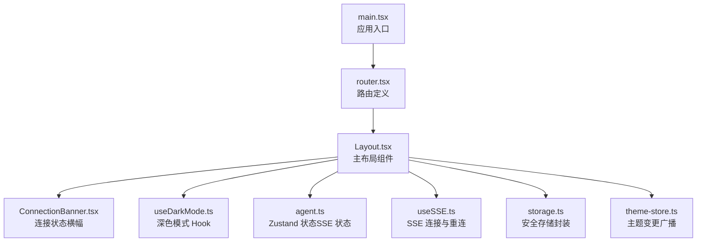
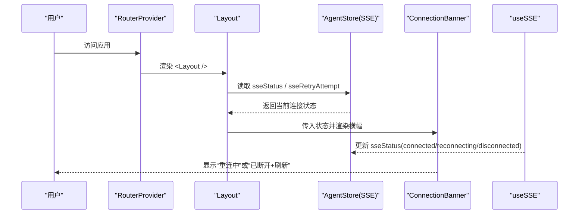
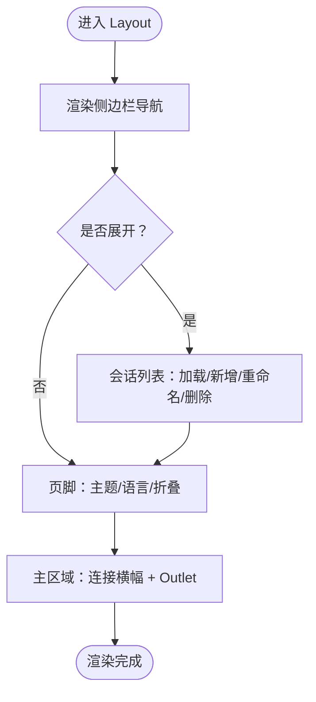
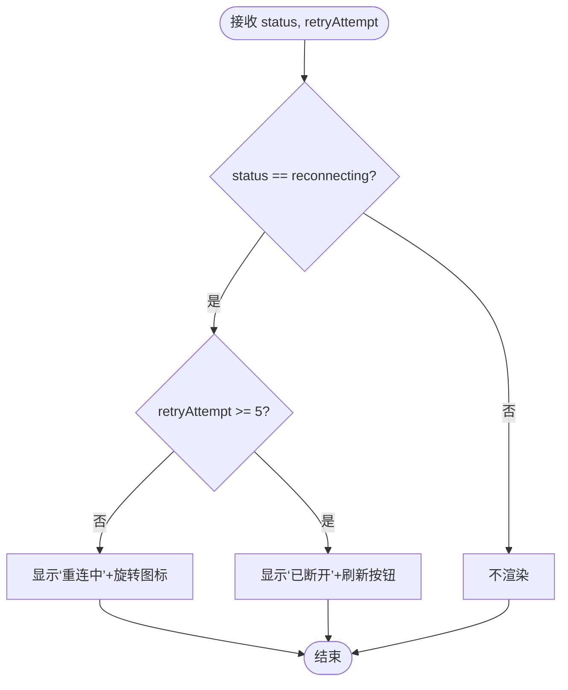
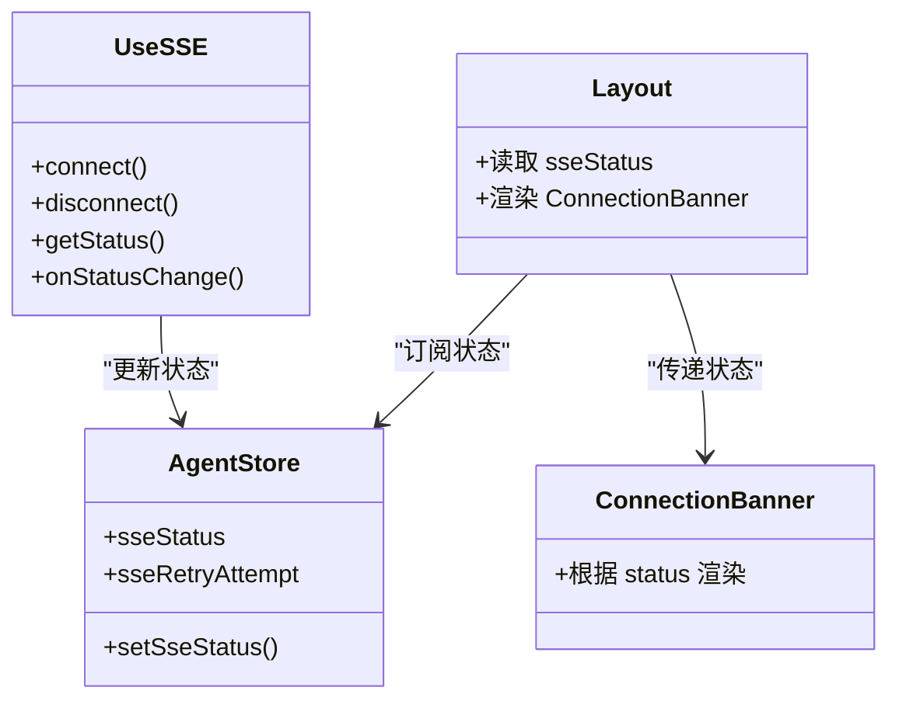
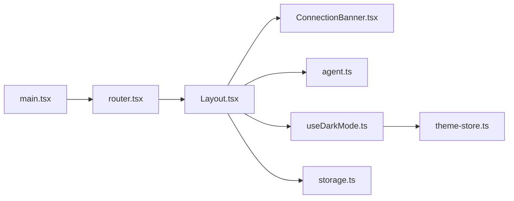

# 布局组件

<cite>
**本文引用的文件**
- [Layout.tsx](file://frontend/src/components/layout/Layout.tsx)
- [ConnectionBanner.tsx](file://frontend/src/components/layout/ConnectionBanner.tsx)
- [router.tsx](file://frontend/src/router.tsx)
- [main.tsx](file://frontend/src/main.tsx)
- [useSSE.ts](file://frontend/src/hooks/useSSE.ts)
- [agent.ts](file://frontend/src/stores/agent.ts)
- [useDarkMode.ts](file://frontend/src/hooks/useDarkMode.ts)
- [theme-store.ts](file://frontend/src/lib/theme-store.ts)
- [storage.ts](file://frontend/src/lib/storage.ts)
- [Layout.test.tsx](file://frontend/src/components/layout/__tests__/Layout.test.tsx)
- [ConnectionBanner.test.tsx](file://frontend/src/components/layout/__tests__/ConnectionBanner.test.tsx)
</cite>

## 目录
1. [简介](#简介)
2. [项目结构](#项目结构)
3. [核心组件](#核心组件)
4. [架构总览](#架构总览)
5. [详细组件分析](#详细组件分析)
6. [依赖关系分析](#依赖关系分析)
7. [性能与内存优化](#性能与内存优化)
8. [故障排查指南](#故障排查指南)
9. [结论](#结论)
10. [附录：定制与扩展指南](#附录定制与扩展指南)

## 简介
本文件聚焦 Vibe-Trading 前端应用的布局层，系统性说明主布局组件 Layout 的响应式实现、页面结构与路由集成；连接状态横幅 ConnectionBanner 的网络状态检测、用户提示与自动重连机制；以及布局的状态管理、移动端适配、主题切换、国际化语言切换等能力。同时给出性能优化建议、内存管理与浏览器兼容性注意事项，并提供可操作的定制与扩展示例路径。

## 项目结构
布局相关代码位于 frontend/src/components/layout，配合路由配置与全局入口完成整体装配。

图表来源
- [main.tsx:28-35](file://frontend/src/main.tsx#L28-L35)
- [router.tsx:48-67](file://frontend/src/router.tsx#L48-L67)
- [Layout.tsx:17-315](file://frontend/src/components/layout/Layout.tsx#L17-L315)
- [ConnectionBanner.tsx:10-43](file://frontend/src/components/layout/ConnectionBanner.tsx#L10-L43)
- [useDarkMode.ts:23-79](file://frontend/src/hooks/useDarkMode.ts#L23-L79)
- [agent.ts:60-114](file://frontend/src/stores/agent.ts#L60-L114)
- [useSSE.ts:27-215](file://frontend/src/hooks/useSSE.ts#L27-L215)
- [storage.ts:7-29](file://frontend/src/lib/storage.ts#L7-L29)
- [theme-store.ts:10-27](file://frontend/src/lib/theme-store.ts#L10-L27)

章节来源
- [main.tsx:1-36](file://frontend/src/main.tsx#L1-L36)
- [router.tsx:1-69](file://frontend/src/router.tsx#L1-L69)

## 核心组件
- 主布局 Layout：提供侧边栏导航、会话列表、页脚工具（主题切换、语言切换、折叠/展开）、顶部连接横幅占位与 Outlet 内容区。支持响应式宽度变化、移动端隐藏文本、多标签页同步折叠偏好。
- 连接状态横幅 ConnectionBanner：基于 SSE 状态展示“重连中”或“已断开”，并在多次重试后引导刷新。

章节来源
- [Layout.tsx:17-315](file://frontend/src/components/layout/Layout.tsx#L17-L315)
- [ConnectionBanner.tsx:10-43](file://frontend/src/components/layout/ConnectionBanner.tsx#L10-L43)

## 架构总览
布局通过路由包裹所有页面，使用 Zustand 订阅 SSE 连接状态，结合 useSSE 的重连策略驱动横幅显示。主题与语言切换由独立模块负责，并通过事件或外部存储跨组件同步。

图表来源
- [main.tsx:28-35](file://frontend/src/main.tsx#L28-L35)
- [router.tsx:48-67](file://frontend/src/router.tsx#L48-L67)
- [Layout.tsx:306-312](file://frontend/src/components/layout/Layout.tsx#L306-L312)
- [agent.ts:76-108](file://frontend/src/stores/agent.ts#L76-L108)
- [useSSE.ts:158-174](file://frontend/src/hooks/useSSE.ts#L158-L174)
- [ConnectionBanner.tsx:10-43](file://frontend/src/components/layout/ConnectionBanner.tsx#L10-L43)

## 详细组件分析

### 主布局 Layout
- 响应式设计与移动端适配
  - 侧边栏在移动端默认窄条，展开时显示完整导航与会话列表；通过 CSS 类名控制宽度与可见性，确保小屏可用性与可读性。
  - 折叠态下仅保留图标与必要操作，标题以 title 提示，提升可访问性。
- 页面结构与路由集成
  - 使用 react-router 的 Outlet 渲染子页面；路由表将多个业务页面挂载到 Layout 之下，统一外壳。
  - 导航项根据当前 pathname 高亮，支持“/”与“/agent”双入口对齐。
- 会话列表与交互
  - 加载会话列表，支持新建、重命名、删除；活跃会话高亮，流式会话显示旋转指示器。
  - 监听自定义事件刷新会话列表，保证标题自动更新后视图一致。
- 主题切换与国际化
  - 深色模式通过 useDarkMode 持久化至本地存储，并广播主题变更供其他组件订阅。
  - 语言切换器使用固定定位菜单，避免被父级 overflow 影响；选择语言后调用 i18n 切换并处理 RTL 方向。
- 可访问性
  - 提供“跳过到主内容”链接；为侧边栏、导航、品牌、主区域设置语义化角色与标签；按钮具备 aria-expanded 等属性。

图表来源
- [Layout.tsx:97-315](file://frontend/src/components/layout/Layout.tsx#L97-L315)

章节来源
- [Layout.tsx:17-315](file://frontend/src/components/layout/Layout.tsx#L17-L315)
- [Layout.test.tsx:88-147](file://frontend/src/components/layout/__tests__/Layout.test.tsx#L88-L147)

### 连接状态横幅 ConnectionBanner
- 网络状态检测与提示
  - 仅当状态为“reconnecting”时显示横幅；超过阈值（如 5 次重试）进入“终端断开”态，提供刷新按钮。
  - 使用 i18n 文案，保持多语言一致性。
- 自动重连机制
  - 横幅本身不发起重连，而是消费来自 agent store 的 SSE 状态；实际重连逻辑在 useSSE 中实现（指数退避、去重、Last-Event-ID 续传）。
- 用户体验
  - 重连中显示旋转图标与尝试次数；断开时提供明确操作“刷新页面”。

图表来源
- [ConnectionBanner.tsx:10-43](file://frontend/src/components/layout/ConnectionBanner.tsx#L10-L43)
- [useSSE.ts:158-174](file://frontend/src/hooks/useSSE.ts#L158-L174)

章节来源
- [ConnectionBanner.tsx:10-43](file://frontend/src/components/layout/ConnectionBanner.tsx#L10-L43)
- [ConnectionBanner.test.tsx:5-51](file://frontend/src/components/layout/__tests__/ConnectionBanner.test.tsx#L5-L51)

### 状态管理与 SSE 集成
- Agent Store（Zustand）
  - 维护 sseStatus 与 sseRetryAttempt，供布局与横幅消费；提供 setSseStatus 方法用于更新。
- useSSE Hook
  - 实现自动重连、指数退避、事件去重、Last-Event-ID 续传；错误时调度重连并回调“reconnect”事件。
- 数据流
  - useSSE 内部出错 -> 调度重连 -> 更新 store.sseStatus -> Layout 读取 -> ConnectionBanner 渲染。

图表来源
- [agent.ts:60-114](file://frontend/src/stores/agent.ts#L60-L114)
- [useSSE.ts:27-215](file://frontend/src/hooks/useSSE.ts#L27-L215)
- [Layout.tsx:306-312](file://frontend/src/components/layout/Layout.tsx#L306-L312)
- [ConnectionBanner.tsx:10-43](file://frontend/src/components/layout/ConnectionBanner.tsx#L10-L43)

章节来源
- [agent.ts:60-114](file://frontend/src/stores/agent.ts#L60-L114)
- [useSSE.ts:27-215](file://frontend/src/hooks/useSSE.ts#L27-L215)

### 主题切换与国际化
- 主题切换
  - useDarkMode 从本地存储恢复偏好，监听系统主题变化，切换时向 theme-store 广播变更，供图表等订阅者刷新。
- 语言切换
  - LanguageSwitcher 使用固定定位弹出菜单，避免被父容器 overflow 裁剪；切换语言后调用 i18n.changeLanguage，并处理 RTL 方向。

章节来源
- [useDarkMode.ts:23-79](file://frontend/src/hooks/useDarkMode.ts#L23-L79)
- [theme-store.ts:10-27](file://frontend/src/lib/theme-store.ts#L10-L27)
- [Layout.tsx:317-458](file://frontend/src/components/layout/Layout.tsx#L317-L458)

## 依赖关系分析
- 路由与入口
  - main.tsx 注入 RouterProvider，router.tsx 定义路由并将 Layout 作为外层壳，子页面懒加载。
- 布局与横幅
  - Layout 依赖 agent store 的 SSE 状态，渲染 ConnectionBanner。
- 主题与存储
  - useDarkMode 依赖 storage 安全读写，并通过 theme-store 广播主题变更。
- 国际化
  - Layout 内嵌语言切换器，依赖 i18n 配置与 SUPPORTED_LANGUAGES。

图表来源
- [main.tsx:28-35](file://frontend/src/main.tsx#L28-L35)
- [router.tsx:48-67](file://frontend/src/router.tsx#L48-L67)
- [Layout.tsx:17-315](file://frontend/src/components/layout/Layout.tsx#L17-L315)
- [ConnectionBanner.tsx:10-43](file://frontend/src/components/layout/ConnectionBanner.tsx#L10-L43)
- [useDarkMode.ts:23-79](file://frontend/src/hooks/useDarkMode.ts#L23-L79)
- [theme-store.ts:10-27](file://frontend/src/lib/theme-store.ts#L10-L27)
- [storage.ts:7-29](file://frontend/src/lib/storage.ts#L7-L29)

章节来源
- [router.tsx:1-69](file://frontend/src/router.tsx#L1-L69)
- [main.tsx:1-36](file://frontend/src/main.tsx#L1-L36)

## 性能与内存优化
- 路由懒加载与 Suspense
  - 页面组件通过 lazy 与 Suspense 包裹，减少首屏体积，提升启动速度。
- 预取优化
  - 应用入口使用 requestIdleCallback 空闲时预取图表模块，降低首次渲染阻塞。
- 事件去重与续传
  - useSSE 对事件进行 LRU 去重，并使用 Last-Event-ID 断点续传，减少重复处理与数据丢失风险。
- 本地存储安全
  - 通过 safeGet/safeSet 包装 localStorage，避免受限环境抛错导致白屏。
- 主题与图表刷新
  - 主题变更通过 theme-store 广播，图表等订阅者按需刷新，避免全量重建。
- 内存管理
  - 会话缓存限制最大数量，避免无限增长；清理定时器与事件监听，防止泄漏。

章节来源
- [router.tsx:5-30](file://frontend/src/router.tsx#L5-L30)
- [main.tsx:11-26](file://frontend/src/main.tsx#L11-L26)
- [useSSE.ts:40-56](file://frontend/src/hooks/useSSE.ts#L40-L56)
- [storage.ts:1-29](file://frontend/src/lib/storage.ts#L1-L29)
- [theme-store.ts:10-27](file://frontend/src/lib/theme-store.ts#L10-L27)

## 故障排查指南
- 连接问题
  - 现象：横幅持续显示“重连中”或最终“已断开”。
  - 排查：检查后端 SSE 服务可用性；确认 useSSE 的重试参数与退避策略；查看浏览器控制台是否有鉴权失败或网络错误。
- 主题不同步
  - 现象：切换主题后图表未更新。
  - 排查：确认组件通过 theme-store 订阅了主题变更；检查 document.documentElement.classList 是否正确切换。
- 语言切换无效
  - 现象：切换语言后界面未变化或方向异常。
  - 排查：确认 i18n.changeLanguage 成功；检查 RTL 语言是否设置了正确的 dir/lang。
- 本地存储不可用
  - 现象：主题或侧边栏折叠状态不持久。
  - 排查：确认运行环境允许 localStorage；必要时降级为内存状态。

章节来源
- [ConnectionBanner.tsx:10-43](file://frontend/src/components/layout/ConnectionBanner.tsx#L10-L43)
- [useSSE.ts:158-174](file://frontend/src/hooks/useSSE.ts#L158-L174)
- [theme-store.ts:10-27](file://frontend/src/lib/theme-store.ts#L10-L27)
- [storage.ts:1-29](file://frontend/src/lib/storage.ts#L1-L29)

## 结论
Layout 与 ConnectionBanner 共同构成了 Vibe-Trading 的前端布局基座：前者提供响应式导航、会话管理与主题/语言切换，后者保障连接状态的可视化与容错体验。借助 Zustand 与 useSSE 的组合，系统在弱网环境下具备稳健的重连与续传能力；通过懒加载、预取与安全存储等手段，兼顾性能与鲁棒性。

## 附录：定制与扩展指南
- 扩展导航项
  - 在 Layout 的导航数组中添加新的 to、icon、label，即可在侧边栏显示新入口。
  - 参考路径：[Layout.tsx:22-30](file://frontend/src/components/layout/Layout.tsx#L22-L30)
- 调整横幅阈值与文案
  - 修改 ConnectionBanner 的重试阈值与 i18n 键值，以匹配产品需求。
  - 参考路径：[ConnectionBanner.tsx:16-40](file://frontend/src/components/layout/ConnectionBanner.tsx#L16-L40)
- 自定义 SSE 行为
  - 调整 useSSE 的重试初始延迟、最大延迟、退避因子与去重容量，以适应不同网络环境。
  - 参考路径：[useSSE.ts:20-25](file://frontend/src/hooks/useSSE.ts#L20-L25)
- 主题与图表联动
  - 在需要响应主题的组件中使用 theme-store 的订阅接口，以便在主题切换时刷新图表实例。
  - 参考路径：[theme-store.ts:20-27](file://frontend/src/lib/theme-store.ts#L20-L27)
- 国际化语言列表
  - 在 SUPPORTED_LANGUAGES 中注册新语言，并确保对应翻译键存在。
  - 参考路径：[Layout.tsx:392-402](file://frontend/src/components/layout/Layout.tsx#L392-L402)