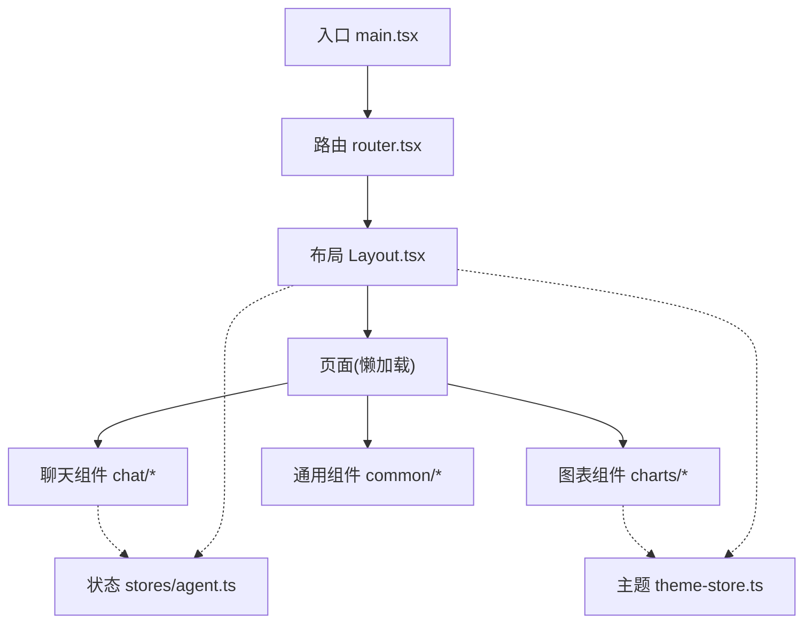
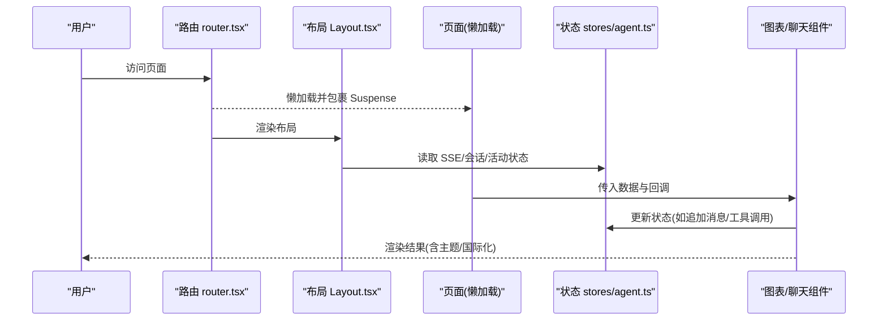
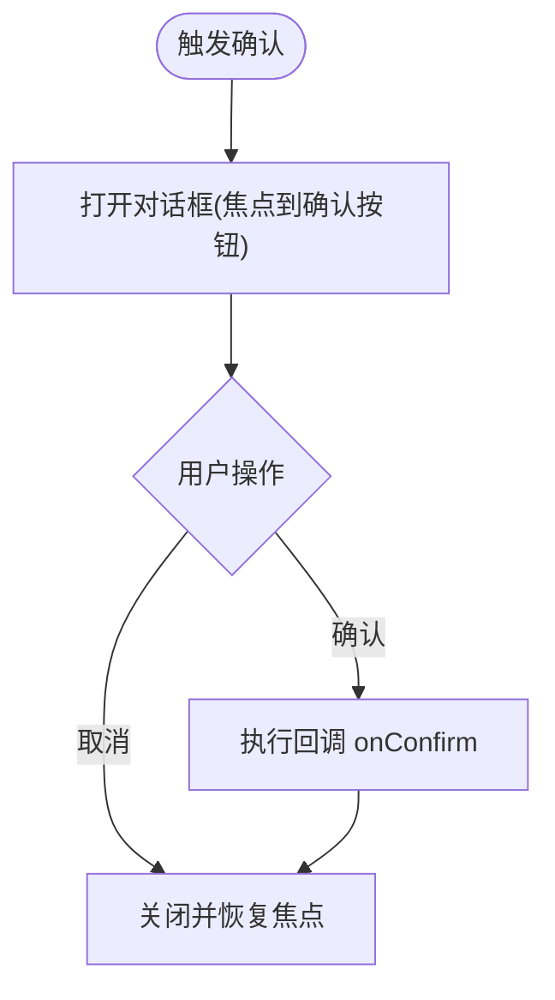
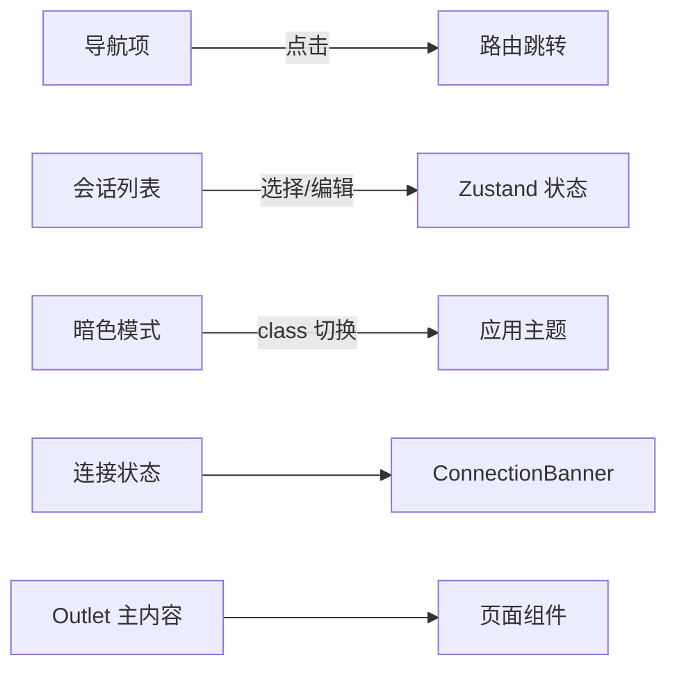
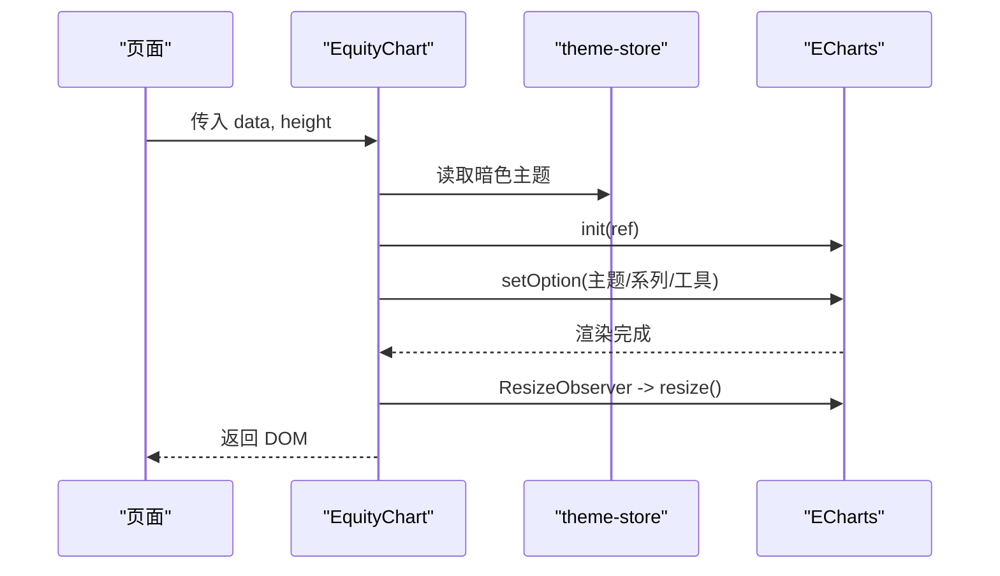
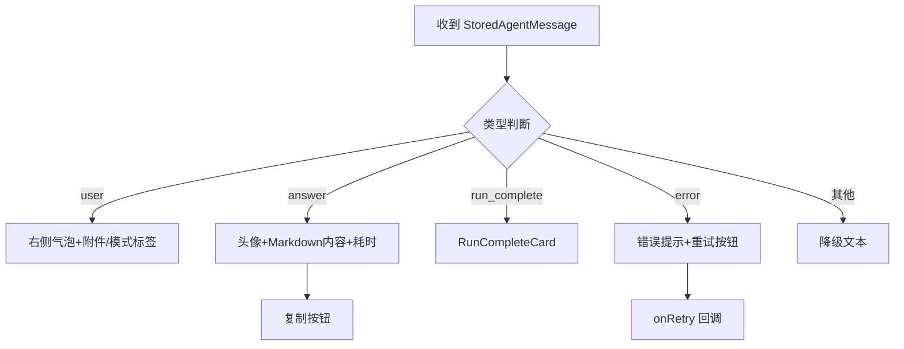
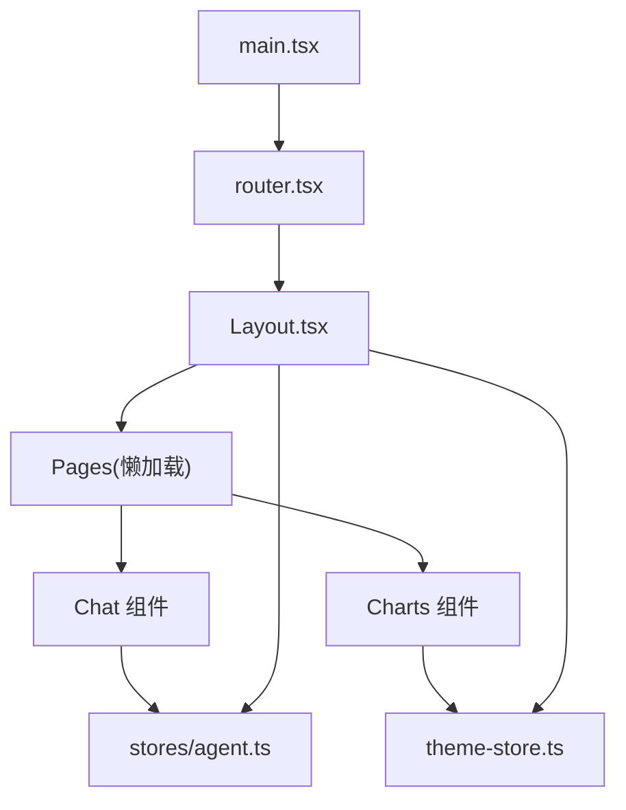

# 组件架构

<cite>
**本文引用的文件**
- [frontend/package.json](file://frontend/package.json)
- [frontend/src/main.tsx](file://frontend/src/main.tsx)
- [frontend/src/router.tsx](file://frontend/src/router.tsx)
- [frontend/src/components/layout/Layout.tsx](file://frontend/src/components/layout/Layout.tsx)
- [frontend/src/components/common/ErrorBoundary.tsx](file://frontend/src/components/common/ErrorBoundary.tsx)
- [frontend/src/components/common/Skeleton.tsx](file://frontend/src/components/common/Skeleton.tsx)
- [frontend/src/components/common/ConfirmDialog.tsx](file://frontend/src/components/common/ConfirmDialog.tsx)
- [frontend/src/components/charts/EquityChart.tsx](file://frontend/src/components/charts/EquityChart.tsx)
- [frontend/src/components/chat/MessageBubble.tsx](file://frontend/src/components/chat/MessageBubble.tsx)
- [frontend/src/stores/agent.ts](file://frontend/src/stores/agent.ts)
- [frontend/src/lib/theme-store.ts](file://frontend/src/lib/theme-store.ts)
- [frontend/tailwind.config.ts](file://frontend/tailwind.config.ts)
</cite>

## 目录
1. [简介](#简介)
2. [项目结构](#项目结构)
3. [核心组件](#核心组件)
4. [架构总览](#架构总览)
5. [详细组件分析](#详细组件分析)
6. [依赖关系分析](#依赖关系分析)
7. [性能考量](#性能考量)
8. [故障排查指南](#故障排查指南)
9. [结论](#结论)
10. [附录](#附录)

## 简介
本文件聚焦 Vibe-Trading 前端应用的 React 组件架构，系统梳理通用组件（common）、布局组件（layout）、图表组件（charts）与聊天组件（chat）的设计原则、组织模式与复用策略。文档同时说明组件间依赖关系、数据流向与通信机制，覆盖样式系统与主题定制方案，并给出错误边界处理、骨架屏加载与响应式设计的实现要点，以及面向开发者的最佳实践与性能优化建议。

## 项目结构
前端采用基于功能域的目录组织：
- components/common：可复用的基础 UI 能力（错误边界、骨架屏、确认对话框等）
- components/layout：应用级布局与导航（侧边栏、主内容区、连接状态横幅等）
- components/charts：基于 ECharts 的金融可视化组件（权益曲线、回撤、K线等）
- components/chat：对话交互与运行态展示（消息气泡、进度、工具调用、Swarm 面板等）
- stores：全局状态（Zustand），承载会话、流式文本、活动状态、SSE 连接等
- lib：共享能力（API、主题、图表主题、格式化、存储等）
- pages：页面级路由组件（懒加载）
- router：路由配置与页面懒加载包装

**图示来源**
- [frontend/src/main.tsx:1-36](file://frontend/src/main.tsx#L1-L36)
- [frontend/src/router.tsx:1-69](file://frontend/src/router.tsx#L1-L69)
- [frontend/src/components/layout/Layout.tsx:1-458](file://frontend/src/components/layout/Layout.tsx#L1-L458)

**章节来源**
- [frontend/package.json:1-58](file://frontend/package.json#L1-L58)
- [frontend/src/main.tsx:1-36](file://frontend/src/main.tsx#L1-L36)
- [frontend/src/router.tsx:1-69](file://frontend/src/router.tsx#L1-L69)

## 核心组件
- 错误边界 ErrorBoundary：捕获渲染期异常并提供降级 UI，支持自定义 fallback。
- 骨架屏 Skeleton：提供基础骨架与组合骨架（指标、图表占位）。
- 确认对话框 ConfirmDialog：无依赖的最小化二次确认弹窗，含焦点管理与键盘无障碍。
- 布局 Layout：侧边栏导航、会话列表、语言切换、暗色模式、连接状态横幅与主内容区。
- 图表 EquityChart：基于 ECharts 的权益与回撤双轴图，支持主题联动与自适应尺寸。
- 聊天 MessageBubble：用户/助手消息、Markdown 渲染、复制、重试提示、运行完成卡片等。
- 状态 agent store：会话消息、流式增量、工具调用、活动状态、SSE 连接状态、Swarm 状态缓存等。
- 主题 theme-store：集中订阅 HTML 根节点 dark class 变化，供图表与高亮等外部库同步主题。

**章节来源**
- [frontend/src/components/common/ErrorBoundary.tsx:1-27](file://frontend/src/components/common/ErrorBoundary.tsx#L1-L27)
- [frontend/src/components/common/Skeleton.tsx:1-23](file://frontend/src/components/common/Skeleton.tsx#L1-L23)
- [frontend/src/components/common/ConfirmDialog.tsx:1-128](file://frontend/src/components/common/ConfirmDialog.tsx#L1-L128)
- [frontend/src/components/layout/Layout.tsx:1-458](file://frontend/src/components/layout/Layout.tsx#L1-L458)
- [frontend/src/components/charts/EquityChart.tsx:1-125](file://frontend/src/components/charts/EquityChart.tsx#L1-L125)
- [frontend/src/components/chat/MessageBubble.tsx:1-289](file://frontend/src/components/chat/MessageBubble.tsx#L1-L289)
- [frontend/src/stores/agent.ts:1-336](file://frontend/src/stores/agent.ts#L1-L336)
- [frontend/src/lib/theme-store.ts:1-28](file://frontend/src/lib/theme-store.ts#L1-L28)

## 架构总览
应用以 React Router 作为路由层，通过 Suspense + lazy 实现页面级代码分割；Layout 作为外层容器，承载侧边栏、连接状态与 Outlet；业务页面按需加载并消费 Zustand 状态；图表与聊天组件通过主题与状态进行数据驱动渲染。

**图示来源**
- [frontend/src/router.tsx:1-69](file://frontend/src/router.tsx#L1-L69)
- [frontend/src/components/layout/Layout.tsx:1-458](file://frontend/src/components/layout/Layout.tsx#L1-L458)
- [frontend/src/stores/agent.ts:1-336](file://frontend/src/stores/agent.ts#L1-L336)

## 详细组件分析

### 通用组件（common）
- 错误边界
  - 职责：捕获子树渲染异常，提供默认或自定义降级 UI。
  - 设计要点：使用类组件生命周期获取错误；支持 props.fallback；结合 i18n 显示文案。
  - 适用场景：全局包裹路由或关键模块，防止白屏。
- 骨架屏
  - 职责：在数据未就绪时提供占位动画，提升感知性能。
  - 设计要点：基础骨架 + 组合骨架（指标网格、图表高度占位）；可通过 className/style 定制。
- 确认对话框
  - 职责：二次确认高风险操作（删除、提交等）。
  - 设计要点：Portal 挂载至 body；焦点陷阱与 Escape 关闭；可切换 tone（primary/destructive）。

**图示来源**
- [frontend/src/components/common/ConfirmDialog.tsx:1-128](file://frontend/src/components/common/ConfirmDialog.tsx#L1-L128)

**章节来源**
- [frontend/src/components/common/ErrorBoundary.tsx:1-27](file://frontend/src/components/common/ErrorBoundary.tsx#L1-L27)
- [frontend/src/components/common/Skeleton.tsx:1-23](file://frontend/src/components/common/Skeleton.tsx#L1-L23)
- [frontend/src/components/common/ConfirmDialog.tsx:1-128](file://frontend/src/components/common/ConfirmDialog.tsx#L1-L128)

### 布局组件（layout）
- 职责：统一导航、会话管理、语言切换、暗色模式、连接状态横幅与主内容区。
- 关键点：
  - 侧边栏可折叠，持久化偏好；会话列表支持重命名/删除；当前会话高亮。
  - 顶部 ConnectionBanner 展示 SSE 连接状态与重试次数。
  - 语言切换器使用 fixed 定位避免父级 overflow 影响，支持 RTL。
  - 暗色模式通过 useDarkMode 与 theme-store 联动。

**图示来源**
- [frontend/src/components/layout/Layout.tsx:1-458](file://frontend/src/components/layout/Layout.tsx#L1-L458)

**章节来源**
- [frontend/src/components/layout/Layout.tsx:1-458](file://frontend/src/components/layout/Layout.tsx#L1-L458)

### 图表组件（charts）
- 代表组件 EquityChart
  - 职责：展示权益曲线与回撤百分比双轴图，支持缩放、保存、主题与自适应。
  - 数据流：接收 data[] 与 height，内部初始化 ECharts 实例，监听 ResizeObserver 自适应，主题来自 theme-store。
  - 性能：仅在 data/dark 变化时重建/更新；清理 ResizeObserver 与 dispose。
  - 空态：无数据时展示友好提示。

**图示来源**
- [frontend/src/components/charts/EquityChart.tsx:1-125](file://frontend/src/components/charts/EquityChart.tsx#L1-L125)
- [frontend/src/lib/theme-store.ts:1-28](file://frontend/src/lib/theme-store.ts#L1-L28)

**章节来源**
- [frontend/src/components/charts/EquityChart.tsx:1-125](file://frontend/src/components/charts/EquityChart.tsx#L1-L125)

### 聊天组件（chat）
- 代表组件 MessageBubble
  - 职责：渲染用户/助手消息、Markdown 内容、附件/模式标签、耗时、错误重试提示、运行完成卡片等。
  - 安全与健壮性：内置 MarkdownErrorBoundary 防止渲染崩溃；数学公式分隔符规范化；链接新窗口打开。
  - 交互：一键复制文本（兼容旧浏览器）、失败 toast 提示；根据错误内容生成重试建议。
  - 数据流：从 stores 获取消息元信息（工具调用、活动、swarm 等），配合聊天上下文渲染。

**图示来源**
- [frontend/src/components/chat/MessageBubble.tsx:1-289](file://frontend/src/components/chat/MessageBubble.tsx#L1-L289)

**章节来源**
- [frontend/src/components/chat/MessageBubble.tsx:1-289](file://frontend/src/components/chat/MessageBubble.tsx#L1-L289)
- [frontend/src/stores/agent.ts:1-336](file://frontend/src/stores/agent.ts#L1-L336)

### 状态与通信（stores）
- 职责：集中管理会话消息、流式增量、工具调用、活动状态、SSE 连接状态、Swarm 运行状态与缓存。
- 通信机制：
  - 组件通过 useAgentStore 订阅状态变更，触发局部重渲染。
  - 事件驱动：如“vibe:sessions-refresh”刷新会话列表。
  - 流式更新：appendDelta 累积 streamingText，保持滚动稳定。
- 设计要点：
  - 会话缓存限制大小，避免内存膨胀。
  - 活动动词推导：根据工具名映射为“读市场/写策略/回测/校验”等。
  - SSE 状态与重试计数用于连接横幅与重连逻辑。

**章节来源**
- [frontend/src/stores/agent.ts:1-336](file://frontend/src/stores/agent.ts#L1-L336)

## 依赖关系分析
- 入口与路由
  - main.tsx 注入全局 ErrorBoundary、RouterProvider、Toaster，并预取 MiniEquityChart。
  - router.tsx 定义路由表，所有页面通过 lazy + Suspense 包裹，统一 Loading 占位。
- 布局与页面
  - Layout 提供侧边栏、会话管理、语言切换、暗色模式与连接横幅；页面通过 Outlet 渲染。
- 图表与主题
  - 图表组件依赖 theme-store 获取暗色主题；ECharts 实例在 effect 中创建与销毁。
- 聊天与状态
  - 聊天组件消费 stores/agent 的状态与动作，驱动消息、工具调用与活动状态展示。
- 样式与主题
  - Tailwind 通过 CSS 变量定义语义化颜色与圆角；darkMode 为 class 模式，由 useDarkMode 控制。

**图示来源**
- [frontend/src/main.tsx:1-36](file://frontend/src/main.tsx#L1-L36)
- [frontend/src/router.tsx:1-69](file://frontend/src/router.tsx#L1-L69)
- [frontend/src/components/layout/Layout.tsx:1-458](file://frontend/src/components/layout/Layout.tsx#L1-L458)
- [frontend/src/stores/agent.ts:1-336](file://frontend/src/stores/agent.ts#L1-L336)
- [frontend/src/lib/theme-store.ts:1-28](file://frontend/src/lib/theme-store.ts#L1-L28)

**章节来源**
- [frontend/src/main.tsx:1-36](file://frontend/src/main.tsx#L1-L36)
- [frontend/src/router.tsx:1-69](file://frontend/src/router.tsx#L1-L69)
- [frontend/src/components/layout/Layout.tsx:1-458](file://frontend/src/components/layout/Layout.tsx#L1-L458)
- [frontend/src/stores/agent.ts:1-336](file://frontend/src/stores/agent.ts#L1-L336)
- [frontend/src/lib/theme-store.ts:1-28](file://frontend/src/lib/theme-store.ts#L1-L28)

## 性能考量
- 代码分割与懒加载
  - 页面级 lazy + Suspense 减少首屏体积；路由切换按需加载。
- 资源预取
  - 启动时通过 requestIdleCallback 预取 MiniEquityChart，降低首次交互延迟。
- 图表性能
  - 使用 ResizeObserver + requestAnimationFrame 节流 resize；及时 dispose 实例避免内存泄漏。
- 流式渲染稳定性
  - 通过稳定的容器与 appendDelta 累积文本，避免 DOM 频繁替换导致的滚动抖动与插入错误。
- 主题切换开销
  - 集中订阅 theme-store，避免多处重复监听；图表与高亮库统一响应主题变化。
- 状态更新粒度
  - Zustand actions 精确更新必要字段，减少不必要重渲染。

[本节为通用指导，不直接分析具体文件]

## 故障排查指南
- 错误边界
  - 现象：子树渲染异常导致白屏。
  - 处理：ErrorBoundary 捕获并展示降级 UI；可在关键区域单独包裹以提升隔离性。
- Markdown 渲染异常
  - 现象：Math/KaTeX 解析失败导致渲染中断。
  - 处理：MessageBubble 内嵌 MarkdownErrorBoundary，失败时回退为纯文本；对公式分隔符做规范化。
- 复制失败
  - 现象：剪贴板 API 不可用。
  - 处理：MessageBubble 提供 execCommand 兼容路径，并在失败时 toast 提示。
- 连接状态
  - 现象：SSE 断开或重连中。
  - 处理：Layout 顶部 ConnectionBanner 展示状态与重试次数；stores 维护 sseStatus 与重试计数。
- 会话列表加载
  - 现象：初始加载骨架或空状态。
  - 处理：Layout 使用骨架占位；加载完成后展示会话；支持刷新事件。

**章节来源**
- [frontend/src/components/common/ErrorBoundary.tsx:1-27](file://frontend/src/components/common/ErrorBoundary.tsx#L1-L27)
- [frontend/src/components/chat/MessageBubble.tsx:1-289](file://frontend/src/components/chat/MessageBubble.tsx#L1-L289)
- [frontend/src/components/layout/Layout.tsx:1-458](file://frontend/src/components/layout/Layout.tsx#L1-L458)
- [frontend/src/stores/agent.ts:1-336](file://frontend/src/stores/agent.ts#L1-L336)

## 结论
Vibe-Trading 前端采用清晰的分层与模块化组织：通用组件提供基础能力，布局组件统一结构与交互，图表与聊天组件专注领域渲染，Zustand 集中管理状态，主题与样式通过 Tailwind 与 CSS 变量解耦。该架构在保证可维护性的同时，兼顾了性能与用户体验，适合持续扩展与团队协作。

[本节为总结性内容，不直接分析具体文件]

## 附录

### 组件分类与设计原则
- 通用组件（common）
  - 原则：无业务耦合、可复用、可测试、无障碍优先。
  - 示例：ErrorBoundary、Skeleton、ConfirmDialog。
- 布局组件（layout）
  - 原则：稳定外壳、关注导航与会话、主题与连接状态。
  - 示例：Layout（侧边栏、会话、语言切换、暗色模式、连接横幅）。
- 图表组件（charts）
  - 原则：数据驱动、主题联动、自适应与可访问性。
  - 示例：EquityChart（双轴、工具栏、缩放、主题）。
- 聊天组件（chat）
  - 原则：消息类型分发、Markdown 安全渲染、流式稳定、错误提示与重试。
  - 示例：MessageBubble（用户/助手/错误/运行完成）。

### 样式系统与主题定制
- 样式框架：Tailwind CSS，启用 darkMode: class。
- 主题变量：通过 CSS 变量定义语义化颜色与圆角，便于全局切换。
- 字体：无衬线/衬线/等宽字体栈，数字与表格使用无衬线保证可读性。
- 图表主题：统一通过 theme-store 与 chart-theme 适配明暗主题。

**章节来源**
- [frontend/tailwind.config.ts:1-34](file://frontend/tailwind.config.ts#L1-L34)
- [frontend/src/lib/theme-store.ts:1-28](file://frontend/src/lib/theme-store.ts#L1-L28)

### 组件复用策略
- 原子化拆分：将复杂 UI 拆分为小颗粒组件（如 AgentAvatar、RunnerStatus、MetricsCard）。
- 组合模式：通过 props 与插槽组合不同形态（如 SkeletonMetrics、SkeletonChart）。
- 状态与视图分离：视图组件仅消费 stores 提供的状态与动作，避免内部副作用。

### 响应式设计实现
- 移动端优先：侧边栏在小屏下自动折叠，图标导航为主。
- 弹性布局：使用 flex/grid 与 Tailwind 断点控制布局与间距。
- 可访问性：跳过导航、ARIA 属性、键盘交互与焦点管理。

**章节来源**
- [frontend/src/components/layout/Layout.tsx:1-458](file://frontend/src/components/layout/Layout.tsx#L1-L458)

### 开发最佳实践
- 路由懒加载：所有页面使用 lazy + Suspense，减少首屏体积。
- 错误隔离：关键模块包裹 ErrorBoundary，快速定位问题。
- 流式体验：使用 appendDelta 与稳定容器，避免滚动抖动。
- 主题一致：通过 theme-store 订阅主题变化，确保图表与高亮同步。
- 测试覆盖：为关键组件编写单元测试（如聊天、骨架、错误边界）。

[本节为通用指导，不直接分析具体文件]