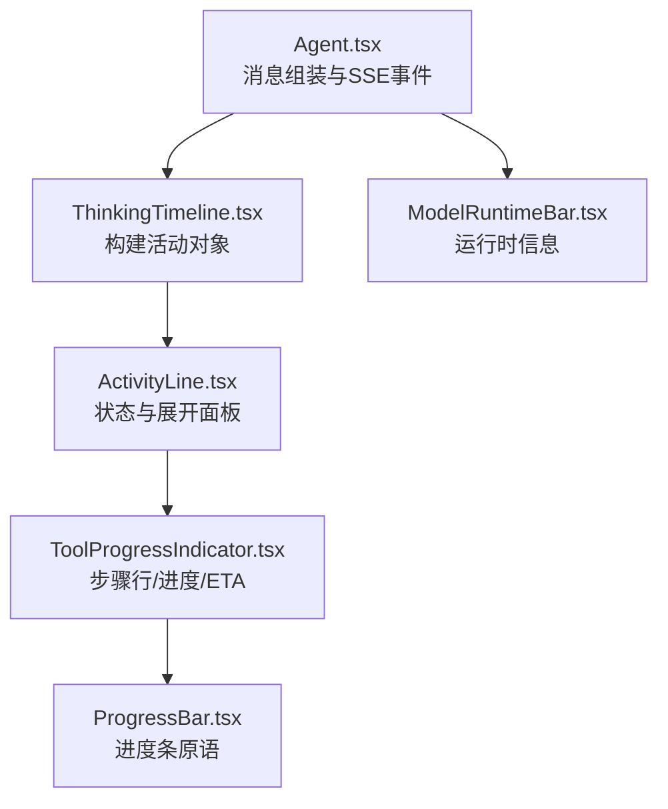
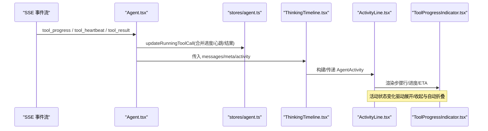
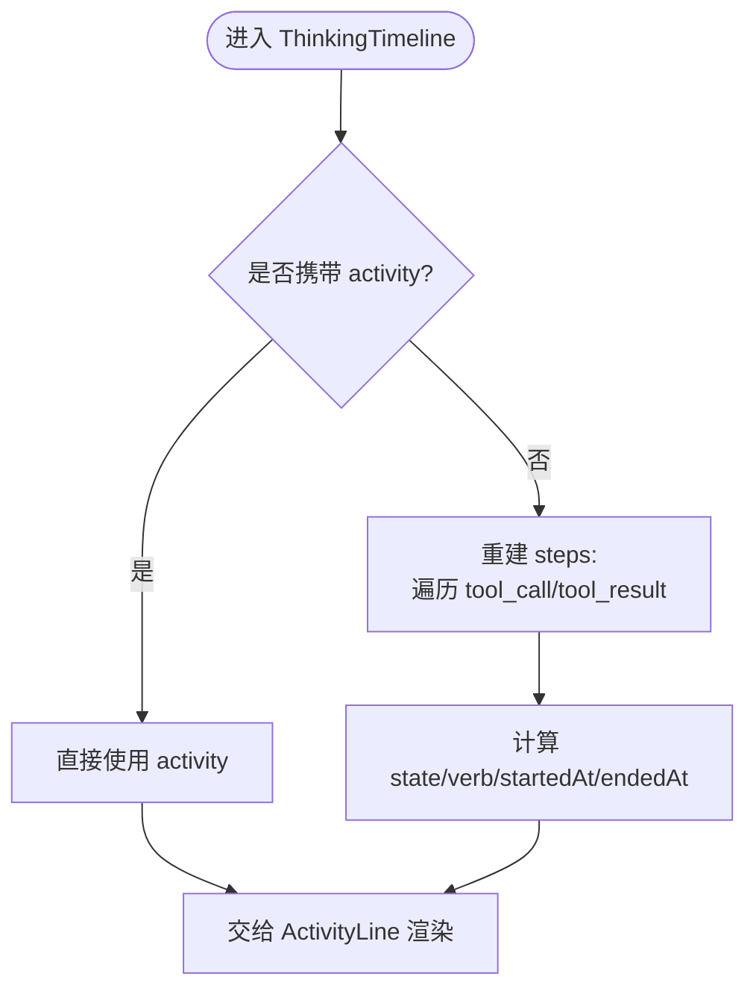
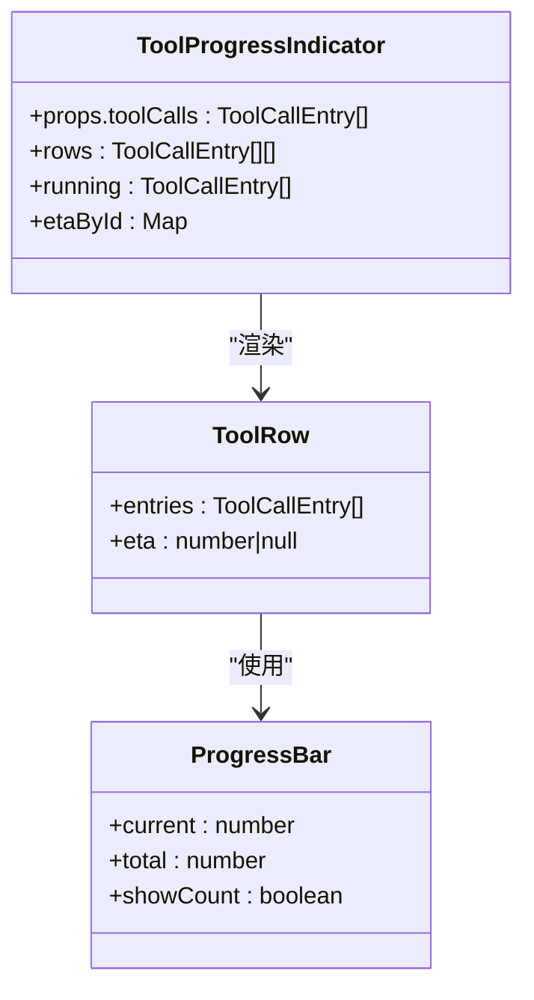
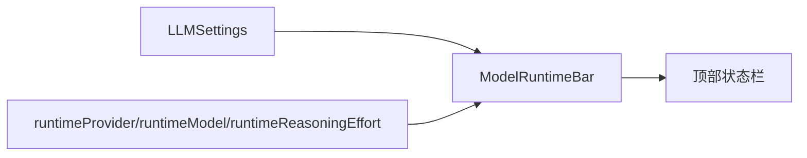
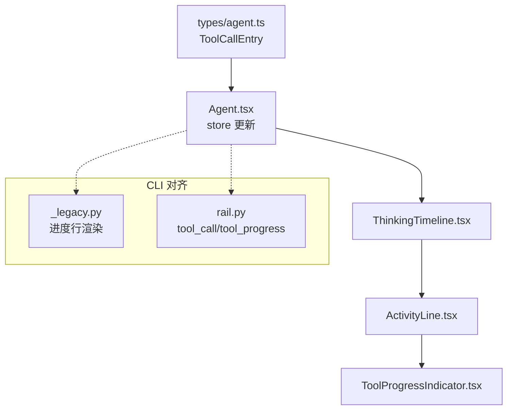

# AI推理可视化

<cite>
**本文引用的文件**
- [ThinkingTimeline.tsx](file://frontend/src/components/chat/ThinkingTimeline.tsx)
- [ActivityLine.tsx](file://frontend/src/components/chat/ActivityLine.tsx)
- [ToolProgressIndicator.tsx](file://frontend/src/components/chat/ToolProgressIndicator.tsx)
- [ModelRuntimeBar.tsx](file://frontend/src/components/chat/ModelRuntimeBar.tsx)
- [ProgressBar.tsx](file://frontend/src/components/chat/ProgressBar.tsx)
- [Agent.tsx](file://frontend/src/pages/Agent.tsx)
- [agent.ts](file://frontend/src/types/agent.ts)
- [agent.ts（stores）](file://frontend/src/stores/agent.ts)
- [_legacy.py](file://agent/cli/_legacy.py)
- [rail.py](file://agent/cli/ui/rail.py)
- [stream.py](file://agent/cli/stream.py)
</cite>

## 目录
1. [简介](#简介)
2. [项目结构](#项目结构)
3. [核心组件](#核心组件)
4. [架构总览](#架构总览)
5. [详细组件分析](#详细组件分析)
6. [依赖关系分析](#依赖关系分析)
7. [性能考量](#性能考量)
8. [故障排查指南](#故障排查指南)
9. [结论](#结论)
10. [附录](#附录)

## 简介
本文件面向 Vibe-Trading 的 AI 推理可视化能力，聚焦以下目标：
- 解释 ThinkingTimeline 如何以“思维链”方式展示 AI 的思考过程与推理步骤，并支持决策路径追踪。
- 说明 ToolProgressIndicator 的任务状态跟踪、结构化进度与执行反馈（含 ETA）。
- 阐述 ModelRuntimeBar 对模型运行时状态的呈现（提供商、模型、推理强度等），以及资源使用信息的可视化。
- 覆盖实时数据更新、动画效果与用户交互反馈。
- 提供可视化定制、主题扩展与性能优化建议。

## 项目结构
前端侧围绕聊天时间线组织可视化：
- Agent 页面负责消息组装、SSE 事件处理、工具调用状态聚合与渲染调度。
- ThinkingTimeline 将历史或活动消息转换为统一的“活动对象”，交由 ActivityLine 渲染。
- ActivityLine 作为单一的状态与披露面，内嵌 ToolProgressIndicator 展示步骤细节。
- ToolProgressIndicator 负责行级合并、确定性进度环/条、ETA 估算与可访问性。
- ModelRuntimeBar 在顶部显示当前运行时的提供商、模型与推理强度。
- ProgressBar 为通用进度条原语，被 ToolProgressIndicator 复用。

图表来源
- [Agent.tsx:530-562](file://frontend/src/pages/Agent.tsx#L530-L562)
- [ThinkingTimeline.tsx:17-85](file://frontend/src/components/chat/ThinkingTimeline.tsx#L17-L85)
- [ActivityLine.tsx:62-205](file://frontend/src/components/chat/ActivityLine.tsx#L62-L205)
- [ToolProgressIndicator.tsx:213-302](file://frontend/src/components/chat/ToolProgressIndicator.tsx#L213-L302)
- [ProgressBar.tsx:19-74](file://frontend/src/components/chat/ProgressBar.tsx#L19-L74)
- [ModelRuntimeBar.tsx:12-55](file://frontend/src/components/chat/ModelRuntimeBar.tsx#L12-L55)

章节来源
- [Agent.tsx:223-248](file://frontend/src/pages/Agent.tsx#L223-L248)
- [Agent.tsx:530-562](file://frontend/src/pages/Agent.tsx#L530-L562)
- [ThinkingTimeline.tsx:17-85](file://frontend/src/components/chat/ThinkingTimeline.tsx#L17-L85)
- [ActivityLine.tsx:62-205](file://frontend/src/components/chat/ActivityLine.tsx#L62-L205)
- [ToolProgressIndicator.tsx:213-302](file://frontend/src/components/chat/ToolProgressIndicator.tsx#L213-L302)
- [ProgressBar.tsx:19-74](file://frontend/src/components/chat/ProgressBar.tsx#L19-L74)
- [ModelRuntimeBar.tsx:12-55](file://frontend/src/components/chat/ModelRuntimeBar.tsx#L12-L55)

## 核心组件
- ThinkingTimeline：将旧版 tool_call/tool_result 消息重建为统一的活动对象，或直接读取新消息中的 activity；决定“思考/工作/完成/失败/停止/超时”等状态与动词。
- ActivityLine：统一的状态卡片，包含图标、摘要、展开详情、实时推理片段、继续/重连按钮等。
- ToolProgressIndicator：按工具调用顺序分组，合并连续成功调用，展示确定性进度环/条、阶段文本、消息、耗时与 ETA。
- ModelRuntimeBar：展示当前提供商、模型名称与推理强度标签。
- ProgressBar：无障碍友好的进度条原语。

章节来源
- [ThinkingTimeline.tsx:17-85](file://frontend/src/components/chat/ThinkingTimeline.tsx#L17-L85)
- [ActivityLine.tsx:62-205](file://frontend/src/components/chat/ActivityLine.tsx#L62-L205)
- [ToolProgressIndicator.tsx:213-302](file://frontend/src/components/chat/ToolProgressIndicator.tsx#L213-L302)
- [ModelRuntimeBar.tsx:12-55](file://frontend/src/components/chat/ModelRuntimeBar.tsx#L12-L55)
- [ProgressBar.tsx:19-74](file://frontend/src/components/chat/ProgressBar.tsx#L19-L74)

## 架构总览
下图展示了从 SSE 事件到 UI 渲染的关键流程，包括工具进度合并、活动对象构建与状态切换。

图表来源
- [Agent.tsx:722-786](file://frontend/src/pages/Agent.tsx#L722-L786)
- [Agent.tsx:223-248](file://frontend/src/pages/Agent.tsx#L223-L248)
- [ThinkingTimeline.tsx:65-85](file://frontend/src/components/chat/ThinkingTimeline.tsx#L65-L85)
- [ActivityLine.tsx:62-205](file://frontend/src/components/chat/ActivityLine.tsx#L62-L205)
- [ToolProgressIndicator.tsx:213-302](file://frontend/src/components/chat/ToolProgressIndicator.tsx#L213-L302)

## 详细组件分析

### ThinkingTimeline：思维链与决策路径
- 作用：把一组消息（tool_call/tool_result 或新的 activity）转换为一个“活动对象”，用于统一渲染。
- 关键逻辑：
  - 若消息携带 meta.activity，则直接复用；否则根据 tool_call/tool_result 重建 steps，计算 startedAt/endedAt、state 与 verb。
  - 通过 deriveActivityVerb 将最近一次工具映射为用户可见的“动作动词”（如“运行回测”、“读取市场数据”等）。
- 决策路径追踪：steps 数组按时间顺序记录每次工具调用及其状态、耗时与预览，形成可追溯的决策路径。

图表来源
- [ThinkingTimeline.tsx:17-85](file://frontend/src/components/chat/ThinkingTimeline.tsx#L17-L85)
- [agent.ts（stores）:36-44](file://frontend/src/stores/agent.ts#L36-L44)

章节来源
- [ThinkingTimeline.tsx:17-85](file://frontend/src/components/chat/ThinkingTimeline.tsx#L17-L85)
- [agent.ts（stores）:36-44](file://frontend/src/stores/agent.ts#L36-L44)

### ToolProgressIndicator：任务状态与执行反馈
- 作用：将工具调用序列渲染为可读的行，合并连续成功的同工具调用，展示进度、阶段、消息、耗时与 ETA。
- 关键特性：
  - 行合并：连续 ok 且同工具会合并为一行并显示“×N”。
  - 确定性进度：当 progress.current/total 存在时，显示环形/条形进度与计数。
  - ETA 估算：基于 elapsed_s 与 progress.current/total 计算剩余秒数，避免抖动与回退。
  - 参数摘要：从 arguments 中抽取关键字段生成易读的细节文本。
  - 可访问性：使用 role="status" 与隐藏的原生 progress 元素提升屏幕阅读器体验。

图表来源
- [ToolProgressIndicator.tsx:213-302](file://frontend/src/components/chat/ToolProgressIndicator.tsx#L213-L302)
- [ProgressBar.tsx:19-74](file://frontend/src/components/chat/ProgressBar.tsx#L19-L74)

章节来源
- [ToolProgressIndicator.tsx:213-302](file://frontend/src/components/chat/ToolProgressIndicator.tsx#L213-L302)
- [ProgressBar.tsx:19-74](file://frontend/src/components/chat/ProgressBar.tsx#L19-L74)

### ModelRuntimeBar：运行时状态栏
- 作用：在界面顶部展示当前运行的提供商、模型名称与推理强度（reasoning effort）。
- 数据来源：settings.providers 与运行时注入的 provider/model/reasoning_effort。
- 视觉：绿色连接点表示在线，右侧胶囊显示推理强度标签。

图表来源
- [ModelRuntimeBar.tsx:12-55](file://frontend/src/components/chat/ModelRuntimeBar.tsx#L12-L55)

章节来源
- [ModelRuntimeBar.tsx:12-55](file://frontend/src/components/chat/ModelRuntimeBar.tsx#L12-L55)

### 实时数据更新、动画与交互
- 实时更新：
  - SSE 事件 tool_progress 通过 requestAnimationFrame 合并后批量更新 store，减少重渲染。
  - tool_heartbeat 维持长任务的心跳，确保 UI 不“卡死”。
  - tool_result 结束任务并清理进行中进度。
- 动画与交互：
  - ActivityLine 在活动状态下自动展开，完成后延迟折叠。
  - ToolProgressIndicator 的进度环/条带过渡动画，ETA 数字平滑更新。
  - 用户可通过点击展开/收起活动详情，或在停止/超时时选择“继续/重连”。

章节来源
- [Agent.tsx:722-786](file://frontend/src/pages/Agent.tsx#L722-L786)
- [ActivityLine.tsx:77-109](file://frontend/src/components/chat/ActivityLine.tsx#L77-L109)
- [ToolProgressIndicator.tsx:256-286](file://frontend/src/components/chat/ToolProgressIndicator.tsx#L256-L286)

## 依赖关系分析
- 类型契约：ToolCallEntry 定义了工具调用的最小字段集（id、tool、arguments、status、elapsed_ms/s、progress、timestamp），前后端共享该契约。
- 状态流转：Agent.tsx 维护 toolCalls 与 activity，ThinkingTimeline 将其转为 ActivityLine 可消费的 AgentActivity。
- CLI 对齐：CLI 的 rail/dashboard 也遵循 tool_call/tool_progress 的事件语义，便于跨端一致体验。

图表来源
- [agent.ts:60-81](file://frontend/src/types/agent.ts#L60-L81)
- [Agent.tsx:722-786](file://frontend/src/pages/Agent.tsx#L722-L786)
- [ThinkingTimeline.tsx:65-85](file://frontend/src/components/chat/ThinkingTimeline.tsx#L65-L85)
- [_legacy.py:693-720](file://agent/cli/_legacy.py#L693-L720)
- [rail.py:345-380](file://agent/cli/ui/rail.py#L345-L380)

章节来源
- [agent.ts:60-81](file://frontend/src/types/agent.ts#L60-L81)
- [Agent.tsx:722-786](file://frontend/src/pages/Agent.tsx#L722-L786)
- [_legacy.py:693-720](file://agent/cli/_legacy.py#L693-L720)
- [rail.py:345-380](file://agent/cli/ui/rail.py#L345-L380)

## 性能考量
- 进度合并与节流：
  - tool_progress 使用 rAF 合并，避免高频更新导致重排。
  - ETA 计算仅在有效区间触发，避免无效抖动。
- 列表渲染：
  - 连续成功同工具合并为一行，降低行数与 DOM 节点。
  - 仅对 running 条目计算 ETA，减少开销。
- 内存与缓存：
  - ETA 样本使用 ref 存储，避免重复计算。
  - 进度条使用 CSS transition 而非 JS 动画，减少主线程压力。
- 可访问性与降级：
  - 无 total 时退化为旋转加载器，保证可用性。
  - 使用原生 progress 元素承载语义，辅助技术友好。

[本节为通用指导，无需特定文件引用]

## 故障排查指南
- 长时间无响应：
  - 检查 tool_heartbeat 是否正常到达，确认 UI 未因缺少心跳而误判为空闲。
  - 查看 tool_progress 是否持续上报 current/total，确保 ETA 与进度条可用。
- 进度不更新：
  - 确认 progress.current/total 均为数字且 total > 0，否则不会显示确定性进度。
  - 检查 rAF 合并是否生效（浏览器标签页不可见时会暂停计时器）。
- 行为异常：
  - 若出现回退或 stage 不变但 current 下降，ETA 会被抑制以避免误导。
  - 活动状态为 stopped/timeout 时，ActivityLine 会提供“继续/重连”入口。

章节来源
- [ToolProgressIndicator.tsx:15-36](file://frontend/src/components/chat/ToolProgressIndicator.tsx#L15-L36)
- [ActivityLine.tsx:179-200](file://frontend/src/components/chat/ActivityLine.tsx#L179-L200)
- [Agent.tsx:744-786](file://frontend/src/pages/Agent.tsx#L744-L786)

## 结论
Vibe-Trading 的 AI 推理可视化通过 ThinkingTimeline、ActivityLine、ToolProgressIndicator 与 ModelRuntimeBar 的组合，实现了从“思维链”到“工具执行反馈”再到“运行时状态”的全链路可视化。其设计兼顾了实时性（rAF 合并、心跳）、可理解性（阶段/消息/ETA）、可访问性（ARIA）与可扩展性（类型契约、CLI 对齐）。在生产环境中，建议结合后端工具的结构化进度输出，以获得更丰富的可视化体验。

[本节为总结，无需特定文件引用]

## 附录

### 数据模型与字段说明
- ToolCallEntry：工具调用追踪的最小单元，包含 id、tool、arguments、status、preview、elapsed_ms/s、progress（stage/current/total/message）、timestamp。
- AgentActivity：由 ThinkingTimeline 构建，包含 attemptId、state、verb、steps、startedAt、endedAt。

章节来源
- [agent.ts:60-81](file://frontend/src/types/agent.ts#L60-L81)
- [ThinkingTimeline.tsx:17-57](file://frontend/src/components/chat/ThinkingTimeline.tsx#L17-L57)

### 事件与渲染时序
- SSE 事件处理：
  - tool_progress：合并进度并更新运行中工具调用。
  - tool_heartbeat：刷新 elapsed_s，保持活跃态。
  - tool_result：结束任务，清理进行中进度。
- 渲染时序：
  - Agent.tsx 组装消息与工具轨迹，ThinkingTimeline 构建活动对象，ActivityLine 渲染状态与详情，ToolProgressIndicator 渲染步骤行与进度。

章节来源
- [Agent.tsx:722-786](file://frontend/src/pages/Agent.tsx#L722-L786)
- [ThinkingTimeline.tsx:65-85](file://frontend/src/components/chat/ThinkingTimeline.tsx#L65-L85)
- [ActivityLine.tsx:62-205](file://frontend/src/components/chat/ActivityLine.tsx#L62-L205)

### CLI 与 Web 的一致性
- CLI 的 rail/dashboard 同样消费 tool_call 与 tool_progress，并以表格/进度条形式呈现，确保终端与 Web 的一致体验。
- stream.py 提供交互式 CLI 的 spinner 与工具事件格式，与 Web 的 ToolProgressIndicator 语义对齐。

章节来源
- [rail.py:345-380](file://agent/cli/ui/rail.py#L345-L380)
- [_legacy.py:693-720](file://agent/cli/_legacy.py#L693-L720)
- [stream.py:1-34](file://agent/cli/stream.py#L1-L34)