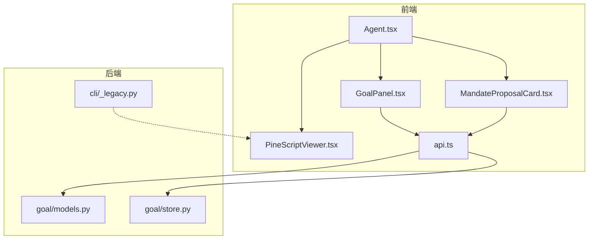
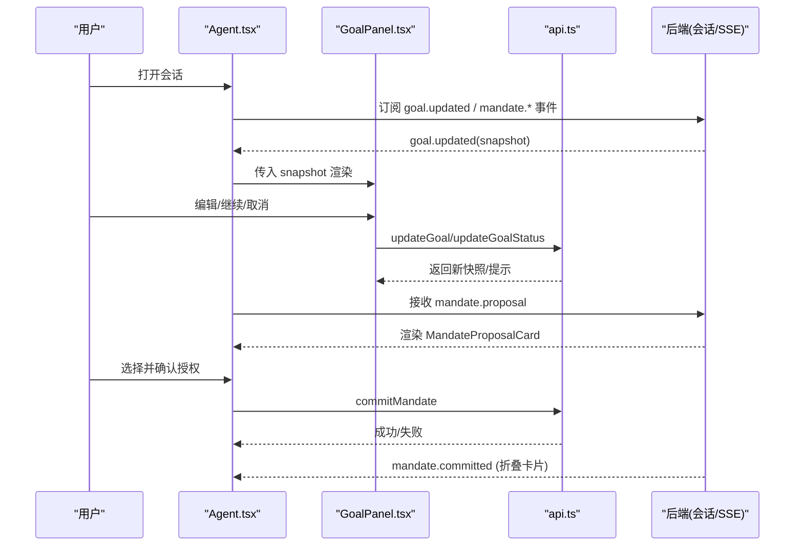
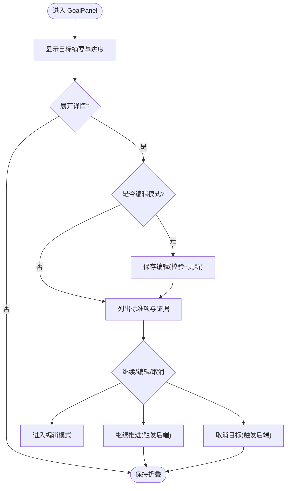
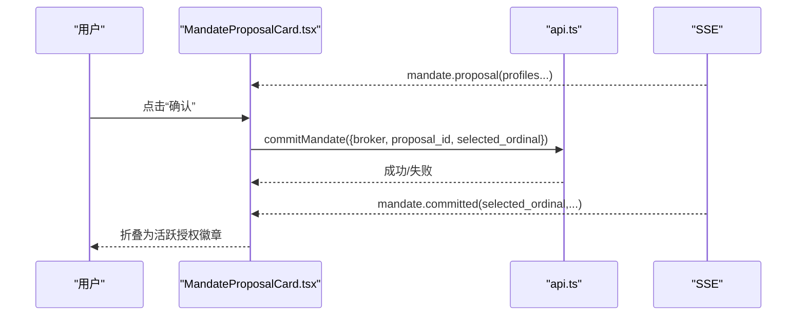
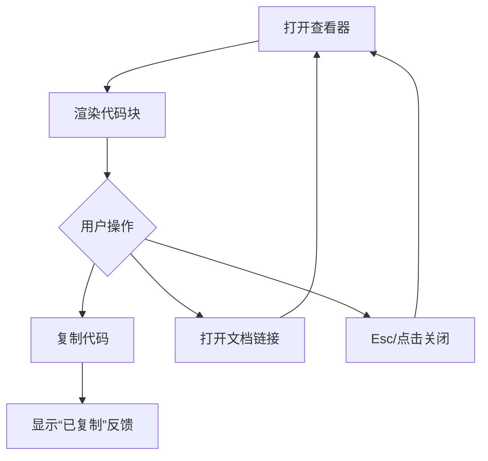
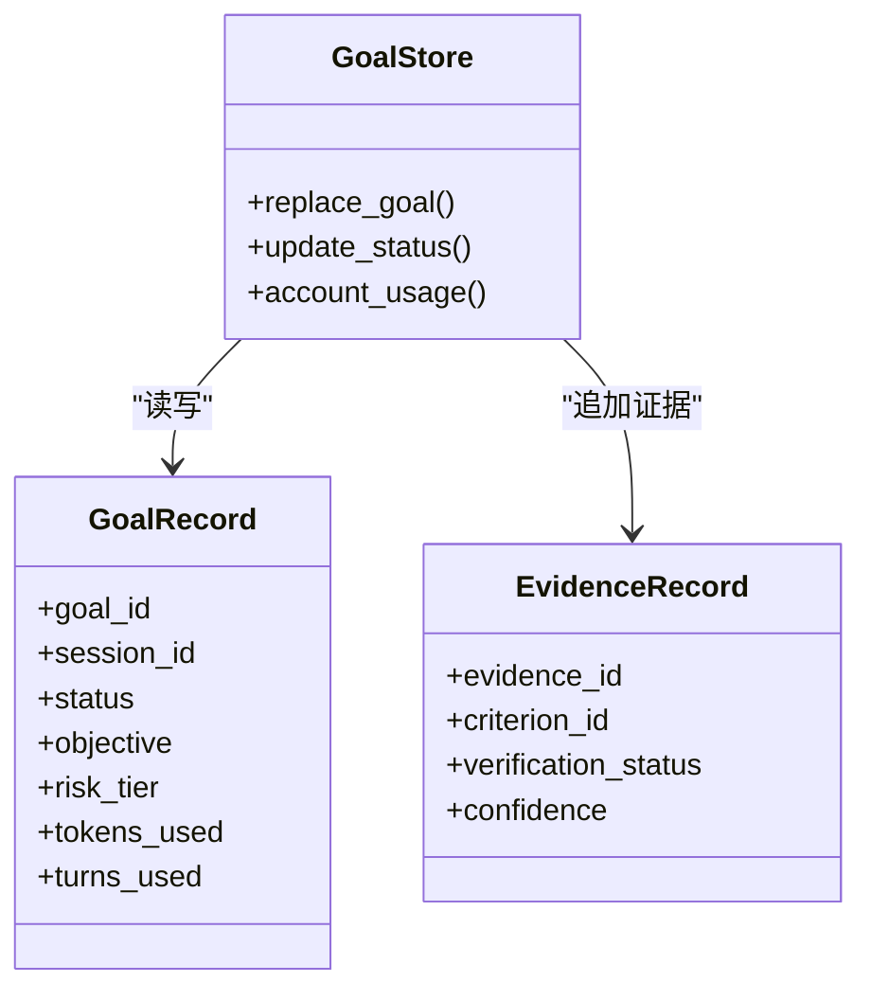

# 专用功能组件

<cite>
**本文引用的文件**
- [GoalPanel.tsx](file://frontend/src/components/chat/GoalPanel.tsx)
- [MandateProposalCard.tsx](file://frontend/src/components/chat/MandateProposalCard.tsx)
- [PineScriptViewer.tsx](file://frontend/src/components/chat/PineScriptViewer.tsx)
- [Agent.tsx](file://frontend/src/pages/Agent.tsx)
- [api.ts](file://frontend/src/lib/api.ts)
- [models.py](file://agent/src/goal/models.py)
- [store.py](file://agent/src/goal/store.py)
- [_legacy.py](file://agent/cli/_legacy.py)
</cite>

## 目录
1. [简介](#简介)
2. [项目结构](#项目结构)
3. [核心组件](#核心组件)
4. [架构总览](#架构总览)
5. [详细组件分析](#详细组件分析)
6. [依赖关系分析](#依赖关系分析)
7. [性能考虑](#性能考虑)
8. [故障排查指南](#故障排查指南)
9. [结论](#结论)
10. [附录](#附录)

## 简介
本章节聚焦 Vibe-Trading 的三项专用前端能力：目标面板（GoalPanel）、授权提案卡片（MandateProposalCard）与 Pine 脚本查看器（PineScriptViewer）。文档从业务逻辑、数据模型、用户交互、错误处理与扩展点五个维度，系统阐述其设计思路与实现要点，并提供可操作的扩展与集成示例。

## 项目结构
- 前端组件位于 frontend/src/components/chat，负责渲染与交互；状态与事件通过 Agent 页面聚合，并通过 api.ts 调用后端接口或订阅 SSE 事件。
- 后端目标管理由 agent/src/goal 提供数据模型与持久化存储（SQLite），CLI 中提供历史策略的 Pine 脚本展示能力。

图表来源
- [Agent.tsx:1755-1795](file://frontend/src/pages/Agent.tsx#L1755-L1795)
- [GoalPanel.tsx:1-286](file://frontend/src/components/chat/GoalPanel.tsx#L1-L286)
- [MandateProposalCard.tsx:1-386](file://frontend/src/components/chat/MandateProposalCard.tsx#L1-L386)
- [PineScriptViewer.tsx:1-111](file://frontend/src/components/chat/PineScriptViewer.tsx#L1-L111)
- [api.ts:678-743](file://frontend/src/lib/api.ts#L678-L743)
- [models.py:1-162](file://agent/src/goal/models.py#L1-L162)
- [store.py:103-200](file://agent/src/goal/store.py#L103-L200)
- [_legacy.py:2424-2435](file://agent/cli/_legacy.py#L2424-L2435)

章节来源
- [Agent.tsx:1755-1795](file://frontend/src/pages/Agent.tsx#L1755-L1795)
- [api.ts:678-743](file://frontend/src/lib/api.ts#L678-L743)

## 核心组件
- GoalPanel：目标面板，支持目标编辑、目标分解（标准项）、证据收集与进度统计、优先级/状态可视化、取消与继续操作。
- MandateProposalCard：授权提案卡片，呈现多套交易限制方案（标的范围、单笔上限、日交易次数、杠杆等），支持“调整”自然语言反馈与“确认提交”，提交后折叠为活跃授权徽章。
- PineScriptViewer：Pine 脚本查看器，以模态对话框形式展示代码，支持复制、外部文档跳转、键盘快捷键关闭与焦点恢复。

章节来源
- [GoalPanel.tsx:1-286](file://frontend/src/components/chat/GoalPanel.tsx#L1-L286)
- [MandateProposalCard.tsx:1-386](file://frontend/src/components/chat/MandateProposalCard.tsx#L1-L386)
- [PineScriptViewer.tsx:1-111](file://frontend/src/components/chat/PineScriptViewer.tsx#L1-L111)

## 架构总览
- 目标工作流：Agent 页面维护 goalSnapshot，当收到 goal.updated 事件时更新并渲染 GoalPanel；用户可编辑目标、继续推进或取消。
- 授权流程：SSE 推送 mandate.proposal，Agent 页面将其加入 liveItems 并渲染 MandateProposalCard；用户确认后调用 commitMandate，随后收到 mandate.committed 事件，卡片折叠为徽章。
- 脚本查看：通过 CLI 或工具链导出 strategy.pine，前端使用 PineScriptViewer 弹窗展示，便于复制到 TradingView。

图表来源
- [Agent.tsx:1060-1103](file://frontend/src/pages/Agent.tsx#L1060-L1103)
- [GoalPanel.tsx:79-116](file://frontend/src/components/chat/GoalPanel.tsx#L79-L116)
- [MandateProposalCard.tsx:203-229](file://frontend/src/components/chat/MandateProposalCard.tsx#L203-L229)
- [api.ts:976-1029](file://frontend/src/lib/api.ts#L976-L1029)

## 详细组件分析

### GoalPanel 目标面板
- 目标分解与进度跟踪
  - 将目标拆解为标准项（criteria），每个标准项有状态与证据计数；面板计算已满足数与总数，显示“X/Y met”。
  - 证据列表按时间倒序展示最新两条，体现研究过程的可追溯性。
- 优先级与状态管理
  - 支持编辑目标文本、取消目标、继续推进；状态变更通过 API 同步到后端。
- 数据验证与错误处理
  - 编辑保存前校验非空；取消/更新失败时通过 toast 提示错误信息。
- 用户交互设计
  - 顶部按钮可展开/收起详情；编辑模式内嵌文本域；底部提供继续、编辑、取消操作。

图表来源
- [GoalPanel.tsx:19-50](file://frontend/src/components/chat/GoalPanel.tsx#L19-L50)
- [GoalPanel.tsx:79-116](file://frontend/src/components/chat/GoalPanel.tsx#L79-L116)
- [GoalPanel.tsx:208-280](file://frontend/src/components/chat/GoalPanel.tsx#L208-L280)

章节来源
- [GoalPanel.tsx:1-286](file://frontend/src/components/chat/GoalPanel.tsx#L1-L286)
- [models.py:10-34](file://agent/src/goal/models.py#L10-L34)
- [store.py:286-379](file://agent/src/goal/store.py#L286-L379)

### MandateProposalCard 授权提案卡片
- 交易指令处理
  - 展示多个授权方案（profile），包含标的范围、单笔上限、日交易次数、杠杆、可用工具等。
  - 用户点击“确认”后调用 commitMandate，携带 broker、proposal_id、selected_ordinal 等信息。
- 风险评估展示
  - 根据账户信息与方案参数，直观展示风险相关指标；若为重新授权场景，使用警示图标提示。
  - 提交成功后折叠为紧凑徽章，显示已选方案的关键限额与过期时间。
- 调整机制
  - 支持“调整”输入自然语言反馈，发送回 Agent 以重新生成提案，提升交互灵活性。
- 数据验证与错误处理
  - 提交前校验 broker 存在；失败时 toast 提示；重复提交通过 busyOrdinal 防抖。

图表来源
- [MandateProposalCard.tsx:203-229](file://frontend/src/components/chat/MandateProposalCard.tsx#L203-L229)
- [api.ts:976-1029](file://frontend/src/lib/api.ts#L976-L1029)
- [Agent.tsx:1080-1103](file://frontend/src/pages/Agent.tsx#L1080-L1103)

章节来源
- [MandateProposalCard.tsx:1-386](file://frontend/src/components/chat/MandateProposalCard.tsx#L1-L386)
- [api.ts:976-1029](file://frontend/src/lib/api.ts#L976-L1029)

### PineScriptViewer Pine 脚本查看器
- 代码编辑器功能
  - 以模态对话框展示 strategy.pine 内容，支持复制代码、跳转到官方文档、Esc 键关闭与焦点恢复。
- 语法高亮支持
  - 当前版本以纯文本方式展示代码；如需语法高亮，可在后续扩展引入第三方编辑器（如 Monaco 或 CodeMirror）并按 Pine 语言配置高亮规则。
- 用户交互设计
  - 自动聚焦关闭按钮，确保无障碍访问；复制成功切换为“已复制”状态，2秒后恢复。

图表来源
- [PineScriptViewer.tsx:16-47](file://frontend/src/components/chat/PineScriptViewer.tsx#L16-L47)
- [PineScriptViewer.tsx:49-110](file://frontend/src/components/chat/PineScriptViewer.tsx#L49-L110)
- [_legacy.py:2424-2435](file://agent/cli/_legacy.py#L2424-L2435)

章节来源
- [PineScriptViewer.tsx:1-111](file://frontend/src/components/chat/PineScriptViewer.tsx#L1-L111)
- [_legacy.py:2424-2435](file://agent/cli/_legacy.py#L2424-L2435)

## 依赖关系分析
- 前端依赖
  - GoalPanel 依赖 api.ts 的目标类型与更新接口；MandateProposalCard 依赖 api.ts 的授权类型与提交接口；PineScriptViewer 独立展示，不直接依赖后端。
  - Agent.tsx 作为容器，统一处理 SSE 事件并协调各组件状态。
- 后端依赖
  - goal/models.py 定义目标生命周期、风险等级、证据与审计数据结构。
  - goal/store.py 提供 SQLite 持久化、并发锁、预算与状态流转控制。
  - cli/_legacy.py 提供历史运行结果的 Pine 脚本读取与终端高亮展示。

图表来源
- [models.py:40-162](file://agent/src/goal/models.py#L40-L162)
- [store.py:103-200](file://agent/src/goal/store.py#L103-L200)

章节来源
- [models.py:1-162](file://agent/src/goal/models.py#L1-L162)
- [store.py:103-200](file://agent/src/goal/store.py#L103-L200)

## 性能考虑
- 目标面板
  - 使用 useMemo 计算进度，避免重复计算；证据列表仅展示最新两条，降低渲染开销。
- 授权卡片
  - 通过 busyOrdinal 防止重复提交；提交成功后不立即写乐观状态，等待 mandate.committed 事件，保证一致性。
- 脚本查看器
  - 使用 createPortal 渲染至 body，避免层级问题；复制操作采用现代 API 并兼容降级方案。

[本节为通用性能建议，不直接分析具体文件]

## 故障排查指南
- 目标取消/更新失败
  - 检查 sessionId 与 goal_id 是否正确传递；确认后端返回的错误类型（如 stale_goal、validation）。
  - 参考路径：[GoalPanel.tsx:79-116](file://frontend/src/components/chat/GoalPanel.tsx#L79-L116)
- 授权提交失败
  - 确认 broker 字段存在且非空；检查 proposal_id 与 selected_ordinal 是否匹配；查看 toast 错误提示。
  - 参考路径：[MandateProposalCard.tsx:203-229](file://frontend/src/components/chat/MandateProposalCard.tsx#L203-L229)
- Pine 脚本未找到
  - 检查 run artifacts 目录下是否存在 strategy.pine；若不存在，提示用户让 Agent 导出策略。
  - 参考路径：[_legacy.py:2424-2435](file://agent/cli/_legacy.py#L2424-L2435)

章节来源
- [GoalPanel.tsx:79-116](file://frontend/src/components/chat/GoalPanel.tsx#L79-L116)
- [MandateProposalCard.tsx:203-229](file://frontend/src/components/chat/MandateProposalCard.tsx#L203-L229)
- [_legacy.py:2424-2435](file://agent/cli/_legacy.py#L2424-L2435)

## 结论
GoalPanel、MandateProposalCard 与 PineScriptViewer 分别覆盖了研究目标管理、交易授权与策略脚本查看三大关键场景。它们在前端以清晰的交互与稳健的状态管理实现，在后端依托明确的数据模型与持久化保障，形成端到端的闭环。建议在后续迭代中增强 Pine 脚本的语法高亮与更多可视化指标，同时完善错误提示与可观测性。

[本节为总结性内容，不直接分析具体文件]

## 附录
- 扩展与插件集成示例
  - 在 GoalPanel 中增加自定义标准项模板：基于 models.py 中的 GoalCriterion 结构，新增“合规检查”“风控阈值”等条目，并在 store 中记录协议步骤。
  - 在 MandateProposalCard 中接入新的风险评分：扩展 profile 的 notes 字段，结合后端风险模型输出，动态渲染风险提示。
  - 在 PineScriptViewer 中集成语法高亮：引入 Monaco 编辑器，注册 Pine 语言扩展，保留复制与文档跳转能力。

[本节为概念性扩展建议，不直接分析具体文件]