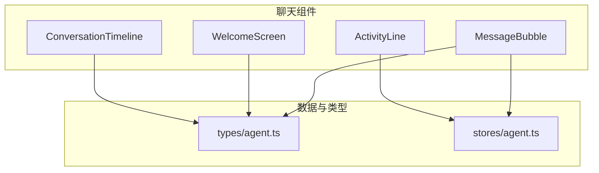
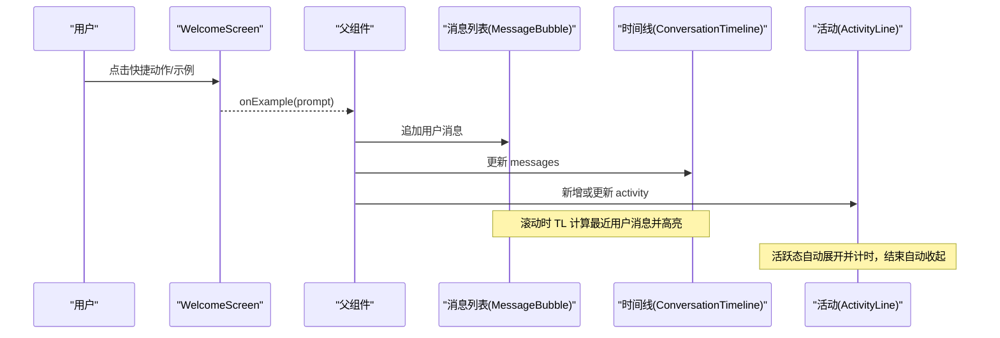
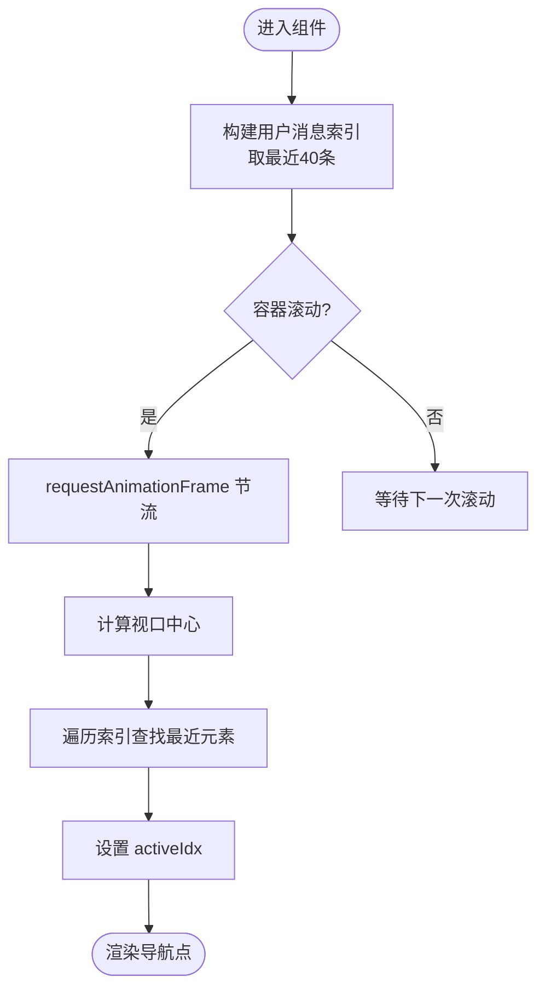
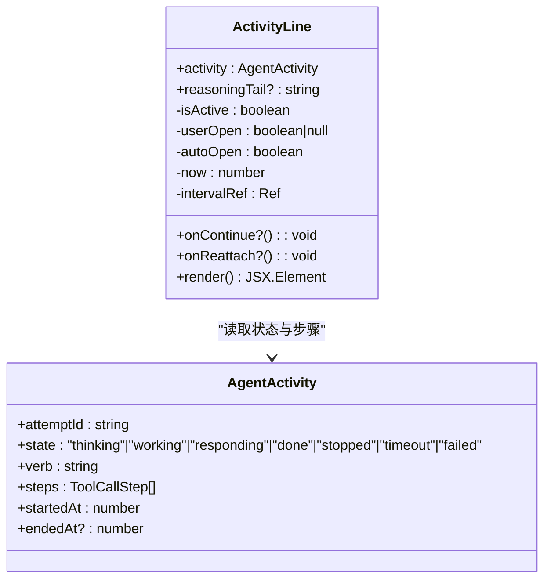
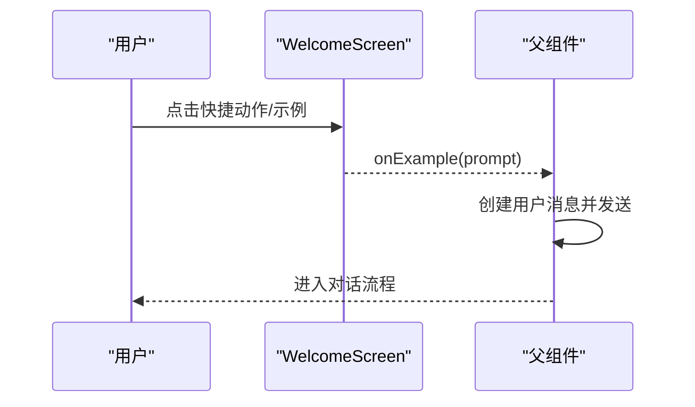
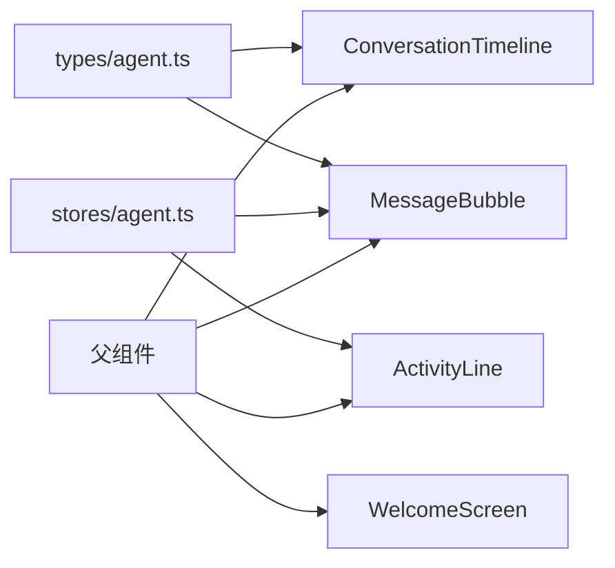

# 对话流程组件

<cite>
**本文引用的文件**
- [ConversationTimeline.tsx](file://frontend/src/components/chat/ConversationTimeline.tsx)
- [ActivityLine.tsx](file://frontend/src/components/chat/ActivityLine.tsx)
- [WelcomeScreen.tsx](file://frontend/src/components/chat/WelcomeScreen.tsx)
- [MessageBubble.tsx](file://frontend/src/components/chat/MessageBubble.tsx)
- [agent.ts（类型定义）](file://frontend/src/types/agent.ts)
- [agent.ts（状态存储）](file://frontend/src/stores/agent.ts)
- [ConversationTimeline.test.tsx](file://frontend/src/components/chat/__tests__/ConversationTimeline.test.tsx)
- [ActivityLine.test.tsx](file://frontend/src/components/chat/__tests__/ActivityLine.test.tsx)
</cite>

## 目录
1. [简介](#简介)
2. [项目结构](#项目结构)
3. [核心组件](#核心组件)
4. [架构总览](#架构总览)
5. [详细组件分析](#详细组件分析)
6. [依赖关系分析](#依赖关系分析)
7. [性能考虑](#性能考虑)
8. [故障排查指南](#故障排查指南)
9. [结论](#结论)
10. [附录](#附录)

## 简介
本文件面向 Vibe-Trading 前端对话体验的三大关键组件：ConversationTimeline、ActivityLine 与 WelcomeScreen。文档聚焦以下目标：
- 消息流管理与时间线导航（滚动定位、用户消息索引、最近 N 条限制）
- 活动指示器的状态跟踪、计时与可视化（思考/工作/响应/完成/停止/超时/失败）
- 欢迎界面的引导流程与快速开始能力
- 消息排序、时间过滤与搜索的集成建议
- 性能优化策略、内存管理与大数据集处理方案
- 具体集成示例与自定义扩展方法

## 项目结构
对话相关的前端代码位于 frontend/src/components/chat，配合 types 与 stores 提供数据模型与状态管理。关键文件职责如下：
- ConversationTimeline：基于容器滚动计算最近可见的用户消息，生成右侧迷你导航点，支持点击跳转
- ActivityLine：单条 Agent 尝试的生命周期展示，含状态图标、摘要、步骤进度、自动折叠与操作按钮
- WelcomeScreen：欢迎页，包含问候语、快捷动作、分类示例库
- MessageBubble：消息气泡渲染（用户/回答/运行完成/错误），支持 Markdown、复制、重试提示
- agent.ts（types）：AgentMessage 等类型定义
- agent.ts（stores）：AgentActivity 等运行时状态类型

图表来源
- [ConversationTimeline.tsx:1-82](file://frontend/src/components/chat/ConversationTimeline.tsx#L1-L82)
- [ActivityLine.tsx:1-205](file://frontend/src/components/chat/ActivityLine.tsx#L1-L205)
- [WelcomeScreen.tsx:1-367](file://frontend/src/components/chat/WelcomeScreen.tsx#L1-L367)
- [MessageBubble.tsx:1-289](file://frontend/src/components/chat/MessageBubble.tsx#L1-L289)
- [agent.ts（类型定义）](file://frontend/src/types/agent.ts)
- [agent.ts（状态存储）](file://frontend/src/stores/agent.ts)

章节来源
- [ConversationTimeline.tsx:1-82](file://frontend/src/components/chat/ConversationTimeline.tsx#L1-L82)
- [ActivityLine.tsx:1-205](file://frontend/src/components/chat/ActivityLine.tsx#L1-L205)
- [WelcomeScreen.tsx:1-367](file://frontend/src/components/chat/WelcomeScreen.tsx#L1-L367)
- [MessageBubble.tsx:1-289](file://frontend/src/components/chat/MessageBubble.tsx#L1-L289)

## 核心组件
- ConversationTimeline：维护 activeIdx，监听容器滚动，计算距视口中心最近的“用户消息”索引，并渲染最多 40 个最近用户消息的导航点；点击可平滑滚动到对应消息。
- ActivityLine：根据 activity.state 显示不同状态图标与摘要；在活跃态下自动展开并每秒刷新计时；结束时自动收起；支持“继续”和“重新连接”操作。
- WelcomeScreen：按时间段选择问候语；提供快捷动作与分类示例库；点击示例将 prompt 通过 onExample 回调传递给上层。
- MessageBubble：区分用户/回答/运行完成/错误消息；回答消息使用 Markdown 渲染并支持复制；错误消息给出重试提示与重试按钮。

章节来源
- [ConversationTimeline.tsx:10-82](file://frontend/src/components/chat/ConversationTimeline.tsx#L10-L82)
- [ActivityLine.tsx:33-205](file://frontend/src/components/chat/ActivityLine.tsx#L33-L205)
- [WelcomeScreen.tsx:174-367](file://frontend/src/components/chat/WelcomeScreen.tsx#L174-L367)
- [MessageBubble.tsx:174-289](file://frontend/src/components/chat/MessageBubble.tsx#L174-L289)

## 架构总览
对话流程由“输入—渲染—状态”三层构成：
- 输入层：WelcomeScreen 提供快捷动作与示例，触发上层发送消息
- 渲染层：MessageBubble 渲染单条消息；ConversationTimeline 提供时间线导航；ActivityLine 展示活动状态
- 状态层：stores/agent.ts 提供 AgentActivity 等运行时状态；types/agent.ts 提供消息类型

图表来源
- [WelcomeScreen.tsx:238-367](file://frontend/src/components/chat/WelcomeScreen.tsx#L238-L367)
- [ConversationTimeline.tsx:10-82](file://frontend/src/components/chat/ConversationTimeline.tsx#L10-L82)
- [ActivityLine.tsx:62-205](file://frontend/src/components/chat/ActivityLine.tsx#L62-L205)
- [MessageBubble.tsx:187-289](file://frontend/src/components/chat/MessageBubble.tsx#L187-L289)

## 详细组件分析

### ConversationTimeline：消息流管理与时间线导航
- 功能要点
  - 仅对 type=user 的消息建立索引，取最近 40 条作为导航点
  - 监听容器滚动，使用 requestAnimationFrame 节流，计算距视口中心最近的用户消息索引并高亮
  - 点击导航点平滑滚动到对应消息
- 复杂度与性能
  - 每次滚动事件触发一次 RAF 重算，避免频繁 DOM 查询
  - 用户消息索引切片为 O(N) 但限制为最近 40 项，交互稳定
- 可扩展点
  - 增加“历史加载”钩子：当滚动到顶部时触发分页加载更早消息
  - 增加“时间过滤”：在计算 userIndices 前按时间范围过滤
  - 增加“搜索高亮”：匹配内容后滚动至首条并高亮

图表来源
- [ConversationTimeline.tsx:13-47](file://frontend/src/components/chat/ConversationTimeline.tsx#L13-L47)
- [ConversationTimeline.tsx:49-82](file://frontend/src/components/chat/ConversationTimeline.tsx#L49-L82)

章节来源
- [ConversationTimeline.tsx:10-82](file://frontend/src/components/chat/ConversationTimeline.tsx#L10-L82)
- [ConversationTimeline.test.tsx:6-38](file://frontend/src/components/chat/__tests__/ConversationTimeline.test.tsx#L6-L38)

### ActivityLine：活动指示器与状态可视化
- 功能要点
  - 状态集合：thinking/working/responding/done/stopped/timeout/failed
  - 活跃态自动展开，非活跃态 900ms 后自动收起
  - 计时器仅在页面可见时推进，结束时冻结于 endedAt
  - 摘要包含动词、最新工具调用、耗时与步数
  - 支持“继续”（stopped）与“重新连接”（timeout）操作
- 复杂度与性能
  - 使用 setInterval 每秒更新时间，监听 visibilitychange 暂停/恢复
  - 使用 memo 包裹减少重渲染
- 可扩展点
  - 增加“更多详情”面板：展示 steps 的完整日志
  - 增加“取消/重试”统一入口
  - 接入外部埋点统计各状态停留时长

图表来源
- [ActivityLine.tsx:25-31](file://frontend/src/components/chat/ActivityLine.tsx#L25-L31)
- [ActivityLine.tsx:62-205](file://frontend/src/components/chat/ActivityLine.tsx#L62-L205)
- [agent.ts（状态存储）](file://frontend/src/stores/agent.ts)

章节来源
- [ActivityLine.tsx:33-205](file://frontend/src/components/chat/ActivityLine.tsx#L33-L205)
- [ActivityLine.test.tsx:47-147](file://frontend/src/components/chat/__tests__/ActivityLine.test.tsx#L47-L147)

### WelcomeScreen：欢迎界面与快速开始
- 功能要点
  - 根据时段选择问候语（早/午/晚/夜）
  - 快捷动作区：常用任务一键发起
  - 示例库：分分类展示，点击后将 prompt 通过 onExample 回调返回给上层
- 交互流程
  - 点击快捷动作/示例 → 触发 onExample(prompt) → 上层创建用户消息并启动会话
- 可扩展点
  - 支持“自定义分类/示例”注入
  - 支持“最近使用”推荐
  - 支持“键盘导航”与无障碍增强

图表来源
- [WelcomeScreen.tsx:174-232](file://frontend/src/components/chat/WelcomeScreen.tsx#L174-L232)
- [WelcomeScreen.tsx:238-367](file://frontend/src/components/chat/WelcomeScreen.tsx#L238-L367)

章节来源
- [WelcomeScreen.tsx:174-367](file://frontend/src/components/chat/WelcomeScreen.tsx#L174-L367)

### MessageBubble：消息渲染与辅助能力
- 功能要点
  - 用户消息：显示附件/模式标签与内容
  - 回答消息：Markdown 渲染、可选光标闪烁、耗时显示
  - 运行完成：专用卡片
  - 错误消息：智能重试提示与重试按钮
- 可扩展点
  - 增加“消息搜索高亮”
  - 增加“消息时间过滤”
  - 增加“消息导出/分享”

章节来源
- [MessageBubble.tsx:174-289](file://frontend/src/components/chat/MessageBubble.tsx#L174-L289)

## 依赖关系分析
- ConversationTimeline 依赖 types/agent.ts 中的 AgentMessage 类型，用于识别用户消息与内容
- ActivityLine 依赖 stores/agent.ts 中的 AgentActivity 类型，用于状态机与步骤展示
- WelcomeScreen 通过 onExample 与父组件解耦，便于接入任意消息发送逻辑
- MessageBubble 同时依赖 types 与 stores，以适配多种消息形态

图表来源
- [ConversationTimeline.tsx:1-82](file://frontend/src/components/chat/ConversationTimeline.tsx#L1-L82)
- [ActivityLine.tsx:1-205](file://frontend/src/components/chat/ActivityLine.tsx#L1-L205)
- [WelcomeScreen.tsx:1-367](file://frontend/src/components/chat/WelcomeScreen.tsx#L1-L367)
- [MessageBubble.tsx:1-289](file://frontend/src/components/chat/MessageBubble.tsx#L1-L289)
- [agent.ts（类型定义）](file://frontend/src/types/agent.ts)
- [agent.ts（状态存储）](file://frontend/src/stores/agent.ts)

章节来源
- [ConversationTimeline.tsx:1-82](file://frontend/src/components/chat/ConversationTimeline.tsx#L1-L82)
- [ActivityLine.tsx:1-205](file://frontend/src/components/chat/ActivityLine.tsx#L1-L205)
- [WelcomeScreen.tsx:1-367](file://frontend/src/components/chat/WelcomeScreen.tsx#L1-L367)
- [MessageBubble.tsx:1-289](file://frontend/src/components/chat/MessageBubble.tsx#L1-L289)

## 性能考虑
- 虚拟滚动与大数据集
  - 当前 ConversationTimeline 未实现虚拟滚动，适合中小规模对话；若消息量极大，建议在父列表层引入虚拟滚动（如 react-window/virtualizer），仅渲染可视区域
  - 结合“分页加载历史”：滚动到顶部时请求更早消息，避免一次性加载全部
- 滚动与渲染优化
  - ConversationTimeline 已使用 requestAnimationFrame 节流滚动计算，避免频繁布局
  - ActivityLine 使用 memo 与条件渲染，减少无关重渲染
  - 计时器仅在页面可见时推进，降低后台开销
- 内存管理
  - 及时清理事件监听与定时器（已在组件卸载中清理）
  - 控制导航点数量（最近 40 条）以减少 DOM 节点
- 文本与富媒体
  - MessageBubble 的 Markdown 渲染在流式场景关闭部分插件，减少解析开销
  - 图片/表格等复杂内容建议懒加载与虚拟化

[本节为通用性能建议，不直接分析具体文件]

## 故障排查指南
- 时间线导航不生效
  - 检查容器 ref 是否正确传入且存在
  - 确认用户消息 data-msg-idx 是否被正确设置（需由父级渲染消息时添加）
  - 验证 userIndices 是否为空（至少两条用户消息才会渲染）
- 活动指示器计时异常
  - 检查页面可见性变化事件是否正常触发
  - 确认 endedAt 是否在终态时正确设置
  - 测试用例覆盖：自动收起、计时冻结、继续/重新连接按钮
- 欢迎页示例无法发送
  - 确认 onExample 回调已绑定且父组件能接收 prompt
  - 检查 i18n key 是否存在，避免文案缺失导致渲染异常
- 消息渲染错误
  - Markdown 解析失败时回退为纯文本（内置错误边界）
  - 错误消息会给出重试提示，检查网络与 API 限流

章节来源
- [ConversationTimeline.tsx:18-47](file://frontend/src/components/chat/ConversationTimeline.tsx#L18-L47)
- [ActivityLine.tsx:77-109](file://frontend/src/components/chat/ActivityLine.tsx#L77-L109)
- [ActivityLine.test.tsx:62-147](file://frontend/src/components/chat/__tests__/ActivityLine.test.tsx#L62-L147)
- [MessageBubble.tsx:49-68](file://frontend/src/components/chat/MessageBubble.tsx#L49-L68)

## 结论
- ConversationTimeline 提供了轻量而高效的时间线导航，适合中等规模对话；如需更大规模，应叠加虚拟滚动与分页加载
- ActivityLine 清晰表达 Agent 尝试的生命周期，具备健壮的状态机与计时机制，易于扩展更多操作与详情
- WelcomeScreen 通过结构化示例与快捷动作降低上手门槛，便于快速启动典型任务
- 结合 MessageBubble 的丰富渲染能力，整体对话体验流畅、可访问、易扩展

[本节为总结性内容，不直接分析具体文件]

## 附录

### 消息排序、时间过滤与搜索集成建议
- 消息排序
  - 在父组件维护消息数组顺序，确保新消息追加到底部
  - 对于“答案/错误/运行完成”等系统消息，保持与用户消息交错顺序
- 时间过滤
  - 在 ConversationTimeline 计算 userIndices 前，先按时间范围过滤 messages
  - 在 MessageBubble 列表层按时间分组渲染（如“今天”“昨天”“更早”）
- 搜索
  - 在父组件维护 searchQuery，过滤 messages 并高亮匹配片段
  - 搜索结果可联动 ConversationTimeline：滚动至首条匹配并临时高亮

[本节为概念性指导，不直接分析具体文件]

### 集成示例（无代码，仅路径参考）
- 在父组件中组合三个组件：
  - 将 messages 与 containerRef 传给 ConversationTimeline
  - 将每条 AgentActivity 传给 ActivityLine
  - 将 onExample 指向发送消息的逻辑
- 参考路径
  - [ConversationTimeline.tsx:10-82](file://frontend/src/components/chat/ConversationTimeline.tsx#L10-L82)
  - [ActivityLine.tsx:62-205](file://frontend/src/components/chat/ActivityLine.tsx#L62-L205)
  - [WelcomeScreen.tsx:238-367](file://frontend/src/components/chat/WelcomeScreen.tsx#L238-L367)
  - [MessageBubble.tsx:187-289](file://frontend/src/components/chat/MessageBubble.tsx#L187-L289)

### 自定义扩展方法
- 扩展 ConversationTimeline
  - 增加“历史加载”：在滚动到顶部时触发回调，加载更早消息并拼接
  - 增加“时间过滤”：传入 start/end 时间，过滤 userIndices
  - 增加“搜索跳转”：传入 query，滚动至首个匹配并高亮
- 扩展 ActivityLine
  - 增加“步骤详情”：点击展开完整 toolCalls 日志
  - 增加“统一操作栏”：合并继续/重试/取消等按钮
- 扩展 WelcomeScreen
  - 动态加载示例：从后端拉取个性化示例
  - 支持“最近使用”推荐与收藏

[本节为概念性指导，不直接分析具体文件]