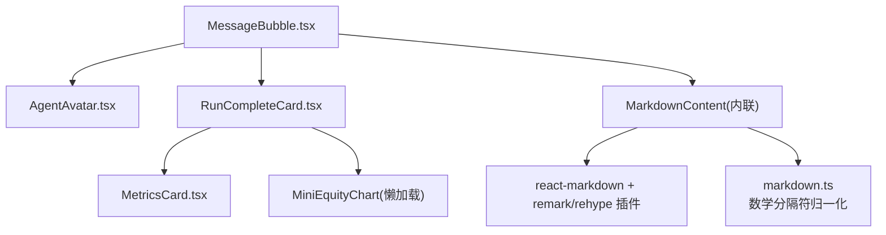
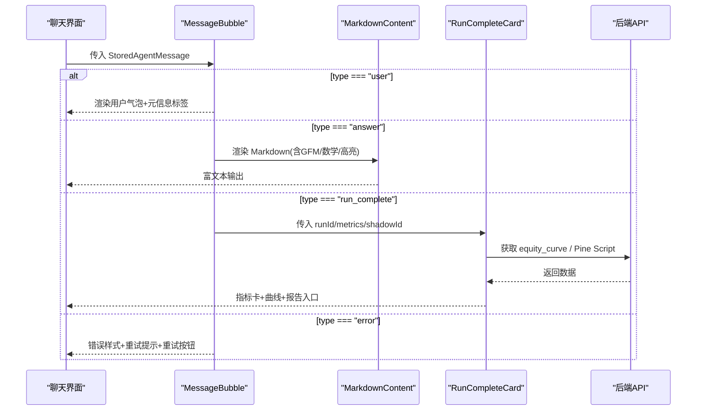
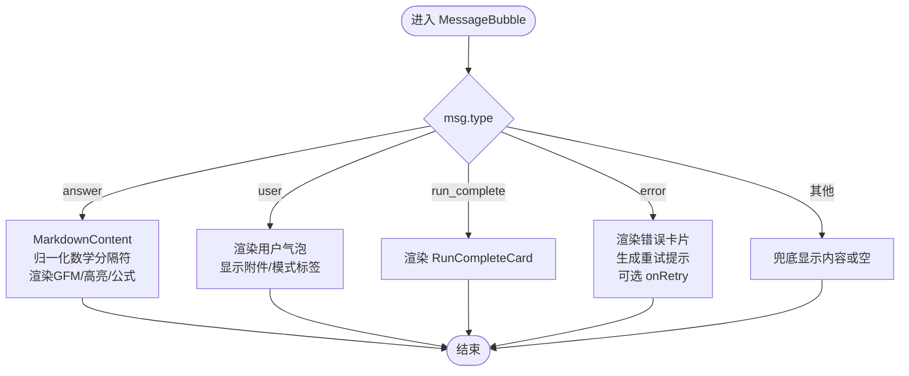
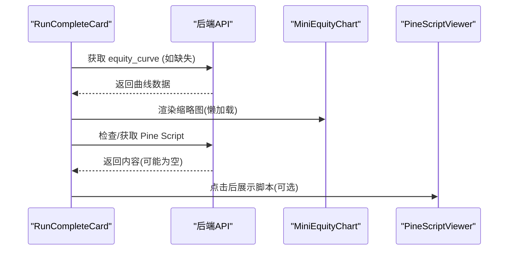
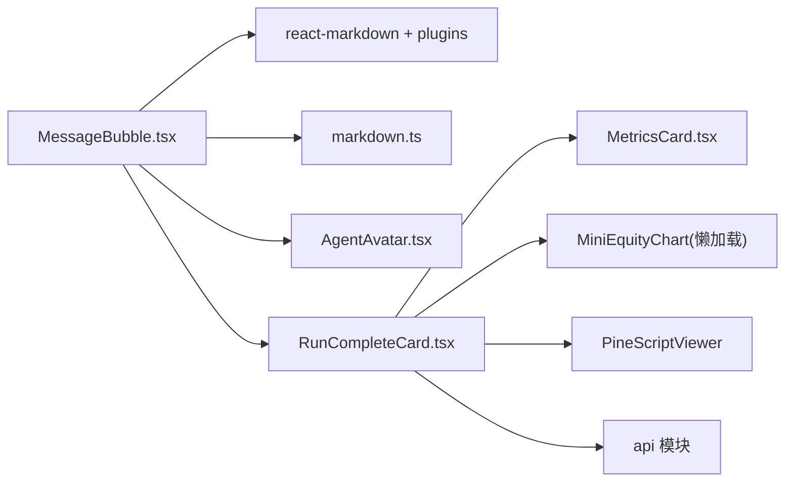

# 消息展示组件

<cite>
**本文引用的文件**
- [MessageBubble.tsx](file://frontend/src/components/chat/MessageBubble.tsx)
- [AgentAvatar.tsx](file://frontend/src/components/chat/AgentAvatar.tsx)
- [RunCompleteCard.tsx](file://frontend/src/components/chat/RunCompleteCard.tsx)
- [MetricsCard.tsx](file://frontend/src/components/chat/MetricsCard.tsx)
- [markdown.ts](file://frontend/src/lib/markdown.ts)
- [MessageBubble.test.tsx](file://frontend/src/components/chat/__tests__/MessageBubble.test.tsx)
- [AgentAvatar.test.tsx](file://frontend/src/components/chat/__tests__/AgentAvatar.test.tsx)
</cite>

## 目录
1. [简介](#简介)
2. [项目结构](#项目结构)
3. [核心组件](#核心组件)
4. [架构总览](#架构总览)
5. [详细组件分析](#详细组件分析)
6. [依赖关系分析](#依赖关系分析)
7. [性能考量](#性能考量)
8. [故障排查指南](#故障排查指南)
9. [结论](#结论)
10. [附录：使用示例与扩展方法](#附录：使用示例与扩展方法)

## 简介
本文件面向 Vibe-Trading 前端的消息展示子系统，聚焦以下三个关键组件：
- MessageBubble：统一的消息气泡容器，负责区分用户消息、AI 回答、错误消息与运行完成消息，并渲染富文本、代码高亮、数学公式与 Markdown。
- AgentAvatar：统一的 AI 头像占位，基于品牌标识进行样式化显示。
- RunCompleteCard：回测运行完成后的摘要卡片，展示关键指标、收益曲线缩略图以及报告入口（含 Pine Script 查看）。

文档将深入说明各组件的职责边界、数据流、渲染策略、错误处理与用户体验优化点，并提供可操作的扩展建议。

## 项目结构
消息展示相关的前端代码位于 frontend/src/components/chat 目录下，配合 lib/markdown.ts 的数学公式归一化工具，形成“内容预处理 → Markdown 渲染 → 业务卡片”的分层结构。

图表来源
- [MessageBubble.tsx:1-289](file://frontend/src/components/chat/MessageBubble.tsx#L1-L289)
- [AgentAvatar.tsx:1-10](file://frontend/src/components/chat/AgentAvatar.tsx#L1-L10)
- [RunCompleteCard.tsx:1-141](file://frontend/src/components/chat/RunCompleteCard.tsx#L1-L141)
- [markdown.ts:1-24](file://frontend/src/lib/markdown.ts#L1-L24)

章节来源
- [MessageBubble.tsx:1-289](file://frontend/src/components/chat/MessageBubble.tsx#L1-L289)
- [RunCompleteCard.tsx:1-141](file://frontend/src/components/chat/RunCompleteCard.tsx#L1-L141)
- [markdown.ts:1-24](file://frontend/src/lib/markdown.ts#L1-L24)

## 核心组件
- MessageBubble
  - 根据 msg.type 分支渲染：user、answer、error、run_complete，以及未知类型的兜底。
  - 答案类消息通过 MarkdownContent 渲染，支持 GFM、LaTeX 数学公式、代码高亮；流式模式下禁用重处理器以避免重复渲染。
  - 错误消息提供智能重试提示与重试按钮。
  - 用户消息附带附件、群控模式、目标模式等元信息标签。
- AgentAvatar
  - 固定尺寸的品牌图标占位，作为 AI 侧消息的统一视觉锚点。
- RunCompleteCard
  - 展示回测指标（MetricsCard）、收益曲线缩略图（懒加载）、完整报告链接、Pine Script 查看器、影子报告外链。
  - 按需拉取 equity_curve 与 Pine Script 内容，具备加载骨架屏与错误静默处理。

章节来源
- [MessageBubble.tsx:174-289](file://frontend/src/components/chat/MessageBubble.tsx#L174-L289)
- [AgentAvatar.tsx:1-10](file://frontend/src/components/chat/AgentAvatar.tsx#L1-L10)
- [RunCompleteCard.tsx:21-141](file://frontend/src/components/chat/RunCompleteCard.tsx#L21-L141)

## 架构总览
消息从上层状态进入 MessageBubble，按类型分发到不同渲染路径；答案类消息经 markdown.ts 预处理后交由 react-markdown 渲染；运行完成消息由 RunCompleteCard 聚合指标与可视化；错误消息提供可操作的重试入口。

图表来源
- [MessageBubble.tsx:187-289](file://frontend/src/components/chat/MessageBubble.tsx#L187-L289)
- [RunCompleteCard.tsx:35-86](file://frontend/src/components/chat/RunCompleteCard.tsx#L35-L86)

## 详细组件分析

### MessageBubble：消息路由与富文本渲染
- 消息类型处理
  - user：右侧对齐的气泡，支持附件、群控、目标模式标签；不暴露内部路径，仅显示安全文件名。
  - answer：左侧带 AgentAvatar 的回答气泡，包含复制按钮、Markdown 内容与耗时显示。
  - error：危险风格卡片，自动识别超时、API 限流/服务端错误等场景，生成对应重试提示文案，并提供 onRetry 回调。
  - run_complete：委托给 RunCompleteCard。
  - 未知类型：兜底显示纯文本或空节点。
- 富文本与数学公式
  - 使用 react-markdown 与 remark-gfm、remark-math、rehype-highlight、rehype-katex。
  - 单美元符号解析关闭，避免金额被误判为公式；通过 markdown.ts 将 LLM 输出的 \(...\)/\[...\] 归一化为 $$...$$。
  - 流式模式下禁用 rehype 插件以减少抖动与重复计算。
- 复制与无障碍
  - 复制按钮优先使用 Clipboard API，降级到 execCommand；成功时切换图标并给出屏幕阅读器提示。
- 错误处理与健壮性
  - MarkdownErrorBoundary 捕获渲染异常，失败时回退为纯文本显示；内容变化时重置失败状态。
  - 错误消息的 getRetryHint 根据关键词匹配超时、API 错误等，输出本地化提示。

图表来源
- [MessageBubble.tsx:187-289](file://frontend/src/components/chat/MessageBubble.tsx#L187-L289)
- [markdown.ts:10-23](file://frontend/src/lib/markdown.ts#L10-L23)

章节来源
- [MessageBubble.tsx:17-104](file://frontend/src/components/chat/MessageBubble.tsx#L17-L104)
- [MessageBubble.tsx:106-172](file://frontend/src/components/chat/MessageBubble.tsx#L106-L172)
- [MessageBubble.tsx:174-289](file://frontend/src/components/chat/MessageBubble.tsx#L174-L289)
- [markdown.ts:1-24](file://frontend/src/lib/markdown.ts#L1-L24)

### AgentAvatar：头像样式与语义
- 固定 32px 方形占位，内部嵌入品牌标识 SVG。
- 装饰性元素，设置 aria-hidden 避免读屏干扰。
- 可通过替换 BrandMark 实现主题化或品牌定制。

章节来源
- [AgentAvatar.tsx:1-10](file://frontend/src/components/chat/AgentAvatar.tsx#L1-L10)
- [AgentAvatar.test.tsx:1-16](file://frontend/src/components/chat/__tests__/AgentAvatar.test.tsx#L1-L16)

### RunCompleteCard：回测结果摘要与关键指标
- 指标展示
  - 使用 MetricsCard 以紧凑网格展示关键指标，支持语义化颜色与可读性增强（形状+辅助文本）。
- 收益曲线
  - 若初始未携带 equityCurve，则根据 runId 异步拉取；加载期间显示骨架屏；完成后懒加载 MiniEquityChart。
- 报告与脚本
  - 提供“完整报告”跳转链接。
  - 检测是否存在 Pine Script，存在则提供查看器弹窗；首次点击时按需拉取内容。
  - 支持影子报告外链打开。
- 错误与容错
  - 网络请求失败时静默忽略，保持界面可用；加载状态在 finally 中清理。

图表来源
- [RunCompleteCard.tsx:21-141](file://frontend/src/components/chat/RunCompleteCard.tsx#L21-L141)
- [MetricsCard.tsx:1-65](file://frontend/src/components/chat/MetricsCard.tsx#L1-L65)

章节来源
- [RunCompleteCard.tsx:21-141](file://frontend/src/components/chat/RunCompleteCard.tsx#L21-L141)
- [MetricsCard.tsx:1-65](file://frontend/src/components/chat/MetricsCard.tsx#L1-L65)

## 依赖关系分析
- MessageBubble 依赖
  - react-markdown 生态：remark-gfm、remark-math、rehype-highlight、rehype-katex。
  - 本地工具：markdown.ts 数学分隔符归一化。
  - 子组件：AgentAvatar、RunCompleteCard。
  - 国际化：i18n 用于提示文案。
- RunCompleteCard 依赖
  - 图表：MiniEquityChart（懒加载）。
  - 指标：MetricsCard。
  - 脚本查看：PineScriptViewer。
  - 网络：api.getRun / api.getRunPine。
- 测试覆盖
  - MessageBubble.test.tsx 覆盖用户消息、答案消息、错误消息、运行完成消息与兜底逻辑。
  - AgentAvatar.test.tsx 验证头像结构与无障碍属性。

图表来源
- [MessageBubble.tsx:1-289](file://frontend/src/components/chat/MessageBubble.tsx#L1-L289)
- [RunCompleteCard.tsx:1-141](file://frontend/src/components/chat/RunCompleteCard.tsx#L1-L141)
- [markdown.ts:1-24](file://frontend/src/lib/markdown.ts#L1-L24)

章节来源
- [MessageBubble.test.tsx:1-184](file://frontend/src/components/chat/__tests__/MessageBubble.test.tsx#L1-L184)
- [AgentAvatar.test.tsx:1-16](file://frontend/src/components/chat/__tests__/AgentAvatar.test.tsx#L1-L16)

## 性能考量
- 流式渲染优化
  - 流式模式下禁用 rehype 插件，减少重复解析与重绘开销。
- 懒加载与骨架屏
  - 收益曲线与 Pine Script 内容按需加载，首屏更轻；加载过程提供骨架屏提升感知速度。
- 数学公式归一化
  - 仅在非代码片段区域转换 LaTeX 分隔符，避免对大段代码造成不必要处理。
- 复制与剪贴板
  - 优先使用现代 API，降级兼容旧环境，失败时不影响主流程。
- 错误边界
  - MarkdownErrorBoundary 防止渲染崩溃扩散，保障整体可用性。

[本节为通用性能指导，无需特定文件引用]

## 故障排查指南
- Markdown 渲染失败
  - 现象：内容以纯文本形式显示。
  - 原因：渲染过程中抛出异常，触发错误边界回退。
  - 处理：检查输入内容是否包含非法结构；确认 math 分隔符已正确归一化。
- 复制失败
  - 现象：提示复制失败。
  - 原因：浏览器限制或上下文不安全。
  - 处理：确保在 HTTPS 或 localhost 环境下访问；必要时引导用户使用手动复制。
- 错误消息无重试按钮
  - 现象：错误卡片未显示重试按钮。
  - 原因：父组件未传入 onRetry。
  - 处理：在调用处提供 onRetry(msg) 回调以启用重试。
- 运行完成卡片无曲线或脚本
  - 现象：曲线或 Pine Script 未显示。
  - 原因：后端未返回数据或接口失败。
  - 处理：检查 runId 是否正确；查看网络请求是否成功；确认 finally 中状态清理。

章节来源
- [MessageBubble.tsx:49-68](file://frontend/src/components/chat/MessageBubble.tsx#L49-L68)
- [MessageBubble.tsx:106-143](file://frontend/src/components/chat/MessageBubble.tsx#L106-L143)
- [MessageBubble.tsx:249-275](file://frontend/src/components/chat/MessageBubble.tsx#L249-L275)
- [RunCompleteCard.tsx:35-86](file://frontend/src/components/chat/RunCompleteCard.tsx#L35-L86)

## 结论
MessageBubble、AgentAvatar 与 RunCompleteCard 共同构成了 Vibe-Trading 的消息展示核心。MessageBubble 通过类型路由与富文本能力，统一承载多形态消息；AgentAvatar 提供一致的品牌化视觉锚点；RunCompleteCard 将回测结果以指标、曲线与报告入口的形式直观呈现。结合错误边界、懒加载与本地化提示，系统在可用性、性能与可维护性之间取得良好平衡。

[本节为总结性内容，无需特定文件引用]

## 附录：使用示例与扩展方法
- 基本用法
  - 在聊天列表中渲染消息：
    - 传入 StoredAgentMessage 到 MessageBubble，并根据需要传入 onRetry 以启用错误重试。
    - 示例参考：[MessageBubble.test.tsx:22-30](file://frontend/src/components/chat/__tests__/MessageBubble.test.tsx#L22-L30)、[MessageBubble.test.tsx:124-162](file://frontend/src/components/chat/__tests__/MessageBubble.test.tsx#L124-L162)
- 自定义头像
  - 替换 AgentAvatar 中的 BrandMark 以实现品牌或主题定制。
  - 示例参考：[AgentAvatar.tsx:1-10](file://frontend/src/components/chat/AgentAvatar.tsx#L1-L10)
- 扩展 Markdown 渲染
  - 通过修改 remarkPlugins 与 rehypePlugins 添加新语法支持（例如表格增强、自定义链接行为）。
  - 注意流式模式下的插件选择，避免重复渲染。
  - 示例参考：[MessageBubble.tsx:19-23](file://frontend/src/components/chat/MessageBubble.tsx#L19-L23)
- 扩展错误提示
  - 在 getRetryHint 中添加新的关键词匹配规则，以适配更多错误场景。
  - 示例参考：[MessageBubble.tsx:163-172](file://frontend/src/components/chat/MessageBubble.tsx#L163-L172)
- 扩展运行完成卡片
  - 在 RunCompleteCard 中增加新的指标或外部报告链接；按需懒加载更多可视化。
  - 示例参考：[RunCompleteCard.tsx:88-139](file://frontend/src/components/chat/RunCompleteCard.tsx#L88-L139)

章节来源
- [MessageBubble.test.tsx:22-30](file://frontend/src/components/chat/__tests__/MessageBubble.test.tsx#L22-L30)
- [MessageBubble.test.tsx:124-162](file://frontend/src/components/chat/__tests__/MessageBubble.test.tsx#L124-L162)
- [AgentAvatar.tsx:1-10](file://frontend/src/components/chat/AgentAvatar.tsx#L1-L10)
- [MessageBubble.tsx:19-23](file://frontend/src/components/chat/MessageBubble.tsx#L19-L23)
- [MessageBubble.tsx:163-172](file://frontend/src/components/chat/MessageBubble.tsx#L163-L172)
- [RunCompleteCard.tsx:88-139](file://frontend/src/components/chat/RunCompleteCard.tsx#L88-L139)