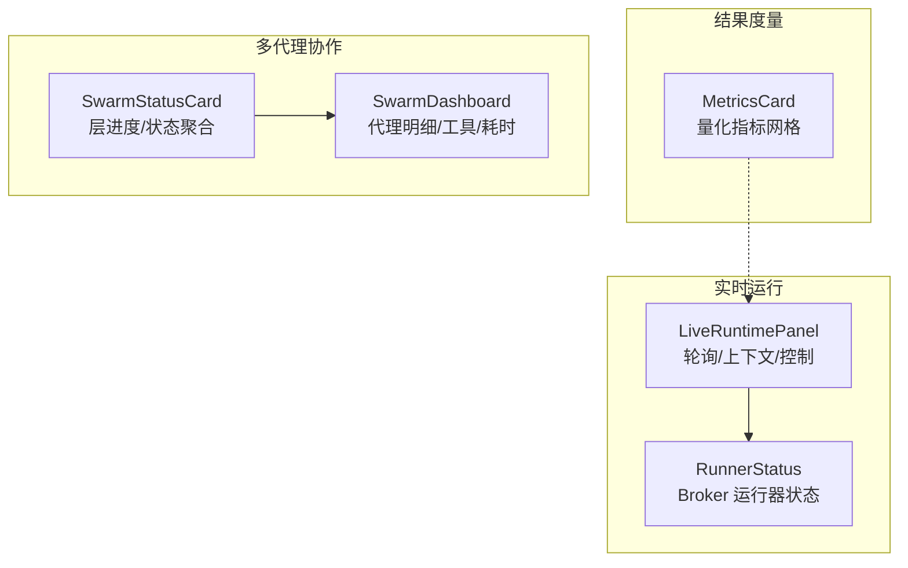
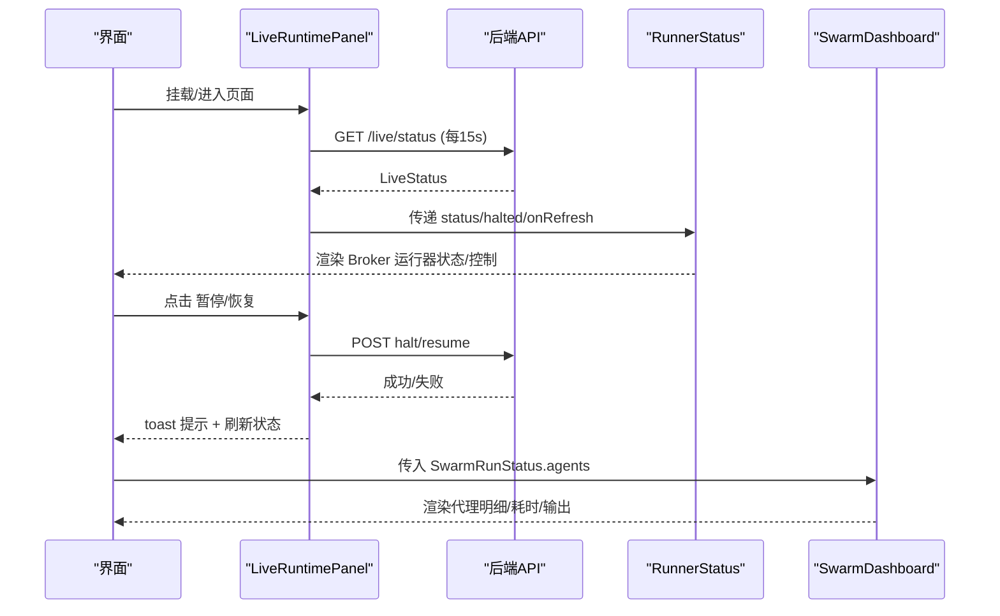
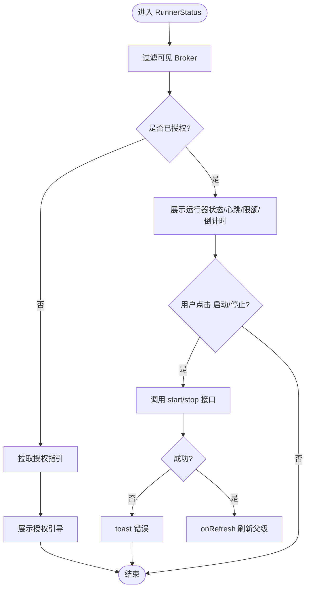
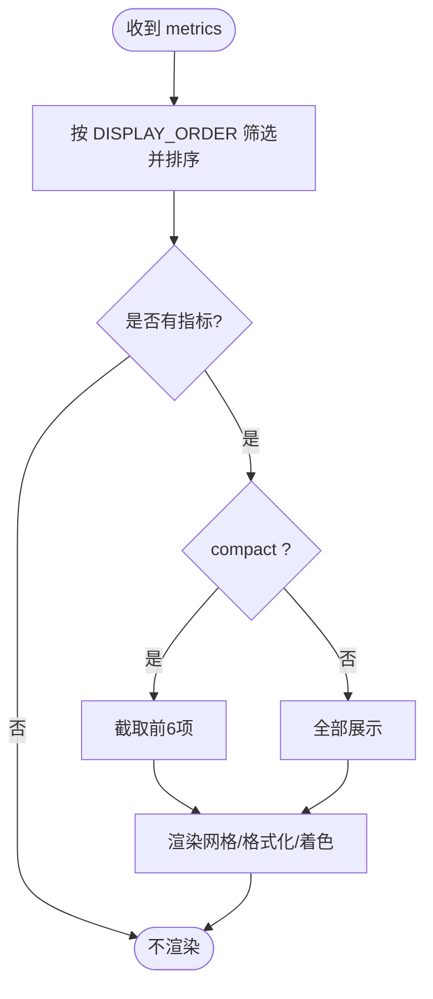
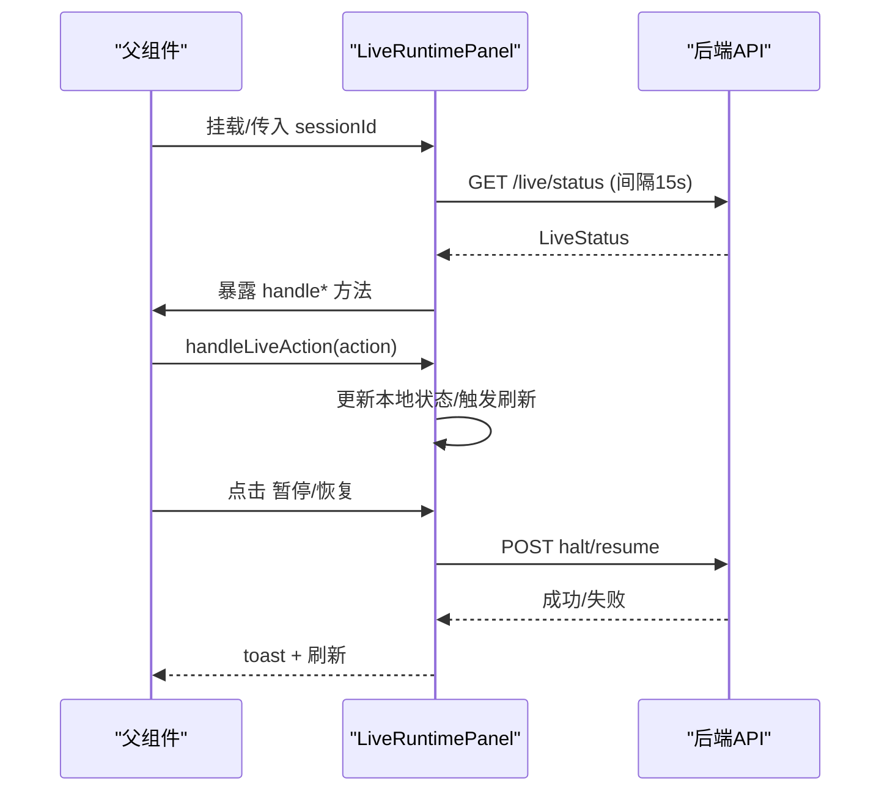
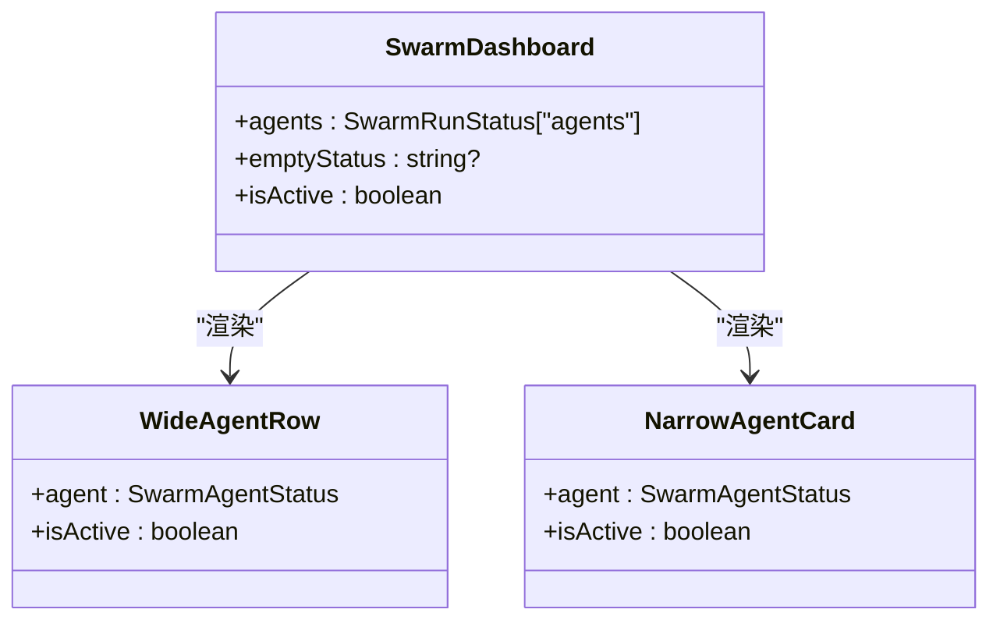
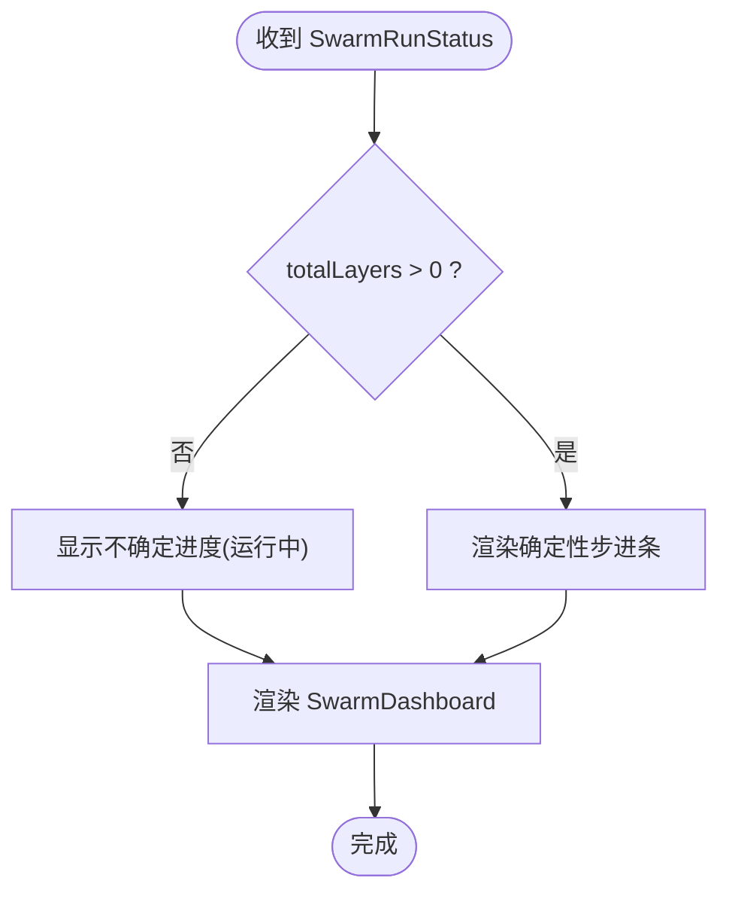
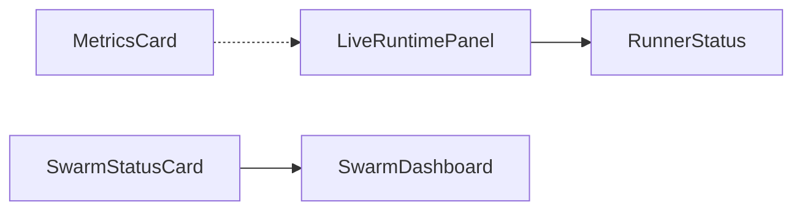

# 状态监控组件

<cite>
**本文引用的文件**
- [RunnerStatus.tsx](file://frontend/src/components/chat/RunnerStatus.tsx)
- [MetricsCard.tsx](file://frontend/src/components/chat/MetricsCard.tsx)
- [LiveRuntimePanel.tsx](file://frontend/src/components/chat/LiveRuntimePanel.tsx)
- [SwarmDashboard.tsx](file://frontend/src/components/chat/SwarmDashboard.tsx)
- [SwarmStatusCard.tsx](file://frontend/src/components/chat/SwarmStatusCard.tsx)
- [RunnerStatus.test.tsx](file://frontend/src/components/chat/__tests__/RunnerStatus.test.tsx)
- [MetricsCard.test.tsx](file://frontend/src/components/chat/__tests__/MetricsCard.test.tsx)
</cite>

## 目录
1. [简介](#简介)
2. [项目结构](#项目结构)
3. [核心组件](#核心组件)
4. [架构总览](#架构总览)
5. [详细组件分析](#详细组件分析)
6. [依赖关系分析](#依赖关系分析)
7. [性能考虑](#性能考虑)
8. [故障排查指南](#故障排查指南)
9. [结论](#结论)
10. [附录](#附录)

## 简介
本文件为 Vibe-Trading 前端“状态监控”相关组件的权威文档，覆盖以下能力：
- RunnerStatus 运行器状态：按券商（Broker）维度展示连接、授权、运行器存活、最后心跳与指令限制倒计时，并提供启动/停止控制。
- MetricsCard 指标卡片：以量化指标网格展示收益、风险、交易统计等关键指标，支持紧凑模式与语义化色彩。
- LiveRuntimePanel 实时运行面板：轮询后端 /live/status，聚合全局/局部暂停、动作事件（如订单拒绝、熔断触发/解除）、以及会话级控制（暂停/恢复）。
- SwarmDashboard 蜂群仪表盘：多代理协作任务的状态、工具、耗时与输出摘要；支持宽窄屏布局。
- SwarmStatusCard 状态卡片：聚合蜂群运行进度（分层步进条）、整体状态与代理列表入口。

同时说明实时数据更新机制、性能监控要点、异常检测与告警提示方式，并给出监控配置、告警规则与自定义仪表板开发建议。

## 项目结构
这些组件位于前端聊天模块下，围绕“实时运行”和“结果度量”两大主题组织：
- 实时运行：LiveRuntimePanel 提供上下文与轮询，RunnerStatus 渲染各 Broker 的运行器状态与控制。
- 结果度量：MetricsCard 展示回测/因子/策略等运行后的量化指标。
- 多代理协作：SwarmStatusCard + SwarmDashboard 呈现蜂群任务的层进度与代理明细。

图表来源
- [LiveRuntimePanel.tsx:119-260](file://frontend/src/components/chat/LiveRuntimePanel.tsx#L119-L260)
- [RunnerStatus.tsx:284-351](file://frontend/src/components/chat/RunnerStatus.tsx#L284-L351)
- [MetricsCard.tsx:23-65](file://frontend/src/components/chat/MetricsCard.tsx#L23-L65)
- [SwarmStatusCard.tsx:126-189](file://frontend/src/components/chat/SwarmStatusCard.tsx#L126-L189)
- [SwarmDashboard.tsx:244-323](file://frontend/src/components/chat/SwarmDashboard.tsx#L244-L323)

章节来源
- [LiveRuntimePanel.tsx:119-260](file://frontend/src/components/chat/LiveRuntimePanel.tsx#L119-L260)
- [RunnerStatus.tsx:284-351](file://frontend/src/components/chat/RunnerStatus.tsx#L284-L351)
- [MetricsCard.tsx:23-65](file://frontend/src/components/chat/MetricsCard.tsx#L23-L65)
- [SwarmStatusCard.tsx:126-189](file://frontend/src/components/chat/SwarmStatusCard.tsx#L126-L189)
- [SwarmDashboard.tsx:244-323](file://frontend/src/components/chat/SwarmDashboard.tsx#L244-L323)

## 核心组件
- RunnerStatus：展示已授权或可连接的 Broker 运行器状态，包括授权引导、运行器开关、最后心跳时间、指令限额与到期倒计时；支持全局停机时禁用控制。
- MetricsCard：将后端返回的指标字典按固定顺序渲染为网格，支持紧凑模式（最多显示前 6 项），对指标值进行格式化并按阈值赋予正/中性/负情绪色。
- LiveRuntimePanel：每 15 秒轮询 /live/status，维护 liveStatus/liveActive/liveIsHalted 等上下文，暴露 halt/resume 控制，并将运行时动作（如 mandate_committed、halt_tripped、halt_cleared）转化为 UI 状态变化与提示。
- SwarmDashboard：以表格/卡片两种布局展示每个代理的 ID、角色、状态、工具、耗时与输出摘要；根据活跃状态为运行中代理添加动画。
- SwarmStatusCard：汇总蜂群预设名称、整体状态、代理完成数与层进度步进条，并内嵌 SwarmDashboard。

章节来源
- [RunnerStatus.tsx:284-351](file://frontend/src/components/chat/RunnerStatus.tsx#L284-L351)
- [MetricsCard.tsx:23-65](file://frontend/src/components/chat/MetricsCard.tsx#L23-L65)
- [LiveRuntimePanel.tsx:119-260](file://frontend/src/components/chat/LiveRuntimePanel.tsx#L119-L260)
- [SwarmDashboard.tsx:244-323](file://frontend/src/components/chat/SwarmDashboard.tsx#L244-L323)
- [SwarmStatusCard.tsx:126-189](file://frontend/src/components/chat/SwarmStatusCard.tsx#L126-L189)

## 架构总览
实时数据流与控制流如下：
- 轮询：LiveRuntimePanel 定时调用后端接口获取 /live/status，更新上下文并驱动 RunnerStatus 刷新。
- 控制：用户通过 RunnerStatus 切换单个 Broker 的运行器，或通过 LiveRuntimePanel 的全局暂停/恢复按钮影响全局状态。
- 事件：后端推送或轮询到的 LiveAction 被 LiveRuntimePanel 处理，更新本地状态并触发 toast 提示。
- 结果：MetricsCard 由上游消息或结果卡片传入 metrics 对象，独立于实时运行面板。
- 蜂群：SwarmStatusCard 接收 SwarmRunStatus，内部使用 SwarmDashboard 渲染代理明细。

图表来源
- [LiveRuntimePanel.tsx:130-150](file://frontend/src/components/chat/LiveRuntimePanel.tsx#L130-L150)
- [LiveRuntimePanel.tsx:186-218](file://frontend/src/components/chat/LiveRuntimePanel.tsx#L186-L218)
- [RunnerStatus.tsx:121-138](file://frontend/src/components/chat/RunnerStatus.tsx#L121-L138)
- [SwarmDashboard.tsx:244-323](file://frontend/src/components/chat/SwarmDashboard.tsx#L244-L323)

## 详细组件分析

### RunnerStatus 运行器状态组件
- 职责
  - 过滤可见的 Broker（已授权或连接态为 connected/ready）。
  - 展示授权引导、运行器开关、最后心跳、指令限额摘要与到期倒计时。
  - 在“全局停机”或 Broker 自身 halted 时禁用控制。
- 交互流程
  - 未授权：自动拉取授权指引并展示。
  - 运行器控制：调用 start/stop 接口，成功后触发 onRefresh 刷新父级状态。
  - 标签页恢复：当页面从隐藏变为可见时主动刷新一次。
- 复杂度与边界
  - 时间格式化与倒计时计算均为 O(1)。
  - 列表滚动高度受限，避免长列表溢出。
- 错误处理
  - 控制失败时 toast 提示错误信息。
  - 不可用后端（404/501）由父级统一处理，此处不显示。

图表来源
- [RunnerStatus.tsx:83-138](file://frontend/src/components/chat/RunnerStatus.tsx#L83-L138)
- [RunnerStatus.tsx:284-351](file://frontend/src/components/chat/RunnerStatus.tsx#L284-L351)

章节来源
- [RunnerStatus.tsx:83-138](file://frontend/src/components/chat/RunnerStatus.tsx#L83-L138)
- [RunnerStatus.tsx:284-351](file://frontend/src/components/chat/RunnerStatus.tsx#L284-L351)
- [RunnerStatus.test.tsx:50-146](file://frontend/src/components/chat/__tests__/RunnerStatus.test.tsx#L50-L146)

### MetricsCard 指标卡片
- 职责
  - 将指标字典按固定顺序渲染为网格，支持紧凑模式（最多 6 项）。
  - 对数值进行格式化，并根据指标类型与阈值赋予正/中性/负面情绪色。
  - 为每个单元格提供本地化的 tooltip 解释。
- 行为特性
  - 未知指标将被忽略。
  - 紧凑模式下仅显示前 N 个指标，适合空间受限场景。
- 无障碍
  - 通过 sr-only 文本与图标组合传达“好/差”语义，避免纯颜色依赖。

图表来源
- [MetricsCard.tsx:23-65](file://frontend/src/components/chat/MetricsCard.tsx#L23-L65)

章节来源
- [MetricsCard.tsx:23-65](file://frontend/src/components/chat/MetricsCard.tsx#L23-L65)
- [MetricsCard.test.tsx:31-95](file://frontend/src/components/chat/__tests__/MetricsCard.test.tsx#L31-L95)

### LiveRuntimePanel 实时运行面板
- 职责
  - 每 15 秒轮询 /live/status，维护 liveStatus、liveActive、liveIsHalted 等上下文。
  - 暴露 resetSession、handleMandateCommitted、handleHalted、handleResumed、handleLiveAction 等方法供父级调用。
  - 提供全局暂停/恢复按钮，并在操作后 toast 提示。
- 数据处理
  - 规范化 broker 作用域，区分全局与局部暂停。
  - 根据 LiveAction 类型更新本地状态（如 mandate_committed、halt_tripped、halt_cleared）。
- 集成点
  - 向 RunnerStatus 注入 status/halted/onRefresh。
  - 与后端 API 紧密耦合，错误码 404/501 视为不可用并隐藏面板。

图表来源
- [LiveRuntimePanel.tsx:119-260](file://frontend/src/components/chat/LiveRuntimePanel.tsx#L119-L260)
- [LiveRuntimePanel.tsx:186-218](file://frontend/src/components/chat/LiveRuntimePanel.tsx#L186-L218)

章节来源
- [LiveRuntimePanel.tsx:119-260](file://frontend/src/components/chat/LiveRuntimePanel.tsx#L119-L260)
- [LiveRuntimePanel.tsx:186-218](file://frontend/src/components/chat/LiveRuntimePanel.tsx#L186-L218)

### SwarmDashboard 蜂群仪表盘
- 职责
  - 以宽表/窄卡两种布局展示代理 ID、角色、状态、工具、耗时与输出摘要。
  - 为运行中的代理添加旋转动画，增强“正在执行”感知。
  - 空状态时显示“团队准备中”或“详情不可用”。
- 交互与可访问性
  - 使用 role="table"/role="row"/role="cell" 提升表格语义。
  - 工具名与状态均做本地化处理。

图表来源
- [SwarmDashboard.tsx:124-195](file://frontend/src/components/chat/SwarmDashboard.tsx#L124-L195)
- [SwarmDashboard.tsx:197-242](file://frontend/src/components/chat/SwarmDashboard.tsx#L197-L242)
- [SwarmDashboard.tsx:244-323](file://frontend/src/components/chat/SwarmDashboard.tsx#L244-L323)

章节来源
- [SwarmDashboard.tsx:124-195](file://frontend/src/components/chat/SwarmDashboard.tsx#L124-L195)
- [SwarmDashboard.tsx:197-242](file://frontend/src/components/chat/SwarmDashboard.tsx#L197-L242)
- [SwarmDashboard.tsx:244-323](file://frontend/src/components/chat/SwarmDashboard.tsx#L244-L323)

### SwarmStatusCard 状态卡片
- 职责
  - 聚合蜂群预设名称、整体状态、代理完成数与层进度步进条。
  - 内嵌 SwarmDashboard 展示代理明细。
- 层进度
  - 当 totalLayers > 0 时，渲染确定性进度条；否则在运行中显示不确定进度动画。
  - 当前层高亮并带脉冲动画，已完成层填充主色。

图表来源
- [SwarmStatusCard.tsx:16-107](file://frontend/src/components/chat/SwarmStatusCard.tsx#L16-L107)
- [SwarmStatusCard.tsx:126-189](file://frontend/src/components/chat/SwarmStatusCard.tsx#L126-L189)

章节来源
- [SwarmStatusCard.tsx:16-107](file://frontend/src/components/chat/SwarmStatusCard.tsx#L16-L107)
- [SwarmStatusCard.tsx:126-189](file://frontend/src/components/chat/SwarmStatusCard.tsx#L126-L189)

## 依赖关系分析
- 组件间耦合
  - LiveRuntimePanel 作为上下文提供者，向下注入 RunnerStatus 所需的状态与控制回调。
  - SwarmStatusCard 组合 SwarmDashboard，形成“概览+明细”的层级结构。
  - MetricsCard 为无状态展示组件，依赖外部传入的 metrics。
- 外部依赖
  - 后端 API：/live/status、start/stop runner、halt/resume 等。
  - i18n：所有文案通过翻译键渲染，便于国际化。
  - 图标库：lucide-react 用于状态指示。
- 潜在循环依赖
  - 组件之间通过 props/context 单向通信，未见循环导入迹象。

图表来源
- [LiveRuntimePanel.tsx:256-275](file://frontend/src/components/chat/LiveRuntimePanel.tsx#L256-L275)
- [SwarmStatusCard.tsx:180-184](file://frontend/src/components/chat/SwarmStatusCard.tsx#L180-L184)

章节来源
- [LiveRuntimePanel.tsx:256-275](file://frontend/src/components/chat/LiveRuntimePanel.tsx#L256-L275)
- [SwarmStatusCard.tsx:180-184](file://frontend/src/components/chat/SwarmStatusCard.tsx#L180-L184)

## 性能考虑
- 轮询频率：LiveRuntimePanel 默认每 15 秒轮询一次，平衡了实时性与网络开销。可根据业务需要调整。
- 渲染优化：RunnerStatus、MetricsCard、SwarmDashboard、SwarmStatusCard 均使用 memo 包裹，减少不必要的重渲染。
- 列表滚动：RunnerStatus 展开区域限制最大高度并启用内部滚动，避免长列表导致布局抖动。
- 条件渲染：仅在存在可见 Broker 或活动状态时渲染 RunnerStatus，减少无效 DOM。
- 动画与过渡：SwarmDashboard 对运行中代理使用轻量动画，注意在低性能设备上可通过 motion-reduce 关闭。

[本节为通用性能建议，不直接分析具体代码行]

## 故障排查指南
- 后端不可用（404/501）
  - 现象：LiveRuntimePanel 将 liveStatusUnavailable 置为 true，RunnerStatus 不显示。
  - 处理：检查后端路由与版本兼容性；确认 /live/status 可用。
- 授权失败
  - 现象：RunnerStatus 显示“未连接”，并尝试拉取授权指引失败。
  - 处理：检查连接器配置与凭据；重试授权流程。
- 运行器控制失败
  - 现象：start/stop 失败，toast 提示错误。
  - 处理：查看后端日志；确认权限与运行环境；必要时重启服务。
- 蜂群状态不更新
  - 现象：SwarmStatusCard/ Dashboard 长时间停留在“准备中”。
  - 处理：确认后端任务调度与代理注册；检查网络与 SSE/WebSocket 通道（如有）。
- 指标不显示
  - 现象：MetricsCard 为空。
  - 处理：确认 metrics 对象包含受支持的键；检查 DISPLAY_ORDER 与格式化工具。

章节来源
- [LiveRuntimePanel.tsx:130-150](file://frontend/src/components/chat/LiveRuntimePanel.tsx#L130-L150)
- [RunnerStatus.tsx:121-138](file://frontend/src/components/chat/RunnerStatus.tsx#L121-L138)
- [MetricsCard.tsx:23-65](file://frontend/src/components/chat/MetricsCard.tsx#L23-L65)

## 结论
该套状态监控组件形成了“实时运行 + 结果度量 + 多代理协作”的完整可视化闭环：
- LiveRuntimePanel 负责实时数据与控制中枢；
- RunnerStatus 聚焦 Broker 运行器生命周期管理；
- MetricsCard 提供简洁直观的量化指标展示；
- SwarmStatusCard 与 SwarmDashboard 协同呈现多代理任务进度与细节。
通过合理的轮询策略、memo 优化与条件渲染，系统在实时性与性能之间取得良好平衡。结合测试用例，可确保关键交互与边界场景稳定可靠。

[本节为总结性内容，不直接分析具体代码行]

## 附录

### 监控配置建议
- 轮询间隔：默认 15 秒；在高并发或弱网环境下可适当延长。
- 可见性刷新：利用页面可见性变化触发一次刷新，降低后台资源消耗。
- 错误降级：后端不可用时隐藏面板，避免干扰用户。

### 告警规则建议
- 全局停机：当 global_halted 为真时，突出显示并禁用控制按钮。
- 局部停机：针对特定 Broker 的 halted 状态，单独提示并限制操作。
- 授权过期：mandate.expires_at 临近时给予提醒；过期后禁止启动运行器。
- 指标告警：基于 MetricsCard 的情绪判定（如 Sharpe < 阈值、最大回撤超阈）可在上层扩展告警逻辑。

### 自定义仪表板开发指南
- 复用上下文：通过 LiveRuntimePanel 暴露的方法（resetSession、handleMandateCommitted、handleHalted、handleResumed、handleLiveAction）接入自定义视图。
- 组合组件：将 RunnerStatus、MetricsCard、SwarmStatusCard 组合到同一页面，按需布局。
- 扩展指标：如需新增指标展示，可在 MetricsCard 的 DISPLAY_ORDER 与格式化工具中扩展键位与显示逻辑。
- 国际化：所有文案通过 i18n 键渲染，新增文案需同步翻译资源。

[本节为通用指导，不直接分析具体代码行]