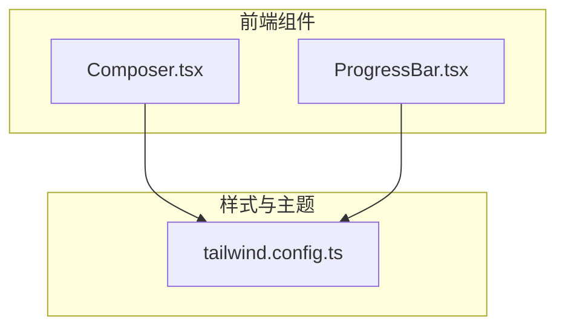
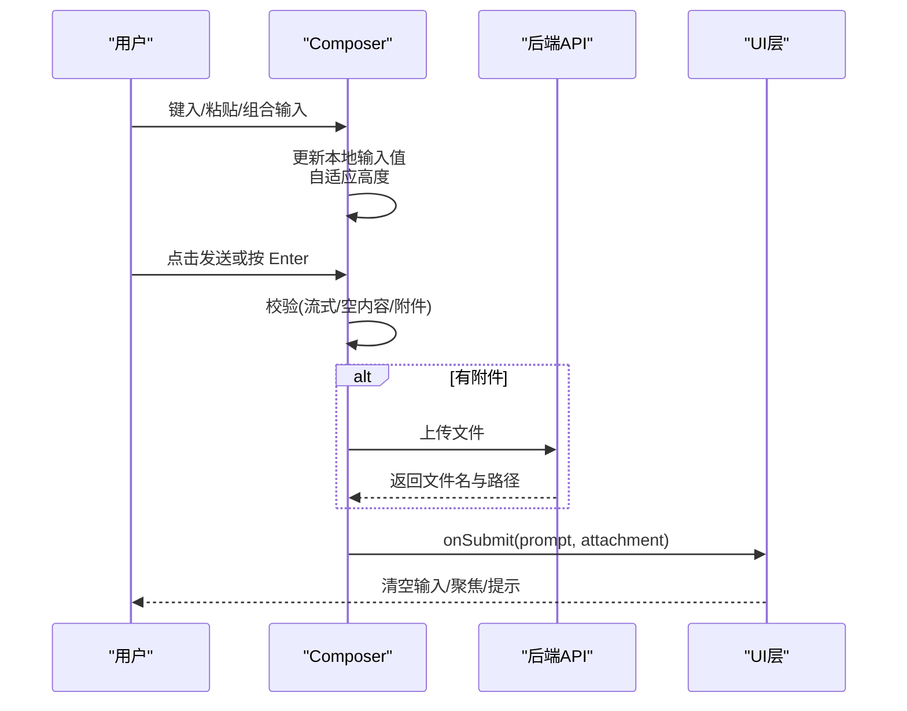
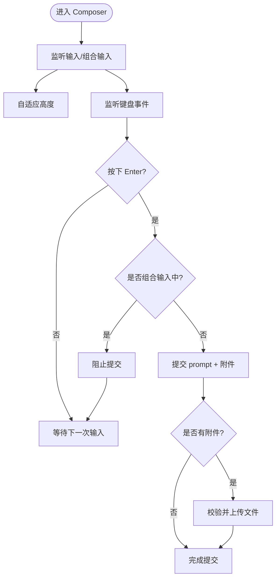
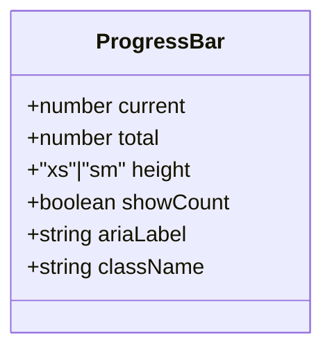
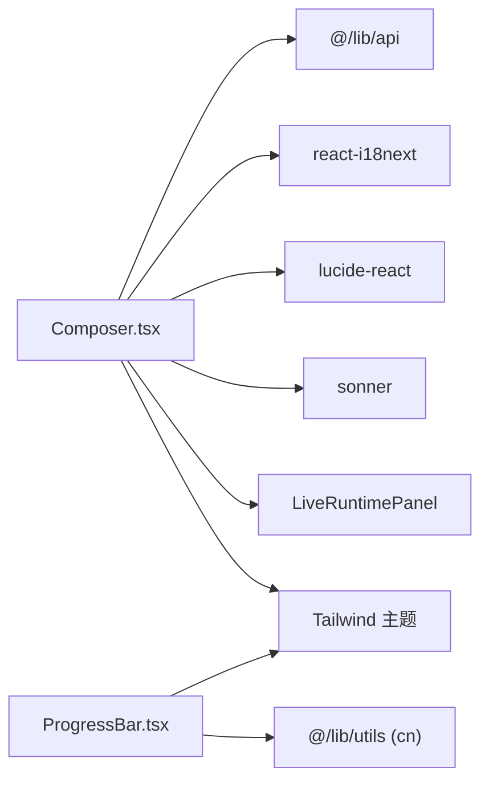

# 用户输入组件

<cite>
**本文引用的文件**
- [Composer.tsx](file://frontend/src/components/chat/Composer.tsx)
- [ProgressBar.tsx](file://frontend/src/components/chat/ProgressBar.tsx)
- [Composer.test.tsx](file://frontend/src/components/chat/__tests__/Composer.test.tsx)
- [ProgressBar.test.tsx](file://frontend/src/components/chat/__tests__/ProgressBar.test.tsx)
- [tailwind.config.ts](file://frontend/tailwind.config.ts)
</cite>

## 目录
1. [简介](#简介)
2. [项目结构](#项目结构)
3. [核心组件](#核心组件)
4. [架构总览](#架构总览)
5. [详细组件分析](#详细组件分析)
6. [依赖关系分析](#依赖关系分析)
7. [性能考虑](#性能考虑)
8. [故障排查指南](#故障排查指南)
9. [结论](#结论)
10. [附录](#附录)

## 简介
本文件面向 Vibe-Trading 前端中的“用户输入”相关组件，重点覆盖：
- Composer（智能输入框）：多行编辑、自动补全与快捷键、文件附件上传、状态联动与无障碍支持。
- ProgressBar（进度条）：状态管理、动画过渡、可访问性与尺寸配置。
同时给出输入验证、字符限制、响应式布局、键盘导航、移动端适配、事件处理、数据绑定与表单集成的实现要点与示例路径。

## 项目结构
与用户输入相关的核心代码位于前端 chat 组件目录中，样式基于 Tailwind CSS 主题变量进行响应式与暗色模式适配。

图表来源
- [Composer.tsx:1-413](file://frontend/src/components/chat/Composer.tsx#L1-L413)
- [ProgressBar.tsx:1-74](file://frontend/src/components/chat/ProgressBar.tsx#L1-L74)
- [tailwind.config.ts:1-34](file://frontend/tailwind.config.ts#L1-L34)

章节来源
- [Composer.tsx:1-413](file://frontend/src/components/chat/Composer.tsx#L1-L413)
- [ProgressBar.tsx:1-74](file://frontend/src/components/chat/ProgressBar.tsx#L1-L74)
- [tailwind.config.ts:1-34](file://frontend/tailwind/tailwind.config.ts#L1-L34)

## 核心组件
- Composer：提供文本输入、多行自适应高度、输入法组合输入兼容、Enter 提交、附件上传、快捷操作菜单、导出与停止生成等能力；通过 ref 暴露 fill/focus/submit 方法供父级调用。
- ProgressBar：轻量水平进度条，支持高度、计数显示、无障碍标签与百分比宽度动画。

章节来源
- [Composer.tsx:42-127](file://frontend/src/components/chat/Composer.tsx#L42-L127)
- [ProgressBar.tsx:4-17](file://frontend/src/components/chat/ProgressBar.tsx#L4-L17)

## 架构总览
Composer 作为输入入口，负责本地状态（输入文本、附件、上传中标志、菜单显隐）、事件处理（键盘、输入、组合输入）、文件校验与上传、以及将结果提交给父组件。ProgressBar 仅负责展示当前/总量并计算百分比宽度，配合主题色与过渡动画呈现进度。

图表来源
- [Composer.tsx:104-165](file://frontend/src/components/chat/Composer.tsx#L104-L165)
- [Composer.tsx:328-376](file://frontend/src/components/chat/Composer.tsx#L328-L376)

## 详细组件分析

### Composer（智能输入框）
- 多行编辑与自适应高度
  - 使用 textarea 并通过 onInput 动态设置高度以匹配内容滚动高度，实现多行自适应。
  - 在外部填充（fill）时，同样重置高度并聚焦。
- 输入法与快捷键
  - 通过 compositionStart/compositionEnd 与时间戳判断，避免在中文输入法组合期间误触发 Enter 提交。
  - Enter 提交逻辑：未按住 Shift 且不在组合输入中时提交；Shift+Enter 换行。
- 文件附件上传
  - 隐藏 input[type=file]，通过菜单触发选择；支持白名单扩展名与黑名单可执行/压缩包类型；大小限制与错误提示。
  - 上传成功后以附件标签形式展示，支持移除。
- 状态与交互
  - streaming 状态下禁用输入并切换为“停止”按钮；goalComposerActive/swarmPreset 等上下文会改变占位符与行为。
  - 暴露 ref 方法：fill（填充并聚焦）、focus（聚焦）、submit（提交）。
- 无障碍与国际化
  - 为输入框提供 aria-label；上传菜单使用 role="menu"/role="menuitem"，并提供 aria-expanded 与 aria-controls。
  - 文案通过 i18n 获取，支持多语言。
- 响应式与样式
  - 基于 Tailwind 的间距、圆角、阴影与焦点环；颜色来自主题变量，支持暗色模式。

图表来源
- [Composer.tsx:328-376](file://frontend/src/components/chat/Composer.tsx#L328-L376)
- [Composer.tsx:134-165](file://frontend/src/components/chat/Composer.tsx#L134-L165)

章节来源
- [Composer.tsx:88-127](file://frontend/src/components/chat/Composer.tsx#L88-L127)
- [Composer.tsx:129-165](file://frontend/src/components/chat/Composer.tsx#L129-L165)
- [Composer.tsx:233-327](file://frontend/src/components/chat/Composer.tsx#L233-L327)
- [Composer.tsx:328-410](file://frontend/src/components/chat/Composer.tsx#L328-L410)

#### 输入验证与字符限制
- 文件类型白名单：限制常见文档、表格、图片与日志等扩展名。
- 安全黑名单：禁止可执行与压缩归档类文件。
- 文件大小限制：超过阈值则提示并拒绝上传。
- 提交前校验：流式进行中不提交；目标模式下需非空文本才允许提交。

章节来源
- [Composer.tsx:39-45](file://frontend/src/components/chat/Composer.tsx#L39-L45)
- [Composer.tsx:134-165](file://frontend/src/components/chat/Composer.tsx#L134-L165)
- [Composer.tsx:388-407](file://frontend/src/components/chat/Composer.tsx#L388-L407)

#### 键盘导航与无障碍
- 输入框具备明确的 aria-label，流式时设为只读以提升可访问性。
- 更多选项菜单使用 menu/menuitem 语义，Esc 关闭并回到触发按钮。
- 焦点管理：提交后保持焦点在输入框；菜单打开/关闭时合理聚焦。

章节来源
- [Composer.tsx:167-187](file://frontend/src/components/chat/Composer.tsx#L167-L187)
- [Composer.tsx:233-327](file://frontend/src/components/chat/Composer.tsx#L233-L327)
- [Composer.tsx:360-376](file://frontend/src/components/chat/Composer.tsx#L360-L376)

#### 移动端适配
- 输入区域采用弹性布局与紧凑内边距，在小屏下仍可舒适操作。
- 上传菜单绝对定位，避免遮挡输入区；按钮尺寸适合触控。
- 通过主题变量与 Tailwind 断点实现暗色与响应式表现。

章节来源
- [Composer.tsx:233-327](file://frontend/src/components/chat/Composer.tsx#L233-L327)
- [tailwind.config.ts:6-30](file://frontend/tailwind.config.ts#L6-L30)

#### 事件处理、数据绑定与表单集成
- 事件：onInput 驱动高度自适应；onKeyDown 处理 Enter；onChange 同步本地状态；文件选择触发上传流程。
- 数据绑定：本地 state 控制输入值与附件；ref 暴露 fill/focus/submit 供父组件双向控制。
- 表单集成：包裹在 form 中，提交时阻止默认行为并调用统一提交回调。

章节来源
- [Composer.tsx:129-165](file://frontend/src/components/chat/Composer.tsx#L129-L165)
- [Composer.tsx:328-376](file://frontend/src/components/chat/Composer.tsx#L328-L376)
- [Composer.tsx:189-191](file://frontend/src/components/chat/Composer.tsx#L189-L191)

### ProgressBar（进度条）
- 状态管理
  - current/total 决定进度百分比；内部对 current 进行裁剪到 [0, total]，total<=0 时不渲染。
- 动画效果
  - 填充条使用 transition-all duration-300 平滑过渡。
- 可访问性
  - 使用原生 progress 元素承载语义，视觉条仅作装饰；支持 ariaLabel。
- 尺寸与计数
  - height 可选 xs/sm；showCount 显示“当前/总数”。

图表来源
- [ProgressBar.tsx:4-17](file://frontend/src/components/chat/ProgressBar.tsx#L4-L17)
- [ProgressBar.tsx:30-73](file://frontend/src/components/chat/ProgressBar.tsx#L30-L73)

章节来源
- [ProgressBar.tsx:30-73](file://frontend/src/components/chat/ProgressBar.tsx#L30-L73)

## 依赖关系分析
- Composer 依赖：
  - React Hooks：useState/useRef/useCallback/useEffect/useImperativeHandle/memo/forwardRef
  - 图标库：lucide-react
  - 通知：sonner
  - 网络：@/lib/api（用于文件上传）
  - 国际化：react-i18next
  - 子组件：LiveRuntimeStatus/LiveRuntimeControl（运行时状态与控制）
- ProgressBar 依赖：
  - 工具函数：cn（类名合并）
  - Tailwind 主题变量（颜色、圆角、字号等）

图表来源
- [Composer.tsx:1-33](file://frontend/src/components/chat/Composer.tsx#L1-L33)
- [ProgressBar.tsx:1-3](file://frontend/src/components/chat/ProgressBar.tsx#L1-L3)
- [tailwind.config.ts:6-30](file://frontend/tailwind.config.ts#L6-L30)

章节来源
- [Composer.tsx:1-33](file://frontend/src/components/chat/Composer.tsx#L1-L33)
- [ProgressBar.tsx:1-3](file://frontend/src/components/chat/ProgressBar.tsx#L1-L3)
- [tailwind.config.ts:6-30](file://frontend/tailwind.config.ts#L6-L30)

## 性能考虑
- 输入防抖与重渲染
  - 使用 memo 包裹 Composer，减少不必要的重渲染；本地状态变更仅在输入框内发生，避免波及外层列表。
- 输入法组合输入优化
  - 通过组合输入标记与时间窗口避免误提交，减少无效回调。
- 文件上传
  - 上传前进行类型与大小校验，失败快速反馈，避免无意义请求。
- 进度条动画
  - 使用 CSS 过渡而非 JS 动画，保证流畅度与低开销。

章节来源
- [Composer.tsx:71-87](file://frontend/src/components/chat/Composer.tsx#L71-L87)
- [Composer.tsx:333-358](file://frontend/src/components/chat/Composer.tsx#L333-L358)
- [ProgressBar.tsx:61-64](file://frontend/src/components/chat/ProgressBar.tsx#L61-L64)

## 故障排查指南
- 无法提交
  - 检查是否在流式状态（streaming=true）；确认输入非空或已附加文件；查看 Enter 是否被输入法组合输入拦截。
- 附件上传失败
  - 确认文件扩展名在白名单且不在黑名单；检查文件大小是否超限；查看上传接口返回的错误信息。
- 进度条不显示
  - 确保 total>0；current 会被裁剪到 [0,total]；若传入负数或零，组件不会渲染。
- 键盘行为异常
  - 确认 Enter 与 Shift+Enter 的行为是否符合预期；检查输入法组合输入的时间窗口是否过短或过长。

章节来源
- [Composer.tsx:104-112](file://frontend/src/components/chat/Composer.tsx#L104-L112)
- [Composer.tsx:134-165](file://frontend/src/components/chat/Composer.tsx#L134-L165)
- [Composer.tsx:345-358](file://frontend/src/components/chat/Composer.tsx#L345-L358)
- [ProgressBar.tsx:38-42](file://frontend/src/components/chat/ProgressBar.tsx#L38-L42)

## 结论
Composer 提供了完善的智能输入体验：多行自适应、输入法友好、快捷键支持、附件上传与丰富的上下文操作；ProgressBar 则以最小化实现提供稳定、可访问的进度可视化。两者结合 Tailwind 主题，可在桌面与移动端保持一致的交互与视觉质量。建议在集成时遵循其事件与状态约定，充分利用 ref 方法与回调，以获得最佳的用户体验与可维护性。

## 附录
- 测试用例参考
  - Composer：输入法组合输入与提交时机、输入边界隔离。
  - ProgressBar：边界值裁剪、百分比计算、计数显示与高度类名。

章节来源
- [Composer.test.tsx:36-55](file://frontend/src/components/chat/__tests__/Composer.test.tsx#L36-L55)
- [ProgressBar.test.tsx:5-8](file://frontend/src/components/chat/__tests__/ProgressBar.test.tsx#L5-L8)
- [ProgressBar.test.tsx:20-34](file://frontend/src/components/chat/__tests__/ProgressBar.test.tsx#L20-L34)
- [ProgressBar.test.tsx:36-56](file://frontend/src/components/chat/__tests__/ProgressBar.test.tsx#L36-L56)