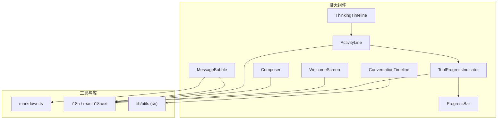
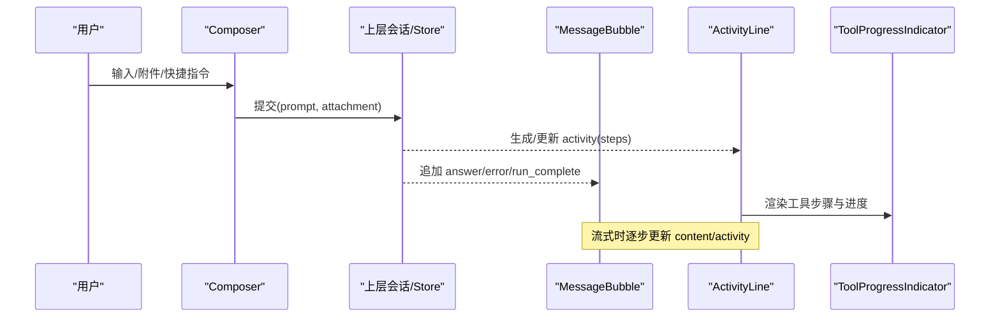
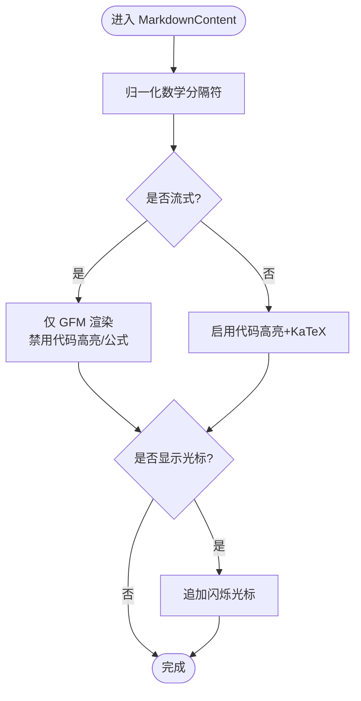
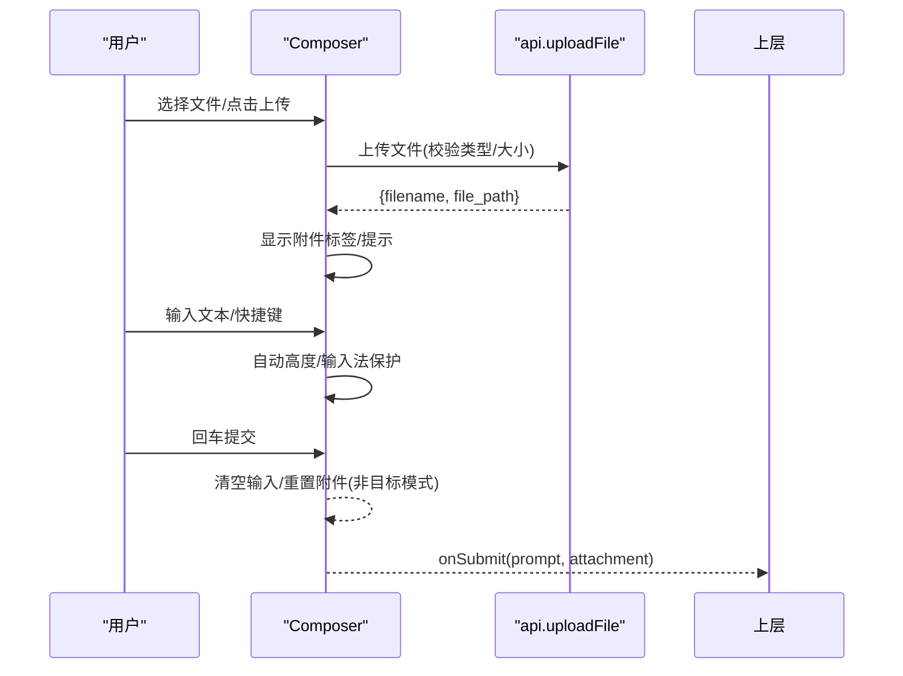
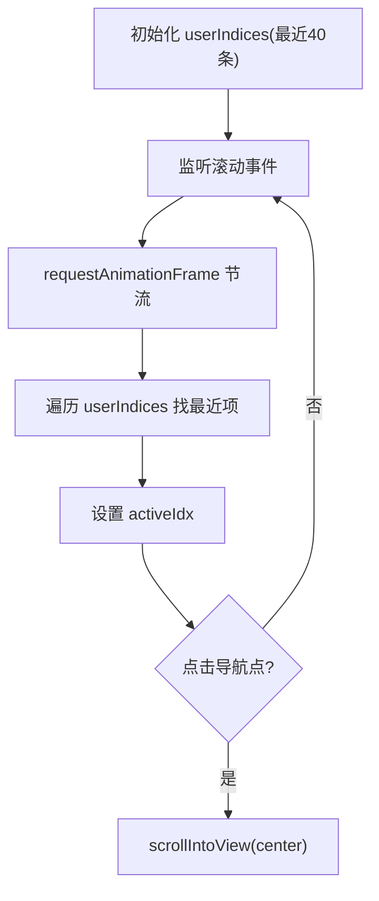
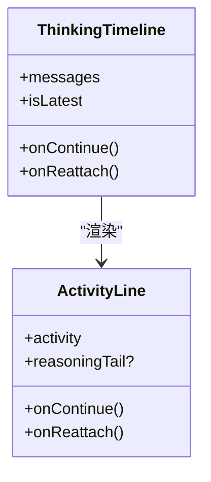
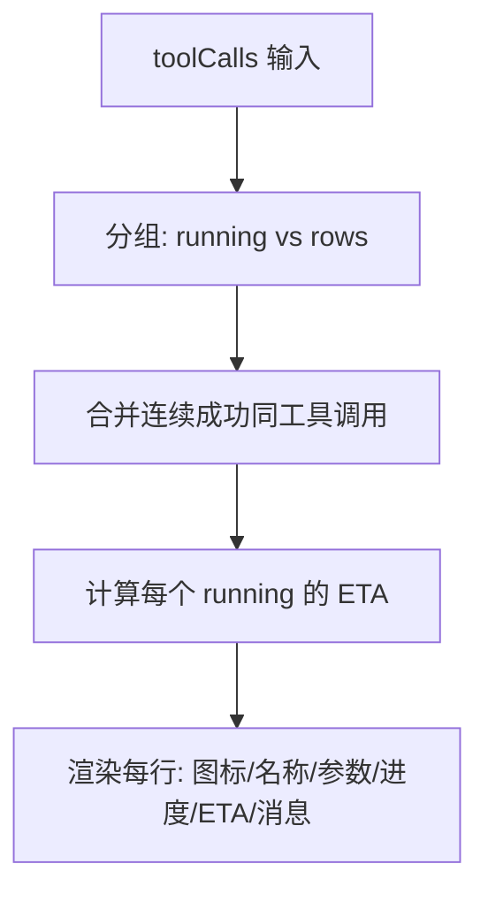
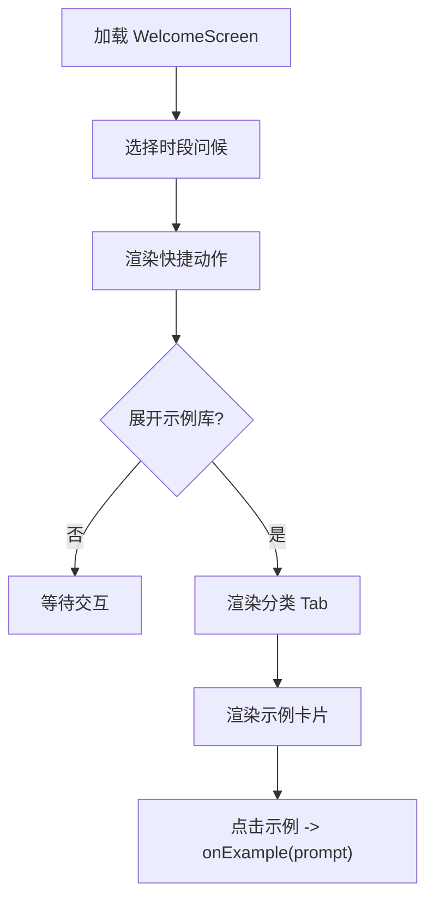
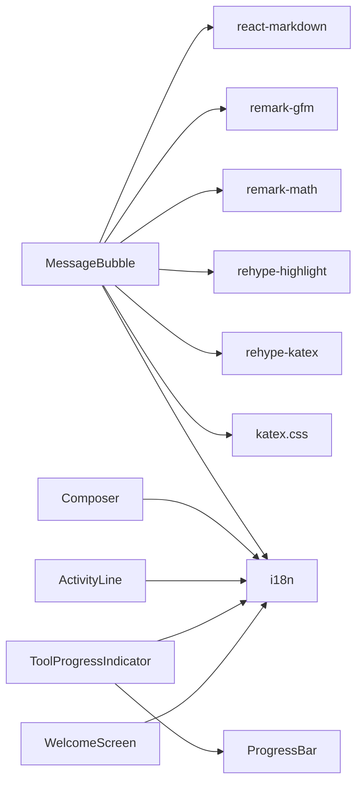

# 聊天组件

<cite>
**本文引用的文件**
- [MessageBubble.tsx](file://frontend/src/components/chat/MessageBubble.tsx)
- [Composer.tsx](file://frontend/src/components/chat/Composer.tsx)
- [ConversationTimeline.tsx](file://frontend/src/components/chat/ConversationTimeline.tsx)
- [ThinkingTimeline.tsx](file://frontend/src/components/chat/ThinkingTimeline.tsx)
- [ToolProgressIndicator.tsx](file://frontend/src/components/chat/ToolProgressIndicator.tsx)
- [WelcomeScreen.tsx](file://frontend/src/components/chat/WelcomeScreen.tsx)
- [ActivityLine.tsx](file://frontend/src/components/chat/ActivityLine.tsx)
- [ProgressBar.tsx](file://frontend/src/components/chat/ProgressBar.tsx)
- [markdown.ts](file://frontend/src/lib/markdown.ts)
</cite>

## 目录
1. [简介](#简介)
2. [项目结构](#项目结构)
3. [核心组件](#核心组件)
4. [架构总览](#架构总览)
5. [详细组件分析](#详细组件分析)
6. [依赖关系分析](#依赖关系分析)
7. [性能考虑](#性能考虑)
8. [故障排查指南](#故障排查指南)
9. [结论](#结论)
10. [附录](#附录)

## 简介
本文件面向 Vibe-Trading 前端应用的聊天子系统，聚焦以下能力：消息气泡的富文本渲染、代码高亮与数学公式显示；输入框的智能补全、快捷键与多行编辑；对话时间线的消息流管理与滚动定位；思考时间线对 AI 推理过程的可视化；工具进度指示器的任务状态跟踪；欢迎屏幕的引导界面设计。同时覆盖实时通信、流式响应处理、错误重试机制与性能优化策略，并提供界面定制、主题扩展与国际化支持要点。

## 项目结构
聊天相关的前端组件集中在 frontend/src/components/chat 下，配合通用 UI 与工具库（如 i18n、Tailwind 样式、工具函数）共同构成完整的聊天体验。关键文件包括：
- 消息展示：MessageBubble、ActivityLine、ThinkingTimeline
- 输入与交互：Composer
- 导航与概览：ConversationTimeline、WelcomeScreen
- 进度与状态：ToolProgressIndicator、ProgressBar
- 内容渲染：markdown.ts（数学公式归一化）

图表来源
- [MessageBubble.tsx:1-104](file://frontend/src/components/chat/MessageBubble.tsx#L1-L104)
- [ActivityLine.tsx:1-205](file://frontend/src/components/chat/ActivityLine.tsx#L1-L205)
- [ThinkingTimeline.tsx:1-85](file://frontend/src/components/chat/ThinkingTimeline.tsx#L1-L85)
- [Composer.tsx:1-413](file://frontend/src/components/chat/Composer.tsx#L1-L413)
- [ConversationTimeline.tsx:1-82](file://frontend/src/components/chat/ConversationTimeline.tsx#L1-L82)
- [ToolProgressIndicator.tsx:1-302](file://frontend/src/components/chat/ToolProgressIndicator.tsx#L1-L302)
- [ProgressBar.tsx:1-74](file://frontend/src/components/chat/ProgressBar.tsx#L1-L74)
- [markdown.ts:1-24](file://frontend/src/lib/markdown.ts#L1-L24)

章节来源
- [MessageBubble.tsx:1-104](file://frontend/src/components/chat/MessageBubble.tsx#L1-L104)
- [ActivityLine.tsx:1-205](file://frontend/src/components/chat/ActivityLine.tsx#L1-L205)
- [ThinkingTimeline.tsx:1-85](file://frontend/src/components/chat/ThinkingTimeline.tsx#L1-L85)
- [Composer.tsx:1-413](file://frontend/src/components/chat/Composer.tsx#L1-L413)
- [ConversationTimeline.tsx:1-82](file://frontend/src/components/chat/ConversationTimeline.tsx#L1-L82)
- [ToolProgressIndicator.tsx:1-302](file://frontend/src/components/chat/ToolProgressIndicator.tsx#L1-L302)
- [ProgressBar.tsx:1-74](file://frontend/src/components/chat/ProgressBar.tsx#L1-L74)
- [markdown.ts:1-24](file://frontend/src/lib/markdown.ts#L1-L24)

## 核心组件
- MessageBubble：负责用户消息与助手回答的渲染，包含富文本、代码高亮、数学公式、复制、耗时显示与错误重试入口。
- Composer：输入框组件，支持附件上传、快捷操作、多行编辑、输入法兼容、发送/停止控制。
- ConversationTimeline：右侧导航点，基于滚动位置高亮最近的用户提问，提供快速跳转。
- ThinkingTimeline：将历史 tool_call/tool_result 或持久化的 activity 对象转换为统一的 ActivityLine 进行展示。
- ToolProgressIndicator：按工具调用序列聚合、合并重复成功调用，展示确定/不确定进度、ETA、阶段信息与消息。
- WelcomeScreen：欢迎页，提供分类示例、快捷动作与时段问候，全部通过 i18n 键值驱动。
- ActivityLine：活动状态卡片，汇总状态图标、摘要、展开详情、计时器与可继续/重新连接按钮。
- ProgressBar：基础进度条，用于工具步骤的确定进度展示。

章节来源
- [MessageBubble.tsx:174-289](file://frontend/src/components/chat/MessageBubble.tsx#L174-L289)
- [Composer.tsx:71-413](file://frontend/src/components/chat/Composer.tsx#L71-L413)
- [ConversationTimeline.tsx:10-82](file://frontend/src/components/chat/ConversationTimeline.tsx#L10-L82)
- [ThinkingTimeline.tsx:17-85](file://frontend/src/components/chat/ThinkingTimeline.tsx#L17-L85)
- [ToolProgressIndicator.tsx:214-302](file://frontend/src/components/chat/ToolProgressIndicator.tsx#L214-L302)
- [WelcomeScreen.tsx:234-367](file://frontend/src/components/chat/WelcomeScreen.tsx#L234-L367)
- [ActivityLine.tsx:25-205](file://frontend/src/components/chat/ActivityLine.tsx#L25-L205)
- [ProgressBar.tsx:4-74](file://frontend/src/components/chat/ProgressBar.tsx#L4-L74)

## 架构总览
聊天组件围绕“输入—处理—渲染”的主循环组织：
- 输入层：Composer 接收用户输入、附件与快捷指令，触发提交。
- 渲染层：MessageBubble 渲染最终消息；ThinkingTimeline + ActivityLine + ToolProgressIndicator 呈现 AI 推理过程与工具执行进度。
- 导航层：ConversationTimeline 提供滚动定位与快速跳转。
- 内容层：Markdown 渲染管线（remark/rehype/KaTeX）在 MessageBubble 中启用，数学公式经 markdown.ts 归一化。
- 国际化：所有文案通过 i18n 键值注入，便于主题与语言切换。

图表来源
- [Composer.tsx:104-132](file://frontend/src/components/chat/Composer.tsx#L104-L132)
- [ThinkingTimeline.tsx:65-85](file://frontend/src/components/chat/ThinkingTimeline.tsx#L65-L85)
- [ActivityLine.tsx:62-205](file://frontend/src/components/chat/ActivityLine.tsx#L62-L205)
- [ToolProgressIndicator.tsx:230-302](file://frontend/src/components/chat/ToolProgressIndicator.tsx#L230-L302)
- [MessageBubble.tsx:187-289](file://frontend/src/components/chat/MessageBubble.tsx#L187-L289)

## 详细组件分析

### 消息气泡（MessageBubble）
- 富文本渲染：使用 ReactMarkdown + remark-gfm + rehype-highlight + rehype-katex，表格与链接有自定义组件包裹。
- 数学公式：remark-math 关闭单美元解析以避免金额误判；通过 markdown.ts 将 LLM 输出的 \(...\)/\[...\] 归一化为 $$...$$ 以兼容 KaTeX。
- 流式渲染：streaming 模式下禁用代码高亮与公式插件，避免中间态渲染抖动；结束时再启用以获得完整高亮与公式。
- 错误与重试：error 类型消息根据关键词提示超时/限流/执行失败，并暴露 onRetry 回调供上层重试。
- 辅助功能：复制按钮、耗时格式化、附件/模式标签（swarm/goal）。

图表来源
- [MessageBubble.tsx:17-39](file://frontend/src/components/chat/MessageBubble.tsx#L17-L39)
- [MessageBubble.tsx:76-104](file://frontend/src/components/chat/MessageBubble.tsx#L76-L104)
- [markdown.ts:10-24](file://frontend/src/lib/markdown.ts#L10-L24)

章节来源
- [MessageBubble.tsx:17-104](file://frontend/src/components/chat/MessageBubble.tsx#L17-L104)
- [MessageBubble.tsx:163-185](file://frontend/src/components/chat/MessageBubble.tsx#L163-L185)
- [MessageBubble.tsx:187-289](file://frontend/src/components/chat/MessageBubble.tsx#L187-L289)
- [markdown.ts:1-24](file://frontend/src/lib/markdown.ts#L1-L24)

### 输入框（Composer）
- 智能补全与快捷操作：内置“检查连接器/分析组合”等预设提示，可通过菜单一键填入并提交。
- 多行编辑与输入法兼容：onInput 自动高度自适应；onCompositionStart/End 与 isComposing 标志防止中文输入法中途触发 Enter。
- 快捷键：Enter 提交，Shift+Enter 换行；Esc 关闭上传菜单并恢复焦点。
- 附件上传：限制可接受类型与大小，拦截危险后缀，上传后以标签形式展示并可移除。
- 流式控制：流式期间禁用输入与上传，显示停止按钮；非流式显示发送按钮。
- 导出与目标模式：支持导出聊天记录；支持“研究目标”和“Swarm”模式切换。

图表来源
- [Composer.tsx:134-165](file://frontend/src/components/chat/Composer.tsx#L134-L165)
- [Composer.tsx:328-376](file://frontend/src/components/chat/Composer.tsx#L328-L376)
- [Composer.tsx:377-407](file://frontend/src/components/chat/Composer.tsx#L377-L407)

章节来源
- [Composer.tsx:71-132](file://frontend/src/components/chat/Composer.tsx#L71-L132)
- [Composer.tsx:167-187](file://frontend/src/components/chat/Composer.tsx#L167-L187)
- [Composer.tsx:189-413](file://frontend/src/components/chat/Composer.tsx#L189-L413)

### 对话时间线（ConversationTimeline）
- 计算最近 N 条用户消息索引，监听容器滚动，使用 requestAnimationFrame 节流计算离视口中心最近的条目并高亮。
- 提供点击跳转到对应消息，使用 data-msg-idx 定位元素并 smooth scrollIntoView。
- 当用户消息少于 2 条时不显示导航点。

图表来源
- [ConversationTimeline.tsx:10-82](file://frontend/src/components/chat/ConversationTimeline.tsx#L10-L82)

章节来源
- [ConversationTimeline.tsx:10-82](file://frontend/src/components/chat/ConversationTimeline.tsx#L10-L82)

### 思考时间线（ThinkingTimeline）
- 兼容旧版 transcript：若当前消息组无持久化 activity，则从 tool_call/tool_result 重建 AgentActivity（含 steps、状态、耗时）。
- 统一交由 ActivityLine 渲染，支持 continue/reattach 回调。

图表来源
- [ThinkingTimeline.tsx:17-85](file://frontend/src/components/chat/ThinkingTimeline.tsx#L17-L85)
- [ActivityLine.tsx:25-205](file://frontend/src/components/chat/ActivityLine.tsx#L25-L205)

章节来源
- [ThinkingTimeline.tsx:17-85](file://frontend/src/components/chat/ThinkingTimeline.tsx#L17-L85)
- [ActivityLine.tsx:25-205](file://frontend/src/components/chat/ActivityLine.tsx#L25-L205)

### 工具进度指示器（ToolProgressIndicator）
- 聚合与合并：连续成功的同工具调用合并为“×N”行，错误与运行中的调用独立成行。
- 进度与 ETA：当 progress.current/total 有效且满足阈值时计算剩余秒数；阶段变化或回退时抑制 ETA 抖动。
- 信息展示：工具名本地化、参数摘要（name/symbol/query 等）、阶段名、进度条、耗时、消息。
- 确定性进度：使用 ProgressBar 与 SVG 环形进度（确定进度时）。

图表来源
- [ToolProgressIndicator.tsx:15-44](file://frontend/src/components/chat/ToolProgressIndicator.tsx#L15-L44)
- [ToolProgressIndicator.tsx:128-211](file://frontend/src/components/chat/ToolProgressIndicator.tsx#L128-L211)
- [ToolProgressIndicator.tsx:230-302](file://frontend/src/components/chat/ToolProgressIndicator.tsx#L230-L302)
- [ProgressBar.tsx:30-74](file://frontend/src/components/chat/ProgressBar.tsx#L30-L74)

章节来源
- [ToolProgressIndicator.tsx:1-302](file://frontend/src/components/chat/ToolProgressIndicator.tsx#L1-L302)
- [ProgressBar.tsx:1-74](file://frontend/src/components/chat/ProgressBar.tsx#L1-L74)

### 欢迎屏幕（WelcomeScreen）
- 时段问候：根据小时随机选择 morning/afternoon/evening/night 问候语。
- 快捷动作：顶部常用任务按钮，点击后将对应 prompt 传入上层。
- 示例库：分类 Tab 切换，展示不同场景的示例卡片，全部文案通过 i18n 键值。
- 无障碍：aria-expanded、role="tablist/tabpanel"、键盘 Esc 关闭。

图表来源
- [WelcomeScreen.tsx:174-232](file://frontend/src/components/chat/WelcomeScreen.tsx#L174-L232)
- [WelcomeScreen.tsx:238-367](file://frontend/src/components/chat/WelcomeScreen.tsx#L238-L367)

章节来源
- [WelcomeScreen.tsx:174-232](file://frontend/src/components/chat/WelcomeScreen.tsx#L174-L232)
- [WelcomeScreen.tsx:238-367](file://frontend/src/components/chat/WelcomeScreen.tsx#L238-L367)

## 依赖关系分析
- 内容渲染依赖：react-markdown、remark-gfm、remark-math、rehype-highlight、rehype-katex、katex CSS。
- 国际化：react-i18next 与 i18n 实例在各组件中通过 useTranslation 获取文案。
- 样式：Tailwind 类名与 cn 工具函数用于条件样式拼接。
- 外部服务：Composer 通过 api.uploadFile 上传附件；MessageBubble 通过 toast 反馈结果。

图表来源
- [MessageBubble.tsx:1-10](file://frontend/src/components/chat/MessageBubble.tsx#L1-L10)
- [ActivityLine.tsx:1-24](file://frontend/src/components/chat/ActivityLine.tsx#L1-L24)
- [ToolProgressIndicator.tsx:1-7](file://frontend/src/components/chat/ToolProgressIndicator.tsx#L1-L7)
- [Composer.tsx:1-28](file://frontend/src/components/chat/Composer.tsx#L1-L28)
- [WelcomeScreen.tsx:1-5](file://frontend/src/components/chat/WelcomeScreen.tsx#L1-L5)

章节来源
- [MessageBubble.tsx:1-10](file://frontend/src/components/chat/MessageBubble.tsx#L1-L10)
- [ActivityLine.tsx:1-24](file://frontend/src/components/chat/ActivityLine.tsx#L1-L24)
- [ToolProgressIndicator.tsx:1-7](file://frontend/src/components/chat/ToolProgressIndicator.tsx#L1-L7)
- [Composer.tsx:1-28](file://frontend/src/components/chat/Composer.tsx#L1-L28)
- [WelcomeScreen.tsx:1-5](file://frontend/src/components/chat/WelcomeScreen.tsx#L1-L5)

## 性能考虑
- 流式渲染优化：MessageBubble 在 streaming 模式下禁用代码高亮与公式插件，减少重排与解析开销；完成后再次渲染以获得完整效果。
- 滚动定位节流：ConversationTimeline 使用 requestAnimationFrame 节流滚动计算，避免频繁布局。
- 进度 ETA 防抖：ToolProgressIndicator 对同一阶段的回退或不变样本进行抑制，避免 ETA 抖动。
- 组件惰性：ConversationTimeline 在用户消息不足时不渲染；ActivityLine 在非活跃状态延迟自动收起。
- 内存与渲染：大量 tool_calls 通过合并相同工具的成功调用减少 DOM 节点数量。

[本节为通用性能建议，不直接分析具体文件]

## 故障排查指南
- 富文本/公式渲染异常：确认 markdown.ts 已正确归一化数学分隔符；检查 remark-math 与 rehype-katex 是否启用；流式过程中可能暂时禁用插件属正常。
- 复制失败：copyText 优先使用 Clipboard API，回退到 execCommand；失败时通过 toast 提示。
- 附件上传失败：检查文件大小与后缀白名单；捕获上传错误并通过 toast 展示；确保 api.uploadFile 可用。
- 工具进度 ETA 不显示：确认 progress.current/total 有效且超过阈值；检查 elapsed_s 存在；阶段未变化或回退会抑制 ETA。
- 错误重试：error 消息根据关键词给出提示；调用 onRetry 由上层实现重试逻辑。

章节来源
- [MessageBubble.tsx:106-143](file://frontend/src/components/chat/MessageBubble.tsx#L106-L143)
- [MessageBubble.tsx:163-172](file://frontend/src/components/chat/MessageBubble.tsx#L163-L172)
- [Composer.tsx:134-165](file://frontend/src/components/chat/Composer.tsx#L134-L165)
- [ToolProgressIndicator.tsx:15-44](file://frontend/src/components/chat/ToolProgressIndicator.tsx#L15-L44)
- [markdown.ts:10-24](file://frontend/src/lib/markdown.ts#L10-L24)

## 结论
聊天组件通过清晰的职责划分与良好的工程实践，实现了高质量的富文本渲染、流畅的输入交互、可视化的推理过程与稳健的错误处理。借助 i18n、Tailwind 与模块化组件，系统具备良好的可扩展性与可定制性。建议在后续迭代中持续优化流式渲染性能、完善错误边界与监控指标，并丰富示例与快捷指令以提升用户体验。

[本节为总结性内容，不直接分析具体文件]

## 附录
- 实时通信与流式响应：上层 Store/Service 负责维护 activity 与 messages，组件侧通过 props 增量更新；MessageBubble 在 streaming 模式下采用轻量渲染路径。
- 错误重试机制：MessageBubble 提供 onRetry；ActivityLine 在 timeout/stopped 状态提供 continue/reattach 入口，由上层决定具体重试策略。
- 界面定制与主题扩展：通过 Tailwind 类名与 CSS 变量即可调整配色与排版；Markdown 样式通过 prose 类族控制。
- 国际化支持：所有用户可见文案均通过 i18n 键值管理，新增语言只需补充翻译资源。

[本节为概念性说明，不直接分析具体文件]