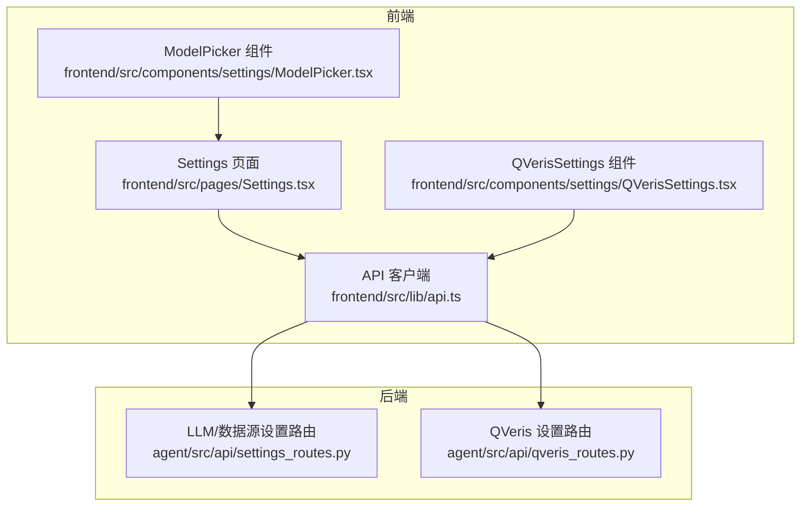
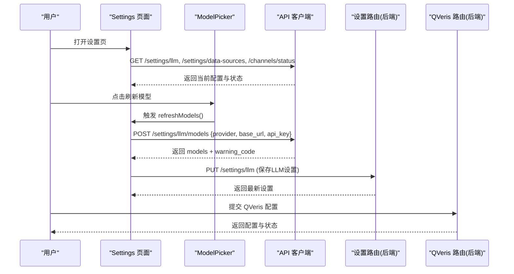
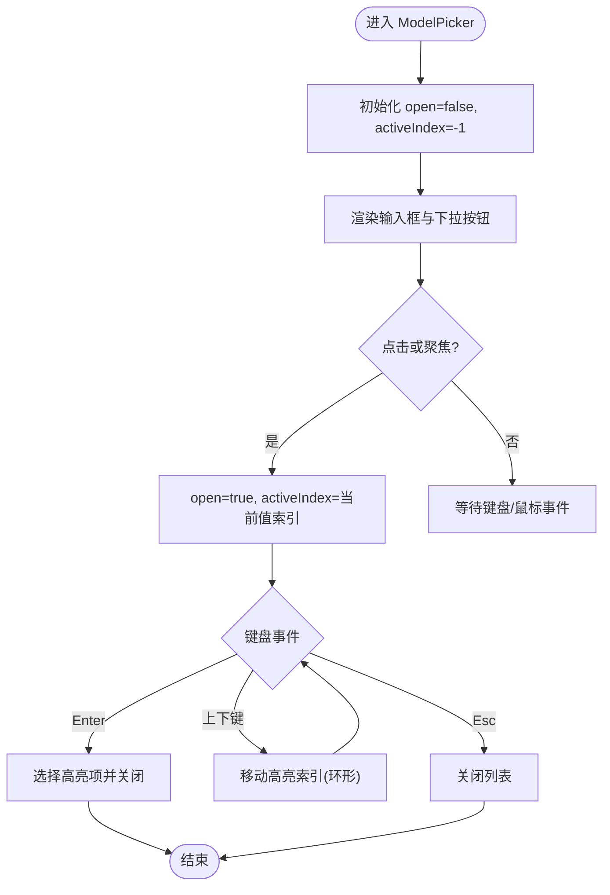
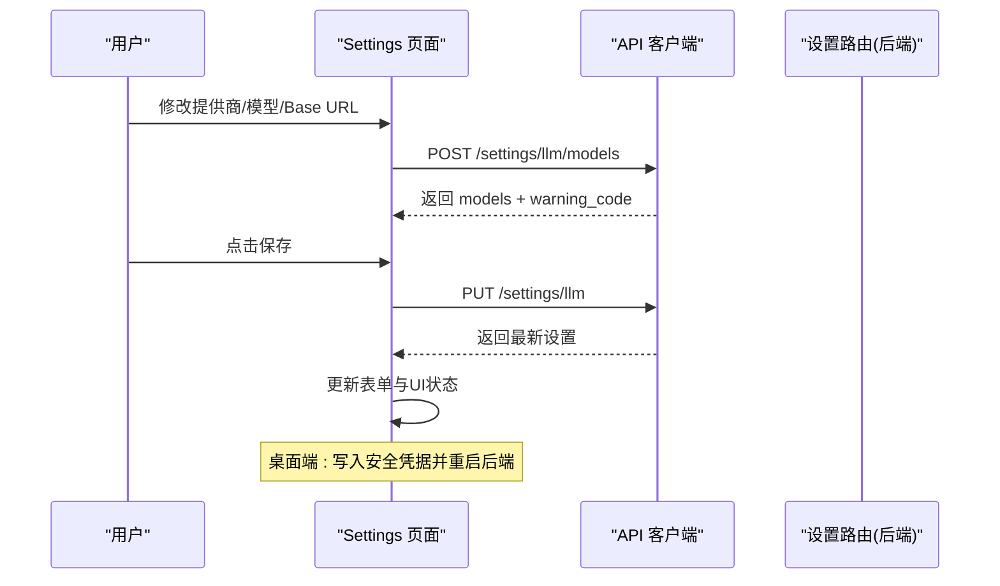
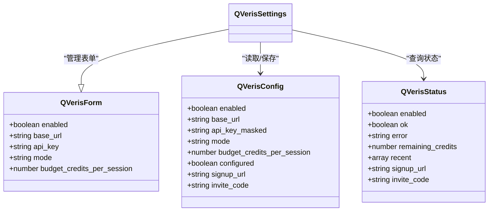
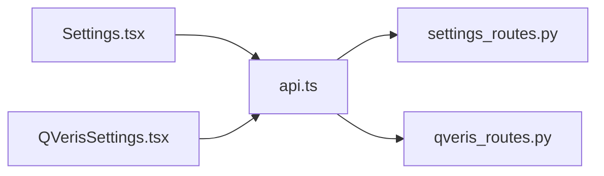

# 设置组件

<cite>
**本文引用的文件**
- [ModelPicker.tsx](file://frontend/src/components/settings/ModelPicker.tsx)
- [Settings.tsx](file://frontend/src/pages/Settings.tsx)
- [QVerisSettings.tsx](file://frontend/src/components/settings/QVerisSettings.tsx)
- [api.ts](file://frontend/src/lib/api.ts)
- [settings_routes.py](file://agent/src/api/settings_routes.py)
- [qveris_routes.py](file://agent/src/api/qveris_routes.py)
</cite>

## 目录
1. [简介](#简介)
2. [项目结构](#项目结构)
3. [核心组件](#核心组件)
4. [架构总览](#架构总览)
5. [详细组件分析](#详细组件分析)
6. [依赖关系分析](#依赖关系分析)
7. [性能考虑](#性能考虑)
8. [故障排查指南](#故障排查指南)
9. [结论](#结论)
10. [附录：扩展与自定义配置项指南](#附录：扩展与自定义配置项指南)

## 简介
本文件面向 Vibe-Trading 前端应用的“设置”模块，重点说明以下能力：
- 模型选择器（ModelPicker）的动态模型加载、配置验证与切换机制
- QVeris 设置组件的配置界面设计、表单验证与数据持久化
- 设置项的分类组织、默认值管理、配置导入导出策略
- 设置界面的用户体验优化、错误处理与配置同步策略
- 设置组件的扩展开发指南与自定义配置项添加方法

## 项目结构
设置相关的前端页面与组件位于 frontend/src/pages 与 frontend/src/components/settings；后端路由位于 agent/src/api。前端通过统一的 API 客户端与后端交互，实现配置的读取、更新与状态查询。

图表来源
- [Settings.tsx:1-777](file://frontend/src/pages/Settings.tsx#L1-L777)
- [ModelPicker.tsx:1-136](file://frontend/src/components/settings/ModelPicker.tsx#L1-L136)
- [QVerisSettings.tsx:1-358](file://frontend/src/components/settings/QVerisSettings.tsx#L1-L358)
- [api.ts:200-400](file://frontend/src/lib/api.ts#L200-L400)
- [settings_routes.py:497-674](file://agent/src/api/settings_routes.py#L497-L674)
- [qveris_routes.py:139-232](file://agent/src/api/qveris_routes.py#L139-L232)

章节来源
- [Settings.tsx:1-777](file://frontend/src/pages/Settings.tsx#L1-L777)
- [api.ts:200-400](file://frontend/src/lib/api.ts#L200-L400)

## 核心组件
- ModelPicker：可访问性友好的下拉选择器，支持键盘导航、去重选项、动态输入与外部列表联动。
- Settings 页面：聚合 LLM 连接与生成参数、数据源凭据、通道运行状态等设置；负责模型列表动态加载、默认值应用、保存与桌面端凭据同步。
- QVerisSettings：独立卡片式配置区，提供启用开关、基础地址、API Key、模式与预算控制，并展示余额与最近使用记录。

章节来源
- [ModelPicker.tsx:1-136](file://frontend/src/components/settings/ModelPicker.tsx#L1-L136)
- [Settings.tsx:37-777](file://frontend/src/pages/Settings.tsx#L37-L777)
- [QVerisSettings.tsx:1-358](file://frontend/src/components/settings/QVerisSettings.tsx#L1-L358)

## 架构总览
设置模块采用“前端页面 + 通用组件 + 统一 API 客户端 + 后端路由”的分层架构。前端通过 api.ts 封装的请求函数调用后端 /settings/* 与 /qveris/* 路由，完成配置的读取、校验、持久化与运行时同步。

图表来源
- [Settings.tsx:178-252](file://frontend/src/pages/Settings.tsx#L178-L252)
- [api.ts:204-223](file://frontend/src/lib/api.ts#L204-L223)
- [settings_routes.py:506-633](file://agent/src/api/settings_routes.py#L506-L633)
- [qveris_routes.py:149-177](file://agent/src/api/qveris_routes.py#L149-L177)

## 详细组件分析

### 模型选择器（ModelPicker）
- 功能要点
  - 动态选项：接收 options 数组，内部进行去重与过滤空值。
  - 键盘交互：支持 Esc 关闭、上下键循环高亮、Enter 确认选择。
  - 可访问性：role="combobox"/"listbox"/"option"，aria-* 属性完善。
  - 事件隔离：监听 document pointerdown 以在点击外部时关闭列表。
- 数据流
  - 父组件（Settings）维护 modelOptions 与 loading/hint 状态，通过 onChange 回调将选中值回写至 form.model_name。
  - 刷新模型由父组件发起，ModelPicker 仅负责展示与选择。
- 复杂度与健壮性
  - 去重与排序：基于 Set 去重，时间复杂度 O(n)。
  - 键盘导航：环形索引计算，避免越界。
  - 无障碍：activeDescendant 与 aria-selected 配合屏幕阅读器。

图表来源
- [ModelPicker.tsx:19-67](file://frontend/src/components/settings/ModelPicker.tsx#L19-L67)
- [ModelPicker.tsx:69-133](file://frontend/src/components/settings/ModelPicker.tsx#L69-L133)

章节来源
- [ModelPicker.tsx:1-136](file://frontend/src/components/settings/ModelPicker.tsx#L1-L136)

### Settings 页面（LLM 与数据源设置）
- 分类组织
  - 本地 API 访问密钥（非桌面环境）
  - QVeris 设置（独立卡片）
  - 通道运行状态（启动/停止/刷新）
  - LLM 连接与生成参数（提供商、模型、Base URL、温度、超时、重试、推理强度）
  - 数据源凭据（Tushare Token、BaoStock 可用性提示）
- 默认值管理
  - 切换提供商时应用 provider.default_model 与 default_base_url。
  - 模型列表优先包含当前 model_name 与 provider.default_model，再合并后端返回。
- 动态模型加载
  - 调用 /settings/llm/models，携带 provider/base_url/api_key。
  - 根据 warning_code 显示友好提示（OAuth 不支持、需要 API Key、列表不可用）。
- 配置保存与同步
  - 保存 LLM 设置后，桌面端会将凭据写入系统安全存储并重启后端进程以生效。
  - 数据源凭据同样支持桌面端安全存储与运行时注入。
- 错误处理
  - 加载失败时区分认证错误与普通错误，使用 toast 提示。
  - 保存失败时保留表单状态并提示具体错误信息。

图表来源
- [Settings.tsx:163-252](file://frontend/src/pages/Settings.tsx#L163-L252)
- [api.ts:204-223](file://frontend/src/lib/api.ts#L204-L223)
- [settings_routes.py:506-587](file://agent/src/api/settings_routes.py#L506-L587)

章节来源
- [Settings.tsx:37-777](file://frontend/src/pages/Settings.tsx#L37-L777)
- [settings_routes.py:497-674](file://agent/src/api/settings_routes.py#L497-L674)

### QVeris 设置组件
- 界面设计
  - 启用开关：仅在 paid 模式下生效。
  - Base URL：默认 https://qveris.ai/api/v1，强制 http(s) 校验。
  - API Key：密码输入，占位符来自后端返回的掩码值。
  - 模式与预算：free/paid 切换，预算按会话额度限制。
  - 右侧面板：余额、最近使用记录、邀请码与注册入口。
- 表单验证
  - Base URL 必须为 http(s) 且去除尾部斜杠。
  - 预算为非负数。
  - 模式与启用状态联动。
- 数据持久化
  - 通过 /qveris/config 的 GET/PUT 获取与保存配置。
  - 桌面端环境下，API Key 会写入系统安全存储并触发后端重启。
- 状态与健康检查
  - /qveris/status 返回 enabled、ok、error、remaining_credits 与 recent 使用记录。
  - 未配置或付费模式关闭时，状态明确提示。

图表来源
- [QVerisSettings.tsx:9-41](file://frontend/src/components/settings/QVerisSettings.tsx#L9-L41)
- [qveris_routes.py:31-64](file://agent/src/api/qveris_routes.py#L31-L64)

章节来源
- [QVerisSettings.tsx:1-358](file://frontend/src/components/settings/QVerisSettings.tsx#L1-L358)
- [qveris_routes.py:139-232](file://agent/src/api/qveris_routes.py#L139-L232)

## 依赖关系分析
- 前端依赖
  - Settings 页面依赖 api.ts 提供的 getLLMSettings/updateLLMSettings/listLLMModels/getDataSourceSettings/updateDataSourceSettings 等方法。
  - QVerisSettings 直接通过 fetch 调用 /qveris/* 路由，复用 authHeaders 注入鉴权头。
- 后端依赖
  - settings_routes.py 暴露 /settings/llm 与 /settings/data-sources 等接口，负责读取 .env、校验参数、持久化与运行时环境变量同步。
  - qveris_routes.py 暴露 /qveris/config 与 /qveris/status，负责 QVeris 配置读写与状态查询。
- 耦合与内聚
  - 前端组件职责清晰：ModelPicker 专注交互，Settings 编排流程，QVerisSettings 独立领域。
  - 后端路由按领域拆分，便于测试与维护。

图表来源
- [Settings.tsx:1-777](file://frontend/src/pages/Settings.tsx#L1-L777)
- [QVerisSettings.tsx:1-358](file://frontend/src/components/settings/QVerisSettings.tsx#L1-L358)
- [api.ts:200-400](file://frontend/src/lib/api.ts#L200-L400)
- [settings_routes.py:497-674](file://agent/src/api/settings_routes.py#L497-L674)
- [qveris_routes.py:139-232](file://agent/src/api/qveris_routes.py#L139-L232)

章节来源
- [api.ts:200-400](file://frontend/src/lib/api.ts#L200-L400)
- [settings_routes.py:497-674](file://agent/src/api/settings_routes.py#L497-L674)
- [qveris_routes.py:139-232](file://agent/src/api/qveris_routes.py#L139-L232)

## 性能考虑
- 模型列表请求
  - 仅在用户主动点击“刷新模型”时发起，避免频繁网络请求。
  - 后端对模型列表响应做去重与上限限制（最多 1000 个），前端进一步去重。
- 表单与状态
  - 使用受控组件与最小化 re-render 策略，避免不必要的重绘。
  - 桌面端凭据写入与后端重启为异步操作，避免阻塞 UI。
- 错误与降级
  - 模型列表不可用时回退到默认模型，保证可用性。
  - 网络异常时给出友好提示，不中断用户其他操作。

[本节为通用指导，无需特定文件引用]

## 故障排查指南
- 无法加载 LLM 设置
  - 检查鉴权是否通过（401/403 会转换为“需要认证”提示）。
  - 查看后端日志与 .env 路径权限。
- 模型列表为空或警告
  - OAuth 提供商不支持发现：需手动输入模型名。
  - 需要 API Key：填写对应提供商的 Key 或勾选“清除 Key”。
  - 列表不可用：检查 Base URL 与网络连通性。
- QVeris 配置无效
  - Base URL 必须为 http(s)，且不含尾随斜杠。
  - 付费模式关闭时，状态接口会返回相应错误提示。
  - 桌面端修改 API Key 后需重启后端才能生效。
- 数据源凭据保存失败
  - 检查 .env 文件权限与磁盘空间。
  - 桌面端安全存储模式下，确保凭据已正确写入系统钥匙串。

章节来源
- [Settings.tsx:62-120](file://frontend/src/pages/Settings.tsx#L62-L120)
- [Settings.tsx:178-252](file://frontend/src/pages/Settings.tsx#L178-L252)
- [QVerisSettings.tsx:96-184](file://frontend/src/components/settings/QVerisSettings.tsx#L96-L184)
- [settings_routes.py:506-674](file://agent/src/api/settings_routes.py#L506-L674)
- [qveris_routes.py:149-232](file://agent/src/api/qveris_routes.py#L149-L232)

## 结论
设置组件通过清晰的职责划分与稳健的后端路由，实现了模型选择的动态加载、配置验证与切换、以及 QVeris 的全生命周期管理。结合桌面端安全存储与运行时同步，提供了良好的用户体验与可靠性。后续可通过扩展 Provider 元数据与新增配置项进一步增强灵活性。

[本节为总结，无需特定文件引用]

## 附录：扩展与自定义配置项指南
- 新增 LLM 提供商
  - 在后端 providers/llm_providers.json 中添加条目（name、label、default_model、base_url_env、auth_type 等）。
  - 前端 Settings 页面会自动从 /settings/llm 的 providers 字段渲染下拉选项。
  - 如需自定义 Base URL 建议列表，可在 provider 中增加 base_url_options。
- 新增设置项
  - 后端：在 settings_routes.py 的 UpdateLLMSettingsRequest 或 DataSourceSettingsResponse 中扩展字段，并在更新逻辑中持久化与同步运行时环境变量。
  - 前端：在 Settings 页面添加表单字段与校验逻辑，调用现有 API 方法保存。
  - 若为新领域（如第三方服务），可仿照 QVerisSettings 创建独立组件，并在后端新增路由。
- 配置导入/导出
  - 当前实现以 .env 文件为中心，导出即下载/复制 .env 内容；导入即替换 .env 并重启后端。
  - 建议在 Settings 页面增加“导出配置”和“导入配置”按钮，调用后端批量更新接口。
- 用户体验优化
  - 为所有输入提供占位符与帮助文本。
  - 对敏感字段提供“清除”复选框，避免误改。
  - 对长耗时操作（刷新模型、保存配置）提供明确的加载与成功/失败反馈。
- 错误处理与可观测性
  - 统一使用 toast 提示，区分认证错误与业务错误。
  - 在关键路径加入埋点（如模型列表请求耗时、失败率），便于定位问题。

章节来源
- [settings_routes.py:31-153](file://agent/src/api/settings_routes.py#L31-L153)
- [settings_routes.py:506-674](file://agent/src/api/settings_routes.py#L506-L674)
- [Settings.tsx:495-693](file://frontend/src/pages/Settings.tsx#L495-L693)
- [QVerisSettings.tsx:224-312](file://frontend/src/components/settings/QVerisSettings.tsx#L224-L312)