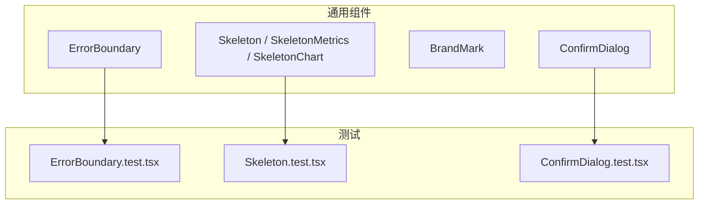
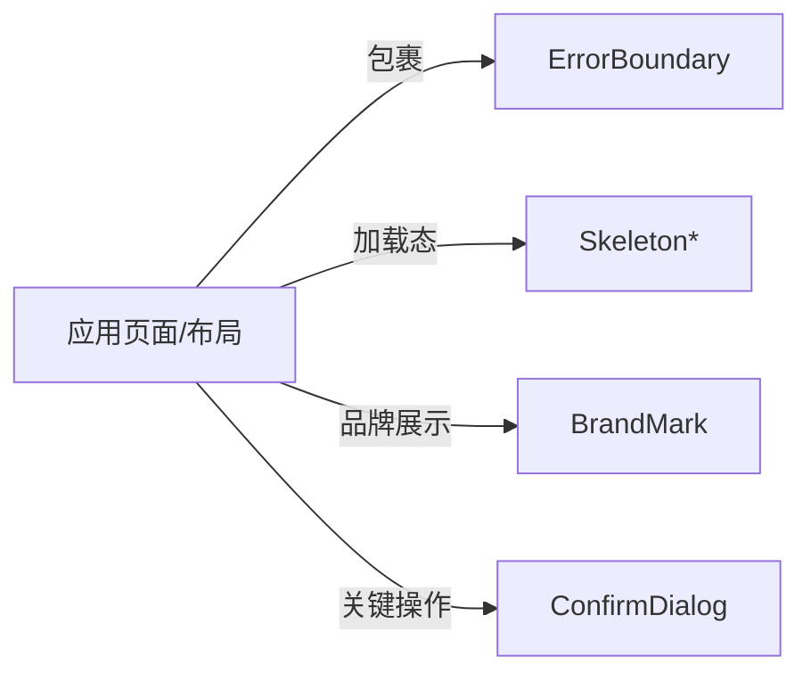
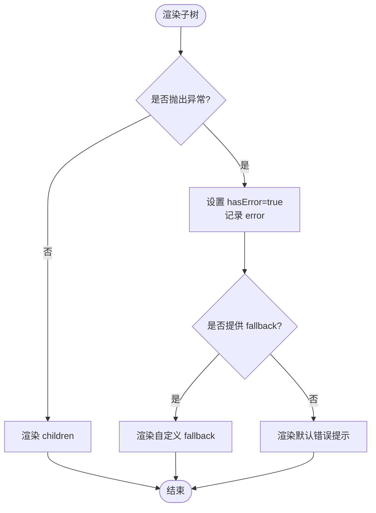
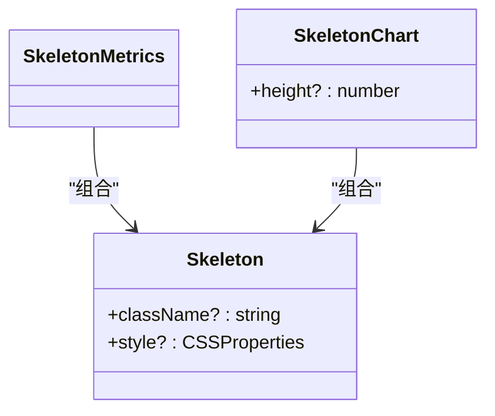
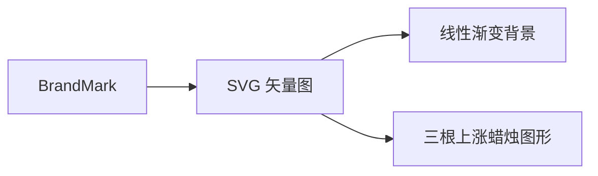
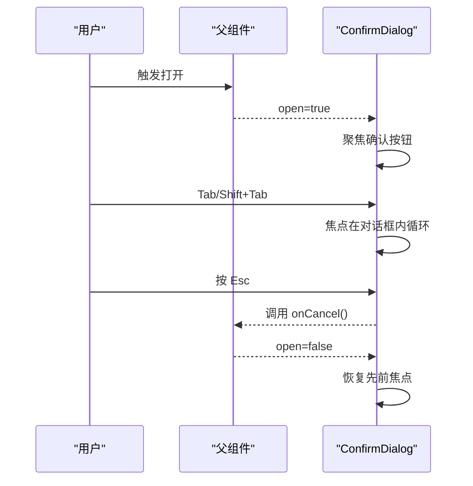
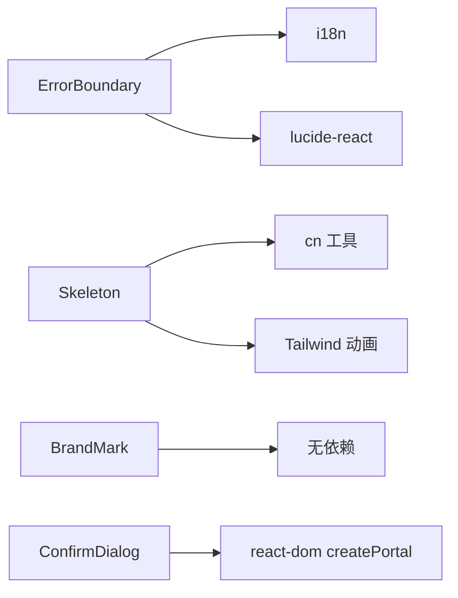

# 通用组件

<cite>
**本文引用的文件**
- [ErrorBoundary.tsx](file://frontend/src/components/common/ErrorBoundary.tsx)
- [Skeleton.tsx](file://frontend/src/components/common/Skeleton.tsx)
- [BrandMark.tsx](file://frontend/src/components/common/BrandMark.tsx)
- [ConfirmDialog.tsx](file://frontend/src/components/common/ConfirmDialog.tsx)
- [ErrorBoundary.test.tsx](file://frontend/src/components/common/__tests__/ErrorBoundary.test.tsx)
- [Skeleton.test.tsx](file://frontend/src/components/common/__tests__/Skeleton.test.tsx)
- [ConfirmDialog.test.tsx](file://frontend/src/components/common/__tests__/ConfirmDialog.test.tsx)
</cite>

## 目录
1. [简介](#简介)
2. [项目结构](#项目结构)
3. [核心组件](#核心组件)
4. [架构总览](#架构总览)
5. [详细组件分析](#详细组件分析)
6. [依赖分析](#依赖分析)
7. [性能考虑](#性能考虑)
8. [故障排查指南](#故障排查指南)
9. [结论](#结论)
10. [附录](#附录)

## 简介
本文件面向 Vibe-Trading 前端应用的通用组件，聚焦以下四个基础 UI 能力：
- 错误边界（ErrorBoundary）：捕获子树渲染期异常并提供可恢复的降级展示。
- 骨架屏（Skeleton）：在数据加载或计算期间提供占位与动画反馈。
- 品牌标识（BrandMark）：以 SVG 形式统一呈现品牌视觉资产。
- 确认对话框（ConfirmDialog）：轻量、无外部依赖的可访问性友好的二次确认弹窗。

文档将详细说明各组件的 Props 接口、事件处理、样式定制选项、最佳实践、复用策略、性能优化技巧与可访问性支持，并给出集成示例路径与常见问题排查建议。

## 项目结构
通用组件位于 frontend/src/components/common 目录下，配套单元测试位于 __tests__ 子目录。它们被业务页面与布局组件广泛复用，构成应用的基础 UI 层。

图表来源
- [ErrorBoundary.tsx:1-27](file://frontend/src/components/common/ErrorBoundary.tsx#L1-L27)
- [Skeleton.tsx:1-23](file://frontend/src/components/common/Skeleton.tsx#L1-L23)
- [BrandMark.tsx:1-31](file://frontend/src/components/common/BrandMark.tsx#L1-L31)
- [ConfirmDialog.tsx:1-128](file://frontend/src/components/common/ConfirmDialog.tsx#L1-L128)
- [ErrorBoundary.test.tsx:1-62](file://frontend/src/components/common/__tests__/ErrorBoundary.test.tsx#L1-L62)
- [Skeleton.test.tsx:1-47](file://frontend/src/components/common/__tests__/Skeleton.test.tsx#L1-L47)
- [ConfirmDialog.test.tsx:1-48](file://frontend/src/components/common/__tests__/ConfirmDialog.test.tsx#L1-L48)

章节来源
- [ErrorBoundary.tsx:1-27](file://frontend/src/components/common/ErrorBoundary.tsx#L1-L27)
- [Skeleton.tsx:1-23](file://frontend/src/components/common/Skeleton.tsx#L1-L23)
- [BrandMark.tsx:1-31](file://frontend/src/components/common/BrandMark.tsx#L1-L31)
- [ConfirmDialog.tsx:1-128](file://frontend/src/components/common/ConfirmDialog.tsx#L1-L128)

## 核心组件
- ErrorBoundary：基于 React 类组件的错误边界，使用 getDerivedStateFromError 捕获异常，渲染默认或自定义 fallback。
- Skeleton：纯展示型骨架屏，支持尺寸与样式覆盖；提供指标卡片与图表两种常用组合。
- BrandMark：内联 SVG 品牌图标，支持通过 className 控制尺寸与外观。
- ConfirmDialog：基于 Portal 的轻量确认弹窗，具备键盘焦点陷阱、Esc 关闭、可访问性属性等。

章节来源
- [ErrorBoundary.tsx:1-27](file://frontend/src/components/common/ErrorBoundary.tsx#L1-L27)
- [Skeleton.tsx:1-23](file://frontend/src/components/common/Skeleton.tsx#L1-L23)
- [BrandMark.tsx:1-31](file://frontend/src/components/common/BrandMark.tsx#L1-L31)
- [ConfirmDialog.tsx:1-128](file://frontend/src/components/common/ConfirmDialog.tsx#L1-L128)

## 架构总览
通用组件之间保持低耦合，各自承担单一职责：
- ErrorBoundary 包裹任意子树，隔离崩溃影响范围。
- Skeleton 作为占位符，配合数据流状态切换显示。
- BrandMark 作为静态视觉元素，不参与业务逻辑。
- ConfirmDialog 通过受控 open 属性与回调驱动交互，不持有业务状态。

图表来源
- [ErrorBoundary.tsx:1-27](file://frontend/src/components/common/ErrorBoundary.tsx#L1-L27)
- [Skeleton.tsx:1-23](file://frontend/src/components/common/Skeleton.tsx#L1-L23)
- [BrandMark.tsx:1-31](file://frontend/src/components/common/BrandMark.tsx#L1-L31)
- [ConfirmDialog.tsx:1-128](file://frontend/src/components/common/ConfirmDialog.tsx#L1-L128)

## 详细组件分析

### 错误边界（ErrorBoundary）
- 作用与机制
  - 捕获子树渲染阶段抛出的异常，避免整棵组件树崩溃。
  - 通过 getDerivedStateFromError 更新内部状态，触发降级渲染。
  - 支持传入自定义 fallback，否则渲染内置的错误提示 UI。
- Props 接口
  - children：ReactNode，需要被保护的子树。
  - fallback？：ReactNode，可选的自定义降级内容。
- 事件与副作用
  - 无对外事件；异常由 React 运行时捕获。
- 样式与主题
  - 默认使用语义化颜色与边框，适配设计系统。
- 可访问性
  - 错误信息通过文案传达；如需增强，可在自定义 fallback 中补充 role="alert" 等。
- 性能
  - 仅在发生错误时进行状态切换，正常路径零开销。
- 最佳实践
  - 将可能抛出异常的第三方库或复杂渲染逻辑用 ErrorBoundary 包裹。
  - 为不同模块提供差异化 fallback，便于定位问题。
- 使用示例（参考测试用例）
  - 正常渲染、异常降级、自定义 fallback、空消息兜底等场景见测试文件。

图表来源
- [ErrorBoundary.tsx:8-25](file://frontend/src/components/common/ErrorBoundary.tsx#L8-L25)

章节来源
- [ErrorBoundary.tsx:1-27](file://frontend/src/components/common/ErrorBoundary.tsx#L1-L27)
- [ErrorBoundary.test.tsx:1-62](file://frontend/src/components/common/__tests__/ErrorBoundary.test.tsx#L1-L62)

### 骨架屏（Skeleton）
- 作用与机制
  - 在数据未就绪时提供占位与微动效，提升感知性能。
  - 提供基础 Skeleton 以及组合形态：指标卡片 SkeletonMetrics、图表骨架 SkeletonChart。
- Props 接口
  - Skeleton：className?、style?
  - SkeletonMetrics：无额外 props
  - SkeletonChart：height?（默认 300）
- 样式与主题
  - 使用 Tailwind 的 animate-pulse 与 muted 色板，可通过 className/style 覆盖。
- 可访问性
  - 骨架屏仅为视觉占位，不包含交互元素；必要时可为容器添加 aria-busy="true"。
- 性能
  - 纯 DOM 节点 + CSS 动画，开销极低；避免在高频刷新区域重复创建大骨架。
- 最佳实践
  - 列表项使用最小骨架，按需拆分 SkeletonMetrics 与 SkeletonChart。
  - 结合路由/数据请求生命周期，精确控制显示时机。
- 使用示例（参考测试用例）
  - 验证默认动画类、自定义尺寸、高度覆盖、指标项数量、图表高度等。

图表来源
- [Skeleton.tsx:3-22](file://frontend/src/components/common/Skeleton.tsx#L3-L22)

章节来源
- [Skeleton.tsx:1-23](file://frontend/src/components/common/Skeleton.tsx#L1-L23)
- [Skeleton.test.tsx:1-47](file://frontend/src/components/common/__tests__/Skeleton.test.tsx#L1-L47)

### 品牌标识（BrandMark）
- 作用与机制
  - 以 SVG 内联方式呈现品牌 Logo，确保缩放清晰且易于主题化。
- Props 接口
  - className?（默认 h-6 w-6），用于控制尺寸与外观。
- 样式与主题
  - 使用渐变填充与白色蜡烛图形；可通过 className 叠加 Tailwind 类名实现尺寸/圆角/阴影等定制。
- 可访问性
  - 设置 aria-hidden="true"，避免屏幕阅读器朗读装饰性图标。
- 性能
  - 极小 SVG，无额外依赖，渲染成本可忽略。
- 最佳实践
  - 在导航栏、登录页、设置页等位置统一使用，保证品牌一致性。
  - 若需可点击的品牌入口，外层包裹 a/button 并添加语义化标题。
- 使用示例
  - 直接引入并在任意位置渲染，通过 className 调整大小与风格。

图表来源
- [BrandMark.tsx:1-31](file://frontend/src/components/common/BrandMark.tsx#L1-L31)

章节来源
- [BrandMark.tsx:1-31](file://frontend/src/components/common/BrandMark.tsx#L1-L31)

### 确认对话框（ConfirmDialog）
- 作用与机制
  - 对高风险或不可逆操作提供二次确认，降低误操作风险。
  - 使用 createPortal 挂载到 body，避免父级样式干扰。
- Props 接口
  - open：boolean，控制显隐（受控）。
  - title：string，对话框标题。
  - description？：string，辅助说明。
  - confirmLabel：string，确认按钮文案。
  - cancelLabel：string，取消按钮文案。
  - tone？："primary" | "destructive"，确认按钮视觉强度。
  - onConfirm：() => void，确认回调。
  - onCancel：() => void，取消回调。
  - children？：ReactNode，描述与按钮之间的附加内容。
- 事件与副作用
  - 打开时自动聚焦确认按钮；监听 Escape 调用 onCancel。
  - 焦点陷阱：Tab/Shift+Tab 在对话框内循环聚焦。
  - 关闭后恢复之前获得焦点的元素。
- 样式与主题
  - 半透明遮罩 + 居中卡片；确认按钮根据 tone 切换主色/危险色。
- 可访问性
  - role="alertdialog"、aria-modal="true"、aria-labelledby 指向标题。
  - 键盘可达：Tab 顺序合理，Esc 可关闭。
- 性能
  - 仅当 open 为真时渲染；使用 Portal 减少重排。
- 最佳实践
  - 始终提供明确的标题与描述，避免歧义。
  - 对破坏性操作使用 destructive tone。
  - 将业务状态（open）提升到调用方管理，组件保持无副作用。
- 使用示例（参考测试用例）
  - 打开/关闭流程、焦点陷阱、Esc 行为、焦点恢复等见测试文件。

图表来源
- [ConfirmDialog.tsx:23-127](file://frontend/src/components/common/ConfirmDialog.tsx#L23-L127)

章节来源
- [ConfirmDialog.tsx:1-128](file://frontend/src/components/common/ConfirmDialog.tsx#L1-L128)
- [ConfirmDialog.test.tsx:1-48](file://frontend/src/components/common/__tests__/ConfirmDialog.test.tsx#L1-L48)

## 依赖分析
- ErrorBoundary
  - 依赖 i18n 国际化文案与 lucide-react 图标。
  - 与 React 类组件生命周期紧密相关。
- Skeleton
  - 依赖工具函数 cn（合并类名）与 Tailwind 动画类。
- BrandMark
  - 无运行时依赖，纯 SVG。
- ConfirmDialog
  - 依赖 react-dom 的 createPortal；无其他 UI 库依赖。

图表来源
- [ErrorBoundary.tsx:1-27](file://frontend/src/components/common/ErrorBoundary.tsx#L1-L27)
- [Skeleton.tsx:1-23](file://frontend/src/components/common/Skeleton.tsx#L1-L23)
- [BrandMark.tsx:1-31](file://frontend/src/components/common/BrandMark.tsx#L1-L31)
- [ConfirmDialog.tsx:1-128](file://frontend/src/components/common/ConfirmDialog.tsx#L1-L128)

章节来源
- [ErrorBoundary.tsx:1-27](file://frontend/src/components/common/ErrorBoundary.tsx#L1-L27)
- [Skeleton.tsx:1-23](file://frontend/src/components/common/Skeleton.tsx#L1-L23)
- [BrandMark.tsx:1-31](file://frontend/src/components/common/BrandMark.tsx#L1-L31)
- [ConfirmDialog.tsx:1-128](file://frontend/src/components/common/ConfirmDialog.tsx#L1-L128)

## 性能考虑
- 错误边界
  - 仅在异常路径产生状态更新；避免在 render 中进行昂贵计算。
  - 对频繁渲染的组件树，谨慎包裹过大的子树，以减少潜在的回退成本。
- 骨架屏
  - 使用最小骨架单元，避免一次性渲染过多占位节点。
  - 图表骨架高度固定，避免频繁重排；大数据量图表优先懒加载。
- 品牌标识
  - SVG 内联体积小，适合多处复用；注意不要过度放大导致像素模糊。
- 确认对话框
  - 使用 Portal 避免层级与样式污染；仅在 open 时渲染。
  - 焦点陷阱与键盘监听在打开时注册，关闭时清理，避免内存泄漏。

[本节为通用指导，不直接分析具体文件]

## 故障排查指南
- 错误边界未捕获异常
  - 检查是否在异步回调或事件处理器中抛出异常（此类异常不会被错误边界捕获）。
  - 确认组件树层级是否正确被包裹。
  - 参考测试用例验证默认 fallback 与自定义 fallback 的行为。
- 骨架屏不显示或样式异常
  - 检查 Tailwind 配置是否启用 animate-pulse。
  - 确认 className/style 未被父级覆盖。
  - 参考测试用例验证尺寸与动画类。
- 确认对话框无法关闭或焦点异常
  - 检查 open 状态是否被正确更新。
  - 确认 ESC 键事件未被上层拦截。
  - 参考测试用例验证焦点陷阱与焦点恢复。

章节来源
- [ErrorBoundary.test.tsx:1-62](file://frontend/src/components/common/__tests__/ErrorBoundary.test.tsx#L1-L62)
- [Skeleton.test.tsx:1-47](file://frontend/src/components/common/__tests__/Skeleton.test.tsx#L1-L47)
- [ConfirmDialog.test.tsx:1-48](file://frontend/src/components/common/__tests__/ConfirmDialog.test.tsx#L1-L48)

## 结论
这四个通用组件构成了 Vibe-Trading 前端的稳定基石：ErrorBoundary 保障健壮性，Skeleton 提升感知性能，BrandMark 统一品牌表达，ConfirmDialog 强化交互安全。遵循本文的接口规范、可访问性与性能建议，可在业务中高效复用并保持一致体验。

[本节为总结性内容，不直接分析具体文件]

## 附录
- 集成要点
  - 在页面或布局顶层使用 ErrorBoundary 包裹关键模块。
  - 在数据请求/计算前后切换 Skeleton 显示。
  - 在全局导航与头部使用 BrandMark 统一品牌。
  - 对删除、提交等高风险操作使用 ConfirmDialog。
- 可访问性清单
  - 错误信息可读、可被屏幕阅读器识别（必要时添加 role="alert"）。
  - 骨架屏容器可加 aria-busy="true"。
  - 确认对话框使用 alertdialog、aria-modal、aria-labelledby，并确保键盘可达。
- 测试建议
  - 参照现有单元测试，覆盖正常渲染、异常降级、样式覆盖、交互流程与可访问性断言。

[本节为补充信息，不直接分析具体文件]