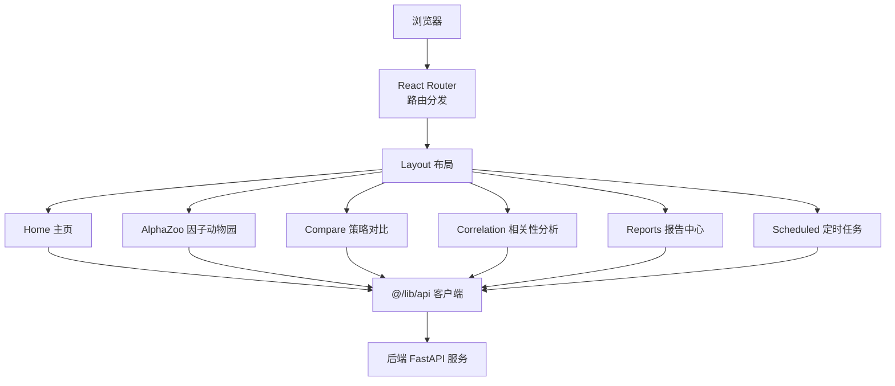
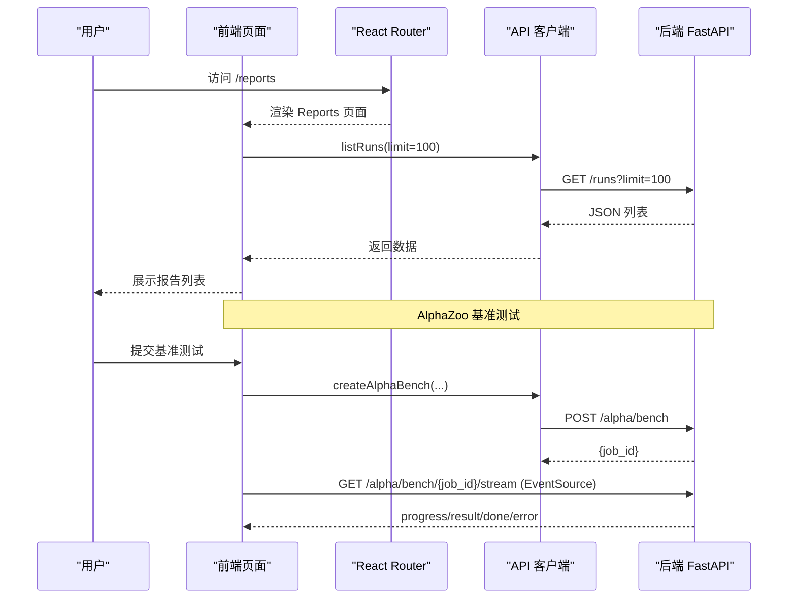
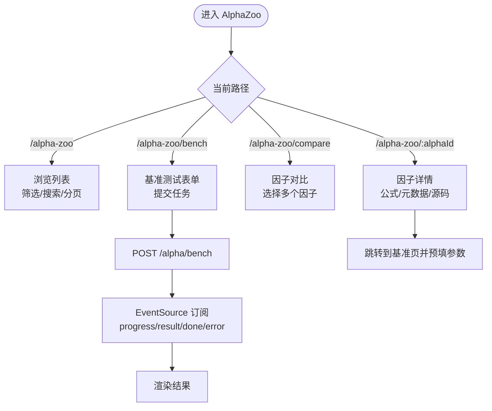
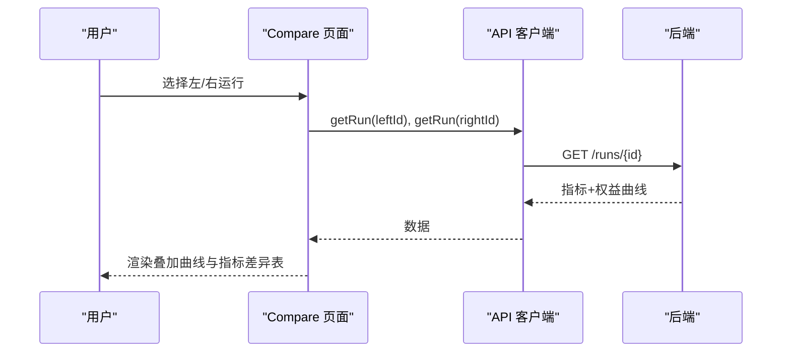
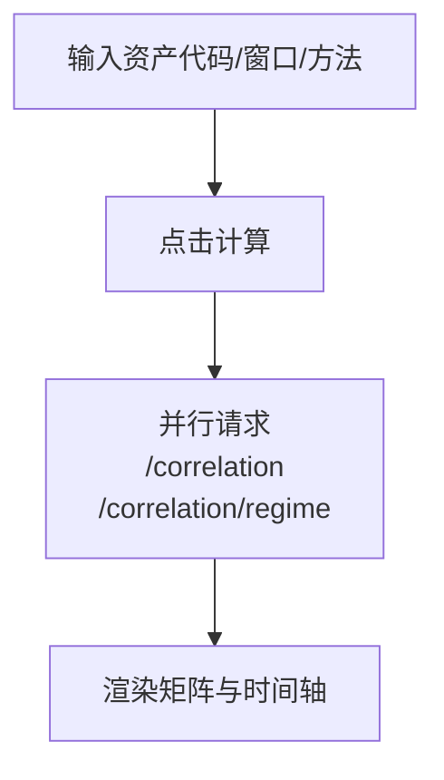
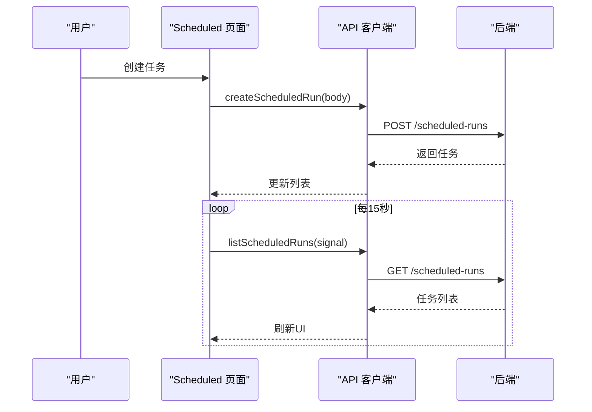
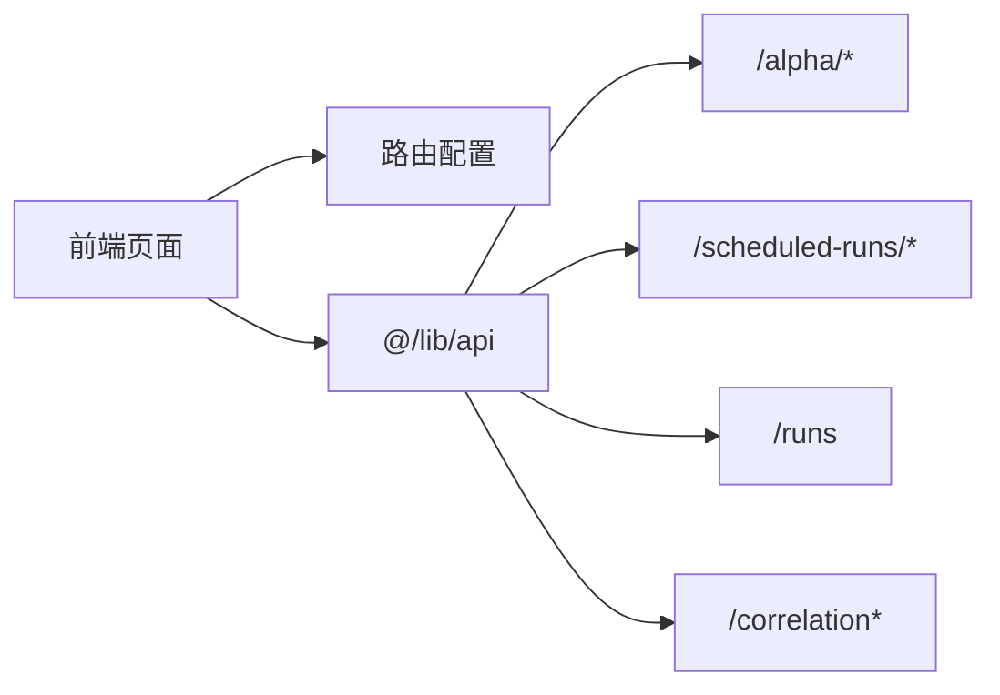

# 其他页面

<cite>
**本文引用的文件**
- [router.tsx](file://frontend/src/router.tsx)
- [Home.tsx](file://frontend/src/pages/Home.tsx)
- [AlphaZoo.tsx](file://frontend/src/pages/AlphaZoo.tsx)
- [Compare.tsx](file://frontend/src/pages/Compare.tsx)
- [Correlation.tsx](file://frontend/src/pages/Correlation.tsx)
- [Reports.tsx](file://frontend/src/pages/Reports.tsx)
- [Scheduled.tsx](file://frontend/src/pages/Scheduled.tsx)
- [api.ts](file://frontend/src/lib/api.ts)
- [alpha_routes.py](file://agent/src/api/alpha_routes.py)
- [scheduled_routes.py](file://agent/src/api/scheduled_routes.py)
</cite>

## 目录
1. [简介](#简介)
2. [项目结构](#项目结构)
3. [核心组件](#核心组件)
4. [架构总览](#架构总览)
5. [详细组件分析](#详细组件分析)
6. [依赖关系分析](#依赖关系分析)
7. [性能考虑](#性能考虑)
8. [故障排除指南](#故障排除指南)
9. [结论](#结论)

## 简介
本章节面向 Vibe-Trading 的“其他页面”模块，覆盖主页（Home）、因子动物园（AlphaZoo）、策略对比（Compare）、相关性分析（Correlation）、报告中心（Reports）、定时任务（Scheduled）等页面的功能说明、用户交互流程、数据展示方式、页面间导航与状态共享机制、路由配置、前后端集成方式、数据获取与处理逻辑，以及性能优化、懒加载策略、缓存机制与常见问题排查。

## 项目结构
前端采用 React + React Router，所有页面通过懒加载（Suspense + lazy）按需引入，减少首屏体积；页面统一由 Layout 包裹，路由集中定义在 router.tsx。各页面通过统一的 API 客户端（@/lib/api）访问后端 REST 接口，部分长耗时任务使用 SSE（EventSource）进行进度与结果推送。

图表来源
- [router.tsx:1-69](file://frontend/src/router.tsx#L1-L69)
- [api.ts:72-100](file://frontend/src/lib/api.ts#L72-L100)

章节来源
- [router.tsx:1-69](file://frontend/src/router.tsx#L1-L69)

## 核心组件
- 路由与懒加载：所有页面通过 createBrowserRouter 注册，并使用 Suspense + lazy 实现按需加载，提升首屏性能。
- 统一 API 客户端：封装请求头、鉴权、错误处理与类型化响应，提供 correlation、runs、sessions、scheduled-runs、alpha 等接口方法。
- 页面级状态管理：每个页面使用 React useState/useEffect 管理本地状态，必要时结合 URL 参数或查询字符串跨页面传递上下文。
- 事件流与长连接：AlphaZoo 的基准测试使用 EventSource 订阅 SSE 事件（progress/result/done/error），保证实时反馈。

章节来源
- [router.tsx:1-69](file://frontend/src/router.tsx#L1-L69)
- [api.ts:72-100](file://frontend/src/lib/api.ts#L72-L100)
- [AlphaZoo.tsx:643-776](file://frontend/src/pages/AlphaZoo.tsx#L643-L776)

## 架构总览
下图展示了从前端页面到后端服务的整体调用链路，包括同步 REST 与异步 SSE 两种模式。

图表来源
- [router.tsx:48-66](file://frontend/src/router.tsx#L48-L66)
- [api.ts:123-156](file://frontend/src/lib/api.ts#L123-L156)
- [alpha_routes.py:493-580](file://agent/src/api/alpha_routes.py#L493-L580)

## 详细组件分析

### 主页（Home）
- 功能概述：展示产品特性与使用步骤，引导用户进入研究界面。
- 用户交互：点击“开始研究”跳转至 /agent。
- 数据展示：静态文案与图标，无后端数据依赖。
- 导航关系：链接到 /agent。
- 性能与缓存：纯静态页面，无额外开销。

章节来源
- [Home.tsx:1-69](file://frontend/src/pages/Home.tsx#L1-L69)
- [router.tsx:52-55](file://frontend/src/router.tsx#L52-L55)

### 因子动物园（AlphaZoo）
- 功能概述：浏览、筛选、查看因子详情，运行基准测试与多因子对比。
- 路由模型：单组件多视图，通过路径区分：
  - /alpha-zoo：浏览列表
  - /alpha-zoo/bench：基准测试
  - /alpha-zoo/compare：多因子对比
  - /alpha-zoo/:alphaId：因子详情
- 核心交互：
  - 浏览：支持按 zoo/theme/universe 筛选、搜索、分页加载。
  - 详情：展示公式、元数据、源码，并提供“运行基准”快捷入口。
  - 基准：提交任务后通过 SSE 接收进度与结果。
  - 对比：选择多个因子后跳转到对比视图。
- 数据获取：
  - 列表：GET /alpha/list（带过滤参数）。
  - 详情：GET /alpha/{alphaId}。
  - 基准：POST /alpha/bench → 获取 job_id → GET /alpha/bench/{job_id}/stream。
- 状态共享：通过 URL 查询参数传递 zoo/universe/period/top 等上下文。
- 性能优化：
  - 懒加载页面与组件。
  - 列表分页加载（默认每页 50 条）。
  - SSE 心跳保活，避免代理断开。
- 错误处理：网络异常与 SSE 错误均通过 toast 提示并降级显示。

图表来源
- [AlphaZoo.tsx:125-140](file://frontend/src/pages/AlphaZoo.tsx#L125-L140)
- [AlphaZoo.tsx:169-198](file://frontend/src/pages/AlphaZoo.tsx#L169-L198)
- [AlphaZoo.tsx:688-776](file://frontend/src/pages/AlphaZoo.tsx#L688-L776)
- [alpha_routes.py:493-580](file://agent/src/api/alpha_routes.py#L493-L580)

章节来源
- [AlphaZoo.tsx:125-140](file://frontend/src/pages/AlphaZoo.tsx#L125-L140)
- [AlphaZoo.tsx:169-198](file://frontend/src/pages/AlphaZoo.tsx#L169-L198)
- [AlphaZoo.tsx:688-776](file://frontend/src/pages/AlphaZoo.tsx#L688-L776)
- [alpha_routes.py:383-446](file://agent/src/api/alpha_routes.py#L383-L446)
- [alpha_routes.py:452-487](file://agent/src/api/alpha_routes.py#L452-L487)
- [alpha_routes.py:493-580](file://agent/src/api/alpha_routes.py#L493-L580)

### 策略对比（Compare）
- 功能概述：选择两个回测运行进行指标与权益曲线对比，支持原始值与归一化（重基线）模式切换。
- 用户交互：下拉选择左右两个 run，自动拉取数据并渲染对比表格与叠加曲线图。
- 数据获取：
  - 列表：GET /runs（用于选择器）。
  - 详情：GET /runs/{id}（指标与权益曲线）。
- 展示方式：ECharts 双曲线叠加，指标表包含差值与优劣指示。
- 状态管理：本地 state 存储左右 run 的数据与加载状态，使用 request generation 防竞态。
- 性能优化：骨架屏占位、按需渲染图表、ResizeObserver 控制重绘。

图表来源
- [Compare.tsx:235-320](file://frontend/src/pages/Compare.tsx#L235-L320)
- [api.ts:133-142](file://frontend/src/lib/api.ts#L133-L142)

章节来源
- [Compare.tsx:235-320](file://frontend/src/pages/Compare.tsx#L235-L320)
- [api.ts:133-142](file://frontend/src/lib/api.ts#L133-L142)

### 相关性分析（Correlation）
- 功能概述：输入资产代码与窗口天数，计算相关系数矩阵，可选显示市场状态时间轴。
- 用户交互：设置资产代码、窗口天数、计算方法（Pearson/Spearman），勾选是否显示 regime timeline，点击计算。
- 数据获取：
  - 矩阵：GET /correlation?codes=&days=&method=
  - 状态时间轴：GET /correlation/regime?codes=&days=
- 展示方式：自定义矩阵图与 RegimeTimeline 组件。
- 性能优化：并行请求矩阵与 regime 数据，使用 request generation 防止旧响应覆盖新状态。

图表来源
- [Correlation.tsx:32-56](file://frontend/src/pages/Correlation.tsx#L32-L56)
- [api.ts:125-132](file://frontend/src/lib/api.ts#L125-L132)

章节来源
- [Correlation.tsx:32-56](file://frontend/src/pages/Correlation.tsx#L32-L56)
- [api.ts:125-132](file://frontend/src/lib/api.ts#L125-L132)

### 报告中心（Reports）
- 功能概述：列出回测报告，支持搜索、状态过滤、日期范围筛选与排序。
- 用户交互：刷新列表、输入关键词、选择状态/日期、排序，点击条目进入详情页。
- 数据获取：GET /runs?limit=100，前端过滤与排序。
- 展示方式：卡片式列表，显示状态、ID、时间、关键指标，支持跳转到完整报告与对比页。
- 性能优化：骨架屏、前端过滤与排序减少后端压力。

章节来源
- [Reports.tsx:23-82](file://frontend/src/pages/Reports.tsx#L23-L82)
- [Reports.tsx:191-257](file://frontend/src/pages/Reports.tsx#L191-L257)
- [api.ts:133-142](file://frontend/src/lib/api.ts#L133-L142)

### 定时任务（Scheduled）
- 功能概述：创建、查看与管理定时研究任务，支持简单时间与高级 cron 表达式，显示下次执行时间与最近错误。
- 用户交互：填写 prompt、选择模式（时间/高级）、时区，创建任务；列表支持删除确认。
- 数据获取：
  - 列表：GET /scheduled-runs（支持轮询刷新）。
  - 创建：POST /scheduled-runs。
  - 删除：DELETE /scheduled-runs/{job_id}。
- 展示方式：表单与列表，状态标签与时间格式化。
- 性能优化：15 秒轮询，AbortController 取消旧请求，避免竞态；时区本地化显示。

图表来源
- [Scheduled.tsx:102-128](file://frontend/src/pages/Scheduled.tsx#L102-L128)
- [Scheduled.tsx:148-180](file://frontend/src/pages/Scheduled.tsx#L148-L180)
- [scheduled_routes.py:258-363](file://agent/src/api/scheduled_routes.py#L258-L363)

章节来源
- [Scheduled.tsx:102-128](file://frontend/src/pages/Scheduled.tsx#L102-L128)
- [Scheduled.tsx:148-180](file://frontend/src/pages/Scheduled.tsx#L148-L180)
- [scheduled_routes.py:258-363](file://agent/src/api/scheduled_routes.py#L258-L363)

## 依赖关系分析
- 路由依赖：router.tsx 将页面懒加载并挂载到对应路径，统一包裹 Layout。
- API 依赖：页面通过 @/lib/api 调用后端 REST 接口；AlphaZoo 基准测试还依赖 SSE。
- 后端依赖：
  - AlphaZoo：alpha_routes.py 提供列表、详情、基准与对比任务及 SSE。
  - Scheduled：scheduled_routes.py 提供任务的 CRUD 与模板能力。
  - Correlation/Reports/Compare：通过 api.ts 暴露的通用接口访问后端。

图表来源
- [router.tsx:48-66](file://frontend/src/router.tsx#L48-L66)
- [api.ts:123-156](file://frontend/src/lib/api.ts#L123-L156)
- [alpha_routes.py:383-446](file://agent/src/api/alpha_routes.py#L383-L446)
- [scheduled_routes.py:258-363](file://agent/src/api/scheduled_routes.py#L258-L363)

章节来源
- [router.tsx:48-66](file://frontend/src/router.tsx#L48-L66)
- [api.ts:123-156](file://frontend/src/lib/api.ts#L123-L156)
- [alpha_routes.py:383-446](file://agent/src/api/alpha_routes.py#L383-L446)
- [scheduled_routes.py:258-363](file://agent/src/api/scheduled_routes.py#L258-L363)

## 性能考虑
- 懒加载：所有页面通过 lazy() 与 Suspense 实现按需加载，降低首屏体积。
- 列表分页：AlphaZoo 浏览默认每页 50 条，支持“加载更多”。
- 图表渲染：Compare 使用 ResizeObserver 与 requestAnimationFrame 控制重绘，避免频繁 resize 开销。
- 并发控制：后端对基准与对比任务设置并发上限，避免资源耗尽。
- 事件流保活：SSE 服务端定期发送心跳，保持长连接稳定。
- 前端缓存：页面内使用本地 state 与 URL 参数缓存上下文，减少重复请求。

[本节为通用指导，不直接分析具体文件]

## 故障排除指南
- 认证失败：当后端返回 401/403 时，API 客户端会转换为 ApiError 并提示需要认证。检查登录态与鉴权头。
- 网络错误：请求失败时捕获错误并 toast 提示；SSE 连接关闭时会触发 error 事件，需检查 ticket 与网络环境。
- 数据为空：列表为空时显示空状态；可尝试刷新或调整筛选条件。
- 基准任务失败：SSE 返回 error 事件时显示错误信息；可重试或检查后端日志。
- 定时任务错误：列表显示 last_error；可重试或删除重建任务。

章节来源
- [api.ts:6-31](file://frontend/src/lib/api.ts#L6-L31)
- [AlphaZoo.tsx:721-776](file://frontend/src/pages/AlphaZoo.tsx#L721-L776)
- [Scheduled.tsx:172-180](file://frontend/src/pages/Scheduled.tsx#L172-L180)

## 结论
本模块通过清晰的路由与懒加载策略、统一的 API 客户端与 SSE 事件流，实现了主页、因子动物园、策略对比、相关性分析、报告中心与定时任务的高效协作。页面间通过 URL 参数与本地状态共享上下文，后端通过并发控制与心跳保活保障稳定性。建议在生产环境中关注认证与网络错误处理，并结合分页与图表优化提升用户体验。