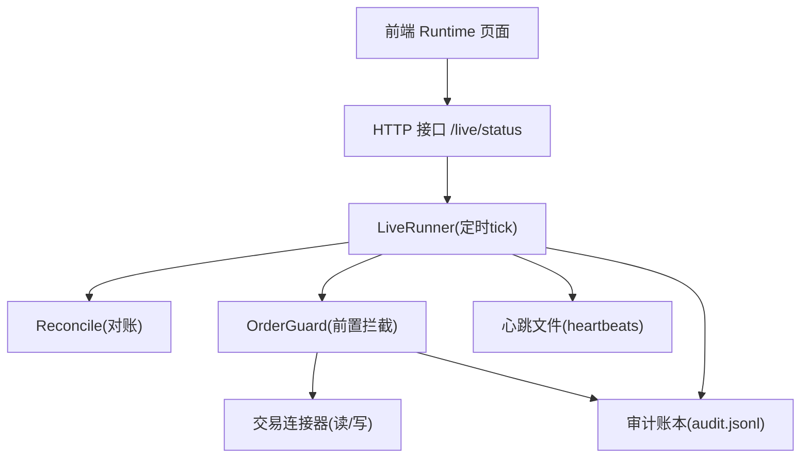
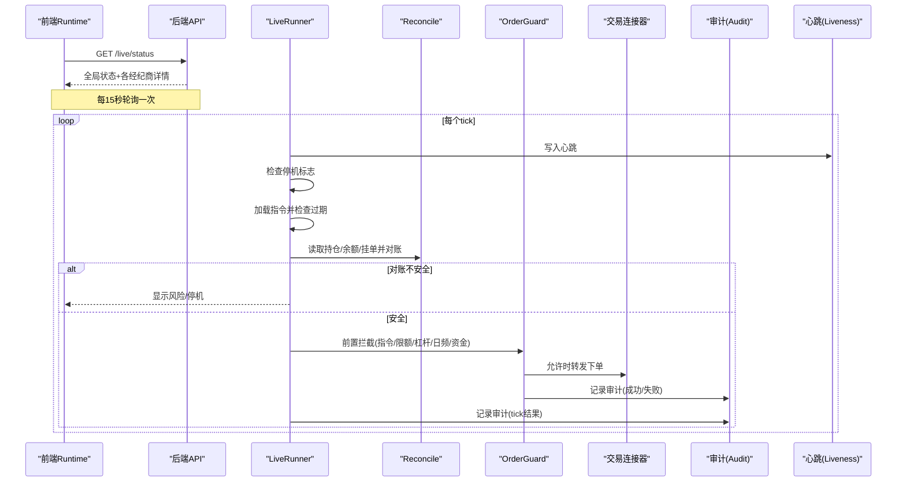
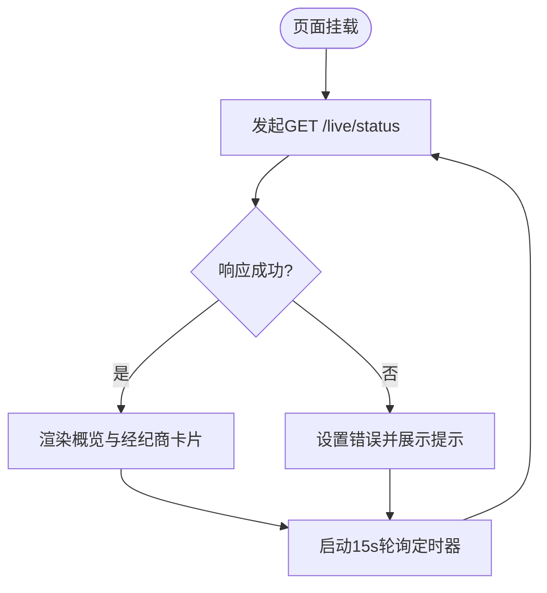
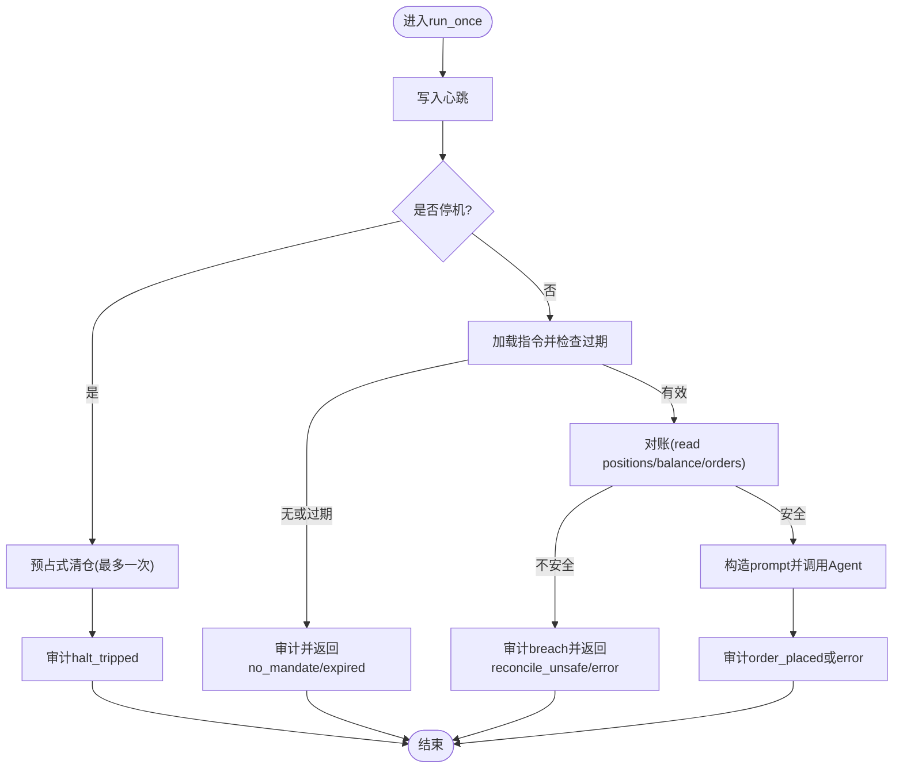
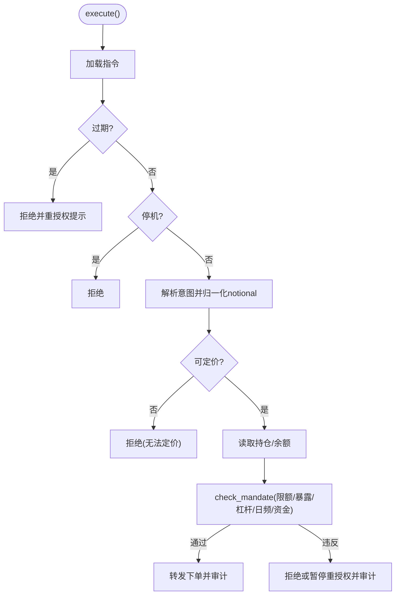
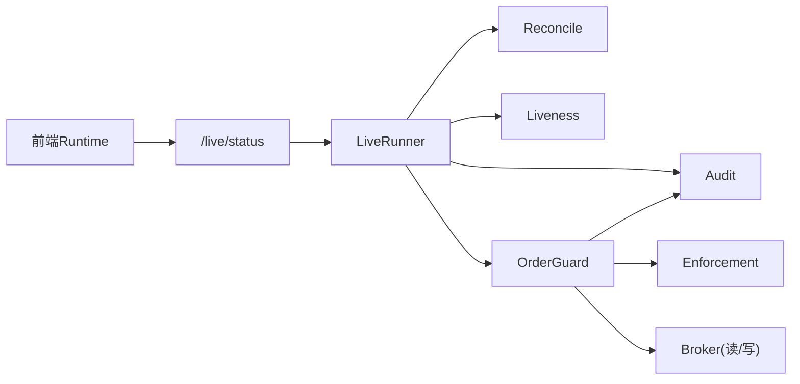

# 实时监控页面（Runtime）

<cite>
**本文引用的文件**
- [frontend/src/pages/Runtime.tsx](file://frontend/src/pages/Runtime.tsx)
- [frontend/src/lib/api.ts](file://frontend/src/lib/api.ts)
- [agent/src/live/runtime/runner.py](file://agent/src/live/runtime/runner.py)
- [agent/src/live/runtime/liveness.py](file://agent/src/live/runtime/liveness.py)
- [agent/src/live/order_guard.py](file://agent/src/live/order_guard.py)
- [agent/src/live/enforcement.py](file://agent/src/live/enforcement.py)
- [agent/src/live/runtime/reconcile.py](file://agent/src/live/runtime/reconcile.py)
- [agent/src/live/audit.py](file://agent/src/live/audit.py)
</cite>

## 目录
1. [简介](#简介)
2. [项目结构](#项目结构)
3. [核心组件](#核心组件)
4. [架构总览](#架构总览)
5. [详细组件分析](#详细组件分析)
6. [依赖关系分析](#依赖关系分析)
7. [性能考虑](#性能考虑)
8. [故障诊断指南](#故障诊断指南)
9. [结论](#结论)
10. [附录](#附录)

## 简介
本文件为 Vibe-Trading 的“实时监控页面（Runtime）”提供系统化文档，覆盖实盘交易监控能力：持仓与订单状态、实时盈亏与风险指标、风险控制警报、数据更新机制、连接管理、事件处理流程、异常处理、告警通知、性能优化、数据同步策略、用户体验优化，以及与交易连接器集成、安全控制、审计日志记录。同时给出操作指南、故障诊断方法与最佳实践建议。

## 项目结构
前端通过轮询后端 /live/status 获取运行时状态，渲染全局停机、授权账户、运行器存活等概览卡片，并按经纪商维度展示授权、指令（mandate）、风险状态、SDK 连接器诊断等信息。后端由持久化 Runner 驱动，按 tick 执行“停机检查 → 指令过期检查 → 对账 → 自主决策 → 审计”的固定顺序，并通过心跳文件维持可观测性；订单前置拦截在 order_guard 中完成，强制遵循指令限制；reconcile 负责崩溃恢复与状态对齐；audit 模块将关键动作写入不可变审计账本并可选地推送到 SSE 事件总线。

图表来源
- [frontend/src/pages/Runtime.tsx:40-81](file://frontend/src/pages/Runtime.tsx#L40-L81)
- [frontend/src/lib/api.ts:273-295](file://frontend/src/lib/api.ts#L273-L295)
- [agent/src/live/runtime/runner.py:407-441](file://agent/src/live/runtime/runner.py#L407-L441)
- [agent/src/live/runtime/liveness.py:79-100](file://agent/src/live/runtime/liveness.py#L79-L100)
- [agent/src/live/order_guard.py:130-214](file://agent/src/live/order_guard.py#L130-L214)
- [agent/src/live/audit.py:248-351](file://agent/src/live/audit.py#L248-L351)

章节来源
- [frontend/src/pages/Runtime.tsx:24-181](file://frontend/src/pages/Runtime.tsx#L24-L181)
- [frontend/src/lib/api.ts:273-295](file://frontend/src/lib/api.ts#L273-L295)

## 核心组件
- 前端 Runtime 页面：轮询 /live/status，聚合全局状态与经纪商卡片，展示授权、指令、风险、连接器诊断，支持手动刷新与错误提示。
- LiveRunner：持久化交易循环，每 tick 执行固定顺序的安全检查与交易决策，维护心跳与审计。
- OrderGuard：订单前置拦截，校验指令、额度、杠杆、日频次数、资金上限等，失败即拒绝或暂停重授权。
- Enforcement：指令校验核心逻辑，统一计算名义金额、暴露度、杠杆、流动性/市值门槛等。
- Reconcile：崩溃恢复与状态对齐，识别未知成交、孤儿订单、中途订单歧义，必要时要求停机。
- Liveness：心跳文件读写与存活判定，供状态查询与清理。
- Audit：不可变审计账本，记录所有关键动作，支持去标识化与可选链式防篡改副本。

章节来源
- [frontend/src/pages/Runtime.tsx:40-181](file://frontend/src/pages/Runtime.tsx#L40-L181)
- [agent/src/live/runtime/runner.py:288-441](file://agent/src/live/runtime/runner.py#L288-L441)
- [agent/src/live/order_guard.py:97-214](file://agent/src/live/order_guard.py#L97-L214)
- [agent/src/live/enforcement.py:455-617](file://agent/src/live/enforcement.py#L455-L617)
- [agent/src/live/runtime/reconcile.py:275-366](file://agent/src/live/runtime/reconcile.py#L275-L366)
- [agent/src/live/runtime/liveness.py:79-150](file://agent/src/live/runtime/liveness.py#L79-L150)
- [agent/src/live/audit.py:172-351](file://agent/src/live/audit.py#L172-L351)

## 架构总览
下图展示了从前端到后端的完整调用链与数据流：前端轮询获取状态，后端 Runner 周期性执行，结合 Reconcile 保证一致性，OrderGuard 确保合规，Audit 记录全链路事件，Liveness 提供存活信号。

图表来源
- [frontend/src/pages/Runtime.tsx:40-81](file://frontend/src/pages/Runtime.tsx#L40-L81)
- [frontend/src/lib/api.ts:273-295](file://frontend/src/lib/api.ts#L273-L295)
- [agent/src/live/runtime/runner.py:407-441](file://agent/src/live/runtime/runner.py#L407-L441)
- [agent/src/live/runtime/reconcile.py:275-366](file://agent/src/live/runtime/reconcile.py#L275-L366)
- [agent/src/live/order_guard.py:130-214](file://agent/src/live/order_guard.py#L130-L214)
- [agent/src/live/audit.py:248-351](file://agent/src/live/audit.py#L248-L351)
- [agent/src/live/runtime/liveness.py:79-100](file://agent/src/live/runtime/liveness.py#L79-L100)

## 详细组件分析

### 前端 Runtime 页面
- 数据获取与更新
  - 使用 AbortController 取消上一次请求，避免竞态；首次加载与后续每15秒轮询 /live/status；每秒更新时间用于倒计时与最后tick时间显示。
  - 错误处理：捕获网络或解析错误，展示不可用提示，清空状态。
- 状态展示
  - 全局停机、经纪商数量、已授权数量、运行器存活数。
  - 经纪商卡片：授权状态、指令有效期与限额摘要、风险状态推导（活跃/空闲/休眠/停机）。
  - SDK 连接器卡片：连接状态、能力集、诊断信息、验证按钮。
- 用户体验
  - 骨架屏加载、手动刷新按钮、国际化文案、状态标签颜色区分。

图表来源
- [frontend/src/pages/Runtime.tsx:40-81](file://frontend/src/pages/Runtime.tsx#L40-L81)
- [frontend/src/pages/Runtime.tsx:132-177](file://frontend/src/pages/Runtime.tsx#L132-L177)
- [frontend/src/pages/Runtime.tsx:225-297](file://frontend/src/pages/Runtime.tsx#L225-L297)
- [frontend/src/pages/Runtime.tsx:299-374](file://frontend/src/pages/Runtime.tsx#L299-L374)

章节来源
- [frontend/src/pages/Runtime.tsx:24-181](file://frontend/src/pages/Runtime.tsx#L24-L181)
- [frontend/src/pages/Runtime.tsx:183-590](file://frontend/src/pages/Runtime.tsx#L183-L590)
- [frontend/src/lib/api.ts:273-295](file://frontend/src/lib/api.ts#L273-L295)

### LiveRunner（持久化交易循环）
- Tick 顺序（fail-closed）：停机检查 → 指令加载与过期检查 → 对账 → 构建包含指令上下文的自主决策 prompt → 审计。
- 心跳：每 tick 写入 runner_id 的心跳文件，供状态查询与清理。
- 调度：根据触发器生成 watch job，重启时重新计算任务（resume-via-recompute），不保留中间状态。
- 预占式清仓：当检测到停机标志，仅执行一次清仓/撤单（若注入写能力），并审计。

图表来源
- [agent/src/live/runtime/runner.py:407-441](file://agent/src/live/runtime/runner.py#L407-L441)
- [agent/src/live/runtime/runner.py:528-595](file://agent/src/live/runtime/runner.py#L528-L595)
- [agent/src/live/runtime/runner.py:675-798](file://agent/src/live/runtime/runner.py#L675-L798)

章节来源
- [agent/src/live/runtime/runner.py:288-441](file://agent/src/live/runtime/runner.py#L288-L441)
- [agent/src/live/runtime/runner.py:528-636](file://agent/src/live/runtime/runner.py#L528-L636)
- [agent/src/live/runtime/runner.py:675-798](file://agent/src/live/runtime/runner.py#L675-L798)

### OrderGuard（订单前置拦截）
- 执行顺序：加载指令 → 检查过期 → 检查停机 → 解析意图 → 归一化名义金额（quantity→notional）→ 读取持仓/余额 → 指令校验 → 允许/拒绝/暂停重授权。
- 价格获取：优先连接器报价工具，回退至数据加载器；无法定价则拒绝。
- 审计：每次决策均写入审计，并在允许且非错误时增加当日计数。

图表来源
- [agent/src/live/order_guard.py:130-214](file://agent/src/live/order_guard.py#L130-L214)
- [agent/src/live/order_guard.py:216-317](file://agent/src/live/order_guard.py#L216-L317)
- [agent/src/live/order_guard.py:321-389](file://agent/src/live/order_guard.py#L321-L389)

章节来源
- [agent/src/live/order_guard.py:97-214](file://agent/src/live/order_guard.py#L97-L214)
- [agent/src/live/order_guard.py:216-389](file://agent/src/live/order_guard.py#L216-L389)

### Enforcement（指令校验）
- 统一计算名义金额、暴露度、杠杆、日频次数、资金上限、市值/流动性门槛。
- 任何不可解析或缺失数据均拒绝（fail-closed）。
- 结构化违规（排除列表、不允许的资产类别/工具类型）直接拒绝；数值型超限暂停重授权。

章节来源
- [agent/src/live/enforcement.py:455-617](file://agent/src/live/enforcement.py#L455-L617)
- [agent/src/live/enforcement.py:620-798](file://agent/src/live/enforcement.py#L620-L798)

### Reconcile（崩溃恢复与对账）
- 对比持久化的“上次已知状态”与当前经纪商真实状态，分类差异：匹配、未知成交、孤儿订单、中途订单歧义。
- 出现危险差异（未知成交、中途订单歧义）标记 requires_halt，阻止继续交易并上报。
- 仅在安全时对账通过后原子写入新的基准状态。

章节来源
- [agent/src/live/runtime/reconcile.py:275-366](file://agent/src/live/runtime/reconcile.py#L275-L366)
- [agent/src/live/runtime/reconcile.py:369-529](file://agent/src/live/runtime/reconcile.py#L369-L529)
- [agent/src/live/runtime/reconcile.py:532-609](file://agent/src/live/runtime/reconcile.py#L532-L609)

### Liveness（心跳与存活判定）
- 每 tick 写入 runner_id 的心跳文件（原子写入），读取最近一次心跳判断存活。
- 清理陈旧心跳文件，避免僵尸进程残留。

章节来源
- [agent/src/live/runtime/liveness.py:79-150](file://agent/src/live/runtime/liveness.py#L79-L150)
- [agent/src/live/runtime/liveness.py:153-191](file://agent/src/live/runtime/liveness.py#L153-L191)

### Audit（审计账本）
- 不可变追加式账本，记录订单放置、拒绝、指令提交、违规、停机/恢复等。
- 去标识化处理敏感字段，支持可选链式防篡改副本。
- 可选事件回调推送至 SSE，供前端实时渲染。

章节来源
- [agent/src/live/audit.py:172-351](file://agent/src/live/audit.py#L172-L351)

## 依赖关系分析
- 前端依赖后端 /live/status 接口获取运行时状态，依赖 /live/connectors/{id}/verify 进行连接器验证。
- Runner 依赖调度器、触发器、指令存储、对账、心跳、审计、停机标志与 broker 读/写能力。
- OrderGuard 依赖指令模型、对账读能力、数据加载器（报价/市场容量/流动性）与审计。
- Reconcile 依赖持久化状态文件与 broker 读能力。
- Liveness 独立于交易路径，仅影响可见性与清理。

图表来源
- [frontend/src/lib/api.ts:273-295](file://frontend/src/lib/api.ts#L273-L295)
- [agent/src/live/runtime/runner.py:288-441](file://agent/src/live/runtime/runner.py#L288-L441)
- [agent/src/live/order_guard.py:97-214](file://agent/src/live/order_guard.py#L97-L214)
- [agent/src/live/enforcement.py:455-617](file://agent/src/live/enforcement.py#L455-L617)
- [agent/src/live/runtime/reconcile.py:275-366](file://agent/src/live/runtime/reconcile.py#L275-L366)
- [agent/src/live/runtime/liveness.py:79-150](file://agent/src/live/runtime/liveness.py#L79-L150)
- [agent/src/live/audit.py:248-351](file://agent/src/live/audit.py#L248-L351)

## 性能考虑
- 前端轮询间隔：默认15秒，兼顾实时性与服务器压力；时钟每秒刷新以改善倒计时体验。
- 请求去重与取消：AbortController 取消旧请求，避免重复渲染与资源浪费。
- 后端心跳：轻量文件写入，不影响交易主路径；失败被吞掉以避免阻塞。
- 对账与审计：对账失败或审计写入失败均不阻断交易主路径，但会记录日志与审计。
- 数据源回退：报价与市值/流动性数据采用连接器优先、数据加载器回退的策略，降低单点失败风险。

[本节为通用性能讨论，无需特定文件引用]

## 故障诊断指南
- 页面无法加载状态
  - 检查网络与认证头；查看错误消息是否为“需要认证”。
  - 确认后端 /live/status 可达，重试刷新。
- 连接器未配置或连接失败
  - 在 SDK 连接器卡片中查看诊断信息与错误码；点击“验证连接”重试。
  - 缺失环境变量时会列出所需变量名，按提示配置。
- 指令过期或未生效
  - 检查指令有效期与账户授权；过期将触发停机并撤销权限。
- 对账不安全导致停机
  - 查看对账报告中的差异类型（未知成交、孤儿订单、中途订单歧义）；需人工介入后再恢复。
- 心跳丢失
  - 检查心跳文件是否存在与最新时间戳；若陈旧将被清理，可能表示进程异常。
- 审计记录缺失
  - 检查审计账本文件是否存在与写入权限；链式副本写入失败不影响主账本。

章节来源
- [frontend/src/pages/Runtime.tsx:121-130](file://frontend/src/pages/Runtime.tsx#L121-L130)
- [frontend/src/pages/Runtime.tsx:299-374](file://frontend/src/pages/Runtime.tsx#L299-L374)
- [agent/src/live/runtime/reconcile.py:275-366](file://agent/src/live/runtime/reconcile.py#L275-L366)
- [agent/src/live/runtime/liveness.py:127-191](file://agent/src/live/runtime/liveness.py#L127-L191)
- [agent/src/live/audit.py:248-351](file://agent/src/live/audit.py#L248-L351)

## 结论
实时监控页面通过稳定的轮询机制与清晰的状态分层，提供了对实盘交易的全局可视性。后端以 Runner 为核心，结合 Reconcile、OrderGuard、Enforcement、Liveness 与 Audit 构建了强一致、强安全、可审计的交易闭环。建议在生产环境中合理配置指令限额、启用审计链式副本、关注心跳与对账报告，并结合前端告警与操作指引快速定位问题。

[本节为总结，无需特定文件引用]

## 附录

### 实时数据更新机制与事件处理
- 前端每15秒轮询 /live/status，每秒刷新本地时钟以改进倒计时与最后tick显示。
- 后端 Runner 每 tick 写入心跳；订单前置拦截与 Runner 均写入审计；审计可经事件回调推送至 SSE（如需实时事件可在上层接入）。

章节来源
- [frontend/src/pages/Runtime.tsx:40-81](file://frontend/src/pages/Runtime.tsx#L40-L81)
- [agent/src/live/runtime/runner.py:528-543](file://agent/src/live/runtime/runner.py#L528-L543)
- [agent/src/live/audit.py:248-351](file://agent/src/live/audit.py#L248-L351)

### 交易执行状态监控与异常处理
- 执行状态：通过 Runner 的 tick 结果与审计记录体现；OrderGuard 明确区分允许、拒绝、暂停重授权。
- 异常处理：对账失败、审计写入失败、心跳写入失败均不阻断主路径，但会记录日志与审计；连接器错误通过前端卡片诊断呈现。

章节来源
- [agent/src/live/runtime/runner.py:407-441](file://agent/src/live/runtime/runner.py#L407-L441)
- [agent/src/live/order_guard.py:321-389](file://agent/src/live/order_guard.py#L321-L389)
- [agent/src/live/runtime/liveness.py:127-150](file://agent/src/live/runtime/liveness.py#L127-L150)
- [frontend/src/pages/Runtime.tsx:299-374](file://frontend/src/pages/Runtime.tsx#L299-L374)

### 与交易连接器的集成方式与安全控制
- 集成方式：OrderGuard 优先使用连接器报价工具，回退至数据加载器；Runner 通过注入的 read/write 能力与连接器交互。
- 安全控制：指令硬约束（单笔名义、总暴露、杠杆、日频、资金上限）、排除列表、资产类别/工具类型白名单；对账发现危险差异即停机；心跳与审计保障可观测性与可追溯性。

章节来源
- [agent/src/live/order_guard.py:216-317](file://agent/src/live/order_guard.py#L216-L317)
- [agent/src/live/enforcement.py:455-617](file://agent/src/live/enforcement.py#L455-L617)
- [agent/src/live/runtime/reconcile.py:275-366](file://agent/src/live/runtime/reconcile.py#L275-L366)

### 操作指南与最佳实践
- 操作指南
  - 打开实时监控页面，确认全局停机状态与各经纪商授权情况。
  - 如连接器未配置，按提示补充环境变量并点击“验证连接”。
  - 定期查看指令有效期与限额摘要，确保交易范围受控。
- 最佳实践
  - 保持指令限额保守，避免过度暴露。
  - 启用审计链式副本，便于事后核查。
  - 关注心跳与对账报告，及时处理异常差异。
  - 在前端开启必要的告警通道（如SSE事件），提升响应速度。

[本节为通用指导，无需特定文件引用]