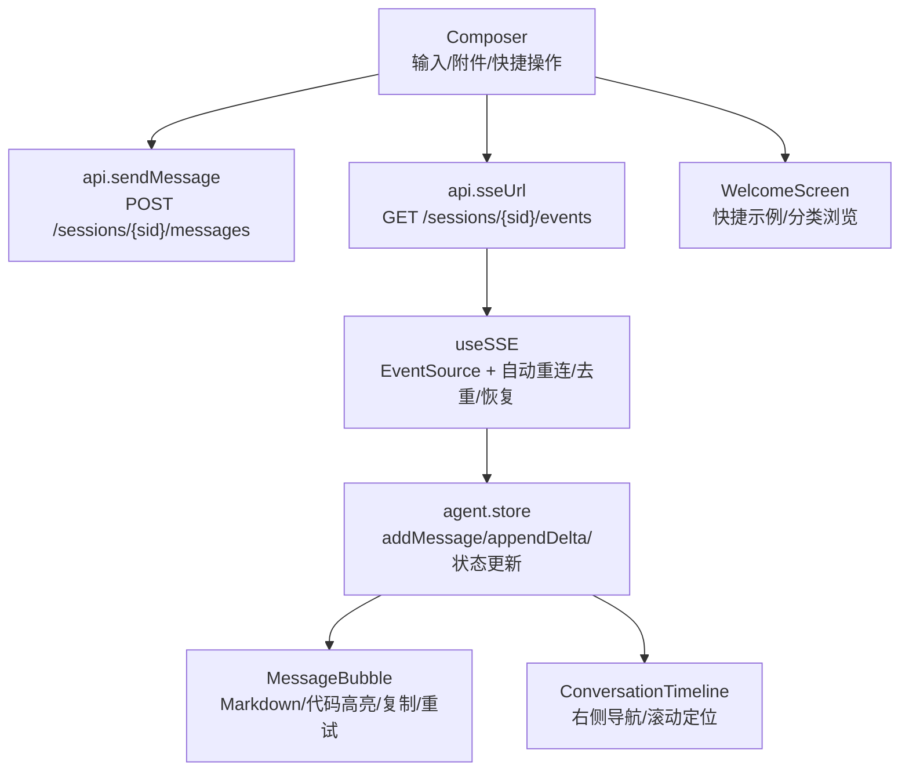
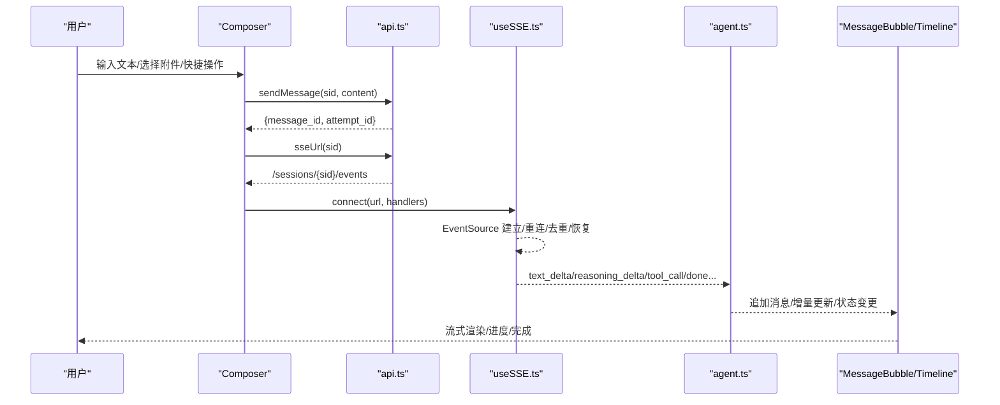
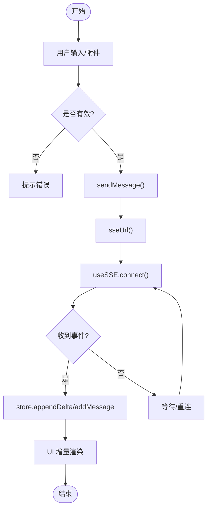
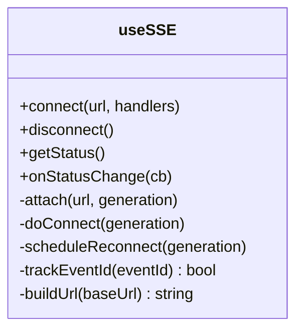
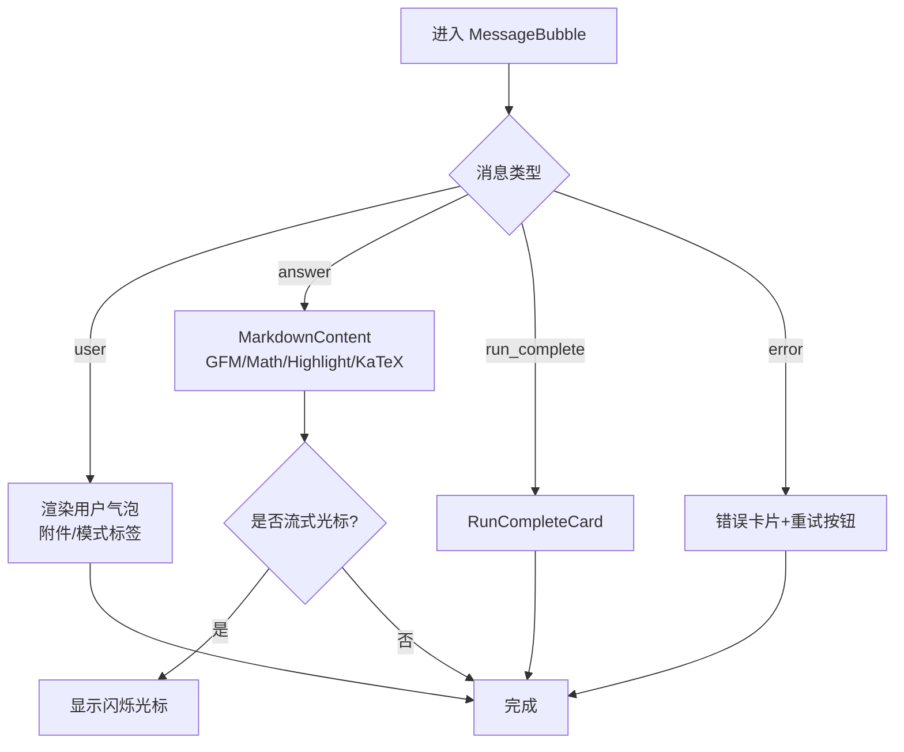
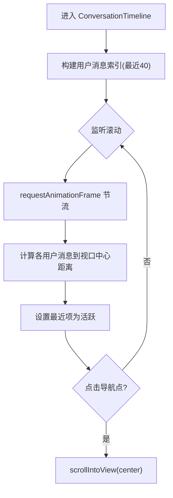
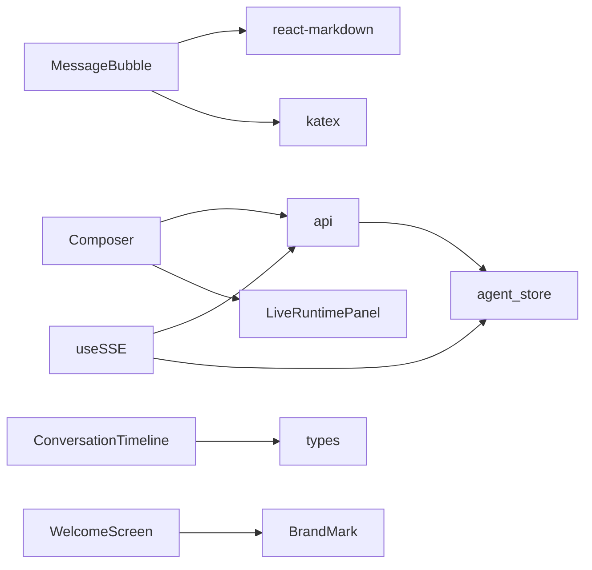

# 对话界面

<cite>
**本文引用的文件**
- [ConversationTimeline.tsx](file://frontend/src/components/chat/ConversationTimeline.tsx)
- [MessageBubble.tsx](file://frontend/src/components/chat/MessageBubble.tsx)
- [Composer.tsx](file://frontend/src/components/chat/Composer.tsx)
- [WelcomeScreen.tsx](file://frontend/src/components/chat/WelcomeScreen.tsx)
- [api.ts](file://frontend/src/lib/api.ts)
- [useSSE.ts](file://frontend/src/hooks/useSSE.ts)
- [agent.ts](file://frontend/src/stores/agent.ts)
</cite>

## 目录
1. [简介](#简介)
2. [项目结构](#项目结构)
3. [核心组件](#核心组件)
4. [架构总览](#架构总览)
5. [详细组件分析](#详细组件分析)
6. [依赖关系分析](#依赖关系分析)
7. [性能考虑](#性能考虑)
8. [故障排查指南](#故障排查指南)
9. [结论](#结论)
10. [附录](#附录)

## 简介
本文件面向 Vibe-Trading 研究页面的“对话界面”，聚焦以下目标：
- 用户输入处理与消息发送/接收流程
- SSE 流式通信机制（连接、重连、去重、恢复）
- 消息气泡渲染逻辑（Markdown、数学公式、代码高亮、复制、错误提示）
- Composer 组件的文件上传、附件处理、快捷操作与智能提示
- 欢迎界面的引导流程与快捷操作
- 消息分组算法、时间线滚动优化、虚拟滚动建议
- 交互最佳实践与性能优化建议

## 项目结构
对话界面由一组前端 React 组件与状态管理构成，围绕“会话”展开：
- 输入与发送：Composer
- 消息展示：MessageBubble、ConversationTimeline
- 引导与示例：WelcomeScreen
- 网络层：api（REST + SSE URL）、useSSE（SSE 客户端封装）
- 状态管理：agent store（消息、活动状态、工具调用、SSE 状态等）

图表来源
- [Composer.tsx:129-165](file://frontend/src/components/chat/Composer.tsx#L129-L165)
- [api.ts:157-188](file://frontend/src/lib/api.ts#L157-L188)
- [useSSE.ts:27-216](file://frontend/src/hooks/useSSE.ts#L27-L216)
- [agent.ts:119-165](file://frontend/src/stores/agent.ts#L119-L165)
- [MessageBubble.tsx:76-104](file://frontend/src/components/chat/MessageBubble.tsx#L76-L104)
- [ConversationTimeline.tsx:10-82](file://frontend/src/components/chat/ConversationTimeline.tsx#L10-L82)
- [WelcomeScreen.tsx:238-367](file://frontend/src/components/chat/WelcomeScreen.tsx#L238-L367)

章节来源
- [Composer.tsx:1-413](file://frontend/src/components/chat/Composer.tsx#L1-L413)
- [api.ts:1-296](file://frontend/src/lib/api.ts#L1-L296)
- [useSSE.ts:1-216](file://frontend/src/hooks/useSSE.ts#L1-L216)
- [agent.ts:1-336](file://frontend/src/stores/agent.ts#L1-L336)
- [MessageBubble.tsx:1-289](file://frontend/src/components/chat/MessageBubble.tsx#L1-L289)
- [ConversationTimeline.tsx:1-82](file://frontend/src/components/chat/ConversationTimeline.tsx#L1-L82)
- [WelcomeScreen.tsx:1-367](file://frontend/src/components/chat/WelcomeScreen.tsx#L1-L367)

## 核心组件
- Composer：负责文本输入、附件上传、模式切换（研究目标/群聊预设）、快捷指令、导出与停止生成。
- MessageBubble：渲染用户消息与助手回答，支持 Markdown、表格、链接、数学公式、代码高亮、复制、耗时显示、错误重试。
- ConversationTimeline：基于用户消息索引的右侧导航点，滚动时计算最近的用户消息并高亮，点击平滑滚动到对应位置。
- WelcomeScreen：按时间段问候语、快速操作按钮、可折叠示例库（多市场回测、研究分析、价值投资、群聊团队、文档网页研究、交易记录、连接器、影子账户）。
- api：统一 REST 接口封装，包含会话消息发送、SSE URL 构造、上传、设置等。
- useSSE：SSE 客户端 Hook，提供自动重连、指数退避、事件去重、Last-Event-ID 恢复、认证票据获取。
- agent store：集中管理消息列表、会话 ID、流式文本、工具调用、活动状态、SSE 状态、会话缓存与切换。

章节来源
- [Composer.tsx:71-413](file://frontend/src/components/chat/Composer.tsx#L71-L413)
- [MessageBubble.tsx:174-289](file://frontend/src/components/chat/MessageBubble.tsx#L174-L289)
- [ConversationTimeline.tsx:10-82](file://frontend/src/components/chat/ConversationTimeline.tsx#L10-L82)
- [WelcomeScreen.tsx:18-367](file://frontend/src/components/chat/WelcomeScreen.tsx#L18-L367)
- [api.ts:123-296](file://frontend/src/lib/api.ts#L123-L296)
- [useSSE.ts:27-216](file://frontend/src/hooks/useSSE.ts#L27-L216)
- [agent.ts:57-165](file://frontend/src/stores/agent.ts#L57-L165)

## 架构总览
下图展示了从用户输入到流式响应渲染的端到端流程，包括 SSE 连接、事件分发与 UI 更新。

图表来源
- [Composer.tsx:129-165](file://frontend/src/components/chat/Composer.tsx#L129-L165)
- [api.ts:157-188](file://frontend/src/lib/api.ts#L157-L188)
- [useSSE.ts:71-156](file://frontend/src/hooks/useSSE.ts#L71-L156)
- [agent.ts:133-165](file://frontend/src/stores/agent.ts#L133-L165)

## 详细组件分析

### 用户输入处理与消息发送/接收流程
- 输入与提交：
  - Composer 监听键盘 Enter（兼容输入法组合），阻止默认行为后调用 submitPrompt；在流式进行中禁用输入。
  - 支持通过 ref 暴露 fill/focus/submit 方法，便于外部触发填充或提交。
- 附件上传：
  - 校验扩展名黑名单与文件大小限制，调用 api.uploadFile 上传，成功后以附件形式随消息提交。
- 消息发送：
  - 通过 api.sendMessage 创建会话消息，返回 message_id 与 attempt_id，用于后续追踪。
- SSE 连接：
  - 使用 api.sseUrl 获取事件流地址，useSSE 建立 EventSource，自动处理认证票据、重连、去重与 Last-Event-ID 恢复。
- 事件处理与状态更新：
  - useSSE 将后端事件分派给 handler，agent store 根据事件类型追加消息、增量更新流式文本、维护工具调用与活动状态。

图表来源
- [Composer.tsx:129-165](file://frontend/src/components/chat/Composer.tsx#L129-L165)
- [api.ts:157-188](file://frontend/src/lib/api.ts#L157-L188)
- [useSSE.ts:71-156](file://frontend/src/hooks/useSSE.ts#L71-L156)
- [agent.ts:133-165](file://frontend/src/stores/agent.ts#L133-L165)

章节来源
- [Composer.tsx:129-165](file://frontend/src/components/chat/Composer.tsx#L129-L165)
- [api.ts:157-188](file://frontend/src/lib/api.ts#L157-L188)
- [useSSE.ts:71-156](file://frontend/src/hooks/useSSE.ts#L71-L156)
- [agent.ts:133-165](file://frontend/src/stores/agent.ts#L133-L165)

### SSE 流式通信机制
- 连接与认证：
  - 若存在 API Key，则先通过 withAuthTicket 获取一次性票据再连接；否则直接连接。
- 事件订阅与去重：
  - 仅订阅已知事件类型；使用 LRU 集合对 lastEventId 去重，避免重复处理。
- 断线重连与恢复：
  - onerror 关闭源并调度指数退避重连；重连时附加 Last-Event-ID 实现断点续传。
- 状态回调：
  - 暴露 getStatus/onStatusChange，供 UI 显示连接状态与重连次数。

图表来源
- [useSSE.ts:27-216](file://frontend/src/hooks/useSSE.ts#L27-L216)

章节来源
- [useSSE.ts:27-216](file://frontend/src/hooks/useSSE.ts#L27-L216)

### 消息气泡组件渲染逻辑
- 内容渲染：
  - 使用 ReactMarkdown 渲染 Markdown，启用 remark-gfm、remark-math（单美元符关闭以避免金额误解析）、rehype-highlight（代码高亮）、rehype-katex（数学公式）。
  - 流式模式下禁用 rehype 插件以减少抖动，非流式模式启用以获得完整高亮与公式渲染。
  - 自定义 table/a 组件，表格横向滚动，链接新窗口打开。
- 错误边界：
  - MarkdownErrorBoundary 捕获渲染异常，降级为纯文本显示，并在内容变化时重置失败状态。
- 交互功能：
  - 复制按钮优先使用 Clipboard API，回退到 execCommand；失败时提示。
  - 错误消息根据关键词给出重试提示（超时、API 限流/错误码、执行失败）。
  - 显示耗时（毫秒/秒/分钟格式化）。

图表来源
- [MessageBubble.tsx:17-39](file://frontend/src/components/chat/MessageBubble.tsx#L17-L39)
- [MessageBubble.tsx:76-104](file://frontend/src/components/chat/MessageBubble.tsx#L76-L104)
- [MessageBubble.tsx:134-161](file://frontend/src/components/chat/MessageBubble.tsx#L134-L161)
- [MessageBubble.tsx:163-172](file://frontend/src/components/chat/MessageBubble.tsx#L163-L172)
- [MessageBubble.tsx:187-289](file://frontend/src/components/chat/MessageBubble.tsx#L187-L289)

章节来源
- [MessageBubble.tsx:17-39](file://frontend/src/components/chat/MessageBubble.tsx#L17-L39)
- [MessageBubble.tsx:76-104](file://frontend/src/components/chat/MessageBubble.tsx#L76-L104)
- [MessageBubble.tsx:134-172](file://frontend/src/components/chat/MessageBubble.tsx#L134-L172)
- [MessageBubble.tsx:187-289](file://frontend/src/components/chat/MessageBubble.tsx#L187-L289)

### Composer 组件：文件上传、附件处理、智能提示
- 文件上传：
  - 接受多种文档与图片格式；拦截可执行与压缩包扩展名；限制最大文件大小；上传成功显示文件名并可移除。
- 附件处理：
  - 提交时将附件路径与文件名作为 meta 携带，消息气泡中显示附件标签。
- 智能提示与快捷操作：
  - 内置“检查连接器”“分析投资组合”等快捷指令，一键填入预定义提示词并提交。
  - 支持“研究目标”和“群聊预设”模式，提交后保持焦点以便继续编辑。
- 输入体验：
  - 自适应高度文本域；Enter 提交（Shift+Enter 换行）；流式期间禁用输入；支持导出聊天记录。

章节来源
- [Composer.tsx:39-45](file://frontend/src/components/chat/Composer.tsx#L39-L45)
- [Composer.tsx:134-165](file://frontend/src/components/chat/Composer.tsx#L134-L165)
- [Composer.tsx:191-232](file://frontend/src/components/chat/Composer.tsx#L191-L232)
- [Composer.tsx:233-327](file://frontend/src/components/chat/Composer.tsx#L233-L327)
- [Composer.tsx:328-413](file://frontend/src/components/chat/Composer.tsx#L328-L413)

### 欢迎界面：引导流程与快捷操作
- 问候语：根据时段随机选择问候文案。
- 快捷操作：顶部常驻 4 个常用任务入口，点击即填充提示词并触发提交。
- 示例库：可折叠区域，按类别（多市场回测、研究分析、价值投资、群聊团队、文档网页研究、交易记录、连接器、影子账户）组织示例卡片，点击即使用。

章节来源
- [WelcomeScreen.tsx:18-172](file://frontend/src/components/chat/WelcomeScreen.tsx#L18-L172)
- [WelcomeScreen.tsx:174-232](file://frontend/src/components/chat/WelcomeScreen.tsx#L174-L232)
- [WelcomeScreen.tsx:238-367](file://frontend/src/components/chat/WelcomeScreen.tsx#L238-L367)

### 消息分组算法与时间线滚动优化
- 用户消息分组：
  - 通过遍历消息数组收集所有用户消息索引，并保留最近 40 条用于右侧导航点，减少 DOM 查询开销。
- 滚动定位：
  - 监听容器滚动，使用 requestAnimationFrame 节流，计算每个用户消息元素中心点到视口中心的距离，找到最近项并高亮。
- 点击跳转：
  - 通过 data-msg-idx 定位元素并 smooth scrollIntoView(block: center)。

图表来源
- [ConversationTimeline.tsx:13-16](file://frontend/src/components/chat/ConversationTimeline.tsx#L13-L16)
- [ConversationTimeline.tsx:18-47](file://frontend/src/components/chat/ConversationTimeline.tsx#L18-L47)
- [ConversationTimeline.tsx:49-54](file://frontend/src/components/chat/ConversationTimeline.tsx#L49-L54)

章节来源
- [ConversationTimeline.tsx:10-82](file://frontend/src/components/chat/ConversationTimeline.tsx#L10-L82)

### 虚拟滚动实现建议
当前实现未采用虚拟滚动，适合中等长度会话。对于超长会话，建议：
- 使用 react-window 或 @tanstack/virtual 进行可视区域渲染，仅渲染可见消息。
- 结合 ConversationTimeline 的索引策略，仅对可见范围的用户消息计算滚动定位。
- 对长消息内容使用懒加载与分页渲染，避免首屏阻塞。

[本节为通用建议，不直接分析具体文件]

## 依赖关系分析
- 组件依赖：
  - MessageBubble 依赖 Markdown 渲染链（react-markdown、remark-*、rehype-*、katex）。
  - Composer 依赖 api.uploadFile、LiveRuntimePanel、i18n。
  - ConversationTimeline 依赖 AgentMessage 类型与 utils 工具函数。
  - WelcomeScreen 依赖 BrandMark 与 i18n。
- 数据流依赖：
  - api.ts 提供 REST/SSE URL 能力，useSSE 消费这些 URL 并管理连接。
  - agent store 作为单一事实源，被多个组件读取与更新。

图表来源
- [Composer.tsx:27-32](file://frontend/src/components/chat/Composer.tsx#L27-L32)
- [MessageBubble.tsx:4-11](file://frontend/src/components/chat/MessageBubble.tsx#L4-L11)
- [ConversationTimeline.tsx:1-12](file://frontend/src/components/chat/ConversationTimeline.tsx#L1-L12)
- [WelcomeScreen.tsx:1-5](file://frontend/src/components/chat/WelcomeScreen.tsx#L1-L5)
- [useSSE.ts:5-7](file://frontend/src/hooks/useSSE.ts#L5-L7)
- [api.ts:123-188](file://frontend/src/lib/api.ts#L123-L188)
- [agent.ts:119-165](file://frontend/src/stores/agent.ts#L119-L165)

章节来源
- [Composer.tsx:27-32](file://frontend/src/components/chat/Composer.tsx#L27-L32)
- [MessageBubble.tsx:4-11](file://frontend/src/components/chat/MessageBubble.tsx#L4-L11)
- [ConversationTimeline.tsx:1-12](file://frontend/src/components/chat/ConversationTimeline.tsx#L1-L12)
- [WelcomeScreen.tsx:1-5](file://frontend/src/components/chat/WelcomeScreen.tsx#L1-L5)
- [useSSE.ts:5-7](file://frontend/src/hooks/useSSE.ts#L5-L7)
- [api.ts:123-188](file://frontend/src/lib/api.ts#L123-L188)
- [agent.ts:119-165](file://frontend/src/stores/agent.ts#L119-L165)

## 性能考虑
- 流式渲染优化：
  - 流式模式下禁用代码高亮与公式渲染，降低频繁重绘成本；完成后再次渲染以获得完整效果。
  - 使用 memo 包裹关键组件（MessageBubble、MarkdownContent、Composer）减少不必要重渲染。
- 滚动与定位：
  - 使用 requestAnimationFrame 节流滚动计算；仅维护最近 40 条用户消息索引，控制 DOM 查询规模。
- 网络与重连：
  - SSE 使用指数退避与 LRU 去重，避免风暴式重连与重复事件；Last-Event-ID 保障断点续传。
- 内存与缓存：
  - agent store 维护会话缓存上限，防止历史消息无限增长；工具调用与活动状态按需更新。
- 输入与交互：
  - 流式期间禁用输入，避免并发提交；输入法组合键处理避免误触发提交。

[本节提供通用指导，不直接分析具体文件]

## 故障排查指南
- 认证与权限：
  - 当 API 返回 401/403 时，统一转换为“需要认证”的本地化提示；确保 withAuthTicket 正确获取票据。
- 上传失败：
  - 检查扩展名黑名单与文件大小限制；查看 toast 错误信息，确认后端上传接口可用。
- SSE 连接问题：
  - 观察 useSSE 状态（disconnected/connected/reconnecting）；检查网络与代理配置；必要时手动刷新页面重建连接。
- Markdown 渲染异常：
  - 若出现渲染崩溃，MarkdownErrorBoundary 会降级为纯文本；检查公式与代码块语法，必要时简化内容。
- 错误消息重试：
  - 根据错误内容（超时、API 限流/错误码、执行失败）提供重试按钮；重试前确认上下文与参数正确。

章节来源
- [api.ts:60-70](file://frontend/src/lib/api.ts#L60-L70)
- [Composer.tsx:134-165](file://frontend/src/components/chat/Composer.tsx#L134-L165)
- [useSSE.ts:122-174](file://frontend/src/hooks/useSSE.ts#L122-L174)
- [MessageBubble.tsx:49-68](file://frontend/src/components/chat/MessageBubble.tsx#L49-L68)
- [MessageBubble.tsx:163-172](file://frontend/src/components/chat/MessageBubble.tsx#L163-L172)

## 结论
该对话界面通过清晰的组件分工与稳健的网络层设计，实现了流畅的流式交互与丰富的内容展示。Composer 提供高效的输入与附件处理能力；MessageBubble 保证 Markdown、数学公式与代码高亮的稳定渲染；ConversationTimeline 提升长会话的可导航性；useSSE 与 agent store 共同保障了连接的可靠性与状态的一致性。建议在大规模会话场景引入虚拟滚动，并持续优化流式渲染与网络重连策略，以提升整体用户体验。

## 附录
- 最佳实践
  - 在流式过程中避免复杂计算与重型渲染，延迟至完成后再启用高亮与公式。
  - 对用户输入进行严格校验与防抖，避免重复提交与无效请求。
  - 利用 i18n 与无障碍属性提升国际化与可访问性。
  - 对长消息与大量附件进行分页与懒加载，减少首屏压力。
  - 监控 SSE 状态与错误日志，及时告警与自愈。

[本节为通用建议，不直接分析具体文件]