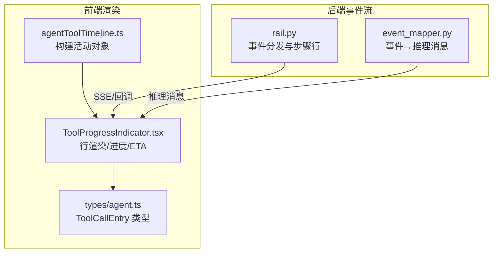
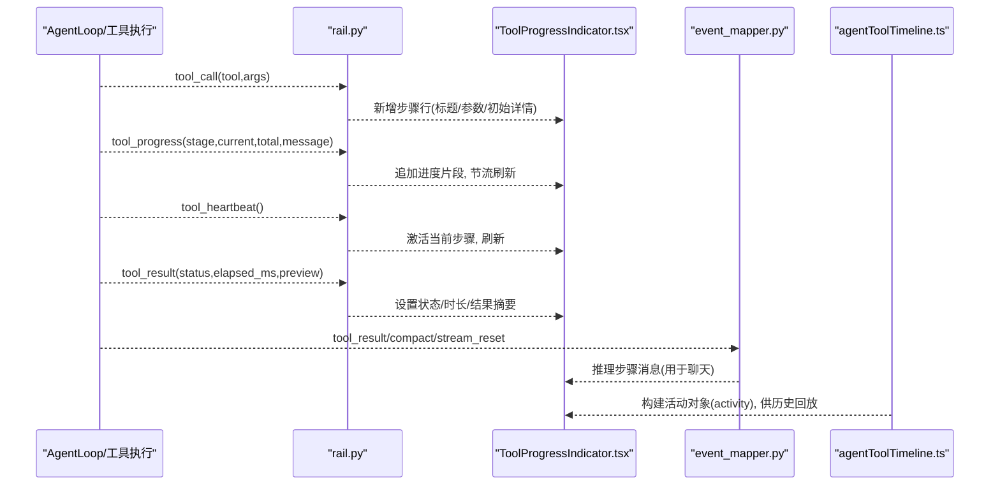
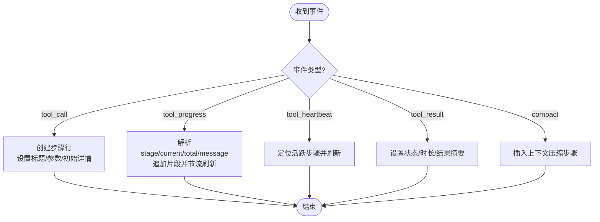
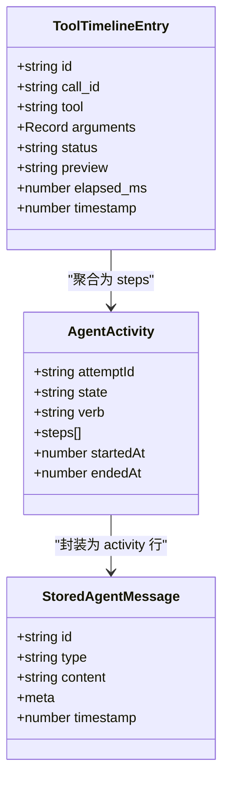
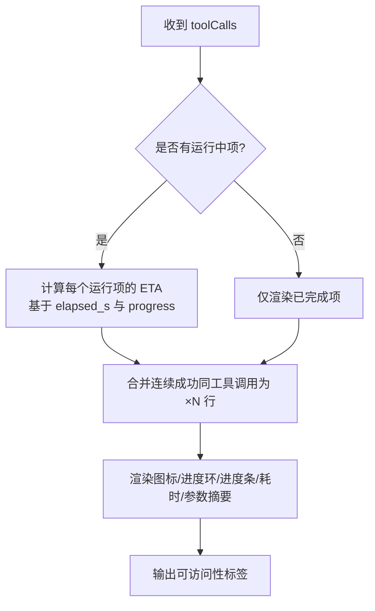
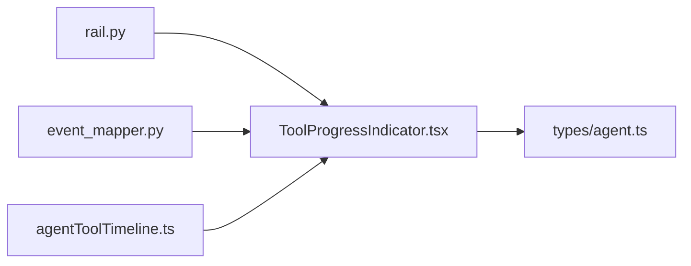

# 工具调用可视化

<cite>
**本文引用的文件**
- [agent/cli/ui/rail.py](file://agent/cli/ui/rail.py)
- [agent/cli/components/tool_event.py](file://agent/cli/components/tool_event.py)
- [frontend/src/pages/agentToolTimeline.ts](file://frontend/src/pages/agentToolTimeline.ts)
- [frontend/src/components/chat/ToolProgressIndicator.tsx](file://frontend/src/components/chat/ToolProgressIndicator.tsx)
- [frontend/src/types/agent.ts](file://frontend/src/types/agent.ts)
- [agent/src/openbb_bridge/event_mapper.py](file://agent/src/openbb_bridge/event_mapper.py)
- [agent/tests/test_tool_timeout.py](file://agent/tests/test_tool_timeout.py)
- [agent/tests/test_mcp_client_adapter.py](file://agent/tests/test_mcp_client_adapter.py)
</cite>

## 目录
1. [简介](#简介)
2. [项目结构](#项目结构)
3. [核心组件](#核心组件)
4. [架构总览](#架构总览)
5. [详细组件分析](#详细组件分析)
6. [依赖关系分析](#依赖关系分析)
7. [性能考量](#性能考量)
8. [故障排查指南](#故障排查指南)
9. [结论](#结论)
10. [附录](#附录)

## 简介
本文件面向 Vibe-Trading 研究页面的“工具调用可视化”能力，系统性说明：
- 工具调用时间线的渲染逻辑、进度显示与状态更新机制
- 思维过程（思考/活动）的可视化展示、活动线条的动态效果
- Swarm 团队状态的实时反馈接入点
- 工具调用的生命周期管理、错误处理与超时控制
- 性能优化措施（批量更新、防抖、内存管理）
- 自定义工具调用的集成指南

## 项目结构
该功能横跨后端事件流与前端渲染层：
- 后端 CLI/Web 事件流：通过 rail 组件将 tool_call、tool_progress、tool_heartbeat、tool_result、compact 等事件转换为步骤行并刷新显示。
- 前端时间线：将持久化的工具调用记录聚合为“活动对象”，并以可展开的行展示进度、ETA、耗时与摘要。
- 类型契约：前端 ToolCallEntry 定义工具调用条目结构，包含 id、tool、arguments、status、preview、elapsed_ms/s、progress、timestamp。
- 事件映射：OpenBB 桥接器将后端事件映射为推理步骤消息，便于在聊天中呈现工具结果与上下文压缩提示。
- 超时与错误：测试覆盖工具超时、心跳终止、写工具超时告警但不提前失败等行为。

图表来源
- [agent/cli/ui/rail.py:345-416](file://agent/cli/ui/rail.py#L345-L416)
- [agent/src/openbb_bridge/event_mapper.py:83-114](file://agent/src/openbb_bridge/event_mapper.py#L83-L114)
- [frontend/src/pages/agentToolTimeline.ts:28-71](file://frontend/src/pages/agentToolTimeline.ts#L28-L71)
- [frontend/src/components/chat/ToolProgressIndicator.tsx:219-301](file://frontend/src/components/chat/ToolProgressIndicator.tsx#L219-L301)
- [frontend/src/types/agent.ts:60-81](file://frontend/src/types/agent.ts#L60-L81)

章节来源
- [agent/cli/ui/rail.py:345-416](file://agent/cli/ui/rail.py#L345-L416)
- [frontend/src/pages/agentToolTimeline.ts:28-71](file://frontend/src/pages/agentToolTimeline.ts#L28-L71)
- [frontend/src/components/chat/ToolProgressIndicator.tsx:219-301](file://frontend/src/components/chat/ToolProgressIndicator.tsx#L219-L301)
- [frontend/src/types/agent.ts:60-81](file://frontend/src/types/agent.ts#L60-L81)
- [agent/src/openbb_bridge/event_mapper.py:83-114](file://agent/src/openbb_bridge/event_mapper.py#L83-L114)

## 核心组件
- 事件驱动的步骤行（CLI/Rail）：接收 tool_call、tool_progress、tool_heartbeat、tool_result、compact 等事件，维护最近 N 条步骤行，按阈值节流刷新。
- 前端活动对象与时间线：将一次尝试的工具调用序列聚合成一个 durable activity 对象，供历史回放与 UI 渲染。
- 进度指示器：合并连续成功调用、展示确定进度环/条形图、ETA、耗时与参数摘要。
- 事件到推理消息映射：将 tool_result、compact、stream_reset 等事件转为推理步骤消息，统一在聊天中呈现。
- 类型契约：ToolCallEntry 明确字段与可选字段，支撑进度、耗时、预览与时间戳。

章节来源
- [agent/cli/ui/rail.py:345-416](file://agent/cli/ui/rail.py#L345-L416)
- [frontend/src/pages/agentToolTimeline.ts:28-71](file://frontend/src/pages/agentToolTimeline.ts#L28-L71)
- [frontend/src/components/chat/ToolProgressIndicator.tsx:219-301](file://frontend/src/components/chat/ToolProgressIndicator.tsx#L219-L301)
- [agent/src/openbb_bridge/event_mapper.py:83-114](file://agent/src/openbb_bridge/event_mapper.py#L83-L114)
- [frontend/src/types/agent.ts:60-81](file://frontend/src/types/agent.ts#L60-L81)

## 架构总览
工具调用可视化由“后端事件流 + 前端渲染”构成闭环：
- 后端产生事件：tool_call（开始）、tool_progress（阶段/进度/消息）、tool_heartbeat（保活）、tool_result（完成/错误）、compact（上下文压缩）。
- 前端消费事件：根据 ToolCallEntry 累积步骤，合并同类项，计算 ETA，渲染行级进度与耗时。
- 活动对象：每次尝试生成一个 activity，包含 steps、startedAt、endedAt、verb 等，支持历史回放与重连恢复。
- 推理消息：将关键事件映射为 reasoning_step，便于在聊天中统一呈现。

图表来源
- [agent/cli/ui/rail.py:345-416](file://agent/cli/ui/rail.py#L345-L416)
- [agent/src/openbb_bridge/event_mapper.py:83-114](file://agent/src/openbb_bridge/event_mapper.py#L83-L114)
- [frontend/src/pages/agentToolTimeline.ts:28-71](file://frontend/src/pages/agentToolTimeline.ts#L28-L71)
- [frontend/src/components/chat/ToolProgressIndicator.tsx:219-301](file://frontend/src/components/chat/ToolProgressIndicator.tsx#L219-L301)

## 详细组件分析

### 事件驱动的步骤行（CLI/Rail）
- 事件类型与行为
  - tool_call：创建新步骤，设置标题、工具名、参数与初始详情；限制保留最近若干步。
  - tool_progress：解析 stage/current/total/message，拼接片段追加到当前步骤；基于时间阈值防抖刷新。
  - tool_heartbeat：定位活跃步骤并触发刷新，避免长时间无响应。
  - tool_result：根据 status 设置 done/error，填充 duration_s，追加结果摘要，限制行数。
  - compact：插入“context 压缩”步骤，携带 tokens_before 信息。
- 设计要点
  - 使用 _active_step 快速定位当前工具对应步骤。
  - 对进度渲染进行节流（约 0.2s），避免高频刷新导致卡顿。
  - 对步骤行数量做上限裁剪，控制内存占用。

图表来源
- [agent/cli/ui/rail.py:345-416](file://agent/cli/ui/rail.py#L345-L416)

章节来源
- [agent/cli/ui/rail.py:345-416](file://agent/cli/ui/rail.py#L345-L416)

### 前端活动对象与时间线（agentToolTimeline.ts）
- 输入：一组 ToolTimelineEntry（工具调用记录），包含 tool、arguments、status、preview、elapsed_ms、timestamp 等。
- 输出：一条 StoredAgentMessage，类型为 thinking，meta.activity 包含 attemptId、state、verb、steps、startedAt、endedAt。
- 规则
  - 步骤 ID：优先 entry.id/call_id，否则以 tool#序号 生成。
  - 时间：若 timestamp 缺失则回退到 fallbackTimestamp + 偏移。
  - 活动起止：startedAt 取最小时间；endedAt 默认推断为 startedAt + sum(elapsed_ms)。
  - 动词推导：根据最后一步工具名推导 verb（如 writingStrategy/working 等）。
- 用途：将一次尝试的所有工具调用持久化为单一 activity，便于历史回放与重连后重建视图。

图表来源
- [frontend/src/pages/agentToolTimeline.ts:8-71](file://frontend/src/pages/agentToolTimeline.ts#L8-L71)
- [frontend/src/types/agent.ts:60-81](file://frontend/src/types/agent.ts#L60-L81)

章节来源
- [frontend/src/pages/agentToolTimeline.ts:28-71](file://frontend/src/pages/agentToolTimeline.ts#L28-L71)
- [frontend/src/types/agent.ts:60-81](file://frontend/src/types/agent.ts#L60-L81)

### 进度指示器（ToolProgressIndicator.tsx）
- 行合并策略：连续成功的相同工具调用合并为一行，显示“×N”，减少重复噪音；错误与运行中的调用保持独立行。
- 进度展示
  - 确定进度：当 progress.current/total 存在且 total>0，渲染环形/条形进度。
  - 阶段与消息：显示 stage 与 message，辅助理解当前阶段。
  - ETA 估算：基于 elapsed_s 与 progress.current/total 计算剩余秒数，具备抑制逻辑避免抖动。
  - 耗时格式化：统一格式 <0.1s、Xs、Xm Xs。
- 参数摘要：从预定义键（name、symbol、query 等）提取最相关值，截断过长内容。
- 无障碍：提供 role="status" 与隐藏原生 progress，提升屏幕阅读器体验。

图表来源
- [frontend/src/components/chat/ToolProgressIndicator.tsx:15-78](file://frontend/src/components/chat/ToolProgressIndicator.tsx#L15-L78)
- [frontend/src/components/chat/ToolProgressIndicator.tsx:122-211](file://frontend/src/components/chat/ToolProgressIndicator.tsx#L122-L211)
- [frontend/src/components/chat/ToolProgressIndicator.tsx:219-301](file://frontend/src/components/chat/ToolProgressIndicator.tsx#L219-L301)

章节来源
- [frontend/src/components/chat/ToolProgressIndicator.tsx:15-78](file://frontend/src/components/chat/ToolProgressIndicator.tsx#L15-L78)
- [frontend/src/components/chat/ToolProgressIndicator.tsx:122-211](file://frontend/src/components/chat/ToolProgressIndicator.tsx#L122-L211)
- [frontend/src/components/chat/ToolProgressIndicator.tsx:219-301](file://frontend/src/components/chat/ToolProgressIndicator.tsx#L219-L301)

### 事件到推理消息映射（event_mapper.py）
- tool_result：将工具结果转换为推理步骤消息，区分 ERROR/INFO 级别，附带裁剪后的预览。
- compact：将上下文压缩事件转换为 INFO 级别的推理消息，附带摘要。
- stream_reset：将模型流重置事件转换为 WARNING 级别，提示重试。
- 作用：在聊天中统一呈现工具结果与系统提示，增强可观测性。

章节来源
- [agent/src/openbb_bridge/event_mapper.py:83-114](file://agent/src/openbb_bridge/event_mapper.py#L83-L114)

### 思维过程与活动线条
- 思维过程：activity.type 为 thinking，content 为空字符串，实际内容由 meta.activity.steps 承载，便于在聊天中以“思考气泡”形式展示。
- 活动线条：每行代表一次工具调用或合并后的多次调用；运行中显示旋转图标，确定进度显示环形/条形图，完成后显示成功/失败图标。
- 动态效果：前端基于 useMemo/useEffect 与 rAF 合并渲染，避免频繁 DOM 操作；CLI 侧通过节流刷新避免终端闪烁。

章节来源
- [frontend/src/pages/agentToolTimeline.ts:28-71](file://frontend/src/pages/agentToolTimeline.ts#L28-L71)
- [frontend/src/components/chat/ToolProgressIndicator.tsx:219-301](file://frontend/src/components/chat/ToolProgressIndicator.tsx#L219-L301)
- [agent/cli/ui/rail.py:345-416](file://agent/cli/ui/rail.py#L345-L416)

### Swarm 团队状态实时反馈
- 集成点：Swarm 运行事件通过会话 SSE 流注入，可在聊天中渲染内嵌状态卡片，实时展示各 worker 状态（waiting/running/done/failed/blocked/retrying）。
- 数据源：最终状态可从 run_swarm 结果中水合，重连或历史回放时保持一致。
- 注意：本节为概念性说明，具体实现细节请参考 Swarm 相关模块与 SSE 通道。

[本节为概念性概述，不直接分析具体文件]

### 工具调用生命周期管理
- 开始：tool_call 创建步骤行，标记 running。
- 进行中：tool_progress 更新阶段与进度；tool_heartbeat 维持活跃感。
- 完成：tool_result 设置状态（ok/error）、时长与预览；compact 表示上下文压缩。
- 历史回放：通过 buildToolTimelineMessages 将记录还原为 activity，确保重连后可视化一致。

章节来源
- [agent/cli/ui/rail.py:345-416](file://agent/cli/ui/rail.py#L345-L416)
- [frontend/src/pages/agentToolTimeline.ts:28-71](file://frontend/src/pages/agentToolTimeline.ts#L28-L71)

### 错误处理与超时控制
- 超时检测：测试覆盖工具超时返回 error 并停止心跳；写工具超时发出 timeout_warning 但不提前返回失败，保证副作用继续。
- 远程工具超时：MCP 客户端适配器在远程调用超时时返回结构化错误，包含 server、remote_tool、tool、error 字段，并记录超时配置。
- 建议：对长耗时工具启用心跳与进度上报；对写工具避免在超时路径中断副作用。

章节来源
- [agent/tests/test_tool_timeout.py:42-99](file://agent/tests/test_tool_timeout.py#L42-L99)
- [agent/tests/test_mcp_client_adapter.py:216-247](file://agent/tests/test_mcp_client_adapter.py#L216-L247)

### 自定义工具调用集成指南
- 后端事件规范
  - tool_call：包含 tool、arguments；用于创建步骤行。
  - tool_progress：包含 stage、current、total、message；用于更新进度。
  - tool_heartbeat：包含 tool；用于保活。
  - tool_result：包含 tool、status、elapsed_ms、preview；用于完成与结果摘要。
  - compact：包含 tokens_before 或 summary；用于上下文压缩提示。
- 前端对接
  - 将事件转换为 ToolCallEntry 数组，传入 ToolProgressIndicator。
  - 使用 buildToolTimelineMessages 将记录聚合为 activity，便于历史回放。
- 最佳实践
  - 提供有意义的 stage 与 progress，便于 ETA 计算。
  - 控制 preview 长度，避免过大负载。
  - 对写工具，即使超时也应允许副作用完成，并通过 timeout_warning 通知。

章节来源
- [agent/cli/ui/rail.py:345-416](file://agent/cli/ui/rail.py#L345-L416)
- [frontend/src/components/chat/ToolProgressIndicator.tsx:219-301](file://frontend/src/components/chat/ToolProgressIndicator.tsx#L219-L301)
- [frontend/src/pages/agentToolTimeline.ts:28-71](file://frontend/src/pages/agentToolTimeline.ts#L28-L71)

## 依赖关系分析
- 组件耦合
  - rail.py 依赖事件结构与刷新策略，与前端 ToolProgressIndicator 通过事件契约解耦。
  - agentToolTimeline.ts 依赖 types/agent.ts 的 ToolCallEntry 类型，确保数据结构一致。
  - event_mapper.py 将后端事件映射为推理消息，供聊天层消费。
- 外部依赖
  - Rich（CLI 渲染）、React/i18n（前端渲染）、Lucide 图标库。
- 潜在循环依赖
  - 前后端通过事件契约解耦，无代码级循环依赖。

图表来源
- [agent/cli/ui/rail.py:345-416](file://agent/cli/ui/rail.py#L345-L416)
- [frontend/src/components/chat/ToolProgressIndicator.tsx:219-301](file://frontend/src/components/chat/ToolProgressIndicator.tsx#L219-L301)
- [frontend/src/types/agent.ts:60-81](file://frontend/src/types/agent.ts#L60-L81)
- [agent/src/openbb_bridge/event_mapper.py:83-114](file://agent/src/openbb_bridge/event_mapper.py#L83-L114)
- [frontend/src/pages/agentToolTimeline.ts:28-71](file://frontend/src/pages/agentToolTimeline.ts#L28-L71)

章节来源
- [agent/cli/ui/rail.py:345-416](file://agent/cli/ui/rail.py#L345-L416)
- [frontend/src/components/chat/ToolProgressIndicator.tsx:219-301](file://frontend/src/components/chat/ToolProgressIndicator.tsx#L219-L301)
- [frontend/src/types/agent.ts:60-81](file://frontend/src/types/agent.ts#L60-L81)
- [agent/src/openbb_bridge/event_mapper.py:83-114](file://agent/src/openbb_bridge/event_mapper.py#L83-L114)
- [frontend/src/pages/agentToolTimeline.ts:28-71](file://frontend/src/pages/agentToolTimeline.ts#L28-L71)

## 性能考量
- 批量更新与节流
  - CLI 侧对进度渲染设置约 0.2s 刷新阈值，避免高频重绘。
  - 前端使用 useMemo/useEffect 与 rAF 合并渲染，减少不必要的重排。
- 防抖处理
  - 进度更新与 ETA 计算具备抑制逻辑，避免阶段回退或抖动导致的误报。
- 内存管理
  - 步骤行数量限制（如保留最近 10 条），防止无限增长。
  - 预览与参数摘要截断，控制单行体积。
- 网络与序列化
  - 控制 preview 大小，避免过大负载影响传输与渲染。
  - 对非有限数值进行安全序列化（参考 README 可靠性改进）。

[本节提供通用指导，不直接分析具体文件]

## 故障排查指南
- 工具卡死或无响应
  - 检查是否持续收到 tool_heartbeat；若无，可能工具未上报心跳。
  - 查看 tool_progress 是否包含 stage/current/total；缺少可能导致 ETA 无法计算。
- 超时问题
  - 确认工具是否超过 TOOL_TIMEOUT_SECONDS；写工具应允许副作用完成并发送 timeout_warning。
  - 远程 MCP 工具超时会在错误中包含 server、remote_tool、tool、error 字段，便于定位。
- 渲染异常
  - 检查 ToolCallEntry 字段是否完整（id、tool、status、timestamp）。
  - 确认 activity 的 startedAt/endedAt 合理，避免时间倒挂。
- 历史回放不一致
  - 使用 buildToolTimelineMessages 重建 activity，确保重连后视图一致。

章节来源
- [agent/tests/test_tool_timeout.py:42-99](file://agent/tests/test_tool_timeout.py#L42-L99)
- [agent/tests/test_mcp_client_adapter.py:216-247](file://agent/tests/test_mcp_client_adapter.py#L216-L247)
- [frontend/src/pages/agentToolTimeline.ts:28-71](file://frontend/src/pages/agentToolTimeline.ts#L28-L71)

## 结论
Vibe-Trading 的工具调用可视化通过“后端事件流 + 前端渲染”的清晰分层，实现了：
- 高保真的时间线展示：步骤行、进度环/条形图、ETA、耗时与参数摘要。
- 健壮的生命周期管理：开始、进行中、完成、压缩、错误与超时均有明确处理。
- 高性能渲染：节流、合并、截断与内存限制，保障流畅体验。
- 可扩展集成：遵循事件契约即可接入自定义工具，并在聊天与时间线中统一呈现。

[本节为总结性内容，不直接分析具体文件]

## 附录
- CLI 工具事件渲染：render_tool_event 提供富文本行渲染，支持状态颜色、参数摘要与时长格式化。
- 类型契约：ToolCallEntry 明确字段与可选字段，支撑进度、耗时、预览与时间戳。

章节来源
- [agent/cli/components/tool_event.py:150-215](file://agent/cli/components/tool_event.py#L150-L215)
- [frontend/src/types/agent.ts:60-81](file://frontend/src/types/agent.ts#L60-L81)