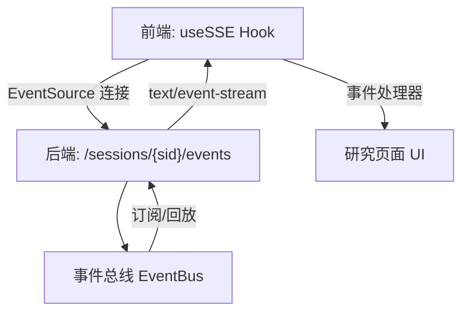
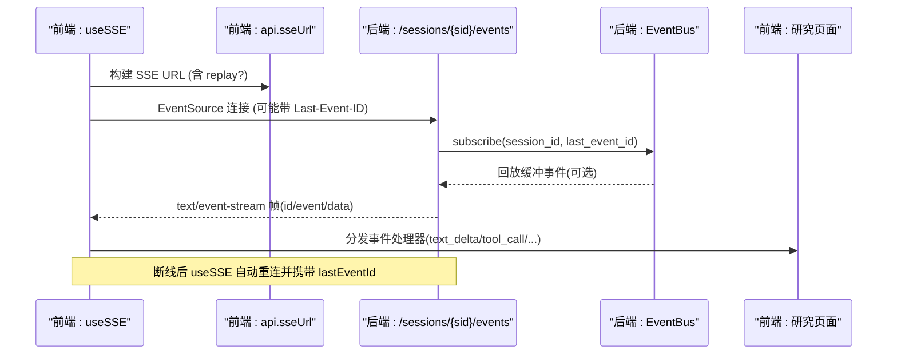
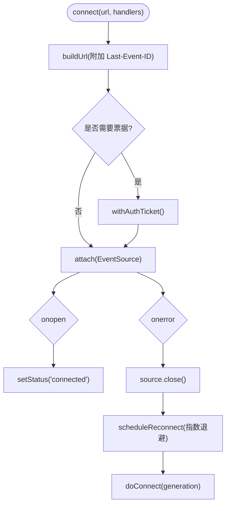
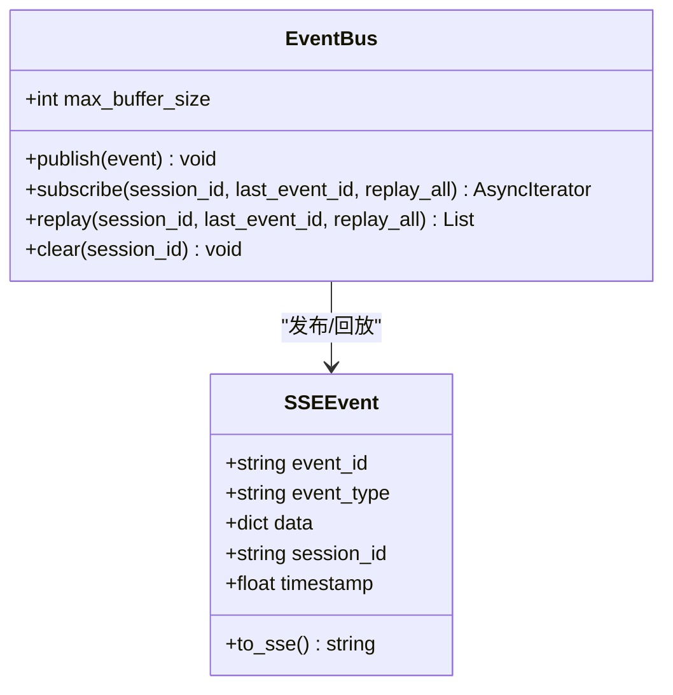
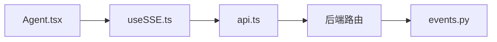

# SSE通信机制

<cite>
**本文引用的文件**
- [frontend/src/hooks/useSSE.ts](file://frontend/src/hooks/useSSE.ts)
- [frontend/src/lib/api.ts](file://frontend/src/lib/api.ts)
- [frontend/src/pages/Agent.tsx](file://frontend/src/pages/Agent.tsx)
- [agent/src/session/events.py](file://agent/src/session/events.py)
- [agent/src/api/swarm_routes.py](file://agent/src/api/swarm_routes.py)
- [agent/src/channels/signal.py](file://agent/src/channels/signal.py)
</cite>

## 目录
1. [简介](#简介)
2. [项目结构](#项目结构)
3. [核心组件](#核心组件)
4. [架构总览](#架构总览)
5. [详细组件分析](#详细组件分析)
6. [依赖关系分析](#依赖关系分析)
7. [性能考量](#性能考量)
8. [故障排查指南](#故障排查指南)
9. [结论](#结论)
10. [附录](#附录)

## 简介
本文件面向 Vibe-Trading 研究页面的 Server-Sent Events（SSE）通信机制，覆盖连接建立、事件监听、自动重连、消息流处理、错误恢复、连接状态管理、事件类型与数据格式规范、性能优化技巧、连接池与内存泄漏防护、调试工具使用以及常见问题排查。文档以代码为依据，提供可追溯的源码路径与图示，帮助读者从前端到后端完整理解 SSE 的工作方式。

## 项目结构
研究页面通过前端 Hook 建立并维护 SSE 连接，订阅会话事件流；后端基于事件总线将业务事件序列化为 SSE 帧并通过 HTTP 流式响应推送给客户端。关键路径：
- 前端：useSSE Hook 负责 EventSource 生命周期、自动重连、去重、Last-Event-ID 续传、认证票据注入。
- 前端 API：提供会话 SSE URL 构造方法，支持 replay 参数用于活跃运行恢复。
- 前端页面：注册具体事件处理器，驱动 UI 状态更新。
- 后端事件总线：封装 SSEEvent 序列化、按会话缓冲、订阅者队列、心跳与回放能力。
- 后端路由：示例展示如何生成 SSE 文本帧并持续推送，直至任务结束或断开。

图表来源
- [frontend/src/hooks/useSSE.ts:27-194](file://frontend/src/hooks/useSSE.ts#L27-L194)
- [frontend/src/lib/api.ts:181-188](file://frontend/src/lib/api.ts#L181-L188)
- [agent/src/session/events.py:20-54](file://agent/src/session/events.py#L20-L54)
- [agent/src/api/swarm_routes.py:187-211](file://agent/src/api/swarm_routes.py#L187-L211)

章节来源
- [frontend/src/hooks/useSSE.ts:27-194](file://frontend/src/hooks/useSSE.ts#L27-L194)
- [frontend/src/lib/api.ts:181-188](file://frontend/src/lib/api.ts#L181-L188)
- [agent/src/session/events.py:20-54](file://agent/src/session/events.py#L20-L54)
- [agent/src/api/swarm_routes.py:187-211](file://agent/src/api/swarm_routes.py#L187-L211)

## 核心组件
- 前端 useSSE Hook
  - 自动重连：指数退避、最大重试间隔、重试计数重置。
  - Last-Event-ID 续传：记录 lastEventId，重连时附加查询参数。
  - LRU 去重：维护已见事件 ID 集合，避免重复渲染。
  - 认证票据：在需要时通过 withAuthTicket 获取一次性票据并拼接至 URL。
  - 状态机：disconnected/connected/reconnecting，暴露 onStatusChange。
- 前端 API 层
  - sseUrl：构造 /sessions/{sid}/events 基础 URL，支持 replay=active 用于活跃运行恢复。
- 前端页面 Agent.tsx
  - 注册事件处理器：text_delta、reasoning_delta、stream_reset、thinking_done、tool_call、tool_result、tool_heartbeat、tool_progress、compact、attempt.*、message.received 等。
  - 驱动 UI：设置活动状态、追加流式文本、更新工具调用进度、滚动到底部等。
- 后端事件总线 events.py
  - SSEEvent：包含 event_id、event_type、data、session_id、timestamp，并提供 to_sse 序列化。
  - EventBus：按 session 维护缓冲与订阅者队列，支持 publish/subscribe/replay/clear，内置心跳与超时保护。
- 后端路由示例 swarm_routes.py
  - 演示如何读取历史事件并按索引递增输出 id/event/data 帧，直到任务完成或断开。

章节来源
- [frontend/src/hooks/useSSE.ts:27-194](file://frontend/src/hooks/useSSE.ts#L27-L194)
- [frontend/src/lib/api.ts:181-188](file://frontend/src/lib/api.ts#L181-L188)
- [frontend/src/pages/Agent.tsx:679-839](file://frontend/src/pages/Agent.tsx#L679-L839)
- [agent/src/session/events.py:20-54](file://agent/src/session/events.py#L20-L54)
- [agent/src/session/events.py:57-240](file://agent/src/session/events.py#L57-L240)
- [agent/src/api/swarm_routes.py:187-211](file://agent/src/api/swarm_routes.py#L187-L211)

## 架构总览
下图展示了从前端连接到后端事件总线，再到事件回放的端到端流程。

图表来源
- [frontend/src/hooks/useSSE.ts:63-156](file://frontend/src/hooks/useSSE.ts#L63-L156)
- [frontend/src/lib/api.ts:181-188](file://frontend/src/lib/api.ts#L181-L188)
- [agent/src/session/events.py:127-240](file://agent/src/session/events.py#L127-L240)
- [agent/src/api/swarm_routes.py:187-211](file://agent/src/api/swarm_routes.py#L187-L211)

## 详细组件分析

### 前端：useSSE Hook
- 连接建立
  - 使用浏览器原生 EventSource 建立 SSE 连接。
  - 若存在 lastEventId，则附加为查询参数实现续传。
  - 当配置了 API Key 时，先通过 withAuthTicket 获取一次性票据再连接。
- 事件监听
  - 仅订阅后端实际发送的事件类型，减少无关回调开销。
  - 解析 data 为 JSON，转发到对应处理器。
- 自动重连
  - 指数退避：initialRetryMs * backoffFactor^(attempt-1)，上限 maxRetryMs。
  - 重连前关闭旧连接，清理定时器与状态。
- 去重与续传
  - LRU 集合维护最近 N 个事件 ID，避免重复处理。
  - 记录 lastEventId，重连时由后端根据该 ID 回放缺失事件。
- 状态管理
  - 暴露 connected/reconnecting/disconnected 状态及变更回调。

图表来源
- [frontend/src/hooks/useSSE.ts:63-174](file://frontend/src/hooks/useSSE.ts#L63-L174)

章节来源
- [frontend/src/hooks/useSSE.ts:27-194](file://frontend/src/hooks/useSSE.ts#L27-L194)

### 前端：API 层与会话 URL
- sseUrl：返回 /sessions/{sid}/events，支持 replay=active 用于活跃运行恢复。
- 注释明确：SSE 票据每次连接/重连单独签发，不应缓存到 URL 中。

章节来源
- [frontend/src/lib/api.ts:181-188](file://frontend/src/lib/api.ts#L181-L188)

### 前端：研究页面事件处理
- 注册处理器：text_delta、reasoning_delta、stream_reset、thinking_done、tool_call、tool_result、tool_heartbeat、tool_progress、compact、attempt.created/started/completed、message.received 等。
- 行为要点：
  - 识别当前活动（thinking/working/responding），维持 streaming 状态。
  - 对 tool_progress 进行合并与动画帧刷新，降低渲染压力。
  - 对 tool_result 清理待合并进度，更新工具调用状态。
  - 对 attempt.completed 执行后台完成同步与视图清理。

章节来源
- [frontend/src/pages/Agent.tsx:679-839](file://frontend/src/pages/Agent.tsx#L679-L839)

### 后端：事件总线与 SSE 帧
- SSEEvent.to_sse：按 SSE 规范输出 id/event/data 行，并以空行结尾。
- EventBus：
  - publish：线程安全地将事件加入会话缓冲与订阅队列，超出容量丢弃最旧事件。
  - subscribe：异步迭代器，支持回放 last_event_id 或全部缓冲；每 30 秒无事件发送 heartbeat。
  - replay：根据 last_event_id 定位并从其后开始回放，或在全量模式下从头回放。
  - clear：清理会话缓冲。

图表来源
- [agent/src/session/events.py:20-54](file://agent/src/session/events.py#L20-L54)
- [agent/src/session/events.py:57-240](file://agent/src/session/events.py#L57-L240)

章节来源
- [agent/src/session/events.py:20-54](file://agent/src/session/events.py#L20-L54)
- [agent/src/session/events.py:57-240](file://agent/src/session/events.py#L57-L240)

### 后端：SSE 路由示例
- 读取历史事件并按索引递增输出 id/event/data 帧。
- 检测断开与任务状态，完成后发送 done 帧并关闭流。
- 兼容浏览器 Last-Event-ID 重连机制。

章节来源
- [agent/src/api/swarm_routes.py:187-211](file://agent/src/api/swarm_routes.py#L187-L211)

### 其他 SSE 消费者示例（Signal 通道）
- 使用 httpx stream 消费 /api/v1/events，逐行解析 SSE 帧，累积 data 行并在空行时解析 JSON 并处理。
- 异常与取消处理完善，支持重连与资源释放。

章节来源
- [agent/src/channels/signal.py:486-673](file://agent/src/channels/signal.py#L486-L673)

## 依赖关系分析
- 前端依赖
  - useSSE Hook 依赖 api.ts 提供的 sseUrl 与 withAuthTicket。
  - Agent.tsx 依赖 useSSE 的 connect/disconnect/status 能力，并注册事件处理器。
- 后端依赖
  - 路由层依赖事件总线 EventBus 进行事件回放与实时推送。
  - EventBus 依赖 asyncio.Queue 与线程锁保证并发安全。

图表来源
- [frontend/src/pages/Agent.tsx:679-839](file://frontend/src/pages/Agent.tsx#L679-L839)
- [frontend/src/hooks/useSSE.ts:27-194](file://frontend/src/hooks/useSSE.ts#L27-L194)
- [frontend/src/lib/api.ts:181-188](file://frontend/src/lib/api.ts#L181-L188)
- [agent/src/api/swarm_routes.py:187-211](file://agent/src/api/swarm_routes.py#L187-L211)
- [agent/src/session/events.py:57-240](file://agent/src/session/events.py#L57-L240)

章节来源
- [frontend/src/pages/Agent.tsx:679-839](file://frontend/src/pages/Agent.tsx#L679-L839)
- [frontend/src/hooks/useSSE.ts:27-194](file://frontend/src/hooks/useSSE.ts#L27-L194)
- [frontend/src/lib/api.ts:181-188](file://frontend/src/lib/api.ts#L181-L188)
- [agent/src/api/swarm_routes.py:187-211](file://agent/src/api/swarm_routes.py#L187-L211)
- [agent/src/session/events.py:57-240](file://agent/src/session/events.py#L57-L240)

## 性能考量
- 前端
  - 事件去重：LRU 集合限制大小，避免重复渲染与内存增长。
  - 进度合并：tool_progress 使用 requestAnimationFrame 批量更新，降低 UI 抖动。
  - 最小化订阅：仅注册已知事件类型，减少不必要回调。
  - 重连退避：指数退避避免雪崩重连。
- 后端
  - 缓冲上限：每会话固定缓冲大小，防止内存无限增长。
  - 心跳保活：30 秒无事件发送 heartbeat，便于前端检测长连接存活。
  - 线程安全：通过事件循环 call_soon_threadsafe 避免跨线程直接操作队列。
  - 流式输出：路由层按需 yield 事件，避免整批加载。

[本节为通用指导，不直接分析具体文件]

## 故障排查指南
- 连接无法建立
  - 检查 URL 是否正确（/sessions/{sid}/events），是否携带必要参数（如 replay）。
  - 确认是否需要一次性票据（withAuthTicket），并确保网络可达。
  - 参考：[frontend/src/lib/api.ts:181-188](file://frontend/src/lib/api.ts#L181-L188)、[frontend/src/hooks/useSSE.ts:136-156](file://frontend/src/hooks/useSSE.ts#L136-L156)
- 频繁重连
  - 观察重连延迟与次数，确认是否存在网络抖动或服务端过载。
  - 检查 lastEventId 是否正确传递，避免服务端重复回放导致负载上升。
  - 参考：[frontend/src/hooks/useSSE.ts:158-174](file://frontend/src/hooks/useSSE.ts#L158-L174)
- 事件丢失或重复
  - 确认后端是否按顺序输出 id 字段，且客户端正确记录 lastEventId。
  - 检查前端 LRU 去重容量是否过小导致误判重复。
  - 参考：[frontend/src/hooks/useSSE.ts:44-56](file://frontend/src/hooks/useSSE.ts#L44-L56)、[agent/src/session/events.py:151-183](file://agent/src/session/events.py#L151-L183)
- UI 不更新或卡顿
  - 检查事件处理器是否被正确注册，关注 tool_progress 合并逻辑。
  - 参考：[frontend/src/pages/Agent.tsx:757-784](file://frontend/src/pages/Agent.tsx#L757-L784)
- 后端缓冲溢出
  - 关注 EventBus 队列满时的丢弃日志，必要时调整 max_buffer_size 或提升消费速度。
  - 参考：[agent/src/session/events.py:114-126](file://agent/src/session/events.py#L114-L126)

章节来源
- [frontend/src/lib/api.ts:181-188](file://frontend/src/lib/api.ts#L181-L188)
- [frontend/src/hooks/useSSE.ts:44-56](file://frontend/src/hooks/useSSE.ts#L44-L56)
- [frontend/src/hooks/useSSE.ts:136-174](file://frontend/src/hooks/useSSE.ts#L136-L174)
- [frontend/src/pages/Agent.tsx:757-784](file://frontend/src/pages/Agent.tsx#L757-L784)
- [agent/src/session/events.py:114-126](file://agent/src/session/events.py#L114-L126)
- [agent/src/session/events.py:151-183](file://agent/src/session/events.py#L151-L183)

## 结论
Vibe-Trading 研究页面的 SSE 通信机制在前端通过 useSSE Hook 实现了健壮的连接管理、自动重连与事件去重；在后端通过事件总线统一封装事件序列化、缓冲与回放能力，配合路由层的流式输出，形成高可靠、低延迟的实时通信链路。结合心跳、缓冲上限与线程安全设计，系统具备良好的可扩展性与稳定性。建议在生产环境中监控重连频率、缓冲占用与事件吞吐，按需调优参数以获得最佳体验。

[本节为总结性内容，不直接分析具体文件]

## 附录

### SSE 事件类型定义（前端已知类型）
- 文本与推理：text_delta、reasoning_delta、stream_reset、thinking_done
- 工具调用：tool_call、tool_result、tool_heartbeat、tool_progress
- 会话与尝试：attempt.created、attempt.started、attempt.completed、attempt.failed、attempt.cancelled、message.received、session.created
- 目标与合规：goal.created、goal.evidence、goal.updated
- 指令与状态：mandate.proposal、mandate.committed、live.halted、live.resumed、live.action
- 通用：llm_usage、swarm.started、swarm.event、heartbeat、done

章节来源
- [frontend/src/hooks/useSSE.ts:85-96](file://frontend/src/hooks/useSSE.ts#L85-L96)

### 数据格式规范
- 事件帧遵循 SSE 规范：id、event、data 行，末尾空行分隔。
- data 字段为 JSON 对象，包含事件相关字段（如 delta、tail、tool、arguments、status 等）。
- 事件 ID 用于续传与去重，客户端记录 lastEventId 并在重连时附带。

章节来源
- [agent/src/session/events.py:38-54](file://agent/src/session/events.py#L38-L54)
- [agent/src/api/swarm_routes.py:187-211](file://agent/src/api/swarm_routes.py#L187-L211)

### 连接池管理与内存泄漏防护
- 连接池
  - 当前实现为每个会话一个 EventSource 实例，未显式连接池；可通过复用 Hook 实例与 generation 控制避免多实例。
- 内存泄漏防护
  - 重连时关闭旧 EventSource，清理定时器与引用。
  - LRU 去重集合限制大小，防止无限增长。
  - 后端缓冲上限与队列满丢弃策略，避免内存膨胀。
  - 订阅者在 finally 中移除，确保退出时释放资源。

章节来源
- [frontend/src/hooks/useSSE.ts:176-206](file://frontend/src/hooks/useSSE.ts#L176-L206)
- [frontend/src/hooks/useSSE.ts:44-56](file://frontend/src/hooks/useSSE.ts#L44-L56)
- [agent/src/session/events.py:226-240](file://agent/src/session/events.py#L226-L240)
- [agent/src/session/events.py:99-112](file://agent/src/session/events.py#L99-L112)

### 调试工具使用
- 前端
  - 浏览器开发者工具 Network 面板查看 SSE 流与 lastEventId。
  - 控制台打印 useSSE 状态变化回调，观察重连次数与延迟。
- 后端
  - 启用日志查看事件发布与回放过程，关注队列满警告。
  - 检查路由层输出帧是否符合 SSE 规范。

[本节为通用指导，不直接分析具体文件]