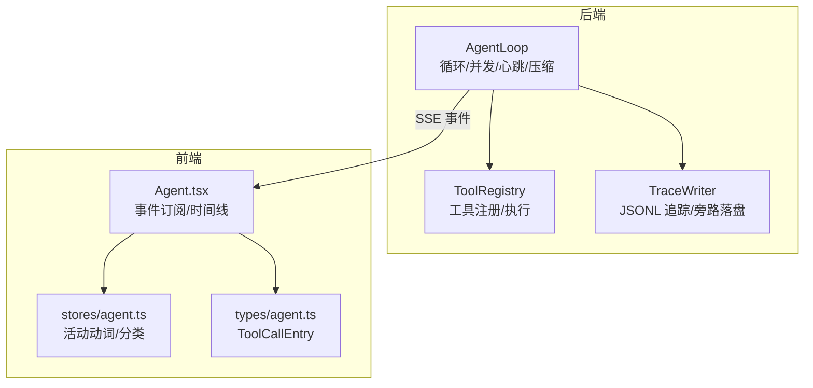
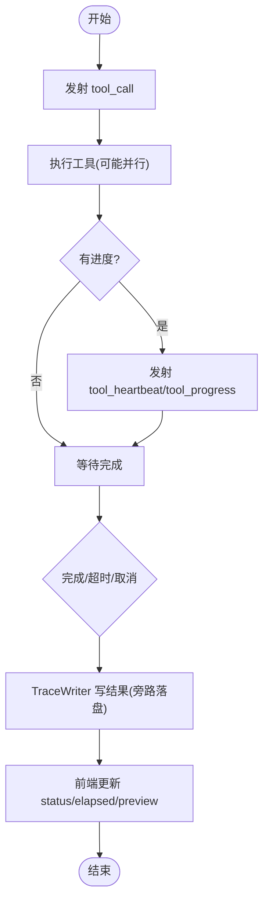
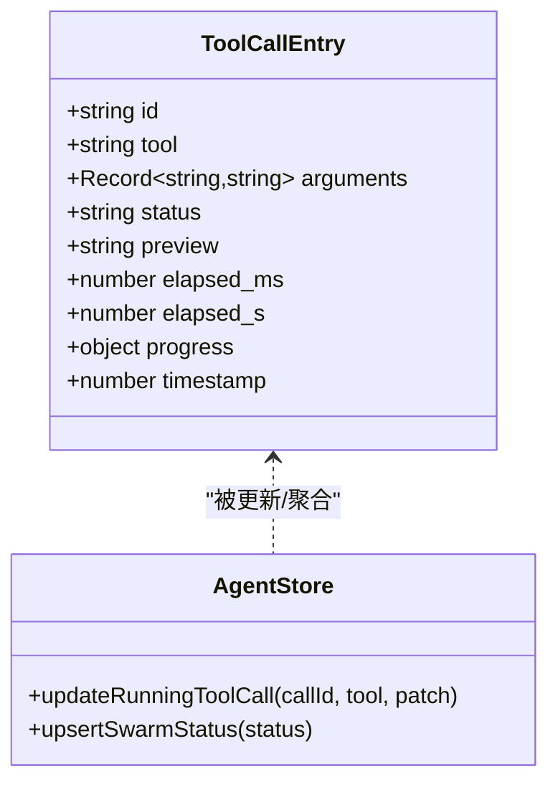
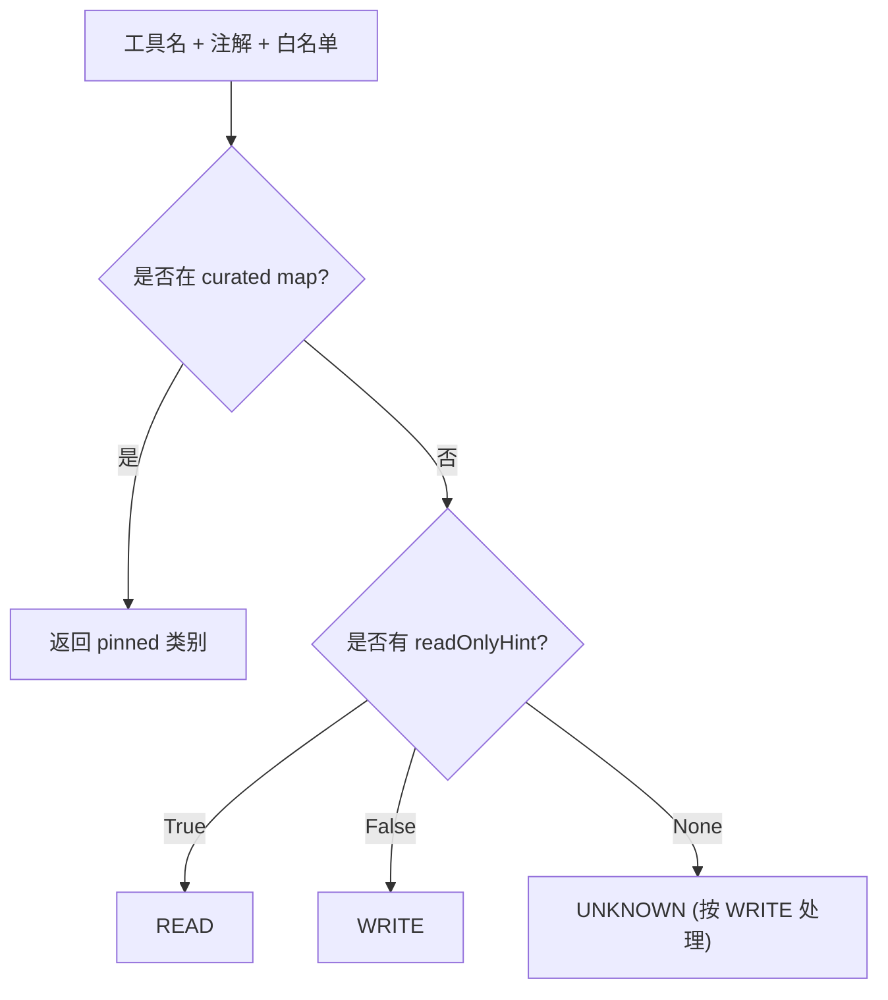
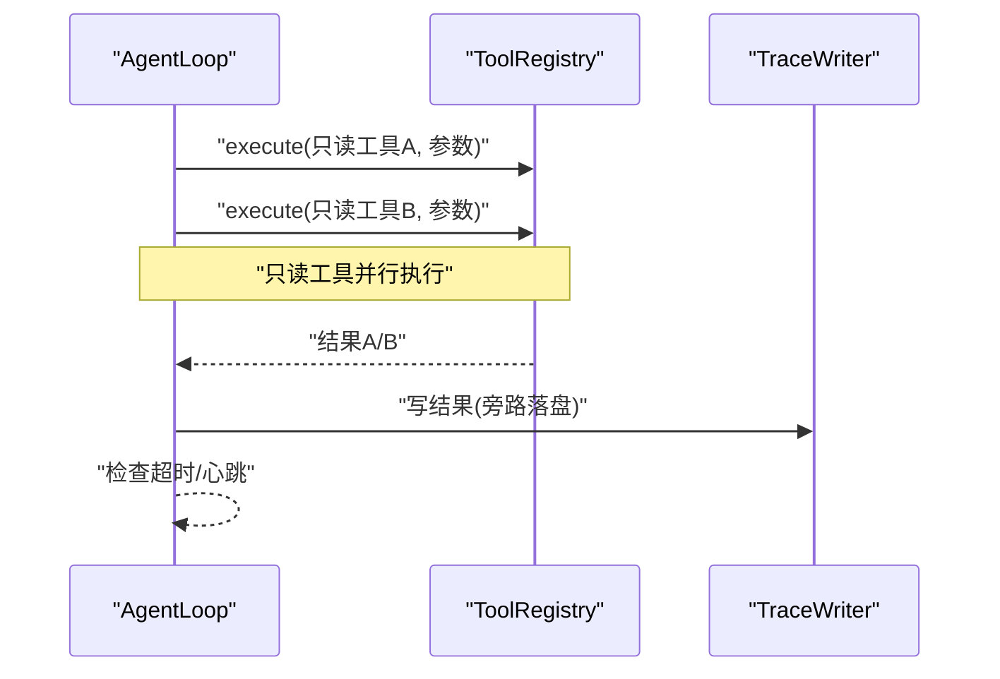
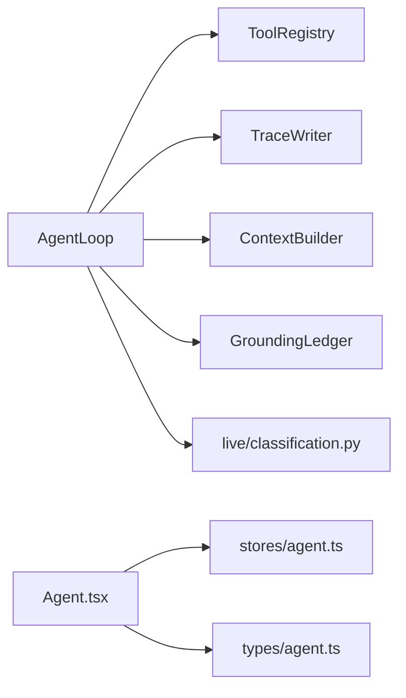

# 工具调用跟踪

<cite>
**本文引用的文件**
- [agent/src/agent/loop.py](file://agent/src/agent/loop.py)
- [agent/src/agent/tools.py](file://agent/src/agent/tools.py)
- [agent/src/agent/trace.py](file://agent/src/agent/trace.py)
- [agent/src/live/classification.py](file://agent/src/live/classification.py)
- [agent/cli/_legacy.py](file://agent/cli/_legacy.py)
- [agent/tests/test_tool_timeout.py](file://agent/tests/test_tool_timeout.py)
- [frontend/src/pages/Agent.tsx](file://frontend/src/pages/Agent.tsx)
- [frontend/src/stores/agent.ts](file://frontend/src/stores/agent.ts)
- [frontend/src/types/agent.ts](file://frontend/src/types/agent.ts)
</cite>

## 目录
1. [简介](#简介)
2. [项目结构](#项目结构)
3. [核心组件](#核心组件)
4. [架构总览](#架构总览)
5. [详细组件分析](#详细组件分析)
6. [依赖关系分析](#依赖关系分析)
7. [性能考量](#性能考量)
8. [故障排查指南](#故障排查指南)
9. [结论](#结论)
10. [附录](#附录)

## 简介
本文件面向 Vibe-Trading 研究页面的“工具调用跟踪系统”，系统性说明工具调用的生命周期管理、执行状态跟踪、结果聚合机制，以及活动动词推导、工具分类逻辑、时间线展示逻辑。同时覆盖去重、并发控制、超时处理、性能监控、错误诊断与日志分析方法，并给出自定义工具集成与扩展的最佳实践。

## 项目结构
围绕工具调用跟踪的关键代码分布在后端 AgentLoop、工具注册与追踪写入、前端事件消费与状态存储等模块：
- 后端循环与执行：AgentLoop 负责 ReAct 主循环、工具批处理、心跳与进度事件、上下文压缩、运行清单与使用量统计。
- 工具基础设施：BaseTool/ToolRegistry 提供工具抽象与统一执行入口，保证返回 JSON 且捕获异常。
- 追踪持久化：TraceWriter 以 JSONL 形式记录 trace，支持大字段旁路落盘与原子替换，确保崩溃安全。
- 前端流式渲染：Agent.tsx 订阅 tool_call/tool_progress/tool_heartbeat/tool_result 等事件，维护运行中工具调用与进度；stores/agent.ts 负责活动动词推导与分类；types/agent.ts 定义 ToolCallEntry 数据结构。



**图表来源**
- [agent/src/agent/loop.py:502-800](file://agent/src/agent/loop.py#L502-L800)
- [agent/src/agent/tools.py:13-95](file://agent/src/agent/tools.py#L13-L95)
- [agent/src/agent/trace.py:64-180](file://agent/src/agent/trace.py#L64-L180)
- [frontend/src/pages/Agent.tsx:722-786](file://frontend/src/pages/Agent.tsx#L722-L786)
- [frontend/src/stores/agent.ts:1-34](file://frontend/src/stores/agent.ts#L1-L34)
- [frontend/src/types/agent.ts:60-81](file://frontend/src/types/agent.ts#L60-L81)

**章节来源**
- [agent/src/agent/loop.py:502-800](file://agent/src/agent/loop.py#L502-L800)
- [agent/src/agent/tools.py:13-95](file://agent/src/agent/tools.py#L13-L95)
- [agent/src/agent/trace.py:64-180](file://agent/src/agent/trace.py#L64-L180)
- [frontend/src/pages/Agent.tsx:722-786](file://frontend/src/pages/Agent.tsx#L722-L786)
- [frontend/src/stores/agent.ts:1-34](file://frontend/src/stores/agent.ts#L1-L34)
- [frontend/src/types/agent.ts:60-81](file://frontend/src/types/agent.ts#L60-L81)

## 核心组件
- AgentLoop（ReAct 主循环）
  - 负责迭代控制、上下文压缩、工具调用批处理（只读并行）、心跳与进度事件发射、LLM 使用量汇总、运行清单写入。
- ToolRegistry（工具注册与执行）
  - 统一工具发现与执行，保证返回值是合法 JSON，异常被捕获并包装为错误信封。
- TraceWriter（追踪写入器）
  - 每行一条 JSON 记录，支持大文本/结果旁路落盘，原子写入与 fsync，保障崩溃后仍可恢复完整追踪。
- 前端事件处理器（Agent.tsx）
  - 订阅 tool_call/tool_progress/tool_heartbeat/tool_result 等事件，维护 running 工具调用集合、进度合并与刷新、时间线构建。
- 活动动词与分类（stores/agent.ts）
  - 根据工具名匹配规则推导 ActivityVerb（如 readingMarketData/writingStrategy/runningBacktest），驱动 UI 文案与状态。

**章节来源**
- [agent/src/agent/loop.py:502-800](file://agent/src/agent/loop.py#L502-L800)
- [agent/src/agent/tools.py:13-95](file://agent/src/agent/tools.py#L13-L95)
- [agent/src/agent/trace.py:64-180](file://agent/src/agent/trace.py#L64-L180)
- [frontend/src/pages/Agent.tsx:722-786](file://frontend/src/pages/Agent.tsx#L722-L786)
- [frontend/src/stores/agent.ts:1-34](file://frontend/src/stores/agent.ts#L1-L34)

## 架构总览
下图展示了从 LLM 到工具执行、事件回传、前端渲染的端到端流程，包括心跳、进度与结果聚合。

```mermaid
sequenceDiagram
participant LLM as "LLM"
participant Loop as "AgentLoop"
participant Reg as "ToolRegistry"
participant Tr as "TraceWriter"
participant FE as "前端 Agent.tsx"
LLM->>Loop : "请求工具调用"
Loop->>Reg : "execute(name, params)"
Reg-->>Loop : "JSON 结果或错误"
Loop->>Tr : "write_tool_result(...)"
Loop->>FE : "tool_call / tool_progress / tool_heartbeat / tool_result"
FE->>FE : "更新运行中调用/进度/时间线"
```

**图表来源**
- [agent/src/agent/loop.py:502-800](file://agent/src/agent/loop.py#L502-L800)
- [agent/src/agent/tools.py:72-84](file://agent/src/agent/tools.py#L72-L84)
- [agent/src/agent/trace.py:142-179](file://agent/src/agent/trace.py#L142-L179)
- [frontend/src/pages/Agent.tsx:722-786](file://frontend/src/pages/Agent.tsx#L722-L786)

## 详细组件分析

### 工具调用生命周期管理
- 开始：AgentLoop 在收到 LLM 的工具调用后，构造 call_id，发射 tool_call 事件，并在前端建立 running 条目。
- 执行：ToolRegistry.execute 调用具体工具实现，捕获异常并返回标准错误信封；AgentLoop 对只读工具进行线程级并行批处理。
- 进度与心跳：AgentLoop 周期性发射 tool_progress（stage/message/current/total）与 tool_heartbeat（elapsed_s），用于长耗时任务保持连接与显示进度。
- 完成：工具完成后，TraceWriter.write_tool_result 持久化结果（大结果旁路落盘），前端接收 tool_result 并关闭 running 条目，更新 elapsed_ms/status/preview。



**图表来源**
- [agent/src/agent/loop.py:502-800](file://agent/src/agent/loop.py#L502-L800)
- [agent/src/agent/trace.py:142-179](file://agent/src/agent/trace.py#L142-L179)
- [frontend/src/pages/Agent.tsx:722-786](file://frontend/src/pages/Agent.tsx#L722-L786)

**章节来源**
- [agent/src/agent/loop.py:502-800](file://agent/src/agent/loop.py#L502-L800)
- [agent/src/agent/tools.py:72-84](file://agent/src/agent/tools.py#L72-L84)
- [agent/src/agent/trace.py:142-179](file://agent/src/agent/trace.py#L142-L179)
- [frontend/src/pages/Agent.tsx:722-786](file://frontend/src/pages/Agent.tsx#L722-L786)

### 执行状态跟踪与结果聚合
- 后端状态：
  - 通过 event_callback 向外部（SSE/CLI）推送 tool_call/tool_progress/tool_heartbeat/tool_result。
  - 使用 TraceWriter 将 tool_result 持久化，大字段按阈值旁路落盘，保留 preview 与 size 元信息。
- 前端聚合：
  - 使用 pendingProgressRef 对同一次调用的多次 progress 进行合并，按 requestAnimationFrame 批量刷新，避免抖动。
  - tool_result 到达时清理 pending 进度，更新 running 工具的状态、预览与耗时。
  - 对 run_swarm 等特殊工具，基于 preview 解析 swarm 状态并插入独立卡片。



**图表来源**
- [frontend/src/types/agent.ts:60-81](file://frontend/src/types/agent.ts#L60-L81)
- [frontend/src/pages/Agent.tsx:722-786](file://frontend/src/pages/Agent.tsx#L722-L786)

**章节来源**
- [agent/src/agent/trace.py:142-179](file://agent/src/agent/trace.py#L142-L179)
- [frontend/src/pages/Agent.tsx:722-786](file://frontend/src/pages/Agent.tsx#L722-L786)
- [frontend/src/types/agent.ts:60-81](file://frontend/src/types/agent.ts#L60-L81)

### 活动动词推导算法
- 规则：根据工具名正则匹配推导 ActivityVerb，例如：
  - readingMarketData：匹配 market_data/search/read/fetch/ticker/quote/candle/orderbook/funding/open_interest/financial/filing/news/profile/screener/fred/iwencai/fund_flow/dragon/northbound/margin/block_trade/shareholder/lockup/sector/research/options_chain 等。
  - writingStrategy：匹配 write/edit/patch/strategy/signal/scaffold/generate。
  - runningBacktest：匹配 backtest。
  - validatingNumbers：匹配 validate/validation/monte_carlo/bootstrap/walk_forward/stress_test/sanity_check。
  - working：兜底。
- 作用：驱动 UI 的活动文案与状态切换，提升用户感知。

**章节来源**
- [frontend/src/stores/agent.ts:1-34](file://frontend/src/stores/agent.ts#L1-L34)

### 工具分类逻辑
- 三级优先级判定 READ/WRITE/UNKNOWN：
  - Tier 2（优先）：按 broker 提供的 curated map 固定映射。
  - Tier 1：若存在 readOnlyHint，True→READ，False→WRITE。
  - Tier 3：默认拒绝（UNKNOWN），下游按 WRITE 处理（门控）。
- 该逻辑用于远程 MCP 工具的安全分级，防止未知工具被误判为只读。



**图表来源**
- [agent/src/live/classification.py:52-89](file://agent/src/live/classification.py#L52-L89)

**章节来源**
- [agent/src/live/classification.py:52-89](file://agent/src/live/classification.py#L52-L89)

### 时间线展示逻辑
- 历史回放：Agent.tsx 在回放消息时，根据 assistant 消息中的 tool_trail 构建工具时间线，设置状态（done/failed/stopped）与 endedAt。
- 实时流：tool_call 创建 running 条目；tool_progress 合并更新；tool_heartbeat 延长活跃；tool_result 收尾并生成最终预览。
- 特殊工具：run_swarm 的结果预览可解析为 swarm 状态，插入独立卡片。

**章节来源**
- [frontend/src/pages/Agent.tsx:530-562](file://frontend/src/pages/Agent.tsx#L530-L562)
- [frontend/src/pages/Agent.tsx:722-786](file://frontend/src/pages/Agent.tsx#L722-L786)

### 去重、并发控制与超时处理
- 去重：
  - 前端对同一 callId 的进度进行合并（pendingProgressRef），避免重复渲染。
  - 后端 ToolRegistry 以 name 为键注册工具，避免重复注册。
- 并发控制：
  - AgentLoop 对连续只读工具进行线程级并行批处理，加速数据读取类任务。
- 超时处理：
  - 通过 _tool_timeout_seconds() 配置超时；测试验证超时会返回错误并停止心跳，同时发出 timeout 进度事件。
  - 对于写工具，即使超时也会等待副作用完成，仅发出 warning 而不提前返回失败，避免重复提交。



**图表来源**
- [agent/src/agent/loop.py:502-800](file://agent/src/agent/loop.py#L502-L800)
- [agent/tests/test_tool_timeout.py:42-99](file://agent/tests/test_tool_timeout.py#L42-L99)

**章节来源**
- [agent/src/agent/loop.py:502-800](file://agent/src/agent/loop.py#L502-L800)
- [agent/tests/test_tool_timeout.py:42-99](file://agent/tests/test_tool_timeout.py#L42-L99)

### 性能监控与日志分析
- 性能指标：
  - LLM 使用量：每次迭代累积 input_tokens/output_tokens/total_tokens/calls，并写入 per_iteration 列表与 totals。
  - 工具耗时：tool_result 包含 elapsed_ms，前端据此计算与展示。
- 日志方法：
  - TraceWriter 以 JSONL 记录 start/message/tool_result 等，大字段旁路落盘，支持 read(resolve_offloads=true) 还原。
  - CLI 路径对 tool_call/tool_result 进行精简输出，便于快速定位问题。

**章节来源**
- [agent/src/agent/loop.py:156-205](file://agent/src/agent/loop.py#L156-L205)
- [agent/src/agent/trace.py:302-370](file://agent/src/agent/trace.py#L302-L370)
- [agent/cli/_legacy.py:593-689](file://agent/cli/_legacy.py#L593-L689)

## 依赖关系分析
- AgentLoop 依赖：
  - ToolRegistry（工具执行）、TraceWriter（追踪）、ContextBuilder（上下文）、GroundingLedger（落地校验）、BackgroundManager（后台任务通知）。
- 前端依赖：
  - Agent.tsx 依赖 stores/agent.ts 与 types/agent.ts，消费 SSE 事件并更新 UI。
- 分类与安全：
  - live/classification.py 提供工具读写分类，影响远程 MCP 工具的访问策略。



**图表来源**
- [agent/src/agent/loop.py:502-800](file://agent/src/agent/loop.py#L502-L800)
- [agent/src/agent/tools.py:13-95](file://agent/src/agent/tools.py#L13-L95)
- [agent/src/agent/trace.py:64-180](file://agent/src/agent/trace.py#L64-L180)
- [agent/src/live/classification.py:52-89](file://agent/src/live/classification.py#L52-L89)
- [frontend/src/pages/Agent.tsx:722-786](file://frontend/src/pages/Agent.tsx#L722-L786)
- [frontend/src/stores/agent.ts:1-34](file://frontend/src/stores/agent.ts#L1-L34)
- [frontend/src/types/agent.ts:60-81](file://frontend/src/types/agent.ts#L60-L81)

**章节来源**
- [agent/src/agent/loop.py:502-800](file://agent/src/agent/loop.py#L502-L800)
- [agent/src/agent/tools.py:13-95](file://agent/src/agent/tools.py#L13-L95)
- [agent/src/agent/trace.py:64-180](file://agent/src/agent/trace.py#L64-L180)
- [agent/src/live/classification.py:52-89](file://agent/src/live/classification.py#L52-L89)
- [frontend/src/pages/Agent.tsx:722-786](file://frontend/src/pages/Agent.tsx#L722-L786)
- [frontend/src/stores/agent.ts:1-34](file://frontend/src/stores/agent.ts#L1-L34)
- [frontend/src/types/agent.ts:60-81](file://frontend/src/types/agent.ts#L60-L81)

## 性能考量
- 上下文压缩：多层压缩（microcompact/context_collapse/auto_compact）降低 token 压力，避免频繁 LLM 调用。
- 只读工具并行：减少 I/O 等待，提高吞吐。
- 进度合并：前端按帧合并进度，降低渲染开销。
- 大结果旁路落盘：避免 trace.jsonl 膨胀，提升读取性能。
- 心跳节流：合理间隔的心跳维持长任务连接，避免过多事件。

[本节为通用指导，不直接分析具体文件]

## 故障排查指南
- 工具超时：
  - 现象：长时间无结果，心跳停止或出现 timeout 进度事件。
  - 排查：检查 TOOL_TIMEOUT_SECONDS 配置与工具实现是否阻塞；查看 tool_result 的 error_code 与 elapsed_ms。
- 写工具超时警告：
  - 现象：发出 timeout_warning 但结果仍为 ok。
  - 原因：写工具需等待副作用完成，避免重复提交；确认业务侧幂等性。
- 追踪缺失：
  - 现象：trace.jsonl 缺少某条记录或大字段为空。
  - 排查：检查 fsync 失败告警与 sidecar 文件是否存在；使用 resolve_offloads=true 读取还原。
- 前端状态不一致：
  - 现象：running 未关闭或进度不更新。
  - 排查：确认 tool_result 是否到达；检查 pendingProgressRef 合并逻辑与 requestAnimationFrame 刷新。

**章节来源**
- [agent/tests/test_tool_timeout.py:42-99](file://agent/tests/test_tool_timeout.py#L42-L99)
- [agent/src/agent/trace.py:286-300](file://agent/src/agent/trace.py#L286-L300)
- [frontend/src/pages/Agent.tsx:722-786](file://frontend/src/pages/Agent.tsx#L722-L786)

## 结论
Vibe-Trading 的工具调用跟踪系统通过 AgentLoop 的统一编排、ToolRegistry 的安全执行、TraceWriter 的可靠持久化，以及前端的流式聚合与时间线展示，实现了从调用到可视化的全链路闭环。结合活动动词推导与工具分类逻辑，系统在用户体验与安全合规之间取得平衡。建议在生产环境中关注超时配置、并行度与大结果落盘策略，并结合日志与追踪数据进行持续优化。

[本节为总结，不直接分析具体文件]

## 附录
- 自定义工具集成最佳实践
  - 继承 BaseTool 并实现 execute，返回 JSON 字符串；如需可重复调用，设置 repeatable=True。
  - 在 ToolRegistry 中注册工具，确保名称唯一；可通过 check_available 做依赖检查。
  - 对于远程 MCP 工具，遵循 live/classification.py 的分类规则，必要时在 curated map 中固定读写属性。
  - 在工具内部主动发射进度与心跳（通过 AgentLoop 的事件通道），以便前端展示阶段与进度。
  - 对大结果进行分片或分页，避免单次响应过大；必要时利用 TraceWriter 的旁路落盘能力。
  - 注意幂等性与写工具超时行为，确保副作用不会因超时而重复执行。

[本节为通用指导，不直接分析具体文件]