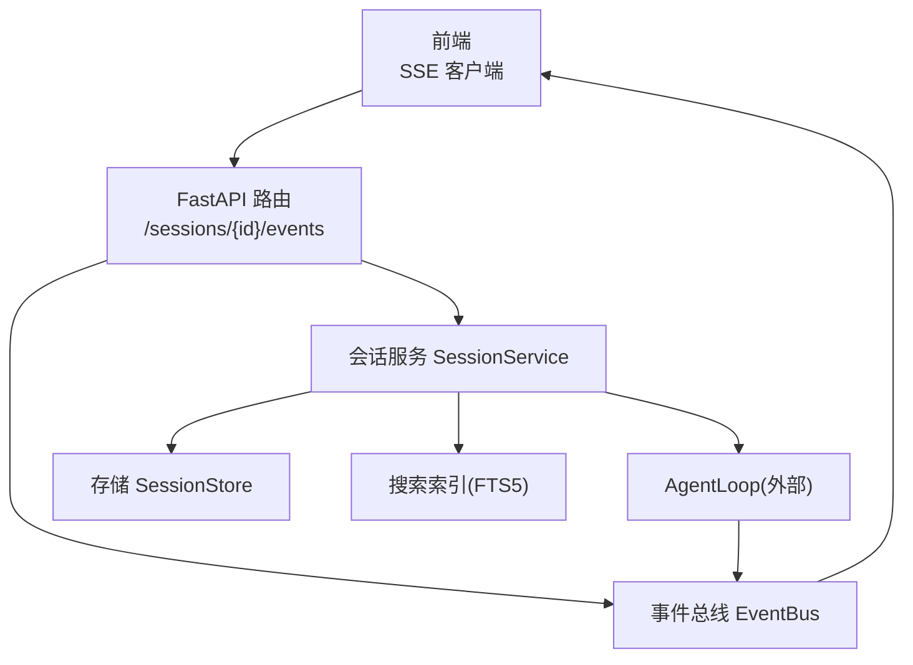
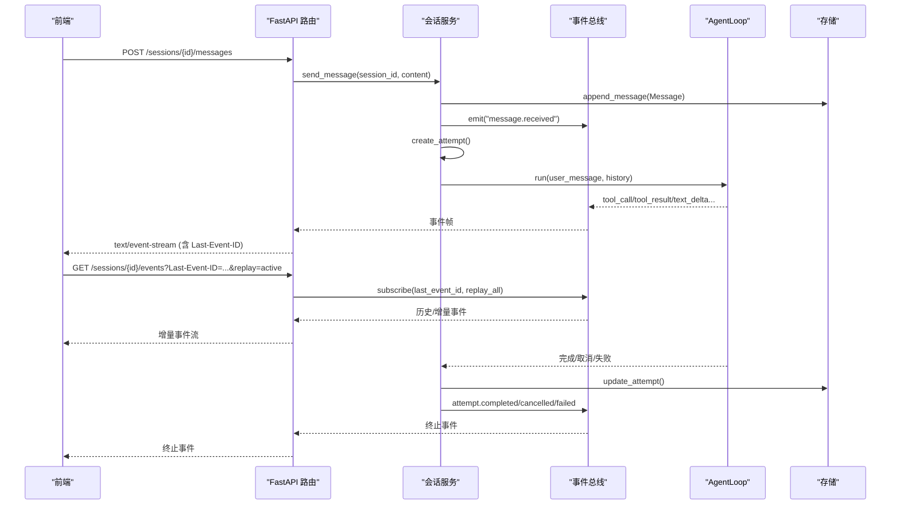
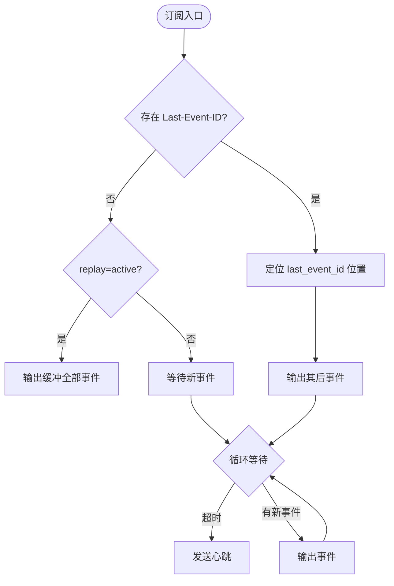
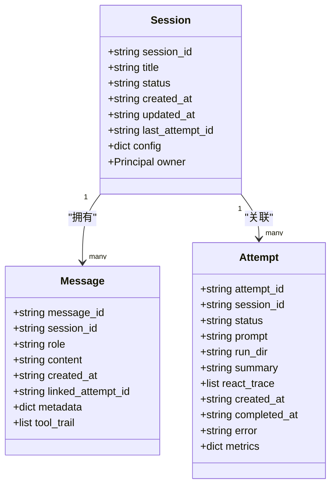
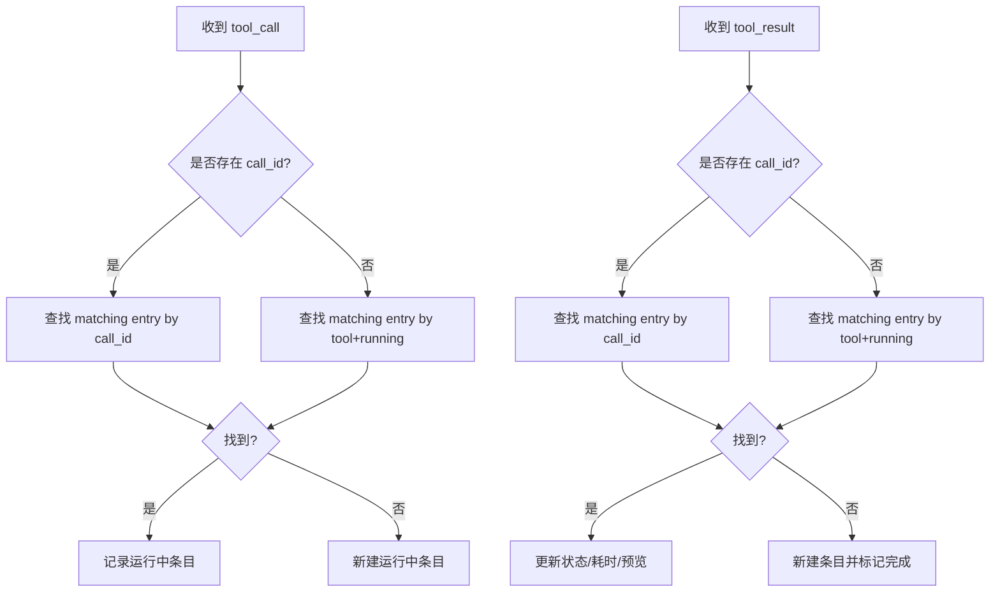
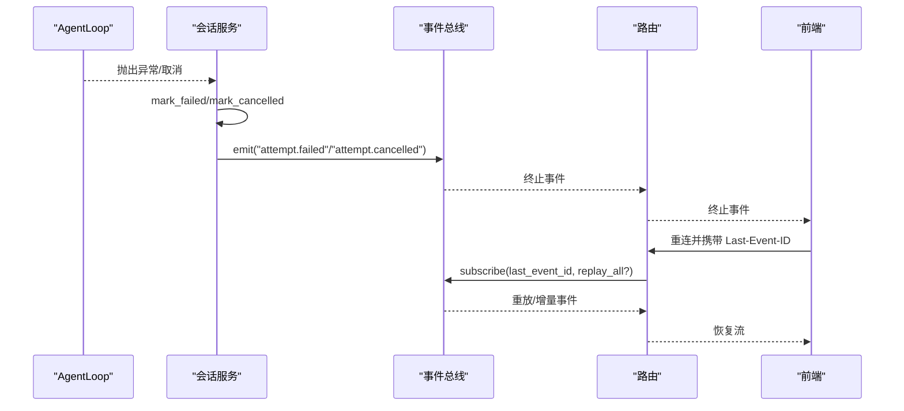
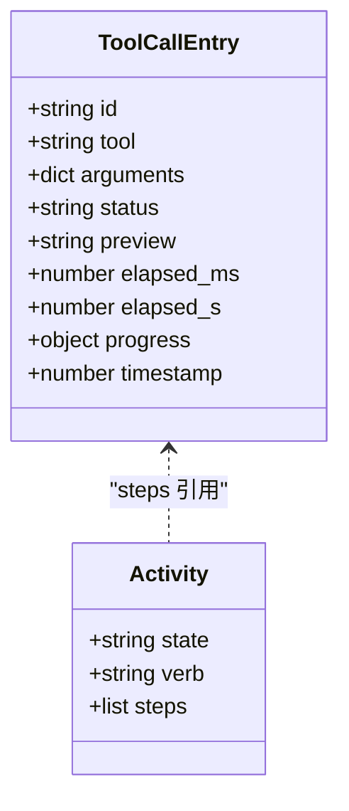
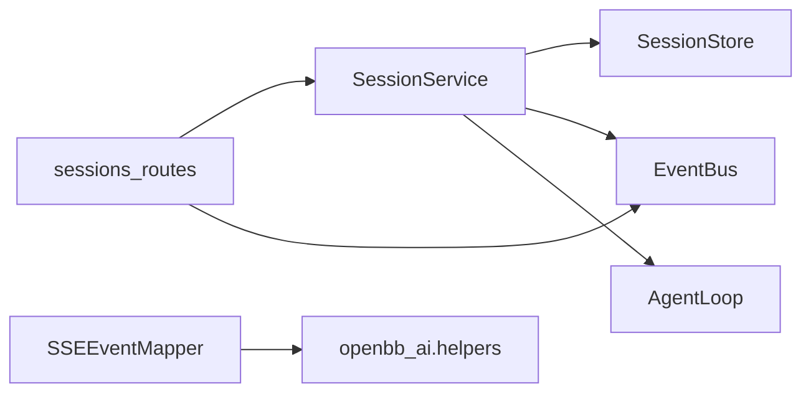

# 消息处理

<cite>
**本文引用的文件**
- [agent/src/session/events.py](file://agent/src/session/events.py)
- [agent/src/session/service.py](file://agent/src/session/service.py)
- [agent/src/session/store.py](file://agent/src/session/store.py)
- [agent/src/session/models.py](file://agent/src/session/models.py)
- [agent/src/api/sessions_routes.py](file://agent/src/api/sessions_routes.py)
- [agent/src/openbb_bridge/event_mapper.py](file://agent/src/openbb_bridge/event_mapper.py)
- [frontend/src/lib/api.ts](file://frontend/src/lib/api.ts)
- [frontend/src/types/agent.ts](file://frontend/src/types/agent.ts)
- [frontend/src/stores/__tests__/streaming_dom.test.ts](file://frontend/src/stores/__tests__/streaming_dom.test.ts)
- [frontend/src/components/chat/__tests__/ThinkingTimeline.test.tsx](file://frontend/src/components/chat/__tests__/ThinkingTimeline.test.tsx)
- [agent/cli/ui/rail.py](file://agent/cli/ui/rail.py)
</cite>

## 目录
1. [简介](#简介)
2. [项目结构](#项目结构)
3. [核心组件](#核心组件)
4. [架构总览](#架构总览)
5. [详细组件分析](#详细组件分析)
6. [依赖关系分析](#依赖关系分析)
7. [性能考虑](#性能考虑)
8. [故障排除指南](#故障排除指南)
9. [结论](#结论)
10. [附录](#附录)

## 简介
本文件面向 Vibe-Trading 研究页面的“消息处理系统”，聚焦以下目标：
- SSE 事件处理机制与增量恢复
- 消息状态管理与会话持久化策略
- 消息去重算法、增量更新机制、错误重试逻辑
- 工具调用跟踪、思维过程展示、活动状态管理
- 消息缓存策略、内存优化、性能监控
- 消息流调试工具与故障排除方法

该系统由后端事件总线、会话服务、存储层、API 路由以及前端 SSE 客户端共同组成，贯穿“用户消息 → Agent 执行 → 实时事件 → 前端渲染”的完整链路。

## 项目结构
围绕消息处理的关键路径如下：
- 事件总线：SSEEvent、EventBus（带缓冲、订阅、心跳、重放）
- 会话服务：SessionService（发送消息、创建尝试、运行 AgentLoop、终止事件）
- 存储层：SessionStore（JSONL 追加日志、会话/尝试 JSON 文件）
- API 路由：sessions_routes（REST + SSE 流）
- 事件映射：openbb_bridge.event_mapper（将内部事件转换为 Workspace SSE）
- 前端：api.ts（SSE URL）、类型定义与测试（工具调用、活动状态）

**图示来源**
- [agent/src/api/sessions_routes.py:752-800](file://agent/src/api/sessions_routes.py#L752-L800)
- [agent/src/session/events.py:57-240](file://agent/src/session/events.py#L57-L240)
- [agent/src/session/service.py:158-440](file://agent/src/session/service.py#L158-L440)
- [agent/src/session/store.py:16-259](file://agent/src/session/store.py#L16-L259)

**章节来源**
- [agent/src/api/sessions_routes.py:752-800](file://agent/src/api/sessions_routes.py#L752-L800)
- [agent/src/session/events.py:57-240](file://agent/src/session/events.py#L57-L240)
- [agent/src/session/service.py:158-440](file://agent/src/session/service.py#L158-L440)
- [agent/src/session/store.py:16-259](file://agent/src/session/store.py#L16-L259)

## 核心组件
- 事件总线 EventBus：线程安全发布/订阅，按 session_id 隔离；支持 last_event_id 重放与心跳保活；缓冲上限控制。
- 会话服务 SessionService：负责消息入队、尝试生命周期、后台运行 AgentLoop、汇总结果并广播终止事件；维护并发锁避免同一会话并行执行。
- 存储 SessionStore：会话 JSON、消息 JSONL 追加日志、尝试 JSON；读取时跳过损坏行，保证健壮性。
- API 路由 sessions_routes：提供 REST 接口与 SSE 流；支持 replay=active 对活跃尝试进行全量重放；透传 mandate.proposal/live.action 等扩展事件。
- 事件映射 SSEEventMapper：过滤高频进度事件，仅将文本片段、工具调用/结果、上下文压缩、MCP 警告等映射为 Workspace SSE。
- 前端：通过 /sessions/{id}/events?replay=active 建立 SSE 连接；维护工具调用列表与活动状态；在断连后基于 Last-Event-ID 增量恢复。

**章节来源**
- [agent/src/session/events.py:57-240](file://agent/src/session/events.py#L57-L240)
- [agent/src/session/service.py:53-440](file://agent/src/session/service.py#L53-L440)
- [agent/src/session/store.py:16-259](file://agent/src/session/store.py#L16-L259)
- [agent/src/api/sessions_routes.py:289-800](file://agent/src/api/sessions_routes.py#L289-L800)
- [agent/src/openbb_bridge/event_mapper.py:1-144](file://agent/src/openbb_bridge/event_mapper.py#L1-L144)
- [frontend/src/lib/api.ts:159-188](file://frontend/src/lib/api.ts#L159-L188)

## 架构总览
下图展示了从用户消息到前端渲染的端到端流程，包括事件重放、工具调用跟踪与最终结果聚合。

**图示来源**
- [agent/src/api/sessions_routes.py:697-800](file://agent/src/api/sessions_routes.py#L697-L800)
- [agent/src/session/service.py:158-440](file://agent/src/session/service.py#L158-L440)
- [agent/src/session/events.py:127-240](file://agent/src/session/events.py#L127-L240)

## 详细组件分析

### SSE 事件处理与增量恢复
- 事件模型：SSEEvent 包含 event_id、event_type、data、session_id、timestamp；to_sse() 输出标准 SSE 帧。
- 发布与订阅：EventBus.publish 线程安全写入缓冲与队列；subscribe 返回异步迭代器，支持 last_event_id 重放与心跳。
- 重放策略：
  - 首次连接且无 last_event_id：默认不重放历史（历史通过 REST 获取）。
  - replay=active 且当前尝试仍在运行：重放缓冲全部事件以补齐缺失。
  - 携带 last_event_id：从该 ID 之后开始回放。
- 心跳：每 30 秒未收到事件则发送 heartbeat，用于检测连接存活。

**图示来源**
- [agent/src/session/events.py:151-240](file://agent/src/session/events.py#L151-L240)
- [agent/src/api/sessions_routes.py:752-800](file://agent/src/api/sessions_routes.py#L752-L800)

**章节来源**
- [agent/src/session/events.py:20-240](file://agent/src/session/events.py#L20-L240)
- [agent/src/api/sessions_routes.py:752-800](file://agent/src/api/sessions_routes.py#L752-L800)

### 消息状态管理与会话持久化
- 消息模型：Message 包含 message_id、session_id、role、content、created_at、linked_attempt_id、metadata、tool_trail。
- 持久化策略：
  - 消息采用 JSONL 追加写，fsync 确保落盘。
  - 会话与尝试使用 JSON 文件，更新覆盖写。
  - 读取时跳过损坏行，避免单条损坏影响整体。
- 搜索索引：每次消息写入同步更新 FTS5 索引，支持跨会话全文检索。

**图示来源**
- [agent/src/session/models.py:140-342](file://agent/src/session/models.py#L140-L342)
- [agent/src/session/store.py:16-259](file://agent/src/session/store.py#L16-L259)

**章节来源**
- [agent/src/session/models.py:140-342](file://agent/src/session/models.py#L140-L342)
- [agent/src/session/store.py:16-259](file://agent/src/session/store.py#L16-L259)

### 消息去重算法与增量更新机制
- 事件级去重：SSEEvent 自带全局唯一 event_id；客户端可通过 Last-Event-ID 精确增量恢复，避免重复。
- 工具调用去重：
  - 后端 _record_tool_trail_event 根据 call_id 或 tool+status 匹配运行中的条目，合并 tool_result 到对应 tool_call。
  - 若无法匹配，则以最近一次 running 的 tool 作为归属，否则新建条目。
- 增量更新：
  - 前端通过 SSE 增量接收 text_delta、tool_call、tool_result 等事件，逐步构建 UI 状态。
  - 对于已完成的历史，通过 REST 拉取 messages 列表，结合 SSE 增量实现一致视图。

**图示来源**
- [agent/src/session/service.py:442-514](file://agent/src/session/service.py#L442-L514)

**章节来源**
- [agent/src/session/service.py:442-514](file://agent/src/session/service.py#L442-L514)

### 错误重试逻辑
- 事件映射层：SSEEventMapper.map 捕获异常并记录日志，返回空列表，确保映射错误不会中断 SSE 流。
- 会话服务：_run_attempt 统一捕获异常，标记 Attempt 为 failed，并广播 attempt.failed；取消场景标记 cancelled。
- 前端：SSE 客户端基于 Last-Event-ID 自动重连；当 replay=active 且当前尝试仍在运行时，服务端会重放缓冲事件以补齐缺失。

**图示来源**
- [agent/src/session/service.py:248-345](file://agent/src/session/service.py#L248-L345)
- [agent/src/openbb_bridge/event_mapper.py:138-144](file://agent/src/openbb_bridge/event_mapper.py#L138-L144)
- [agent/src/api/sessions_routes.py:752-800](file://agent/src/api/sessions_routes.py#L752-L800)

**章节来源**
- [agent/src/session/service.py:248-345](file://agent/src/session/service.py#L248-L345)
- [agent/src/openbb_bridge/event_mapper.py:138-144](file://agent/src/openbb_bridge/event_mapper.py#L138-L144)
- [agent/src/api/sessions_routes.py:752-800](file://agent/src/api/sessions_routes.py#L752-L800)

### 工具调用跟踪、思维过程展示、活动状态管理
- 工具调用跟踪：
  - 后端 _record_tool_trail_event 收集 tool_call/tool_result，生成 compact 的 tool_trail，随最终消息持久化。
  - 前端 types.ToolCallEntry 维护 id、tool、arguments、status、elapsed_ms、progress、timestamp 等字段。
- 思维过程展示：
  - openbb_bridge.event_mapper 将 reasoning_delta/thinking_done/tool_progress 等静默事件过滤，仅将必要的推理步骤与工具调用呈现给 Workspace。
  - CLI rail.py 将 tool_call/tool_progress 渲染为 ThinkingTimeline 的步骤与进度。
- 活动状态管理：
  - 前端 store 维护 activity.state（idle/working）、verb（如 runningBacktest）、steps 列表，并在工具完成时清理 streamingText 与状态。

**图示来源**
- [frontend/src/types/agent.ts:60-81](file://frontend/src/types/agent.ts#L60-L81)
- [agent/src/session/service.py:442-514](file://agent/src/session/service.py#L442-L514)
- [agent/src/openbb_bridge/event_mapper.py:24-144](file://agent/src/openbb_bridge/event_mapper.py#L24-L144)
- [agent/cli/ui/rail.py:345-380](file://agent/cli/ui/rail.py#L345-L380)
- [frontend/src/stores/__tests__/streaming_dom.test.ts:40-97](file://frontend/src/stores/__tests__/streaming_dom.test.ts#L40-L97)

**章节来源**
- [frontend/src/types/agent.ts:60-81](file://frontend/src/types/agent.ts#L60-L81)
- [agent/src/session/service.py:442-514](file://agent/src/session/service.py#L442-L514)
- [agent/src/openbb_bridge/event_mapper.py:24-144](file://agent/src/openbb_bridge/event_mapper.py#L24-L144)
- [agent/cli/ui/rail.py:345-380](file://agent/cli/ui/rail.py#L345-L380)
- [frontend/src/stores/__tests__/streaming_dom.test.ts:40-97](file://frontend/src/stores/__tests__/streaming_dom.test.ts#L40-L97)

### 消息缓存策略、内存优化、性能监控
- 事件缓冲：EventBus 每个 session_id 维护固定大小缓冲（默认 500），超出时截断尾部，防止内存无限增长。
- 队列容量：subscribe 使用 maxsize=200 的 asyncio.Queue，满时丢弃事件并记录告警，避免阻塞发布者。
- 历史裁剪：_convert_messages_to_history 按字符预算（约 12000 字符）裁剪历史，保留最新上下文，避免过长上下文导致性能下降。
- 指标加载：_load_metrics 从 run 目录读取 metrics.csv，仅在存在时附加到回复元数据，减少不必要 IO。
- 性能监控：
  - 终端事件包含 elapsed_ms 与运行时信息（provider/model/reasoning_effort 等），便于前端与日志分析。
  - 心跳事件用于连接健康检查。

**章节来源**
- [agent/src/session/events.py:67-125](file://agent/src/session/events.py#L67-L125)
- [agent/src/session/events.py:185-240](file://agent/src/session/events.py#L185-L240)
- [agent/src/session/service.py:516-581](file://agent/src/session/service.py#L516-L581)
- [agent/src/session/service.py:285-323](file://agent/src/session/service.py#L285-L323)

## 依赖关系分析
- 模块耦合：
  - sessions_routes 依赖 SessionService 与 EventBus，提供 HTTP/SSE 能力。
  - SessionService 依赖 SessionStore、搜索索引、AgentLoop（延迟导入），并通过 event_callback 将 Agent 事件转发至 EventBus。
  - EventBus 独立于业务，仅关注事件缓冲、订阅与重放。
- 外部依赖：
  - openbb_ai.helpers 用于生成 Workspace SSE 对象（message_chunk、reasoning_step）。
  - FastAPI StreamingResponse 用于 SSE 流式响应。
- 潜在循环依赖：
  - 通过延迟导入（from ... import ...）避免启动时循环依赖。

**图示来源**
- [agent/src/api/sessions_routes.py:289-800](file://agent/src/api/sessions_routes.py#L289-L800)
- [agent/src/session/service.py:346-440](file://agent/src/session/service.py#L346-L440)
- [agent/src/openbb_bridge/event_mapper.py:1-144](file://agent/src/openbb_bridge/event_mapper.py#L1-L144)

**章节来源**
- [agent/src/api/sessions_routes.py:289-800](file://agent/src/api/sessions_routes.py#L289-L800)
- [agent/src/session/service.py:346-440](file://agent/src/session/service.py#L346-L440)
- [agent/src/openbb_bridge/event_mapper.py:1-144](file://agent/src/openbb_bridge/event_mapper.py#L1-L144)

## 性能考虑
- 并发控制：SessionService 使用线程池（max_workers=4）执行工具注册与 Agent 运行，避免阻塞事件循环。
- 缓冲与丢弃：EventBus 缓冲上限与队列上限配合，保护系统在高吞吐下不被压垮；丢弃事件时记录告警。
- 历史裁剪：限制历史长度，降低 LLM 上下文成本与传输开销。
- 流式响应：SSE 流设置 no-cache、keep-alive、禁用代理缓冲，提升实时性。
- 指标与计时：attempt 结束附带 elapsed_ms 与运行时元数据，便于性能分析与问题定位。

[本节为通用性能建议，无需特定文件引用]

## 故障排除指南
- 常见问题与排查步骤：
  - 事件丢失：检查 Last-Event-ID 是否正确传递；确认 replay=active 是否启用；查看 EventBus 缓冲是否溢出。
  - 工具调用未显示：确认 tool_call/tool_result 事件是否到达 EventBus；检查 SSEEventMapper 是否将其映射为可见事件。
  - 会话卡住：检查 SessionBusyError 是否被触发；确认 cancel_current 是否成功取消任务。
  - 存储损坏：查看 SessionStore 读取日志，确认损坏行被跳过；必要时重建索引。
- 调试工具：
  - 前端：打开浏览器开发者工具的 Network 面板，观察 SSE 帧与 Last-Event-ID；检查工具调用列表与活动状态变化。
  - 后端：查看日志中的 EventBus queue full 告警、映射错误日志、attempt 终止事件。
  - CLI：rail.py 的 ThinkingTimeline 可直观看到 tool_call/tool_progress 的渲染与刷新频率。

**章节来源**
- [agent/src/session/events.py:104-125](file://agent/src/session/events.py#L104-L125)
- [agent/src/openbb_bridge/event_mapper.py:138-144](file://agent/src/openbb_bridge/event_mapper.py#L138-L144)
- [agent/src/session/service.py:93-117](file://agent/src/session/service.py#L93-L117)
- [agent/src/session/store.py:174-193](file://agent/src/session/store.py#L174-L193)
- [agent/cli/ui/rail.py:345-380](file://agent/cli/ui/rail.py#L345-L380)

## 结论
Vibe-Trading 的消息处理系统通过事件总线、会话服务与存储层的协同，实现了高可靠、可扩展、可观测的实时消息流。其关键优势包括：
- 基于 event_id 的精确增量恢复与心跳保活
- 严格的并发控制与资源保护（缓冲/队列上限）
- 完善的工具调用跟踪与活动状态管理
- 灵活的映射层屏蔽内部噪声，适配多客户端
- 健壮的持久化与错误恢复机制

在生产环境中，建议结合前端调试工具与后端日志，持续监控事件吞吐、缓冲占用与错误率，并根据业务负载调整缓冲与队列大小。

[本节为总结性内容，无需特定文件引用]

## 附录
- 前端 SSE URL 构造：/sessions/{id}/events?replay=active
- 前端类型与行为：ToolCallEntry、activity 状态机、thinking timeline 渲染
- 后端事件类型：message.received、attempt.created/started/completed/cancelled/failed、tool_call/tool_result、text_delta、mcp.warning、goal.updated 等

**章节来源**
- [frontend/src/lib/api.ts:159-188](file://frontend/src/lib/api.ts#L159-L188)
- [frontend/src/types/agent.ts:60-81](file://frontend/src/types/agent.ts#L60-L81)
- [agent/src/session/service.py:34-40](file://agent/src/session/service.py#L34-L40)
- [agent/src/openbb_bridge/event_mapper.py:24-144](file://agent/src/openbb_bridge/event_mapper.py#L24-L144)