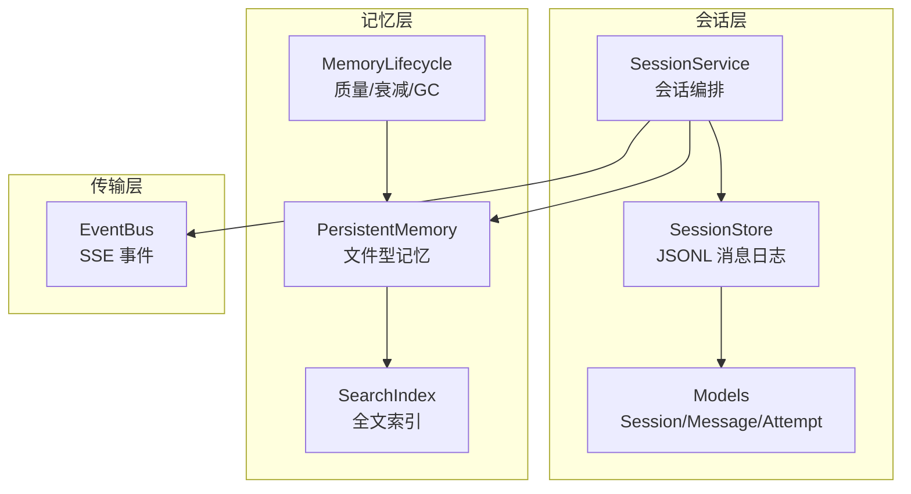
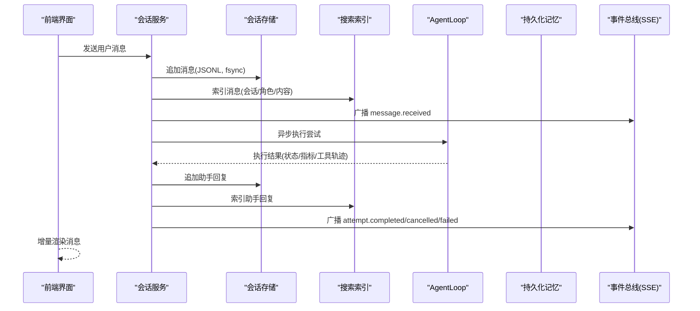
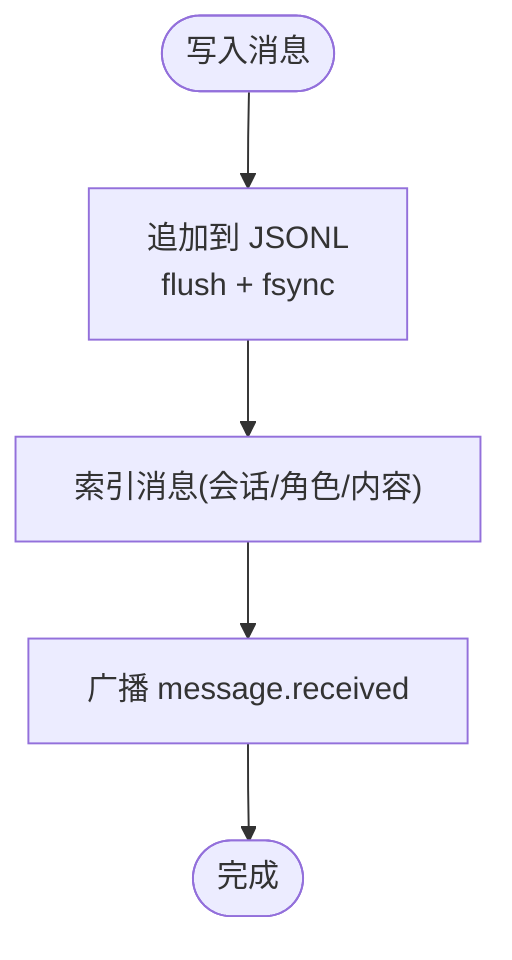
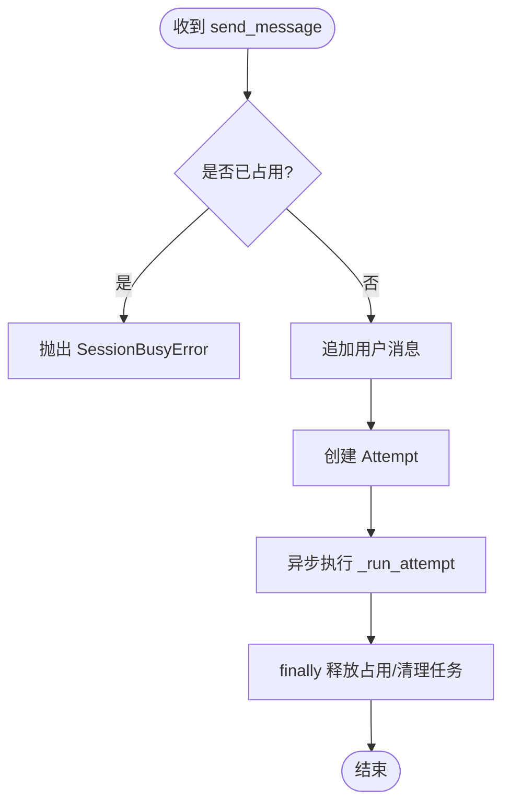
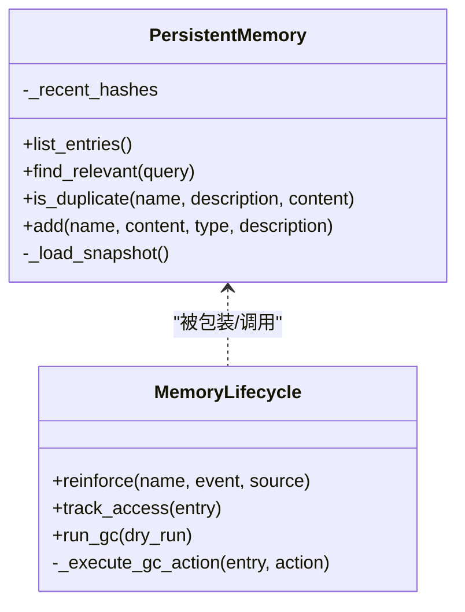
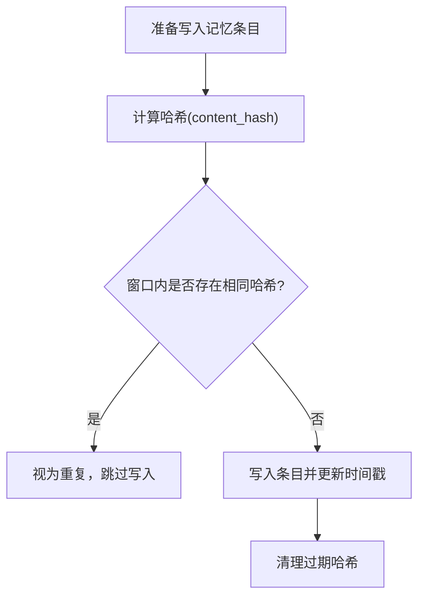
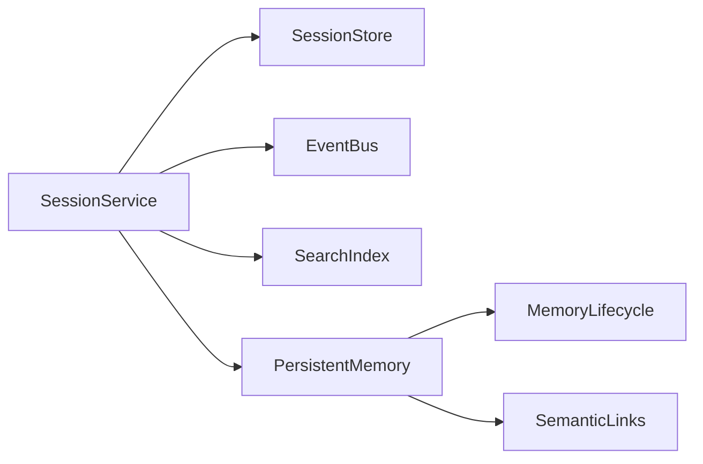

# 消息缓存策略

<cite>
**本文引用的文件**
- [agent/src/session/service.py](file://agent/src/session/service.py)
- [agent/src/session/store.py](file://agent/src/session/store.py)
- [agent/src/session/models.py](file://agent/src/session/models.py)
- [agent/src/memory/persistent.py](file://agent/src/memory/persistent.py)
- [agent/src/memory/lifecycle.py](file://agent/src/memory/lifecycle.py)
- [agent/src/memory/search_index.py](file://agent/src/memory/search_index.py)
</cite>

## 目录
1. [简介](#简介)
2. [项目结构](#项目结构)
3. [核心组件](#核心组件)
4. [架构总览](#架构总览)
5. [详细组件分析](#详细组件分析)
6. [依赖关系分析](#依赖关系分析)
7. [性能考虑](#性能考虑)
8. [故障排查指南](#故障排查指南)
9. [结论](#结论)
10. [附录](#附录)

## 简介
本文件面向 Vibe-Trading 研究页面的“消息缓存系统”，围绕会话级消息的持久化、增量更新、去重、内存与容量管理、LRU/重要性淘汰、跨标签页同步、监控调试与故障恢复进行系统化说明。后端采用“追加式 JSONL 日志 + 文件系统”的消息存储，配合“持久化记忆（PersistentMemory）+ 生命周期（Lifecycle）”实现跨会话的记忆缓存；搜索索引提供快速检索与自动重建；事件总线通过 SSE 将状态变更推送到前端，实现多标签页一致视图。

## 项目结构
- 会话服务：负责会话创建、消息发送、执行尝试调度、SSE 事件广播、历史上下文裁剪。
- 会话存储：基于文件系统的会话、消息、尝试记录持久化，消息以 JSONL 追加写入并 fsync。
- 模型定义：Session、Message、Attempt 等数据结构的序列化/反序列化。
- 持久化记忆：跨会话的文件型记忆存储，包含内容去重、关键词检索、FTS5 索引、语义链接、压缩归档。
- 生命周期管理：质量评分、访问追踪、重要性衰减、垃圾回收（归档/删除）、压缩流水线。
- 搜索索引：全文检索索引，支持自动重建与增量更新。

**图表来源**
- [agent/src/session/service.py:158-221](file://agent/src/session/service.py#L158-L221)
- [agent/src/session/store.py:151-193](file://agent/src/session/store.py#L151-L193)
- [agent/src/memory/persistent.py:196-206](file://agent/src/memory/persistent.py#L196-L206)
- [agent/src/memory/lifecycle.py:183-273](file://agent/src/memory/lifecycle.py#L183-L273)

**章节来源**
- [agent/src/session/service.py:158-221](file://agent/src/session/service.py#L158-L221)
- [agent/src/session/store.py:151-193](file://agent/src/session/store.py#L151-L193)
- [agent/src/session/models.py:140-342](file://agent/src/session/models.py#L140-L342)
- [agent/src/memory/persistent.py:196-206](file://agent/src/memory/persistent.py#L196-L206)
- [agent/src/memory/lifecycle.py:183-273](file://agent/src/memory/lifecycle.py#L183-L273)

## 核心组件
- 会话服务（SessionService）
  - 消息发送：先保留会话并发锁，再追加用户消息到 JSONL，建立 Attempt，异步执行 AgentLoop，完成后追加助手回复并广播事件。
  - 历史裁剪：按字符预算从最新消息开始保留，避免 LLM 上下文溢出。
  - 取消与释放：支持在任务构建期或运行期取消，确保并发锁释放。
- 会话存储（SessionStore）
  - 消息日志：append-only JSONL，逐行追加并 fsync，读取时跳过损坏行。
  - 会话/尝试：JSON 文件读写，列表排序返回最近会话。
- 持久化记忆（PersistentMemory）
  - 去重：30 秒滑动窗口哈希去重，防止重试/并行重复写入。
  - 检索：关键词加权匹配，可选 FTS5 加速；支持语义链接扩展结果。
  - 索引：MEMORY.md 快照与 FTS5 索引，自动重建。
- 生命周期（MemoryLifecycle）
  - 质量评分：根据事件（成功/失败/确认/拒绝/被动衰减）调整分数，限制单会话增量上限。
  - 衰减：Ebbinghaus 遗忘曲线 + 访问奖励，计算重要性。
  - GC：按重要性阈值归档或删除，支持压缩流水线，写回原子替换。

**章节来源**
- [agent/src/session/service.py:158-221](file://agent/src/session/service.py#L158-L221)
- [agent/src/session/service.py:515-565](file://agent/src/session/service.py#L515-L565)
- [agent/src/session/store.py:151-193](file://agent/src/session/store.py#L151-L193)
- [agent/src/memory/persistent.py:440-461](file://agent/src/memory/persistent.py#L440-L461)
- [agent/src/memory/persistent.py:358-438](file://agent/src/memory/persistent.py#L358-L438)
- [agent/src/memory/lifecycle.py:112-159](file://agent/src/memory/lifecycle.py#L112-L159)
- [agent/src/memory/lifecycle.py:183-273](file://agent/src/memory/lifecycle.py#L183-L273)

## 架构总览
消息流从用户输入开始，经会话服务落盘为 JSONL，同时更新搜索索引；AgentLoop 执行后生成助手回复，再次追加并广播完成事件；前端通过 SSE 订阅事件，渲染增量消息。记忆模块在写入新条目时触发去重、索引更新与语义链接发现；GC 周期性地依据重要性对旧条目进行归档/删除与压缩。

**图表来源**
- [agent/src/session/service.py:158-221](file://agent/src/session/service.py#L158-L221)
- [agent/src/session/service.py:248-344](file://agent/src/session/service.py#L248-L344)
- [agent/src/session/store.py:151-193](file://agent/src/session/store.py#L151-L193)

**章节来源**
- [agent/src/session/service.py:158-221](file://agent/src/session/service.py#L158-L221)
- [agent/src/session/service.py:248-344](file://agent/src/session/service.py#L248-L344)
- [agent/src/session/store.py:151-193](file://agent/src/session/store.py#L151-L193)

## 详细组件分析

### 会话消息缓存与增量更新
- 追加式日志：每条消息作为一行 JSON 追加到 messages.jsonl，写入后立即 flush/fsync，保证崩溃不丢消息。
- 增量读取：get_messages 支持 limit，默认返回最近 100 条，适合前端分页渲染。
- 历史裁剪：构造 LLM 历史时按字符预算（约 12000 字符）从最新消息起保留，超长消息会被截断并标记，避免上下文爆炸。
- 索引同步：每次消息写入后调用搜索索引 index_message，保持可检索性。

**图表来源**
- [agent/src/session/store.py:151-163](file://agent/src/session/store.py#L151-L163)
- [agent/src/session/store.py:164-193](file://agent/src/session/store.py#L164-L193)
- [agent/src/session/service.py:158-221](file://agent/src/session/service.py#L158-L221)

**章节来源**
- [agent/src/session/store.py:151-193](file://agent/src/session/store.py#L151-L193)
- [agent/src/session/service.py:158-221](file://agent/src/session/service.py#L158-L221)
- [agent/src/session/service.py:515-565](file://agent/src/session/service.py#L515-L565)

### 会话并发控制与失效策略
- 并发保护：send_message 在追加用户消息前“预留”会话，若已有运行中的尝试则抛出 SessionBusyError（HTTP 409），避免多条循环交错写入。
- 取消与释放：支持在任务构建期或运行期取消；finally 中统一释放占用与清理任务句柄，确保会话不会永久锁定。
- 失效场景：异常/取消/完成均会更新 Attempt 状态并广播终止事件，前端据此刷新 UI。

**图表来源**
- [agent/src/session/service.py:93-117](file://agent/src/session/service.py#L93-L117)
- [agent/src/session/service.py:158-221](file://agent/src/session/service.py#L158-L221)
- [agent/src/session/service.py:227-246](file://agent/src/session/service.py#L227-L246)
- [agent/src/session/service.py:248-344](file://agent/src/session/service.py#L248-L344)

**章节来源**
- [agent/src/session/service.py:93-117](file://agent/src/session/service.py#L93-L117)
- [agent/src/session/service.py:158-221](file://agent/src/session/service.py#L158-L221)
- [agent/src/session/service.py:227-246](file://agent/src/session/service.py#L227-L246)
- [agent/src/session/service.py:248-344](file://agent/src/session/service.py#L248-L344)

### 持久化记忆的内存限制与 LRU/重要性淘汰
- 内存限制
  - 索引快照：MEMORY.md 仅保留最多 MAX_INDEX_LINES 行，避免注入过大上下文。
  - 条目体大小：单条目 body 最大 MAX_ENTRY_CHARS，超出部分截断并附加标记。
  - 去重窗口：_recent_hashes 使用 DEDUP_WINDOW_SECONDS 滑动窗口，定期清理过期哈希，控制内存增长。
- LRU/重要性淘汰
  - 重要性计算：结合 quality_score、access_count、days_since_last_access，启用衰减时按遗忘曲线与访问奖励计算。
  - 垃圾回收：按 ARCHIVE_THRESHOLD/DELETE_THRESHOLD 阈值决定归档或删除；MIN_AGE_DAYS 限制最小存活时间；MAX_MEMORY_COUNT 用于全局规模约束（由配置驱动）。
  - 压缩：对老化条目按 compression_level 进行压缩，减少磁盘占用与 I/O。

**图表来源**
- [agent/src/memory/persistent.py:196-206](file://agent/src/memory/persistent.py#L196-L206)
- [agent/src/memory/persistent.py:440-461](file://agent/src/memory/persistent.py#L440-L461)
- [agent/src/memory/persistent.py:462-578](file://agent/src/memory/persistent.py#L462-L578)
- [agent/src/memory/lifecycle.py:183-273](file://agent/src/memory/lifecycle.py#L183-L273)

**章节来源**
- [agent/src/memory/persistent.py:21-33](file://agent/src/memory/persistent.py#L21-L33)
- [agent/src/memory/persistent.py:440-461](file://agent/src/memory/persistent.py#L440-L461)
- [agent/src/memory/persistent.py:462-578](file://agent/src/memory/persistent.py#L462-L578)
- [agent/src/memory/lifecycle.py:183-273](file://agent/src/memory/lifecycle.py#L183-L273)

### 消息去重算法
- 哈希去重：content_hash 基于 name/description/content 生成短哈希，存入 _recent_hashes 并带时间戳。
- 滑动窗口：写入前检查是否在 DEDUP_WINDOW_SECONDS 内存在相同哈希，若是则视为重复并阻止写入。
- 清理策略：周期性清理超过窗口的哈希，避免内存泄漏。

**图表来源**
- [agent/src/memory/persistent.py:35-38](file://agent/src/memory/persistent.py#L35-L38)
- [agent/src/memory/persistent.py:440-461](file://agent/src/memory/persistent.py#L440-L461)

**章节来源**
- [agent/src/memory/persistent.py:35-38](file://agent/src/memory/persistent.py#L35-L38)
- [agent/src/memory/persistent.py:440-461](file://agent/src/memory/persistent.py#L440-L461)

### 增量更新机制
- 消息增量：JSONL 追加写入，前端通过 SSE 接收 message.received 与 assistant 回复事件，逐步渲染。
- 索引增量：每次消息写入后调用搜索索引 index_message；新增记忆条目时 index_entry，删除时 remove_entry。
- 历史裁剪：构造 LLM 历史时按字符预算从最新消息起保留，超长消息截断，保证上下文稳定。

**章节来源**
- [agent/src/session/service.py:158-221](file://agent/src/session/service.py#L158-L221)
- [agent/src/session/service.py:515-565](file://agent/src/session/service.py#L515-L565)
- [agent/src/memory/persistent.py:565-578](file://agent/src/memory/persistent.py#L565-L578)

### 缓存失效策略
- 会话级失效：删除会话时会清空事件总线并移除文件系统目录，相关索引与链接随之清理。
- 记忆级失效：GC 根据重要性阈值归档或删除条目；删除后重建索引与语义链接。
- 索引失效：FTS5 索引在首次空查询且存在条目时自动重建，保证一致性。

**章节来源**
- [agent/src/session/service.py:153-156](file://agent/src/session/service.py#L153-L156)
- [agent/src/memory/lifecycle.py:275-298](file://agent/src/memory/lifecycle.py#L275-L298)
- [agent/src/memory/persistent.py:358-393](file://agent/src/memory/persistent.py#L358-L393)

### 跨标签页同步
- 事件总线：SSE 事件（message.received、attempt.started/completed/cancelled/failed）实时推送至所有订阅的前端标签页。
- 一致性保障：消息写入后立刻广播；尝试状态变更后立即广播终止事件，确保各标签页视图一致。

**章节来源**
- [agent/src/session/service.py:158-221](file://agent/src/session/service.py#L158-L221)
- [agent/src/session/service.py:248-344](file://agent/src/session/service.py#L248-L344)

### 缓存监控、调试工具与故障恢复
- 监控与调试
  - GC 日志：gc.log 记录归档/删除决策与原因，便于审计与调优。
  - 索引快照：MEMORY.md 提供当前可见记忆摘要，便于快速定位。
  - 工具轨迹：助手回复携带 tool_trail，便于回溯工具调用过程。
- 故障恢复
  - 损坏行容忍：读取 JSONL 时跳过损坏行并记录警告，不影响整体读取。
  - 原子写入：frontmatter 字段更新与压缩写回采用临时文件 + os.replace，避免中途崩溃导致文件损坏。
  - 并发锁：文件级独占锁（fcntl）避免多进程/多线程竞争，超时则降级处理。

**章节来源**
- [agent/src/memory/lifecycle.py:300-317](file://agent/src/memory/lifecycle.py#L300-L317)
- [agent/src/memory/lifecycle.py:323-378](file://agent/src/memory/lifecycle.py#L323-L378)
- [agent/src/session/store.py:174-193](file://agent/src/session/store.py#L174-L193)
- [agent/src/memory/persistent.py:41-73](file://agent/src/memory/persistent.py#L41-L73)

## 依赖关系分析
- 会话服务依赖：
  - 会话存储：消息追加、读取、会话/尝试 CRUD。
  - 事件总线：SSE 事件广播。
  - 搜索索引：消息与记忆条目索引。
  - 持久化记忆：跨会话记忆存取与增强。
- 持久化记忆依赖：
  - 生命周期：质量评分、衰减、GC、压缩。
  - 搜索索引：FTS5 加速检索与自动重建。
  - 语义链接：关联条目发现与关系维护。

**图表来源**
- [agent/src/session/service.py:158-221](file://agent/src/session/service.py#L158-L221)
- [agent/src/memory/persistent.py:358-438](file://agent/src/memory/persistent.py#L358-L438)
- [agent/src/memory/lifecycle.py:183-273](file://agent/src/memory/lifecycle.py#L183-L273)

**章节来源**
- [agent/src/session/service.py:158-221](file://agent/src/session/service.py#L158-L221)
- [agent/src/memory/persistent.py:358-438](file://agent/src/memory/persistent.py#L358-L438)
- [agent/src/memory/lifecycle.py:183-273](file://agent/src/memory/lifecycle.py#L183-L273)

## 性能考虑
- 写入性能
  - JSONL 追加 + fsync：保证持久性与顺序，适合高吞吐写入。
  - 批量读取限制：get_messages 默认 limit=100，避免一次性加载过多消息。
- 检索性能
  - FTS5 索引：优先走全文检索，空结果时自动重建，降低冷启动开销。
  - 关键词加权：元数据与正文分词权重不同，提升相关性。
- 内存与容量
  - 索引快照行数限制：MAX_INDEX_LINES。
  - 条目体大小限制：MAX_ENTRY_CHARS。
  - 去重窗口：DEDUP_WINDOW_SECONDS，定期清理。
- 上下文优化
  - 历史裁剪：按字符预算保留最新消息，超长消息截断，避免 LLM 上下文溢出。
- GC 与压缩
  - 重要性阈值：ARCHIVE_THRESHOLD/DELETE_THRESHOLD 控制归档/删除。
  - 压缩级别：raw/daily/digest，降低磁盘占用与 I/O。

**章节来源**
- [agent/src/session/store.py:164-193](file://agent/src/session/store.py#L164-L193)
- [agent/src/memory/persistent.py:21-33](file://agent/src/memory/persistent.py#L21-L33)
- [agent/src/memory/persistent.py:358-393](file://agent/src/memory/persistent.py#L358-L393)
- [agent/src/memory/persistent.py:440-461](file://agent/src/memory/persistent.py#L440-L461)
- [agent/src/session/service.py:515-565](file://agent/src/session/service.py#L515-L565)
- [agent/src/memory/lifecycle.py:183-273](file://agent/src/memory/lifecycle.py#L183-L273)

## 故障排查指南
- 常见问题
  - 会话忙冲突：多个并发 send_message 导致 409，需等待或取消当前尝试。
  - 消息损坏：JSONL 中存在非法行会被跳过并记录警告，建议检查写入路径。
  - 索引为空：FTS5 首次查询为空时自动重建，若仍失败请检查条目扫描逻辑。
  - GC 未生效：确认 VT_MEMORY_GC 与压缩开关配置；查看 gc.log 了解决策。
- 诊断步骤
  - 查看 gc.log：归档/删除决策与原因。
  - 检查 MEMORY.md：当前可见记忆摘要。
  - 检查工具轨迹：助手回复中的 tool_trail 帮助定位工具调用问题。
  - 并发锁日志：memory_lock 超时告警提示竞争或阻塞。

**章节来源**
- [agent/src/session/service.py:158-221](file://agent/src/session/service.py#L158-L221)
- [agent/src/session/store.py:174-193](file://agent/src/session/store.py#L174-L193)
- [agent/src/memory/lifecycle.py:300-317](file://agent/src/memory/lifecycle.py#L300-L317)
- [agent/src/memory/persistent.py:41-73](file://agent/src/memory/persistent.py#L41-L73)

## 结论
该消息缓存系统以“追加式 JSONL 日志 + 文件系统”为核心，结合“持久化记忆 + 生命周期管理”实现跨会话的记忆缓存与容量治理；通过 FTS5 索引与语义链接提升检索效率；借助 SSE 事件总线实现多标签页一致视图。系统在并发控制、去重、增量更新、GC 与压缩方面提供了完善的机制，并通过日志与原子写入保障可观测性与可靠性。

## 附录
- 配置与环境变量
  - VT_MEMORY_QUALITY：启用质量评分与访问追踪。
  - VT_MEMORY_GC：启用垃圾回收。
  - VT_MEMORY_DECAY：启用重要性衰减。
  - 其他：compression_enabled、fts_index_enabled、links_enabled、hierarchy_enabled 等由配置器驱动。
- 关键阈值参考
  - MAX_INDEX_LINES、MAX_ENTRY_CHARS、DEDUP_WINDOW_SECONDS、ARCHIVE_THRESHOLD、DELETE_THRESHOLD、MIN_AGE_DAYS、MAX_MEMORY_COUNT。
- 最佳实践
  - 合理设置历史裁剪预算，避免上下文过大。
  - 开启 FTS5 索引以提升检索性能。
  - 定期运行 GC 并审查 gc.log，平衡保留与清理。
  - 关注并发冲突，必要时引入队列或退避重试。