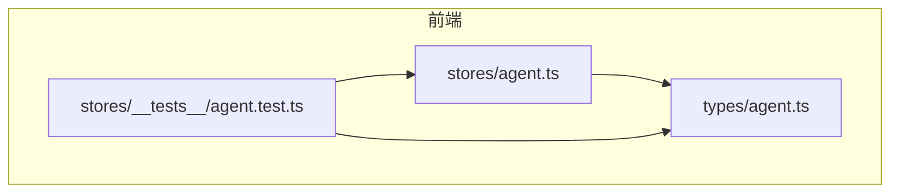
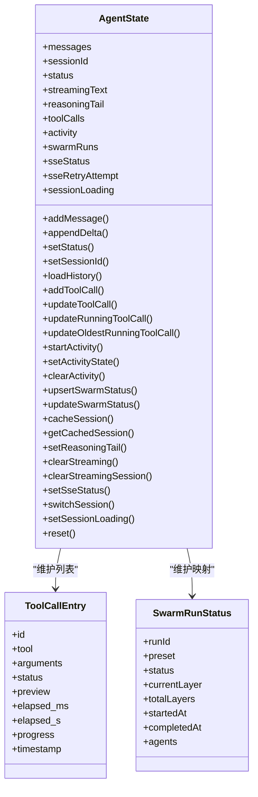
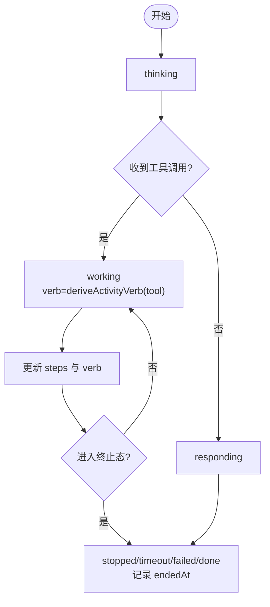
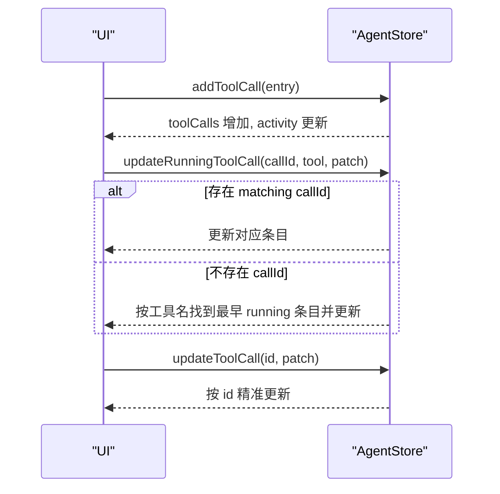
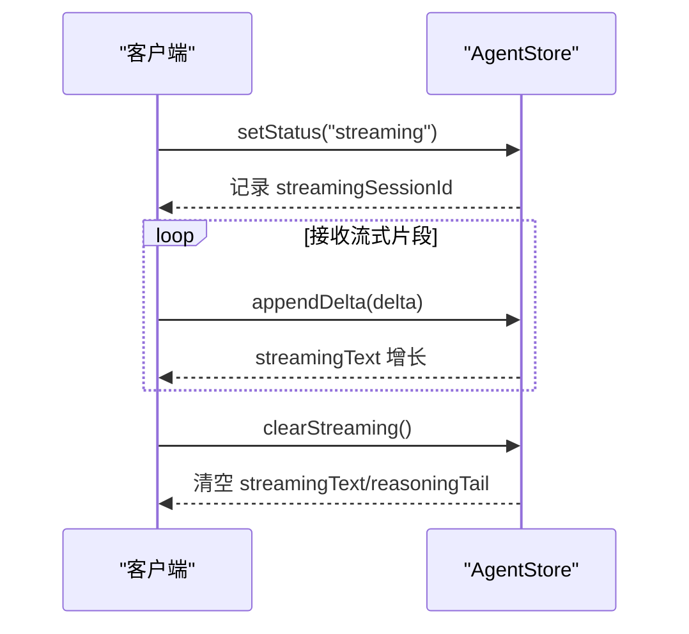
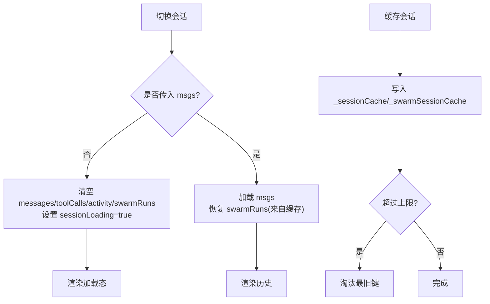
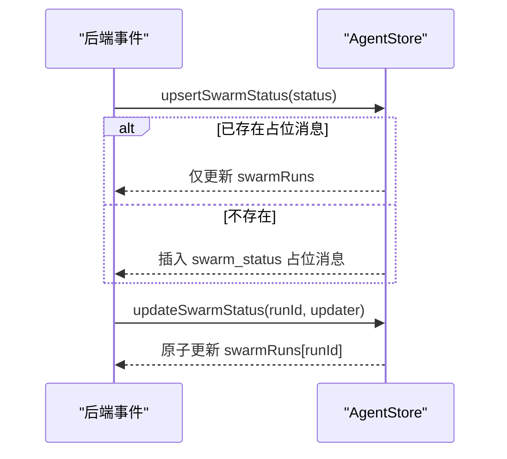
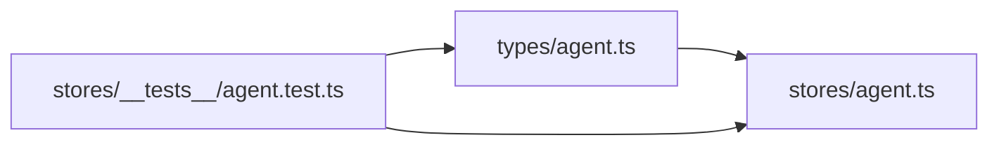

# 状态管理

<cite>
**本文引用的文件**
- [agent.ts](file://frontend/src/stores/agent.ts)
- [agent.ts（类型定义）](file://frontend/src/types/agent.ts)
- [agent.test.ts](file://frontend/src/stores/__tests__/agent.test.ts)
</cite>

## 目录
1. [简介](#简介)
2. [项目结构](#项目结构)
3. [核心组件](#核心组件)
4. [架构总览](#架构总览)
5. [详细组件分析](#详细组件分析)
6. [依赖关系分析](#依赖关系分析)
7. [性能考量](#性能考量)
8. [故障排查指南](#故障排查指南)
9. [结论](#结论)
10. [附录](#附录)

## 简介
本文件为 Vibe-Trading 研究页面的前端状态管理系统提供完整文档，聚焦于基于 Zustand 的 agent store。内容涵盖：
- Store 架构与职责边界
- 消息、会话、工具调用、活动状态机、流式文本更新机制
- 缓存策略、内存优化、状态同步
- 状态迁移与版本兼容性建议
- 调试与监控方法
- 状态变更追踪与性能分析工具使用指南

## 项目结构
研究页面状态管理位于前端 stores 目录，核心实现为单一 store 模块，配合类型定义与测试用例共同构成完整的状态契约与行为保障。

图表来源
- [agent.ts:1-336](file://frontend/src/stores/agent.ts#L1-L336)
- [agent.ts（类型定义）:1-82](file://frontend/src/types/agent.ts#L1-L82)
- [agent.test.ts:1-445](file://frontend/src/stores/__tests__/agent.test.ts#L1-L445)

章节来源
- [agent.ts:1-336](file://frontend/src/stores/agent.ts#L1-L336)
- [agent.ts（类型定义）:1-82](file://frontend/src/types/agent.ts#L1-L82)
- [agent.test.ts:1-445](file://frontend/src/stores/__tests__/agent.test.ts#L1-L445)

## 核心组件
- AgentStore（useAgentStore）
  - 负责会话消息、流式文本、工具调用、活动状态、Swarm 运行状态、SSE 连接状态等全局状态的管理与更新。
  - 提供增删改查与批量操作的方法集合，保证状态一致性。
- 类型系统（AgentMessage、ToolCallEntry、SwarmRunStatus 等）
  - 明确消息、工具调用、Swarm 状态的字段与取值范围，确保前后端契约一致。

关键能力概览
- 消息与会话：addMessage、loadHistory、switchSession、setSessionId、sessionLoading
- 流式文本：appendDelta、clearStreaming、reasoningTail
- 工具调用：addToolCall、updateToolCall、updateRunningToolCall、updateOldestRunningToolCall
- 活动状态机：startActivity、setActivityState、clearActivity、deriveActivityVerb
- Swarm 状态：upsertSwarmStatus、updateSwarmStatus
- SSE 连接：setSseStatus
- 缓存：cacheSession、getCachedSession

章节来源
- [agent.ts:60-114](file://frontend/src/stores/agent.ts#L60-L114)
- [agent.ts:119-336](file://frontend/src/stores/agent.ts#L119-L336)
- [agent.ts（类型定义）:1-82](file://frontend/src/types/agent.ts#L1-L82)

## 架构总览
下图展示 agent store 的核心数据模型与主要方法之间的关系，体现“消息—工具调用—活动状态—Swarm 状态”的联动关系。

图表来源
- [agent.ts:60-114](file://frontend/src/stores/agent.ts#L60-L114)
- [agent.ts:119-336](file://frontend/src/stores/agent.ts#L119-L336)
- [agent.ts（类型定义）:40-82](file://frontend/src/types/agent.ts#L40-L82)

## 详细组件分析

### 活动状态机设计
活动状态机用于表达一次“尝试”的生命周期，从思考到工作再到结束，支持终止态的时间冻结与可替换 attemptId。

- 状态集合
  - thinking、working、responding、stopped、timeout、failed、done
- 动词派生
  - 根据工具名匹配规则推导用户可见的活动动词：readingMarketData、writingStrategy、runningBacktest、validatingNumbers、working
- 生命周期
  - startActivity 初始化 activity 并清空 toolCalls
  - addToolCall/updateToolCall/updateRunningToolCall 会同步更新 activity.steps 与 verb
  - setActivityState 在终止态写入 endedAt 并冻结时间
  - clearActivity 重置活动

图表来源
- [agent.ts:6-44](file://frontend/src/stores/agent.ts#L6-L44)
- [agent.ts:167-250](file://frontend/src/stores/agent.ts#L167-L250)

章节来源
- [agent.ts:6-44](file://frontend/src/stores/agent.ts#L6-L44)
- [agent.ts:167-250](file://frontend/src/stores/agent.ts#L167-L250)
- [agent.test.ts:208-266](file://frontend/src/stores/__tests__/agent.test.ts#L208-L266)

### 工具调用状态跟踪
- 数据结构
  - ToolCallEntry：包含 id、tool、arguments、status、preview、elapsed_ms、elapsed_s、progress、timestamp
- 更新策略
  - addToolCall：追加条目，同时启动或刷新 activity
  - updateToolCall：按 id 精确更新
  - updateRunningToolCall：优先按 call_id 查找 running 条目；若无则回退到同名工具 FIFO 更新
  - updateOldestRunningToolCall：显式按工具名定位最旧的 running 条目进行更新
- 并发与顺序
  - 支持并行同工具调用的独立进度与结果
  - 无 call_id 时按 FIFO 顺序更新首个 running 条目

图表来源
- [agent.ts:167-222](file://frontend/src/stores/agent.ts#L167-L222)
- [agent.ts（类型定义）:60-82](file://frontend/src/types/agent.ts#L60-L82)

章节来源
- [agent.ts:167-222](file://frontend/src/stores/agent.ts#L167-L222)
- [agent.test.ts:116-206](file://frontend/src/stores/__tests__/agent.test.ts#L116-L206)

### 流式文本更新机制
- streamingText：累积模型流式输出片段
- reasoningTail：服务端限长的推理尾部快照，便于上下文恢复
- appendDelta：增量拼接
- clearStreaming：清理当前流式内容
- setStatus：进入 streaming 时记录 streamingSessionId，离开时清理或保留跨会话切换时的 spinner 标识

图表来源
- [agent.ts:133-148](file://frontend/src/stores/agent.ts#L133-L148)
- [agent.ts:299-305](file://frontend/src/stores/agent.ts#L299-L305)

章节来源
- [agent.ts:133-148](file://frontend/src/stores/agent.ts#L133-L148)
- [agent.ts:299-305](file://frontend/src/stores/agent.ts#L299-L305)
- [agent.test.ts:49-99](file://frontend/src/stores/__tests__/agent.test.ts#L49-L99)

### 会话状态持久化与缓存策略
- 内存缓存
  - _sessionCache：最近 N 个会话的消息历史（默认上限 5），LRU 风格淘汰
  - _swarmSessionCache：每个会话对应的 swarmRuns 快照，避免重复计算
- 会话切换
  - switchSession：重置大部分运行时状态，保留 streamingSessionId 以维持侧边栏 spinner
  - loadHistory：合并历史消息与活跃 swarm 占位消息，保持排序稳定
- 缓存读写
  - cacheSession：写入消息与 swarm 快照，必要时淘汰最旧项
  - getCachedSession：读取缓存消息

图表来源
- [agent.ts:282-323](file://frontend/src/stores/agent.ts#L282-L323)
- [agent.test.ts:305-361](file://frontend/src/stores/__tests__/agent.test.ts#L305-L361)

章节来源
- [agent.ts:282-323](file://frontend/src/stores/agent.ts#L282-L323)
- [agent.test.ts:305-361](file://frontend/src/stores/__tests__/agent.test.ts#L305-L361)

### Swarm 状态管理与消息占位
- upsertSwarmStatus：若已有 swarm_status 消息则仅更新 swarmRuns；否则插入一条占位消息以保持时间线稳定
- updateSwarmStatus：对指定 runId 的状态进行原子更新
- 优势：避免频繁插入消息导致重排，提升渲染稳定性

图表来源
- [agent.ts:251-280](file://frontend/src/stores/agent.ts#L251-L280)
- [agent.test.ts:269-303](file://frontend/src/stores/__tests__/agent.test.ts#L269-L303)

章节来源
- [agent.ts:251-280](file://frontend/src/stores/agent.ts#L251-L280)
- [agent.test.ts:269-303](file://frontend/src/stores/__tests__/agent.test.ts#L269-L303)

### SSE 连接状态
- sseStatus：disconnected | connected | reconnecting
- sseRetryAttempt：重连次数
- setSseStatus：统一设置连接状态与重试计数

章节来源
- [agent.ts:76-78](file://frontend/src/stores/agent.ts#L76-L78)
- [agent.ts:304-305](file://frontend/src/stores/agent.ts#L304-L305)
- [agent.test.ts:363-375](file://frontend/src/stores/__tests__/agent.test.ts#L363-L375)

## 依赖关系分析
- 模块内依赖
  - agent.ts 依赖 types/agent.ts 的类型定义，形成强契约
  - 测试覆盖所有关键路径，验证状态机、工具调用、缓存、SSE 等行为
- 外部依赖
  - Zustand create 创建不可变状态更新
- 耦合度
  - 单 store 高内聚，方法职责清晰，降低跨模块耦合
- 循环依赖
  - 无循环依赖迹象

图表来源
- [agent.ts:1-3](file://frontend/src/stores/agent.ts#L1-L3)
- [agent.ts（类型定义）:1-82](file://frontend/src/types/agent.ts#L1-L82)
- [agent.test.ts:1-8](file://frontend/src/stores/__tests__/agent.test.ts#L1-L8)

章节来源
- [agent.ts:1-3](file://frontend/src/stores/agent.ts#L1-L3)
- [agent.ts（类型定义）:1-82](file://frontend/src/types/agent.ts#L1-L82)
- [agent.test.ts:1-8](file://frontend/src/stores/__tests__/agent.test.ts#L1-L8)

## 性能考量
- 不可变更新
  - 通过 Zustand 的 set 回调返回新对象，避免共享引用导致的意外重渲染
- 列表更新优化
  - 工具调用与消息采用追加与局部更新，减少全量重建
- 缓存限制
  - 会话缓存上限固定（默认 5），防止内存无限增长
- 流式更新
  - streamingText 增量拼接，避免大字符串重组开销
- 状态粒度
  - 将 activity、toolCalls、swarmRuns 分离，缩小订阅范围，降低无关组件重渲染

[本节为通用性能指导，不直接分析具体代码行]

## 故障排查指南
- 常见问题定位
  - 工具调用未更新：检查 updateRunningToolCall 的 callId 是否存在；若无 callId 将按工具名 FIFO 更新
  - 活动状态异常：确认 startActivity 后是否有 addToolCall 触发 working；终止态是否正确设置 endedAt
  - 流式文本不显示：检查 setStatus("streaming") 与 appendDelta 的调用时机
  - 会话切换闪烁：确认 switchSession 是否保留了 streamingSessionId
  - Swarm 状态不同步：确认 upsertSwarmStatus 与 updateSwarmStatus 的成对调用
- 调试建议
  - 使用浏览器开发者工具的 Redux/Zustand 扩展查看状态快照
  - 在关键方法前后打印日志（如 addToolCall、updateRunningToolCall、setActivityState）
  - 利用单元测试断言复现问题场景

章节来源
- [agent.test.ts:116-206](file://frontend/src/stores/__tests__/agent.test.ts#L116-L206)
- [agent.test.ts:208-266](file://frontend/src/stores/__tests__/agent.test.ts#L208-L266)
- [agent.test.ts:49-99](file://frontend/src/stores/__tests__/agent.test.ts#L49-L99)
- [agent.test.ts:305-361](file://frontend/src/stores/__tests__/agent.test.ts#L305-L361)

## 结论
该状态管理方案以单一 Zustand store 为核心，围绕“消息—工具调用—活动状态—Swarm 状态”构建高内聚、低耦合的前端状态层。通过明确的类型契约、完善的测试覆盖、合理的缓存与流式更新策略，实现了稳定的会话体验与良好的性能表现。建议在后续演进中继续遵循不可变更新原则，逐步引入更细粒度的选择器与性能监控，以支撑更大规模的研究工作流。

[本节为总结性内容，不直接分析具体代码行]

## 附录

### 状态迁移与版本兼容性建议
- 向后兼容
  - 新增字段应允许为空或提供默认值，避免破坏旧客户端
  - 对枚举型字段（如 ActivityState、SwarmRunStatus.status）采用白名单校验，未知值降级处理
- 迁移策略
  - 在 switchSession/loadHistory 中执行轻量级数据清洗（如补齐缺失字段、规范化时间戳）
  - 对历史消息中的工具调用进行版本适配（如 progress 字段结构变化）

[本节为通用实践建议，不直接分析具体代码行]

### 调试与监控方法
- 本地调试
  - 使用浏览器扩展监听 Zustand store 变更
  - 在关键方法中添加条件日志（开发环境）
- 线上监控
  - 上报关键状态变更指标（如 sseStatus、activity.state、toolCalls.length）
  - 采集流式文本长度与更新频率，识别卡顿点

[本节为通用实践建议，不直接分析具体代码行]

### 状态变更追踪与性能分析工具使用指南
- 变更追踪
  - 在开发环境启用 Zustand middleware 记录每次 set 调用栈，定位变更源头
  - 结合单元测试断言，快速回归验证
- 性能分析
  - 使用 React Profiler 观察因状态变更引起的重渲染范围与耗时
  - 针对长列表（messages/toolCalls）使用虚拟滚动或分页加载，减少 DOM 压力

[本节为通用实践建议，不直接分析具体代码行]