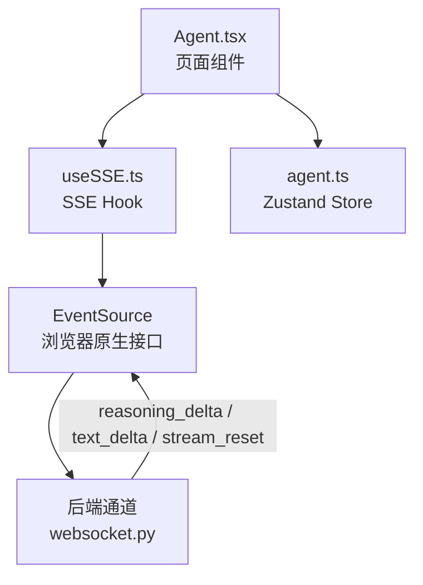
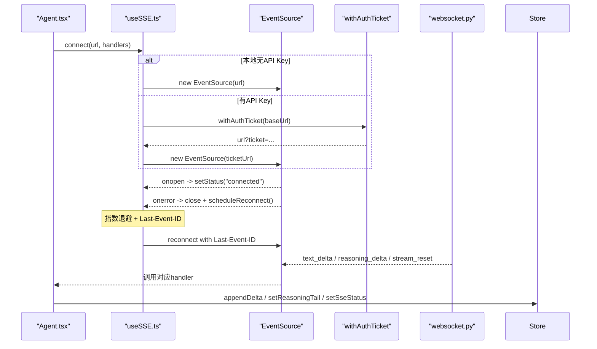
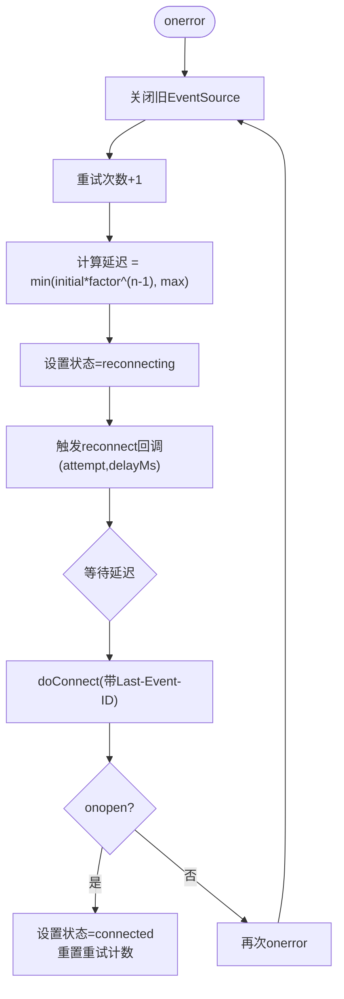
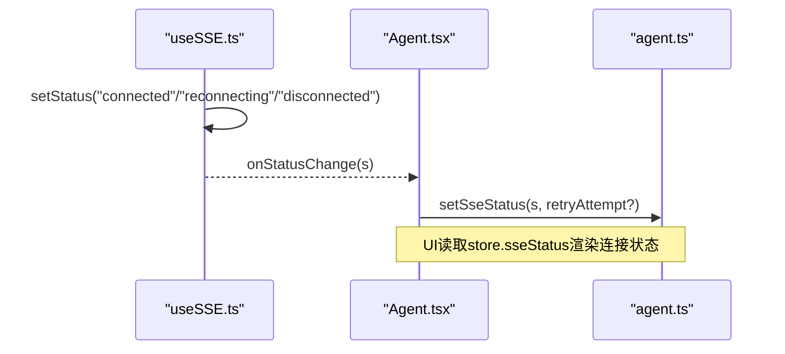
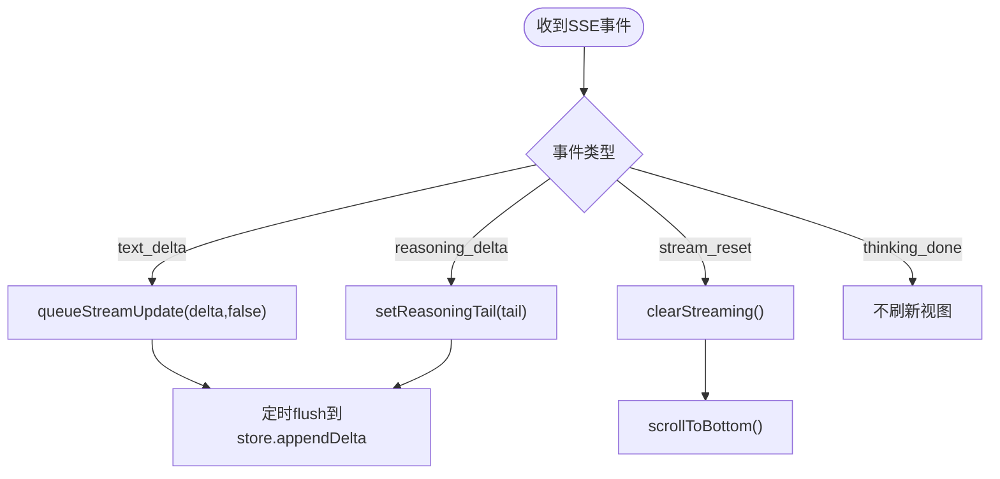
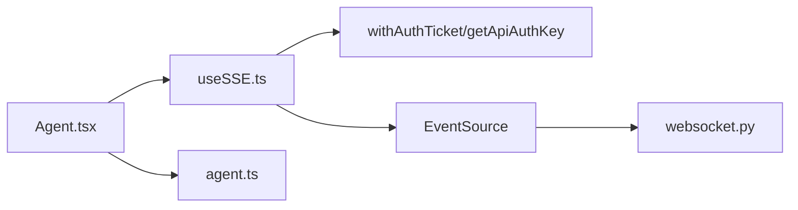

# SSE连接管理

<cite>
**本文引用的文件**
- [useSSE.ts](file://frontend/src/hooks/useSSE.ts)
- [agent.ts](file://frontend/src/stores/agent.ts)
- [Agent.tsx](file://frontend/src/pages/Agent.tsx)
- [useSSE.test.ts](file://frontend/src/hooks/__tests__/useSSE.test.ts)
- [websocket.py](file://agent/src/channels/websocket.py)
- [base.py](file://agent/src/channels/base.py)
</cite>

## 目录
1. [简介](#简介)
2. [项目结构](#项目结构)
3. [核心组件](#核心组件)
4. [架构总览](#架构总览)
5. [详细组件分析](#详细组件分析)
6. [依赖关系分析](#依赖关系分析)
7. [性能考量](#性能考量)
8. [故障诊断指南](#故障诊断指南)
9. [结论](#结论)
10. [附录](#附录)

## 简介
本文档面向 Vibe-Trading 研究页面的 SSE（Server-Sent Events）连接管理系统，聚焦以下方面：
- 连接状态管理：disconnected、connected、reconnecting 的转换与触发点
- 重连机制与重试策略：指数退避、最大延迟上限、Last-Event-ID 断点续传
- setSseStatus 的使用与状态同步到全局 Store
- 连接健康检查与错误处理逻辑
- SSE 流式数据接收处理：text_delta、reasoning_delta、stream_reset 等事件
- reasoningTail 的管理与增量更新机制
- 连接池管理、资源清理与性能优化建议
- 调试与故障诊断方法

## 项目结构
前端通过 React Hook useSSE 封装 EventSource 生命周期、自动重连、去重与鉴权；页面 Agent.tsx 订阅具体事件并驱动 UI；Zustand store agent.ts 维护会话级状态（包括 sseStatus、reasoningTail、streamingText 等）。后端通道 websocket.py 负责推送 reasoning_delta 等事件。

**图表来源**
- [Agent.tsx:642-703](file://frontend/src/pages/Agent.tsx#L642-L703)
- [useSSE.ts:71-134](file://frontend/src/hooks/useSSE.ts#L71-L134)
- [websocket.py:989-1022](file://agent/src/channels/websocket.py#L989-L1022)

**章节来源**
- [Agent.tsx:642-703](file://frontend/src/pages/Agent.tsx#L642-L703)
- [useSSE.ts:1-216](file://frontend/src/hooks/useSSE.ts#L1-L216)
- [agent.ts:60-131](file://frontend/src/stores/agent.ts#L60-L131)
- [websocket.py:989-1022](file://agent/src/channels/websocket.py#L989-L1022)

## 核心组件
- useSSE Hook：封装 EventSource 创建、事件监听、错误处理、自动重连、LRU 去重、Last-Event-ID 续传、认证票据获取。
- Agent 页面：注册事件处理器，将 text_delta 增量写入 streamingText，将 reasoning_delta 的 tail 写入 reasoningTail，处理 stream_reset 重置视图。
- Zustand Store：集中管理 sseStatus、sseRetryAttempt、reasoningTail、streamingText、活动状态等，提供 setSseStatus、setReasoningTail、appendDelta 等方法。

**章节来源**
- [useSSE.ts:27-216](file://frontend/src/hooks/useSSE.ts#L27-L216)
- [Agent.tsx:679-703](file://frontend/src/pages/Agent.tsx#L679-L703)
- [agent.ts:60-131](file://frontend/src/stores/agent.ts#L60-L131)

## 架构总览
下图展示从页面发起连接到事件到达、状态更新的完整流程，包括重连与续传。

**图表来源**
- [useSSE.ts:63-156](file://frontend/src/hooks/useSSE.ts#L63-L156)
- [useSSE.ts:158-174](file://frontend/src/hooks/useSSE.ts#L158-L174)
- [Agent.tsx:679-703](file://frontend/src/pages/Agent.tsx#L679-L703)
- [websocket.py:989-1022](file://agent/src/channels/websocket.py#L989-L1022)

## 详细组件分析

### 连接状态管理与重连机制
- 状态类型：disconnected、connected、reconnecting
- 状态变更点：
  - onopen：置为 connected，重置重试计数
  - onerror：关闭旧连接，调度重连，置为 reconnecting
  - disconnect：关闭连接，置为 disconnected
- 重连策略：
  - 指数退避：delay = min(initialRetryMs * backoffFactor^(attempt-1), maxRetryMs)
  - 最大延迟上限：maxRetryMs
  - 重试回调：reconnect 事件携带 attempt 与 delayMs，供上层记录或展示
  - 断点续传：lastEventId 持久化并在下次连接时附加为查询参数
  - LRU 去重：基于 lastEventId 的去重集合，容量可配置，避免重复事件导致的状态不一致

**图表来源**
- [useSSE.ts:122-134](file://frontend/src/hooks/useSSE.ts#L122-L134)
- [useSSE.ts:158-174](file://frontend/src/hooks/useSSE.ts#L158-L174)
- [useSSE.ts:63-69](file://frontend/src/hooks/useSSE.ts#L63-L69)

**章节来源**
- [useSSE.ts:27-216](file://frontend/src/hooks/useSSE.ts#L27-L216)
- [useSSE.test.ts:243-312](file://frontend/src/hooks/__tests__/useSSE.test.ts#L243-L312)

### setSseStatus 的使用与状态同步
- useSSE 内部通过 setStatus 更新内部状态，并通过 onStatusChange 回调通知外部
- Agent 页面通过 onStatusChange 调用 store.setSseStatus(s)，同时根据状态变化提示用户（如连接丢失恢复）
- Store 中维护 sseStatus 与 sseRetryAttempt，便于 UI 显示当前连接状态与重试次数

**图表来源**
- [useSSE.ts:58-61](file://frontend/src/hooks/useSSE.ts#L58-L61)
- [Agent.tsx:449-471](file://frontend/src/pages/Agent.tsx#L449-L471)
- [agent.ts:304-305](file://frontend/src/stores/agent.ts#L304-L305)

**章节来源**
- [useSSE.ts:58-61](file://frontend/src/hooks/useSSE.ts#L58-L61)
- [Agent.tsx:449-471](file://frontend/src/pages/Agent.tsx#L449-L471)
- [agent.ts:304-305](file://frontend/src/stores/agent.ts#L304-L305)

### 流式数据接收与 reasoningTail 管理
- text_delta：增量追加到 streamingText，使用节流合并减少频繁渲染
- reasoning_delta：后端发送的是“滚动尾部”（bounded rolling tail），前端直接替换 reasoningTail，不拼接
- stream_reset：清空当前流式文本，保持“streaming”状态并滚动到底部
- thinking_done：仅用于心跳标记，不刷新视图

**图表来源**
- [Agent.tsx:679-703](file://frontend/src/pages/Agent.tsx#L679-L703)
- [agent.ts:136-137](file://frontend/src/stores/agent.ts#L136-L137)
- [agent.ts:299-300](file://frontend/src/stores/agent.ts#L299-L300)

**章节来源**
- [Agent.tsx:679-703](file://frontend/src/pages/Agent.tsx#L679-L703)
- [agent.ts:136-137](file://frontend/src/stores/agent.ts#L136-L137)
- [agent.ts:299-300](file://frontend/src/stores/agent.ts#L299-L300)

### 认证与连接建立
- 若本地存储了 API Key，则先请求一次性 ticket，再打开 EventSource，避免在长连接 URL 中暴露长期密钥
- 开发模式（无 API Key）下直接同步建立连接，保持零往返开销

**章节来源**
- [useSSE.ts:136-156](file://frontend/src/hooks/useSSE.ts#L136-L156)
- [useSSE.test.ts:314-397](file://frontend/src/hooks/__tests__/useSSE.test.ts#L314-L397)

### 后端推理流（reasoning_delta）
- 后端以 reasoning_delta 事件推送模型思考片段，支持 stream_id 关联
- 前端按“滚动尾部”语义替换 reasoningTail，保证 UI 始终显示最新片段

**章节来源**
- [websocket.py:989-1022](file://agent/src/channels/websocket.py#L989-L1022)
- [base.py:98-117](file://agent/src/channels/base.py#L98-L117)
- [Agent.tsx:687-695](file://frontend/src/pages/Agent.tsx#L687-L695)

## 依赖关系分析
- Agent.tsx 依赖 useSSE 提供的 connect/disconnect/onStatusChange
- useSSE 依赖浏览器 EventSource、认证模块 withAuthTicket/getApiAuthKey
- Agent.tsx 依赖 agent.ts 的 setSseStatus、setReasoningTail、appendDelta
- 后端 websocket.py 推送 reasoning_delta 等事件，被前端 EventSource 接收

**图表来源**
- [Agent.tsx:642-703](file://frontend/src/pages/Agent.tsx#L642-L703)
- [useSSE.ts:6-7](file://frontend/src/hooks/useSSE.ts#L6-L7)
- [useSSE.ts:71-156](file://frontend/src/hooks/useSSE.ts#L71-L156)
- [websocket.py:989-1022](file://agent/src/channels/websocket.py#L989-L1022)

**章节来源**
- [Agent.tsx:642-703](file://frontend/src/pages/Agent.tsx#L642-L703)
- [useSSE.ts:6-7](file://frontend/src/hooks/useSSE.ts#L6-L7)
- [useSSE.ts:71-156](file://frontend/src/hooks/useSSE.ts#L71-L156)
- [websocket.py:989-1022](file://agent/src/channels/websocket.py#L989-L1022)

## 性能考量
- 流式文本增量更新节流：使用定时器合并多次 delta，降低渲染压力
- reasoning_tail 替换而非拼接：避免无限增长，控制内存占用
- LRU 去重：限制 lastEventId 缓存大小，防止内存泄漏
- 指数退避重连：避免雪崩式重连，保护服务端与网络
- 工具进度合并：tool_progress 使用 requestAnimationFrame 批量更新，减少状态更新频率
- 滚动优化：仅在接近底部时自动滚动，避免频繁重排

**章节来源**
- [Agent.tsx:309-336](file://frontend/src/pages/Agent.tsx#L309-L336)
- [useSSE.ts:44-56](file://frontend/src/hooks/useSSE.ts#L44-L56)
- [useSSE.ts:158-174](file://frontend/src/hooks/useSSE.ts#L158-L174)

## 故障诊断指南
- 连接状态观察：
  - 通过 store.sseStatus 与 store.sseRetryAttempt 查看当前状态与重试次数
  - 使用 onStatusChange 打印状态变化日志，辅助定位问题
- 常见错误路径：
  - onerror：检查网络、代理、证书；确认后端是否可达；验证 ticket 是否有效
  - 认证失败：确认是否已存储 API Key；检查 withAuthTicket 返回的 ticket
  - 重复事件：检查 lastEventId 是否正确传递；确认 LRU 容量是否合理
- 调试技巧：
  - 在浏览器开发者工具的 Network 面板查看 SSE 连接与事件
  - 在 Console 中监听 onStatusChange 输出
  - 使用测试用例中的模拟 EventSource 行为进行复现与验证

**章节来源**
- [useSSE.ts:122-134](file://frontend/src/hooks/useSSE.ts#L122-L134)
- [useSSE.ts:136-156](file://frontend/src/hooks/useSSE.ts#L136-L156)
- [useSSE.test.ts:243-312](file://frontend/src/hooks/__tests__/useSSE.test.ts#L243-L312)

## 结论
Vibe-Trading 研究页面的 SSE 连接管理通过 useSSE Hook 实现了健壮的连接生命周期、自动重连、断点续传与事件去重；Agent 页面将流式数据高效地映射到 UI 状态；Zustand Store 统一管理连接状态与流式内容。整体设计兼顾可靠性与性能，适合高吞吐的流式交互场景。

## 附录
- 关键配置项（默认值）：
  - initialRetryMs：初始重试间隔（毫秒）
  - maxRetryMs：最大重试间隔（毫秒）
  - backoffFactor：指数退避系数
  - dedupeCapacity：去重缓存容量
- 事件类型（部分）：
  - text_delta：文本增量
  - reasoning_delta：推理片段（滚动尾部）
  - stream_reset：流重置
  - tool_call / tool_result / tool_progress：工具调用与进度
  - heartbeat / done：心跳与完成信号

**章节来源**
- [useSSE.ts:20-25](file://frontend/src/hooks/useSSE.ts#L20-L25)
- [useSSE.ts:86-96](file://frontend/src/hooks/useSSE.ts#L86-L96)