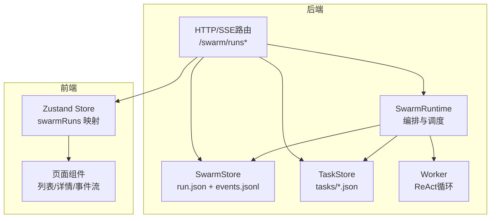
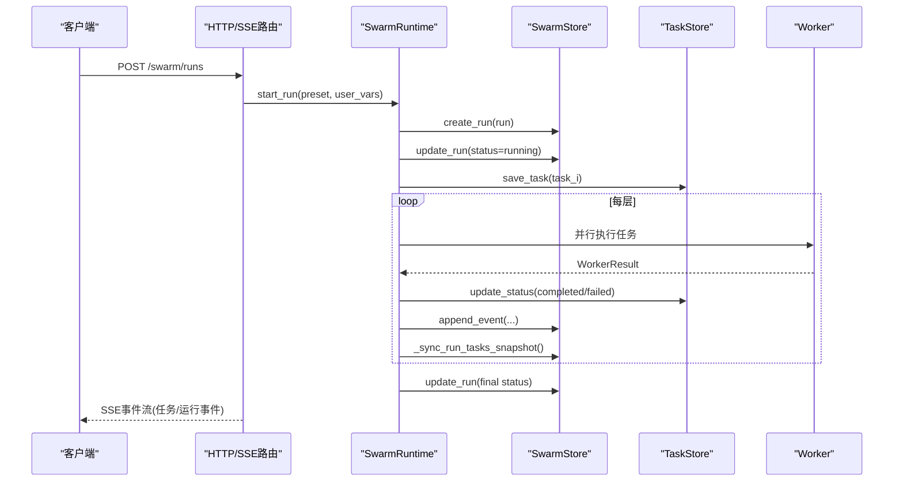
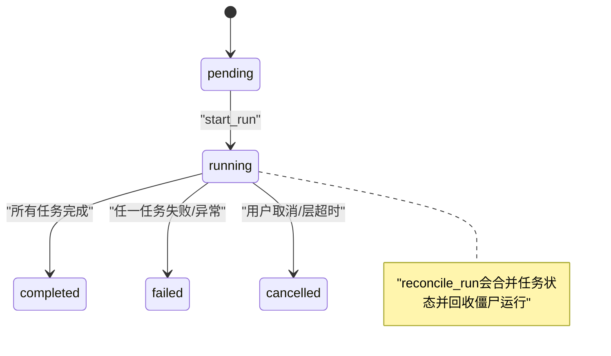
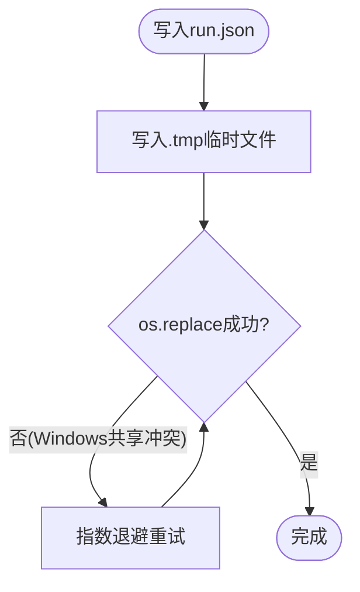
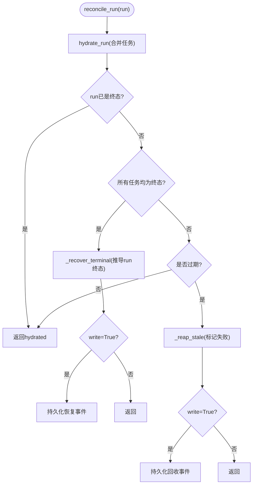
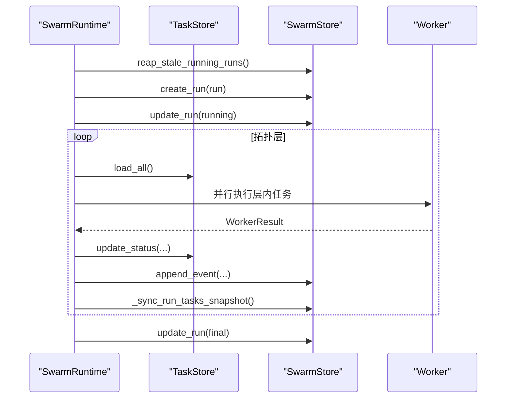
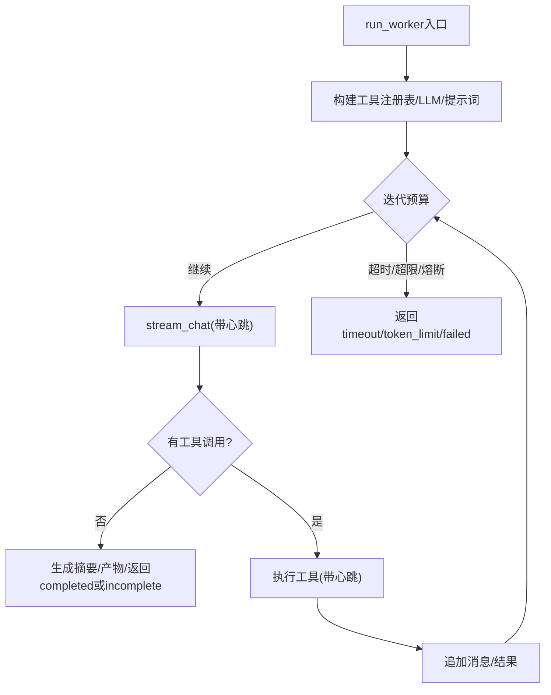
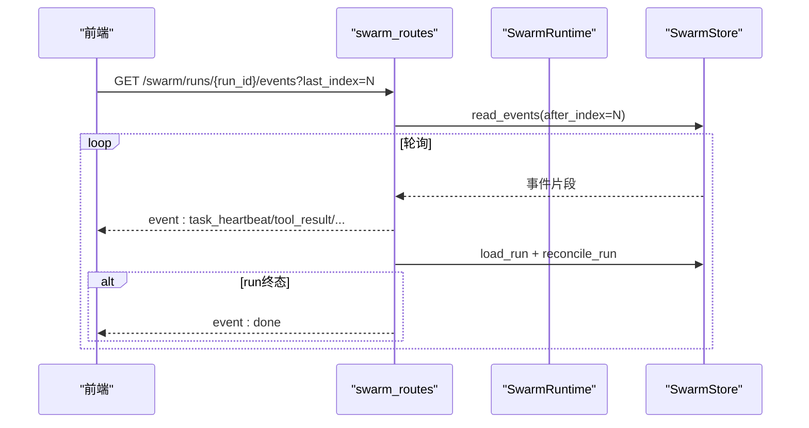
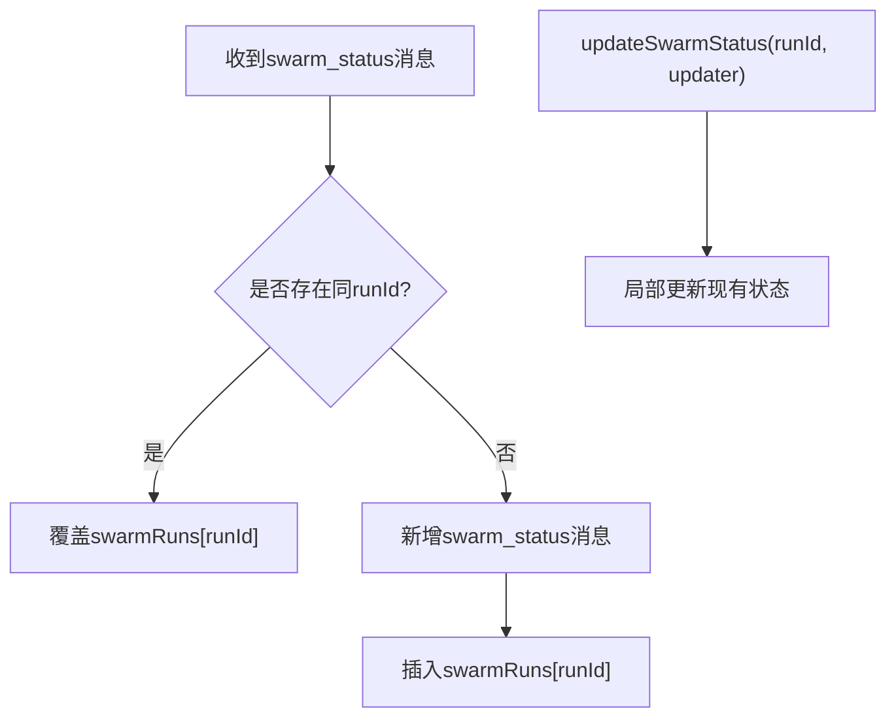
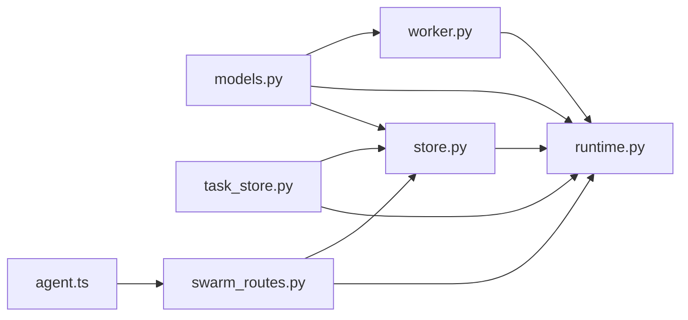

# Swarm运行状态管理

<cite>
**本文引用的文件**
- [agent/src/swarm/models.py](file://agent/src/swarm/models.py)
- [agent/src/swarm/store.py](file://agent/src/swarm/store.py)
- [agent/src/swarm/runtime.py](file://agent/src/swarm/runtime.py)
- [agent/src/swarm/task_store.py](file://agent/src/swarm/task_store.py)
- [agent/src/swarm/worker.py](file://agent/src/swarm/worker.py)
- [agent/src/api/swarm_routes.py](file://agent/src/api/swarm_routes.py)
- [frontend/src/stores/agent.ts](file://frontend/src/stores/agent.ts)
</cite>

## 目录
1. [简介](#简介)
2. [项目结构](#项目结构)
3. [核心组件](#核心组件)
4. [架构总览](#架构总览)
5. [详细组件分析](#详细组件分析)
6. [依赖关系分析](#依赖关系分析)
7. [性能与并发特性](#性能与并发特性)
8. [故障排除指南](#故障排除指南)
9. [结论](#结论)
10. [附录：API与事件速查](#附录api与事件速查)

## 简介
本文件面向 Vibe-Trading 研究页面的“Swarm运行状态管理系统”，系统性说明多Swarm实例的状态隔离、状态更新机制、持久化策略，以及与消息系统（SSE）的集成方式。重点覆盖以下主题：
- SwarmRunStatus 数据结构与生命周期
- 多Swarm实例的状态隔离（按run_id分目录、任务独立存储）
- 状态更新机制（reconcile_run、hydrate_run、原子写入、心跳检测）
- upsertSwarmStatus/updateSwarmStatus 在前端状态管理中的使用场景
- 状态持久化策略（run.json、events.jsonl、tasks/*.json）
- 运行监控、状态同步、冲突解决（Windows重命名重试、读取重试、幂等恢复）
- 调试与故障排除（SSE断线、僵尸运行、任务阻塞、超时与内容过滤）

## 项目结构
Swarm运行状态管理由后端运行时、持久化层、工作进程以及前端状态管理共同构成：
- 数据模型：定义运行、任务、事件、工作者结果等核心结构
- 持久化：基于文件系统，按run_id隔离；run.json为聚合快照，events.jsonl为追加日志，tasks/*.json为任务实时状态
- 运行时：编排DAG执行、并发调度、取消与重试、最终状态收敛
- 工作进程：轻量ReAct循环、工具调用、心跳上报、摘要与产物输出
- API路由：提供REST接口与SSE事件流，供前端查询与订阅
- 前端状态：维护swarmRuns映射，支持upsert/update以增量更新UI

图表来源
- [agent/src/swarm/runtime.py:49-148](file://agent/src/swarm/runtime.py#L49-L148)
- [agent/src/swarm/store.py:115-218](file://agent/src/swarm/store.py#L115-L218)
- [agent/src/swarm/task_store.py:16-110](file://agent/src/swarm/task_store.py#L16-L110)
- [agent/src/swarm/worker.py:297-758](file://agent/src/swarm/worker.py#L297-L758)
- [agent/src/api/swarm_routes.py:91-211](file://agent/src/api/swarm_routes.py#L91-L211)
- [frontend/src/stores/agent.ts:251-280](file://frontend/src/stores/agent.ts#L251-L280)

章节来源
- [agent/src/swarm/models.py:14-217](file://agent/src/swarm/models.py#L14-L217)
- [agent/src/swarm/store.py:115-566](file://agent/src/swarm/store.py#L115-L566)
- [agent/src/swarm/runtime.py:49-751](file://agent/src/swarm/runtime.py#L49-L751)
- [agent/src/swarm/task_store.py:16-249](file://agent/src/swarm/task_store.py#L16-L249)
- [agent/src/swarm/worker.py:297-758](file://agent/src/swarm/worker.py#L297-L758)
- [agent/src/api/swarm_routes.py:91-211](file://agent/src/api/swarm_routes.py#L91-L211)
- [frontend/src/stores/agent.ts:251-280](file://frontend/src/stores/agent.ts#L251-L280)

## 核心组件
- 数据模型
  - RunStatus：运行生命周期状态（pending/running/completed/failed/cancelled）
  - TaskStatus：任务生命周期状态（pending/blocked/in_progress/completed/failed/cancelled）
  - WorkerStatus：工作者返回的终态（completed/failed/timeout/token_limit/incomplete）
  - SwarmRun：一次Swarm运行的完整状态聚合根
  - SwarmTask：DAG中的一个任务节点
  - SwarmEvent：事件日志条目，用于SSE与审计
  - WorkerResult：工作者执行结果
- 持久化
  - SwarmStore：run.json原子写入、events.jsonl追加、reconcile_run收敛、stale检测与回收
  - TaskStore：任务级CRUD、依赖解析、拓扑分层
- 运行时
  - SwarmRuntime：启动运行、分层并行执行、取消、重试、最终报告聚合、事件发射
- 工作进程
  - Worker：轻量ReAct循环、工具调用、心跳、摘要与产物、内容过滤保护
- API
  - swarm_routes：创建/列举/获取运行、SSE事件流、取消/重试
- 前端
  - agent.ts store：swarmRuns映射、upsertSwarmStatus/updateSwarmStatus

章节来源
- [agent/src/swarm/models.py:14-217](file://agent/src/swarm/models.py#L14-L217)
- [agent/src/swarm/store.py:115-566](file://agent/src/swarm/store.py#L115-L566)
- [agent/src/swarm/task_store.py:16-249](file://agent/src/swarm/task_store.py#L16-L249)
- [agent/src/swarm/runtime.py:49-751](file://agent/src/swarm/runtime.py#L49-L751)
- [agent/src/swarm/worker.py:297-758](file://agent/src/swarm/worker.py#L297-L758)
- [agent/src/api/swarm_routes.py:91-211](file://agent/src/api/swarm_routes.py#L91-L211)
- [frontend/src/stores/agent.ts:251-280](file://frontend/src/stores/agent.ts#L251-L280)

## 架构总览
Swarm运行状态管理的整体流程如下：
- 启动：API接收请求，构建SwarmRun并持久化，标记为running，后台线程执行
- 执行：按拓扑分层并行执行任务，任务间通过依赖图与blocked_by协调
- 事件：每个关键阶段写入events.jsonl，并通过SSE推送给前端
- 收敛：层边界将任务快照回写run.json；结束时根据任务状态推导运行终态
- 恢复：reconcile_run在读取时合并任务实时状态、修复僵尸运行、回收超时无心跳的运行

图表来源
- [agent/src/api/swarm_routes.py:91-211](file://agent/src/api/swarm_routes.py#L91-L211)
- [agent/src/swarm/runtime.py:211-391](file://agent/src/swarm/runtime.py#L211-L391)
- [agent/src/swarm/store.py:159-218](file://agent/src/swarm/store.py#L159-L218)
- [agent/src/swarm/task_store.py:47-110](file://agent/src/swarm/task_store.py#L47-L110)
- [agent/src/swarm/worker.py:297-758](file://agent/src/swarm/worker.py#L297-L758)

## 详细组件分析

### 数据模型与状态机
- 运行状态机
  - pending → running → completed | failed | cancelled
- 任务状态机
  - pending → blocked → in_progress → completed | failed | cancelled
- 工作者返回状态
  - completed | failed | timeout | token_limit | incomplete
- SwarmRun关键字段
  - id、preset_name、status、user_vars、agents、tasks、created_at、completed_at、final_report、token计数、provider/model、grounding_data

图表来源
- [agent/src/swarm/models.py:14-41](file://agent/src/swarm/models.py#L14-L41)
- [agent/src/swarm/store.py:364-423](file://agent/src/swarm/store.py#L364-L423)

章节来源
- [agent/src/swarm/models.py:14-217](file://agent/src/swarm/models.py#L14-L217)

### 持久化与状态隔离
- 目录隔离：每个run_id对应一个独立目录，包含run.json、events.jsonl、tasks/、inboxes/、artifacts/
- 原子写入：run.json采用临时文件+rename，Windows下对共享冲突进行重试
- 事件追加：events.jsonl仅追加，支持offset读取用于SSE增量拉取
- 任务实时性：tasks/*.json为任务真实状态源；read路径通过hydrate_run合并到run.tasks
- 读取容错：load_run在并发写入期间可能读到半写文件，带重试与错误脱敏

图表来源
- [agent/src/swarm/store.py:94-113](file://agent/src/swarm/store.py#L94-L113)
- [agent/src/swarm/store.py:159-218](file://agent/src/swarm/store.py#L159-L218)
- [agent/src/swarm/store.py:555-566](file://agent/src/swarm/store.py#L555-L566)

章节来源
- [agent/src/swarm/store.py:115-566](file://agent/src/swarm/store.py#L115-L566)
- [agent/src/swarm/task_store.py:16-110](file://agent/src/swarm/task_store.py#L16-L110)

### 状态更新与收敛（reconcile_run/hydrate_run）
- hydrate_run：从tasks/*.json加载最新任务状态，合并到run.tasks，保证读路径看到实时进度
- reconcile_run：三层转换
  1) 合并任务实时状态
  2) 终端恢复：若所有任务已终态但run仍running，则推导run终态并填充final_report
  3) 过期回收：若running且超过心跳阈值无事件，则将非终态任务置failed，run置failed
- write参数控制是否落盘：list_runs可只读不写，避免频繁磁盘IO

图表来源
- [agent/src/swarm/store.py:286-423](file://agent/src/swarm/store.py#L286-L423)

章节来源
- [agent/src/swarm/store.py:286-423](file://agent/src/swarm/store.py#L286-L423)

### 运行编排与并发（SwarmRuntime）
- start_run：清理僵尸运行、构建run、验证DAG、捕获provider/model、持久化、后台线程执行
- 执行循环：按拓扑分层，层内并行，层间串行；记录token累计、任务摘要、事件
- 取消与重试：支持cancel_run；任务失败自动重试（按max_retries），累积token
- 层边界快照：将tasks/*.json回写到run.json，减少读路径I/O压力
- 预取grounding：在运行前抓取OHLCV数据，期间持续心跳避免误判过期

图表来源
- [agent/src/swarm/runtime.py:86-148](file://agent/src/swarm/runtime.py#L86-L148)
- [agent/src/swarm/runtime.py:211-391](file://agent/src/swarm/runtime.py#L211-L391)
- [agent/src/swarm/runtime.py:465-634](file://agent/src/swarm/runtime.py#L465-L634)

章节来源
- [agent/src/swarm/runtime.py:49-751](file://agent/src/swarm/runtime.py#L49-L751)

### 工作者与心跳（Worker）
- ReAct循环：最多迭代次数、超时、token估算、内容过滤熔断
- 工具调用：带心跳包装，确保events.jsonl尾部活跃，避免被误判为僵尸
- 摘要与产物：最终输出report.md与summary，收集artifact_paths
- 事件：worker_started/worker_completed/worker_failed/worker_timeout/worker_token_limit/worker_incomplete/tool_call/tool_result等

图表来源
- [agent/src/swarm/worker.py:297-758](file://agent/src/swarm/worker.py#L297-L758)

章节来源
- [agent/src/swarm/worker.py:297-758](file://agent/src/swarm/worker.py#L297-L758)

### API与SSE事件流
- 创建运行：POST /swarm/runs，返回id、status、preset_name
- 列举运行：GET /swarm/runs，返回最近N条，每条reconcile后附带is_stale
- 运行详情：GET /swarm/runs/{run_id}，返回agents/tasks/任务状态等
- 事件流：GET /swarm/runs/{run_id}/events，SSE增量推送，支持Last-Event-ID
- 取消/重试：POST /swarm/runs/{run_id}/cancel 与 /retry

图表来源
- [agent/src/api/swarm_routes.py:169-211](file://agent/src/api/swarm_routes.py#L169-L211)
- [agent/src/swarm/store.py:246-284](file://agent/src/swarm/store.py#L246-L284)

章节来源
- [agent/src/api/swarm_routes.py:91-260](file://agent/src/api/swarm_routes.py#L91-L260)

### 前端状态管理：upsertSwarmStatus与updateSwarmStatus
- upsertSwarmStatus：当收到swarm_status消息时，若存在同runId则覆盖；否则新增一条swarm_status消息并插入swarmRuns映射
- updateSwarmStatus：针对已有runId的状态进行局部更新（如任务进度、运行状态变更）
- 典型用法：SSE事件到达后，解析事件类型并调用上述方法更新store，驱动UI刷新

图表来源
- [frontend/src/stores/agent.ts:251-280](file://frontend/src/stores/agent.ts#L251-L280)

章节来源
- [frontend/src/stores/agent.ts:251-280](file://frontend/src/stores/agent.ts#L251-L280)

## 依赖关系分析
- 模块耦合
  - runtime依赖store、task_store、worker、models、presets、tools.mcp
  - store依赖models、task_store、config.accessor
  - worker依赖models、tools、providers、agent.progress、agent.skills
  - routes依赖runtime、store、models、serialization
  - 前端store依赖后端SSE事件，映射到swarmRuns
- 外部依赖
  - FastAPI、SSE、ThreadPoolExecutor、Pydantic、文件系统原子操作

图表来源
- [agent/src/swarm/runtime.py:25-44](file://agent/src/swarm/runtime.py#L25-L44)
- [agent/src/swarm/store.py:21-24](file://agent/src/swarm/store.py#L21-L24)
- [agent/src/swarm/worker.py:16-36](file://agent/src/swarm/worker.py#L16-L36)
- [agent/src/api/swarm_routes.py:18-35](file://agent/src/api/swarm_routes.py#L18-L35)
- [frontend/src/stores/agent.ts:251-280](file://frontend/src/stores/agent.ts#L251-L280)

章节来源
- [agent/src/swarm/runtime.py:25-44](file://agent/src/swarm/runtime.py#L25-L44)
- [agent/src/swarm/store.py:21-24](file://agent/src/swarm/store.py#L21-L24)
- [agent/src/swarm/worker.py:16-36](file://agent/src/swarm/worker.py#L16-L36)
- [agent/src/api/swarm_routes.py:18-35](file://agent/src/api/swarm_routes.py#L18-L35)
- [frontend/src/stores/agent.ts:251-280](file://frontend/src/stores/agent.ts#L251-L280)

## 性能与并发特性
- 并发模型
  - 层内任务并行（ThreadPoolExecutor），层间串行
  - 最大并发受_max_workers限制
- I/O优化
  - 层边界批量回写run.json，降低频繁单任务写入开销
  - events.jsonl仅追加，SSE按offset增量读取
- 稳定性
  - Windows共享冲突重试（os.replace）
  - 读取重试应对并发写入导致的半写文件
  - 心跳机制避免长耗时操作（grounding、LLM流、工具调用）被误判为僵尸
- 资源控制
  - 任务超时、迭代上限、token估算上限
  - 内容过滤熔断防止无限循环

[本节为通用指导，无需特定文件引用]

## 故障排除指南
- 运行卡在running
  - 检查events.jsonl是否有心跳；若无，可能被reconcile_run回收为failed
  - 查看任务blocked_by是否为空，上游未完成会导致下游blocked
  - 参考reconcile_run与compute_stale_threshold逻辑定位问题
- SSE断线或丢失事件
  - 使用Last-Event-ID或last_index续传；服务端会按offset返回后续事件
  - 若run缺失或终态，会发送done事件
- 任务失败或超时
  - 查看task.error与WorkerResult.status；区分timeout、token_limit、incomplete
  - 检查工具调用是否触发内容过滤熔断
- 僵尸运行
  - 使用reap_stale_running_runs或reconcile_run进行清理；确认心跳配置合理
- 前端状态不同步
  - 确认upsertSwarmStatus/updateSwarmStatus正确调用；核对swarmRuns映射键为runId

章节来源
- [agent/src/swarm/store.py:315-423](file://agent/src/swarm/store.py#L315-L423)
- [agent/src/api/swarm_routes.py:169-211](file://agent/src/api/swarm_routes.py#L169-L211)
- [agent/src/swarm/runtime.py:465-634](file://agent/src/swarm/runtime.py#L465-L634)
- [agent/src/swarm/worker.py:416-758](file://agent/src/swarm/worker.py#L416-L758)
- [frontend/src/stores/agent.ts:251-280](file://frontend/src/stores/agent.ts#L251-L280)

## 结论
Swarm运行状态管理系统通过清晰的数据模型、严格的持久化策略、健壮的收敛与恢复机制，实现了多Swarm实例的安全隔离与可靠执行。结合SSE事件流与前端状态管理，提供了实时、一致、可观测的运行体验。建议在生产环境中：
- 保持心跳配置合理，避免误判僵尸运行
- 关注reconcile_run的恢复事件，及时排查异常
- 利用SSE断点续传与任务状态字段进行前端健壮性处理
- 定期巡检events.jsonl与tasks/*.json，辅助定位复杂问题

[本节为总结，无需特定文件引用]

## 附录：API与事件速查
- REST
  - POST /swarm/runs：创建运行
  - GET /swarm/runs：列举运行（含is_stale）
  - GET /swarm/runs/{run_id}：运行详情（含任务状态）
  - POST /swarm/runs/{run_id}/cancel：取消运行
  - POST /swarm/runs/{run_id}/retry：重试失败/过期/取消的运行
- SSE
  - GET /swarm/runs/{run_id}/events：增量事件流，支持Last-Event-ID
- 常见事件
  - run_started、layer_started、task_started、task_completed、task_failed、task_blocked、task_retry、run_completed、run_error、done
  - task_heartbeat、tool_call、tool_result、worker_text、content_filter_skipped、content_filter_circuit_breaker

章节来源
- [agent/src/api/swarm_routes.py:91-260](file://agent/src/api/swarm_routes.py#L91-L260)
- [agent/src/swarm/runtime.py:166-209](file://agent/src/swarm/runtime.py#L166-L209)
- [agent/src/swarm/worker.py:80-109](file://agent/src/swarm/worker.py#L80-L109)