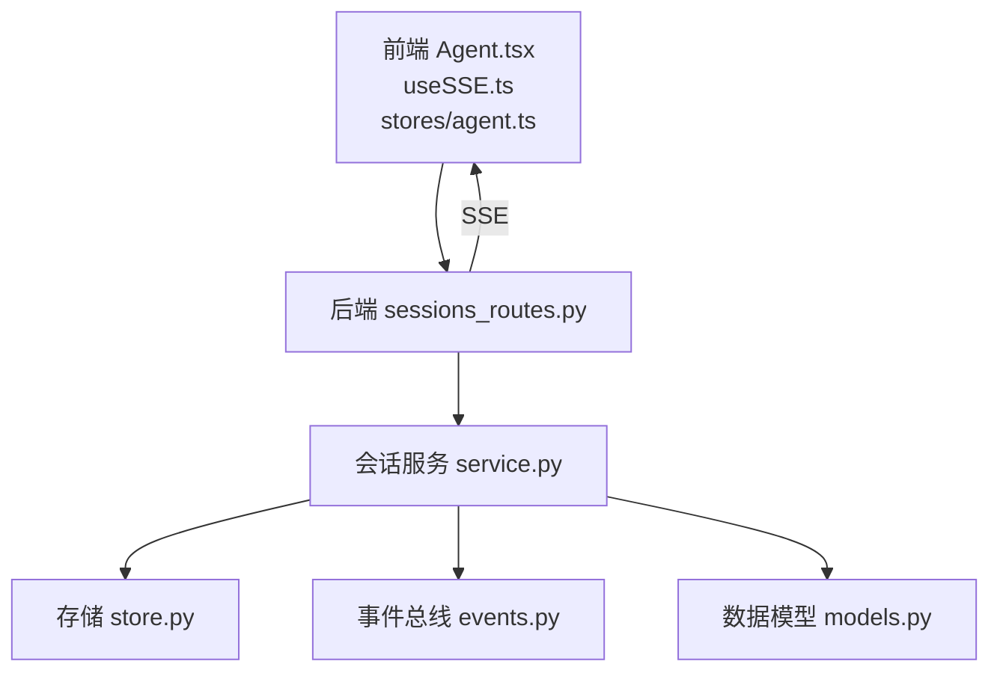
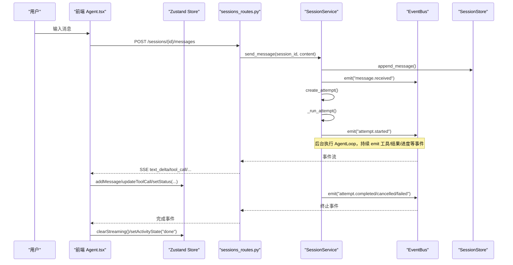
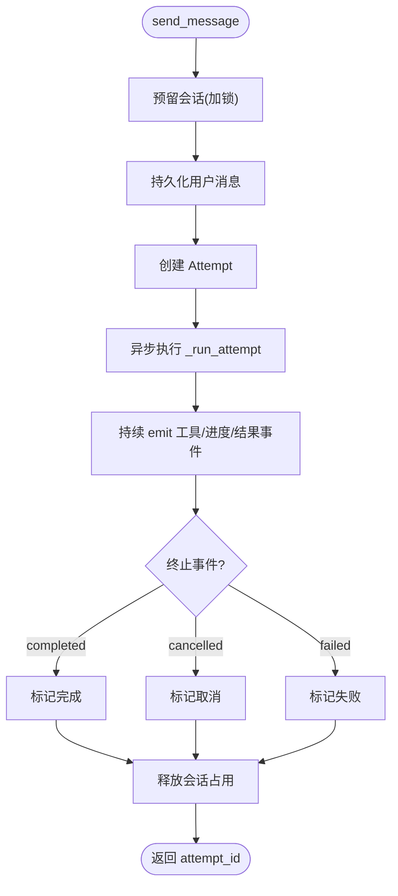
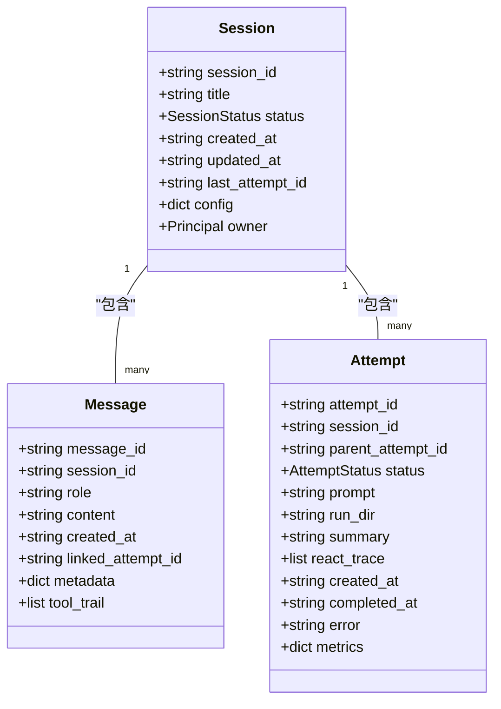
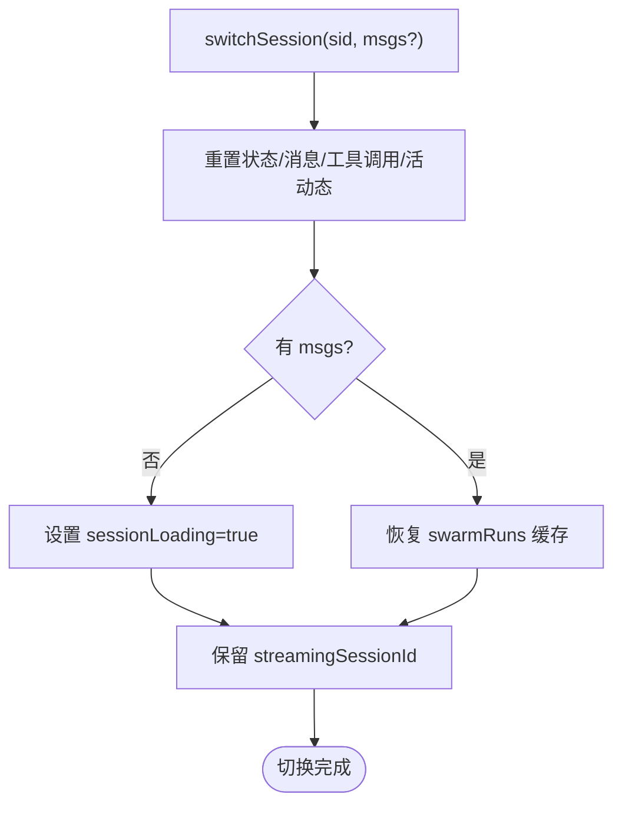
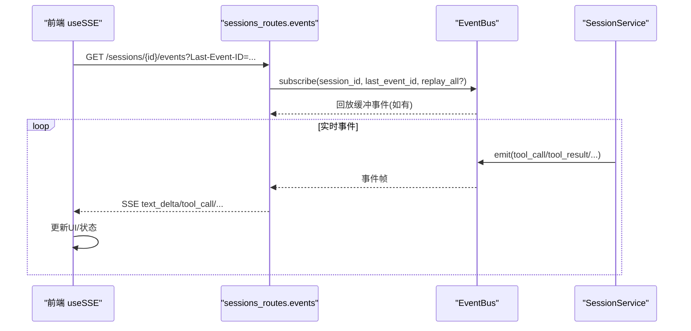
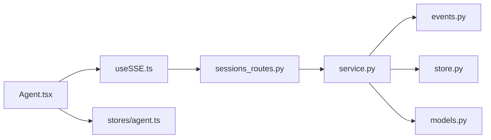

# 会话状态管理

<cite>
**本文引用的文件**
- [agent/src/session/service.py](file://agent/src/session/service.py)
- [agent/src/api/sessions_routes.py](file://agent/src/api/sessions_routes.py)
- [agent/src/session/store.py](file://agent/src/session/store.py)
- [agent/src/session/events.py](file://agent/src/session/events.py)
- [agent/src/session/models.py](file://agent/src/session/models.py)
- [frontend/src/stores/agent.ts](file://frontend/src/stores/agent.ts)
- [frontend/src/hooks/useSSE.ts](file://frontend/src/hooks/useSSE.ts)
- [frontend/src/pages/Agent.tsx](file://frontend/src/pages/Agent.tsx)
</cite>

## 目录
1. [简介](#简介)
2. [项目结构](#项目结构)
3. [核心组件](#核心组件)
4. [架构总览](#架构总览)
5. [详细组件分析](#详细组件分析)
6. [依赖关系分析](#依赖关系分析)
7. [性能考量](#性能考量)
8. [故障排查指南](#故障排查指南)
9. [结论](#结论)
10. [附录](#附录)

## 简介
本文件面向 Vibe-Trading 研究页面的“会话状态管理”，聚焦以下目标：
- 会话生命周期管理（创建、运行、取消、结束）
- 消息历史存储与加载（持久化、分页、恢复）
- 会话切换机制（前端缓存、侧边栏 spinner 保持）
- 会话缓存策略（SESSION_CACHE_MAX）、会话 ID 管理
- 消息加载与同步机制（REST + SSE）
- 会话状态与后端 SSE 连接的关联（streamingSessionId 维护）
- 会话持久化、恢复机制与错误处理策略
- 最佳实践与性能优化建议

## 项目结构
前后端围绕“会话”形成清晰分层：
- 前端
  - 状态管理：Zustand store 负责会话消息、活动态、SSE 连接状态、流式会话标识等
  - SSE Hook：自动重连、去重、Last-Event-ID 续传
  - 页面组件：组装消息分组、工具调用时间线、Swarm/Goal 事件渲染
- 后端
  - API 路由：会话 CRUD、发送消息、取消、获取消息、SSE 事件流
  - 会话服务：编排执行、并发控制、事件总线、指标收集
  - 存储层：文件系统持久化（session.json、messages.jsonl、attempts）
  - 事件总线：线程安全、缓冲、回放、心跳
  - 数据模型：Session、Message、Attempt、状态枚举

图表来源
- [frontend/src/pages/Agent.tsx:1-200](file://frontend/src/pages/Agent.tsx#L1-L200)
- [frontend/src/hooks/useSSE.ts:1-216](file://frontend/src/hooks/useSSE.ts#L1-L216)
- [frontend/src/stores/agent.ts:1-336](file://frontend/src/stores/agent.ts#L1-L336)
- [agent/src/api/sessions_routes.py:1-800](file://agent/src/api/sessions_routes.py#L1-L800)
- [agent/src/session/service.py:1-605](file://agent/src/session/service.py#L1-L605)
- [agent/src/session/store.py:1-259](file://agent/src/session/store.py#L1-L259)
- [agent/src/session/events.py:1-240](file://agent/src/session/events.py#L1-L240)
- [agent/src/session/models.py:1-342](file://agent/src/session/models.py#L1-L342)

章节来源
- [frontend/src/pages/Agent.tsx:1-200](file://frontend/src/pages/Agent.tsx#L1-L200)
- [frontend/src/hooks/useSSE.ts:1-216](file://frontend/src/hooks/useSSE.ts#L1-L216)
- [frontend/src/stores/agent.ts:1-336](file://frontend/src/stores/agent.ts#L1-L336)
- [agent/src/api/sessions_routes.py:1-800](file://agent/src/api/sessions_routes.py#L1-L800)
- [agent/src/session/service.py:1-605](file://agent/src/session/service.py#L1-L605)
- [agent/src/session/store.py:1-259](file://agent/src/session/store.py#L1-L259)
- [agent/src/session/events.py:1-240](file://agent/src/session/events.py#L1-L240)
- [agent/src/session/models.py:1-342](file://agent/src/session/models.py#L1-L342)

## 核心组件
- 前端状态管理（Zustand）
  - 会话消息列表、当前会话 ID、运行状态、流式文本、推理尾部
  - streamingSessionId：标记后端正在流式处理的会话，跨切换保留以维持侧边栏 spinner
  - 会话缓存 Map：按会话 ID 缓存消息与 Swarm 状态，限制最大条目数
  - SSE 连接状态与重试次数
  - 工具调用与活动态追踪
- 后端会话服务
  - 会话创建、查询、删除、列表
  - 发送消息并触发执行（含并发保护）
  - 取消当前运行
  - 获取消息历史
  - 通过事件总线广播 attempt 生命周期事件
- 存储层
  - session.json 元信息
  - messages.jsonl 追加日志（带 fsync）
  - attempts/{attempt_id}/attempt.json 执行尝试记录
- 事件总线
  - 线程安全发布、订阅、缓冲、回放、心跳
- 数据模型
  - Session、Message、Attempt 及状态枚举

章节来源
- [frontend/src/stores/agent.ts:1-336](file://frontend/src/stores/agent.ts#L1-L336)
- [agent/src/session/service.py:1-605](file://agent/src/session/service.py#L1-L605)
- [agent/src/session/store.py:1-259](file://agent/src/session/store.py#L1-L259)
- [agent/src/session/events.py:1-240](file://agent/src/session/events.py#L1-L240)
- [agent/src/session/models.py:1-342](file://agent/src/session/models.py#L1-L342)

## 架构总览
下图展示从用户输入到 SSE 推送的端到端流程，以及前端如何基于事件更新 UI 与状态。

图表来源
- [frontend/src/pages/Agent.tsx:1-200](file://frontend/src/pages/Agent.tsx#L1-L200)
- [frontend/src/hooks/useSSE.ts:1-216](file://frontend/src/hooks/useSSE.ts#L1-L216)
- [frontend/src/stores/agent.ts:1-336](file://frontend/src/stores/agent.ts#L1-L336)
- [agent/src/api/sessions_routes.py:697-800](file://agent/src/api/sessions_routes.py#L697-L800)
- [agent/src/session/service.py:158-345](file://agent/src/session/service.py#L158-L345)
- [agent/src/session/events.py:127-240](file://agent/src/session/events.py#L127-L240)

## 详细组件分析

### 会话生命周期管理（后端）
- 创建会话：生成唯一 session_id，写入 session.json，建立搜索索引，发出 session.created 事件
- 发送消息：
  - 先预留会话（防止同一会话并发执行）
  - 持久化用户消息，索引消息，发出 message.received
  - 创建 Attempt，设置 include_shell_tools，更新 last_attempt_id
  - 异步执行 _run_attempt，期间持续 emit 工具调用、结果、进度等事件
- 取消执行：
  - 若已有 AgentLoop，则 cancel；否则取消构建阶段的 Task，释放占用
- 执行完成：
  - 根据结果标记 Attempt 为 completed/cancelled/failed
  - 写出最终 assistant 消息与 tool_trail，emit 终止事件
- 并发控制：
  - 使用线程锁保护的 in-flight 集合，保证单会话单执行
  - 任务级取消确保异常路径也能释放占用

图表来源
- [agent/src/session/service.py:158-345](file://agent/src/session/service.py#L158-L345)

章节来源
- [agent/src/session/service.py:118-345](file://agent/src/session/service.py#L118-L345)

### 消息历史存储与加载
- 存储格式
  - session.json：会话元信息（ID、标题、状态、时间戳、配置、所有者）
  - messages.jsonl：追加日志，每条消息一行 JSON，写入后 fsync
  - attempts/{attempt_id}/attempt.json：执行尝试详情
- 读取策略
  - get_messages 支持 limit，默认最近 100 条
  - 读取时跳过损坏行并记录警告，避免中断整个列表
- 恢复与回放
  - 首次连接 REST 拉取历史
  - SSE 支持 Last-Event-ID 续传；active run 可 replay_all 补全缓冲事件

图表来源
- [agent/src/session/models.py:140-342](file://agent/src/session/models.py#L140-L342)
- [agent/src/session/store.py:16-259](file://agent/src/session/store.py#L16-L259)

章节来源
- [agent/src/session/store.py:57-193](file://agent/src/session/store.py#L57-L193)
- [agent/src/session/models.py:140-342](file://agent/src/session/models.py#L140-L342)

### 会话切换机制与前端缓存
- 会话切换
  - switchSession(sid, msgs?)：重置消息、状态、工具调用、活动态
  - 若传入 msgs，则恢复 swarmRuns 缓存；否则置 sessionLoading=true
  - 保留 streamingSessionId，使侧边栏 spinner 在切换时不消失
- 会话缓存策略
  - _sessionCache：Map<sessionId, StoredAgentMessage[]>
  - _swarmSessionCache：Map<sessionId, Record<string, SwarmRunStatus>>
  - SESSION_CACHE_MAX=5：超过上限时淘汰最旧会话缓存
- 消息加载
  - 切换时优先使用缓存；若无则进入 loading，后续由 SSE/REST 填充
- 流式会话标识
  - setStatus("streaming") 且存在 sessionId 时，设置 streamingSessionId
  - 离开 streaming 且等于当前 sessionId 时清空

图表来源
- [frontend/src/stores/agent.ts:307-323](file://frontend/src/stores/agent.ts#L307-L323)
- [frontend/src/stores/agent.ts:282-297](file://frontend/src/stores/agent.ts#L282-L297)
- [frontend/src/stores/agent.ts:139-148](file://frontend/src/stores/agent.ts#L139-L148)

章节来源
- [frontend/src/stores/agent.ts:4-11](file://frontend/src/stores/agent.ts#L4-L11)
- [frontend/src/stores/agent.ts:57-59](file://frontend/src/stores/agent.ts#L57-L59)
- [frontend/src/stores/agent.ts:139-148](file://frontend/src/stores/agent.ts#L139-L148)
- [frontend/src/stores/agent.ts:282-323](file://frontend/src/stores/agent.ts#L282-L323)

### SSE 连接与会话状态关联
- 前端 useSSE
  - 自动重连、指数退避、LRU 去重、Last-Event-ID 续传
  - 仅订阅已知事件类型，降低无效处理
  - 认证模式下先申请一次性 ticket 再连接
- 后端事件总线
  - 线程安全 publish/subscribe，缓冲上限，超时心跳
  - 支持 replay(last_event_id, replay_all) 用于活跃运行恢复
- 关联逻辑
  - 前端在收到 attempt.* 事件时更新 Zustand 状态
  - streamingSessionId 与后端 attempt 生命周期一致：开始流式时设置，结束时清理

图表来源
- [frontend/src/hooks/useSSE.ts:1-216](file://frontend/src/hooks/useSSE.ts#L1-L216)
- [agent/src/api/sessions_routes.py:752-800](file://agent/src/api/sessions_routes.py#L752-L800)
- [agent/src/session/events.py:127-240](file://agent/src/session/events.py#L127-L240)
- [agent/src/session/service.py:385-416](file://agent/src/session/service.py#L385-L416)

章节来源
- [frontend/src/hooks/useSSE.ts:1-216](file://frontend/src/hooks/useSSE.ts#L1-L216)
- [agent/src/api/sessions_routes.py:752-800](file://agent/src/api/sessions_routes.py#L752-L800)
- [agent/src/session/events.py:1-240](file://agent/src/session/events.py#L1-L240)

### 会话 ID 管理与错误处理
- 会话 ID
  - 后端 Session.session_id 使用 UUID 片段，全局唯一
  - 前端通过 Zustand 的 sessionId 字段跟踪当前会话
- 错误处理
  - 后端：
    - SessionBusyError：并发冲突，HTTP 409
    - ValueError：会话不存在，HTTP 404
    - 异常路径统一标记 Attempt 失败并 emit 终止事件
  - 前端：
    - SSE 断线自动重连，携带 Last-Event-ID 续传
    - 事件去重避免重复渲染
    - 状态机：idle/streaming/error，配合 activity 状态机（thinking/working/responding/stopped/timeout/failed/done）

章节来源
- [agent/src/session/models.py:140-166](file://agent/src/session/models.py#L140-L166)
- [agent/src/session/service.py:43-117](file://agent/src/session/service.py#L43-L117)
- [agent/src/api/sessions_routes.py:697-728](file://agent/src/api/sessions_routes.py#L697-L728)
- [frontend/src/hooks/useSSE.ts:122-174](file://frontend/src/hooks/useSSE.ts#L122-L174)
- [frontend/src/stores/agent.ts:6-13](file://frontend/src/stores/agent.ts#L6-L13)

### 会话持久化与恢复机制
- 持久化
  - 所有消息追加到 messages.jsonl，写入后立即 flush/fsync
  - Attempt 状态变更写回 attempt.json
- 恢复
  - 首次加载通过 REST 获取历史
  - SSE 支持 Last-Event-ID 续传；对 active run 可 replay_all 补全缓冲
  - 前端缓存会话消息与 Swarm 状态，切换时快速恢复

章节来源
- [agent/src/session/store.py:151-193](file://agent/src/session/store.py#L151-L193)
- [agent/src/session/events.py:151-183](file://agent/src/session/events.py#L151-L183)
- [frontend/src/stores/agent.ts:282-323](file://frontend/src/stores/agent.ts#L282-L323)

### 最佳实践与性能优化建议
- 前端
  - 合理设置 SESSION_CACHE_MAX（默认 5），平衡内存与切换体验
  - 使用 streamingSessionId 保持侧边栏 spinner，提升感知连续性
  - 利用 SSE 去重与 Last-Event-ID 减少重复渲染与网络开销
  - 批量更新 UI（如节流 stream delta 刷新间隔）
- 后端
  - 控制消息历史裁剪（MAX_HISTORY_CHARS）以降低 LLM 上下文压力
  - 使用线程池限制并发 agent 数量，避免资源耗尽
  - 事件缓冲上限与队列满丢弃策略，保障稳定性
  - 对损坏数据行宽容处理，避免单点故障影响整体可用性

[本节为通用指导，不直接分析具体文件]

## 依赖关系分析
- 前端依赖
  - Agent.tsx 依赖 useSSE 进行事件接收与重连
  - Agent.tsx 依赖 Zustand store 管理消息、状态、缓存
- 后端依赖
  - sessions_routes 依赖 SessionService 提供业务逻辑
  - SessionService 依赖 EventBus 广播事件、SessionStore 持久化、models 定义数据结构
  - EventBus 依赖 asyncio 事件循环实现线程安全发布

图表来源
- [frontend/src/pages/Agent.tsx:1-200](file://frontend/src/pages/Agent.tsx#L1-L200)
- [frontend/src/hooks/useSSE.ts:1-216](file://frontend/src/hooks/useSSE.ts#L1-L216)
- [frontend/src/stores/agent.ts:1-336](file://frontend/src/stores/agent.ts#L1-L336)
- [agent/src/api/sessions_routes.py:1-800](file://agent/src/api/sessions_routes.py#L1-L800)
- [agent/src/session/service.py:1-605](file://agent/src/session/service.py#L1-L605)
- [agent/src/session/events.py:1-240](file://agent/src/session/events.py#L1-L240)
- [agent/src/session/store.py:1-259](file://agent/src/session/store.py#L1-L259)
- [agent/src/session/models.py:1-342](file://agent/src/session/models.py#L1-L342)

章节来源
- [frontend/src/pages/Agent.tsx:1-200](file://frontend/src/pages/Agent.tsx#L1-L200)
- [frontend/src/hooks/useSSE.ts:1-216](file://frontend/src/hooks/useSSE.ts#L1-L216)
- [frontend/src/stores/agent.ts:1-336](file://frontend/src/stores/agent.ts#L1-L336)
- [agent/src/api/sessions_routes.py:1-800](file://agent/src/api/sessions_routes.py#L1-L800)
- [agent/src/session/service.py:1-605](file://agent/src/session/service.py#L1-L605)
- [agent/src/session/events.py:1-240](file://agent/src/session/events.py#L1-L240)
- [agent/src/session/store.py:1-259](file://agent/src/session/store.py#L1-L259)
- [agent/src/session/models.py:1-342](file://agent/src/session/models.py#L1-L342)

## 性能考量
- 前端
  - 流式文本增量拼接与节流刷新，避免频繁重绘
  - 会话缓存限制大小，及时淘汰旧会话，控制内存
  - SSE 去重与 Last-Event-ID 减少重复事件处理
- 后端
  - 消息历史裁剪至字符预算，降低 LLM 上下文成本
  - 线程池限制并发 agent，避免阻塞与资源争用
  - 事件缓冲上限与队列满丢弃，保障高负载稳定性
  - 写入消息时 fsync，确保数据一致性但需权衡 I/O 开销

[本节为通用指导，不直接分析具体文件]

## 故障排查指南
- 常见问题
  - 会话忙（409）：同一会话并发发送消息，等待或取消当前运行
  - 会话不存在（404）：检查 session_id 是否正确
  - SSE 断线：查看浏览器网络面板，确认 Last-Event-ID 续传是否生效
  - 消息丢失：检查 messages.jsonl 是否有损坏行，后端会跳过并记录警告
- 定位步骤
  - 前端：打开控制台，观察 useSSE 的重连日志与事件去重
  - 后端：查看事件总线缓冲与队列满告警，确认事件是否被丢弃
  - 存储：检查 session.json、messages.jsonl、attempt.json 完整性

章节来源
- [agent/src/api/sessions_routes.py:697-728](file://agent/src/api/sessions_routes.py#L697-L728)
- [agent/src/session/store.py:174-193](file://agent/src/session/store.py#L174-L193)
- [agent/src/session/events.py:104-126](file://agent/src/session/events.py#L104-L126)
- [frontend/src/hooks/useSSE.ts:122-174](file://frontend/src/hooks/useSSE.ts#L122-L174)

## 结论
Vibe-Trading 研究页面的会话状态管理通过前后端协作实现了完整的生命周期管理：
- 后端以 SessionService 为核心，结合 EventBus 与 SessionStore，提供可靠的执行编排与持久化
- 前端以 Zustand 管理会话状态与缓存，useSSE 提供健壮的事件流连接与恢复
- 通过 streamingSessionId、会话缓存、Last-Event-ID 续传等手段，提升了用户体验与系统韧性
- 建议在大规模场景下进一步优化历史裁剪策略、事件缓冲与前端渲染节流

[本节为总结性内容，不直接分析具体文件]

## 附录
- 关键常量与配置
  - SESSION_CACHE_MAX：前端会话缓存上限（默认 5）
  - MAX_HISTORY_CHARS：后端消息历史裁剪字符预算
  - SSE 重连参数：initialRetryMs、maxRetryMs、backoffFactor、dedupeCapacity
- 事件类型参考
  - 前端订阅：text_delta、reasoning_delta、stream_reset、thinking_done、tool_call、tool_result、compact、tool_heartbeat、tool_progress、llm_usage、swarm.started、swarm.event、attempt.created、attempt.started、attempt.completed、attempt.failed、attempt.cancelled、message.received、session.created、goal.created、goal.evidence、goal.updated、mandate.proposal、mandate.committed、live.halted、live.resumed、live.action、heartbeat、done

[本节为补充信息，不直接分析具体文件]