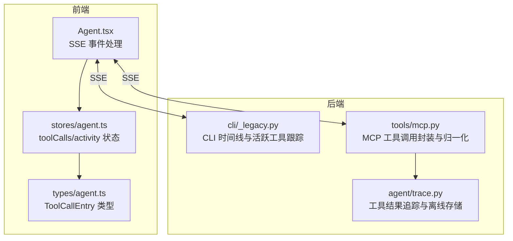
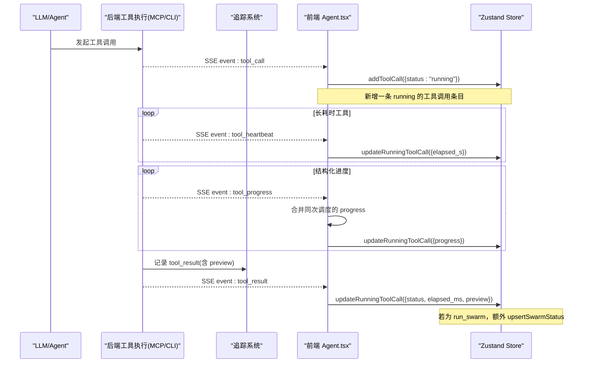
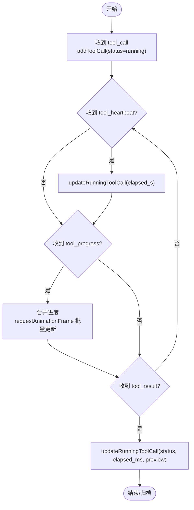
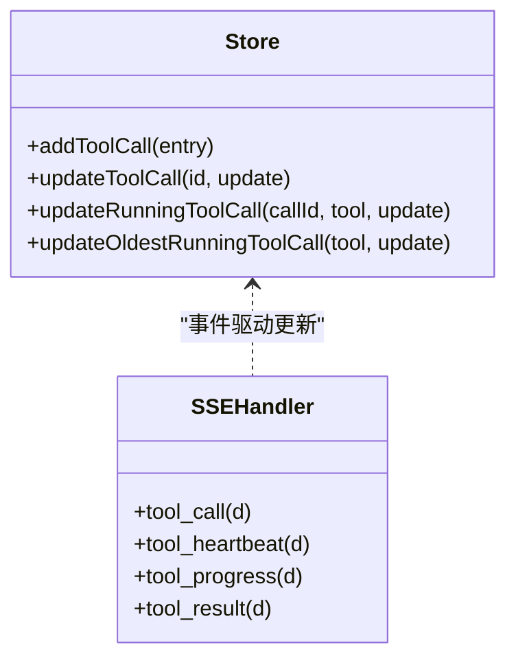
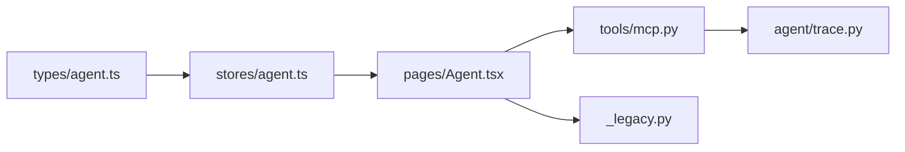

# 工具调用管理

<cite>
**本文引用的文件**
- [frontend/src/stores/agent.ts](file://frontend/src/stores/agent.ts)
- [frontend/src/types/agent.ts](file://frontend/src/types/agent.ts)
- [frontend/src/pages/Agent.tsx](file://frontend/src/pages/Agent.tsx)
- [agent/cli/_legacy.py](file://agent/cli/_legacy.py)
- [agent/src/tools/mcp.py](file://agent/src/tools/mcp.py)
- [agent/src/agent/trace.py](file://agent/src/agent/trace.py)
- [agent/tests/test_agent_loop_dsml_tool_calls.py](file://agent/tests/test_agent_loop_dsml_tool_calls.py)
- [agent/tests/test_mcp_client_adapter.py](file://agent/tests/test_mcp_client_adapter.py)
</cite>

## 目录
1. [简介](#简介)
2. [项目结构](#项目结构)
3. [核心组件](#核心组件)
4. [架构总览](#架构总览)
5. [详细组件分析](#详细组件分析)
6. [依赖关系分析](#依赖关系分析)
7. [性能考量](#性能考量)
8. [故障排查指南](#故障排查指南)
9. [结论](#结论)
10. [附录](#附录)

## 简介
本文件面向 Vibe-Trading 研究页面的“工具调用管理系统”，聚焦前端状态管理与后端事件流如何协作，完成工具调用的全生命周期管理。文档涵盖：
- ToolCallEntry 数据结构与字段语义
- 工具调用生命周期（创建、运行、进度、完成、错误）
- 运行状态管理与并发处理策略
- addToolCall、updateToolCall、updateRunningToolCall 等核心方法的实现逻辑
- 状态同步、错误恢复机制
- 工具调用追踪、性能监控、调试工具使用指南
- 自定义工具调用的集成方法与最佳实践

## 项目结构
围绕工具调用管理的代码主要分布在以下位置：
- 前端状态管理：Zustand store 维护 toolCalls 列表与活动态 activity
- 前端页面：SSE 事件处理器将后端事件映射为 store 更新
- 类型定义：ToolCallEntry 描述单次工具调用的完整信息
- 后端 CLI 与 MCP：负责工具执行、心跳、结果上报与标准化
- 追踪系统：记录每次工具调用的结果与预览，便于审计与排障

**图表来源**
- [frontend/src/pages/Agent.tsx:705-784](file://frontend/src/pages/Agent.tsx#L705-L784)
- [frontend/src/stores/agent.ts:167-222](file://frontend/src/stores/agent.ts#L167-L222)
- [frontend/src/types/agent.ts:60-81](file://frontend/src/types/agent.ts#L60-L81)
- [agent/cli/_legacy.py:593-685](file://agent/cli/_legacy.py#L593-L685)
- [agent/src/tools/mcp.py:439-473](file://agent/src/tools/mcp.py#L439-L473)
- [agent/src/agent/trace.py:153-179](file://agent/src/agent/trace.py#L153-L179)

**章节来源**
- [frontend/src/stores/agent.ts:1-115](file://frontend/src/stores/agent.ts#L1-L115)
- [frontend/src/types/agent.ts:1-82](file://frontend/src/types/agent.ts#L1-L82)
- [frontend/src/pages/Agent.tsx:700-899](file://frontend/src/pages/Agent.tsx#L700-L899)
- [agent/cli/_legacy.py:593-685](file://agent/cli/_legacy.py#L593-L685)
- [agent/src/tools/mcp.py:439-473](file://agent/src/tools/mcp.py#L439-L473)
- [agent/src/agent/trace.py:153-179](file://agent/src/agent/trace.py#L153-L179)

## 核心组件
- ToolCallEntry：表示一次工具调用的完整快照，包含标识、工具名、参数、状态、预览、耗时、进度与时间戳。
- Agent Store：提供 addToolCall、updateToolCall、updateRunningToolCall、updateOldestRunningToolCall 等方法，用于在流式交互中增量更新工具调用状态。
- SSE 事件处理器：将后端的 tool_call、tool_heartbeat、tool_progress、tool_result 等事件转换为前端状态变更。
- 后端工具执行层：MCP 工具封装统一返回标准化结果；CLI 侧维护时间线并识别并行工具。
- 追踪系统：记录工具结果与预览，支持离线归档与审计。

**章节来源**
- [frontend/src/types/agent.ts:60-81](file://frontend/src/types/agent.ts#L60-L81)
- [frontend/src/stores/agent.ts:167-222](file://frontend/src/stores/agent.ts#L167-L222)
- [frontend/src/pages/Agent.tsx:705-784](file://frontend/src/pages/Agent.tsx#L705-L784)
- [agent/src/tools/mcp.py:439-473](file://agent/src/tools/mcp.py#L439-L473)
- [agent/src/agent/trace.py:153-179](file://agent/src/agent/trace.py#L153-L179)

## 架构总览
下图展示了从后端工具执行到前端状态更新的端到端流程，包括心跳、进度聚合与最终结果落库。

**图表来源**
- [frontend/src/pages/Agent.tsx:705-784](file://frontend/src/pages/Agent.tsx#L705-L784)
- [frontend/src/stores/agent.ts:167-222](file://frontend/src/stores/agent.ts#L167-L222)
- [agent/src/agent/trace.py:153-179](file://agent/src/agent/trace.py#L153-L179)

## 详细组件分析

### ToolCallEntry 数据结构
- id：唯一标识一次工具调用，可由后端事件携带或由前端生成序列号。
- tool：工具名称，用于匹配运行中的条目。
- arguments：调用参数，以字符串键值对形式传递。
- status：运行状态，枚举为 running、ok、error。
- preview：工具结果的摘要预览，便于快速定位问题。
- elapsed_ms：工具执行的毫秒级耗时。
- elapsed_s：心跳推进的秒级耗时，用于长任务展示。
- progress：结构化进度对象，包含 stage、current、total、message，用于确定性进度指示。
- timestamp：创建时间戳。

该结构贯穿前后端，是工具调用追踪与 UI 渲染的核心载体。

**章节来源**
- [frontend/src/types/agent.ts:60-81](file://frontend/src/types/agent.ts#L60-L81)

### 工具调用生命周期
- 开始：收到 tool_call 事件，前端通过 addToolCall 插入一条 running 状态的条目，同时更新 activity 的 verb 与 steps。
- 运行：收到 tool_heartbeat 事件，前端通过 updateRunningToolCall 更新 elapsed_s，保持流式状态活跃。
- 进度：收到 tool_progress 事件，前端按调用维度合并最新进度，并在动画帧批量写入 store，避免频繁重渲染。
- 完成：收到 tool_result 事件，前端根据 status 设置 ok 或 error，并写入 preview、elapsed_ms，清空进度字段。
- 结束：当 attempt.completed 时，前端归档 activity，冻结步骤快照，清理流式文本。

**图表来源**
- [frontend/src/pages/Agent.tsx:705-784](file://frontend/src/pages/Agent.tsx#L705-L784)
- [frontend/src/stores/agent.ts:167-222](file://frontend/src/stores/agent.ts#L167-L222)

**章节来源**
- [frontend/src/pages/Agent.tsx:705-899](file://frontend/src/pages/Agent.tsx#L705-L899)
- [frontend/src/stores/agent.ts:167-222](file://frontend/src/stores/agent.ts#L167-L222)

### 核心方法实现逻辑
- addToolCall：追加新条目至 toolCalls，并将 activity 切换为 working，基于工具名推导用户可见的动词（如读取市场数据、运行回测等）。
- updateToolCall：按 id 精确更新某条工具调用，适用于非运行态的增量修正。
- updateRunningToolCall：优先按 callId 查找运行中条目，否则按 tool 名称查找首个运行中条目，进行原地更新；未找到则无操作。
- updateOldestRunningToolCall：按工具名查找最旧的运行中条目并更新，用于多实例场景下的兜底更新。

这些方法保证在并发工具调用下，UI 能正确区分不同调用并实时更新状态。

**章节来源**
- [frontend/src/stores/agent.ts:167-222](file://frontend/src/stores/agent.ts#L167-L222)

### 并发处理与状态同步
- 并发安全：store 使用不可变更新模式（map/spread），避免竞态导致的覆盖问题。
- 匹配策略：updateRunningToolCall 支持按 callId 或 tool 名称匹配，确保在多工具并行时仍能准确定位目标条目。
- 进度合并：tool_progress 事件在前端按调用维度合并，并通过 requestAnimationFrame 批量写入，降低渲染压力。
- 心跳保活：tool_heartbeat 维持 streaming 状态，防止长任务被误判为空闲。

**图表来源**
- [frontend/src/stores/agent.ts:167-222](file://frontend/src/stores/agent.ts#L167-L222)
- [frontend/src/pages/Agent.tsx:705-784](file://frontend/src/pages/Agent.tsx#L705-L784)

**章节来源**
- [frontend/src/stores/agent.ts:167-222](file://frontend/src/stores/agent.ts#L167-L222)
- [frontend/src/pages/Agent.tsx:705-784](file://frontend/src/pages/Agent.tsx#L705-L784)

### 错误恢复机制
- 后端标准化：MCP 工具调用捕获异常并返回统一 error 结构，包含 error_type 与消息，便于前端统一处理。
- 前端容错：tool_result 事件将 status 映射为 ok 或 error，并清空进度字段，避免残留状态影响后续显示。
- CLI 时间线降级：若长时间无 tool_result，CLI 会将前一行标记为 warning，提示缺少结果事件。
- 重试与恢复：测试覆盖远程工具调用失败路径，确保错误不会中断整体流程。

**章节来源**
- [agent/src/tools/mcp.py:439-473](file://agent/src/tools/mcp.py#L439-L473)
- [agent/cli/_legacy.py:593-685](file://agent/cli/_legacy.py#L593-L685)
- [agent/tests/test_mcp_client_adapter.py:50-94](file://agent/tests/test_mcp_client_adapter.py#L50-L94)

### 工具调用追踪与性能监控
- 追踪记录：后端在工具完成后记录 tool_result，包含 call_id、tool、status、elapsed_ms 与 preview，支持离线归档。
- 性能指标：elapsed_ms 与 elapsed_s 分别提供毫秒与秒级耗时；progress 提供阶段性进度，便于计算 ETA。
- 调试辅助：preview 字段可快速定位问题；CLI 时间线提供最近 8 行视图，便于终端调试。

**章节来源**
- [agent/src/agent/trace.py:153-179](file://agent/src/agent/trace.py#L153-L179)
- [agent/cli/_legacy.py:661-685](file://agent/cli/_legacy.py#L661-L685)

### 自定义工具调用的集成方法与最佳实践
- 事件契约：遵循 tool_call、tool_heartbeat、tool_progress、tool_result 的事件顺序，确保前端能正确解析。
- 进度规范：tool_progress 应包含 stage、current、total、message 等可选字段，以便前端渲染确定性进度。
- 错误规范：异常需包装为标准 error 结构，包含 error_type 与可读消息，避免裸异常传播。
- 并发友好：支持多实例并行，前端按 callId 或 tool 名称匹配，建议后端尽量提供稳定 callId。
- 性能优化：心跳间隔合理（如 3 秒），进度合并减少渲染频率，避免高频事件导致卡顿。

**章节来源**
- [frontend/src/pages/Agent.tsx:705-784](file://frontend/src/pages/Agent.tsx#L705-L784)
- [agent/src/tools/mcp.py:439-473](file://agent/src/tools/mcp.py#L439-L473)

## 依赖关系分析
- 前端依赖：Agent.tsx 依赖 stores/agent.ts 提供的状态操作方法；types/agent.ts 提供类型约束。
- 后端依赖：MCP 工具封装依赖底层客户端与传输层；CLI 时间线依赖事件流与计时器。
- 追踪系统：trace.py 独立于业务逻辑，仅负责持久化与预览裁剪。

**图表来源**
- [frontend/src/types/agent.ts:60-81](file://frontend/src/types/agent.ts#L60-L81)
- [frontend/src/stores/agent.ts:167-222](file://frontend/src/stores/agent.ts#L167-L222)
- [frontend/src/pages/Agent.tsx:705-784](file://frontend/src/pages/Agent.tsx#L705-L784)
- [agent/src/tools/mcp.py:439-473](file://agent/src/tools/mcp.py#L439-L473)
- [agent/src/agent/trace.py:153-179](file://agent/src/agent/trace.py#L153-L179)
- [agent/cli/_legacy.py:593-685](file://agent/cli/_legacy.py#L593-L685)

**章节来源**
- [frontend/src/types/agent.ts:60-81](file://frontend/src/types/agent.ts#L60-L81)
- [frontend/src/stores/agent.ts:167-222](file://frontend/src/stores/agent.ts#L167-L222)
- [frontend/src/pages/Agent.tsx:705-784](file://frontend/src/pages/Agent.tsx#L705-L784)
- [agent/src/tools/mcp.py:439-473](file://agent/src/tools/mcp.py#L439-L473)
- [agent/src/agent/trace.py:153-179](file://agent/src/agent/trace.py#L153-L179)
- [agent/cli/_legacy.py:593-685](file://agent/cli/_legacy.py#L593-L685)

## 性能考量
- 渲染节流：tool_progress 通过 requestAnimationFrame 合并更新，避免频繁重渲染。
- 状态不可变：store 使用 map/spread 生成新数组，减少引用共享带来的副作用。
- 心跳保活：tool_heartbeat 维持 streaming 状态，避免长任务被误判为空闲。
- 预览裁剪：trace 系统对大结果进行预览裁剪，减少追踪文件大小。

[本节为通用性能指导，不直接分析具体文件]

## 故障排查指南
- 现象：工具长时间无结果
  - 检查后端是否发送 tool_result 事件
  - CLI 时间线会降级为 warning，提示缺少结果事件
- 现象：进度不更新
  - 确认 tool_progress 事件是否携带 current/total
  - 前端会合并最新进度，检查 pendingProgressRef 是否正确清空
- 现象：状态不一致
  - 检查 updateRunningToolCall 的匹配策略（callId 或 tool）
  - 确认是否存在多个同名工具的并行调用

**章节来源**
- [agent/cli/_legacy.py:593-685](file://agent/cli/_legacy.py#L593-L685)
- [frontend/src/pages/Agent.tsx:757-784](file://frontend/src/pages/Agent.tsx#L757-L784)
- [frontend/src/stores/agent.ts:189-222](file://frontend/src/stores/agent.ts#L189-L222)

## 结论
Vibe-Trading 的工具调用管理系统通过清晰的数据结构、稳健的状态管理与完善的事件契约，实现了高并发、可追踪、易调试的工具执行流程。前端通过 Zustand store 与 SSE 事件处理器协同工作，后端通过 MCP 封装与 CLI 时间线保障执行稳定性与可观测性。遵循本文档的最佳实践，可高效集成自定义工具并提升用户体验。

[本节为总结性内容，不直接分析具体文件]

## 附录
- 关键事件参考：
  - tool_call：开始工具调用
  - tool_heartbeat：心跳保活
  - tool_progress：结构化进度
  - tool_result：最终结果
- 状态枚举：
  - running、ok、error
- 进度字段：
  - stage、current、total、message

[本节为补充说明，不直接分析具体文件]