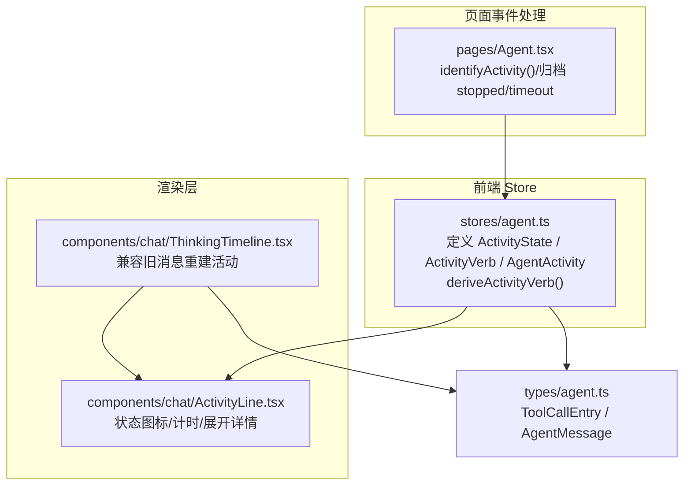
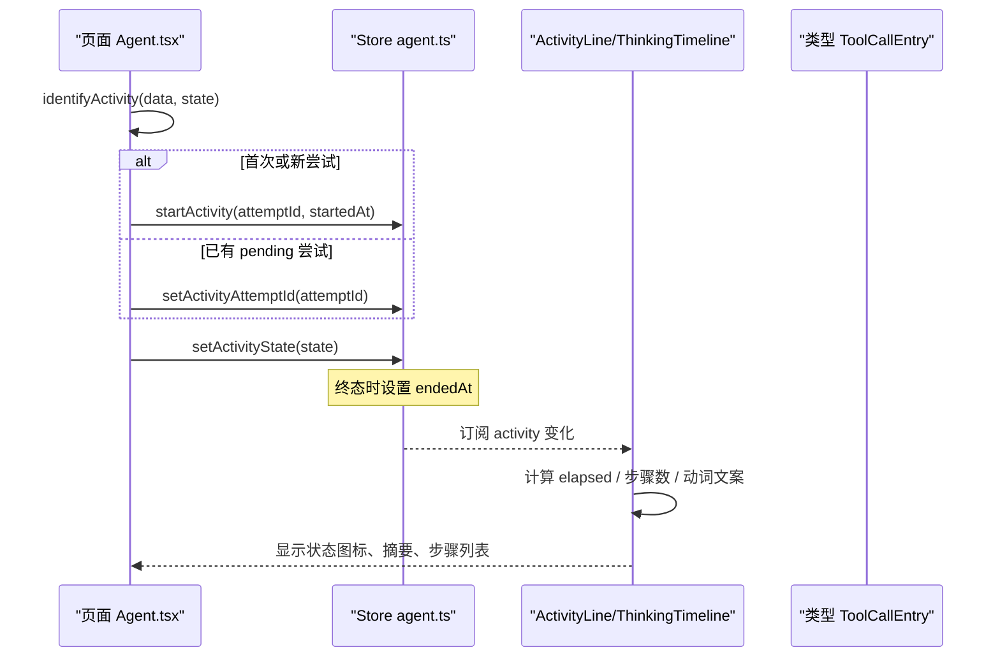
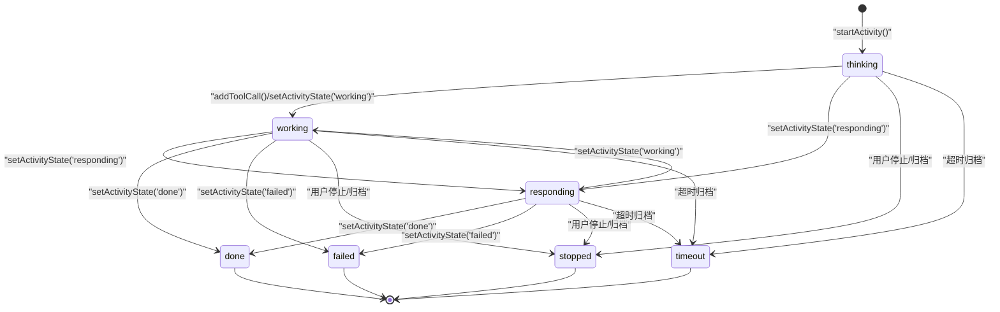
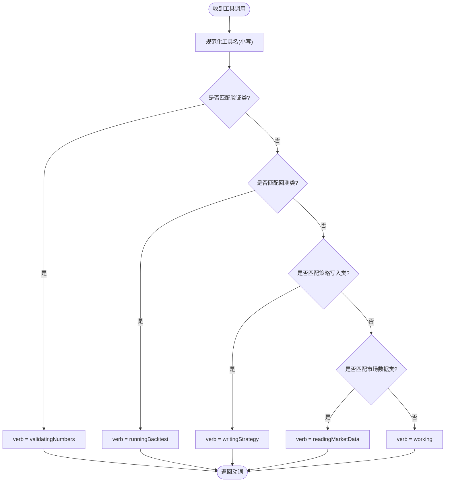
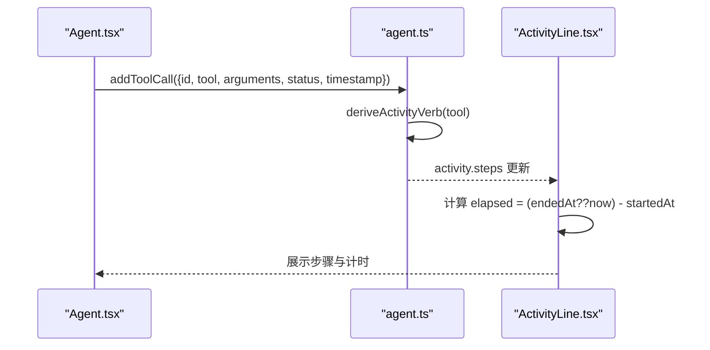
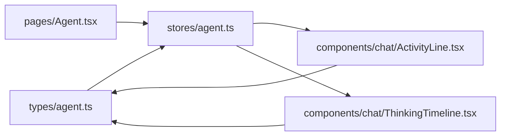

# 活动跟踪系统

<cite>
**本文引用的文件**
- [agent.ts](file://frontend/src/stores/agent.ts)
- [ActivityLine.tsx](file://frontend/src/components/chat/ActivityLine.tsx)
- [ThinkingTimeline.tsx](file://frontend/src/components/chat/ThinkingTimeline.tsx)
- [Agent.tsx](file://frontend/src/pages/Agent.tsx)
- [agent.ts（类型定义）](file://frontend/src/types/agent.ts)
</cite>

## 目录
1. [简介](#简介)
2. [项目结构](#项目结构)
3. [核心组件](#核心组件)
4. [架构总览](#架构总览)
5. [详细组件分析](#详细组件分析)
6. [依赖关系分析](#依赖关系分析)
7. [性能考虑](#性能考虑)
8. [故障排查指南](#故障排查指南)
9. [结论](#结论)
10. [附录](#附录)

## 简介
本文件为 Vibe-Trading 研究页面的“活动跟踪系统”提供完整技术文档。重点覆盖：
- AgentActivity 状态机设计：thinking、working、responding、stopped、timeout、failed、done 等状态的触发与转换规则。
- ActivityVerb 类型映射机制：readingMarketData、writingStrategy、runningBacktest、validatingNumbers、working 的自动推导逻辑。
- 活动步骤追踪、时间戳管理、尝试ID关联。
- 活动状态更新的最佳实践与调试方法。

## 项目结构
活动跟踪系统由前端 Store、渲染组件与页面事件处理三部分构成：
- Store（状态与业务逻辑）：定义活动状态、动词、数据结构，以及工具调用到活动的映射与状态变更。
- 渲染组件：将活动状态与步骤以用户友好的方式展示，并维护计时器与交互。
- 页面事件处理：接收后端事件，识别活动、更新状态、归档历史消息。

**图表来源**
- [agent.ts:6-29](file://frontend/src/stores/agent.ts#L6-L29)
- [ActivityLine.tsx:25-37](file://frontend/src/components/chat/ActivityLine.tsx#L25-L37)
- [ThinkingTimeline.tsx:17-57](file://frontend/src/components/chat/ThinkingTimeline.tsx#L17-L57)
- [Agent.tsx:650-677](file://frontend/src/pages/Agent.tsx#L650-L677)
- [agent.ts（类型定义）:60-81](file://frontend/src/types/agent.ts#L60-L81)

**章节来源**
- [agent.ts:6-29](file://frontend/src/stores/agent.ts#L6-L29)
- [ActivityLine.tsx:25-37](file://frontend/src/components/chat/ActivityLine.tsx#L25-L37)
- [ThinkingTimeline.tsx:17-57](file://frontend/src/components/chat/ThinkingTimeline.tsx#L17-L57)
- [Agent.tsx:650-677](file://frontend/src/pages/Agent.tsx#L650-L677)
- [agent.ts（类型定义）:60-81](file://frontend/src/types/agent.ts#L60-L81)

## 核心组件
- 活动状态与动词
  - 活动状态：thinking、working、responding、stopped、timeout、failed、done。
  - 活动动词：readingMarketData、writingStrategy、runningBacktest、validatingNumbers、working。
- 活动数据模型
  - attemptId：唯一标识一次“尝试”，用于跨消息关联。
  - state：当前状态。
  - verb：当前工作语义（由最近工具名推导）。
  - steps：工具调用序列，包含 id、tool、arguments、status、timestamp、可选进度与耗时。
  - startedAt/endedAt：开始与结束时间戳；结束时记录 endedAt。
- 动词推导
  - 根据最新工具名匹配正则，优先顺序：验证类 > 回测类 > 策略写入类 > 市场数据类 > 默认 working。
- 状态机约束
  - thinking/working/responding 为活跃态；stopped/timeout/failed/done 为终态。
  - 进入终态时设置 endedAt；非终态不设置 endedAt。

**章节来源**
- [agent.ts:6-29](file://frontend/src/stores/agent.ts#L6-L29)
- [agent.ts:31-44](file://frontend/src/stores/agent.ts#L31-L44)
- [agent.ts:223-249](file://frontend/src/stores/agent.ts#L223-L249)
- [agent.ts（类型定义）:60-81](file://frontend/src/types/agent.ts#L60-L81)

## 架构总览
活动从后端事件驱动，经页面事件处理器识别并更新 Store 中的 activity；Store 在工具调用时同步更新 steps 与 verb；渲染层基于 activity 展示状态、步骤与计时。

**图表来源**
- [Agent.tsx:650-677](file://frontend/src/pages/Agent.tsx#L650-L677)
- [agent.ts:223-249](file://frontend/src/stores/agent.ts#L223-L249)
- [ActivityLine.tsx:111-134](file://frontend/src/components/chat/ActivityLine.tsx#L111-L134)
- [agent.ts（类型定义）:60-81](file://frontend/src/types/agent.ts#L60-L81)

## 详细组件分析

### 状态机设计与转换
- 初始创建
  - 通过 startActivity 创建 activity，初始 state=thinking，verb=working，steps=[]，startedAt=当前时间。
- 活跃态切换
  - 页面事件 identifyActivity 可将 state 设置为 thinking/working/responding。
- 工具调用影响
  - addToolCall/updateRunningToolCall 会将 state 设为 working，并根据最新工具名推导 verb，同时追加/更新 steps。
- 终态设置
  - setActivityState 当 state 为 stopped/timeout/failed/done 时设置 endedAt；否则不清空 endedAt。
- 历史归档
  - 页面在处理 attempt.cancelled 等事件时，会归档已存在的 activity 为 stopped，并清理流式视图。

**图表来源**
- [agent.ts:223-249](file://frontend/src/stores/agent.ts#L223-L249)
- [Agent.tsx:982-1016](file://frontend/src/pages/Agent.tsx#L982-L1016)

**章节来源**
- [agent.ts:223-249](file://frontend/src/stores/agent.ts#L223-L249)
- [Agent.tsx:982-1016](file://frontend/src/pages/Agent.tsx#L982-L1016)

### ActivityVerb 自动推导机制
- 规则优先级
  - 验证类：validate/validation/monte_carlo/bootstrap/walk_forward/stress_test/sanity_check → validatingNumbers
  - 回测类：backtest → runningBacktest
  - 策略写入类：write/edit/patch/strategy/signal/scaffold/generate → writingStrategy
  - 市场数据类：market_data/search/read/fetch/ticker/quote/candle/orderbook/funding/open_interest/financial/filing/news/profile/screener/fred/iwencai/fund_flow/dragon/northbound/margin/block_trade/shareholder/lockup/sector/research/options_chain → readingMarketData
  - 其他 → working
- 触发时机
  - 新增或更新工具调用时，使用最新 tool 名称推导 verb。
- 兼容性
  - ThinkingTimeline 对旧消息组进行重建时，同样依据最后一步工具名推导 verb。

**图表来源**
- [agent.ts:31-44](file://frontend/src/stores/agent.ts#L31-L44)
- [ThinkingTimeline.tsx:17-57](file://frontend/src/components/chat/ThinkingTimeline.tsx#L17-L57)

**章节来源**
- [agent.ts:31-44](file://frontend/src/stores/agent.ts#L31-L44)
- [ThinkingTimeline.tsx:17-57](file://frontend/src/components/chat/ThinkingTimeline.tsx#L17-L57)

### 活动步骤追踪与时间戳管理
- 步骤追踪
  - ToolCallEntry 记录每次工具调用的 id、tool、arguments、status、timestamp，以及可选 progress、elapsed_ms、elapsed_s。
  - Store 在 addToolCall/updateRunningToolCall/updateOldestRunningToolCall 中维护 steps 列表，确保最新运行中的步骤可被正确更新。
- 时间戳
  - startedAt：活动开始时间，创建时设置。
  - endedAt：仅在进入终态时设置，便于前端精确计算持续时间。
  - 计时器：ActivityLine 在活跃态下每秒刷新 now，并在页面不可见或活动结束时暂停，避免无效开销。
- 尝试ID关联
  - attemptId 用于跨消息关联同一活动；页面在 identifyActivity 中根据 attempt_id 判断是否新建或复用活动，并对“pending-”前缀的占位尝试进行替换。

**图表来源**
- [agent.ts:167-222](file://frontend/src/stores/agent.ts#L167-L222)
- [ActivityLine.tsx:77-113](file://frontend/src/components/chat/ActivityLine.tsx#L77-L113)
- [agent.ts（类型定义）:60-81](file://frontend/src/types/agent.ts#L60-L81)

**章节来源**
- [agent.ts:167-222](file://frontend/src/stores/agent.ts#L167-L222)
- [ActivityLine.tsx:77-113](file://frontend/src/components/chat/ActivityLine.tsx#L77-L113)
- [agent.ts（类型定义）:60-81](file://frontend/src/types/agent.ts#L60-L81)

### 最佳实践与调试方法
- 状态更新最佳实践
  - 使用 setActivityState 统一更新状态，避免直接修改 activity.state。
  - 终态必须设置 endedAt，以便前端准确计算持续时间。
  - 工具调用应通过 addToolCall/updateRunningToolCall 更新 steps，保证 verb 与步骤一致性。
- 调试建议
  - 检查 activity.attemptId 是否正确跨消息关联。
  - 确认 deriveActivityVerb 的规则是否符合预期工具命名。
  - 观察 ActivityLine 的计时器行为：页面隐藏时应冻结计时，活动结束时应停止刷新。
  - 对于历史消息，确认 ThinkingTimeline 能正确重建活动（尤其是零工具场景）。
- 常见问题定位
  - 若活动未结束但 endedAt 存在，检查是否有误用 setActivityState 传入终态。
  - 若步骤未更新，检查 store 的 updateRunningToolCall 是否匹配到正确的 callId 或 tool。
  - 若动词不正确，核对工具名是否命中对应正则规则。

**章节来源**
- [agent.ts:223-249](file://frontend/src/stores/agent.ts#L223-L249)
- [ActivityLine.tsx:77-113](file://frontend/src/components/chat/ActivityLine.tsx#L77-L113)
- [ThinkingTimeline.tsx:17-57](file://frontend/src/components/chat/ThinkingTimeline.tsx#L17-L57)

## 依赖关系分析
- Store 依赖类型定义 ToolCallEntry/AgentMessage 来描述步骤与消息。
- 渲染组件依赖 Store 暴露的 activity 与工具函数（如 deriveActivityVerb）。
- 页面事件处理依赖 Store 的方法进行状态变更与归档。

**图表来源**
- [agent.ts（类型定义）:60-81](file://frontend/src/types/agent.ts#L60-L81)
- [agent.ts:1-336](file://frontend/src/stores/agent.ts#L1-L336)
- [ActivityLine.tsx:1-205](file://frontend/src/components/chat/ActivityLine.tsx#L1-L205)
- [ThinkingTimeline.tsx:1-85](file://frontend/src/components/chat/ThinkingTimeline.tsx#L1-L85)
- [Agent.tsx:650-677](file://frontend/src/pages/Agent.tsx#L650-L677)

**章节来源**
- [agent.ts（类型定义）:60-81](file://frontend/src/types/agent.ts#L60-L81)
- [agent.ts:1-336](file://frontend/src/stores/agent.ts#L1-L336)
- [ActivityLine.tsx:1-205](file://frontend/src/components/chat/ActivityLine.tsx#L1-L205)
- [ThinkingTimeline.tsx:1-85](file://frontend/src/components/chat/ThinkingTimeline.tsx#L1-L85)
- [Agent.tsx:650-677](file://frontend/src/pages/Agent.tsx#L650-L677)

## 性能考虑
- 计时器优化：ActivityLine 仅在活动活跃且页面可见时启动定时器，避免后台刷新造成浪费。
- 状态更新最小化：Store 通过局部 patch 更新 activity，减少重渲染范围。
- 历史重建成本：ThinkingTimeline 对旧消息组仅做一次重建，结果缓存于 useMemo。
- 动词推导开销：正则匹配固定集合，复杂度低，适合高频调用。

[本节为通用性能指导，无需特定文件引用]

## 故障排查指南
- 活动未结束但无 endedAt
  - 检查是否错误地使用了非终态状态。
  - 确认 setActivityState 的调用路径。
- 步骤未更新或动词错误
  - 检查 addToolCall/updateRunningToolCall 的参数是否正确。
  - 核对工具名是否命中 deriveActivityVerb 的正则规则。
- 计时异常
  - 确认页面 visibilitychange 事件是否正常触发。
  - 检查活动结束后是否及时停止定时器。
- 历史消息重建问题
  - 确认 ThinkingTimeline 的 rebuildLegacyActivity 是否能正确匹配 tool_call/tool_result 对。
  - 对于零工具场景，确认活动仍保持可见性。

**章节来源**
- [agent.ts:223-249](file://frontend/src/stores/agent.ts#L223-L249)
- [ActivityLine.tsx:77-113](file://frontend/src/components/chat/ActivityLine.tsx#L77-L113)
- [ThinkingTimeline.tsx:17-57](file://frontend/src/components/chat/ThinkingTimeline.tsx#L17-L57)

## 结论
活动跟踪系统通过清晰的状态机、可靠的动词推导与完善的步骤追踪，实现了研究页面中对 Agent 行为的可视化与可调试性。Store 负责状态与数据的一致性，渲染层负责用户体验与性能，页面事件处理负责与后端的协同。遵循本文的最佳实践可有效提升系统的稳定性与可维护性。

[本节为总结性内容，无需特定文件引用]

## 附录
- 关键接口与字段说明
  - AgentActivity：attemptId、state、verb、steps、startedAt、endedAt。
  - ToolCallEntry：id、tool、arguments、status、timestamp、progress、elapsed_ms、elapsed_s。
  - ActivityState：thinking、working、responding、stopped、timeout、failed、done。
  - ActivityVerb：readingMarketData、writingStrategy、runningBacktest、validatingNumbers、working。

**章节来源**
- [agent.ts:6-29](file://frontend/src/stores/agent.ts#L6-L29)
- [agent.ts（类型定义）:60-81](file://frontend/src/types/agent.ts#L60-L81)