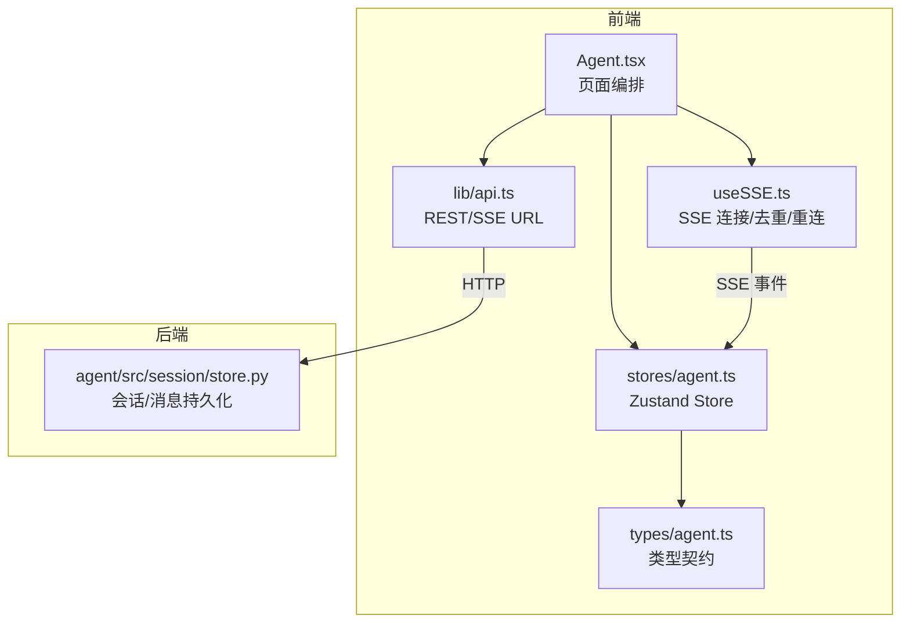
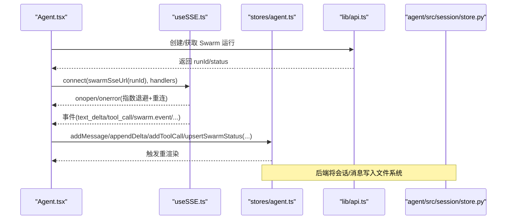
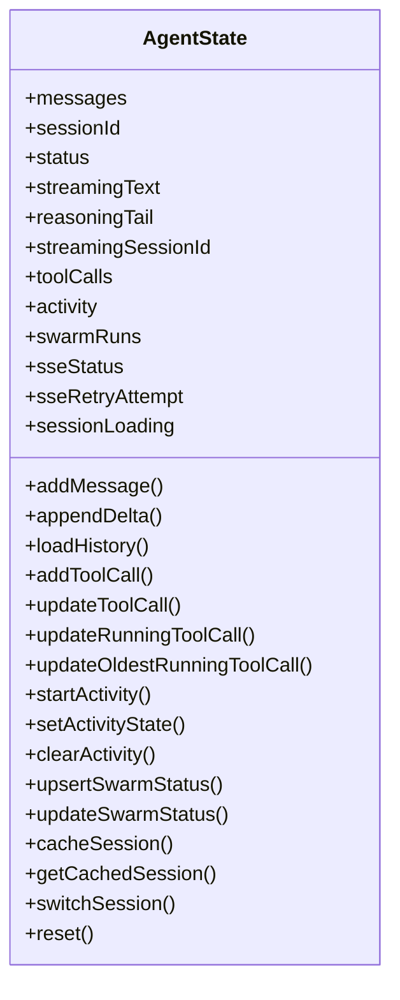
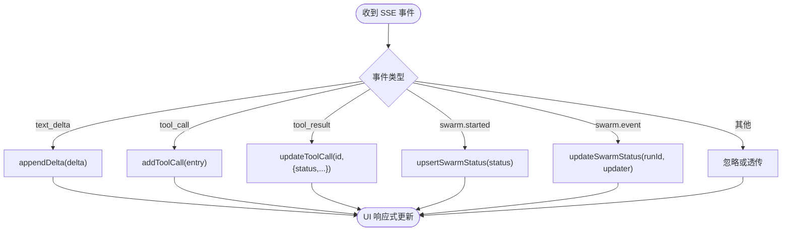
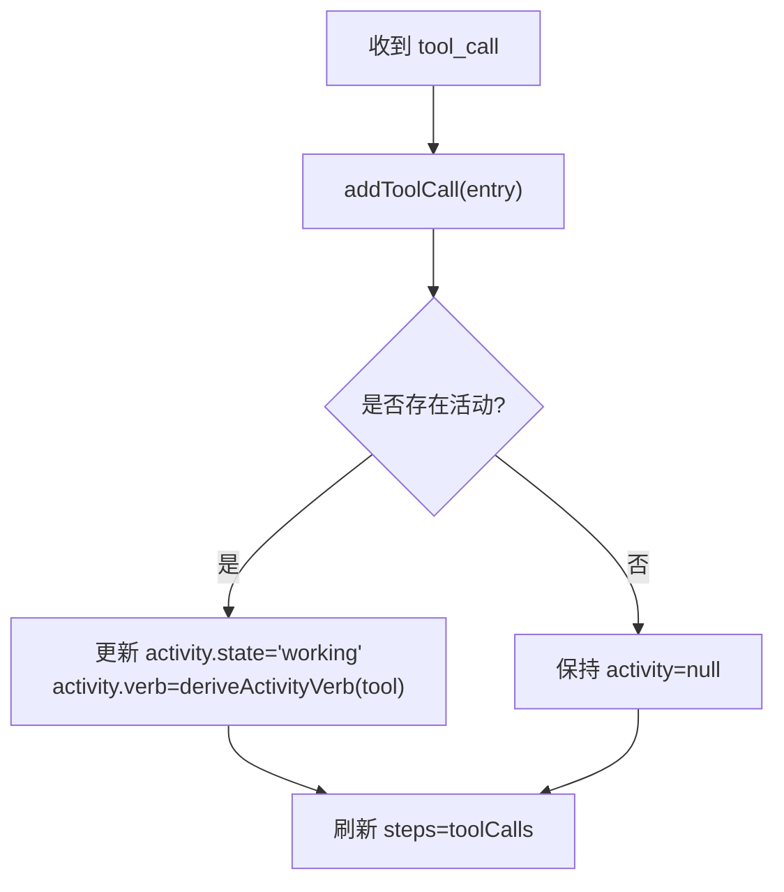
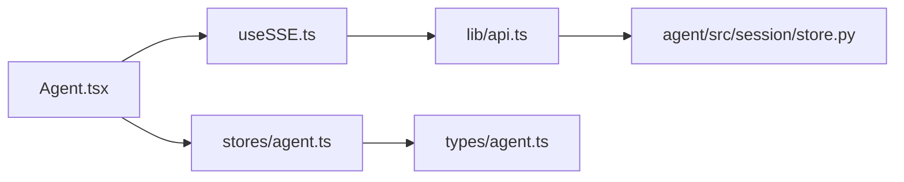

# 状态管理

<cite>
**本文引用的文件**
- [agent.ts](file://frontend/src/stores/agent.ts)
- [agent.ts（类型定义）](file://frontend/src/types/agent.ts)
- [useSSE.ts](file://frontend/src/hooks/useSSE.ts)
- [api.ts](file://frontend/src/lib/api.ts)
- [Agent.tsx](file://frontend/src/pages/Agent.tsx)
- [store.py](file://agent/src/session/store.py)
</cite>

## 目录
1. [简介](#简介)
2. [项目结构](#项目结构)
3. [核心组件](#核心组件)
4. [架构总览](#架构总览)
5. [详细组件分析](#详细组件分析)
6. [依赖关系分析](#依赖关系分析)
7. [性能考虑](#性能考虑)
8. [故障排查指南](#故障排查指南)
9. [结论](#结论)
10. [附录](#附录)

## 简介
本文件为 Vibe-Trading 研究页面“状态管理”的权威文档，聚焦前端 Zustand store 的结构设计、状态切片组织、数据流与事件驱动机制，覆盖会话状态、消息历史、工具调用状态、Swarm 运行状态的管理方式；同时说明状态持久化策略、版本兼容与迁移方案、状态同步与冲突解决、性能优化手段，并提供调试工具与最佳实践。

## 项目结构
研究页面的状态由前端 Zustand store 统一管理，并通过 SSE 事件驱动更新；后端通过文件系统持久化会话与消息。关键文件职责如下：
- 前端状态定义与操作：stores/agent.ts
- 数据类型契约：types/agent.ts
- SSE 连接与去重恢复：hooks/useSSE.ts
- API 客户端（含 Swarm 接口）：lib/api.ts
- 页面编排与事件处理：pages/Agent.tsx
- 后端会话持久化：agent/src/session/store.py

图表来源
- [Agent.tsx:1-200](file://frontend/src/pages/Agent.tsx#L1-L200)
- [useSSE.ts:1-216](file://frontend/src/hooks/useSSE.ts#L1-L216)
- [agent.ts:1-336](file://frontend/src/stores/agent.ts#L1-L336)
- [agent.ts（类型定义）:1-82](file://frontend/src/types/agent.ts#L1-L82)
- [api.ts:190-210](file://frontend/src/lib/api.ts#L190-L210)
- [store.py:16-49](file://agent/src/session/store.py#L16-L49)

章节来源
- [agent.ts:1-336](file://frontend/src/stores/agent.ts#L1-L336)
- [agent.ts（类型定义）:1-82](file://frontend/src/types/agent.ts#L1-L82)
- [useSSE.ts:1-216](file://frontend/src/hooks/useSSE.ts#L1-L216)
- [api.ts:190-210](file://frontend/src/lib/api.ts#L190-L210)
- [Agent.tsx:1-200](file://frontend/src/pages/Agent.tsx#L1-L200)
- [store.py:16-49](file://agent/src/session/store.py#L16-L49)

## 核心组件
- Zustand Store（stores/agent.ts）
  - 状态切片：messages、sessionId、status、streamingText、reasoningTail、toolCalls、activity、swarmRuns、sseStatus/sseRetryAttempt、sessionLoading
  - 能力：消息追加/合并、流式文本累积、活动状态机、工具调用追踪、Swarm 状态 upsert/update、会话缓存与切换、SSE 状态同步、重置
- 类型契约（types/agent.ts）
  - AgentMessageType、ToolCallEntry、SwarmRunStatus、SwarmAgentStatus、AgentMessage 等
- SSE Hook（useSSE.ts）
  - 自动重连、指数退避、LRU 去重、Last-Event-ID 续传、事件白名单过滤
- API 客户端（api.ts）
  - Swarm 相关 REST 与 SSE URL 构造
- 页面编排（Agent.tsx）
  - 将 SSE 事件映射到 store 方法，驱动 UI 渲染

章节来源
- [agent.ts:60-114](file://frontend/src/stores/agent.ts#L60-L114)
- [agent.ts:119-336](file://frontend/src/stores/agent.ts#L119-L336)
- [agent.ts（类型定义）:1-82](file://frontend/src/types/agent.ts#L1-L82)
- [useSSE.ts:27-216](file://frontend/src/hooks/useSSE.ts#L27-L216)
- [api.ts:190-210](file://frontend/src/lib/api.ts#L190-L210)
- [Agent.tsx:1-200](file://frontend/src/pages/Agent.tsx#L1-L200)

## 架构总览
研究页面采用“事件驱动 + 单源状态”的架构：
- 事件源：SSE 推送 text_delta/reasoning_delta/tool_call/tool_result/swarm.* 等事件
- 事件处理器：Agent.tsx 根据事件类型调用 store 方法
- 状态中心：Zustand store 维护单一真实来源，UI 通过 selector 订阅最小变更
- 持久化：后端以 JSON/JSONL 落盘；前端使用内存 LRU 缓存会话与 swarm 快照

图表来源
- [api.ts:190-210](file://frontend/src/lib/api.ts#L190-L210)
- [useSSE.ts:71-156](file://frontend/src/hooks/useSSE.ts#L71-L156)
- [agent.ts:133-280](file://frontend/src/stores/agent.ts#L133-L280)
- [store.py:16-49](file://agent/src/session/store.py#L16-L49)

## 详细组件分析

### Zustand Store 设计与状态切片
- 会话与流式状态
  - sessionId/streamingSessionId：区分当前会话与正在流式的会话，支持切会话时保留侧边栏 spinner
  - status/streamingText/reasoningTail：控制流式输出与推理尾部展示
- 消息历史
  - messages：统一的消息数组，包含 user/thinking/tool_call/tool_result/answer/error/run_complete/compact/swarm_status
  - loadHistory：加载历史并合并仍在运行的 swarm 占位消息，按时间排序
- 工具调用状态
  - toolCalls：记录每个工具的参数、状态、耗时、进度；支持按 call_id 或 tool 名定位运行中调用
  - activity：基于最新工具阶段推导用户可见的活动动词（如 runningBacktest、writingStrategy 等）
- Swarm 运行状态
  - swarmRuns：以 runId 为键的状态表；upsertSwarmStatus 在首次出现时插入 swarm_status 消息占位，后续仅更新状态
  - updateSwarmStatus：原子更新某个 run 的状态
- 会话缓存
  - _sessionCache/_swarmSessionCache：内存 LRU 缓存最近 N 个会话及其 swarm 快照，避免重复请求
- SSE 状态
  - sseStatus/sseRetryAttempt：与 useSSE 联动，提供断线/重连指示

图表来源
- [agent.ts:60-114](file://frontend/src/stores/agent.ts#L60-L114)
- [agent.ts:119-336](file://frontend/src/stores/agent.ts#L119-L336)

章节来源
- [agent.ts:60-114](file://frontend/src/stores/agent.ts#L60-L114)
- [agent.ts:119-336](file://frontend/src/stores/agent.ts#L119-L336)

### 数据流与事件处理（SSE → Store → UI）
- 事件白名单：useSSE 仅订阅后端实际发出的事件类型，减少无效分发
- 去重与续传：基于 lastEventId 与 LRU seenIds 实现幂等处理
- 状态更新路径：
  - 文本增量：appendDelta → streamingText
  - 工具调用：addToolCall/updateRunningToolCall → toolCalls/activity
  - Swarm 事件：buildSwarmStatusFromStarted/applySwarmEvent → upsertSwarmStatus/updateSwarmStatus
  - 会话切换：switchSession → 清空流式态、恢复 swarmRuns（从缓存）

图表来源
- [useSSE.ts:85-120](file://frontend/src/hooks/useSSE.ts#L85-L120)
- [agent.ts:133-280](file://frontend/src/stores/agent.ts#L133-L280)
- [Agent.tsx:1-200](file://frontend/src/pages/Agent.tsx#L1-L200)

章节来源
- [useSSE.ts:85-120](file://frontend/src/hooks/useSSE.ts#L85-L120)
- [agent.ts:133-280](file://frontend/src/stores/agent.ts#L133-L280)
- [Agent.tsx:1-200](file://frontend/src/pages/Agent.tsx#L1-L200)

### 会话状态与消息历史管理
- 会话生命周期
  - switchSession：重置流式态、设置 sessionId、可选传入 msgs 初始化 messages，并从缓存恢复 swarmRuns
  - loadHistory：合并历史消息与仍在运行的 swarm 占位消息，保证时间序
- 消息分组与渲染
  - Agent.tsx 对 thinking/tool_call/tool_result/compact 进行时间线聚合，提升可读性

章节来源
- [agent.ts:150-165](file://frontend/src/stores/agent.ts#L150-L165)
- [agent.ts:307-323](file://frontend/src/stores/agent.ts#L307-L323)
- [Agent.tsx:48-70](file://frontend/src/pages/Agent.tsx#L48-L70)

### 工具调用状态与活动推断
- 工具调用追踪
  - addToolCall：新增调用并刷新 activity.steps
  - updateRunningToolCall/updateOldestRunningToolCall：按 call_id 或 tool 名定位运行中调用并更新
- 活动动词推导
  - deriveActivityVerb：根据工具名匹配规则推导 readingMarketData/writingStrategy/runningBacktest/validatingNumbers/working

图表来源
- [agent.ts:167-180](file://frontend/src/stores/agent.ts#L167-L180)
- [agent.ts:37-44](file://frontend/src/stores/agent.ts#L37-L44)

章节来源
- [agent.ts:167-180](file://frontend/src/stores/agent.ts#L167-L180)
- [agent.ts:37-44](file://frontend/src/stores/agent.ts#L37-L44)

### Swarm 运行状态管理
- 首次出现：upsertSwarmStatus 插入 swarm_status 占位消息，并在 swarmRuns 中登记
- 后续更新：updateSwarmStatus 原子更新对应 run 的状态
- 事件来源：SSE 中的 swarm.started/swarm.event，配合 lib/swarmStatus 构建状态对象

章节来源
- [agent.ts:251-280](file://frontend/src/stores/agent.ts#L251-L280)
- [api.ts:190-210](file://frontend/src/lib/api.ts#L190-L210)

### 状态持久化、版本兼容与迁移
- 前端
  - 会话与 swarm 快照通过内存 LRU 缓存（_sessionCache/_swarmSessionCache），用于快速切换与恢复
  - 无浏览器本地持久化；如需跨标签页共享需扩展
- 后端
  - SessionStore 以 sessions/{session_id}/session.json 与 messages.jsonl 持久化会话与消息
- 版本兼容与迁移
  - 后端存在配置迁移逻辑（参考测试用例），确保旧版状态可迁移至运行时根目录

章节来源
- [agent.ts:282-297](file://frontend/src/stores/agent.ts#L282-L297)
- [store.py:16-49](file://agent/src/session/store.py#L16-L49)

### 状态同步机制、冲突解决与性能优化
- 同步机制
  - SSE 事件作为唯一事实源，store 方法保证不可变更新
  - Last-Event-ID 与 LRU 去重保障断线续传与幂等
- 冲突解决
  - 以服务端事件顺序为准；前端不写冲突，只消费事件
- 性能优化
  - 流式文本节流：页面层设定 flush 间隔，降低高频 setState 压力
  - 选择器订阅：UI 仅订阅所需字段，减少重渲染
  - 消息时间线窗口：限制渲染窗口大小，避免长列表卡顿
  - 工具进度心跳：elapsed_s 提供轻量进度反馈

章节来源
- [useSSE.ts:44-69](file://frontend/src/hooks/useSSE.ts#L44-L69)
- [Agent.tsx:100-103](file://frontend/src/pages/Agent.tsx#L100-L103)
- [agent.ts（类型定义）:60-82](file://frontend/src/types/agent.ts#L60-L82)

### 状态调试工具与最佳实践
- 调试建议
  - 在开发控制台打印 store 快照：useAgentStore.getState()
  - 监听 SSE 状态变化：useSSE.onStatusChange
  - 检查工具调用链：查看 toolCalls 与 activity.steps
- 最佳实践
  - 使用精确 selector 订阅状态，避免全量订阅
  - 批量更新：尽量在一次 set 中完成关联字段更新
  - 幂等处理：依赖 SSE 去重与 Last-Event-ID，避免重复应用
  - 错误边界：对 tool_result.error 与 swarm 失败状态做降级展示

章节来源
- [useSSE.ts:208-216](file://frontend/src/hooks/useSSE.ts#L208-L216)
- [agent.ts:119-336](file://frontend/src/stores/agent.ts#L119-L336)

## 依赖关系分析
- Agent.tsx 依赖 useSSE 与 stores/agent.ts，负责事件路由与 UI 编排
- useSSE 依赖 api.ts 提供的认证与 URL 构造
- stores/agent.ts 依赖 types/agent.ts 的类型契约
- 后端 session/store.py 提供持久化能力

图表来源
- [Agent.tsx:1-200](file://frontend/src/pages/Agent.tsx#L1-L200)
- [useSSE.ts:1-216](file://frontend/src/hooks/useSSE.ts#L1-L216)
- [agent.ts:1-336](file://frontend/src/stores/agent.ts#L1-L336)
- [agent.ts（类型定义）:1-82](file://frontend/src/types/agent.ts#L1-L82)
- [api.ts:190-210](file://frontend/src/lib/api.ts#L190-L210)
- [store.py:16-49](file://agent/src/session/store.py#L16-L49)

章节来源
- [Agent.tsx:1-200](file://frontend/src/pages/Agent.tsx#L1-L200)
- [useSSE.ts:1-216](file://frontend/src/hooks/useSSE.ts#L1-L216)
- [agent.ts:1-336](file://frontend/src/stores/agent.ts#L1-L336)
- [agent.ts（类型定义）:1-82](file://frontend/src/types/agent.ts#L1-L82)
- [api.ts:190-210](file://frontend/src/lib/api.ts#L190-L210)
- [store.py:16-49](file://agent/src/session/store.py#L16-L49)

## 性能考虑
- 流式更新节流：页面层设置固定间隔批量刷新，降低 React 重渲染频率
- 选择器粒度：UI 仅订阅必要字段，避免无关组件重渲染
- 列表渲染优化：消息时间线窗口限制，减少 DOM 节点数量
- 去重与续传：SSE 层 LRU 去重与 Last-Event-ID 避免重复计算与网络开销
- 工具进度：使用 elapsed_s 与 progress 字段提供轻量反馈，避免频繁大对象更新

[本节为通用指导，无需特定文件引用]

## 故障排查指南
- SSE 连接问题
  - 检查 sseStatus 与 sseRetryAttempt，确认是否处于 reconnecting
  - 验证 withAuthTicket 流程是否成功获取临时票据
- 消息丢失或重复
  - 确认 lastEventId 是否正确传递与记录
  - 检查 LRU 去重容量是否合理
- 工具调用卡住
  - 检查 toolCalls 中 running 条目是否长时间未结束
  - 核对 tool_progress/heartbeat 事件是否到达
- Swarm 状态异常
  - 检查 swarm.started/swarm.event 事件是否到达
  - 确认 upsertSwarmStatus/updateSwarmStatus 是否被正确调用

章节来源
- [useSSE.ts:122-174](file://frontend/src/hooks/useSSE.ts#L122-L174)
- [agent.ts:251-280](file://frontend/src/stores/agent.ts#L251-L280)

## 结论
Vibe-Trading 研究页面的状态管理以 Zustand 为中心，结合 SSE 事件驱动与后端持久化，实现了高可靠、可扩展的研究会话体验。通过清晰的切片组织、严格的事件白名单与去重机制、以及合理的性能优化策略，系统在保证实时性的同时具备良好的可维护性与可观测性。建议在后续迭代中继续强化前端本地持久化与更细粒度的选择器拆分，进一步提升多标签页场景下的状态一致性与性能。

[本节为总结，无需特定文件引用]

## 附录
- 术语
  - Swarm：多智能体协作任务，具备分层执行与状态上报
  - Activity：用户可见的活动状态，基于工具调用阶段推导
  - Reasoning Tail：模型推理过程的滚动尾部片段
- 相关文件索引
  - 状态定义与操作：stores/agent.ts
  - 类型契约：types/agent.ts
  - SSE 连接：hooks/useSSE.ts
  - API 客户端：lib/api.ts
  - 页面编排：pages/Agent.tsx
  - 后端持久化：agent/src/session/store.py

[本节为索引，无需特定文件引用]