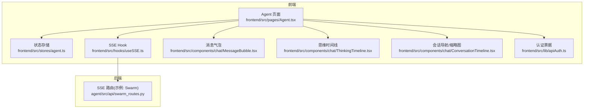
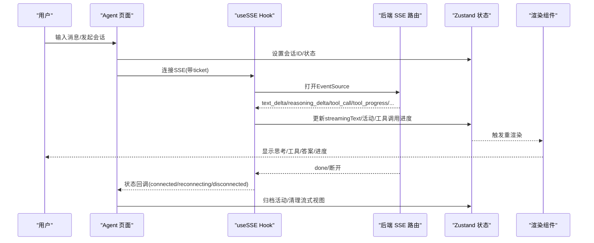
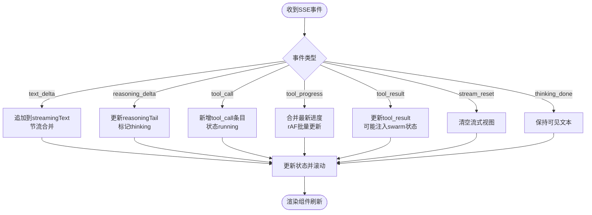
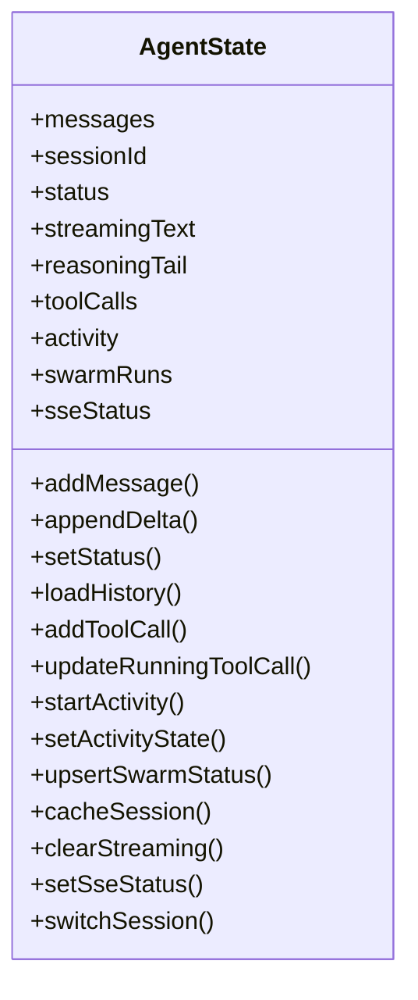
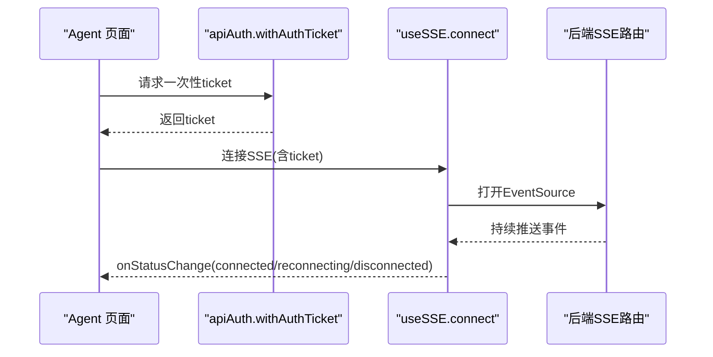
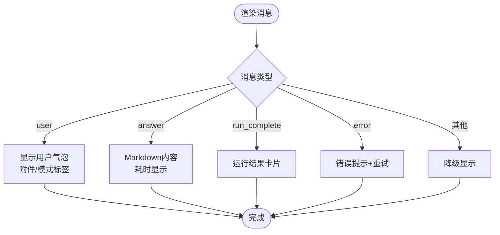
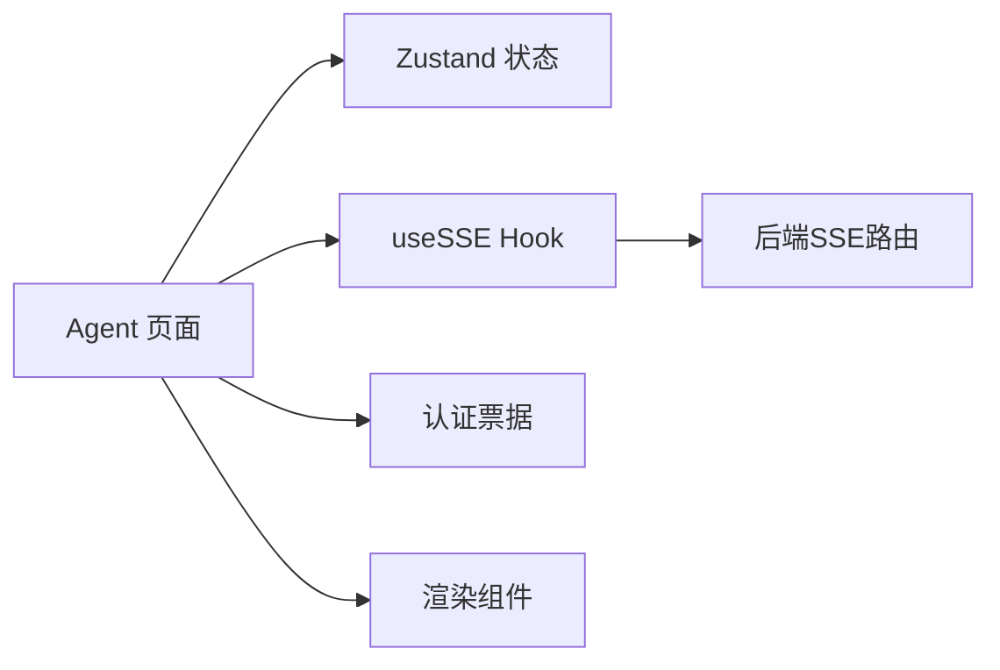

# 研究页面（Agent）

<cite>
**本文引用的文件**
- [frontend/src/pages/Agent.tsx](file://frontend/src/pages/Agent.tsx)
- [frontend/src/stores/agent.ts](file://frontend/src/stores/agent.ts)
- [frontend/src/hooks/useSSE.ts](file://frontend/src/hooks/useSSE.ts)
- [frontend/src/components/chat/MessageBubble.tsx](file://frontend/src/components/chat/MessageBubble.tsx)
- [frontend/src/components/chat/ThinkingTimeline.tsx](file://frontend/src/components/chat/ThinkingTimeline.tsx)
- [frontend/src/components/chat/ConversationTimeline.tsx](file://frontend/src/components/chat/ConversationTimeline.tsx)
- [frontend/src/lib/apiAuth.ts](file://frontend/src/lib/apiAuth.ts)
- [agent/src/api/swarm_routes.py](file://agent/src/api/swarm_routes.py)
</cite>

## 目录
1. [简介](#简介)
2. [项目结构](#项目结构)
3. [核心组件](#核心组件)
4. [架构总览](#架构总览)
5. [详细组件分析](#详细组件分析)
6. [依赖关系分析](#依赖关系分析)
7. [性能考虑](#性能考虑)
8. [故障排除指南](#故障排除指南)
9. [结论](#结论)
10. [附录](#附录)

## 简介
本文件为 Vibe-Trading 的“研究页面（Agent）”提供完整的技术与使用文档。该页面提供自然语言对话界面、AI代理交互、实时消息流处理、工具调用可视化、思维过程展示等能力，并通过 SSE（Server-Sent Events）实现低延迟的双向交互体验。文档涵盖：
- SSE 流式通信机制、消息分组与渲染逻辑、状态管理策略
- 用户输入处理、消息发送接收流程、错误处理与重试机制
- 性能优化措施：虚拟滚动、消息去重、内存管理
- 与后端 API 的集成方式、会话管理与数据持久化策略
- 常见使用场景的操作指南与故障排除方法

## 项目结构
研究页面位于前端工程，核心由 Agent 页面、Zustand 状态存储、SSE Hook、聊天组件与认证票据机制组成；后端通过 SSE 路由提供事件流。

图表来源
- [frontend/src/pages/Agent.tsx:208-800](file://frontend/src/pages/Agent.tsx#L208-L800)
- [frontend/src/stores/agent.ts:60-114](file://frontend/src/stores/agent.ts#L60-L114)
- [frontend/src/hooks/useSSE.ts:1-200](file://frontend/src/hooks/useSSE.ts#L1-L200)
- [frontend/src/components/chat/MessageBubble.tsx:174-289](file://frontend/src/components/chat/MessageBubble.tsx#L174-L289)
- [frontend/src/components/chat/ThinkingTimeline.tsx:10-85](file://frontend/src/components/chat/ThinkingTimeline.tsx#L10-L85)
- [frontend/src/components/chat/ConversationTimeline.tsx:1-39](file://frontend/src/components/chat/ConversationTimeline.tsx#L1-L39)
- [frontend/src/lib/apiAuth.ts:18-53](file://frontend/src/lib/apiAuth.ts#L18-L53)
- [agent/src/api/swarm_routes.py:187-211](file://agent/src/api/swarm_routes.py#L187-L211)

章节来源
- [frontend/src/pages/Agent.tsx:208-800](file://frontend/src/pages/Agent.tsx#L208-L800)
- [frontend/src/stores/agent.ts:60-114](file://frontend/src/stores/agent.ts#L60-L114)
- [frontend/src/components/chat/MessageBubble.tsx:174-289](file://frontend/src/components/chat/MessageBubble.tsx#L174-L289)
- [frontend/src/components/chat/ThinkingTimeline.tsx:10-85](file://frontend/src/components/chat/ThinkingTimeline.tsx#L10-L85)
- [frontend/src/components/chat/ConversationTimeline.tsx:1-39](file://frontend/src/components/chat/ConversationTimeline.tsx#L1-L39)
- [frontend/src/lib/apiAuth.ts:18-53](file://frontend/src/lib/apiAuth.ts#L18-L53)
- [agent/src/api/swarm_routes.py:187-211](file://agent/src/api/swarm_routes.py#L187-L211)

## 核心组件
- Agent 页面：负责会话加载、SSE 连接、事件分发、消息分组与渲染、滚动与焦点管理、后台完成提示、Swarm 状态与目标面板集成。
- Zustand 状态存储：集中管理消息、活动状态、工具调用、Swarm 运行状态、SSE 连接状态、会话缓存与切换。
- SSE Hook：封装 EventSource 生命周期、事件订阅、断线重连与状态回调。
- 消息气泡：渲染用户消息、助手回答、运行结果卡片、错误消息与重试入口。
- 思维时间线：将 tool_call/tool_result 序列聚合为可展示的“活动”，支持历史重建与继续/重新附加操作。
- 会话导航：基于最近用户消息生成缩略导航，提升长会话浏览效率。
- 认证票据：通过一次性 ticket 安全建立 SSE 连接，避免在 URL 中暴露长期密钥。

章节来源
- [frontend/src/pages/Agent.tsx:208-800](file://frontend/src/pages/Agent.tsx#L208-L800)
- [frontend/src/stores/agent.ts:60-114](file://frontend/src/stores/agent.ts#L60-L114)
- [frontend/src/hooks/useSSE.ts:1-200](file://frontend/src/hooks/useSSE.ts#L1-L200)
- [frontend/src/components/chat/MessageBubble.tsx:174-289](file://frontend/src/components/chat/MessageBubble.tsx#L174-L289)
- [frontend/src/components/chat/ThinkingTimeline.tsx:10-85](file://frontend/src/components/chat/ThinkingTimeline.tsx#L10-L85)
- [frontend/src/components/chat/ConversationTimeline.tsx:1-39](file://frontend/src/components/chat/ConversationTimeline.tsx#L1-L39)
- [frontend/src/lib/apiAuth.ts:18-53](file://frontend/src/lib/apiAuth.ts#L18-L53)

## 架构总览
研究页面采用“页面 + 状态 + 流式通信 + 组件”的分层架构：
- 页面层：编排会话加载、SSE 连接、事件处理、UI 行为（滚动、焦点、提示）。
- 状态层：统一维护消息、活动、工具调用、Swarm 状态、SSE 连接状态与会话缓存。
- 通信层：通过 useSSE Hook 订阅后端 SSE 事件，按类型更新状态并触发 UI 刷新。
- 渲染层：根据消息类型与活动状态选择不同组件进行渲染。

图表来源
- [frontend/src/pages/Agent.tsx:642-800](file://frontend/src/pages/Agent.tsx#L642-L800)
- [frontend/src/hooks/useSSE.ts:1-200](file://frontend/src/hooks/useSSE.ts#L1-L200)
- [agent/src/api/swarm_routes.py:187-211](file://agent/src/api/swarm_routes.py#L187-L211)
- [frontend/src/stores/agent.ts:119-336](file://frontend/src/stores/agent.ts#L119-L336)

## 详细组件分析

### Agent 页面（会话与流式交互中枢）
- 会话加载与历史回放：拉取历史消息，构建工具时间线，合并运行结果卡片，恢复运行时身份（provider/model/reasoning_effort），并缓存会话。
- SSE 事件处理：
  - text_delta/reasoning_delta：增量拼接文本与思维尾段，节流合并后写入状态，保持滚动与焦点。
  - stream_reset：清空当前流式视图，重置滚动到底部。
  - thinking_done/thinking：维持“思考/工作/响应”活动状态。
  - tool_call/tool_result/tool_progress/tool_heartbeat：更新运行中的工具调用与进度，支持 Swarm 状态注入。
  - compact/message.received：压缩与用户消息去重。
- 消息分组：将 thinking/tool_call/tool_result/compact 归并为“时间线组”，其余作为单条消息渲染，保证思维过程与答案分离。
- 智能滚动与焦点：仅在靠近底部时自动滚动，流结束或切换状态时聚焦输入框。
- 后台完成与标题提示：当后台任务完成后，在标签页标题添加标记并提示。
- Swarm 与目标面板：从工具结果预览或事件构建 Swarm 状态，支持提案与执行动作卡片。

图表来源
- [frontend/src/pages/Agent.tsx:680-784](file://frontend/src/pages/Agent.tsx#L680-L784)
- [frontend/src/stores/agent.ts:167-222](file://frontend/src/stores/agent.ts#L167-L222)

章节来源
- [frontend/src/pages/Agent.tsx:43-152](file://frontend/src/pages/Agent.tsx#L43-L152)
- [frontend/src/pages/Agent.tsx:208-800](file://frontend/src/pages/Agent.tsx#L208-L800)

### Zustand 状态存储（消息、活动、工具调用、会话缓存）
- 消息与会话：维护 messages、sessionId、status、streamingText、reasoningTail、sessionLoading，并提供 addMessage/loadHistory/cacheSession/switchSession 等方法。
- 活动与工具调用：通过 startActivity/setActivityState/updateRunningToolCall 等维护 activity 与 toolCalls，并根据工具名推导用户可见动词（如“读取市场数据”、“运行回测”等）。
- Swarm 状态：upsertSwarmStatus/updateSwarmStatus 维护 Swarm 运行状态，并在历史加载时保留占位消息。
- 流式清理：clearStreaming/clearStreamingSession 用于重置流式视图与会话标识。
- SSE 状态：setSseStatus 记录连接状态与重试次数。

图表来源
- [frontend/src/stores/agent.ts:60-114](file://frontend/src/stores/agent.ts#L60-L114)
- [frontend/src/stores/agent.ts:119-336](file://frontend/src/stores/agent.ts#L119-L336)

章节来源
- [frontend/src/stores/agent.ts:60-114](file://frontend/src/stores/agent.ts#L60-L114)
- [frontend/src/stores/agent.ts:119-336](file://frontend/src/stores/agent.ts#L119-L336)

### SSE Hook 与认证票据（安全流式通信）
- 认证票据：通过 POST /auth/sse-ticket 获取一次性 ticket，附加到 SSE URL 查询参数，避免在 URL 中暴露长期密钥。
- 连接管理：封装 connect/disconnect/onStatusChange，支持 connected/reconnecting/disconnected 状态回调。
- 事件分发：按事件类型注册处理器，Agent 页面通过 useSSE 订阅具体事件并更新状态。

图表来源
- [frontend/src/lib/apiAuth.ts:18-53](file://frontend/src/lib/apiAuth.ts#L18-L53)
- [frontend/src/hooks/useSSE.ts:1-200](file://frontend/src/hooks/useSSE.ts#L1-L200)
- [agent/src/api/swarm_routes.py:187-211](file://agent/src/api/swarm_routes.py#L187-L211)

章节来源
- [frontend/src/lib/apiAuth.ts:18-53](file://frontend/src/lib/apiAuth.ts#L18-L53)
- [frontend/src/hooks/useSSE.ts:1-200](file://frontend/src/hooks/useSSE.ts#L1-L200)

### 消息气泡与思维时间线（渲染与交互）
- 消息气泡：
  - 用户消息：支持附件、Swarm模式、目标模式标签。
  - 助手回答：Markdown渲染、复制按钮、耗时显示。
  - 运行结果：RunCompleteCard 展示指标与曲线。
  - 错误消息：提供重试入口与友好提示。
- 思维时间线：
  - 将 tool_call/tool_result 序列重组为 ActivityLine 可识别的活动对象，支持历史重建与继续/重新附加。
  - 根据最后工具名称推导用户可见动词，增强可读性。

图表来源
- [frontend/src/components/chat/MessageBubble.tsx:174-289](file://frontend/src/components/chat/MessageBubble.tsx#L174-L289)
- [frontend/src/components/chat/ThinkingTimeline.tsx:10-85](file://frontend/src/components/chat/ThinkingTimeline.tsx#L10-L85)

章节来源
- [frontend/src/components/chat/MessageBubble.tsx:174-289](file://frontend/src/components/chat/MessageBubble.tsx#L174-L289)
- [frontend/src/components/chat/ThinkingTimeline.tsx:10-85](file://frontend/src/components/chat/ThinkingTimeline.tsx#L10-L85)

### 会话导航（缩略图与快速跳转）
- 基于最近用户消息生成缩略导航，限制最多40项，避免过多DOM节点影响性能。
- 滚动监听计算最近用户消息位置，高亮当前所在段落，提升长会话浏览体验。

章节来源
- [frontend/src/components/chat/ConversationTimeline.tsx:1-39](file://frontend/src/components/chat/ConversationTimeline.tsx#L1-L39)

## 依赖关系分析
- Agent 页面依赖：
  - Zustand 状态存储：读写消息、活动、工具调用、Swarm 状态、SSE 连接状态。
  - useSSE Hook：订阅后端事件，驱动状态更新。
  - 认证票据：确保 SSE 连接安全。
  - 渲染组件：MessageBubble、ThinkingTimeline、ConversationTimeline。
- 后端依赖：
  - SSE 路由：以 text/event-stream 形式推送事件，支持 Last-Event-ID 重放与断线恢复。

图表来源
- [frontend/src/pages/Agent.tsx:208-800](file://frontend/src/pages/Agent.tsx#L208-L800)
- [frontend/src/stores/agent.ts:119-336](file://frontend/src/stores/agent.ts#L119-L336)
- [frontend/src/hooks/useSSE.ts:1-200](file://frontend/src/hooks/useSSE.ts#L1-L200)
- [frontend/src/lib/apiAuth.ts:18-53](file://frontend/src/lib/apiAuth.ts#L18-L53)
- [agent/src/api/swarm_routes.py:187-211](file://agent/src/api/swarm_routes.py#L187-L211)

章节来源
- [frontend/src/pages/Agent.tsx:208-800](file://frontend/src/pages/Agent.tsx#L208-L800)
- [frontend/src/stores/agent.ts:119-336](file://frontend/src/stores/agent.ts#L119-L336)
- [frontend/src/hooks/useSSE.ts:1-200](file://frontend/src/hooks/useSSE.ts#L1-L200)
- [frontend/src/lib/apiAuth.ts:18-53](file://frontend/src/lib/apiAuth.ts#L18-L53)
- [agent/src/api/swarm_routes.py:187-211](file://agent/src/api/swarm_routes.py#L187-L211)

## 性能考虑
- 流式文本合并：使用定时器节流合并增量文本，减少频繁状态更新与重渲染。
- 进度合并：tool_progress 使用 requestAnimationFrame 批量更新，降低高频事件对渲染的影响。
- 智能滚动：仅在靠近底部时自动滚动，避免用户阅读时被强制滚动打断。
- 会话缓存：Zustand 维护有限数量的会话缓存，防止内存无限增长。
- 缩略导航限制：仅保留最近40条用户消息的导航项，控制DOM数量。
- 历史回放优化：加载历史时构建工具时间线并合并运行结果卡片，减少重复请求与渲染开销。

[本节为通用性能指导，不直接分析具体文件]

## 故障排除指南
- 连接丢失与恢复：
  - 现象：SSE 状态变为 reconnecting，随后恢复 connected。
  - 处理：Hook 会触发状态回调，页面通过 toast 提示用户；若长时间未恢复，检查网络与后端服务。
- 认证失败：
  - 现象：无法获取 SSE ticket 或连接被拒绝。
  - 处理：确认本地开发环境是否允许匿名访问；检查后端 /auth/sse-ticket 接口可用性。
- 流式输出异常：
  - 现象：文本不更新或思维过程卡住。
  - 处理：检查 stream_reset 事件是否触发；确认节流合并与 rAF 批量更新是否正常；查看浏览器控制台是否有错误。
- 工具调用无响应：
  - 现象：tool_call 已出现但无 tool_result。
  - 处理：检查后端工具执行状态；确认 tool_heartbeat 是否持续推送；必要时重试或重新附加活动。
- 历史加载失败：
  - 现象：会话消息为空或运行时身份缺失。
  - 处理：检查后端会话API；确认消息格式与工具轨迹字段；查看错误日志并重试。

章节来源
- [frontend/src/pages/Agent.tsx:449-471](file://frontend/src/pages/Agent.tsx#L449-L471)
- [frontend/src/lib/apiAuth.ts:18-53](file://frontend/src/lib/apiAuth.ts#L18-L53)
- [frontend/src/components/chat/MessageBubble.tsx:163-172](file://frontend/src/components/chat/MessageBubble.tsx#L163-L172)

## 结论
研究页面（Agent）通过清晰的层次化架构与高效的流式通信机制，提供了强大的自然语言对话与AI代理交互能力。借助 Zustand 状态管理、SSE Hook 与多种渲染组件，实现了流畅的用户体验与可靠的错误处理。结合会话缓存、缩略导航与性能优化策略，能够在长会话与高并发场景下保持稳定表现。建议在生产环境中关注网络稳定性、后端服务健康与资源监控，以确保最佳用户体验。

[本节为总结性内容，不直接分析具体文件]

## 附录
- 常见使用场景
  - 启动新会话：输入问题或目标，页面自动创建会话并连接 SSE，实时显示思考与工具调用。
  - 查看历史会话：侧边栏选择会话，页面加载历史消息并渲染工具时间线与运行结果卡片。
  - 继续未完成的任务：在活动卡片上点击“继续”，页面重新附加并推进活动状态。
  - 处理错误与重试：错误消息提供重试入口，点击后重新发送相同请求。
- 数据持久化策略
  - 会话缓存：Zustand 维护有限数量的会话消息与 Swarm 状态，避免内存泄漏。
  - 历史回放：从后端拉取历史消息，构建工具时间线并合并运行结果，确保一致性。
  - 流式视图清理：在会话切换或任务完成后清理流式文本与思维尾段，防止残留状态。

[本节为补充说明，不直接分析具体文件]