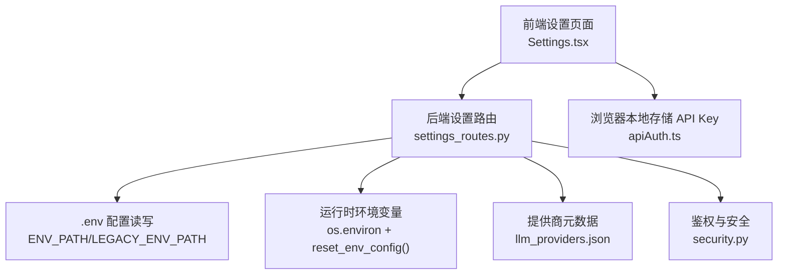
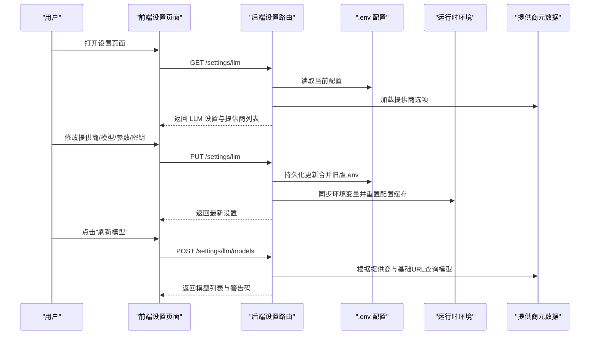
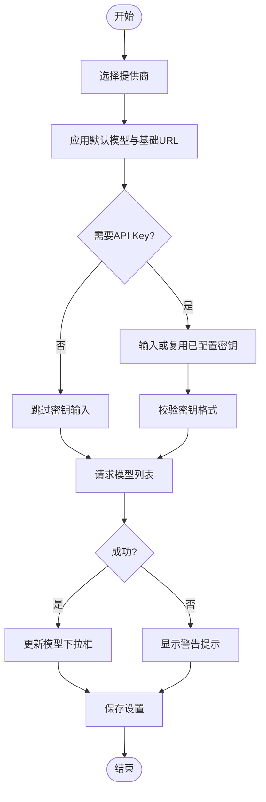
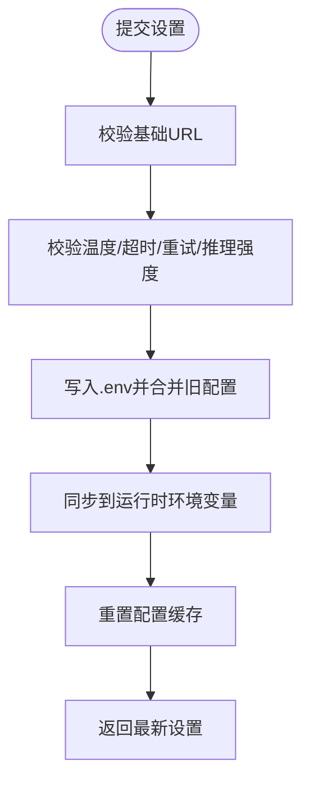
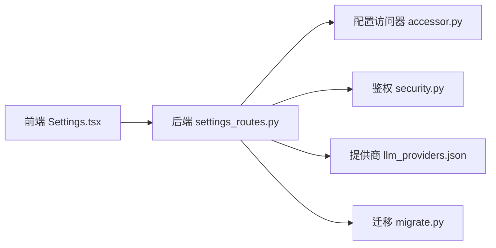

# 设置页面（Settings）

<cite>
**本文引用的文件**
- [agent/src/api/settings_routes.py](file://agent/src/api/settings_routes.py)
- [frontend/src/pages/Settings.tsx](file://frontend/src/pages/Settings.tsx)
- [agent/src/config/accessor.py](file://agent/src/config/accessor.py)
- [agent/src/config/migrate.py](file://agent/src/config/migrate.py)
- [agent/src/providers/llm_providers.json](file://agent/src/providers/llm_providers.json)
- [agent/src/api/security.py](file://agent/src/api/security.py)
- [frontend/src/lib/apiAuth.ts](file://frontend/src/lib/apiAuth.ts)
- [README_zh.md](file://README_zh.md)
- [README.md](file://README.md)
</cite>

## 目录
1. [简介](#简介)
2. [项目结构](#项目结构)
3. [核心组件](#核心组件)
4. [架构总览](#架构总览)
5. [详细组件分析](#详细组件分析)
6. [依赖关系分析](#依赖关系分析)
7. [性能与可靠性](#性能与可靠性)
8. [故障排除指南](#故障排除指南)
9. [结论](#结论)
10. [附录：配置项与默认值](#附录配置项与默认值)

## 简介
本章节面向 Vibe-Trading 的“设置”页面，系统性说明系统配置管理能力，包括：
- 模型提供商设置、API 密钥管理、连接配置、生成参数与推理强度等偏好设置
- 数据源凭据（如 Tushare Token）管理
- IM 通道运行状态查看与控制（启动/停止）
- QVeris 集成设置（独立面板）
- 配置验证机制、热重载支持、配置持久化与迁移
- 安全性考虑、权限控制、版本兼容性与前后端同步机制
- 配置文件格式规范、最佳实践与常见问题排查

该页面同时提供本地 API 访问密钥设置（非桌面模式），以及数据源加载器可用性提示。

**章节来源**
- [README_zh.md:1003-1005](file://README_zh.md#L1003-L1005)
- [README.md:1036-1044](file://README.md#L1036-L1044)

## 项目结构
设置功能由前端页面与后端路由共同实现：
- 前端：React 页面负责表单交互、错误提示、轮询通道状态、调用 API
- 后端：FastAPI 路由暴露 /settings/* 接口，负责读取/写入 .env、校验参数、同步运行时环境变量、返回结构化响应
- 配置层：通过 accessor 模块提供线程安全的配置缓存与重置能力；迁移模块负责历史状态迁移
- 提供商元数据：JSON 驱动，新增/修改提供商无需改代码
- 安全：基于 Bearer 令牌或回环信任的鉴权策略，敏感字段脱敏与白名单校验

**图表来源**
- [frontend/src/pages/Settings.tsx:62-120](file://frontend/src/pages/Settings.tsx#L62-L120)
- [agent/src/api/settings_routes.py:497-674](file://agent/src/api/settings_routes.py#L497-L674)
- [agent/src/config/accessor.py:52-93](file://agent/src/config/accessor.py#L52-L93)
- [agent/src/providers/llm_providers.json:1-200](file://agent/src/providers/llm_providers.json#L1-L200)
- [agent/src/api/security.py:343-483](file://agent/src/api/security.py#L343-L483)
- [frontend/src/lib/apiAuth.ts:1-21](file://frontend/src/lib/apiAuth.ts#L1-L21)

**章节来源**
- [frontend/src/pages/Settings.tsx:1-777](file://frontend/src/pages/Settings.tsx#L1-L777)
- [agent/src/api/settings_routes.py:1-674](file://agent/src/api/settings_routes.py#L1-L674)
- [agent/src/config/accessor.py:1-149](file://agent/src/config/accessor.py#L1-L149)
- [agent/src/config/migrate.py:1-153](file://agent/src/config/migrate.py#L1-L153)
- [agent/src/providers/llm_providers.json:1-200](file://agent/src/providers/llm_providers.json#L1-L200)
- [agent/src/api/security.py:343-483](file://agent/src/api/security.py#L343-L483)
- [frontend/src/lib/apiAuth.ts:1-21](file://frontend/src/lib/apiAuth.ts#L1-L21)

## 核心组件
- 设置页面（前端）
  - 并行拉取 LLM 设置、数据源设置、IM 通道状态
  - 提供商切换时应用默认模型与基础 URL
  - 动态刷新可用模型列表（支持 OAuth 与 API Key 两种认证类型）
  - 保存 LLM 设置与数据源凭据，桌面模式下将凭据写入系统安全存储并重启后端
  - 本地 API 访问密钥设置（非桌面模式）
- 设置路由（后端）
  - GET/PUT /settings/llm：获取/更新 LLM 设置
  - POST /settings/llm/models：按提供商与基础 URL 列出可用模型
  - GET/PUT /settings/data-sources：获取/更新数据源凭据
  - 配置校验：温度范围、推理强度枚举、Base URL 合法性、OAuth 专用校验
  - 持久化：合并旧版 .env，写入用户配置路径，必要时清空敏感字段
  - 热重载：写入后同步到 os.environ 并重置配置缓存
- 配置访问器
  - 单例 EnvConfig 缓存，线程安全
  - reset_env_config 用于热重载后刷新
- 提供商元数据
  - JSON 驱动，声明每个提供商的默认模型、基础 URL、是否必需 API Key、认证类型、登录命令等
- 安全与鉴权
  - 读操作要求本地或已认证；写操作要求更强认证
  - 开发模式下未配置 API_AUTH_KEY 时仅允许回环客户端
  - 敏感信息脱敏显示，禁止在 Base URL 中嵌入凭据

**章节来源**
- [frontend/src/pages/Settings.tsx:62-120](file://frontend/src/pages/Settings.tsx#L62-L120)
- [frontend/src/pages/Settings.tsx:178-208](file://frontend/src/pages/Settings.tsx#L178-L208)
- [frontend/src/pages/Settings.tsx:217-286](file://frontend/src/pages/Settings.tsx#L217-L286)
- [agent/src/api/settings_routes.py:497-674](file://agent/src/api/settings_routes.py#L497-L674)
- [agent/src/config/accessor.py:52-93](file://agent/src/config/accessor.py#L52-L93)
- [agent/src/providers/llm_providers.json:1-200](file://agent/src/providers/llm_providers.json#L1-L200)
- [agent/src/api/security.py:343-483](file://agent/src/api/security.py#L343-L483)

## 架构总览
设置页面的请求-响应流程如下：

**图表来源**
- [frontend/src/pages/Settings.tsx:62-120](file://frontend/src/pages/Settings.tsx#L62-L120)
- [frontend/src/pages/Settings.tsx:178-208](file://frontend/src/pages/Settings.tsx#L178-L208)
- [frontend/src/pages/Settings.tsx:217-286](file://frontend/src/pages/Settings.tsx#L217-L286)
- [agent/src/api/settings_routes.py:497-674](file://agent/src/api/settings_routes.py#L497-L674)
- [agent/src/config/accessor.py:52-93](file://agent/src/config/accessor.py#L52-L93)
- [agent/src/providers/llm_providers.json:1-200](file://agent/src/providers/llm_providers.json#L1-L200)

## 详细组件分析

### 模型提供商设置与 API 密钥管理
- 提供商选择与应用默认值
  - 切换提供商时自动应用默认模型与基础 URL
  - 支持 OAuth 与 API Key 两种认证类型
- API 密钥处理
  - 非桌面模式：输入框直接提交密钥；桌面模式：通过系统安全存储写入
  - 支持“清除密钥”选项，清空对应环境变量
  - 密钥有效性校验：拒绝占位符或无效格式
- 模型列表发现
  - 按提供商与基础 URL 调用 OpenAI 兼容的 /models 接口
  - 若失败或未提供密钥，退回默认模型并给出警告码
  - 对 OAuth 提供商禁用模型发现（返回不支持警告）

**图表来源**
- [frontend/src/pages/Settings.tsx:163-208](file://frontend/src/pages/Settings.tsx#L163-L208)
- [agent/src/api/settings_routes.py:589-633](file://agent/src/api/settings_routes.py#L589-L633)
- [agent/src/api/settings_routes.py:279-328](file://agent/src/api/settings_routes.py#L279-L328)

**章节来源**
- [frontend/src/pages/Settings.tsx:163-208](file://frontend/src/pages/Settings.tsx#L163-L208)
- [agent/src/api/settings_routes.py:589-633](file://agent/src/api/settings_routes.py#L589-L633)
- [agent/src/api/settings_routes.py:279-328](file://agent/src/api/settings_routes.py#L279-L328)

### 连接配置与生成参数
- 连接配置
  - 基础 URL 校验：必须为 HTTP(S)，不允许嵌入用户名/密码
  - OAuth 提供商使用专用校验函数限制合法端点
- 生成参数
  - 温度：0~2 范围校验
  - 超时秒数：1~3600 范围校验
  - 最大重试次数：0~20 范围校验
  - 推理强度：空或 none/low/medium/high/max 枚举校验
- 保存与热重载
  - 写入 .env 后同步到 os.environ 并重置配置缓存，使后续组件立即生效

**图表来源**
- [agent/src/api/settings_routes.py:506-587](file://agent/src/api/settings_routes.py#L506-L587)
- [agent/src/api/settings_routes.py:403-431](file://agent/src/api/settings_routes.py#L403-L431)
- [agent/src/config/accessor.py:79-93](file://agent/src/config/accessor.py#L79-L93)

**章节来源**
- [agent/src/api/settings_routes.py:506-587](file://agent/src/api/settings_routes.py#L506-L587)
- [agent/src/api/settings_routes.py:403-431](file://agent/src/api/settings_routes.py#L403-L431)
- [agent/src/config/accessor.py:79-93](file://agent/src/config/accessor.py#L79-L93)

### 数据源凭据管理（Tushare Token）
- 读取与更新
  - 支持输入新 Token 或清空现有 Token
  - 桌面模式：通过系统安全存储写入 TUSHARE_TOKEN
- 状态展示
  - 显示是否已配置、BaoStock 加载器是否可用与安装状态
- 热重载
  - 更新后同步到运行时环境变量并重置配置缓存

**章节来源**
- [frontend/src/pages/Settings.tsx:254-286](file://frontend/src/pages/Settings.tsx#L254-L286)
- [agent/src/api/settings_routes.py:635-674](file://agent/src/api/settings_routes.py#L635-L674)

### IM 通道运行状态与控制
- 状态轮询
  - 页面加载时并行获取通道状态，展示启用/加载/运行/不可用计数
- 控制操作
  - 支持启动/停止通道运行时，刷新状态
- 恢复提示
  - 显示适配器恢复建议与错误信息

**章节来源**
- [frontend/src/pages/Settings.tsx:122-144](file://frontend/src/pages/Settings.tsx#L122-L144)
- [frontend/src/pages/Settings.tsx:359-472](file://frontend/src/pages/Settings.tsx#L359-L472)

### QVeris 集成设置
- 独立面板，用于配置 QVeris 服务（启用/禁用、基础 URL、API Key、模式、预算额度等）
- 与主设置页面并列展示，遵循相同的安全与持久化策略

**章节来源**
- [frontend/src/pages/Settings.tsx:329-330](file://frontend/src/pages/Settings.tsx#L329-L330)
- [agent/src/api/qveris_routes.py:1-55](file://agent/src/api/qveris_routes.py#L1-L55)

### 本地 API 访问密钥设置（非桌面模式）
- 在浏览器本地存储中保存 API_AUTH_KEY
- 提交后刷新页面以应用新的鉴权头

**章节来源**
- [frontend/src/pages/Settings.tsx:288-319](file://frontend/src/pages/Settings.tsx#L288-L319)
- [frontend/src/lib/apiAuth.ts:1-21](file://frontend/src/lib/apiAuth.ts#L1-L21)

## 依赖关系分析
- 前端依赖
  - Settings.tsx 依赖 ModelPicker、QVerisSettings 子组件
  - 通过 api 模块调用后端接口，使用 i18n 进行多语言提示
- 后端依赖
  - settings_routes.py 依赖 accessor（配置缓存）、security（鉴权）、providers JSON（提供商元数据）
  - 通过 httpx 异步调用提供商模型列表接口
- 配置层依赖
  - accessor.py 提供线程安全的配置单例与重置
  - migrate.py 负责历史状态迁移，确保升级不丢失数据

**图表来源**
- [frontend/src/pages/Settings.tsx:1-777](file://frontend/src/pages/Settings.tsx#L1-L777)
- [agent/src/api/settings_routes.py:1-674](file://agent/src/api/settings_routes.py#L1-L674)
- [agent/src/config/accessor.py:1-149](file://agent/src/config/accessor.py#L1-L149)
- [agent/src/config/migrate.py:1-153](file://agent/src/config/migrate.py#L1-L153)
- [agent/src/providers/llm_providers.json:1-200](file://agent/src/providers/llm_providers.json#L1-L200)
- [agent/src/api/security.py:343-483](file://agent/src/api/security.py#L343-L483)

**章节来源**
- [frontend/src/pages/Settings.tsx:1-777](file://frontend/src/pages/Settings.tsx#L1-L777)
- [agent/src/api/settings_routes.py:1-674](file://agent/src/api/settings_routes.py#L1-L674)
- [agent/src/config/accessor.py:1-149](file://agent/src/config/accessor.py#L1-L149)
- [agent/src/config/migrate.py:1-153](file://agent/src/config/migrate.py#L1-L153)
- [agent/src/providers/llm_providers.json:1-200](file://agent/src/providers/llm_providers.json#L1-L200)
- [agent/src/api/security.py:343-483](file://agent/src/api/security.py#L343-L483)

## 性能与可靠性
- 并发读取
  - 前端并行拉取 LLM 设置、数据源设置、通道状态，提升首屏速度
- 热重载
  - 后端写入后立即同步环境变量并重置配置缓存，避免重启进程
- 健壮性
  - 模型列表请求失败时退回默认模型并提示
  - 配置写入失败返回明确错误信息（权限/路径问题）
- 安全
  - 读操作不创建 .env，仅返回相对路径
  - 写操作需更强认证，防止未授权更新
  - 敏感字段脱敏，禁止在 Base URL 中嵌入凭据

[本节为通用指导，不直接分析具体文件]

## 故障排除指南
- 无法加载设置
  - 检查网络与鉴权头是否正确
  - 确认后端服务正常运行
- 模型列表为空或失败
  - 确认基础 URL 正确且可访问
  - 如需 API Key，请提供有效密钥或使用受信任的基础 URL
- 保存设置失败
  - 检查 .env 文件权限与路径
  - 确认无其他进程锁定文件
- 通道状态异常
  - 尝试刷新状态，检查适配器安装与依赖
  - 查看恢复提示与错误信息
- 本地 API 访问密钥无效
  - 在非桌面模式下重新设置并刷新页面
  - 确认浏览器本地存储未被清理

**章节来源**
- [frontend/src/pages/Settings.tsx:62-120](file://frontend/src/pages/Settings.tsx#L62-L120)
- [frontend/src/pages/Settings.tsx:178-208](file://frontend/src/pages/Settings.tsx#L178-L208)
- [frontend/src/pages/Settings.tsx:217-286](file://frontend/src/pages/Settings.tsx#L217-L286)
- [agent/src/api/settings_routes.py:506-587](file://agent/src/api/settings_routes.py#L506-L587)
- [agent/src/api/settings_routes.py:635-674](file://agent/src/api/settings_routes.py#L635-L674)

## 结论
设置页面提供了完整的系统配置管理能力，涵盖模型提供商、API 密钥、连接参数、数据源凭据与 IM 通道控制。通过严格的参数校验、热重载机制与安全的鉴权策略，确保配置变更即时生效且安全可靠。结合 JSON 驱动的提供商元数据与配置迁移工具，系统具备良好的可扩展性与兼容性。

[本节为总结性内容，不直接分析具体文件]

## 附录：配置项与默认值
- LLM 设置
  - 提供商：从 llm_providers.json 加载
  - 模型名称：必填，默认使用提供商默认模型
  - 基础 URL：HTTP(S)，不允许嵌入凭据；OAuth 提供商使用专用校验
  - API Key：可选，支持清空；桌面模式写入系统安全存储
  - 温度：0~2，默认 0.0
  - 超时秒数：1~3600，默认 120
  - 最大重试次数：0~20，默认 2
  - 推理强度：空或 none/low/medium/high/max
  - SSE 超时秒数：默认 90
- 数据源设置
  - Tushare Token：可选，支持清空；桌面模式写入系统安全存储
  - BaoStock：显示是否支持与安装状态
- 安全与权限
  - 读操作：本地或已认证
  - 写操作：更强认证；开发模式下未配置 API_AUTH_KEY 仅允许回环
  - 敏感字段脱敏，禁止在 Base URL 中嵌入凭据
- 配置文件与迁移
  - 目标路径：用户配置路径（ENV_PATH），兼容旧版 LEGACY_ENV_PATH
  - 迁移：历史状态目录迁移至运行时根目录，原子移动与恢复

**章节来源**
- [agent/src/api/settings_routes.py:46-120](file://agent/src/api/settings_routes.py#L46-L120)
- [agent/src/api/settings_routes.py:336-400](file://agent/src/api/settings_routes.py#L336-L400)
- [agent/src/api/settings_routes.py:506-587](file://agent/src/api/settings_routes.py#L506-L587)
- [agent/src/api/settings_routes.py:635-674](file://agent/src/api/settings_routes.py#L635-L674)
- [agent/src/config/migrate.py:1-153](file://agent/src/config/migrate.py#L1-L153)
- [agent/src/providers/llm_providers.json:1-200](file://agent/src/providers/llm_providers.json#L1-L200)
- [agent/src/api/security.py:343-483](file://agent/src/api/security.py#L343-L483)
- [README_zh.md:1003-1005](file://README_zh.md#L1003-L1005)
- [README.md:1036-1044](file://README.md#L1036-L1044)