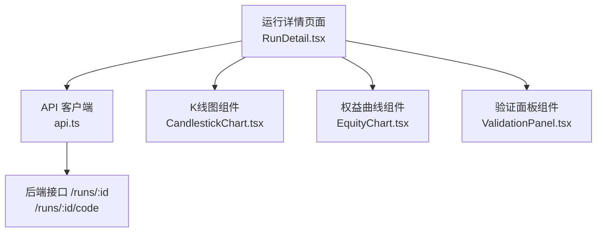
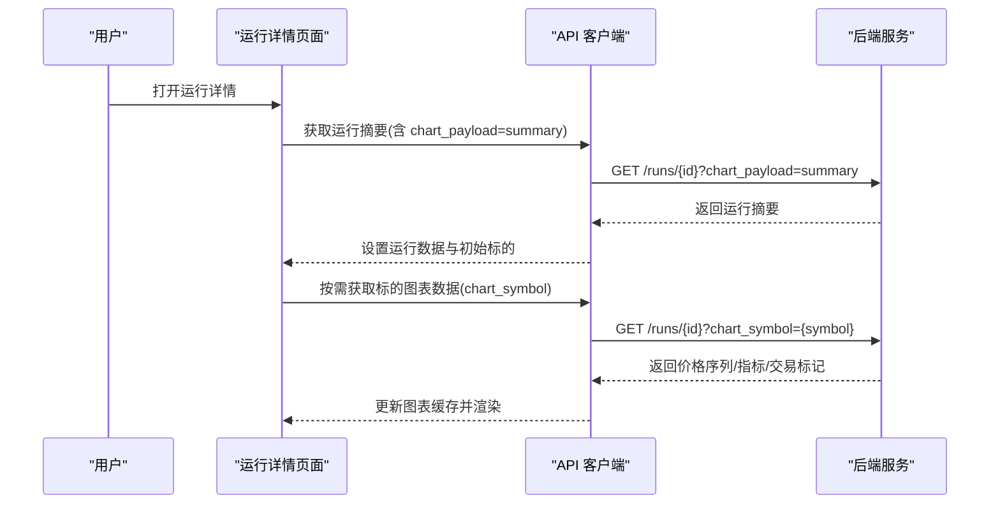
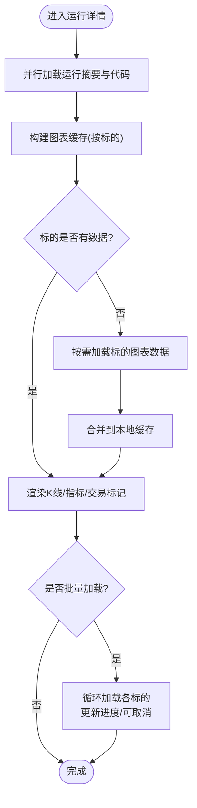
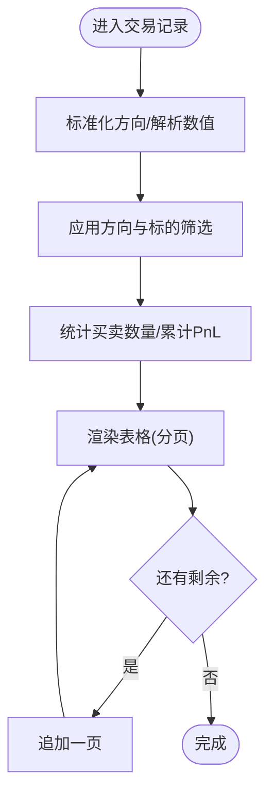
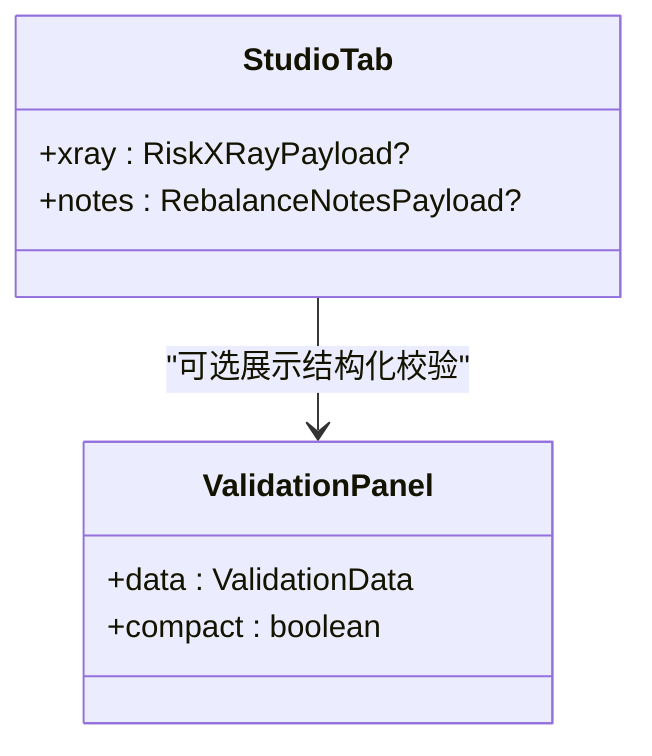
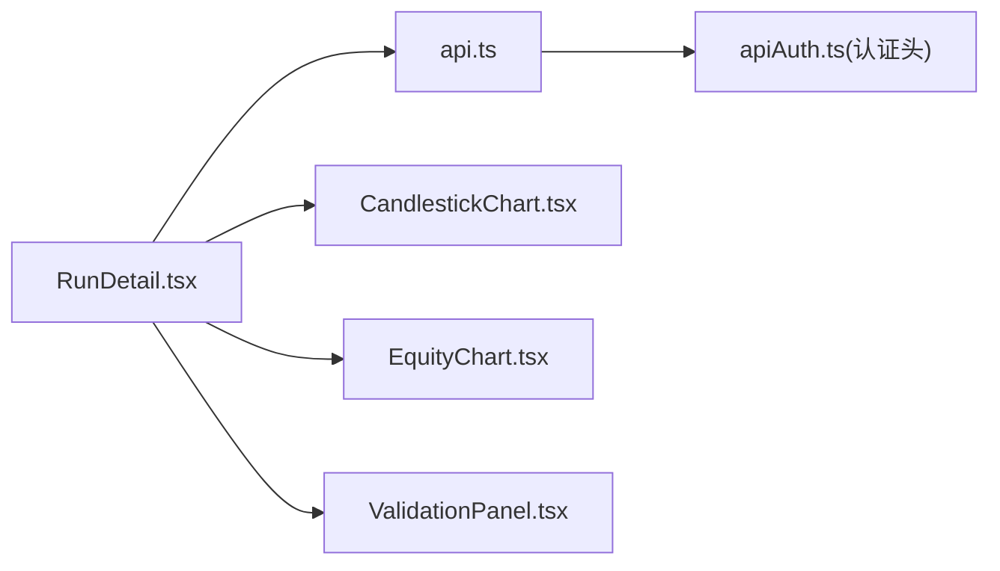

# 运行详情页面（RunDetail）

<cite>
**本文引用的文件**
- [frontend/src/pages/RunDetail.tsx](file://frontend/src/pages/RunDetail.tsx)
- [frontend/src/lib/api.ts](file://frontend/src/lib/api.ts)
- [frontend/src/components/charts/CandlestickChart.tsx](file://frontend/src/components/charts/CandlestickChart.tsx)
- [frontend/src/components/charts/EquityChart.tsx](file://frontend/src/components/charts/EquityChart.tsx)
- [frontend/src/components/charts/ValidationPanel.tsx](file://frontend/src/components/charts/ValidationPanel.tsx)
</cite>

## 目录
1. [简介](#简介)
2. [项目结构](#项目结构)
3. [核心组件](#核心组件)
4. [架构总览](#架构总览)
5. [详细组件分析](#详细组件分析)
6. [依赖关系分析](#依赖关系分析)
7. [性能考虑](#性能考虑)
8. [故障排查指南](#故障排查指南)
9. [结论](#结论)
10. [附录](#附录)

## 简介
本页面为 Vibe-Trading 的回测“运行详情”视图，用于集中展示一次回测运行的结果与过程。其能力覆盖：
- 绩效指标卡片、收益曲线与K线图、交易记录列表、风险评估与再平衡摘要、运行卡（Run Card）、源码查看等。
- 支持多标的图表叠加、批量加载、CSV导出、分页与筛选、错误边界保护等交互。
- 通过后端 API 按需拉取数据，结合前端缓存与进度反馈，实现大数据量下的流畅体验。

## 项目结构
运行详情页面由单一 React 组件构成，配合通用图表与验证面板组件以及统一的 API 客户端完成数据获取与渲染。



**图示来源**
- [frontend/src/pages/RunDetail.tsx:98-396](file://frontend/src/pages/RunDetail.tsx#L98-L396)
- [frontend/src/lib/api.ts:123-142](file://frontend/src/lib/api.ts#L123-L142)

**章节来源**
- [frontend/src/pages/RunDetail.tsx:98-396](file://frontend/src/pages/RunDetail.tsx#L98-L396)
- [frontend/src/lib/api.ts:123-142](file://frontend/src/lib/api.ts#L123-L142)

## 核心组件
- 运行详情主组件：负责路由参数解析、状态管理、标签页切换、数据加载、图表选择与批量加载、导出功能。
- 图表标签页：支持单标的/多标的叠加、进度条、取消批量加载。
- 交易记录标签页：支持按买卖方向与标的筛选、累计盈亏统计、分页加载。
- 运行卡标签页：展示运行元信息、指标、校验载荷、工件摘要等。
- 工作室标签页：展示风险X射线（集中度、波动率、回撤、权重）与再平衡摘要。
- 代码标签页：以Markdown高亮展示生成代码，支持复制。

**章节来源**
- [frontend/src/pages/RunDetail.tsx:98-396](file://frontend/src/pages/RunDetail.tsx#L98-L396)
- [frontend/src/pages/RunDetail.tsx:640-780](file://frontend/src/pages/RunDetail.tsx#L640-L780)
- [frontend/src/pages/RunDetail.tsx:806-953](file://frontend/src/pages/RunDetail.tsx#L806-L953)
- [frontend/src/pages/RunDetail.tsx:399-484](file://frontend/src/pages/RunDetail.tsx#L399-L484)
- [frontend/src/pages/RunDetail.tsx:491-572](file://frontend/src/pages/RunDetail.tsx#L491-L572)
- [frontend/src/pages/RunDetail.tsx:955-998](file://frontend/src/pages/RunDetail.tsx#L955-L998)

## 架构总览
页面采用“懒加载 + 本地缓存”的数据流设计：
- 初次进入时请求摘要数据（含基础指标、可用标的、权益曲线等）。
- 图表数据按标的按需加载，并维护本地缓存，避免重复请求。
- 提供批量加载所有标的的选项，带进度与取消控制。
- 交易记录与运行卡、工作室等模块直接基于已获取的运行数据渲染。



**图示来源**
- [frontend/src/pages/RunDetail.tsx:129-176](file://frontend/src/pages/RunDetail.tsx#L129-L176)
- [frontend/src/pages/RunDetail.tsx:205-235](file://frontend/src/pages/RunDetail.tsx#L205-L235)
- [frontend/src/lib/api.ts:134-141](file://frontend/src/lib/api.ts#L134-L141)

## 详细组件分析

### 数据获取与处理逻辑
- 运行摘要加载：进入页面时并行获取运行摘要与代码，初始化默认选中标的与图表缓存。
- 标的图表加载：当某个标的无历史数据时，触发按标的的增量请求；将价格序列、指标序列与交易标记合并入缓存。
- 批量加载：支持顺序加载全部可选标的，每步让出浏览器帧以保持UI响应，并提供进度与取消。
- 交易记录：对原始日志进行方向标准化、数值解析、汇总统计与分页显示。
- 运行卡/工作室：结构化展示运行元数据、校验载荷、风险指标与再平衡明细。



**图示来源**
- [frontend/src/pages/RunDetail.tsx:129-176](file://frontend/src/pages/RunDetail.tsx#L129-L176)
- [frontend/src/pages/RunDetail.tsx:205-235](file://frontend/src/pages/RunDetail.tsx#L205-L235)
- [frontend/src/pages/RunDetail.tsx:263-290](file://frontend/src/pages/RunDetail.tsx#L263-L290)

**章节来源**
- [frontend/src/pages/RunDetail.tsx:129-176](file://frontend/src/pages/RunDetail.tsx#L129-L176)
- [frontend/src/pages/RunDetail.tsx:205-235](file://frontend/src/pages/RunDetail.tsx#L205-L235)
- [frontend/src/pages/RunDetail.tsx:263-290](file://frontend/src/pages/RunDetail.tsx#L263-L290)
- [frontend/src/pages/RunDetail.tsx:806-953](file://frontend/src/pages/RunDetail.tsx#L806-L953)

### 图表渲染配置与交互
- K线图：接收价格序列、交易标记与指标序列，支持多标的叠加显示。
- 权益曲线：展示整体权益与回撤情况。
- 交互：可选择当前标的仅显示、添加/移除标的、批量加载与取消、进度条反馈。

```mermaid
classDiagram
class RunDetail {
+selectedSymbols : string[]
+chartCache : ChartCache
+bulkLoading : boolean
+bulkProgress : {done : number; total : number}
+loadChartSymbol(symbol)
+handleLoadAllChartSymbols()
}
class CandlestickChart {
+data : OHLCV[]
+markers : TradeMarker[]
+indicators : IndicatorSeries
+height : number
}
class EquityChart {
+data : EquityCurve[]
+height : number
}
RunDetail --> CandlestickChart : "传入数据"
RunDetail --> EquityChart : "传入权益曲线"
```

**图示来源**
- [frontend/src/pages/RunDetail.tsx:640-780](file://frontend/src/pages/RunDetail.tsx#L640-L780)
- [frontend/src/components/charts/CandlestickChart.tsx](file://frontend/src/components/charts/CandlestickChart.tsx)
- [frontend/src/components/charts/EquityChart.tsx](file://frontend/src/components/charts/EquityChart.tsx)

**章节来源**
- [frontend/src/pages/RunDetail.tsx:640-780](file://frontend/src/pages/RunDetail.tsx#L640-L780)

### 交易记录列表与筛选
- 支持按买卖方向与标的筛选，动态计算累计盈亏。
- 列根据数据可用性动态显示（如PnL、收益率、持仓天数）。
- 分页加载，支持“查看更多”。



**图示来源**
- [frontend/src/pages/RunDetail.tsx:806-953](file://frontend/src/pages/RunDetail.tsx#L806-L953)

**章节来源**
- [frontend/src/pages/RunDetail.tsx:806-953](file://frontend/src/pages/RunDetail.tsx#L806-L953)

### 风险评估与再平衡摘要
- 风险X射线：展示集中度（HHI、有效N）、年化波动率、最大回撤及权重分布。
- 再平衡摘要：展示再平衡次数、换手率均值/最大值、最大再平衡日期与明细表。



**图示来源**
- [frontend/src/pages/RunDetail.tsx:491-572](file://frontend/src/pages/RunDetail.tsx#L491-L572)
- [frontend/src/components/charts/ValidationPanel.tsx](file://frontend/src/components/charts/ValidationPanel.tsx)

**章节来源**
- [frontend/src/pages/RunDetail.tsx:491-572](file://frontend/src/pages/RunDetail.tsx#L491-L572)

### 报告导出能力
- 交易记录导出：将交易日志转换为CSV并下载。
- 指标导出：将回测指标键值对导出为CSV。
- 代码复制：一键复制当前激活的代码文件内容。

**章节来源**
- [frontend/src/pages/RunDetail.tsx:43-73](file://frontend/src/pages/RunDetail.tsx#L43-L73)
- [frontend/src/pages/RunDetail.tsx:345-363](file://frontend/src/pages/RunDetail.tsx#L345-L363)
- [frontend/src/pages/RunDetail.tsx:955-998](file://frontend/src/pages/RunDetail.tsx#L955-L998)

### 不同资产类别与对比分析
- 多标的叠加：可在同一图表中同时展示多个标的的价格与指标，便于跨资产对比。
- 权益曲线：统一展示组合层面的收益与回撤，适用于任何资产类别的回测结果。
- 交易记录：按标的维度筛选，便于横向比较不同资产的执行表现。

**章节来源**
- [frontend/src/pages/RunDetail.tsx:640-780](file://frontend/src/pages/RunDetail.tsx#L640-L780)
- [frontend/src/pages/RunDetail.tsx:806-953](file://frontend/src/pages/RunDetail.tsx#L806-L953)

## 依赖关系分析
- 页面依赖 API 客户端进行数据获取，包含认证头注入与错误处理。
- 图表组件作为纯展示层，接收标准化数据。
- 运行卡与验证面板复用通用展示组件，降低耦合。



**图示来源**
- [frontend/src/pages/RunDetail.tsx:98-396](file://frontend/src/pages/RunDetail.tsx#L98-L396)
- [frontend/src/lib/api.ts:1-100](file://frontend/src/lib/api.ts#L1-L100)

**章节来源**
- [frontend/src/pages/RunDetail.tsx:98-396](file://frontend/src/pages/RunDetail.tsx#L98-L396)
- [frontend/src/lib/api.ts:1-100](file://frontend/src/lib/api.ts#L1-L100)

## 性能考虑
- 按需加载：仅在需要时请求特定标的的图表数据，减少首屏负载。
- 本地缓存：使用内存缓存保存已加载标的的数据，避免重复网络请求。
- 批量加载优化：逐标的加载并在每步让出浏览器帧，保持界面响应；支持取消操作。
- 分页与筛选：交易记录采用分页加载，降低DOM压力。
- 错误边界：包裹主要内容区域，防止局部崩溃影响全局。

[本节为通用性能建议，不直接分析具体文件]

## 故障排查指南
- 无法加载运行数据：检查运行ID是否正确，确认后端接口 /runs/{id} 可达且返回JSON。
- 图表为空：确认标的是否存在于 price_series/chart_symbols；必要时手动触发按标的加载。
- 批量加载卡顿：观察进度条与取消按钮；若长时间无响应，尝试取消后重试。
- 交易记录缺失：确认 trade_log 是否为空；如为空则无交易记录可展示。
- 认证错误：API 客户端在401/403时提示需重新认证；请刷新或重新登录。

**章节来源**
- [frontend/src/lib/api.ts:60-100](file://frontend/src/lib/api.ts#L60-L100)
- [frontend/src/pages/RunDetail.tsx:129-176](file://frontend/src/pages/RunDetail.tsx#L129-L176)
- [frontend/src/pages/RunDetail.tsx:205-235](file://frontend/src/pages/RunDetail.tsx#L205-L235)
- [frontend/src/pages/RunDetail.tsx:263-290](file://frontend/src/pages/RunDetail.tsx#L263-L290)
- [frontend/src/pages/RunDetail.tsx:806-953](file://frontend/src/pages/RunDetail.tsx#L806-L953)

## 结论
运行详情页面通过“摘要优先、按需加载、本地缓存、批量可控”的策略，提供了高效、直观的回测结果展示与分析能力。其模块化设计与通用图表组件的结合，使得对不同资产类别的回测结果具备一致的可视化体验，并支持导出与进一步研究。

[本节为总结性内容，不直接分析具体文件]

## 附录
- 关键API路径
  - 获取运行摘要：GET /runs/{id}?chart_payload=summary
  - 获取标的图表：GET /runs/{id}?chart_symbol={symbol}
  - 获取运行代码：GET /runs/{id}/code

**章节来源**
- [frontend/src/lib/api.ts:134-142](file://frontend/src/lib/api.ts#L134-L142)