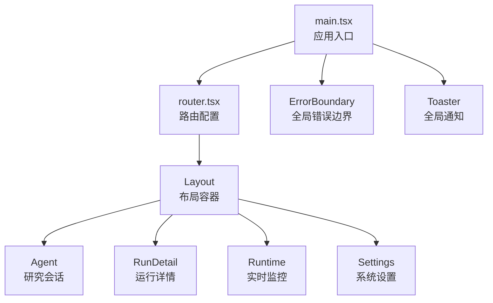
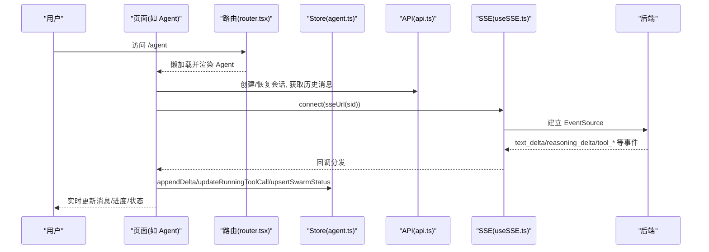
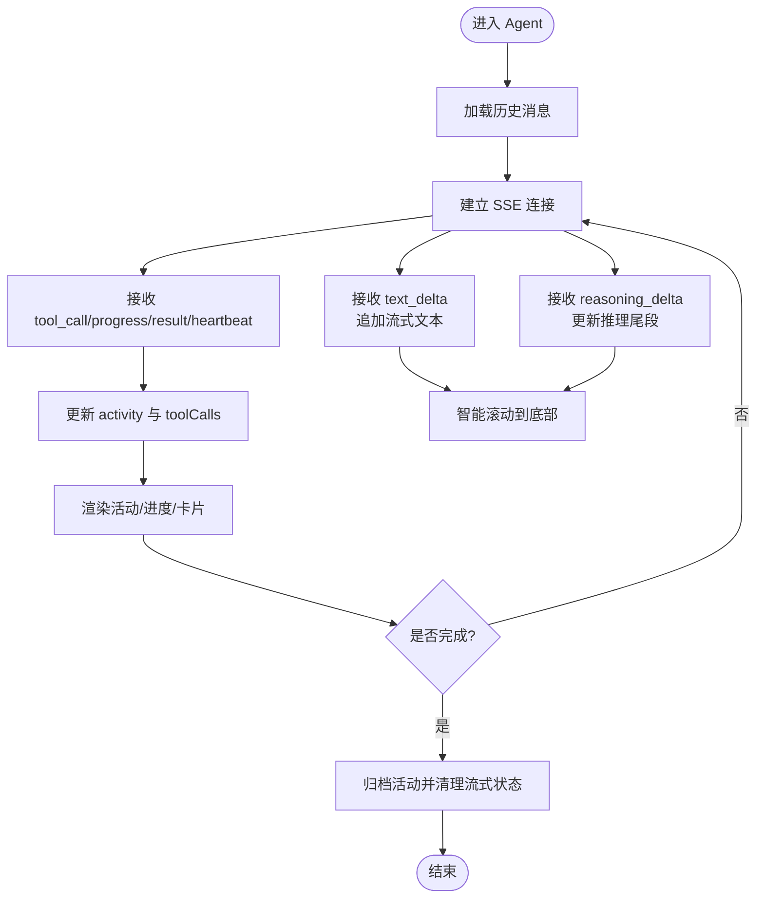
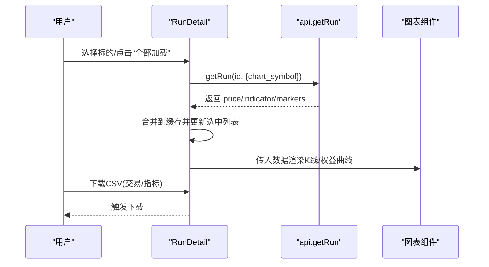
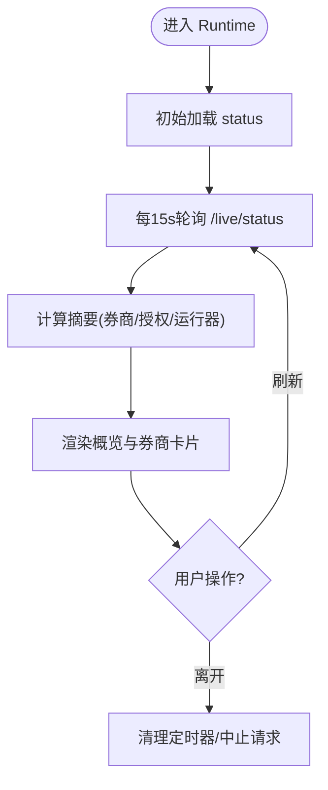
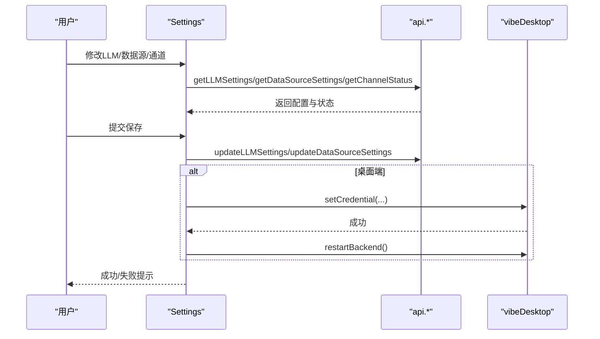
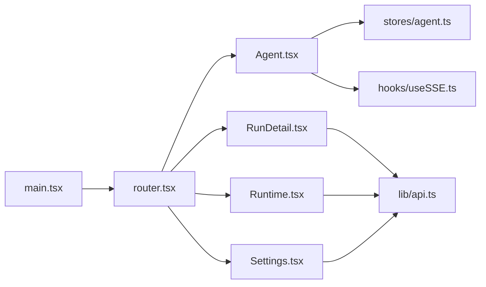

# 页面功能

<cite>
**本文引用的文件**
- [router.tsx](file://frontend/src/router.tsx)
- [main.tsx](file://frontend/src/main.tsx)
- [Agent.tsx](file://frontend/src/pages/Agent.tsx)
- [RunDetail.tsx](file://frontend/src/pages/RunDetail.tsx)
- [Runtime.tsx](file://frontend/src/pages/Runtime.tsx)
- [Settings.tsx](file://frontend/src/pages/Settings.tsx)
- [agent.ts](file://frontend/src/stores/agent.ts)
- [useSSE.ts](file://frontend/src/hooks/useSSE.ts)
- [api.ts](file://frontend/src/lib/api.ts)
</cite>

## 目录
1. [简介](#简介)
2. [项目结构](#项目结构)
3. [核心组件](#核心组件)
4. [架构总览](#架构总览)
5. [详细组件分析](#详细组件分析)
6. [依赖关系分析](#依赖关系分析)
7. [性能考虑](#性能考虑)
8. [故障排查指南](#故障排查指南)
9. [结论](#结论)

## 简介
本文件聚焦 Vibe-Trading 前端应用的页面功能，覆盖研究页面（Agent）、运行详情（RunDetail）、实时监控（Runtime）、设置页面（Settings）等关键页面的实现细节。文档说明路由配置、导航逻辑、数据获取策略、页面间通信与状态同步机制，并重点阐述实时数据更新、流式响应处理与用户体验优化方案。

## 项目结构
前端采用 React + React Router 的 SPA 架构，通过懒加载拆分页面模块，统一使用 Layout 包裹并提供全局错误边界与通知。路由层集中管理页面挂载与懒加载，主入口负责初始化 i18n、错误边界、路由与全局提示。

**图表来源**
- [main.tsx:28-35](file://frontend/src/main.tsx#L28-L35)
- [router.tsx:48-68](file://frontend/src/router.tsx#L48-L68)

**章节来源**
- [main.tsx:1-36](file://frontend/src/main.tsx#L1-L36)
- [router.tsx:1-69](file://frontend/src/router.tsx#L1-L69)

## 核心组件
- Agent：研究会话与流式交互的核心页面，维护消息历史、工具调用、Swarm 状态、目标面板与实时运行时面板，基于 SSE 接收后端事件并驱动 UI。
- RunDetail：展示单次运行的图表、交易明细、验证结果、代码与卡片信息，支持按需加载多标的图表与批量加载。
- Runtime：轮询后端 /live/status，聚合展示全局停机、券商连接、授权、运行器存活与风险状态。
- Settings：集中管理 LLM 提供商、模型、数据源、通道（Channel）运行状态与本地 API Key。

**章节来源**
- [Agent.tsx:208-800](file://frontend/src/pages/Agent.tsx#L208-L800)
- [RunDetail.tsx:98-397](file://frontend/src/pages/RunDetail.tsx#L98-L397)
- [Runtime.tsx:24-181](file://frontend/src/pages/Runtime.tsx#L24-L181)
- [Settings.tsx:37-120](file://frontend/src/pages/Settings.tsx#L37-L120)

## 架构总览
页面通过统一的 API 层与后端交互，Agent 使用 SSE 进行双向流式通信；其他页面使用 REST 轮询或一次性请求。状态管理集中在 Zustand store（Agent），各页面通过 hooks 订阅最小化重渲染。

**图表来源**
- [router.tsx:48-68](file://frontend/src/router.tsx#L48-L68)
- [useSSE.ts:71-134](file://frontend/src/hooks/useSSE.ts#L71-L134)
- [api.ts:181-188](file://frontend/src/lib/api.ts#L181-L188)
- [agent.ts:119-165](file://frontend/src/stores/agent.ts#L119-L165)

## 详细组件分析

### 研究页面（Agent）
- 功能要点
  - 会话管理：创建/切换会话，加载历史消息，缓存最近会话。
  - 流式交互：基于 SSE 接收文本增量、推理尾段、工具调用与进度、心跳、完成事件，合并为消息与活动轨迹。
  - 工具与 Swarm：跟踪工具调用状态与进度，聚合 Swarm 运行状态，生成时间线视图。
  - 目标面板：根据目标快照动态构建继续/启动提示，拉取证据与状态。
  - 实时运行时面板：在会话中嵌入 Live 动作与授权提案卡片。
  - 滚动与性能：智能滚动、节流刷新、动画帧合并进度更新、去抖流式文本。
- 数据流
  - 历史加载：调用 API 获取会话消息，转换为内部消息格式，附带工具时间线与运行指标卡片。
  - SSE 事件：text_delta 追加流式文本；reasoning_delta 替换推理尾段；tool_call/tool_result/tool_progress/tool_heartbeat 更新活动与工具状态；compact/stream_reset 清理视图；message.received 防重复插入用户消息。
  - 状态同步：Zustand store 维护 messages、activity、toolCalls、swarmRuns、sseStatus 等，页面仅订阅所需字段。
- 交互流程
  - 发送消息 -> 创建会话 -> 建立 SSE -> 流式输出 -> 工具执行 -> 完成归档 -> 可选打开运行详情。
- 错误处理
  - 认证失败提示；SSE 断线自动重连；后台任务完成后标题闪烁提示；网络异常时降级显示链接。

**图表来源**
- [Agent.tsx:642-800](file://frontend/src/pages/Agent.tsx#L642-L800)
- [useSSE.ts:71-134](file://frontend/src/hooks/useSSE.ts#L71-L134)
- [agent.ts:167-250](file://frontend/src/stores/agent.ts#L167-L250)

**章节来源**
- [Agent.tsx:1-800](file://frontend/src/pages/Agent.tsx#L1-L800)
- [agent.ts:1-336](file://frontend/src/stores/agent.ts#L1-L336)
- [useSSE.ts:1-216](file://frontend/src/hooks/useSSE.ts#L1-L216)
- [api.ts:123-200](file://frontend/src/lib/api.ts#L123-L200)

### 运行详情（RunDetail）
- 功能要点
  - 标签页：图表、交易、验证、运行卡、代码、工作室（风险与调仓）。
  - 图表加载：按标的按需加载 price_series、indicator_series、trade_markers，支持批量加载与取消。
  - 导出：交易与指标导出 CSV。
  - 状态：成功/失败/取消状态标识与耗时展示。
- 数据流
  - 初始加载：并行获取 run 摘要与代码，计算首个标的并预加载图表。
  - 增量加载：选择新标的后调用 getRun 带 chart_symbol 参数，合并到缓存并更新 UI。
  - 批量加载：顺序加载所有标的，每步让出浏览器主线程避免卡顿。
- 交互流程
  - 选择标的 -> 加载图表 -> 叠加指标与标记 -> 可导出或切换标签。
- 错误处理
  - 无运行数据时提示；加载失败保持已有缓存；取消批量加载立即停止。

**图表来源**
- [RunDetail.tsx:129-176](file://frontend/src/pages/RunDetail.tsx#L129-L176)
- [RunDetail.tsx:205-286](file://frontend/src/pages/RunDetail.tsx#L205-L286)
- [api.ts:134-142](file://frontend/src/lib/api.ts#L134-L142)

**章节来源**
- [RunDetail.tsx:1-397](file://frontend/src/pages/RunDetail.tsx#L1-L397)

### 实时监控（Runtime）
- 功能要点
  - 轮询后端 /live/status，展示全局停机、券商数量、已授权数、运行器数量。
  - 每个券商卡片展示授权、运行器存活、指令限制、风险状态、最后tick时间。
  - SDK 连接器支持验证连接与诊断。
- 数据流
  - 定时轮询：15秒刷新一次；每秒更新时间用于倒计时与相对时间显示。
  - 摘要计算：汇总券商数量、授权数、运行器数量。
- 交互流程
  - 进入页面 -> 初始加载 -> 定时刷新 -> 用户手动刷新 -> 展示最新状态。
- 错误处理
  - 请求失败时显示不可用提示；AbortController 取消过期请求；卸载时清理定时器。

**图表来源**
- [Runtime.tsx:40-81](file://frontend/src/pages/Runtime.tsx#L40-L81)
- [Runtime.tsx:487-496](file://frontend/src/pages/Runtime.tsx#L487-L496)

**章节来源**
- [Runtime.tsx:1-590](file://frontend/src/pages/Runtime.tsx#L1-L590)

### 设置页面（Settings）
- 功能要点
  - LLM 设置：提供商、模型、基础地址、温度、超时、重试次数、推理努力等级。
  - 数据源设置：Tushare Token 等。
  - 通道管理：查看/启动/停止 Channel，显示可用性与安装提示。
  - 本地 API Key：非桌面端可设置本地访问密钥。
- 数据流
  - 初始化：并行获取 LLM 设置、数据源设置、通道状态。
  - 保存：提交表单更新后端配置，桌面端写入凭证并重启后端。
  - 模型发现：根据提供商与基础地址拉取模型列表，处理警告码。
- 交互流程
  - 选择提供商 -> 应用默认值 -> 拉取模型 -> 填写参数 -> 保存 -> 反馈成功/失败。
- 错误处理
  - 认证失败提示；加载失败显示错误信息；保存失败弹出错误提示。

**图表来源**
- [Settings.tsx:62-120](file://frontend/src/pages/Settings.tsx#L62-L120)
- [Settings.tsx:217-252](file://frontend/src/pages/Settings.tsx#L217-L252)
- [Settings.tsx:254-286](file://frontend/src/pages/Settings.tsx#L254-L286)

**章节来源**
- [Settings.tsx:1-777](file://frontend/src/pages/Settings.tsx#L1-L777)

## 依赖关系分析
- 路由与懒加载：router.tsx 使用 createBrowserRouter 与 lazy 导入页面，统一用 wrap 包裹 Suspense 提供加载占位。
- 主入口：main.tsx 注入 ErrorBoundary、RouterProvider、Toaster，并在空闲时预取图表组件。
- 数据层：api.ts 封装 fetch 请求、鉴权头、错误转换、SSE URL 构造。
- 实时通信：useSSE.ts 提供自动重连、指数退避、LRU 去重、Last-Event-ID 续传。
- 状态管理：agent.ts 使用 Zustand 管理会话消息、活动、工具调用、Swarm 状态与 SSE 状态。

**图表来源**
- [router.tsx:48-68](file://frontend/src/router.tsx#L48-L68)
- [main.tsx:28-35](file://frontend/src/main.tsx#L28-L35)
- [api.ts:123-200](file://frontend/src/lib/api.ts#L123-L200)
- [useSSE.ts:176-214](file://frontend/src/hooks/useSSE.ts#L176-L214)
- [agent.ts:119-165](file://frontend/src/stores/agent.ts#L119-L165)

**章节来源**
- [router.tsx:1-69](file://frontend/src/router.tsx#L1-L69)
- [main.tsx:1-36](file://frontend/src/main.tsx#L1-L36)
- [api.ts:1-200](file://frontend/src/lib/api.ts#L1-L200)
- [useSSE.ts:1-216](file://frontend/src/hooks/useSSE.ts#L1-L216)
- [agent.ts:1-336](file://frontend/src/stores/agent.ts#L1-L336)

## 性能考虑
- 懒加载与预取：页面模块按需加载，主入口空闲时预取常用图表组件以减少首屏延迟。
- 流式渲染优化：
  - Agent 使用定时器合并增量文本（约80ms），动画帧合并工具进度更新，避免频繁重渲染。
  - 智能滚动：仅在接近底部时自动滚动，减少不必要的 DOM 操作。
- 图表按需加载：RunDetail 对每个标的单独请求图表数据，支持批量加载并让出主线程。
- 轮询控制：Runtime 使用 AbortController 取消过期请求，防止竞态与内存泄漏。
- 缓存策略：Agent 缓存最近会话消息与 Swarm 状态，减少重复请求。

[本节为通用性能建议，不直接分析具体文件]

## 故障排查指南
- 认证问题
  - 现象：页面提示需要认证或接口返回 401/403。
  - 处理：检查本地 API Key 设置（Settings），确认鉴权头注入；Agent 中会识别认证失败并提示。
- SSE 连接问题
  - 现象：流式输出中断或长时间无响应。
  - 处理：useSSE 自动重连与指数退避；检查 Last-Event-ID 续传；确认后端事件类型匹配。
- 图表加载失败
  - 现象：RunDetail 图表空白或报错。
  - 处理：检查 runId 是否存在；确认 chart_symbol 参数；查看网络请求与错误日志。
- 运行时状态不可用
  - 现象：Runtime 显示不可用或空数据。
  - 处理：检查 /live/status 可达性；确认后端服务与券商连接；查看错误提示与诊断信息。
- 设置保存失败
  - 现象：LLM/数据源设置无法保存。
  - 处理：检查表单输入与必填项；桌面端需写入凭证并重启后端；查看 toast 错误信息。

**章节来源**
- [api.ts:60-100](file://frontend/src/lib/api.ts#L60-L100)
- [useSSE.ts:122-174](file://frontend/src/hooks/useSSE.ts#L122-L174)
- [Settings.tsx:217-252](file://frontend/src/pages/Settings.tsx#L217-L252)
- [Runtime.tsx:40-81](file://frontend/src/pages/Runtime.tsx#L40-L81)

## 结论
Vibe-Trading 前端通过清晰的路由与懒加载、统一的 API 层与 SSE 流式通信、以及 Zustand 状态管理，实现了研究、运行详情、实时监控与设置等核心页面的高效交互与稳定体验。Agent 页面以流式事件驱动为核心，结合进度合并与智能滚动提升用户体验；RunDetail 支持按需与批量图表加载；Runtime 提供稳定的轮询监控；Settings 集中管理配置与通道状态。整体架构具备良好的可扩展性与可维护性，适合持续迭代与扩展更多页面与功能。