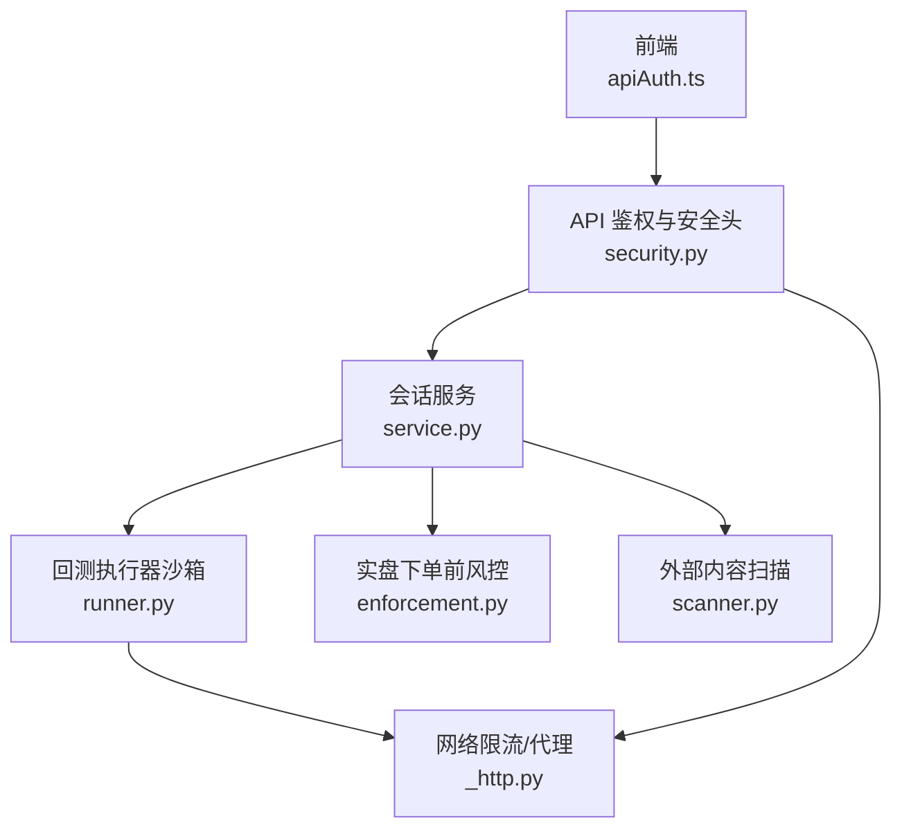
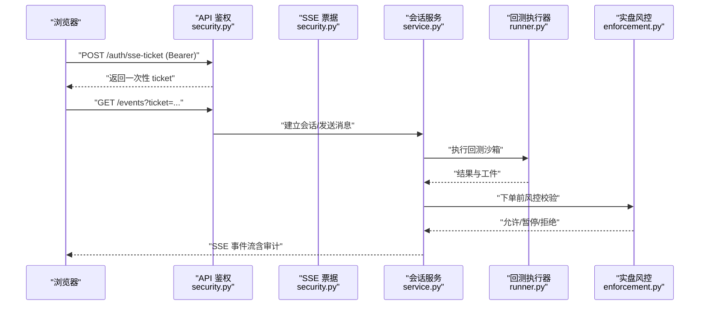
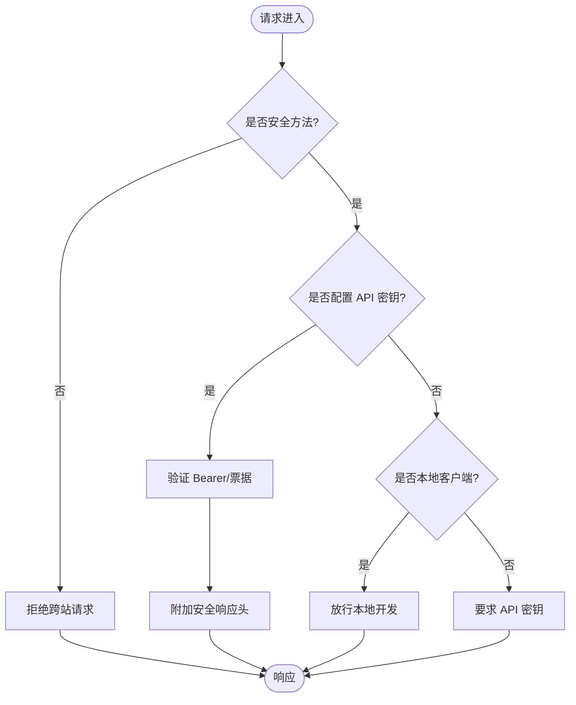
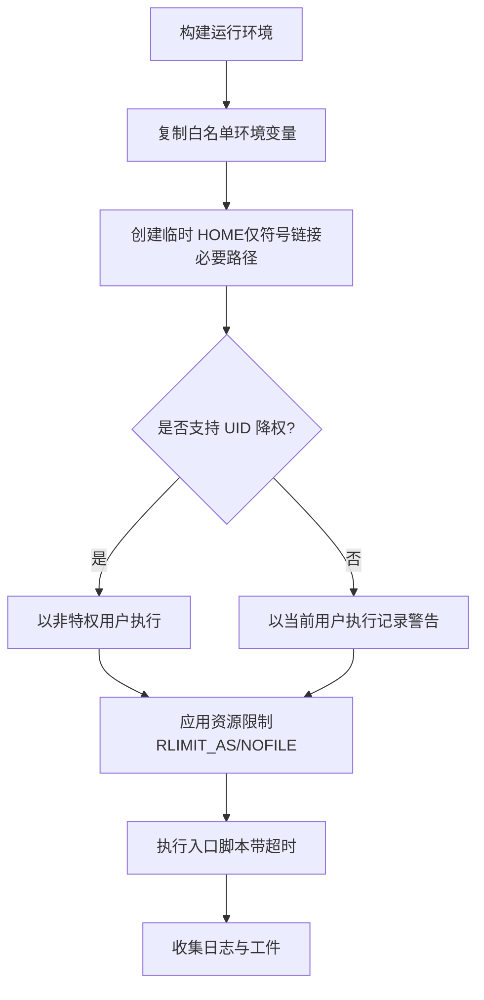
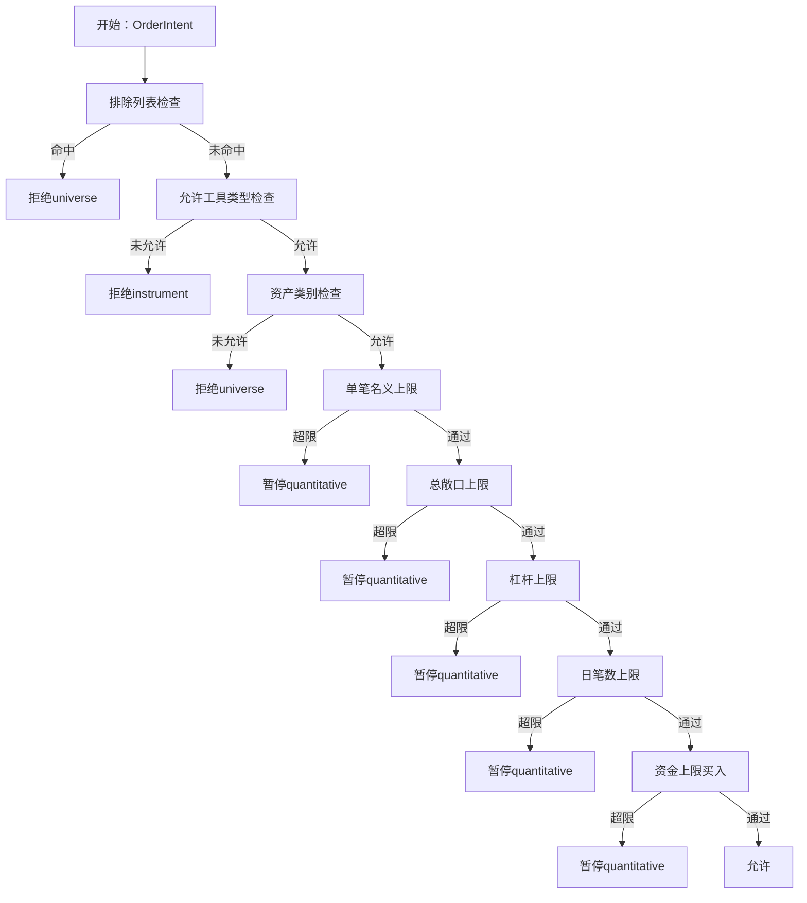
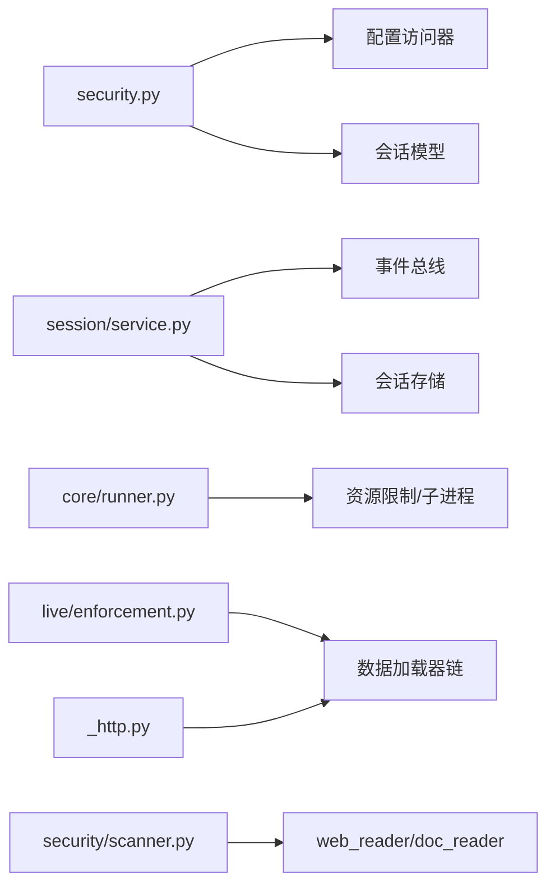

# 安全系统

<cite>
**本文引用的文件**
- [agent/src/api/security.py](file://agent/src/api/security.py)
- [agent/src/core/runner.py](file://agent/src/core/runner.py)
- [agent/src/session/service.py](file://agent/src/session/service.py)
- [agent/src/live/enforcement.py](file://agent/src/live/enforcement.py)
- [agent/src/security/scanner.py](file://agent/src/security/scanner.py)
- [agent/src/security/network.py](file://agent/src/security/network.py)
- [agent/backtest/loaders/_http.py](file://agent/backtest/loaders/_http.py)
- [frontend/src/lib/apiAuth.ts](file://frontend/src/lib/apiAuth.ts)
- [SECURITY.md](file://SECURITY.md)
</cite>

## 目录
1. [简介](#简介)
2. [项目结构](#项目结构)
3. [核心组件](#核心组件)
4. [架构总览](#架构总览)
5. [详细组件分析](#详细组件分析)
6. [依赖关系分析](#依赖关系分析)
7. [性能与安全权衡](#性能与安全权衡)
8. [故障排查指南](#故障排查指南)
9. [结论](#结论)
10. [附录：配置与最佳实践](#附录配置与最佳实践)

## 简介
本文件为 Vibe-Trading 的安全系统提供全面、可操作的安全文档，覆盖认证授权、API 密钥管理、会话管理、权限控制、审计日志、沙箱执行环境、代码隔离、资源限制、网络控制、文件访问控制、威胁模型与防护措施、常见安全问题及解决方案。重点强调多层防护、沙箱机制与审计追踪系统，帮助运维与开发者在本地与生产环境中安全部署与运行。

## 项目结构
围绕安全的关键模块分布在后端 API、会话服务、回测执行器、实盘风控、外部内容扫描与网络工具中；前端负责 API 密钥的存储与注入。整体采用“默认拒绝 + 最小暴露”的设计原则，结合运行时限制与静态检查形成纵深防御。



**图表来源**
- [agent/src/api/security.py:166-253](file://agent/src/api/security.py#L166-L253)
- [agent/src/session/service.py:158-246](file://agent/src/session/service.py#L158-L246)
- [agent/src/core/runner.py:431-590](file://agent/src/core/runner.py#L431-L590)
- [agent/src/live/enforcement.py:455-617](file://agent/src/live/enforcement.py#L455-L617)
- [agent/backtest/loaders/_http.py:88-129](file://agent/backtest/loaders/_http.py#L88-L129)
- [frontend/src/lib/apiAuth.ts:1-21](file://frontend/src/lib/apiAuth.ts#L1-L21)

**章节来源**
- [agent/src/api/security.py:166-253](file://agent/src/api/security.py#L166-L253)
- [agent/src/session/service.py:158-246](file://agent/src/session/service.py#L158-L246)
- [agent/src/core/runner.py:431-590](file://agent/src/core/runner.py#L431-L590)
- [agent/src/live/enforcement.py:455-617](file://agent/src/live/enforcement.py#L455-L617)
- [agent/backtest/loaders/_http.py:88-129](file://agent/backtest/loaders/_http.py#L88-L129)
- [frontend/src/lib/apiAuth.ts:1-21](file://frontend/src/lib/apiAuth.ts#L1-L21)

## 核心组件
- 认证与授权：基于 Bearer Token 的共享密钥认证、SSE 一次性票据、跨站请求保护、CORS 白名单、安全响应头。
- 会话管理：单会话并发控制、尝试生命周期、事件总线 SSE 推送、取消与恢复。
- 沙箱执行：子进程隔离、受限环境变量白名单、临时 HOME、UID 降权（容器）、地址空间与文件描述符限制。
- 实盘风控：指令意图规范化、强制失败关闭策略、逐层限额校验（标的、资产类别、单笔名义、总敞口、杠杆、日笔数、资金）。
- 外部内容安全：提示注入检测、特殊标记防伪造、安全告警元数据注入。
- 网络控制：按主机限速、连接池复用、代理与证书透传。

**章节来源**
- [agent/src/api/security.py:343-622](file://agent/src/api/security.py#L343-L622)
- [agent/src/session/service.py:53-246](file://agent/src/session/service.py#L53-L246)
- [agent/src/core/runner.py:33-278](file://agent/src/core/runner.py#L33-L278)
- [agent/src/live/enforcement.py:1-26](file://agent/src/live/enforcement.py#L1-L26)
- [agent/src/security/scanner.py:1-220](file://agent/src/security/scanner.py#L1-L220)
- [agent/backtest/loaders/_http.py:88-129](file://agent/backtest/loaders/_http.py#L88-L129)

## 架构总览
下图展示从浏览器到后端的完整安全链路：前端携带 API 密钥或获取一次性票据，服务端进行 CORS/Host/DNS 重绑定防护、安全头注入、访问日志脱敏；会话服务保证单会话串行执行并记录审计事件；回测执行器在沙箱内运行，限制资源与环境；实盘下单前通过风控门控强制失败关闭；外部内容读取时注入安全警告并中和危险标记。



**图表来源**
- [agent/src/api/security.py:300-341](file://agent/src/api/security.py#L300-L341)
- [agent/src/api/security.py:571-622](file://agent/src/api/security.py#L571-L622)
- [agent/src/session/service.py:158-246](file://agent/src/session/service.py#L158-L246)
- [agent/src/core/runner.py:503-590](file://agent/src/core/runner.py#L503-L590)
- [agent/src/live/enforcement.py:455-617](file://agent/src/live/enforcement.py#L455-L617)

## 详细组件分析

### 认证与授权（API 密钥、SSE 票据、CORS、安全头）
- 共享密钥认证：支持 Header 与可选查询参数（受控），使用常量时间比较防止时序攻击。
- SSE 票据：浏览器无法发送 Authorization 头，通过 POST 获取短生命周期一次性票据，避免密钥进入 URL/历史/Referer。
- 跨站请求保护：对非安全方法拦截 cross-site 请求，校验 Origin 与 Host。
- CORS：禁止凭据模式下的通配符，支持追加额外可信来源。
- 安全响应头：CSP、X-Content-Type-Options、X-Frame-Options、Permissions-Policy、Referrer-Policy。
- 访问日志脱敏：对敏感查询参数值进行脱敏，防止泄露。



**图表来源**
- [agent/src/api/security.py:383-451](file://agent/src/api/security.py#L383-L451)
- [agent/src/api/security.py:571-622](file://agent/src/api/security.py#L571-L622)
- [agent/src/api/security.py:166-253](file://agent/src/api/security.py#L166-L253)
- [agent/src/api/security.py:260-297](file://agent/src/api/security.py#L260-L297)

**章节来源**
- [agent/src/api/security.py:300-622](file://agent/src/api/security.py#L300-L622)
- [agent/src/api/security.py:166-253](file://agent/src/api/security.py#L166-L253)
- [agent/src/api/security.py:260-297](file://agent/src/api/security.py#L260-L297)

### 会话管理与审计追踪
- 单会话并发控制：每个会话同一时刻仅一个 AgentLoop，避免消息交错与状态竞争。
- 尝试生命周期：创建、运行、完成/取消/失败，持久化并广播事件。
- 事件总线：通过 SSE 将 tool_call/tool_result 等事件实时推送给前端，形成审计轨迹。
- 取消与恢复：支持取消当前任务，释放占用，避免会话永久锁定。

```mermaid
sequenceDiagram
participant Client as "客户端"
participant Service as "会话服务<br/>service.py"
participant Bus as "事件总线"
participant Loop as "AgentLoop"
Client->>Service : "send_message(session_id, content)"
Service->>Service : "_reserve_session()"
Service->>Bus : "message.received"
Service->>Loop : "异步执行 attempt"
Loop-->>Bus : "tool_call/tool_result"
Loop-->>Service : "完成/取消/失败"
Service->>Bus : "attempt.completed/cancelled/failed"
```

**图表来源**
- [agent/src/session/service.py:158-246](file://agent/src/session/service.py#L158-L246)
- [agent/src/session/service.py:248-345](file://agent/src/session/service.py#L248-L345)

**章节来源**
- [agent/src/session/service.py:53-246](file://agent/src/session/service.py#L53-L246)
- [agent/src/session/service.py:248-345](file://agent/src/session/service.py#L248-L345)

### 沙箱执行环境与代码隔离
- 子进程隔离：生成的回测代码在独立进程中执行，超时保护。
- 环境变量白名单：仅传递必要的环境变量（代理、证书、只读市场数据凭证等），不继承 LLM/API/Broker 密钥。
- 临时 HOME：为子进程创建临时 HOME，仅以符号链接方式暴露必要的缓存/配置文件路径，阻断对真实用户主目录的广泛读取。
- UID 降权：在支持的容器中降权至非特权用户执行。
- 资源限制：设置 RLIMIT_AS（虚拟内存上限）与 RLIMIT_NOFILE（文件描述符上限），防止 DoS。
- 工作目录与根目录限制：显式传递允许的 run_dir，并在子进程再次校验。



**图表来源**
- [agent/src/core/runner.py:175-278](file://agent/src/core/runner.py#L175-L278)
- [agent/src/core/runner.py:113-172](file://agent/src/core/runner.py#L113-L172)
- [agent/src/core/runner.py:85-111](file://agent/src/core/runner.py#L85-L111)
- [agent/src/core/runner.py:480-590](file://agent/src/core/runner.py#L480-L590)

**章节来源**
- [agent/src/core/runner.py:33-278](file://agent/src/core/runner.py#L33-L278)
- [agent/src/core/runner.py:480-590](file://agent/src/core/runner.py#L480-L590)

### 网络控制与文件访问控制
- 网络限流：按主机桶维护最小请求间隔，避免触发第三方限流与滥用。
- 连接池复用：按 host bucket 复用 requests.Session，减少握手开销。
- 代理与证书：透传 HTTP_PROXY/HTTPS_PROXY/ALL_PROXY/NO_PROXY 与证书相关环境变量，确保数据源可达。
- 文件访问控制：沙箱 HOME 仅暴露必要路径；生成代码无法读取真实 ~/.vibe-trading 中的敏感文件与会话数据库。

**章节来源**
- [agent/backtest/loaders/_http.py:88-129](file://agent/backtest/loaders/_http.py#L88-L129)
- [agent/src/core/runner.py:175-278](file://agent/src/core/runner.py#L175-L278)
- [agent/src/core/runner.py:113-172](file://agent/src/core/runner.py#L113-L172)

### 权限控制与实盘风控（mandate enforcement）
- 指令意图规范化：统一 symbol/side/notional/quantity/instrument_type/asset_class。
- 强制失败关闭：任何不可解析或缺失数据均拒绝订单，绝不放行。
- 逐层限额校验：排除列表 → 允许的工具类型 → 资产类别 → 单笔名义 → 总敞口 → 杠杆 → 日笔数 → 资金（最后防线）。
- 结构化违规与定量违规：结构性违规直接拒绝；定量违规暂停并要求重新授权。
- 市场数据兜底：当券商报价不可用时，通过数据加载器链获取最近收盘价估算名义价值。



**图表来源**
- [agent/src/live/enforcement.py:455-617](file://agent/src/live/enforcement.py#L455-L617)
- [agent/src/live/enforcement.py:620-676](file://agent/src/live/enforcement.py#L620-L676)

**章节来源**
- [agent/src/live/enforcement.py:1-26](file://agent/src/live/enforcement.py#L1-L26)
- [agent/src/live/enforcement.py:455-617](file://agent/src/live/enforcement.py#L455-L617)
- [agent/src/live/enforcement.py:620-676](file://agent/src/live/enforcement.py#L620-L676)

### 外部内容安全与提示注入防护
- 提示注入规则：识别试图覆盖系统指令、泄露隐藏 prompt、冒充角色/通道、窃取密钥、调用 shell 等模式。
- 特殊标记中和：插入零宽空格破坏 tokenizer 的特殊标记匹配，防止外部文本伪造角色边界。
- 安全告警元数据：为工具返回载荷添加 security_warnings，下游可据此采取降级或人工审核。

**章节来源**
- [agent/src/security/scanner.py:1-220](file://agent/src/security/scanner.py#L1-L220)

### 前端 API 密钥管理
- 本地存储：将 API 密钥保存在浏览器本地存储，提供 get/set 接口。
- 请求头注入：在发起 API 请求时自动附加 Authorization: Bearer <key>。
- 空值处理：清空输入时移除存储键，避免无效请求。

**章节来源**
- [frontend/src/lib/apiAuth.ts:1-21](file://frontend/src/lib/apiAuth.ts#L1-L21)

## 依赖关系分析
- API 安全模块依赖配置访问器与会话模型，提供认证中间件与安全头。
- 会话服务依赖事件总线与存储，协调 AgentLoop 与审计事件。
- 回测执行器依赖操作系统资源限制与子进程管理，实现沙箱隔离。
- 实盘风控依赖数据加载器链与券商连接器，实现强制失败关闭的风控门控。
- 外部内容扫描被 web_reader/web_search/doc_reader 等工具调用，增强输入安全。
- 网络限流模块被各数据加载器复用，保障稳定性与合规性。



**图表来源**
- [agent/src/api/security.py:20-24](file://agent/src/api/security.py#L20-L24)
- [agent/src/session/service.py:16-25](file://agent/src/session/service.py#L16-L25)
- [agent/src/core/runner.py:19-27](file://agent/src/core/runner.py#L19-L27)
- [agent/src/live/enforcement.py:36-41](file://agent/src/live/enforcement.py#L36-L41)
- [agent/src/security/scanner.py:177-220](file://agent/src/security/scanner.py#L177-L220)
- [agent/backtest/loaders/_http.py:88-129](file://agent/backtest/loaders/_http.py#L88-L129)

**章节来源**
- [agent/src/api/security.py:20-24](file://agent/src/api/security.py#L20-L24)
- [agent/src/session/service.py:16-25](file://agent/src/session/service.py#L16-L25)
- [agent/src/core/runner.py:19-27](file://agent/src/core/runner.py#L19-L27)
- [agent/src/live/enforcement.py:36-41](file://agent/src/live/enforcement.py#L36-L41)
- [agent/src/security/scanner.py:177-220](file://agent/src/security/scanner.py#L177-L220)
- [agent/backtest/loaders/_http.py:88-129](file://agent/backtest/loaders/_http.py#L88-L129)

## 性能与安全权衡
- 沙箱资源限制：RLIMIT_AS 设置为 4GB 默认，避免合法回测因虚拟内存预留被误杀，同时限制恶意程序滥用。
- 环境变量白名单：仅传递必要变量，降低信息泄露面，但可能影响某些自定义数据源；可通过扩展白名单按需调整。
- 网络限流：按主机最小间隔限制请求频率，提升稳定性，但会增加端到端延迟；可根据供应商配额调优。
- 外部内容扫描：正则匹配与中和操作带来少量 CPU 开销，但显著降低提示注入风险；建议在生产开启。
- 会话并发：单会话串行执行避免竞态，提高一致性，但限制了并行度；可通过多会话并行提升吞吐。

[本节为通用指导，无需特定文件引用]

## 故障排查指南
- 401/403 错误：
  - 检查是否配置了 API_AUTH_KEY；远程访问必须提供有效密钥。
  - 确认浏览器 Origin 与 Host 匹配，避免跨站请求被拒。
  - 检查 CORS 配置是否包含当前 Web UI 来源。
- SSE 流中断：
  - 确认已通过 POST 获取一次性 ticket 并通过 ?ticket= 传递。
  - 检查服务器访问日志是否包含敏感参数（已脱敏），定位请求路径。
- 回测执行失败：
  - 查看 runner_stdout.txt/runner_stderr.txt 输出。
  - 检查子进程 HOME 是否成功创建，符号链接是否可用。
  - 确认环境变量白名单包含所需数据源凭证。
- 下单被拒绝：
  - 查看 BreachEvent 的 kind/limit/detail，判断是结构性还是定量违规。
  - 若为定量违规，需重新授权或调整 mandate 限额。
- 外部内容异常：
  - 检查 security_warnings 字段，了解提示注入检测结果。
  - 确认特殊标记已被中和，避免角色边界伪造。

**章节来源**
- [agent/src/api/security.py:383-451](file://agent/src/api/security.py#L383-L451)
- [agent/src/api/security.py:571-622](file://agent/src/api/security.py#L571-L622)
- [agent/src/core/runner.py:523-619](file://agent/src/core/runner.py#L523-L619)
- [agent/src/live/enforcement.py:137-177](file://agent/src/live/enforcement.py#L137-L177)
- [agent/src/security/scanner.py:145-220](file://agent/src/security/scanner.py#L145-L220)

## 结论
Vibe-Trading 的安全体系通过多层防护实现了从认证授权、会话管理、沙箱执行、网络控制到实盘风控的全链路安全保障。其核心在于“默认拒绝、最小暴露、强制失败关闭”，配合审计追踪与外部内容扫描，有效降低了提示注入、越权访问、资源滥用与数据泄露等风险。建议在生产环境中启用 API 密钥认证、严格 CORS 与 CSP、开启外部内容扫描，并根据业务需求调优沙箱资源限制与网络限流策略。

[本节为总结，无需特定文件引用]

## 附录：配置与最佳实践
- 认证与授权
  - 设置 API_AUTH_KEY，远程访问必须携带有效密钥。
  - 配置 CORS_ORIGINS 与 VIBE_TRADING_EXTRA_CORS_ORIGINS，避免通配符。
  - 启用安全响应头（CSP 默认生效，可按需切换 Report-Only）。
- 会话与审计
  - 使用 SSE 订阅事件，记录 tool_call/tool_result 作为审计轨迹。
  - 合理设置会话超时与取消策略，避免资源长期占用。
- 沙箱与执行
  - 在容器中预创建 vibe-sandbox 用户并授予 CAP_SETUID/CAP_SETGID，以获得 UID 降权。
  - 根据回测规模调整 VIBE_TRADING_SANDBOX_RLIMIT_AS_MB。
  - 仅暴露必要环境变量，避免泄露敏感信息。
- 网络与文件
  - 配置代理与证书环境变量，确保数据源可达。
  - 限制文件访问范围，避免生成代码读取真实用户主目录。
- 实盘风控
  - 明确 mandate 限额，定期审查与更新。
  - 关注 BreachEvent，及时响应定量违规并重新授权。
- 外部内容
  - 启用提示注入扫描，关注 security_warnings。
  - 对高风险内容实施人工审核或降级处理。

**章节来源**
- [agent/src/api/security.py:30-158](file://agent/src/api/security.py#L30-L158)
- [agent/src/core/runner.py:73-111](file://agent/src/core/runner.py#L73-L111)
- [agent/src/live/enforcement.py:455-617](file://agent/src/live/enforcement.py#L455-L617)
- [SECURITY.md:23-28](file://SECURITY.md#L23-L28)