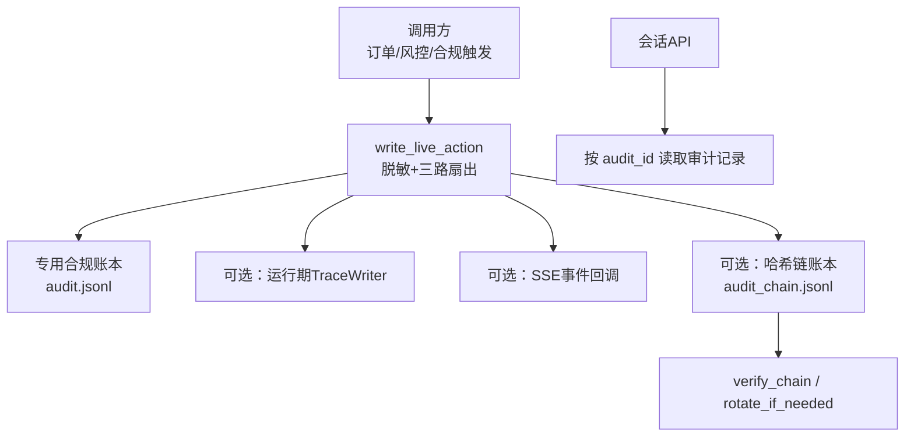
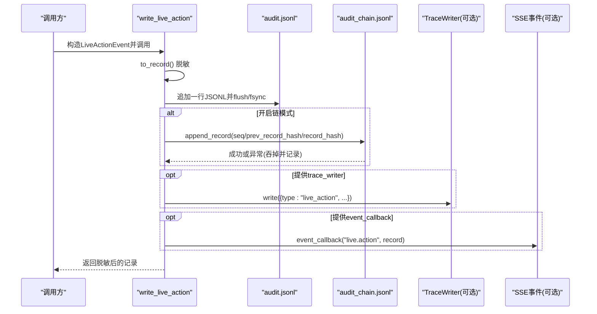
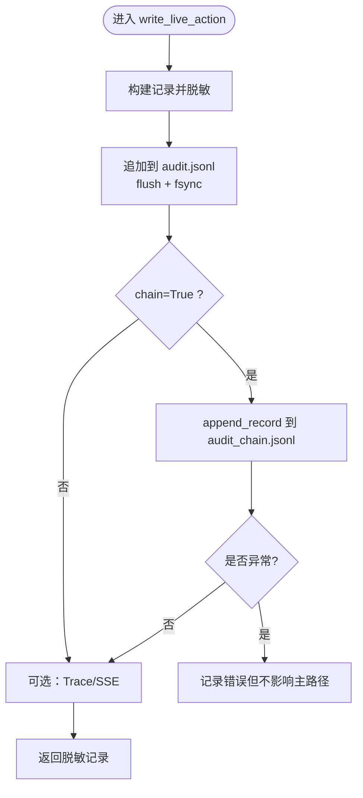
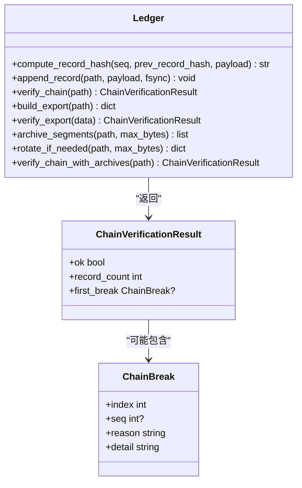
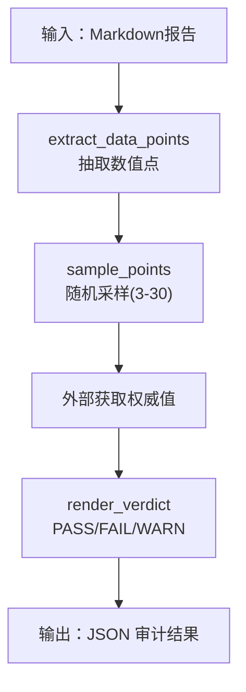
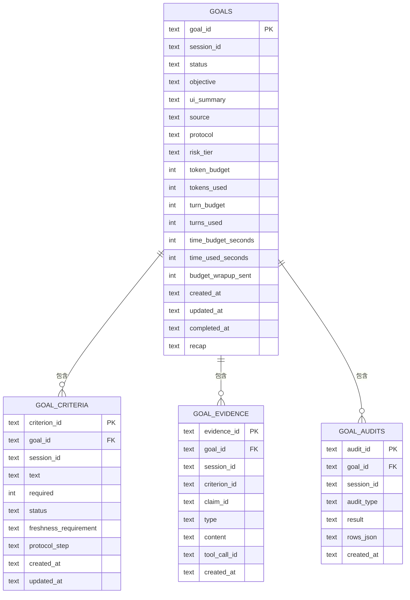
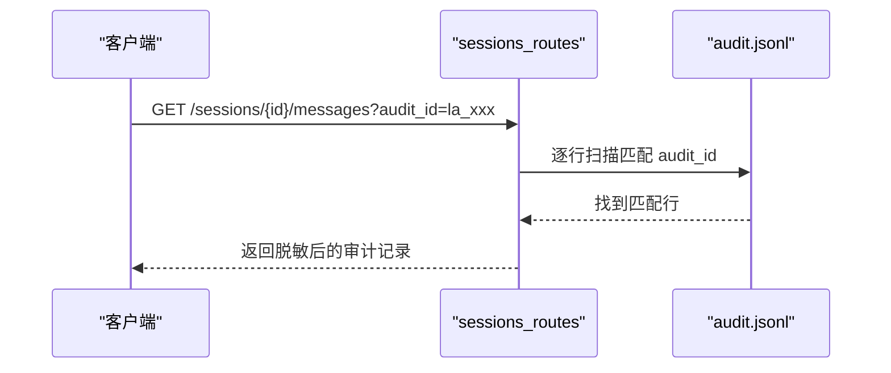
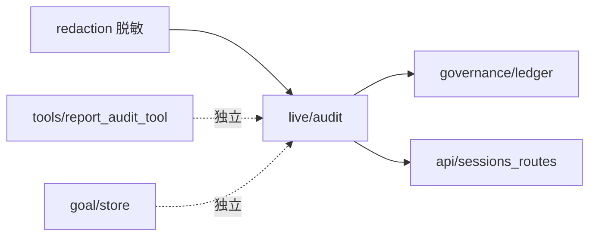

# 审计追踪系统

<cite>
**本文引用的文件**
- [agent/src/live/audit.py](file://agent/src/live/audit.py)
- [agent/src/governance/ledger.py](file://agent/src/governance/ledger.py)
- [agent/src/tools/report_audit_tool.py](file://agent/src/tools/report_audit_tool.py)
- [agent/src/goal/store.py](file://agent/src/goal/store.py)
- [agent/src/api/sessions_routes.py](file://agent/src/api/sessions_routes.py)
- [agent/tests/test_governance.py](file://agent/tests/test_governance.py)
- [agent/tests/test_report_audit_tool.py](file://agent/tests/test_report_audit_tool.py)
</cite>

## 目录
1. [简介](#简介)
2. [项目结构](#项目结构)
3. [核心组件](#核心组件)
4. [架构总览](#架构总览)
5. [详细组件分析](#详细组件分析)
6. [依赖关系分析](#依赖关系分析)
7. [性能与存储策略](#性能与存储策略)
8. [故障排查指南](#故障排查指南)
9. [结论](#结论)
10. [附录：配置与分析工具使用](#附录：配置与分析工具使用)

## 简介
本技术文档面向 Vibe-Trading 的审计追踪系统，覆盖操作日志记录、用户行为追踪、变更审计与合规性报告。重点说明：
- 审计数据模型与事件类型
- 日志格式标准与脱敏策略
- 存储策略（含追加式账本、哈希链防篡改、轮转归档）
- 查询接口与可观测性
- 完整审计链路、数据完整性保证与合规支持
- 敏感信息保护、日志轮转、性能优化与隐私保护实践
- 审计配置示例与分析工具使用方法

## 项目结构
审计相关代码主要分布在以下模块：
- 实时交易审计写入与多路扇出：src/live/audit.py
- 哈希链防篡改账本与归档：src/governance/ledger.py
- 研究报告数值审计工具：src/tools/report_audit_tool.py
- 研究目标与证据/审计行持久化：src/goal/store.py
- 通过 API 检索审计记录：src/api/sessions_routes.py
- 行为与正确性验证测试：tests/test_governance.py、tests/test_report_audit_tool.py

图表来源
- [agent/src/live/audit.py:248-351](file://agent/src/live/audit.py#L248-L351)
- [agent/src/governance/ledger.py:133-200](file://agent/src/governance/ledger.py#L133-L200)
- [agent/src/api/sessions_routes.py:234-255](file://agent/src/api/sessions_routes.py#L234-L255)

章节来源
- [agent/src/live/audit.py:1-59](file://agent/src/live/audit.py#L1-L59)
- [agent/src/governance/ledger.py:1-48](file://agent/src/governance/ledger.py#L1-L48)
- [agent/src/api/sessions_routes.py:234-255](file://agent/src/api/sessions_routes.py#L234-L255)

## 核心组件
- 实时审计事件与写入器
  - LiveActionEvent：定义不可变审计事件结构与字段顺序
  - write_live_action：统一入口，负责脱敏、追加写入、fsync、可选哈希链、可选Trace/SSE
- 哈希链防篡改账本
  - append_record：追加记录并维护 seq/prev_record_hash/record_hash
  - verify_chain/verify_export：端到端校验链完整性
  - archive_segments/rotate_if_needed：基于大小的分段归档与校验
- 研究报告数值审计工具
  - extract_data_points/sample_points：从Markdown抽取并采样财务数据点
  - render_verdict：基于单/双源对比给出 PASS/FAIL/WARN 判定
- 研究目标与审计行持久化
  - GoalStore：SQLite 存储 goals/criteria/evidence/audits，事务与并发安全
- 审计记录查询接口
  - sessions_routes：提供按 audit_id 重新加载已脱敏审计记录的端点

章节来源
- [agent/src/live/audit.py:172-351](file://agent/src/live/audit.py#L172-L351)
- [agent/src/governance/ledger.py:133-200](file://agent/src/governance/ledger.py#L133-L200)
- [agent/src/tools/report_audit_tool.py:132-382](file://agent/src/tools/report_audit_tool.py#L132-L382)
- [agent/src/goal/store.py:103-255](file://agent/src/goal/store.py#L103-L255)
- [agent/src/api/sessions_routes.py:234-255](file://agent/src/api/sessions_routes.py#L234-L255)

## 架构总览
审计系统采用“一次写入、多路扇出”的设计：所有真实资金相关的动作都会生成一条不可变审计记录，先写入专用合规账本（确保持久化），再可选写入运行期 Trace 和 SSE 事件；同时可选择写入哈希链副本以提供防篡改能力。

图表来源
- [agent/src/live/audit.py:248-351](file://agent/src/live/audit.py#L248-L351)
- [agent/src/governance/ledger.py:133-200](file://agent/src/governance/ledger.py#L133-L200)

## 详细组件分析

### 实时审计事件与写入器（LiveActionEvent 与 write_live_action）
- 事件类型（kind）：order_placed、order_cancelled、order_rejected、mandate_committed、breach、halt_tripped、halt_cleared
- 结果（outcome）：accepted、filled、rejected、error、blocked
- 关键字段：session_id、server、remote_tool、intent_normalized、mandate_snapshot_ref、consent_record_ref、broker_request/response、gate_decision、error、audit_id、ts
- 写入流程：
  - 先构建记录并脱敏
  - 追加到专用合规账本（append-only + fsync）
  - 可选写入哈希链副本（chain=True）
  - 可选写入运行期 Trace（type="live_action"）
  - 可选推送 SSE 事件（"live.action"）
- 容错：链写入失败不会中断主路径，仅记录错误；fsync失败降级为 flush-only 并告警

图表来源
- [agent/src/live/audit.py:248-351](file://agent/src/live/audit.py#L248-L351)

章节来源
- [agent/src/live/audit.py:120-216](file://agent/src/live/audit.py#L120-L216)
- [agent/src/live/audit.py:248-351](file://agent/src/live/audit.py#L248-L351)

### 哈希链防篡改账本（governance.ledger）
- 每条记录包含 seq、prev_record_hash、record_hash，形成链式校验
- append_record 在追加前会校验整条链，拒绝扩展损坏的链
- verify_chain/verify_export 提供离线验证能力
- 支持分段归档与合并校验，防止删除片段后仍能检测断链
- 并发安全：POSIX flock/Windows 字节范围锁保护临界区

图表来源
- [agent/src/governance/ledger.py:133-200](file://agent/src/governance/ledger.py#L133-L200)
- [agent/src/governance/ledger.py:597-739](file://agent/src/governance/ledger.py#L597-L739)

章节来源
- [agent/src/governance/ledger.py:1-48](file://agent/src/governance/ledger.py#L1-L48)
- [agent/src/governance/ledger.py:133-200](file://agent/src/governance/ledger.py#L133-L200)
- [agent/src/governance/ledger.py:597-739](file://agent/src/governance/ledger.py#L597-L739)
- [agent/tests/test_governance.py:330-760](file://agent/tests/test_governance.py#L330-L760)

### 研究报告数值审计工具（report_audit_tool）
- 两阶段质量门禁：
  - extract：解析Markdown，抽取表格与键值对中的数值点，去重并采样（默认15%，限制3-30）
  - verdict：将抽样点的上报值与一个或两个权威来源值进行比对，误差阈值1%
- 判定规则：
  - 单源：通过或不通过
  - 双源：两者都通过则通过；两者都不通过则失败；否则警告（口径差异）
  - 缺失或非有限数值的上报值视为不可验证，直接失败
- 工具契约：read-only，返回JSON，不写盘

图表来源
- [agent/src/tools/report_audit_tool.py:132-382](file://agent/src/tools/report_audit_tool.py#L132-L382)

章节来源
- [agent/src/tools/report_audit_tool.py:1-503](file://agent/src/tools/report_audit_tool.py#L1-L503)
- [agent/tests/test_report_audit_tool.py:1-42](file://agent/tests/test_report_audit_tool.py#L1-L42)

### 研究目标与审计行持久化（goal/store）
- SQLite 存储目标、声明、标准、证据与审计行
- 完成目标时强制校验审计行：必需标准必须满足且附带可验证证据
- 并发安全：RLock + WAL + IMMEDIATE 事务
- 审计行表：goal_audits（audit_id、goal_id、session_id、audit_type、result、rows_json、created_at）

图表来源
- [agent/src/goal/store.py:124-255](file://agent/src/goal/store.py#L124-L255)

章节来源
- [agent/src/goal/store.py:103-255](file://agent/src/goal/store.py#L103-L255)
- [agent/src/goal/store.py:896-921](file://agent/src/goal/store.py#L896-L921)

### 审计记录查询接口（sessions_routes）
- 提供按 audit_id 重新加载已脱敏审计记录的能力
- 从专用合规账本中定位对应行并返回脱敏后的记录

图表来源
- [agent/src/api/sessions_routes.py:234-255](file://agent/src/api/sessions_routes.py#L234-L255)

章节来源
- [agent/src/api/sessions_routes.py:234-255](file://agent/src/api/sessions_routes.py#L234-L255)

## 依赖关系分析
- live/audit 依赖 governance/ledger（可选）、tools/redaction（必用）
- api/sessions_routes 依赖 live/audit 的账本文件路径与记录结构
- tools/report_audit_tool 独立于运行时审计，用于研究报告质量门禁
- goal/store 独立管理研究目标与证据/审计行，与实时交易审计解耦

图表来源
- [agent/src/live/audit.py:248-351](file://agent/src/live/audit.py#L248-L351)
- [agent/src/governance/ledger.py:133-200](file://agent/src/governance/ledger.py#L133-L200)
- [agent/src/api/sessions_routes.py:234-255](file://agent/src/api/sessions_routes.py#L234-L255)
- [agent/src/tools/report_audit_tool.py:132-382](file://agent/src/tools/report_audit_tool.py#L132-L382)
- [agent/src/goal/store.py:103-255](file://agent/src/goal/store.py#L103-L255)

章节来源
- [agent/src/live/audit.py:248-351](file://agent/src/live/audit.py#L248-L351)
- [agent/src/governance/ledger.py:133-200](file://agent/src/governance/ledger.py#L133-L200)
- [agent/src/api/sessions_routes.py:234-255](file://agent/src/api/sessions_routes.py#L234-L255)
- [agent/src/tools/report_audit_tool.py:132-382](file://agent/src/tools/report_audit_tool.py#L132-L382)
- [agent/src/goal/store.py:103-255](file://agent/src/goal/store.py#L103-L255)

## 性能与存储策略
- 追加式写入与 fsync
  - 专用合规账本每次追加后 flush + fsync，确保崩溃恢复后记录不丢失
  - 哈希链账本同样 fsync，并在首次创建目录时 fsync 目录项
- 并发控制
  - 哈希链账本使用 POSIX flock/Windows 字节范围锁保护临界区，避免并发写入导致 seq/prev_record_hash 冲突
- 链校验开销
  - append_record 在追加前校验整条链（O(n)），适用于低吞吐场景（每笔订单/风控事件一条记录）
- 日志轮转与归档
  - 支持按大小归档为分段文件，保留活跃文件较小，便于管理与备份
  - 归档后可合并校验，删除归档会被检测到断链
- 脱敏与隐私
  - 所有审计记录在写入任何目的地前均经过脱敏，OAuth令牌、账号、PII等被替换为占位符
- 建议
  - 生产环境建议启用 chain=True 以获得防篡改能力
  - 合理设置归档阈值，平衡查询性能与存储成本
  - 定期执行 verify_chain/verify_export 进行离线核验

章节来源
- [agent/src/live/audit.py:301-340](file://agent/src/live/audit.py#L301-L340)
- [agent/src/governance/ledger.py:23-47](file://agent/src/governance/ledger.py#L23-L47)
- [agent/src/governance/ledger.py:597-739](file://agent/src/governance/ledger.py#L597-L739)

## 故障排查指南
- 链损坏检测
  - 若 verify_chain 返回 ok=False，检查 first_break.reason（如 seq_gap、prev_hash_mismatch、record_hash_mismatch）
  - 常见原因：人为编辑/删除记录、归档文件缺失、并发写入冲突
- 写入失败
  - fsync 失败会降级为 flush-only 并记录告警；不影响主路径
  - 链写入失败会被捕获并记录错误，但经典账本仍保持可用
- 查询不到记录
  - 确认 audit_id 是否正确；按 audit_id 从专用合规账本中检索
- 研究报告审计失败
  - 检查 extract 抽样的数据点是否有效；verdict 中 reported_value 是否为有限数值；单/双源一致性

章节来源
- [agent/src/governance/ledger.py:152-200](file://agent/src/governance/ledger.py#L152-L200)
- [agent/src/live/audit.py:80-97](file://agent/src/live/audit.py#L80-L97)
- [agent/src/live/audit.py:316-340](file://agent/src/live/audit.py#L316-L340)
- [agent/src/api/sessions_routes.py:234-255](file://agent/src/api/sessions_routes.py#L234-L255)
- [agent/src/tools/report_audit_tool.py:265-382](file://agent/src/tools/report_audit_tool.py#L265-L382)

## 结论
Vibe-Trading 审计追踪系统通过“专用合规账本 + 可选哈希链 + 多路扇出”的架构，实现了高可靠、可追溯、可核验的审计能力。系统在关键路径上坚持“先持久化、后通知”的原则，确保真实资金操作的审计记录不被丢失；通过脱敏与严格的链校验，兼顾隐私保护与防篡改需求。配合研究报告数值审计工具与研究目标审计行，形成了从研究到执行的闭环审计体系。

## 附录：配置与分析工具使用
- 启用哈希链
  - 在调用 write_live_action 时传入 chain=True，将额外写入 audit_chain.jsonl 并提供防篡改能力
- 归档与轮转
  - 使用 rotate_if_needed 按大小归档；使用 verify_chain_with_archives 合并校验
- 离线核验
  - build_export/export_chain_to_file 导出可离线验证的包；verify_export 进行离线校验
- 查询审计记录
  - 通过 sessions_routes 提供的接口，按 audit_id 检索已脱敏的审计记录
- 研究报告审计
  - 使用 report_audit_tool 的 extract 抽取并采样数据点，结合权威来源数据进行 verdict 判定

章节来源
- [agent/src/live/audit.py:248-351](file://agent/src/live/audit.py#L248-L351)
- [agent/src/governance/ledger.py:597-739](file://agent/src/governance/ledger.py#L597-L739)
- [agent/src/api/sessions_routes.py:234-255](file://agent/src/api/sessions_routes.py#L234-L255)
- [agent/src/tools/report_audit_tool.py:132-382](file://agent/src/tools/report_audit_tool.py#L132-L382)
- [agent/tests/test_governance.py:574-760](file://agent/tests/test_governance.py#L574-L760)
- [agent/tests/test_report_audit_tool.py:1-42](file://agent/tests/test_report_audit_tool.py#L1-L42)