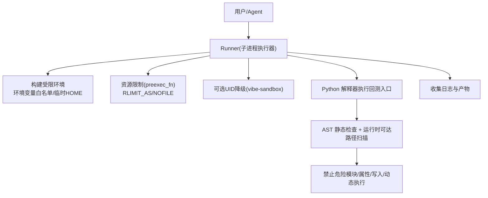
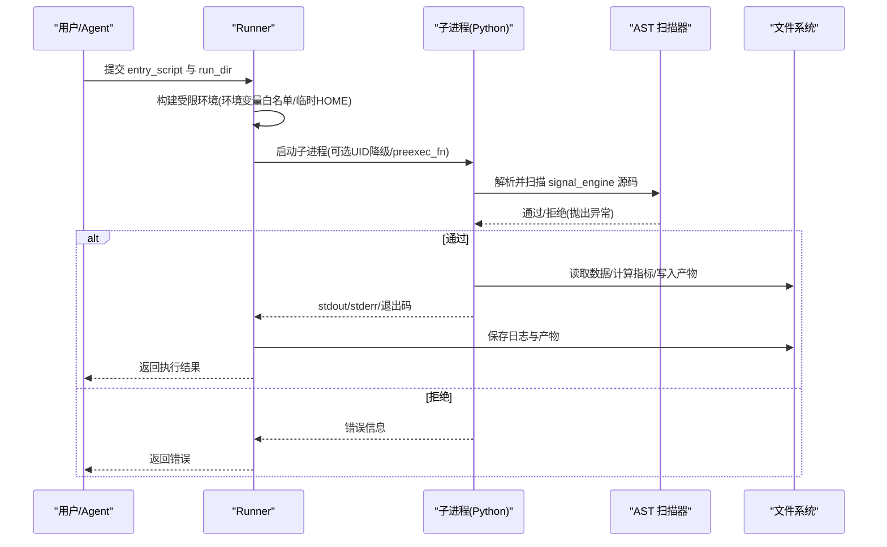
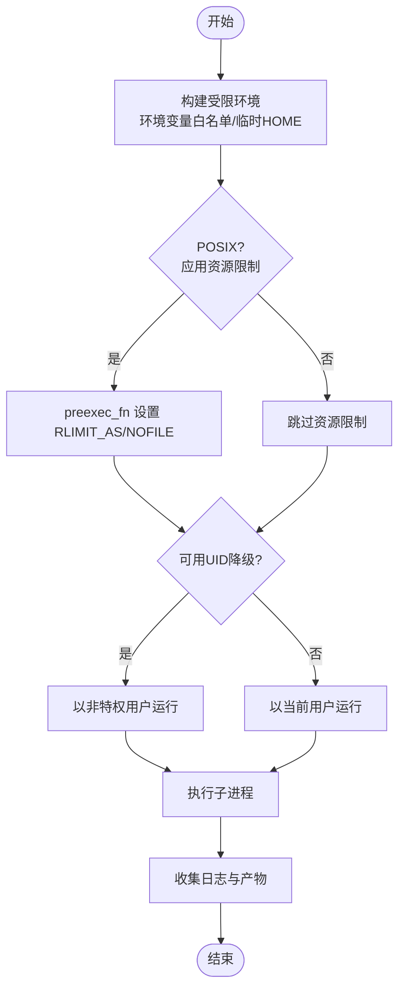
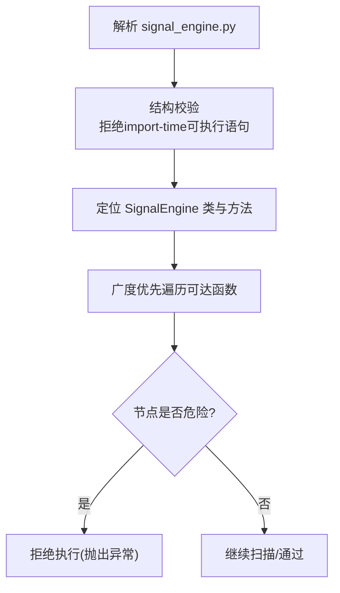
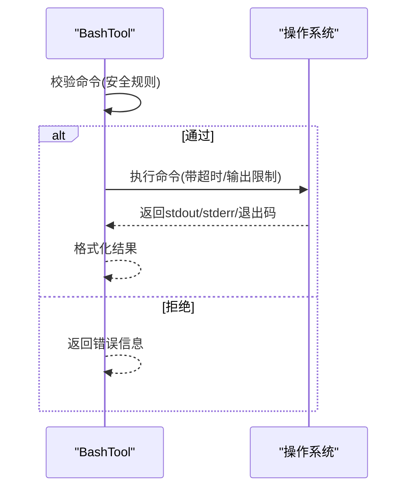
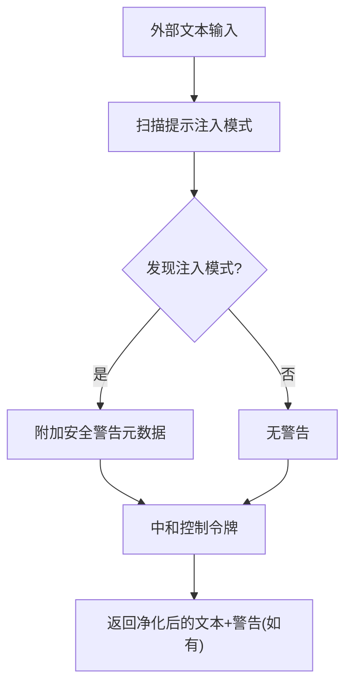
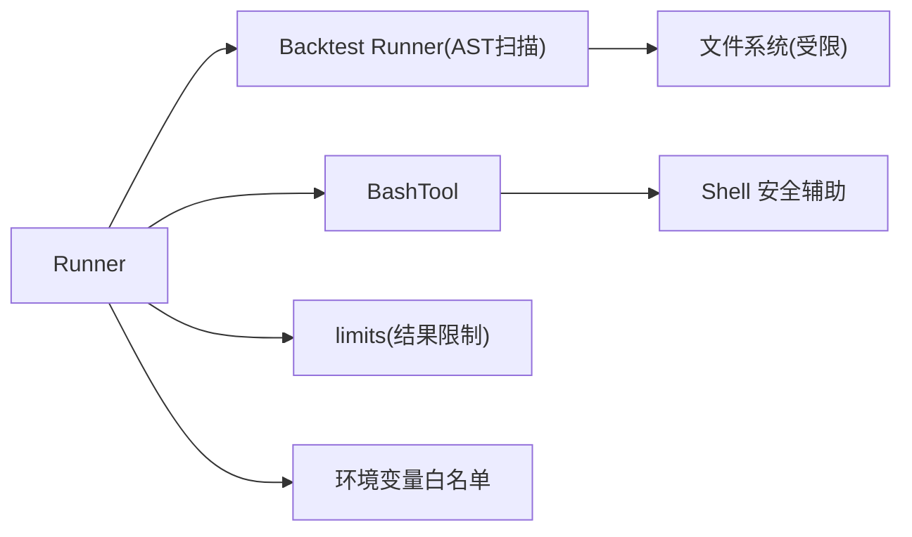

# 沙箱执行环境

<cite>
**本文引用的文件**
- [agent/src/core/runner.py](file://agent/src/core/runner.py)
- [agent/backtest/runner.py](file://agent/backtest/runner.py)
- [agent/src/tools/bash_tool.py](file://agent/src/tools/bash_tool.py)
- [agent/src/security/scanner.py](file://agent/src/security/scanner.py)
- [agent/src/config/limits.py](file://agent/src/config/limits.py)
- [agent/tests/test_runner_env.py](file://agent/tests/test_runner_env.py)
- [agent/tests/test_backtest_runner_security.py](file://agent/tests/test_backtest_runner_security.py)
- [agent/tests/test_special_token_neutralization.py](file://agent/tests/test_special_token_neutralization.py)
</cite>

## 目录
1. [简介](#简介)
2. [项目结构](#项目结构)
3. [核心组件](#核心组件)
4. [架构总览](#架构总览)
5. [详细组件分析](#详细组件分析)
6. [依赖关系分析](#依赖关系分析)
7. [性能与资源限制](#性能与资源限制)
8. [故障排查指南](#故障排查指南)
9. [结论](#结论)
10. [附录：配置示例与调试方法](#附录配置示例与调试方法)

## 简介
本文件面向 Vibe-Trading 的“沙箱执行环境”，聚焦代码隔离、资源限制、网络访问控制、文件系统安全、Shell 工具安全控制、命令白名单、环境变量过滤、进程隔离、审计日志与常见安全风险防护。文档以仓库中实际实现为依据，提供可操作的配置与排障建议，帮助运营方在本地、CI 或容器化部署中安全地运行用户生成的策略与工具调用。

## 项目结构
围绕沙箱执行的关键路径包括：
- 子进程执行器与环境裁剪：负责创建受限环境、设置资源上限、隔离 HOME、可选 UID 降级等。
- 回测入口与安全扫描：对信号引擎源码进行 AST 静态检查与运行时可达路径扫描，拒绝危险导入与写入。
- Shell 工具安全：在执行 shell 命令前进行安全检查与输出限制。
- 外部内容安全：对外部读取内容进行提示注入检测与控制令牌中和。
- 结果大小限制：统一截断工具返回结果，避免模型上下文被滥用。

**图示来源**
- [agent/src/core/runner.py:33-110](file://agent/src/core/runner.py#L33-L110)
- [agent/src/core/runner.py:431-501](file://agent/src/core/runner.py#L431-L501)
- [agent/backtest/runner.py:274-767](file://agent/backtest/runner.py#L274-L767)

**章节来源**
- [agent/src/core/runner.py:33-110](file://agent/src/core/runner.py#L33-L110)
- [agent/backtest/runner.py:274-767](file://agent/backtest/runner.py#L274-L767)

## 核心组件
- 子进程执行器（Runner）
  - 环境变量白名单过滤，仅保留系统基础、代理、证书、市场数据只读配置等必要键。
  - 临时 HOME 隔离，仅通过符号链接暴露受控目录（如缓存、data-bridge、qveris.json）。
  - POSIX 下通过 preexec_fn 限制地址空间与文件描述符数量；支持可选 UID 降级到非特权账户。
  - 将当前 run_dir 加入允许的运行根目录列表，确保产物落盘路径可控。
- 回测入口安全（backtest runner）
  - AST 解析与严格的结构校验，拒绝 import-time 可执行语句。
  - 针对 SignalEngine 及其可达函数进行深度扫描，拒绝网络、进程生成、动态执行、写文件等危险操作。
  - 明确禁止危险模块、危险属性、危险内置函数与对象图遍历。
- Shell 工具（bash）
  - 执行前进行安全检查（例如阻止杀 Python 进程），限制输出长度与超时。
- 外部内容安全（scanner）
  - 提示注入模式扫描并添加安全警告元数据。
  - 中和聊天模板控制令牌，防止伪造角色边界。
- 工具结果限制（limits）
  - 统一截断过大的工具返回结果，避免上下文被滥用。

**章节来源**
- [agent/src/core/runner.py:175-278](file://agent/src/core/runner.py#L175-L278)
- [agent/src/core/runner.py:113-173](file://agent/src/core/runner.py#L113-L173)
- [agent/src/core/runner.py:85-110](file://agent/src/core/runner.py#L85-L110)
- [agent/backtest/runner.py:274-767](file://agent/backtest/runner.py#L274-L767)
- [agent/src/tools/bash_tool.py:1-52](file://agent/src/tools/bash_tool.py#L1-L52)
- [agent/src/security/scanner.py:1-264](file://agent/src/security/scanner.py#L1-L264)
- [agent/src/config/limits.py:1-49](file://agent/src/config/limits.py#L1-L49)

## 架构总览
下图展示一次回测执行的端到端流程，包含环境准备、资源限制、AST 检查与产物收集。

**图示来源**
- [agent/src/core/runner.py:431-501](file://agent/src/core/runner.py#L431-L501)
- [agent/backtest/runner.py:736-767](file://agent/backtest/runner.py#L736-L767)
- [agent/src/core/runner.py:503-620](file://agent/src/core/runner.py#L503-L620)

## 详细组件分析

### 子进程执行器（Runner）
- 环境变量过滤
  - 仅允许系统基础、代理、证书、市场数据只读配置等键；敏感密钥默认不继承。
  - 自动追加当前 run_dir 到允许的运行根目录列表，保证产物路径可控。
- 临时 HOME 隔离
  - 为子进程创建临时 HOME，并通过符号链接仅暴露受控目录（缓存、data-bridge、qveris.json）。
  - 预置第三方库所需的最小配置，避免崩溃。
- 资源限制
  - 在 POSIX 环境下通过 preexec_fn 限制 RLIMIT_AS（虚拟地址空间）与 RLIMIT_NOFILE（文件描述符）。
  - 可通过环境变量调整内存上限。
- 可选 UID 降级
  - 若存在专用账户且具备能力，则以非特权身份运行子进程，进一步降低风险。
- 日志与产物
  - 捕获 stdout/stderr 并持久化；按规范收集 artifacts。

**图示来源**
- [agent/src/core/runner.py:175-278](file://agent/src/core/runner.py#L175-L278)
- [agent/src/core/runner.py:113-173](file://agent/src/core/runner.py#L113-L173)
- [agent/src/core/runner.py:85-110](file://agent/src/core/runner.py#L85-L110)
- [agent/src/core/runner.py:480-501](file://agent/src/core/runner.py#L480-L501)
- [agent/src/core/runner.py:503-620](file://agent/src/core/runner.py#L503-L620)

**章节来源**
- [agent/src/core/runner.py:175-278](file://agent/src/core/runner.py#L175-L278)
- [agent/src/core/runner.py:113-173](file://agent/src/core/runner.py#L113-L173)
- [agent/src/core/runner.py:85-110](file://agent/src/core/runner.py#L85-L110)
- [agent/src/core/runner.py:480-501](file://agent/src/core/runner.py#L480-L501)
- [agent/src/core/runner.py:503-620](file://agent/src/core/runner.py#L503-L620)

### 回测入口安全（AST 静态检查与运行时可达路径扫描）
- 结构校验
  - 拒绝 import-time 可执行语句、装饰器、非字面量默认参数、不安全注解与基类。
- 运行时可达路径扫描
  - 从 SignalEngine 方法出发，追踪其调用的模块级函数，逐项检查是否包含危险操作。
- 禁止项
  - 禁止危险模块导入（网络、进程、动态加载、序列化等）、危险 os 属性、危险内置函数、对象图遍历。
  - 禁止写文件（open/pathlib 写模式）、非相对路径打开、以及通过 getattr/setattr/delattr 间接访问危险模块。
- 误用防护
  - 对别名绑定进行恢复，防止通过重命名绕过检查。

**图示来源**
- [agent/backtest/runner.py:274-767](file://agent/backtest/runner.py#L274-L767)

**章节来源**
- [agent/backtest/runner.py:274-767](file://agent/backtest/runner.py#L274-L767)

### Shell 工具安全控制（BashTool）
- 执行前安全检查：阻止可能影响宿主进程的行为（例如按名称终止 Python 进程）。
- 输出限制：限制输出长度，避免大量输出占用上下文。
- 超时控制：默认超时，防止长时间阻塞。

**图示来源**
- [agent/src/tools/bash_tool.py:1-52](file://agent/src/tools/bash_tool.py#L1-L52)

**章节来源**
- [agent/src/tools/bash_tool.py:1-52](file://agent/src/tools/bash_tool.py#L1-L52)

### 外部内容安全（提示注入检测与控制令牌中和）
- 提示注入扫描：识别试图覆盖指令、泄露系统提示、冒充特权角色、请求工具/Shell 执行等模式，并附加安全警告。
- 控制令牌中和：在外部文本中插入零宽空格破坏控制令牌匹配，防止伪造角色边界。

**图示来源**
- [agent/src/security/scanner.py:1-264](file://agent/src/security/scanner.py#L1-L264)

**章节来源**
- [agent/src/security/scanner.py:1-264](file://agent/src/security/scanner.py#L1-L264)

### 工具结果限制
- 统一截断工具返回结果，避免大响应淹没模型上下文。
- 截断时附带说明，告知可见字符数与总数。

**章节来源**
- [agent/src/config/limits.py:1-49](file://agent/src/config/limits.py#L1-L49)

## 依赖关系分析
- Runner 依赖 backtest runner 的安全扫描逻辑，二者共同构成“进程隔离 + 代码静态/动态路径检查”的双重防线。
- BashTool 依赖通用安全辅助（如 kill 保护），并在工具层施加输出与超时限制。
- Scanner 独立于执行路径，用于处理外部内容的注入风险。
- limits 作为共享常量与工具，被多处消费以避免不一致。

**图示来源**
- [agent/src/core/runner.py:175-278](file://agent/src/core/runner.py#L175-L278)
- [agent/backtest/runner.py:274-767](file://agent/backtest/runner.py#L274-L767)
- [agent/src/tools/bash_tool.py:1-52](file://agent/src/tools/bash_tool.py#L1-L52)
- [agent/src/config/limits.py:1-49](file://agent/src/config/limits.py#L1-L49)

**章节来源**
- [agent/src/core/runner.py:175-278](file://agent/src/core/runner.py#L175-L278)
- [agent/backtest/runner.py:274-767](file://agent/backtest/runner.py#L274-L767)
- [agent/src/tools/bash_tool.py:1-52](file://agent/src/tools/bash_tool.py#L1-L52)
- [agent/src/config/limits.py:1-49](file://agent/src/config/limits.py#L1-L49)

## 性能与资源限制
- 地址空间上限：默认限制虚拟地址空间，避免恶意或低效代码耗尽内存；可通过环境变量调整。
- 文件描述符限制：限制最大打开文件数，防止资源耗尽。
- 超时控制：子进程执行带有超时，避免长时间挂起。
- 结果截断：工具返回结果统一截断，减少上下文压力。

**章节来源**
- [agent/src/core/runner.py:73-110](file://agent/src/core/runner.py#L73-L110)
- [agent/src/core/runner.py:503-620](file://agent/src/core/runner.py#L503-L620)
- [agent/src/config/limits.py:1-49](file://agent/src/config/limits.py#L1-L49)

## 故障排查指南
- 子进程无法降权或资源限制未生效
  - 检查是否存在专用账户与相应能力；确认平台是否支持 resource/pwd。
  - 查看日志中的警告信息，了解降级行为。
- 环境变量泄漏
  - 确认敏感键未被白名单包含；必要时收紧白名单。
- 回测代码被拒绝
  - 根据错误信息定位 AST 扫描拒绝的原因（危险导入/属性/写入/动态执行等）。
- Shell 工具被拒绝
  - 检查命令是否触发安全规则（如尝试终止 Python 进程）。
- 外部内容安全警告
  - 查看 security_warnings，确认是否命中注入模式或控制令牌中和。

**章节来源**
- [agent/src/core/runner.py:480-501](file://agent/src/core/runner.py#L480-L501)
- [agent/src/core/runner.py:503-620](file://agent/src/core/runner.py#L503-L620)
- [agent/backtest/runner.py:736-767](file://agent/backtest/runner.py#L736-L767)
- [agent/src/tools/bash_tool.py:1-52](file://agent/src/tools/bash_tool.py#L1-L52)
- [agent/src/security/scanner.py:1-264](file://agent/src/security/scanner.py#L1-L264)

## 结论
Vibe-Trading 的沙箱执行环境通过“进程隔离 + 环境变量白名单 + 临时 HOME + 资源限制 + 可选 UID 降级 + AST 静态/可达路径扫描 + 工具层安全控制”的多层防御，有效降低了代码执行风险、资源滥用与外部注入威胁。建议在容器化部署中启用 UID 降级与资源限制，并结合审计日志与测试用例持续验证安全边界。

## 附录：配置示例与调试方法
- 环境变量与限制
  - 使用环境变量调整沙箱内存上限（例如设置 MB 值），以便在大型分钟级回测中避免误判 OOM。
  - 通过白名单机制控制继承的环境变量，避免敏感密钥泄露。
- 运行根目录
  - 将当前 run_dir 自动加入允许的运行根目录列表，确保产物落盘路径可控。
- 调试要点
  - 查看子进程 stdout/stderr 日志与 artifacts，定位失败原因。
  - 关注 AST 扫描错误信息，修正信号引擎代码以符合安全约束。
  - 对 Shell 工具，检查命令是否触发安全规则；必要时拆分任务或使用只读工具替代。
  - 对来自外部的内容，关注 security_warnings 并进行二次审查。

**章节来源**
- [agent/tests/test_runner_env.py:60-108](file://agent/tests/test_runner_env.py#L60-L108)
- [agent/tests/test_runner_env.py:188-220](file://agent/tests/test_runner_env.py#L188-L220)
- [agent/tests/test_runner_env.py:297-318](file://agent/tests/test_runner_env.py#L297-L318)
- [agent/tests/test_backtest_runner_security.py](file://agent/tests/test_backtest_runner_security.py)
- [agent/tests/test_special_token_neutralization.py:1-38](file://agent/tests/test_special_token_neutralization.py#L1-L38)