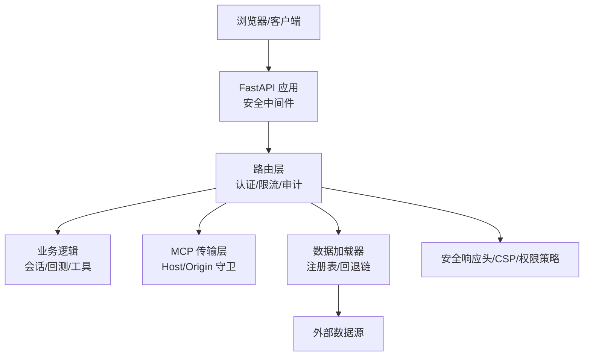
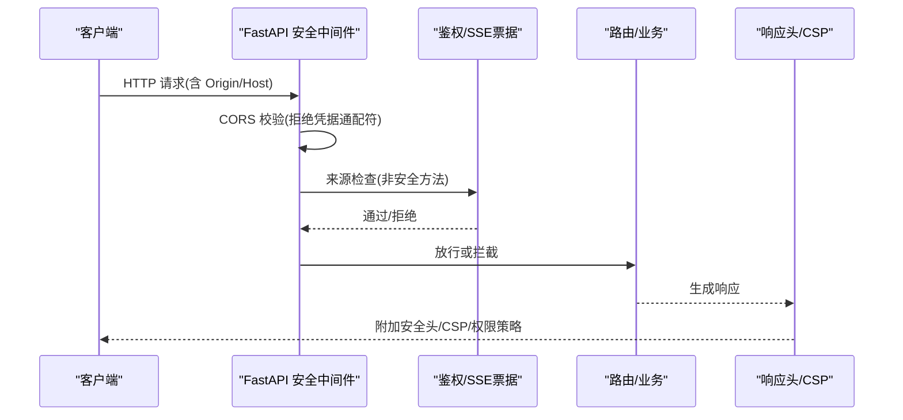
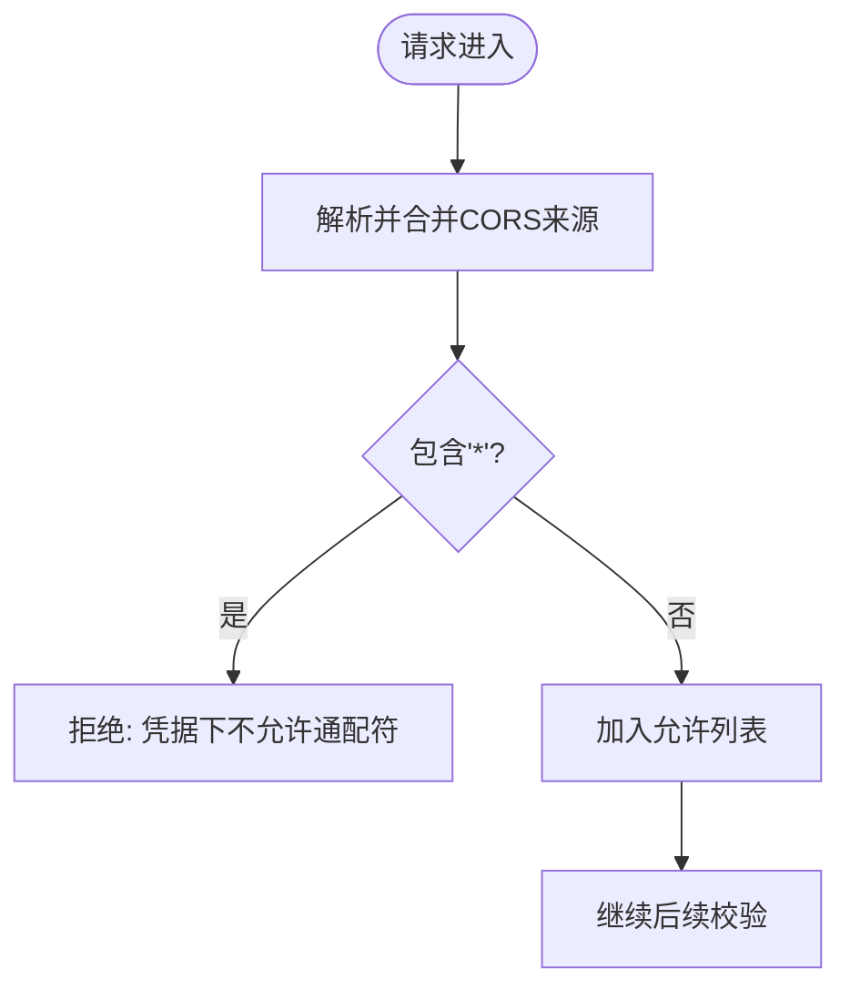
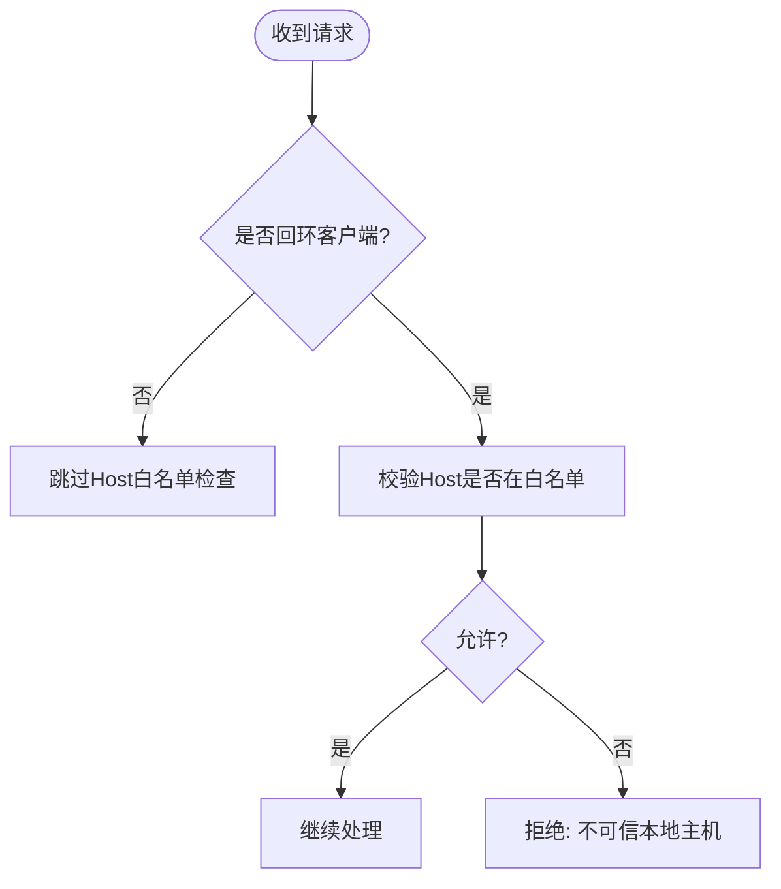
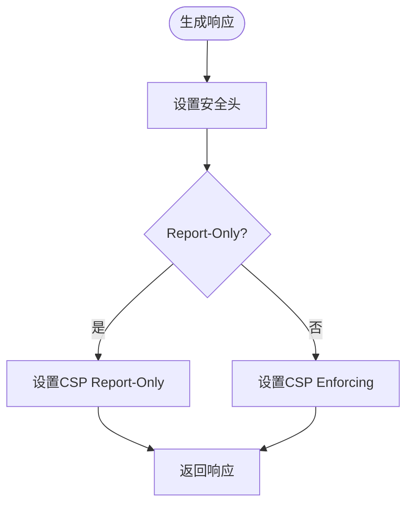
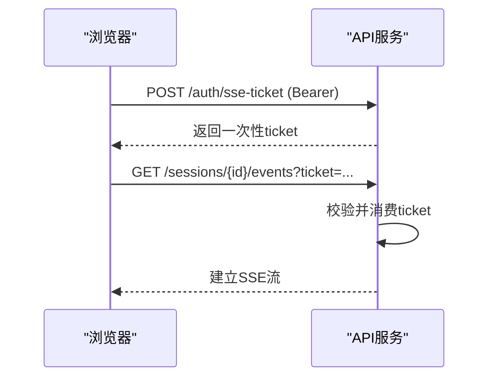
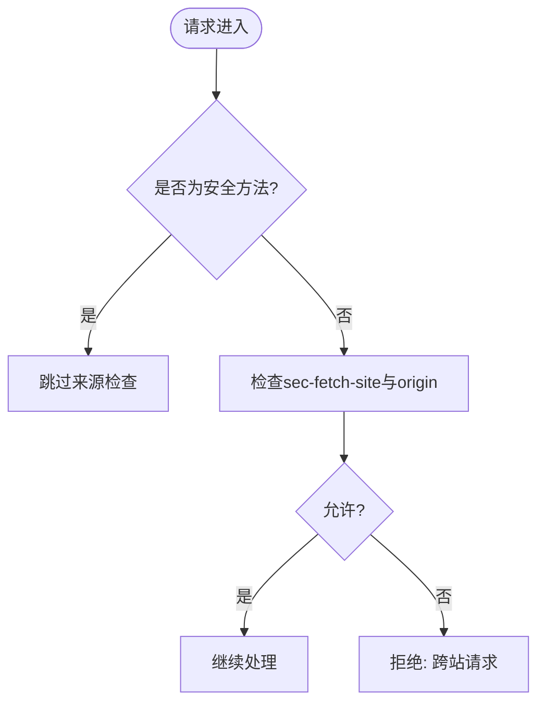
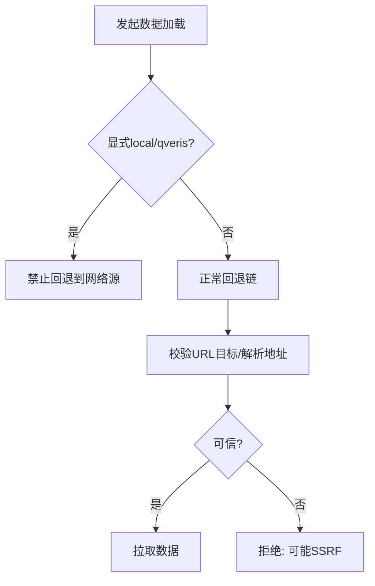
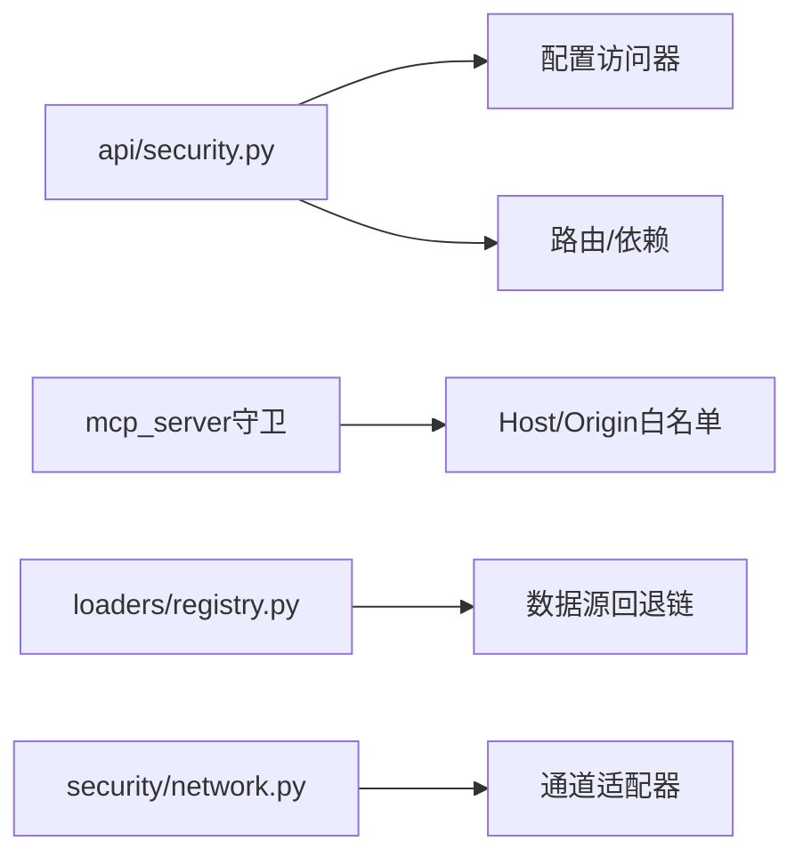

# 网络安全防护

<cite>
**本文引用的文件**
- [agent/src/api/security.py](file://agent/src/api/security.py)
- [agent/tests/test_sse_ticket_and_headers.py](file://agent/tests/test_sse_ticket_and_headers.py)
- [agent/tests/test_mcp_host_origin_guard.py](file://agent/tests/test_mcp_host_origin_guard.py)
- [agent/tests/test_openbb_bridge/test_cors_opt_in.py](file://agent/tests/test_openbb_bridge/test_cors_opt_in.py)
- [agent/backtest/loaders/registry.py](file://agent/backtest/loaders/registry.py)
- [agent/src/security/network.py](file://agent/src/security/network.py)
</cite>

## 目录
1. [简介](#简介)
2. [项目结构](#项目结构)
3. [核心组件](#核心组件)
4. [架构总览](#架构总览)
5. [详细组件分析](#详细组件分析)
6. [依赖关系分析](#依赖关系分析)
7. [性能与安全权衡](#性能与安全权衡)
8. [故障排查指南](#故障排查指南)
9. [结论](#结论)
10. [附录：配置示例与最佳实践](#附录配置示例与最佳实践)

## 简介
本文件面向 Vibe-Trading 的网络安全防护，聚焦于跨域策略（CORS）、内容安全策略（CSP）、HTTPS 强制与中间人攻击防护、DNS 重绑定防护、Host 头验证、来源检查与跨域请求处理、安全响应头与权限策略、浏览器安全特性利用，以及网络攻击向量与防御措施。文档同时给出多层网络防护、请求验证与响应安全的实践建议与配置要点。

## 项目结构
Vibe-Trading 的安全能力主要集中于后端 API 层与 MCP 传输层：
- API 安全：CORS、鉴权、SSE 票据、安全响应头、日志脱敏、本地回环信任与 Host 校验等。
- MCP 传输安全：对 sse/http 传输进行 Host/Origin 白名单校验，防止 DNS 重绑定与跨站访问。
- 数据加载器边界：禁止将显式 local/qveris 请求静默降级为外部网络源，避免 SSRF/越权拉取。
- 通道 URL 校验：统一对外部 URL 目标与解析后地址进行校验，阻断内网/CGNAT/mesh 等不可信目标。

图表来源
- [agent/src/api/security.py:166-253](file://agent/src/api/security.py#L166-L253)
- [agent/tests/test_mcp_host_origin_guard.py:1-217](file://agent/tests/test_mcp_host_origin_guard.py#L1-L217)
- [agent/backtest/loaders/registry.py:117-129](file://agent/backtest/loaders/registry.py#L117-L129)

章节来源
- [agent/src/api/security.py:166-253](file://agent/src/api/security.py#L166-L253)
- [agent/tests/test_mcp_host_origin_guard.py:1-217](file://agent/tests/test_mcp_host_origin_guard.py#L1-L217)
- [agent/backtest/loaders/registry.py:117-129](file://agent/backtest/loaders/registry.py#L117-L129)

## 核心组件
- CORS 策略与额外来源扩展：默认仅允许本地开发来源；可通过环境变量追加可信来源，且拒绝带凭据的通配符。
- DNS 重绑定与 Host 头校验：对来自回环客户端的请求，严格校验 Host 头是否属于受信任列表，防止通过伪造 Host 绕过本地鉴权。
- 安全响应头与 CSP：为所有响应附加 X-Content-Type-Options、X-Frame-Options、Referrer-Policy、Permissions-Policy；默认启用严格的 CSP，并为文档页面提供最小化例外。
- SSE 一次性票据：浏览器 EventSource 无法携带 Authorization 头，采用短生命周期、单次使用的 ticket 机制，避免密钥泄露到 URL/日志。
- 鉴权与来源检查：支持 Bearer 令牌与查询参数（受限场景）；对非安全方法执行跨站来源检查，拒绝 cross-site 请求。
- MCP 传输守卫：对 sse/http 传输实施 Host/Origin 白名单校验，默认仅允许回环主机，支持通配符与自定义列表。
- 数据加载器边界保护：显式 local/qveris 请求不得静默回退到网络源，避免误用或 SSRF。
- 通道 URL 校验：统一对外部 URL 目标与解析后的地址进行校验，阻止 CGNAT/mesh/non-global 等不可信目标。

章节来源
- [agent/src/api/security.py:29-158](file://agent/src/api/security.py#L29-L158)
- [agent/src/api/security.py:166-253](file://agent/src/api/security.py#L166-L253)
- [agent/src/api/security.py:300-341](file://agent/src/api/security.py#L300-L341)
- [agent/src/api/security.py:369-432](file://agent/src/api/security.py#L369-L432)
- [agent/tests/test_mcp_host_origin_guard.py:1-217](file://agent/tests/test_mcp_host_origin_guard.py#L1-L217)
- [agent/backtest/loaders/registry.py:117-129](file://agent/backtest/loaders/registry.py#L117-L129)
- [agent/src/security/network.py:1-11](file://agent/src/security/network.py#L1-L11)

## 架构总览
下图展示从请求进入至响应返回的关键安全路径，包括 CORS、Host/Origin 校验、安全响应头注入、SSE 票据交换与鉴权。

图表来源
- [agent/src/api/security.py:69-158](file://agent/src/api/security.py#L69-L158)
- [agent/src/api/security.py:369-432](file://agent/src/api/security.py#L369-L432)
- [agent/src/api/security.py:235-253](file://agent/src/api/security.py#L235-L253)

## 详细组件分析

### CORS 策略与来源控制
- 默认来源：仅允许本地开发端口（localhost/127.0.0.1 的多端口）。
- 额外来源：通过环境变量追加可信来源，但禁止通配符（因启用凭据）。
- 文档页面例外：/docs 与 /redoc 允许必要的 CDN 资源，但不泄漏到 SPA 策略。
- 测试覆盖：断言默认安全头、CSP 策略、Report-Only 切换与文档页面例外范围。

图表来源
- [agent/src/api/security.py:69-103](file://agent/src/api/security.py#L69-L103)
- [agent/tests/test_openbb_bridge/test_cors_opt_in.py:41-51](file://agent/tests/test_openbb_bridge/test_cors_opt_in.py#L41-L51)

章节来源
- [agent/src/api/security.py:69-103](file://agent/src/api/security.py#L69-L103)
- [agent/tests/test_openbb_bridge/test_cors_opt_in.py:41-51](file://agent/tests/test_openbb_bridge/test_cors_opt_in.py#L41-L51)

### DNS 重绑定与 Host 头验证
- 回环信任：仅当请求来自回环客户端时，才允许 Host 头匹配受信任列表（默认 localhost/127.0.0.1/[::1] 等）。
- 拒绝不可信 Host：即使来源为回环，若 Host 不在白名单则直接拒绝，防止 DNS 重绑定绕过。
- MCP 传输守卫：对 sse/http 传输同样实施 Host/Origin 白名单校验，默认仅允许回环，支持通配符。

图表来源
- [agent/src/api/security.py:133-173](file://agent/src/api/security.py#L133-L173)
- [agent/tests/test_mcp_host_origin_guard.py:28-102](file://agent/tests/test_mcp_host_origin_guard.py#L28-L102)

章节来源
- [agent/src/api/security.py:133-173](file://agent/src/api/security.py#L133-L173)
- [agent/tests/test_mcp_host_origin_guard.py:28-102](file://agent/tests/test_mcp_host_origin_guard.py#L28-L102)

### 安全响应头与 CSP
- 基础安全头：X-Content-Type-Options=nosniff、X-Frame-Options=DENY、Referrer-Policy=strict-origin-when-cross-origin、Permissions-Policy 禁用不必要能力。
- CSP：默认严格模式，限制脚本/样式/连接等同源；文档页面允许必要 CDN；支持 Report-Only 模式用于灰度发布。
- 测试覆盖：断言默认策略、Report-Only 切换、文档页面例外不泄漏到应用页面。

图表来源
- [agent/src/api/security.py:180-253](file://agent/src/api/security.py#L180-L253)
- [agent/tests/test_sse_ticket_and_headers.py:138-194](file://agent/tests/test_sse_ticket_and_headers.py#L138-L194)

章节来源
- [agent/src/api/security.py:180-253](file://agent/src/api/security.py#L180-L253)
- [agent/tests/test_sse_ticket_and_headers.py:138-194](file://agent/tests/test_sse_ticket_and_headers.py#L138-L194)

### SSE 票据与事件流鉴权
- 问题背景：EventSource 无法发送 Authorization 头。
- 解决方案：先通过 Bearer 认证换取一次性 ticket（短 TTL），再在 ?ticket= 中传递；ticket 使用后立即失效，防重放。
- 适用场景：浏览器实时流（如会话事件）；非浏览器仍可使用 Bearer。

图表来源
- [agent/src/api/security.py:300-341](file://agent/src/api/security.py#L300-L341)
- [agent/src/api/security.py:591-622](file://agent/src/api/security.py#L591-L622)

章节来源
- [agent/src/api/security.py:300-341](file://agent/src/api/security.py#L300-L341)
- [agent/src/api/security.py:591-622](file://agent/src/api/security.py#L591-L622)

### 来源检查与跨域请求处理
- 非安全方法（POST/PUT/DELETE 等）会执行跨站来源检查，拒绝 sec-fetch-site=cross-site 或 origin 与请求站点不一致的请求。
- 本地回环与同源站点可正常访问；远程部署需配置 API_AUTH_KEY。

图表来源
- [agent/src/api/security.py:423-432](file://agent/src/api/security.py#L423-L432)

章节来源
- [agent/src/api/security.py:423-432](file://agent/src/api/security.py#L423-L432)

### HTTPS 强制与中间人攻击防护
- 应用层未内置 HSTS：HSTS 应在 TLS 终止的反向代理/网关层设置，确保始终通过 HTTPS 访问。
- 结合 CSP、权限策略与来源检查，降低 XSS、点击劫持与跨站风险。
- 建议：在 Nginx/Cloudflare 等入口层启用 HSTS、HTTP/2、TLS 1.2+、强密码套件与证书校验。

章节来源
- [agent/src/api/security.py:235-253](file://agent/src/api/security.py#L235-L253)

### 数据加载器边界与 SSRF 防护
- 显式 local/qveris 请求不得静默回退到网络源，避免误用或 SSRF。
- 通道媒体/URL 读取前校验目标地址，拒绝 CGNAT/mesh/non-global 与内部重定向。

图表来源
- [agent/backtest/loaders/registry.py:117-129](file://agent/backtest/loaders/registry.py#L117-L129)
- [agent/src/security/network.py:1-11](file://agent/src/security/network.py#L1-L11)

章节来源
- [agent/backtest/loaders/registry.py:117-129](file://agent/backtest/loaders/registry.py#L117-L129)
- [agent/src/security/network.py:1-11](file://agent/src/security/network.py#L1-L11)

## 依赖关系分析
- API 安全模块依赖配置访问器与环境变量，动态决定 CORS、CSP、Shell 工具开关等。
- MCP 传输守卫独立于 API 主流程，针对 sse/http 传输增加 Host/Origin 白名单校验。
- 数据加载器注册表定义回退链与“禁止网络回退”的来源集合，保障数据来源可控。
- 通道安全工具统一导出 URL 校验函数，供各适配器复用。

图表来源
- [agent/src/api/security.py:23-24](file://agent/src/api/security.py#L23-L24)
- [agent/tests/test_mcp_host_origin_guard.py:1-217](file://agent/tests/test_mcp_host_origin_guard.py#L1-L217)
- [agent/backtest/loaders/registry.py:117-129](file://agent/backtest/loaders/registry.py#L117-L129)
- [agent/src/security/network.py:1-11](file://agent/src/security/network.py#L1-L11)

章节来源
- [agent/src/api/security.py:23-24](file://agent/src/api/security.py#L23-L24)
- [agent/tests/test_mcp_host_origin_guard.py:1-217](file://agent/tests/test_mcp_host_origin_guard.py#L1-L217)
- [agent/backtest/loaders/registry.py:117-129](file://agent/backtest/loaders/registry.py#L117-L129)
- [agent/src/security/network.py:1-11](file://agent/src/security/network.py#L1-L11)

## 性能与安全权衡
- CSP Report-Only：在灰度阶段使用 Report-Only 观察影响，逐步切换到 enforcing，避免生产中断。
- CORS 精确白名单：避免宽泛来源导致的安全面扩大；必要时仅添加必要域名。
- SSE 票据：短 TTL 与单次使用提升安全性，但需保证票据交换的低延迟与重试策略。
- 数据加载器回退链：在保证数据安全的前提下，合理设计回退顺序与超时，避免长尾延迟。

## 故障排查指南
- 现象：CSP 阻断资源加载
  - 检查是否启用了 Report-Only；确认文档页面例外是否足够；核对 CSP 策略中的 script/style/connect 来源。
  - 参考断言：默认策略、Report-Only 切换、文档页面例外。
- 现象：跨域请求被拒
  - 检查 CORS 来源是否包含前端域名；确认非安全方法的来源检查逻辑；避免通配符与凭据组合。
- 现象：本地 API 被拒绝
  - 检查 Host 头是否在受信任列表；确认请求是否来自回环客户端；避免伪造 Host。
- 现象：SSE 流无法建立
  - 检查是否正确获取一次性 ticket；确认 ticket 未过期且未被重复使用；非浏览器应使用 Bearer。
- 现象：数据加载失败或异常
  - 检查是否显式请求 local/qveris；确认 URL 目标未被拒绝；查看回退链与超时配置。

章节来源
- [agent/tests/test_sse_ticket_and_headers.py:138-194](file://agent/tests/test_sse_ticket_and_headers.py#L138-L194)
- [agent/src/api/security.py:69-103](file://agent/src/api/security.py#L69-L103)
- [agent/src/api/security.py:133-173](file://agent/src/api/security.py#L133-L173)
- [agent/src/api/security.py:300-341](file://agent/src/api/security.py#L300-L341)
- [agent/backtest/loaders/registry.py:117-129](file://agent/backtest/loaders/registry.py#L117-L129)

## 结论
Vibe-Trading 在网络层实现了多层防护：严格的 CORS 与 CSP、Host/Origin 白名单、SSE 票据鉴权、数据加载器边界保护与通道 URL 校验。这些措施共同抵御 DNS 重绑定、跨站请求、XSS、点击劫持与 SSRF 等常见攻击。建议在反向代理层启用 HTTPS 强制与 HSTS，并结合监控与日志脱敏，形成端到端的安全闭环。

## 附录：配置示例与最佳实践
- 启用 Report-Only 模式（灰度）
  - 设置环境变量以输出 CSP Report-Only，便于观察影响后再切换为 enforcing。
- 配置额外 CORS 来源
  - 通过环境变量追加可信来源；避免使用通配符；确保与凭据策略一致。
- 启用 Shell 工具（谨慎）
  - 仅在明确需要时开启，并通过环境变量控制；默认关闭以降低风险。
- 信任 Docker 回环（可选）
  - 在特定部署场景下，可信任 Docker 宿主网关 IP，但需评估风险。
- 反向代理层
  - 设置 HSTS、HTTP/2、TLS 1.2+、强密码套件与证书校验；集中管理证书与域名。
- 日志脱敏
  - 确保访问日志中对敏感查询参数进行脱敏，避免密钥泄露。

章节来源
- [agent/src/api/security.py:193-233](file://agent/src/api/security.py#L193-L233)
- [agent/src/api/security.py:69-103](file://agent/src/api/security.py#L69-L103)
- [agent/src/api/security.py:556-564](file://agent/src/api/security.py#L556-L564)
- [agent/src/api/security.py:546-554](file://agent/src/api/security.py#L546-L554)
- [agent/src/api/security.py:260-297](file://agent/src/api/security.py#L260-L297)