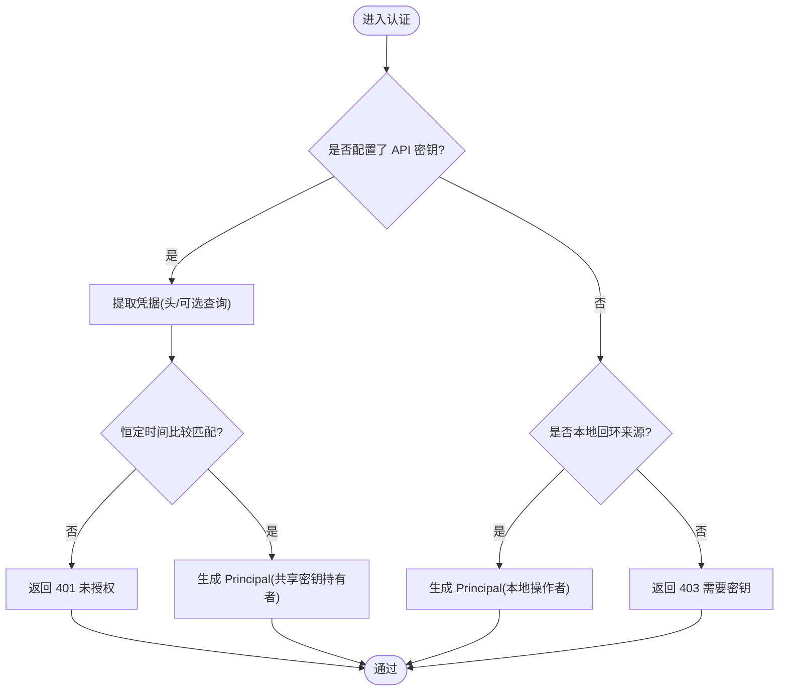
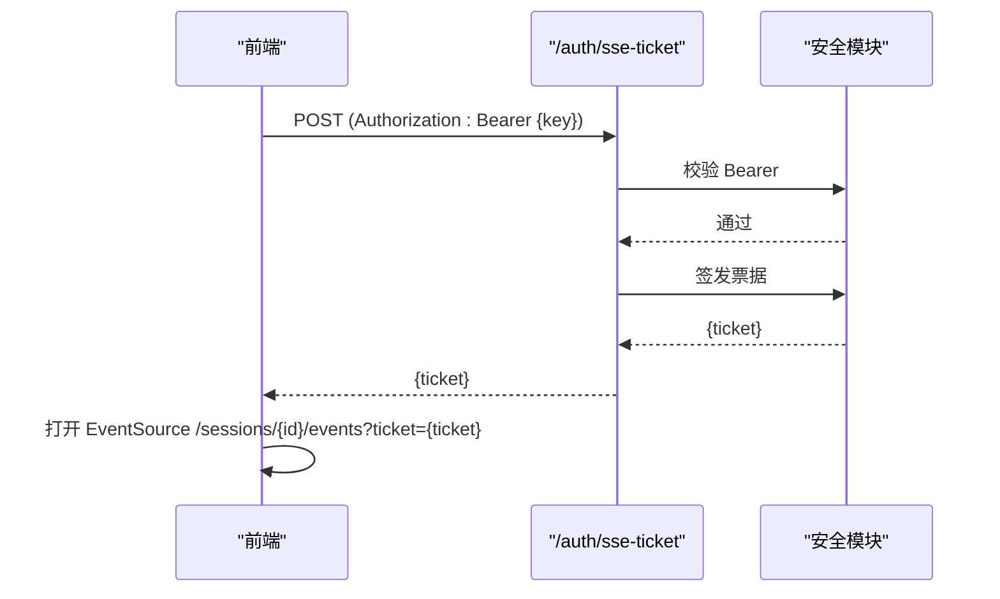
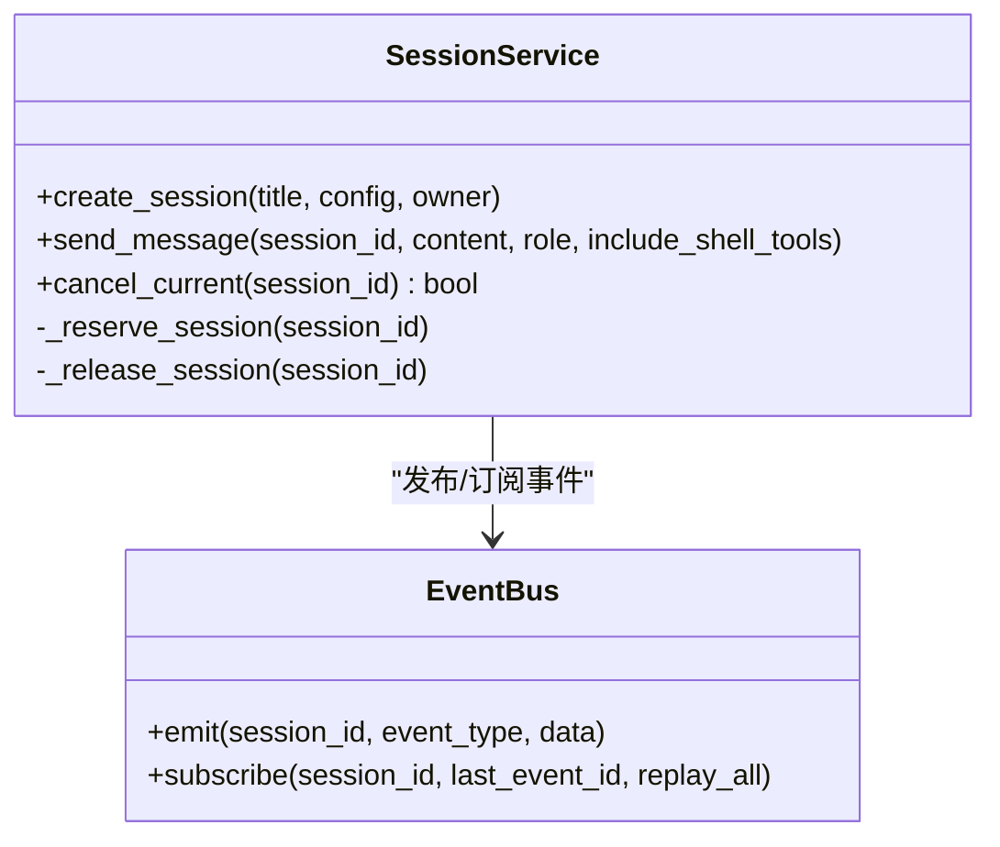
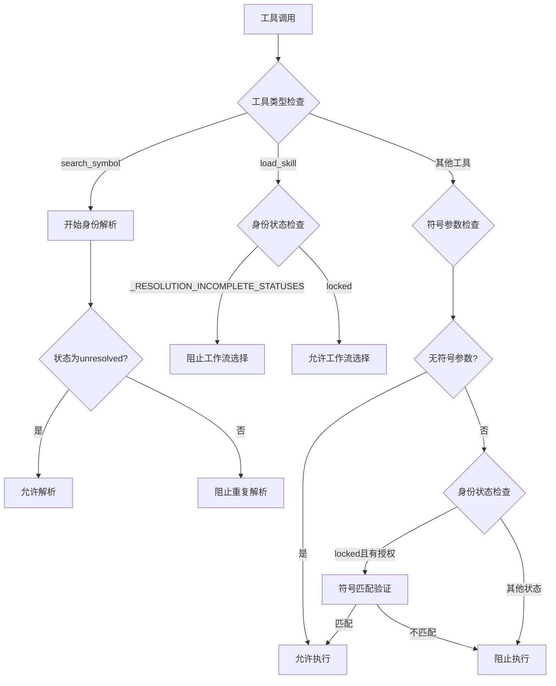
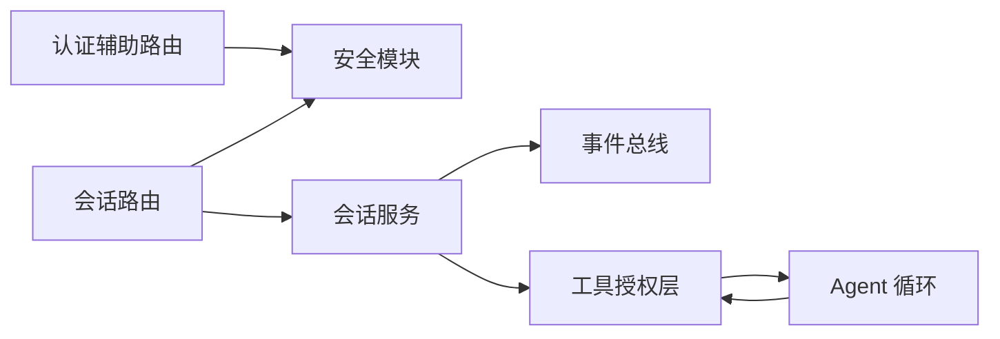

# 认证授权机制

<cite>
**本文引用的文件**
- [auth_routes.py](file://agent/src/api/auth_routes.py)
- [security.py](file://agent/src/api/security.py)
- [sessions_routes.py](file://agent/src/api/sessions_routes.py)
- [service.py](file://agent/src/session/service.py)
- [models.py](file://agent/src/session/models.py)
- [apiAuth.ts](file://frontend/src/lib/apiAuth.ts)
- [test_sse_ticket_and_headers.py](file://agent/tests/test_sse_ticket_and_headers.py)
- [test_cors_opt_in.py](file://agent/tests/test_openbb_bridge/test_cors_opt_in.py)
- [grounding.py](file://agent/src/agent/grounding.py)
- [loop.py](file://agent/src/agent/loop.py)
- [_market_hooks.py](file://agent/backtest/engines/_market_hooks.py)
- [test_agent_grounding.py](file://agent/tests/test_agent_grounding.py)
</cite>

## 更新摘要
**变更内容**
- 增强了工具授权机制，改进了身份解析和批量处理保护
-  grounding系统现在对多工具工作流中的时序问题提供更强大的保护
- 改进了边缘情况处理，如加拿大代码保留正确的交易所和货币识别
- 更新了工具调用批处理的身份状态冻结机制
- 增强了市场敏感型工作流选择的时序保护

## 目录
1. [简介](#简介)
2. [项目结构](#项目结构)
3. [核心组件](#核心组件)
4. [架构总览](#架构总览)
5. [详细组件分析](#详细组件分析)
6. [依赖关系分析](#依赖关系分析)
7. [性能与可扩展性](#性能与可扩展性)
8. [故障排除指南](#故障排除指南)
9. [结论](#结论)
10. [附录：配置与最佳实践](#附录：配置与最佳实践)

## 简介
本文件系统性说明 Vibe-Trading 的认证与授权机制，覆盖 API 密钥认证、会话管理、权限控制与访问控制策略。重点解释 Bearer Token 验证、SSE 票据机制、本地回环信任模式、跨站请求防护（CSRF/同源校验）、安全响应头、CORS 配置与 DNS 重绑定防护。文档还给出不同认证模式的使用场景与安全考虑、认证流程、配置示例与常见问题排查建议，并强调多层认证架构、API 密钥管理与会话生命周期管理。**更新** 本次更新重点增强了工具授权机制，改进了身份解析和批量处理保护，确保在多工具工作流中提供更强的一致性保证。

## 项目结构
Vibe-Trading 在后端通过 FastAPI 暴露 REST 与 SSE 接口；认证与安全逻辑集中在安全模块中，按路由粒度挂载鉴权依赖；前端在浏览器侧以 Bearer Token 方式调用受保护接口，并通过一次性票据建立 SSE 流。会话服务负责会话创建、消息发送、执行调度与事件总线广播。**更新** 新增的工具授权层在 Agent 循环中集成，提供基于身份状态的细粒度工具调用控制。

```mermaid
graph TB
FE["前端<br/>浏览器"] --> |POST /auth/sse-ticket<br/>Authorization: Bearer {key}| AuthRoute["认证辅助路由<br/>/auth/sse-ticket"]
FE --> |GET /sessions/{id}/events<br/>?ticket=...| SSE["会话事件流<br/>/sessions/{id}/events"]
FE --> |REST 调用<br/>Authorization: Bearer {key}| Routes["业务路由<br/>sessions/goals/messages"]
AuthRoute --> Sec["安全模块<br/>票据签发/校验"]
SSE --> Sec
Routes --> Sec
Routes --> Svc["会话服务<br/>SessionService"]
Svc --> Bus["事件总线<br/>EventBus"]
Svc --> Grounding["工具授权层<br/>Grounding System"]
Grounding --> Loop["Agent 循环<br/>批量处理"]
```

**图表来源**
- [auth_routes.py:21-55](file://agent/src/api/auth_routes.py#L21-L55)
- [security.py:318-340](file://agent/src/api/security.py#L318-L340)
- [security.py:571-622](file://agent/src/api/security.py#L571-L622)
- [sessions_routes.py:752-800](file://agent/src/api/sessions_routes.py#L752-L800)
- [service.py:158-218](file://agent/src/session/service.py#L158-L218)
- [grounding.py:672-812](file://agent/src/agent/grounding.py#L672-L812)
- [loop.py:1207-1245](file://agent/src/agent/loop.py#L1207-L1245)

## 核心组件
- API 密钥认证与主体建模
  - 使用 HTTPBearer 从请求头或查询参数提取凭据，与配置的共享密钥进行恒定时间比较。
  - 未配置密钥时允许本地回环信任；否则拒绝非本地访问。
  - 返回 Principal，包含 auth_method 与可归属性标志，用于后续审计与权限判断。
- SSE 票据机制
  - 浏览器 EventSource 无法携带 Authorization 头，因此先 POST /auth/sse-ticket 换取一次性 ticket，再在 SSE URL 中以 ?ticket= 传递。
  - 票据短期有效且单次使用，防止泄露与重放。
- 跨站请求防护与同源校验
  - 对非安全方法（POST/PUT/DELETE 等）强制检查 Origin/Sec-Fetch-Site，拒绝不可信跨站请求。
  - 仅允许本地回环来源或与请求 Host 匹配的源。
- CORS 与额外来源白名单
  - 默认允许本地开发来源；可通过环境变量追加额外可信来源，禁止通配符。
- DNS 重绑定防护
  - 针对来自本地客户端的请求，校验 Host 是否属于可信回环主机集合，防止恶意 Host 绕过本地信任。
- 安全响应头
  - 统一设置 CSP、X-Content-Type-Options、X-Frame-Options、Permissions-Policy、Referrer-Policy。
- 日志脱敏
  - 对访问日志中的敏感查询参数值进行脱敏，避免密钥/票据泄露到日志。
- **新增** 工具授权与身份解析
  - 基于身份状态的工具调用授权，防止多工具工作流中的时序竞态条件。
  - 批量处理的身份状态冻结，确保工具调用一致性。
  - 改进的边缘情况处理，支持加拿大代码的正确识别。

**章节来源**
- [security.py:347-504](file://agent/src/api/security.py#L347-L504)
- [security.py:571-622](file://agent/src/api/security.py#L571-L622)
- [security.py:69-158](file://agent/src/api/security.py#L69-L158)
- [security.py:166-173](file://agent/src/api/security.py#L166-L173)
- [security.py:235-253](file://agent/src/api/security.py#L235-L253)
- [security.py:260-297](file://agent/src/api/security.py#L260-L297)
- [grounding.py:672-812](file://agent/src/agent/grounding.py#L672-L812)
- [loop.py:1207-1245](file://agent/src/agent/loop.py#L1207-L1245)

## 架构总览
下图展示从浏览器到后端的完整认证与事件流路径，包括票据交换、SSE 鉴权与会话执行。**更新** 新增了工具授权层，在 Agent 循环中提供基于身份状态的细粒度控制。

```mermaid
sequenceDiagram
participant Browser as "浏览器"
participant API as "FastAPI 应用"
participant Auth as "认证辅助路由"
participant Sec as "安全模块"
participant Sessions as "会话路由"
participant Service as "会话服务"
participant Grounding as "工具授权层"
participant Loop as "Agent 循环"
participant Bus as "事件总线"
Browser->>API : POST /auth/sse-ticket (Authorization : Bearer {key})
API->>Auth : 路由分发
Auth->>Sec : require_auth(校验 Bearer)
Sec-->>Auth : 通过
Auth->>Sec : _mint_sse_ticket()
Sec-->>Auth : {ticket}
Auth-->>Browser : {ticket}
Browser->>API : GET /sessions/{id}/events?ticket={ticket}
API->>Sessions : 路由分发
Sessions->>Sec : require_event_stream_auth(ticket, cred?)
Sec-->>Sessions : 通过
Sessions->>Service : subscribe(session_id, last_event_id)
Service->>Loop : 处理工具调用
Loop->>Grounding : authorize_tool_call()
Grounding-->>Loop : ToolAuthorization
Loop->>Bus : 订阅事件
Bus-->>Sessions : 事件帧
Sessions-->>Browser : text/event-stream 事件流
```

**图表来源**
- [auth_routes.py:21-55](file://agent/src/api/auth_routes.py#L21-L55)
- [security.py:318-340](file://agent/src/api/security.py#L318-L340)
- [security.py:591-622](file://agent/src/api/security.py#L591-L622)
- [sessions_routes.py:752-800](file://agent/src/api/sessions_routes.py#L752-L800)
- [service.py:158-218](file://agent/src/session/service.py#L158-L218)
- [grounding.py:672-812](file://agent/src/agent/grounding.py#L672-L812)
- [loop.py:1207-1245](file://agent/src/agent/loop.py#L1207-L1245)

## 详细组件分析

### API 密钥认证与主体模型
- 凭据来源
  - 优先从 Authorization 头读取 Bearer token；在部分路径允许从查询参数读取（如 SSE 票据）。
- 密钥匹配
  - 使用恒定时间比较避免时序攻击。
- 本地回环信任
  - 当未配置 API 密钥时，仅允许本地回环来源；远程访问必须提供密钥。
- 主体建模
  - 成功认证后返回 Principal，标识认证方式（共享密钥或本地信任），并标记是否可归因于具体自然人。



**图表来源**
- [security.py:347-504](file://agent/src/api/security.py#L347-L504)
- [models.py:16-78](file://agent/src/session/models.py#L16-L78)

**章节来源**
- [security.py:347-504](file://agent/src/api/security.py#L347-L504)
- [models.py:16-78](file://agent/src/session/models.py#L16-L78)

### SSE 票据机制
- 为什么需要票据
  - 浏览器 EventSource 不能发送 Authorization 头，为避免将长生命周期密钥放入 URL/历史/代理日志，采用"一次一密"的票据。
- 票据生命周期
  - 票据有效期约 60 秒，首次使用时即失效，防止重放。
- 前端集成
  - 前端保存 API 密钥并在需要时通过 Bearer 头获取票据，随后以 ?ticket= 连接 SSE。



**图表来源**
- [auth_routes.py:21-55](file://agent/src/api/auth_routes.py#L21-L55)
- [security.py:318-340](file://agent/src/api/security.py#L318-L340)
- [apiAuth.ts:1-21](file://frontend/src/lib/apiAuth.ts#L1-L21)

**章节来源**
- [auth_routes.py:1-55](file://agent/src/api/auth_routes.py#L1-L55)
- [security.py:300-340](file://agent/src/api/security.py#L300-L340)
- [apiAuth.ts:1-21](file://frontend/src/lib/apiAuth.ts#L1-L21)

### 会话管理与事件流
- 会话创建与消息发送
  - 每个会话同一时间仅允许一个运行，防止并发写入导致状态交错。
- 事件总线
  - 会话内的事件（消息接收、尝试开始/完成/失败/取消）通过事件总线广播，供 SSE 消费。
- SSE 事件流
  - 支持 Last-Event-ID 与回放模式，便于断线重连与进度恢复。



**图表来源**
- [service.py:53-218](file://agent/src/session/service.py#L53-L218)
- [sessions_routes.py:752-800](file://agent/src/api/sessions_routes.py#L752-L800)

**章节来源**
- [service.py:53-218](file://agent/src/session/service.py#L53-L218)
- [sessions_routes.py:752-800](file://agent/src/api/sessions_routes.py#L752-L800)

### 工具授权与身份解析
**新增** 工具授权层提供了基于身份状态的工具调用控制，确保多工具工作流的一致性和安全性。

- 身份状态管理
  - 维护工具调用的身份状态（unresolved、locked、ambiguous、conflicting、invalidated）。
  - 批量处理时冻结身份状态，防止时序竞态条件。
- 工具调用授权
  - 根据身份状态和工具类型决定是否允许执行。
  - 市场敏感型工具（如 load_skill）需要等待身份解析完成。
- 符号匹配与验证
  - 支持多种符号格式，包括加拿大代码（.TO、.V）。
  - 严格的符号匹配，防止隐式后缀重写。
- 批量处理保护
  - 在 Agent 循环中捕获批量授权符号和身份状态。
  - 确保同一批次内的工具调用使用一致的身份上下文。



**图表来源**
- [grounding.py:672-812](file://agent/src/agent/grounding.py#L672-L812)
- [grounding.py:759-795](file://agent/src/agent/grounding.py#L759-L795)
- [loop.py:1207-1245](file://agent/src/agent/loop.py#L1207-L1245)

**章节来源**
- [grounding.py:672-812](file://agent/src/agent/grounding.py#L672-L812)
- [grounding.py:759-795](file://agent/src/agent/grounding.py#L759-L795)
- [loop.py:1207-1245](file://agent/src/agent/loop.py#L1207-L1245)
- [test_agent_grounding.py:260-300](file://agent/tests/test_agent_grounding.py#L260-L300)

### 权限控制与访问控制策略
- 路由级依赖
  - 敏感路由通过 Depends(require_auth) 或 Depends(require_event_stream_auth) 进行鉴权。
- 写操作保护
  - 设置写入等敏感操作要求显式认证，或在本地回环下才允许。
- 跨站防护
  - 对非安全方法强制同源校验，拒绝不可信跨站请求。
- DNS 重绑定防护
  - 本地来源请求需满足可信 Host 列表，防止通过 Host 头绕过本地信任。

**章节来源**
- [security.py:423-504](file://agent/src/api/security.py#L423-L504)
- [security.py:571-622](file://agent/src/api/security.py#L571-L622)
- [security.py:166-173](file://agent/src/api/security.py#L166-L173)

### 安全头部、CORS 与 DNS 重绑定防护
- 安全响应头
  - 默认启用严格 CSP、禁止点击劫持、限制权限策略、严格 Referrer 策略。
- CORS 配置
  - 默认允许本地开发来源；可通过环境变量追加额外来源，禁止通配符。
- DNS 重绑定防护
  - 本地来源请求需满足可信 Host 列表，防止恶意 Host 绕过本地信任。

**章节来源**
- [security.py:180-253](file://agent/src/api/security.py#L180-L253)
- [security.py:69-158](file://agent/src/api/security.py#L69-L158)
- [security.py:166-173](file://agent/src/api/security.py#L166-L173)
- [test_cors_opt_in.py:17-51](file://agent/tests/test_openbb_bridge/test_cors_opt_in.py#L17-L51)

### 市场钩子与货币识别
**更新** 改进了市场钩子系统，提供更好的边缘情况处理，特别是加拿大代码的识别。

- 子市场检测
  - 支持美国、香港和加拿大市场检测。
  - 加拿大市场通过 .TO 和 .V 后缀识别。
- 货币映射
  - 为不同市场配置正确的结算货币。
  - 加拿大市场使用 CAD 作为结算货币。
- 加密货币支持
  - 支持 OKX 分级保证金表。
  - 加密货币统一使用 USD 计价。

**章节来源**
- [_market_hooks.py:184-232](file://agent/backtest/engines/_market_hooks.py#L184-L232)

## 依赖关系分析
- 路由与依赖
  - 认证辅助路由依赖宿主应用的 require_auth 依赖注入。
  - 会话路由依赖宿主应用的 require_auth 与 require_event_stream_auth。
- 安全模块
  - 提供凭据解析、票据管理、同源校验、CORS 解析、DNS 重绑定防护与安全头注入。
- 会话服务
  - 依赖事件总线与存储层，负责会话生命周期与执行调度。
- **新增** 工具授权层
  - 依赖 Agent 循环的批量处理机制。
  - 提供身份状态管理和工具调用授权。



**图表来源**
- [auth_routes.py:21-55](file://agent/src/api/auth_routes.py#L21-L55)
- [sessions_routes.py:289-320](file://agent/src/api/sessions_routes.py#L289-L320)
- [security.py:571-622](file://agent/src/api/security.py#L571-L622)
- [service.py:53-218](file://agent/src/session/service.py#L53-L218)
- [grounding.py:672-812](file://agent/src/agent/grounding.py#L672-L812)
- [loop.py:1207-1245](file://agent/src/agent/loop.py#L1207-L1245)

**章节来源**
- [auth_routes.py:21-55](file://agent/src/api/auth_routes.py#L21-L55)
- [sessions_routes.py:289-320](file://agent/src/api/sessions_routes.py#L289-L320)
- [security.py:571-622](file://agent/src/api/security.py#L571-L622)
- [service.py:53-218](file://agent/src/session/service.py#L53-L218)
- [grounding.py:672-812](file://agent/src/agent/grounding.py#L672-L812)
- [loop.py:1207-1245](file://agent/src/agent/loop.py#L1207-L1245)

## 性能与可扩展性
- 票据管理
  - 内存中维护票据映射，定期清理过期票据，降低内存占用。
- 并发控制
  - 会话服务在同一会话上串行化执行，避免并发冲突。
- 事件流
  - 使用异步事件总线与 StreamingResponse，减少阻塞与内存峰值。
- 扩展点
  - 通过环境变量扩展 CORS 与本地信任主机；通过依赖注入替换认证策略。
- **新增** 批量处理优化
  - 工具授权层支持批量处理，减少身份状态检查开销。
  - 身份状态冻结机制避免重复解析。

## 故障排除指南
- 401 未授权
  - 检查 Authorization 头是否正确携带 Bearer token。
  - 确认后端已配置 API 密钥或未配置时在本地回环访问。
  - SSE 连接需先获取票据，再使用 ?ticket= 连接。
- 403 禁止访问
  - 检查 Origin/Sec-Fetch-Site 是否被拒绝（跨站请求）。
  - 检查 Host 是否属于可信回环主机列表（DNS 重绑定防护）。
  - 远程访问未配置 API 密钥将被拒绝。
- 工具调用被阻止
  - 检查身份状态是否为 locked。
  - 确认工具调用是否在正确的批量边界内。
  - 验证符号参数是否与授权符号匹配。
- 安全头缺失
  - 确认安全中间件已安装；测试用例验证响应头存在。
- CORS 问题
  - 确认来源是否在默认或额外白名单中；禁止使用通配符。
- 日志泄露
  - 确认访问日志过滤器已安装，敏感查询参数值会被脱敏。

**章节来源**
- [security.py:347-504](file://agent/src/api/security.py#L347-L504)
- [security.py:571-622](file://agent/src/api/security.py#L571-L622)
- [security.py:180-253](file://agent/src/api/security.py#L180-L253)
- [security.py:260-297](file://agent/src/api/security.py#L260-L297)
- [test_sse_ticket_and_headers.py:138-159](file://agent/tests/test_sse_ticket_and_headers.py#L138-L159)
- [test_cors_opt_in.py:17-51](file://agent/tests/test_openbb_bridge/test_cors_opt_in.py#L17-L51)
- [grounding.py:672-812](file://agent/src/agent/grounding.py#L672-L812)

## 结论
Vibe-Trading 采用多层认证与访问控制：API 密钥认证为主，本地回环信任为辅；SSE 票据机制解决浏览器 EventSource 的限制并避免密钥泄露；严格的同源校验与 DNS 重绑定防护确保本地信任不被滥用；统一的安全响应头与 CORS 配置提升整体安全性。会话服务通过并发控制与事件总线保障一致性与可观测性。**更新** 新增的工具授权层进一步增强了系统的安全性，通过身份状态管理和批量处理保护，确保多工具工作流的正确性和一致性。生产部署应始终配置 API 密钥，并谨慎扩展 CORS 与本地信任主机。

## 附录：配置与最佳实践
- 认证模式与使用场景
  - 共享密钥模式：生产环境推荐，所有访问均需携带 Bearer token。
  - 本地回环模式：开发环境默认允许本地来源；远程访问必须配置密钥。
- 安全头部与 CORS
  - 保持默认严格 CSP；如需调试可切换报告模式。
  - 仅添加必要的额外来源，禁止通配符。
- DNS 重绑定防护
  - 仅信任必要的主机名；避免将外部域名加入本地信任列表。
- 日志脱敏
  - 确保日志过滤器已安装，避免密钥/票据泄露。
- 前端集成
  - 前端保存 API 密钥并在需要时通过 Bearer 头调用；SSE 连接使用票据。
- **新增** 工具授权配置
  - 合理配置身份解析策略，避免过度严格的限制影响用户体验。
  - 监控工具调用授权状态，及时处理身份冲突和解析失败。
  - 为不同的工具类型配置适当的授权策略。

**章节来源**
- [security.py:69-158](file://agent/src/api/security.py#L69-L158)
- [security.py:180-253](file://agent/src/api/security.py#L180-L253)
- [security.py:260-297](file://agent/src/api/security.py#L260-L297)
- [apiAuth.ts:1-21](file://frontend/src/lib/apiAuth.ts#L1-L21)
- [grounding.py:672-812](file://agent/src/agent/grounding.py#L672-L812)