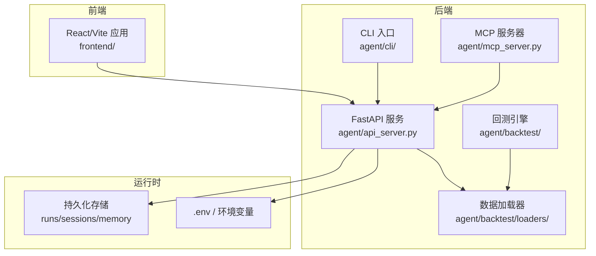
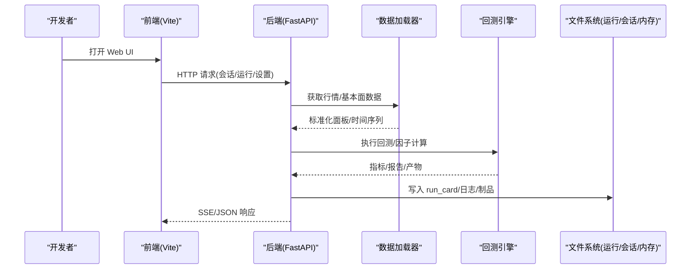
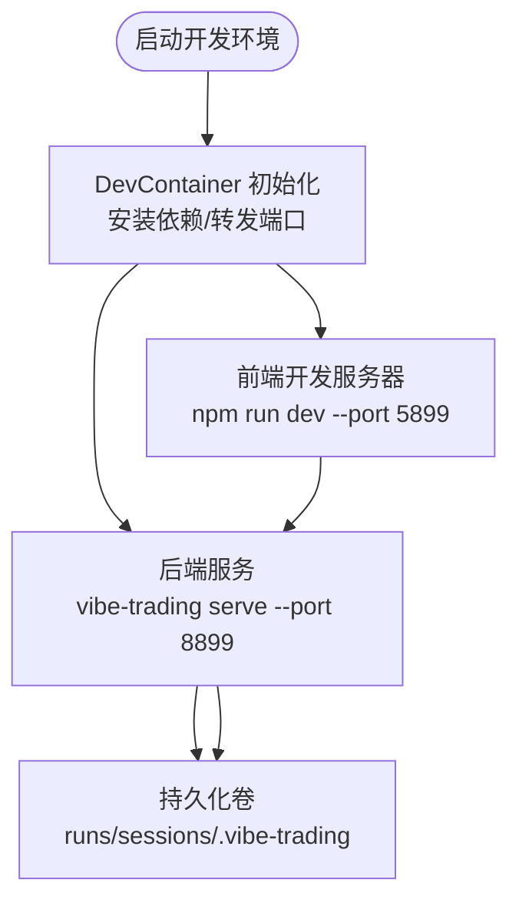
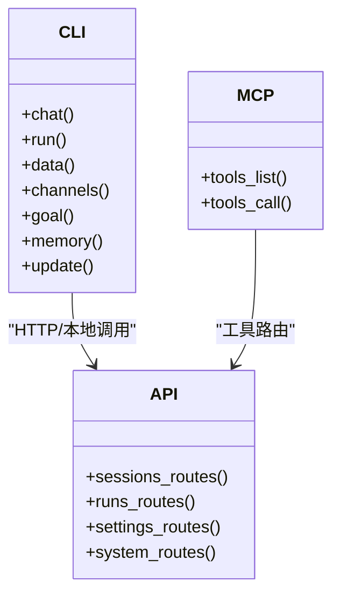
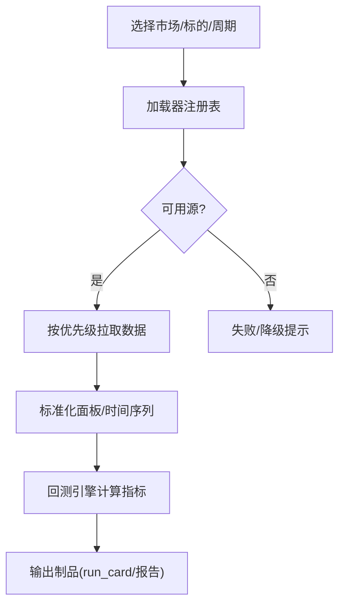
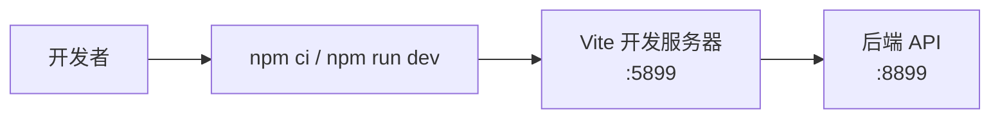

# 开发者指南

<cite>
**本文引用的文件**
- [README.md](file://README.md)
- [CONTRIBUTING.md](file://CONTRIBUTING.md)
- [AGENT_CONTRIBUTOR_GUIDE.md](file://AGENT_CONTRIBUTOR_GUIDE.md)
- [SECURITY.md](file://SECURITY.md)
- [CODE_OF_CONDUCT.md](file://CODE_OF_CONDUCT.md)
- [pyproject.toml](file://pyproject.toml)
- [agent/requirements.txt](file://agent/requirements.txt)
- [.devcontainer/devcontainer.json](file://.devcontainer/devcontainer.json)
- [docker-compose.yml](file://docker-compose.yml)
- [Dockerfile](file://Dockerfile)
- [frontend/package.json](file://frontend/package.json)
</cite>

## 目录
1. [简介](#简介)
2. [项目结构](#项目结构)
3. [核心组件](#核心组件)
4. [架构总览](#架构总览)
5. [详细组件分析](#详细组件分析)
6. [依赖与开发环境](#依赖与开发环境)
7. [贡献流程与代码规范](#贡献流程与代码规范)
8. [调试与排错](#调试与排错)
9. [性能与可维护性建议](#性能与可维护性建议)
10. [结论](#结论)
11. [附录：常用命令与环境变量](#附录：常用命令与环境变量)

## 简介
本指南面向希望参与 Vibe-Trading 后端、前端、MCP/CLI、回测与数据加载器开发的工程师。内容覆盖本地与容器化开发环境搭建、依赖安装、工具链配置、调试技巧、贡献流程、代码规范、协作方式、常见问题及解决方案，并结合仓库中的实际配置文件给出可操作的步骤。

## 项目结构
Vibe-Trading 采用前后端分离与多语言工程组织：
- 后端与 CLI/MCP：位于 agent/，提供 FastAPI 服务、命令行入口、MCP 服务器、回测引擎、数据加载器、策略因子库等。
- 前端：位于 frontend/，基于 React + Vite，提供 Web UI、图表、会话与运行详情展示。
- 桌面端：desktop/electron/，用于打包 Electron 宿主与后端生命周期管理（Windows 安全打包等）。
- 文档与 Wiki：wiki/，包含教程、Alpha Library、研究实验室等内容。
- 构建与部署：Dockerfile、docker-compose.yml、GitHub Actions 工作流。

**图示来源**
- [docker-compose.yml:1-90](file://docker-compose.yml#L1-L90)
- [Dockerfile:1-108](file://Dockerfile#L1-L108)
- [pyproject.toml:77-87](file://pyproject.toml#L77-L87)

**章节来源**
- [README.md:1-182](file://README.md#L1-L182)
- [pyproject.toml:77-87](file://pyproject.toml#L77-L87)

## 核心组件
- 后端服务：FastAPI 提供 REST/SSE 接口，承载会话、运行、设置、通道、系统路由等。
- CLI：统一入口，支持聊天、回测、数据、频道、目标、记忆、更新等子命令。
- MCP：模型上下文协议服务器，暴露工具能力供外部调用。
- 回测与因子：多市场引擎、因子库、优化器、指标与风险报告。
- 数据层：多源数据加载器（A股、美股、港股、加密货币、期货、外汇等）与缓存机制。
- 前端：Web UI 提供会话交互、运行详情、Alpha 库、相关性视图等。

**章节来源**
- [pyproject.toml:77-87](file://pyproject.toml#L77-L87)
- [agent/requirements.txt:1-69](file://agent/requirements.txt#L1-L69)
- [frontend/package.json:1-58](file://frontend/package.json#L1-L58)

## 架构总览
下图展示了开发时常见的请求路径与组件交互：浏览器访问前端，通过 Vite 代理到后端；CLI/MCP 直接调用后端；后端调度数据加载器与回测引擎，并将结果持久化。

**图示来源**
- [docker-compose.yml:1-90](file://docker-compose.yml#L1-L90)
- [Dockerfile:82-108](file://Dockerfile#L82-L108)
- [pyproject.toml:77-87](file://pyproject.toml#L77-L87)

## 详细组件分析

### 开发环境与容器化
- 使用 devcontainer 快速搭建一致的开发环境，自动安装 Python 依赖与前端依赖，并转发端口 8899（API）和 5899（前端）。
- Docker Compose 编排后端与前端服务，挂载卷持久化 runs/sessions/memory，默认绑定 localhost 端口，便于本地调试。
- Dockerfile 分阶段构建前端静态资源与 Python 虚拟环境，最终镜像仅携带运行时依赖，并通过健康检查探测 /live。

**图示来源**
- [.devcontainer/devcontainer.json:1-40](file://.devcontainer/devcontainer.json#L1-L40)
- [docker-compose.yml:1-90](file://docker-compose.yml#L1-L90)
- [Dockerfile:1-108](file://Dockerfile#L1-L108)

**章节来源**
- [.devcontainer/devcontainer.json:1-40](file://.devcontainer/devcontainer.json#L1-L40)
- [docker-compose.yml:1-90](file://docker-compose.yml#L1-L90)
- [Dockerfile:1-108](file://Dockerfile#L1-L108)

### CLI 与 MCP
- CLI 入口由 pyproject 脚本定义，支持 chat/run/data/channels/goal/memory/update 等子命令。
- MCP 服务器独立入口，暴露工具列表与调用能力，适合集成到外部工作流或 Agent 生态。

**图示来源**
- [pyproject.toml:77-87](file://pyproject.toml#L77-L87)

**章节来源**
- [pyproject.toml:77-87](file://pyproject.toml#L77-L87)

### 回测与数据加载器
- 回测引擎支持多市场（A股、全球股票、期货、加密货币、外汇等），通过统一的加载器接口获取标准化数据。
- 数据加载器具备缓存、降级与区间归一化能力，保障跨源一致性。

**图示来源**
- [agent/requirements.txt:39-48](file://agent/requirements.txt#L39-L48)
- [pyproject.toml:89-103](file://pyproject.toml#L89-L103)

**章节来源**
- [agent/requirements.txt:39-48](file://agent/requirements.txt#L39-L48)
- [pyproject.toml:89-103](file://pyproject.toml#L89-L103)

### 前端与构建
- 前端基于 React + Vite，Node 版本要求 >=22.22.0，提供 dev/build/test 脚本。
- 开发模式通过 Vite 代理访问后端 API，生产构建产物由后端静态托管。

**图示来源**
- [frontend/package.json:1-58](file://frontend/package.json#L1-L58)
- [docker-compose.yml:68-83](file://docker-compose.yml#L68-L83)

**章节来源**
- [frontend/package.json:1-58](file://frontend/package.json#L1-L58)
- [docker-compose.yml:68-83](file://docker-compose.yml#L68-L83)

## 依赖与开发环境

### 环境要求
- Python：>=3.11,<3.14（受限于部分依赖的 wheel 可用性）。
- Node.js：>=22.22.0（前端构建与开发）。
- 可选：Docker/Docker Compose（推荐用于隔离与一键启动）。

**章节来源**
- [pyproject.toml:1-23](file://pyproject.toml#L1-L23)
- [frontend/package.json:1-16](file://frontend/package.json#L1-L16)

### 依赖安装
- 后端与 CLI：推荐使用 editable 安装以支持热重载与调试。
- 前端：在 frontend 目录下执行依赖安装与构建。
- 可选功能：通过 extras 按需安装（如 deepseek、anthropic、openbb、stats、ashare、harmonic、各 IM channels 等）。

**章节来源**
- [pyproject.toml:105-230](file://pyproject.toml#L105-L230)
- [agent/requirements.txt:1-69](file://agent/requirements.txt#L1-L69)

### 开发工具配置
- 代码格式与检查：black 与 ruff（ruff 配置在 pyproject.toml）。
- 测试：pytest（含 socket 限制、覆盖率等）。
- 编辑器：VS Code 扩展（Python、Pylance、ESLint、Prettier）由 devcontainer 预设。

**章节来源**
- [pyproject.toml:224-271](file://pyproject.toml#L224-L271)
- [.devcontainer/devcontainer.json:26-38](file://.devcontainer/devcontainer.json#L26-L38)

## 贡献流程与代码规范

### 提交流程
- 所有社区 PR 必须包含 DCO Signed-off-by 签名。
- Alpha 因子相关 PR 需通过纯度门控与前瞻泄露检测，并满足元数据与契约要求。
- 新增因子遵循“创建文件 -> 定义元数据与 compute -> 本地门控测试 -> 可选基准 -> 提交 PR”的流程。

**章节来源**
- [CONTRIBUTING.md:18-42](file://CONTRIBUTING.md#L18-L42)
- [CONTRIBUTING.md:85-138](file://CONTRIBUTING.md#L85-L138)

### 代码规范
- 格式：black；检查：ruff（行宽、忽略规则见配置）。
- 类型注解：公共函数与方法需标注类型。
- 文档：Google 风格 docstring（Args/Returns/Raises）。
- 文件规模：尽量小于 400 行，上限 800 行。
- 配置与密钥：禁止硬编码路径/密钥/URL，统一通过 .env/YAML/模块常量管理。
- 清理：删除未使用代码而非注释掉。

**章节来源**
- [CONTRIBUTING.md:140-157](file://CONTRIBUTING.md#L140-L157)
- [pyproject.toml:240-271](file://pyproject.toml#L240-L271)

### 团队协作与安全
- 行为准则：遵循 Contributor Covenant，营造开放包容的社区环境。
- 安全策略：漏洞私报渠道、官方渠道声明、生成代码的安全边界说明。
- 高敏操作：避免在 PR 验证中执行真实交易、支付、钱包、合约或写入敏感凭据。

**章节来源**
- [CODE_OF_CONDUCT.md:1-129](file://CODE_OF_CONDUCT.md#L1-L129)
- [SECURITY.md:1-48](file://SECURITY.md#L1-L48)
- [AGENT_CONTRIBUTOR_GUIDE.md:41-56](file://AGENT_CONTRIBUTOR_GUIDE.md#L41-L56)

## 调试与排错

### 常见开发问题与解决
- 本地端口冲突：确认 8899（API）与 5899（前端）未被占用；可通过 docker-compose 或 devcontainer 转发端口。
- 依赖解析失败：优先使用 requirements-lock.txt 与 hash-pinned 安装；必要时重新生成锁文件。
- 前端构建失败：确保 Node 版本满足要求；清理 node_modules 后重试。
- 网络受限：数据加载器支持代理与降级；检查代理环境变量与源可用性。
- 权限与路径：避免将私有数据或凭据提交至仓库；使用 .env 与卷持久化。

**章节来源**
- [docker-compose.yml:1-90](file://docker-compose.yml#L1-L90)
- [Dockerfile:31-43](file://Dockerfile#L31-L43)
- [frontend/package.json:1-16](file://frontend/package.json#L1-L16)

### 调试技巧
- 使用 pytest 的 --ignore 参数缩小测试范围，加速反馈循环。
- 利用 devcontainer 的 VS Code 扩展进行断点调试与 lint 检查。
- 通过 docker-compose 的卷与 env_file 快速切换配置与数据。
- 使用 MCP/CLI 的工具列表与调用能力验证后端状态。

**章节来源**
- [AGENT_CONTRIBUTOR_GUIDE.md:24-39](file://AGENT_CONTRIBUTOR_GUIDE.md#L24-L39)
- [.devcontainer/devcontainer.json:26-38](file://.devcontainer/devcontainer.json#L26-L38)
- [pyproject.toml:232-238](file://pyproject.toml#L232-L238)

## 性能与可维护性建议
- 数据缓存：开启数据缓存以减少重复下载与速率限制影响。
- 并行与批处理：合理使用并行度，避免大对象反复序列化。
- 指标与报告：关注回测产物的体积与渲染性能，按需分页与懒加载。
- 代码组织：保持模块职责单一，控制文件规模，提升可读性与可测试性。

[本节为通用指导，不直接引用具体文件]

## 结论
本指南提供了从环境搭建、依赖管理、工具链配置到贡献流程与调试排错的完整开发路径。结合仓库中的 devcontainer、Docker 与 pyproject 配置，开发者可以快速建立一致的开发体验，并在严格的代码规范与安全策略下高效协作。

[本节为总结，不直接引用具体文件]

## 附录：常用命令与环境变量

### 常用命令
- 安装与开发：
  - pip install -e ".[dev]"（安装开发与可选依赖）
  - cd frontend && npm ci && npm run dev（启动前端开发服务器）
- 测试与检查：
  - pytest --ignore=agent/tests/e2e_backtest -q（快速单元测试）
  - black --check <files> 与 ruff check <files>（格式与检查）
- 运行服务：
  - vibe-trading serve --host 0.0.0.0 --port 8899（后端服务）
  - docker compose up（一键启动前后端）

**章节来源**
- [pyproject.toml:224-230](file://pyproject.toml#L224-L230)
- [frontend/package.json:9-15](file://frontend/package.json#L9-L15)
- [docker-compose.yml:1-90](file://docker-compose.yml#L1-L90)

### 关键环境变量
- OLLAMA_BASE_URL：本地或远程 Ollama 地址（容器内默认 host.docker.internal）。
- VIBE_TRADING_TRUST_DOCKER_LOOPBACK：允许 Docker 环回信任。
- VITE_API_URL：前端开发时指向后端 API。
- 其他：根据数据源与通道需求配置相应密钥与代理。

**章节来源**
- [docker-compose.yml:8-19](file://docker-compose.yml#L8-L19)
- [docker-compose.yml:75-77](file://docker-compose.yml#L75-L77)