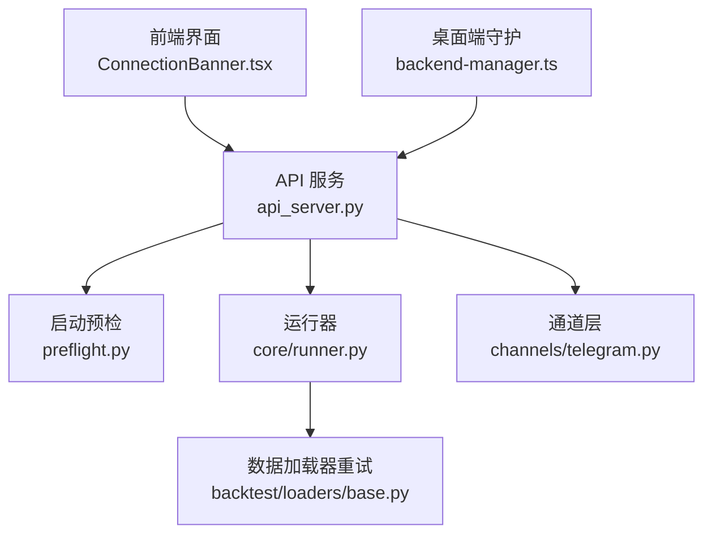
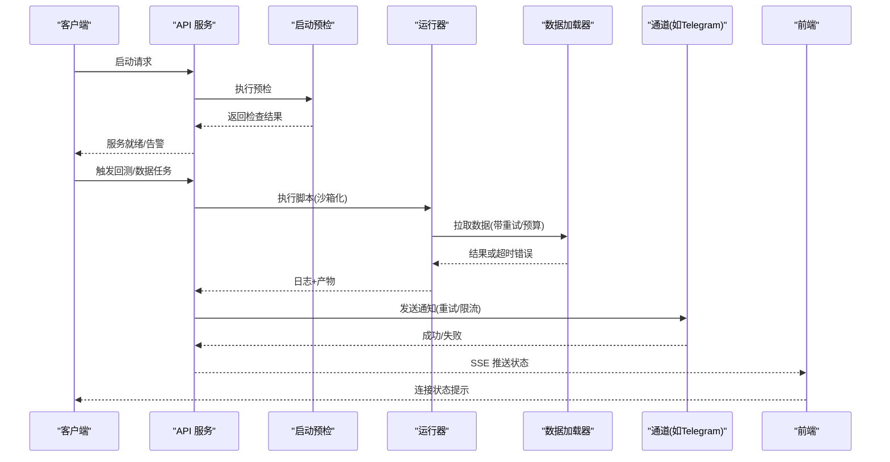
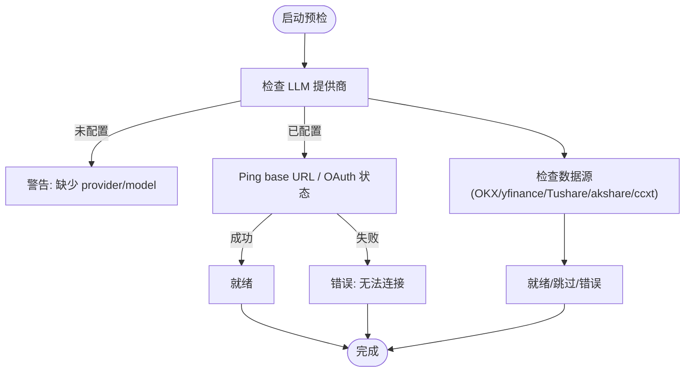
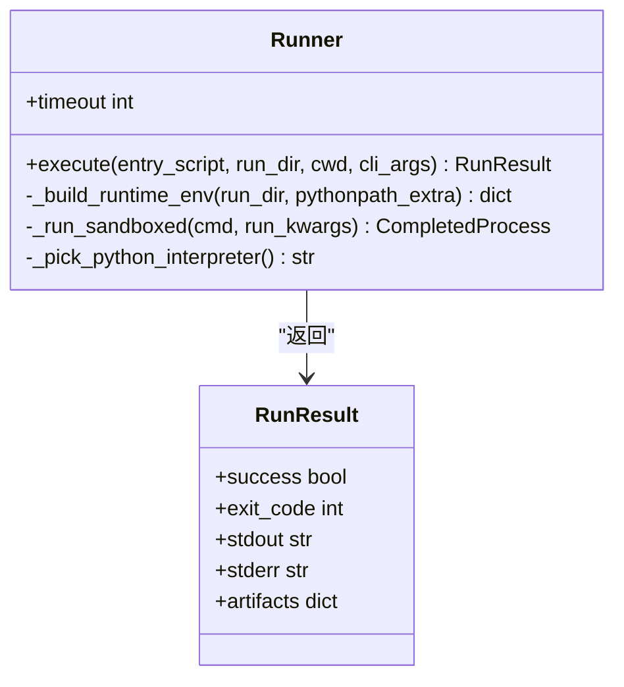
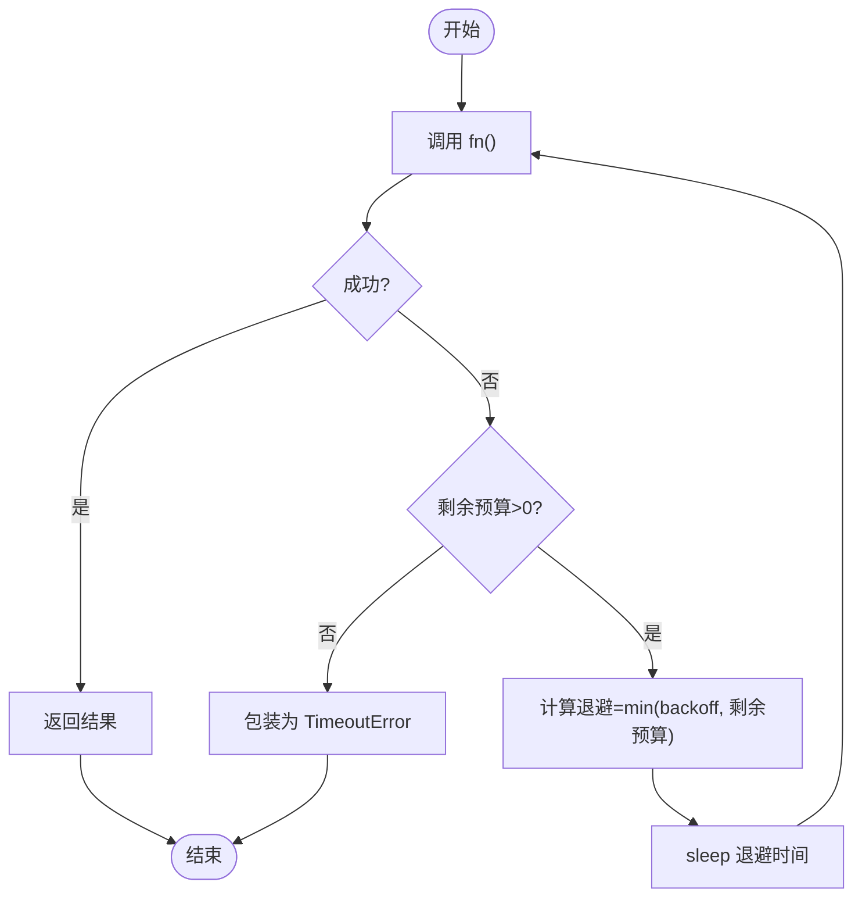
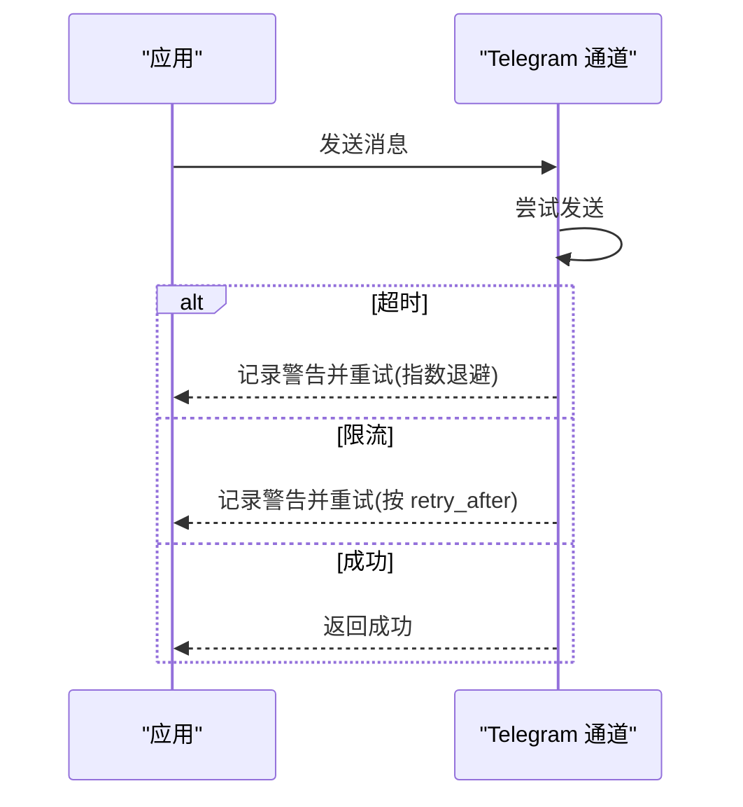
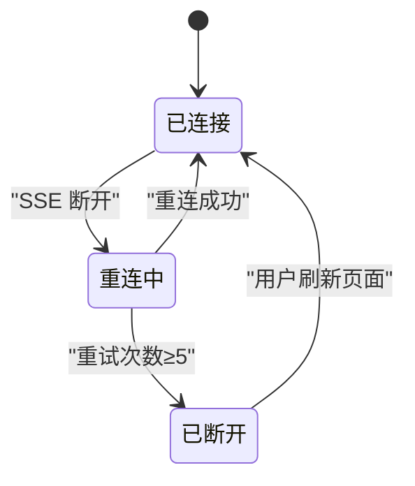
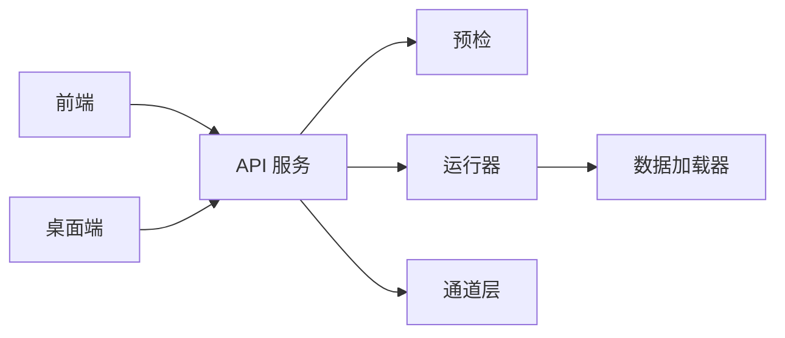

# 故障排除

<cite>
**本文引用的文件**
- [agent/src/preflight.py](file://agent/src/preflight.py)
- [agent/api_server.py](file://agent/api_server.py)
- [agent/src/config/env_schema.py](file://agent/src/config/env_schema.py)
- [agent/src/core/runner.py](file://agent/src/core/runner.py)
- [agent/backtest/loaders/base.py](file://agent/backtest/loaders/base.py)
- [agent/src/channels/telegram.py](file://agent/src/channels/telegram.py)
- [agent/src/tools/alpha_bench_tool.py](file://agent/src/tools/alpha_bench_tool.py)
- [frontend/src/components/layout/ConnectionBanner.tsx](file://frontend/src/components/layout/ConnectionBanner.tsx)
- [desktop/electron/src/backend-manager.ts](file://desktop/electron/src/backend-manager.ts)
- [agent/tests/test_okx_loader_bounded.py](file://agent/tests/test_okx_loader_bounded.py)
- [agent/tests/test_error_path_redaction.py](file://agent/tests/test_error路径脱敏.py)
</cite>

## 目录
1. [简介](#简介)
2. [项目结构](#项目结构)
3. [核心组件](#核心组件)
4. [架构总览](#架构总览)
5. [详细组件分析](#详细组件分析)
6. [依赖关系分析](#依赖关系分析)
7. [性能注意事项](#性能注意事项)
8. [故障排查指南](#故障排查指南)
9. [结论](#结论)
10. [附录](#附录)

## 简介
本故障排除文档面向 Vibe-Trading 的安装、配置、网络连接与性能问题，提供系统化的诊断方法与解决步骤。内容覆盖：
- 启动预检机制与关键依赖健康检查
- 日志采集与分析（后端、前端、SSE、通道）
- 网络重试、超时与预算控制
- 内存与资源限制（沙箱子进程）
- 调试工具与集成点（API、桌面端、数据源）
- 常见故障场景与修复建议

## 项目结构
Vibe-Trading 由后端 API 服务、Agent 运行器、数据加载器、消息通道、前端界面与桌面端组成。故障排除的关键入口包括：
- 启动预检：在 API 服务启动时执行，输出各依赖就绪状态
- 运行器：以受限环境执行回测脚本，收集日志与产物
- 数据加载器：统一的重试与预算控制，避免网络抖动影响
- 通道层：如 Telegram 的发送重试与错误格式化
- 前端连接状态：SSE 重连提示与终端断线处理
- 桌面端守护：后端进程生命周期与错误上报

**图示来源**
- [agent/api_server.py:127-143](file://agent/api_server.py#L127-L143)
- [agent/src/preflight.py:265-318](file://agent/src/preflight.py#L265-L318)
- [agent/src/core/runner.py:503-620](file://agent/src/core/runner.py#L503-L620)
- [agent/backtest/loaders/base.py:184-215](file://agent/backtest/loaders/base.py#L184-L215)
- [agent/src/channels/telegram.py:860-880](file://agent/src/channels/telegram.py#L860-L880)
- [frontend/src/components/layout/ConnectionBanner.tsx:10-43](file://frontend/src/components/layout/ConnectionBanner.tsx#L10-L43)
- [desktop/electron/src/backend-manager.ts:197-219](file://desktop/electron/src/backend-manager.ts#L197-L219)

**章节来源**
- [agent/api_server.py:127-143](file://agent/api_server.py#L127-L143)
- [agent/src/preflight.py:265-318](file://agent/src/preflight.py#L265-L318)

## 核心组件
- 启动预检：校验 LLM 提供商、OKX/yfinance/Tushare/akshare/ccxt 等依赖连通性与配置，输出彩色表格并标记关键失败项
- 运行器：隔离执行回测脚本，设置环境变量白名单、临时 HOME、地址空间与文件描述符上限，捕获 stdout/stderr 与产物
- 数据加载器重试：对瞬态异常进行有界重试，按剩余预算调整退避时间，最终包装为超时错误并保留原始异常链
- 通道层：Telegram 发送失败按指数退避重试，区分超时与限流；错误摘要便于定位
- 前端连接：SSE 重连状态提示，达到阈值后显示“已断开”并提供刷新按钮
- 桌面端守护：监听后端启动、错误、退出事件，写入日志便于排查

**章节来源**
- [agent/src/preflight.py:32-134](file://agent/src/preflight.py#L32-L134)
- [agent/src/core/runner.py:372-620](file://agent/src/core/runner.py#L372-L620)
- [agent/backtest/loaders/base.py:184-215](file://agent/backtest/loaders/base.py#L184-L215)
- [agent/src/channels/telegram.py:860-880](file://agent/src/channels/telegram.py#L860-L880)
- [frontend/src/components/layout/ConnectionBanner.tsx:10-43](file://frontend/src/components/layout/ConnectionBanner.tsx#L10-L43)
- [desktop/electron/src/backend-manager.ts:197-219](file://desktop/electron/src/backend-manager.ts#L197-L219)

## 架构总览
下图展示从 API 启动到数据获取、通道通知与前端反馈的整体流程，以及关键故障点与重试策略。

**图示来源**
- [agent/api_server.py:127-143](file://agent/api_server.py#L127-L143)
- [agent/src/preflight.py:265-318](file://agent/src/preflight.py#L265-L318)
- [agent/src/core/runner.py:503-620](file://agent/src/core/runner.py#L503-L620)
- [agent/backtest/loaders/base.py:184-215](file://agent/backtest/loaders/base.py#L184-L215)
- [agent/src/channels/telegram.py:860-880](file://agent/src/channels/telegram.py#L860-L880)
- [frontend/src/components/layout/ConnectionBanner.tsx:10-43](file://frontend/src/components/layout/ConnectionBanner.tsx#L10-L43)

## 详细组件分析

### 启动预检与关键依赖诊断
- 检查 LLM 提供商：读取 .env 与运行时配置，验证 base URL、代理、超时与重试；对 OpenAI Codex 走 OAuth 登录状态检查
- 检查 OKX/yfinance/Tushare/akshare/ccxt：分别验证包安装、令牌配置与网络可达性
- 输出彩色表格，标注关键失败项（如 LLM 不可用会阻止启动）

**图示来源**
- [agent/src/preflight.py:32-134](file://agent/src/preflight.py#L32-L134)
- [agent/src/preflight.py:137-253](file://agent/src/preflight.py#L137-L253)
- [agent/src/preflight.py:265-318](file://agent/src/preflight.py#L265-L318)

**章节来源**
- [agent/src/preflight.py:32-134](file://agent/src/preflight.py#L32-L134)
- [agent/src/preflight.py:137-253](file://agent/src/preflight.py#L137-L253)
- [agent/src/preflight.py:265-318](file://agent/src/preflight.py#L265-L318)

### 运行器与沙箱安全
- 环境变量白名单：仅传递必要的 OS/Python/代理/证书/市场数据配置，避免泄露敏感信息
- 临时 HOME：将生成的策略代码限制在临时目录，仅通过符号链接暴露必要缓存与本地数据桥配置
- 资源限制：POSIX 下通过 preexec_fn 限制虚拟地址空间与文件描述符数量，防止恶意或失控进程耗尽资源
- 日志与产物：捕获 stdout/stderr 到 run/logs，扫描 artifacts 目录收集 CSV/JSON/Markdown 报告

**图示来源**
- [agent/src/core/runner.py:372-620](file://agent/src/core/runner.py#L372-L620)

**章节来源**
- [agent/src/core/runner.py:372-620](file://agent/src/core/runner.py#L372-L620)

### 数据加载器的重试与预算控制
- 重试策略：对声明的瞬态异常进行有界重试，退避时间受剩余预算约束，避免长尾等待
- 超时包装：当重试次数耗尽或截止时间到达，抛出 TimeoutError，并保留原始异常链以便定位根因
- 测试保障：非网络错误不重试；墙钟预算强制超时；双端点回退（历史/近期）提升鲁棒性

**图示来源**
- [agent/backtest/loaders/base.py:184-215](file://agent/backtest/loaders/base.py#L184-L215)
- [agent/tests/test_okx_loader_bounded.py:85-122](file://agent/tests/test_okx_loader_bounded.py#L85-L122)

**章节来源**
- [agent/backtest/loaders/base.py:184-215](file://agent/backtest/loaders/base.py#L184-L215)
- [agent/tests/test_okx_loader_bounded.py:85-122](file://agent/tests/test_okx_loader_bounded.py#L85-L122)

### 通道层错误处理与重试（以 Telegram 为例）
- 发送失败：区分 TimedOut 与 RetryAfter（限流），按指数退避重试，记录警告日志
- 错误摘要：格式化异常与 cause，便于快速识别网络问题或业务错误
- 轮询错误：统一日志级别，降低噪音

**图示来源**
- [agent/src/channels/telegram.py:860-880](file://agent/src/channels/telegram.py#L860-L880)
- [agent/src/channels/telegram.py:1591-1620](file://agent/src/channels/telegram.py#L1591-L1620)

**章节来源**
- [agent/src/channels/telegram.py:860-880](file://agent/src/channels/telegram.py#L860-L880)
- [agent/src/channels/telegram.py:1591-1620](file://agent/src/channels/telegram.py#L1591-L1620)

### 前端连接状态与重连提示
- 重连中：显示旋转图标与“正在重连”，包含尝试次数
- 终端断线：超过阈值后显示“连接丢失”并提供刷新按钮
- 状态来源：基于 SSE 状态，避免误报初始断开或主动销毁

**图示来源**
- [frontend/src/components/layout/ConnectionBanner.tsx:10-43](file://frontend/src/components/layout/ConnectionBanner.tsx#L10-L43)

**章节来源**
- [frontend/src/components/layout/ConnectionBanner.tsx:10-43](file://frontend/src/components/layout/ConnectionBanner.tsx#L10-L43)

### 桌面端守护与后端生命周期
- 监听后端启动、错误、退出事件，写入日志
- 便于快速定位后端崩溃、端口占用、权限等问题

**章节来源**
- [desktop/electron/src/backend-manager.ts:197-219](file://desktop/electron/src/backend-manager.ts#L197-L219)

## 依赖关系分析
- API 服务在启动时调用预检，确保 LLM 与关键数据源可用
- 运行器在执行回测时依赖数据加载器的重试与预算控制，保证稳定性
- 通道层负责对外通知，具备重试与错误摘要能力
- 前端通过 SSE 感知连接状态，提供可视化提示
- 桌面端守护监控后端进程，辅助定位环境问题

**图示来源**
- [agent/api_server.py:127-143](file://agent/api_server.py#L127-L143)
- [agent/src/core/runner.py:503-620](file://agent/src/core/runner.py#L503-L620)
- [agent/backtest/loaders/base.py:184-215](file://agent/backtest/loaders/base.py#L184-L215)
- [agent/src/channels/telegram.py:860-880](file://agent/src/channels/telegram.py#L860-L880)
- [frontend/src/components/layout/ConnectionBanner.tsx:10-43](file://frontend/src/components/layout/ConnectionBanner.tsx#L10-L43)
- [desktop/electron/src/backend-manager.ts:197-219](file://desktop/electron/src/backend-manager.ts#L197-L219)

**章节来源**
- [agent/api_server.py:127-143](file://agent/api_server.py#L127-L143)
- [agent/src/core/runner.py:503-620](file://agent/src/core/runner.py#L503-L620)

## 性能注意事项
- 重试与预算：数据加载器使用有界重试与截止时间，避免长时间阻塞；合理设置 CCXT/OKX/RSSHub 等超时与预算参数
- 内存与资源：运行器在 POSIX 下限制子进程虚拟地址空间与文件描述符，防止 OOM 或 FD 耗尽；可通过环境变量调整上限
- 网络抖动：通道层对超时与限流进行指数退避重试，减少瞬时失败影响
- 前端重连：SSE 重连阈值与提示有助于快速发现网络中断

[本节为通用指导，无需特定文件引用]

## 故障排查指南

### 安装问题
- 现象：部分功能不可用（如 US/HK 股票、A 股数据、加密货币）
- 诊断：查看预检输出的“就绪/跳过/错误”状态；确认包是否安装、令牌是否配置
- 解决：
  - 安装缺失包（如 yfinance、ccxt、tushare）
  - 配置对应令牌与环境变量（参考环境变量模式）
  - 若为可选依赖，可忽略并选择其他数据源

**章节来源**
- [agent/src/preflight.py:165-253](file://agent/src/preflight.py#L165-L253)
- [agent/src/config/env_schema.py:153-198](file://agent/src/config/env_schema.py#L153-L198)

### 配置问题
- 现象：LLM 不可用、数据源认证失败、代理/证书不生效
- 诊断：预检输出 LLM 基础 URL、超时、重试、代理信息；检查 .env 与运行时配置
- 解决：
  - 设置正确的 provider、model、base URL、API Key
  - 如需禁用代理，启用相应开关并确保 httpx 可用
  - 校验证书路径与信任域

**章节来源**
- [agent/src/preflight.py:32-134](file://agent/src/preflight.py#L32-L134)
- [agent/src/config/env_schema.py:122-146](file://agent/src/config/env_schema.py#L122-L146)

### 网络连接问题
- 现象：数据拉取缓慢、频繁超时、被限流
- 诊断：查看数据加载器重试日志与错误摘要；检查通道层重试与限流提示
- 解决：
  - 调整超时与预算参数（CCXT/OKX/RSSHub 等）
  - 优化代理与证书配置
  - 对限流场景适当增加退避间隔

**章节来源**
- [agent/backtest/loaders/base.py:184-215](file://agent/backtest/loaders/base.py#L184-L215)
- [agent/src/channels/telegram.py:860-880](file://agent/src/channels/telegram.py#L860-L880)
- [agent/tests/test_okx_loader_bounded.py:85-122](file://agent/tests/test_okx_loader_bounded.py#L85-L122)

### 性能问题
- 现象：回测耗时过长、内存占用高、CPU 飙升
- 诊断：查看运行器日志与产物；检查子进程资源限制；评估数据量与指标计算复杂度
- 解决：
  - 调整 RLIMIT_AS 与 NOFILE 上限
  - 缩小数据范围或采样频率
  - 优化因子/指标计算逻辑，避免全量计算

**章节来源**
- [agent/src/core/runner.py:33-111](file://agent/src/core/runner.py#L33-L111)
- [agent/src/core/runner.py:503-620](file://agent/src/core/runner.py#L503-L620)

### 内存分析与调试
- 现象：OOM、mmap 区域过大、子进程崩溃
- 诊断：检查运行器设置的虚拟地址空间上限；查看 stderr 中的资源限制相关错误
- 解决：
  - 提高 RLIMIT_AS 上限（环境变量可调）
  - 减少并行度或批次大小
  - 清理不必要的缓存与中间结果

**章节来源**
- [agent/src/core/runner.py:33-111](file://agent/src/core/runner.py#L33-L111)

### 网络调试
- 现象：SSE 频繁重连、前端显示“连接丢失”
- 诊断：查看前端连接状态与重试次数；检查后端日志与通道层错误
- 解决：
  - 修复网络中断或防火墙规则
  - 调整重连阈值与提示策略
  - 检查代理与证书配置

**章节来源**
- [frontend/src/components/layout/ConnectionBanner.tsx:10-43](file://frontend/src/components/layout/ConnectionBanner.tsx#L10-L43)
- [desktop/electron/src/backend-manager.ts:197-219](file://desktop/electron/src/backend-manager.ts#L197-L219)

### 调试工具与日志分析
- 启动预检：快速定位 LLM 与数据源问题
- 运行器日志：stdout/stderr 与产物路径位于 runs/logs 与 artifacts
- 通道日志：Telegram 错误摘要与重试日志
- 桌面端日志：后端启动、错误、退出事件

**章节来源**
- [agent/src/preflight.py:265-318](file://agent/src/preflight.py#L265-L318)
- [agent/src/core/runner.py:503-620](file://agent/src/core/runner.py#L503-L620)
- [agent/src/channels/telegram.py:1591-1620](file://agent/src/channels/telegram.py#L1591-L1620)
- [desktop/electron/src/backend-manager.ts:197-219](file://desktop/electron/src/backend-manager.ts#L197-L219)

### 与其他组件的调试集成
- API 服务：在启动时执行预检与迁移，注册路由与安全头
- 桌面端：守护后端进程，捕获生命周期事件
- 前端：通过 SSE 获取实时状态，提供重连与刷新交互

**章节来源**
- [agent/api_server.py:127-143](file://agent/api_server.py#L127-L143)
- [desktop/electron/src/backend-manager.ts:197-219](file://desktop/electron/src/backend-manager.ts#L197-L219)
- [frontend/src/components/layout/ConnectionBanner.tsx:10-43](file://frontend/src/components/layout/ConnectionBanner.tsx#L10-L43)

### 常见故障场景与解决方案
- LLM 未配置或不可达：检查 provider/model/base URL/代理；必要时重新登录 OAuth
- 数据源不可用：安装依赖、配置令牌、检查网络与限流
- 回测超时或失败：调整超时与预算、检查数据质量与计算复杂度
- 通道发送失败：重试与限流处理；检查账号权限与网络
- 前端频繁重连：检查网络稳定性与代理配置；必要时刷新页面

**章节来源**
- [agent/src/preflight.py:32-134](file://agent/src/preflight.py#L32-L134)
- [agent/backtest/loaders/base.py:184-215](file://agent/backtest/loaders/base.py#L184-L215)
- [agent/src/channels/telegram.py:860-880](file://agent/src/channels/telegram.py#L860-L880)
- [frontend/src/components/layout/ConnectionBanner.tsx:10-43](file://frontend/src/components/layout/ConnectionBanner.tsx#L10-L43)

## 结论
Vibe-Trading 提供了完善的启动预检、沙箱化执行、有界重试与预算控制、通道层错误处理与前端连接状态提示。通过这些机制，大多数安装、配置、网络与性能问题可快速定位与解决。建议结合预检输出、运行器日志、通道日志与桌面端守护日志进行综合诊断，并根据实际场景调整超时、预算与资源限制参数。

## 附录
- 环境变量参考：集中定义于环境变量模式模块，涵盖 LLM、数据源、代理、证书、最小间隔等
- 调试示例：
  - 数据加载器重试与预算：测试覆盖非网络错误不重试、墙钟预算超时、双端点回退
  - 错误路径脱敏：确保事件载荷不泄露绝对路径，保留相对尾部便于定位

**章节来源**
- [agent/src/config/env_schema.py:1-200](file://agent/src/config/env_schema.py#L1-L200)
- [agent/tests/test_okx_loader_bounded.py:85-122](file://agent/tests/test_okx_loader_bounded.py#L85-L122)
- [agent/tests/test_error路径脱敏.py:81-104](file://agent/tests/test_error路径脱敏.py#L81-L104)