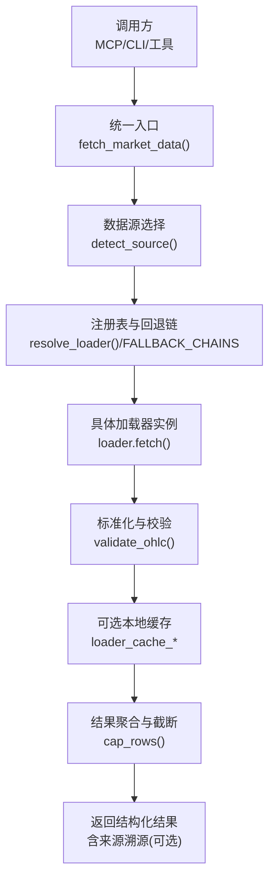
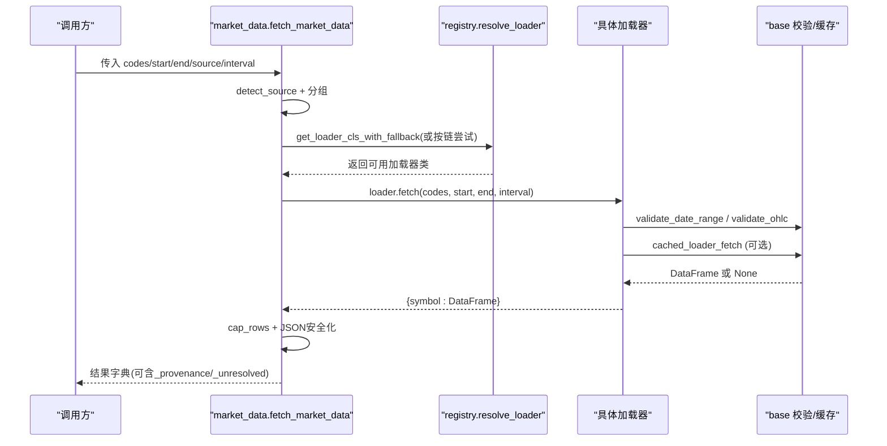
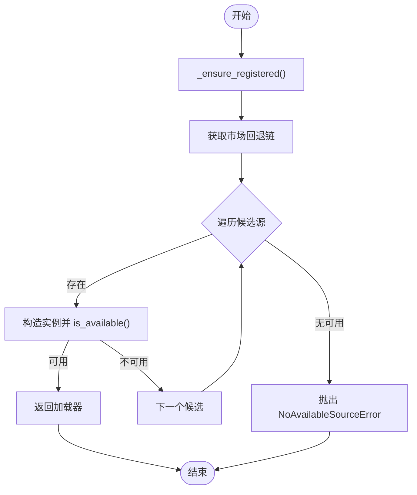
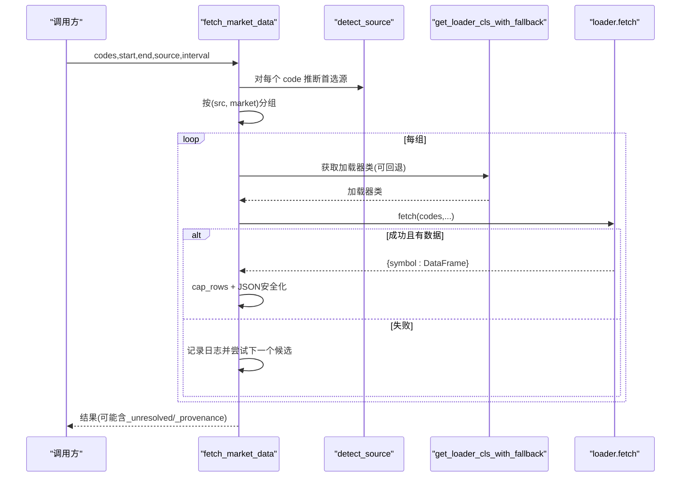
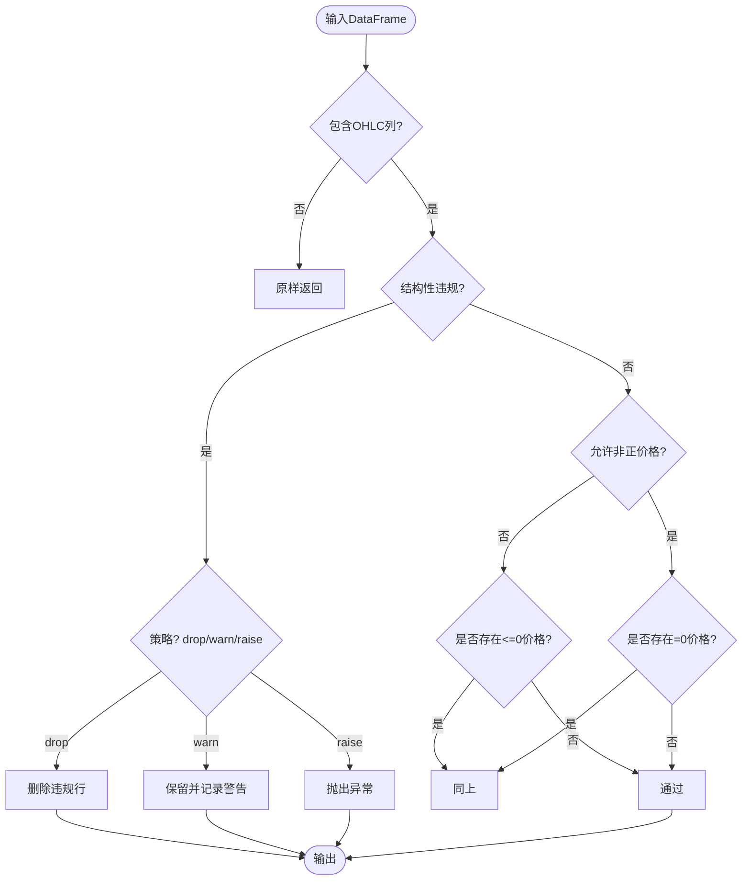
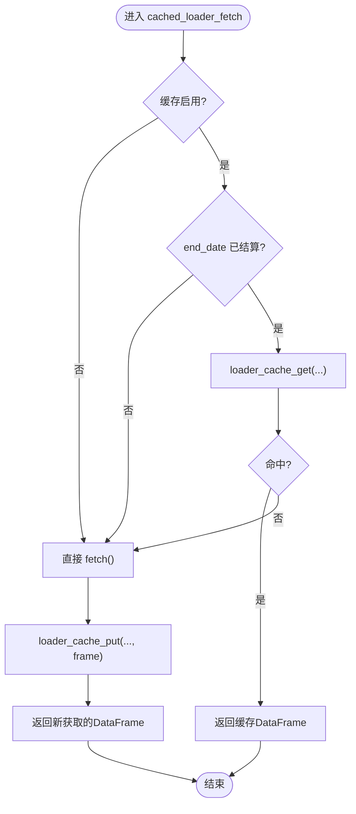
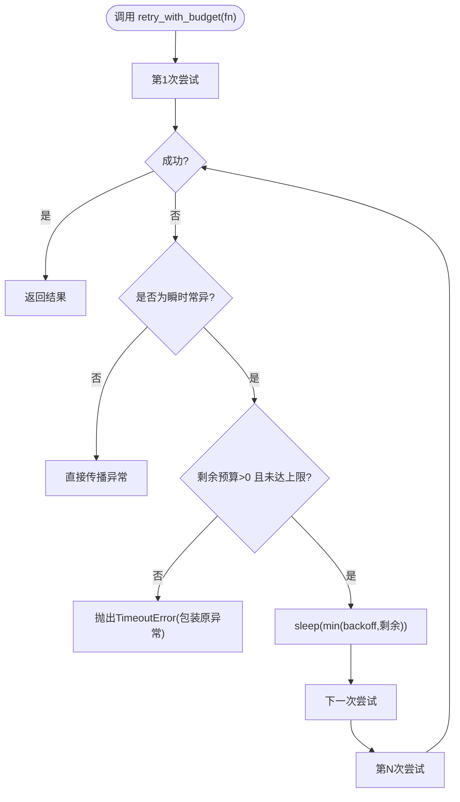
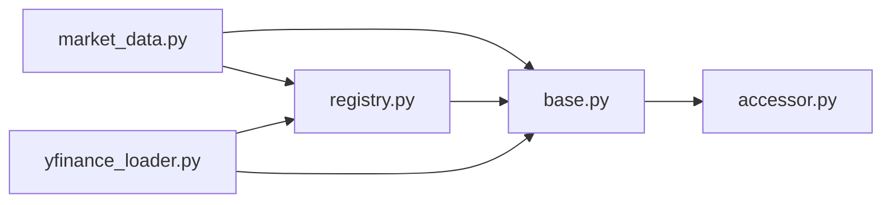

# 数据处理管道

<cite>
**本文引用的文件**
- [base.py](file://agent/backtest/loaders/base.py)
- [registry.py](file://agent/backtest/loaders/registry.py)
- [market_data.py](file://agent/src/market_data.py)
- [yfinance_loader.py](file://agent/backtest/loaders/yfinance_loader.py)
- [accessor.py](file://agent/src/config/accessor.py)
- [schema.py](file://agent/src/config/schema.py)
</cite>

## 目录
1. [简介](#简介)
2. [项目结构](#项目结构)
3. [核心组件](#核心组件)
4. [架构总览](#架构总览)
5. [详细组件分析](#详细组件分析)
6. [依赖关系分析](#依赖关系分析)
7. [性能考量](#性能考量)
8. [故障排除指南](#故障排除指南)
9. [结论](#结论)
10. [附录](#附录)

## 简介
本文件为 Vibe-Trading 数据处理管道的全面技术文档，覆盖数据获取、转换、标准化与缓存的完整流程；解释数据源注册机制、适配器模式与批量处理策略；记录配置选项、错误重试机制与性能监控；并提供数据流转图、组件交互图、扩展开发指南、自定义数据源集成方法、性能调优建议以及调试与排障指南。

## 项目结构
数据处理管道位于 agent/backtest/loaders（数据加载器）与 agent/src/market_data.py（统一市场数据入口），并通过 src/config 提供配置访问能力。关键组织方式：
- 数据加载器协议与通用工具：base.py
- 数据源注册与回退链：registry.py
- 统一市场数据接口与自动路由：market_data.py
- 具体数据源实现示例：yfinance_loader.py
- 配置访问与布尔解析：accessor.py、schema.py

图表来源
- [market_data.py:97-223](file://agent/src/market_data.py#L97-L223)
- [registry.py:136-193](file://agent/backtest/loaders/registry.py#L136-L193)
- [base.py:343-439](file://agent/backtest/loaders/base.py#L343-L439)

章节来源
- [market_data.py:1-229](file://agent/src/market_data.py#L1-L229)
- [registry.py:1-249](file://agent/backtest/loaders/registry.py#L1-L249)
- [base.py:1-645](file://agent/backtest/loaders/base.py#L1-L645)

## 核心组件
- 数据加载器协议与通用工具（base.py）
  - DataLoaderProtocol：定义所有加载器必须实现的接口（name、markets、requires_auth、is_available、fetch）。
  - 数据校验：validate_date_range、validate_ohlc 确保 OHLC 不变量与正价格约束。
  - 重试与预算：retry_with_budget、check_budget 提供带超时预算的重试策略，仅对声明的瞬时异常重试。
  - 本地缓存：loader_cache_get/put、cached_loader_fetch、make_loader_cache_key 等，基于 Parquet + DuckDB 的内容寻址缓存，支持索引类型恢复与原子写入。
- 数据源注册与回退链（registry.py）
  - 全局注册表 LOADER_REGISTRY 与 VALID_SOURCES。
  - 按市场的回退链 FALLBACK_CHAINS，按“抗封禁优先、数据质量次之”的顺序排列。
  - resolve_loader/get_loader_cls_with_fallback：自动选择可用加载器，并对 local/qveris 禁止静默网络降级。
- 统一市场数据入口（market_data.py）
  - detect_source：根据符号后缀/格式推断首选数据源。
  - fetch_market_data：分组请求、构建尝试列表、逐源调用 loader.fetch，捕获异常并继续下一个候选；支持 max_fallback_attempts 限制；可输出 _provenance 溯源信息；对结果进行 cap_rows 截断以控制负载。
- 示例加载器（yfinance_loader.py）
  - 将项目符号映射到 yfinance 符号，时间粒度映射，下载历史数据，提取单标的 DataFrame，标准化为 OHLCV，并接入 base 提供的缓存与校验。

章节来源
- [base.py:27-119](file://agent/backtest/loaders/base.py#L27-L119)
- [base.py:127-236](file://agent/backtest/loaders/base.py#L127-L236)
- [base.py:243-439](file://agent/backtest/loaders/base.py#L243-L439)
- [registry.py:23-155](file://agent/backtest/loaders/registry.py#L23-L155)
- [registry.py:158-249](file://agent/backtest/loaders/registry.py#L158-L249)
- [market_data.py:16-64](file://agent/src/market_data.py#L16-L64)
- [market_data.py:97-223](file://agent/src/market_data.py#L97-L223)
- [yfinance_loader.py:22-95](file://agent/backtest/loaders/yfinance_loader.py#L22-L95)
- [yfinance_loader.py:172-200](file://agent/backtest/loaders/yfinance_loader.py#L172-L200)

## 架构总览
下图展示从调用方到数据源的端到端流程，包括自动路由、回退链、标准化、缓存与结果聚合。

图表来源
- [market_data.py:97-223](file://agent/src/market_data.py#L97-L223)
- [registry.py:158-249](file://agent/backtest/loaders/registry.py#L158-L249)
- [base.py:343-439](file://agent/backtest/loaders/base.py#L343-L439)

## 详细组件分析

### 数据源注册与回退链（registry.py）
- 注册机制：通过 @register 装饰器在模块导入时向 LOADER_REGISTRY 登记加载器类名。_ensure_registered 懒加载所有已知加载器模块，保证 resolve 时注册表非空。
- 回退链：FALLBACK_CHAINS 为每个市场维护有序候选源，考虑 IP 封禁风险与数据质量。例如 a_share 优先腾讯/同花顺等轻量公开源，再回退至需密钥的 REST。
- 解析逻辑：
  - resolve_loader(market)：遍历市场回退链，构造加载器实例并检查 is_available，首个可用即返回。
  - get_loader_cls_with_fallback(source)：先尝试指定 source，若不可用且非 local/qveris，则按 same-market 回退链查找；否则抛出 NoAvailableSourceError。

图表来源
- [registry.py:71-115](file://agent/backtest/loaders/registry.py#L71-L115)
- [registry.py:136-193](file://agent/backtest/loaders/registry.py#L136-L193)

章节来源
- [registry.py:1-249](file://agent/backtest/loaders/registry.py#L1-L249)

### 统一市场数据入口（market_data.py）
- 自动路由：detect_source 根据符号后缀/格式匹配首选源（如 .HK/.US/.TO/.KS 等），未匹配默认 tushare。
- 分组与尝试：按 (source, market) 分组代码，为每组构建 attempts 列表（优先 requested source，再拼接其所在市场链去重），限制最大尝试次数。
- 容错与回退：loader.fetch 抛异常时记录日志并继续下一个候选；成功且有数据则跳出循环。
- 结果处理：将 DataFrame 转为 records 并进行 JSON 安全化；cap_rows 采样截断以控制响应大小；可选 include_provenance 输出来源溯源。
- 未解决标记：无法解析的代码放入 _unresolved。

图表来源
- [market_data.py:16-64](file://agent/src/market_data.py#L16-L64)
- [market_data.py:97-223](file://agent/src/market_data.py#L97-L223)
- [registry.py:158-249](file://agent/backtest/loaders/registry.py#L158-L249)

章节来源
- [market_data.py:1-229](file://agent/src/market_data.py#L1-L229)

### 数据标准化与校验（base.py）
- 日期范围校验：validate_date_range 确保 start <= end 且格式正确。
- OHLC 不变量校验：validate_ohlc 强制 high>=low 且高低价包围开收价；可配置是否允许非正价格（某些市场允许负价但零价无效）。
- 策略：drop/warn/raise，默认 drop 并记录告警。

图表来源
- [base.py:31-119](file://agent/backtest/loaders/base.py#L31-L119)

章节来源
- [base.py:31-119](file://agent/backtest/loaders/base.py#L31-L119)

### 本地缓存机制（base.py）
- 启用开关：loader_cache_enabled 读取配置决定是否启用本地缓存。
- 键生成：make_loader_cache_key 基于 source/symbol/timeframe/date range/fields 生成内容寻址键。
- 读写路径：loader_cache_path 定位 parquet 文件；loader_cache_get/loader_cache_put 负责读/写；cached_loader_fetch 封装常见“命中则返回，否则取数并缓存”的模式。
- 持久化细节：使用 DuckDB 读写 Parquet；元数据保存索引列名、原始索引名称与 dtype 以便恢复；原子写入通过临时文件 + os.replace 完成；读/写失败均不中断主流程。
- 范围有效性：loader_cache_range_is_final 仅对已结算的 end_date 缓存，避免缓存进行中 K 线。

图表来源
- [base.py:243-439](file://agent/backtest/loaders/base.py#L243-L439)
- [base.py:475-595](file://agent/backtest/loaders/base.py#L475-L595)

章节来源
- [base.py:243-595](file://agent/backtest/loaders/base.py#L243-L595)

### 重试与预算（base.py）
- retry_with_budget：对声明的 transient 异常进行有限重试，每次重试睡眠不超过剩余预算；达到最大重试或超过截止时间抛出 TimeoutError，并保留原始异常作为 __cause__。
- check_budget：在分页拉取等长耗时操作中周期性检查是否超预算，快速失败。

图表来源
- [base.py:127-236](file://agent/backtest/loaders/base.py#L127-L236)

章节来源
- [base.py:127-236](file://agent/backtest/loaders/base.py#L127-L236)

### 示例加载器：yfinance（yfinance_loader.py）
- 符号映射：将 .US/.HK/-USDT 等后缀转换为 yfinance 兼容符号。
- 时间粒度映射：将 1D/1H/4H/1W/1M/分钟级映射到 yfinance 区间。
- 下载与清洗：yf.download 获取多标的数据，提取单标的切片，扁平化列名，重命名为 open/high/low/close/volume，数值化并设置 DatetimeIndex。
- 标准化与缓存：结合 base 的 validate_ohlc 与 cached_loader_fetch，确保数据质量与可重复性。

章节来源
- [yfinance_loader.py:22-95](file://agent/backtest/loaders/yfinance_loader.py#L22-L95)
- [yfinance_loader.py:172-200](file://agent/backtest/loaders/yfinance_loader.py#L172-L200)

## 依赖关系分析
- market_data.py 依赖 registry.py 的回退链与解析逻辑，依赖 base.py 的校验与缓存。
- registry.py 依赖 base.py 的 NoAvailableSourceError。
- 各加载器（如 yfinance_loader.py）依赖 base.py 的缓存与校验工具，并通过 @register 自注册。
- 配置层 accessor.py 提供 EnvConfig 单例与布尔解析，被 base.py 的缓存开关等模块间接使用。

图表来源
- [market_data.py:97-223](file://agent/src/market_data.py#L97-L223)
- [registry.py:158-249](file://agent/backtest/loaders/registry.py#L158-L249)
- [base.py:243-439](file://agent/backtest/loaders/base.py#L243-L439)
- [yfinance_loader.py:14-21](file://agent/backtest/loaders/yfinance_loader.py#L14-L21)
- [accessor.py:52-76](file://agent/src/config/accessor.py#L52-L76)

章节来源
- [market_data.py:1-229](file://agent/src/market_data.py#L1-L229)
- [registry.py:1-249](file://agent/backtest/loaders/registry.py#L1-L249)
- [base.py:1-645](file://agent/backtest/loaders/base.py#L1-L645)
- [yfinance_loader.py:1-200](file://agent/backtest/loaders/yfinance_loader.py#L1-L200)
- [accessor.py:1-149](file://agent/src/config/accessor.py#L1-L149)

## 性能考量
- 回退链顺序优化：优先低速率限制与抗封禁的公开源，降低整体失败率与延迟。
- 批量处理：按 (source, market) 分组请求，减少重复初始化与连接开销。
- 本地缓存：对已结算区间的请求使用内容寻址 Parquet 缓存，显著降低重复拉取成本；读写失败不影响主流程。
- 结果截断：cap_rows 采用等步长采样并固定最后一根K线，控制响应体积，避免下游过载。
- 重试预算：retry_with_budget 限制总重试时间与次数，防止慢速 API 拖垮整体吞吐。
- 指标与溯源：include_provenance=True 可追踪实际使用的数据源与是否发生回退，便于性能分析与问题定位。

[本节为通用指导，无需特定文件引用]

## 故障排除指南
- 无可用数据源
  - 现象：抛出 NoAvailableSourceError。
  - 排查：确认目标市场回退链中至少有一个加载器可用；检查网络与凭据；对于 local/qveris 显式请求，不可静默降级到网络源。
  - 参考位置：[registry.py:158-193](file://agent/backtest/loaders/registry.py#L158-L193)、[registry.py:196-249](file://agent/backtest/loaders/registry.py#L196-L249)
- 数据校验失败
  - 现象：validate_ohlc 触发 drop/warn/raise。
  - 排查：检查数据源返回的 OHLC 是否满足不变量；必要时调整 allow_nonpositive_prices 或上游数据源。
  - 参考位置：[base.py:50-119](file://agent/backtest/loaders/base.py#L50-L119)
- 缓存未命中或写入失败
  - 现象：仍走网络拉取；或写入失败但不影响主流程。
  - 排查：确认缓存已启用且 end_date 已结算；检查磁盘权限与 DuckDB 可用性；查看日志中的缓存读写警告。
  - 参考位置：[base.py:243-439](file://agent/backtest/loaders/base.py#L243-L439)、[base.py:475-595](file://agent/backtest/loaders/base.py#L475-L595)
- 重试耗尽
  - 现象：TimeoutError，提示超出预算或达到最大重试。
  - 排查：检查 transient 异常类别、backoff 配置与 deadline；适当增大预算或降低并发。
  - 参考位置：[base.py:127-236](file://agent/backtest/loaders/base.py#L127-L236)
- 结果过大
  - 现象：响应被截断，包含 returned/truncated/policy/hint。
  - 排查：缩小时间范围、提高间隔或调整 max_rows；或使用 include_provenance 辅助定位。
  - 参考位置：[market_data.py:66-84](file://agent/src/market_data.py#L66-L84)、[market_data.py:198-223](file://agent/src/market_data.py#L198-L223)

章节来源
- [registry.py:158-249](file://agent/backtest/loaders/registry.py#L158-L249)
- [base.py:50-119](file://agent/backtest/loaders/base.py#L50-L119)
- [base.py:243-439](file://agent/backtest/loaders/base.py#L243-L439)
- [base.py:127-236](file://agent/backtest/loaders/base.py#L127-L236)
- [market_data.py:66-84](file://agent/src/market_data.py#L66-L84)
- [market_data.py:198-223](file://agent/src/market_data.py#L198-L223)

## 结论
Vibe-Trading 的数据处理管道通过统一的入口、灵活的回退链、严格的标准化与健壮的重试/缓存机制，实现了跨市场、多数据源的高可用数据供给。借助内容寻址缓存与批量分组策略，系统在稳定性与性能之间取得良好平衡；通过溯源信息与截断策略，便于运维观测与容量规划。新增数据源只需遵循 DataLoaderProtocol 并自注册，即可无缝融入现有生态。

[本节为总结性内容，无需特定文件引用]

## 附录

### 管道配置选项与环境变量
- 数据缓存开关与根目录
  - 开关：通过配置层读取 data.vibe_trading_data_cache 布尔值决定启用与否。
  - 根目录：vibe_trading_data_cache_root 为非空字符串时使用，否则默认 ~/.vibe-trading/cache/loaders。
  - 参考位置：[base.py:243-281](file://agent/backtest/loaders/base.py#L243-L281)、[accessor.py:52-76](file://agent/src/config/accessor.py#L52-L76)
- 统一入口参数
  - codes/start_date/end_date/source/interval/max_rows/include_provenance 等，用于控制数据来源、时间范围、粒度、结果大小与溯源输出。
  - 参考位置：[market_data.py:97-117](file://agent/src/market_data.py#L97-L117)

章节来源
- [base.py:243-281](file://agent/backtest/loaders/base.py#L243-L281)
- [accessor.py:52-76](file://agent/src/config/accessor.py#L52-L76)
- [market_data.py:97-117](file://agent/src/market_data.py#L97-L117)

### 扩展开发指南：自定义数据源集成
- 步骤
  1) 实现 DataLoaderProtocol：提供 name/markets/requires_auth/is_available/fetch。
  2) 使用 @register 装饰器自注册到全局注册表。
  3) 在 fetch 中调用 base 的 validate_date_range/validate_ohlc 与 cached_loader_fetch，确保一致性与可缓存性。
  4) 如需加入某市场回退链，请更新 FALLBACK_CHAINS 对应条目（谨慎评估 IP 封禁风险与数据质量）。
- 注意事项
  - 对 local/qveris 等敏感源，不要静默降级到网络源。
  - 合理设置 markets，使 auto-resolver 能正确路由。
  - 保持字段命名与 OHLC 规范一致，避免下游序列化失败。
- 参考位置：[registry.py:62-68](file://agent/backtest/loaders/registry.py#L62-L68)、[registry.py:136-155](file://agent/backtest/loaders/registry.py#L136-L155)、[base.py:618-645](file://agent/backtest/loaders/base.py#L618-L645)

章节来源
- [registry.py:62-68](file://agent/backtest/loaders/registry.py#L62-L68)
- [registry.py:136-155](file://agent/backtest/loaders/registry.py#L136-L155)
- [base.py:618-645](file://agent/backtest/loaders/base.py#L618-L645)

### 性能调优方法
- 调整回退链顺序：将更稳定、低延迟的源置于前列。
- 合理使用缓存：确保 end_date 已结算，开启本地缓存以减少重复请求。
- 控制批量规模：通过 max_rows 与 interval 控制单次请求体量。
- 重试预算：为不稳定 API 设置合理的 backoff 与 deadline，避免雪崩。
- 观测与诊断：开启 include_provenance 观察实际使用源与回退情况；关注日志中的缓存与校验告警。

[本节为通用指导，无需特定文件引用]

### 调试工具与技巧
- 启用溯源：fetch_market_data(include_provenance=True) 获取 _provenance，查看实际使用源与是否回退。
- 观察未解析标的：结果中的 _unresolved 列出未能解析的代码，便于核对符号格式与路由规则。
- 缓存验证：检查 ~/.vibe-trading/cache/loaders 下是否存在对应 key.parquet 与元数据；确认 DuckDB 可用。
- 日志级别：提升日志级别以捕获缓存读写失败、校验警告与重试过程。

章节来源
- [market_data.py:198-223](file://agent/src/market_data.py#L198-L223)
- [base.py:475-595](file://agent/backtest/loaders/base.py#L475-L595)