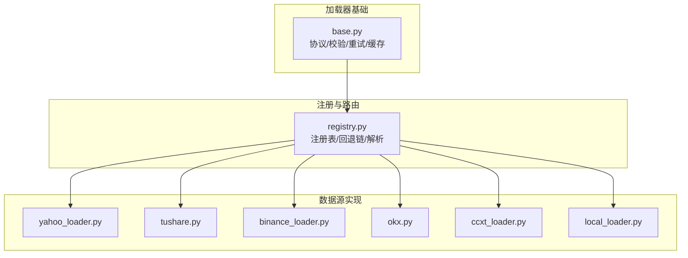
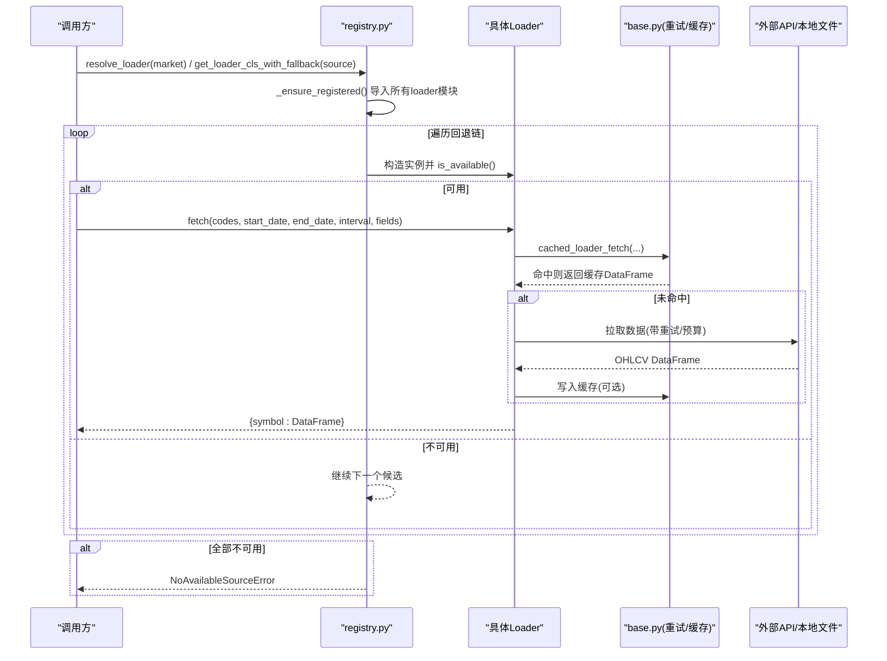
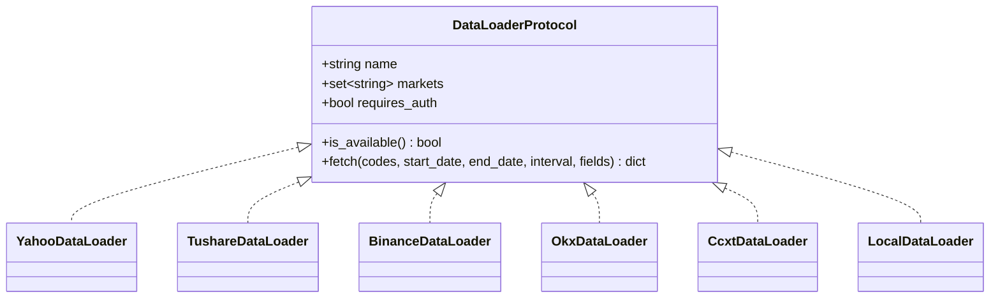
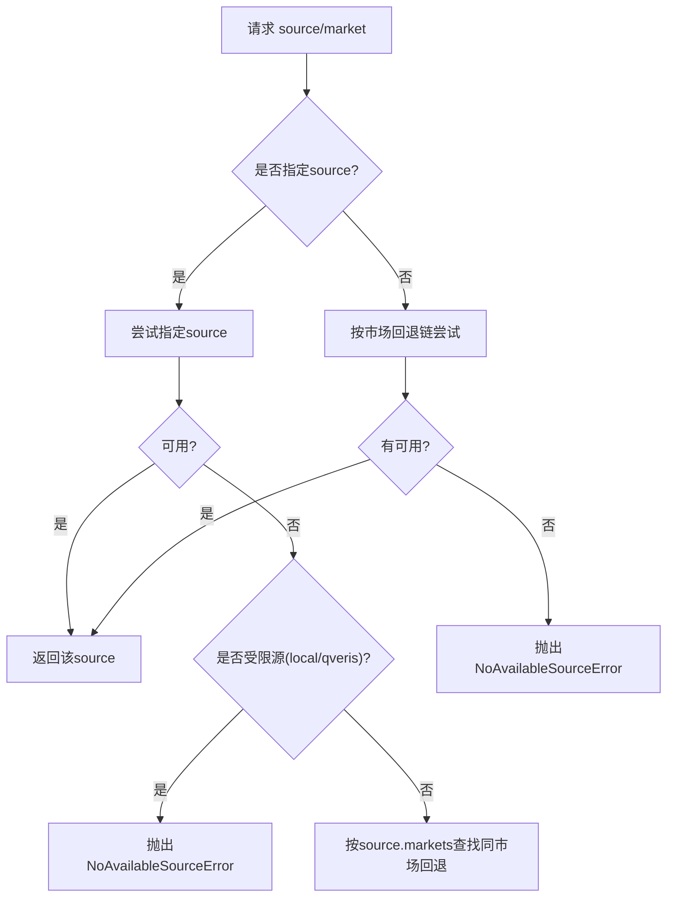
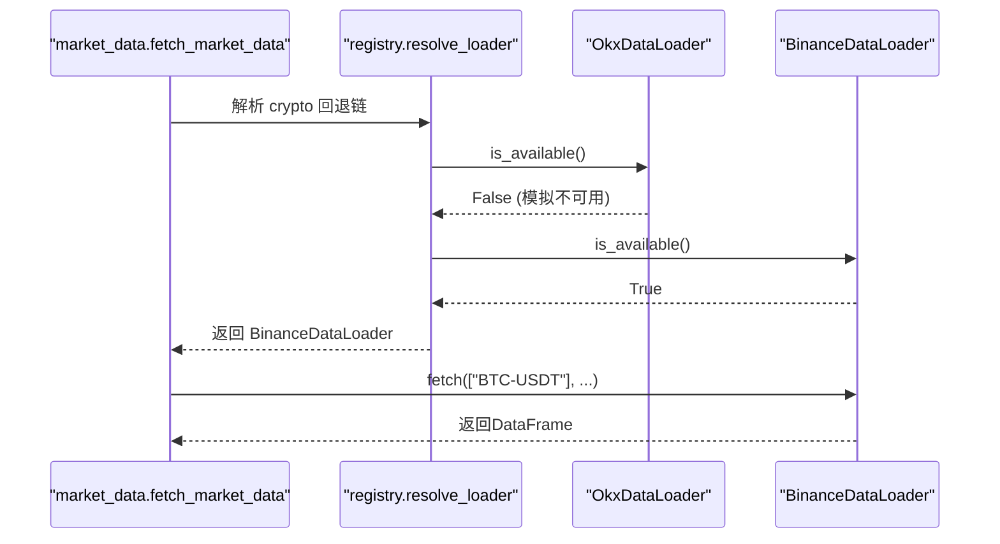
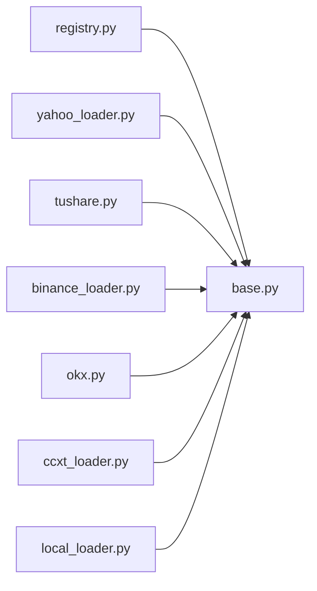

# 数据源架构

<cite>
**本文引用的文件**
- [base.py](file://agent/backtest/loaders/base.py)
- [registry.py](file://agent/backtest/loaders/registry.py)
- [yahoo_loader.py](file://agent/backtest/loaders/yahoo_loader.py)
- [binance_loader.py](file://agent/backtest/loaders/binance_loader.py)
- [tushare.py](file://agent/backtest/loaders/tushare.py)
- [local_loader.py](file://agent/backtest/loaders/local_loader.py)
- [ccxt_loader.py](file://agent/backtest/loaders/ccxt_loader.py)
- [okx.py](file://agent/backtest/loaders/okx.py)
- [test_binance_fallback.py](file://agent/tests/test_binance_fallback.py)
</cite>

## 目录
1. [简介](#简介)
2. [项目结构](#项目结构)
3. [核心组件](#核心组件)
4. [架构总览](#架构总览)
5. [详细组件分析](#详细组件分析)
6. [依赖关系分析](#依赖关系分析)
7. [性能考量](#性能考量)
8. [故障排查指南](#故障排查指南)
9. [结论](#结论)
10. [附录](#附录)

## 简介
本文件系统性梳理 Vibe-Trading 的数据源架构，围绕 DataLoaderProtocol 接口设计、数据源注册机制与适配器模式展开，解释可用性检查、认证管理、市场分类策略；记录内置数据源（Yahoo Finance、Tushare、Binance、OKX、CCXT、Local 等）及其特性对比；提供自定义数据源开发指南与最佳实践；并说明路由策略、负载均衡与故障转移机制。

## 项目结构
数据源子系统位于 backtest/loaders 目录，采用“协议 + 注册表 + 多实现”的分层组织：
- base.py：定义 DataLoaderProtocol 协议、通用校验、重试/预算工具、本地缓存等基础设施。
- registry.py：全局注册表、市场级回退链、自动发现与解析。
- 各 loader 模块：具体数据源实现（Yahoo、Tushare、Binance、OKX、CCXT、Local 等），通过 @register 装饰器自注册。

图表来源
- [base.py:618-645](file://agent/backtest/loaders/base.py#L618-L645)
- [registry.py:23-155](file://agent/backtest/loaders/registry.py#L23-L155)

章节来源
- [base.py:1-645](file://agent/backtest/loaders/base.py#L1-L645)
- [registry.py:1-249](file://agent/backtest/loaders/registry.py#L1-L249)

## 核心组件
- DataLoaderProtocol：统一接口，要求 name、markets、requires_auth 以及 is_available()、fetch(...)。
- 注册表 LOADER_REGISTRY：以 name -> Loader 类映射存储所有已注册数据源。
- 市场级回退链 FALLBACK_CHAINS：按市场类型（如 a_share、us_equity、crypto 等）定义优先级顺序。
- 解析器 resolve_loader/get_loader_cls_with_fallback：按市场或指定 source 选择可用数据源，必要时触发同市场回退。
- 通用能力：日期范围校验、OHLC 不变量校验、带预算的重试与超时控制、可选本地 Parquet 缓存。

章节来源
- [base.py:27-119](file://agent/backtest/loaders/base.py#L27-L119)
- [base.py:163-236](file://agent/backtest/loaders/base.py#L163-L236)
- [base.py:243-439](file://agent/backtest/loaders/base.py#L243-L439)
- [registry.py:23-155](file://agent/backtest/loaders/registry.py#L23-L155)
- [registry.py:158-249](file://agent/backtest/loaders/registry.py#L158-L249)

## 架构总览
下图展示从调用方到数据源的完整流程：注册表懒加载导入各 loader 模块，按市场回退链尝试 is_available()，命中后执行 fetch()，期间使用缓存与重试/预算工具保障稳定性。

图表来源
- [registry.py:71-115](file://agent/backtest/loaders/registry.py#L71-L115)
- [registry.py:158-193](file://agent/backtest/loaders/registry.py#L158-L193)
- [base.py:401-439](file://agent/backtest/loaders/base.py#L401-L439)
- [base.py:184-236](file://agent/backtest/loaders/base.py#L184-L236)

## 详细组件分析

### DataLoaderProtocol 与适配器模式
- 协议约束：name/markets/requires_auth + is_available()/fetch(...)，确保所有数据源对外一致。
- 适配器模式：每个 loader 将不同后端（交易所 REST、公共 HTTP、本地文件、数据库查询）适配为统一 fetch 契约，便于注册表与回退链透明调度。
- 典型实现：
  - Yahoo：直接 HTTP 获取图表数据，无鉴权，覆盖美股/港股/加股等。
  - Tushare：A 股/港股/期货/基金，需 Token，支持日/分钟线及基本面字段合并。
  - Binance：基于 CCXT 的专用通道，公开行情，无密钥。
  - OKX：官方 V5 公开接口，支持历史 K 线，具备可用性探测。
  - CCXT：统一接入 100+ 交易所，支持现货与永续合约（含资金费率、维护保证金层级）。
  - Local：读取 CSV/Parquet/DuckDB，支持列名映射、时间重采样与区间裁剪。

图表来源
- [base.py:618-645](file://agent/backtest/loaders/base.py#L618-L645)
- [yahoo_loader.py:173-271](file://agent/backtest/loaders/yahoo_loader.py#L173-L271)
- [tushare.py:116-383](file://agent/backtest/loaders/tushare.py#L116-L383)
- [binance_loader.py:23-45](file://agent/backtest/loaders/binance_loader.py#L23-L45)
- [okx.py:101-373](file://agent/backtest/loaders/okx.py#L101-L373)
- [ccxt_loader.py:184-502](file://agent/backtest/loaders/ccxt_loader.py#L184-L502)
- [local_loader.py:219-354](file://agent/backtest/loaders/local_loader.py#L219-L354)

章节来源
- [base.py:618-645](file://agent/backtest/loaders/base.py#L618-L645)
- [yahoo_loader.py:1-271](file://agent/backtest/loaders/yahoo_loader.py#L1-L271)
- [tushare.py:1-383](file://agent/backtest/loaders/tushare.py#L1-L383)
- [binance_loader.py:1-45](file://agent/backtest/loaders/binance_loader.py#L1-L45)
- [okx.py:1-373](file://agent/backtest/loaders/okx.py#L1-L373)
- [ccxt_loader.py:1-502](file://agent/backtest/loaders/ccxt_loader.py#L1-L502)
- [local_loader.py:1-354](file://agent/backtest/loaders/local_loader.py#L1-L354)

### 数据源注册机制与路由策略
- 自注册：各 loader 通过 @register 装饰器在模块首次导入时登记至 LOADER_REGISTRY。
- 懒加载：_ensure_registered() 按需导入所有已知 loader 模块，避免无关依赖影响启动。
- 路由：
  - resolve_loader(market)：按市场回退链依次尝试 is_available()，首个可用即返回。
  - get_loader_cls_with_fallback(source)：优先返回指定 source；若不可用且非受限源（local/qveris），则按该 source.markets 寻找同市场回退。
- 受限源保护：local/qveris 明确禁止静默降级到网络源，避免掩盖配置问题。

图表来源
- [registry.py:62-115](file://agent/backtest/loaders/registry.py#L62-L115)
- [registry.py:158-249](file://agent/backtest/loaders/registry.py#L158-L249)

章节来源
- [registry.py:62-115](file://agent/backtest/loaders/registry.py#L62-L115)
- [registry.py:158-249](file://agent/backtest/loaders/registry.py#L158-L249)

### 可用性检查与认证管理
- is_available() 约定：
  - Yahoo：始终可用（公共 HTTP）。
  - Tushare：检测 Token 是否有效配置。
  - OKX：发起短超时探测请求验证服务状态。
  - CCXT：检测 ccxt 是否可导入。
  - Local：检查配置文件是否存在且包含 sources。
- 认证：
  - requires_auth=True 表示需要凭据（如 Tushare、AlphaVantage、Finnhub 等）。
  - 配置读取集中在环境配置访问器中，loader 仅在 is_available()/__init__ 时读取。

章节来源
- [yahoo_loader.py:173-189](file://agent/backtest/loaders/yahoo_loader.py#L173-L189)
- [tushare.py:124-138](file://agent/backtest/loaders/tushare.py#L124-L138)
- [okx.py:101-129](file://agent/backtest/loaders/okx.py#L101-L129)
- [ccxt_loader.py:184-201](file://agent/backtest/loaders/ccxt_loader.py#L184-L201)
- [local_loader.py:219-238](file://agent/backtest/loaders/local_loader.py#L219-L238)

### 市场分类与回退链
- 市场键：a_share、us_equity、hk_equity、india_equity、kr_equity、ca_equity、crypto、futures、fund、macro、forex。
- 回退链设计原则：
  - 先轻后重：优先无 IP 封禁风险、限流友好的公开端点。
  - 再按数据质量排序：关键 REST（需 Key）置于较后位置。
  - 特殊保护：local/qveris 不静默降级。
- 示例：
  - crypto：okx → binance → ccxt → yfinance → local
  - us_equity：yahoo → stooq → sina → eastmoney → yfinance → tiingo → fmp → finnhub → alphavantage → longbridge → akshare → local

章节来源
- [registry.py:131-155](file://agent/backtest/loaders/registry.py#L131-L155)

### 内置数据源特性对比
- Yahoo Finance：免费、无需鉴权，覆盖美股/港股/加股等，适合广泛权益类标的。
- Tushare：A 股/港股/期货/基金，需 Token，支持日/分钟线与基本面字段合并，注意配额限制与复权处理。
- Binance：基于 CCXT 的专用通道，公开行情，无密钥，适合加密货币现货。
- OKX：官方 V5 公开接口，支持历史 K 线，具备可用性探测与代理支持。
- CCXT：统一接入 100+ 交易所，支持现货与永续合约（资金费率、维护保证金层级），具备强化的重试/预算控制。
- Local：读取用户本地 CSV/Parquet/DuckDB，支持列名映射、时间重采样与区间裁剪，适合离线/私有数据。

章节来源
- [yahoo_loader.py:1-271](file://agent/backtest/loaders/yahoo_loader.py#L1-L271)
- [tushare.py:1-383](file://agent/backtest/loaders/tushare.py#L1-L383)
- [binance_loader.py:1-45](file://agent/backtest/loaders/binance_loader.py#L1-L45)
- [okx.py:1-373](file://agent/backtest/loaders/okx.py#L1-L373)
- [ccxt_loader.py:1-502](file://agent/backtest/loaders/ccxt_loader.py#L1-L502)
- [local_loader.py:1-354](file://agent/backtest/loaders/local_loader.py#L1-L354)

### 自定义数据源开发指南与最佳实践
- 步骤：
  1) 新建 loader 模块，实现 DataLoaderProtocol（name/markets/requires_auth/is_available/fetch）。
  2) 使用 @register 装饰器自注册。
  3) 在 registry.VALID_SOURCES 中添加名称（如需被文档/工具识别）。
  4) 根据市场类型加入 FALLBACK_CHAINS 合适位置。
- 最佳实践：
  - 使用 validate_date_range 与 validate_ohlc 保证数据一致性。
  - 使用 cached_loader_fetch 利用本地缓存减少重复请求。
  - 对不稳定网络调用使用 retry_with_budget/check_budget 控制重试与超时。
  - 合理设置 is_available()，避免误判导致回退链失效。
  - 对于受限源（如 local），遵循“不静默降级”的原则。

章节来源
- [base.py:31-119](file://agent/backtest/loaders/base.py#L31-L119)
- [base.py:163-236](file://agent/backtest/loaders/base.py#L163-L236)
- [base.py:401-439](file://agent/backtest/loaders/base.py#L401-L439)
- [registry.py:62-115](file://agent/backtest/loaders/registry.py#L62-L115)
- [registry.py:131-155](file://agent/backtest/loaders/registry.py#L131-L155)

### 数据源路由、负载均衡与故障转移
- 路由：按 market/source 解析，优先匹配指定 source，否则按回退链选择。
- 负载均衡：同一市场内多个候选按顺序尝试，天然形成“主备”式负载分担；可通过调整回退链顺序影响命中率。
- 故障转移：
  - 构造失败或 is_available()=False 时跳过。
  - 网络错误/限流通过重试/预算工具快速失败或恢复。
  - 受限源（local/qveris）不可用直接报错，防止静默降级。
- 测试验证：针对 crypto 场景，当 okx 不可用时自动回退到 binance。

图表来源
- [registry.py:158-193](file://agent/backtest/loaders/registry.py#L158-L193)
- [test_binance_fallback.py:11-42](file://agent/tests/test_binance_fallback.py#L11-L42)

章节来源
- [registry.py:158-193](file://agent/backtest/loaders/registry.py#L158-L193)
- [test_binance_fallback.py:1-42](file://agent/tests/test_binance_fallback.py#L1-L42)

## 依赖关系分析
- 模块耦合：
  - registry 依赖 base 的异常与工具函数。
  - 各 loader 依赖 base 的缓存/重试/校验工具，并通过 @register 自注册。
- 外部依赖：
  - CCXT/OKX/Yahoo/Tushare/Local 等各自的外部库或文件。
- 潜在循环：无直接循环依赖；注册过程通过 importlib 延迟导入避免启动期耦合。

图表来源
- [registry.py:15-115](file://agent/backtest/loaders/registry.py#L15-L115)
- [base.py:1-645](file://agent/backtest/loaders/base.py#L1-L645)

章节来源
- [registry.py:15-115](file://agent/backtest/loaders/registry.py#L15-L115)
- [base.py:1-645](file://agent/backtest/loaders/base.py#L1-L645)

## 性能考量
- 重试与预算：
  - retry_with_budget 对声明的瞬时异常进行有限重试，结合 check_budget 在分页拉取中快速失败，避免长时间挂起。
  - CCXT/OKX 分别定义了超时与预算参数，可按环境调整。
- 本地缓存：
  - 仅对已结算日期范围生效，使用内容寻址 key（source/symbol/timeframe/start/end/fields）生成 parquet 缓存，读/写失败均不影响主流程。
- 数据清洗：
  - validate_ohlc 强制 OHLC 不变量，避免脏数据进入回测造成指标异常。
- 重采样与对齐：
  - Local loader 支持按目标区间重采样，确保跨源数据对齐。

章节来源
- [base.py:163-236](file://agent/backtest/loaders/base.py#L163-L236)
- [base.py:243-439](file://agent/backtest/loaders/base.py#L243-L439)
- [ccxt_loader.py:50-57](file://agent/backtest/loaders/ccxt_loader.py#L50-L57)
- [okx.py:67-69](file://agent/backtest/loaders/okx.py#L67-L69)
- [local_loader.py:83-127](file://agent/backtest/loaders/local_loader.py#L83-L127)

## 故障排查指南
- 常见错误：
  - NoAvailableSourceError：当前市场所有候选不可用，检查网络、Token、代理与配置文件。
  - 配额/限流：Tushare 会识别配额拒绝并退避重试；OKX/CCXT 对 429/5xx 进行重试。
  - 数据不完整：CCXT 在页上限时可能提示历史不完整，需扩大预算或分段拉取。
  - 本地缓存损坏：读取失败会回退到在线源，不影响主流程。
- 定位建议：
  - 查看日志中的 loader 名称与异常信息。
  - 确认 is_available() 逻辑是否符合预期。
  - 调整 CCXT_TIMEOUT_MS/OKX_TIMEOUT_S 与 *_FETCH_BUDGET_S。
  - 检查本地 Data Bridge 配置（local 源）。

章节来源
- [registry.py:158-193](file://agent/backtest/loaders/registry.py#L158-L193)
- [tushare.py:18-79](file://agent/backtest/loaders/tushare.py#L18-L79)
- [okx.py:291-322](file://agent/backtest/loaders/okx.py#L291-L322)
- [ccxt_loader.py:426-502](file://agent/backtest/loaders/ccxt_loader.py#L426-L502)
- [base.py:475-511](file://agent/backtest/loaders/base.py#L475-L511)

## 结论
Vibe-Trading 的数据源架构通过统一的 DataLoaderProtocol 与注册表/回退链机制，实现了多市场、多供应商的统一接入与高可用调度。内置数据源覆盖主流市场与资产类别，配合重试/预算、本地缓存与严格的数据校验，保障了回测与研究的稳定性与可重复性。扩展新数据源只需遵循协议与注册规范，即可无缝融入现有生态。

## 附录
- 常用环境变量（部分）：
  - CCXT_TIMEOUT_MS、CCXT_FETCH_BUDGET_S（CCXT 超时与预算）
  - OKX_TIMEOUT_S、OKX_FETCH_BUDGET_S、OKX_PROBE_TIMEOUT_S（OKX 超时与预算）
  - VIBE_TRADING_DATA_CACHE、VIBE_TRADING_DATA_CACHE_ROOT（本地缓存开关与根路径）
- 市场键参考：a_share、us_equity、hk_equity、india_equity、kr_equity、ca_equity、crypto、futures、fund、macro、forex。