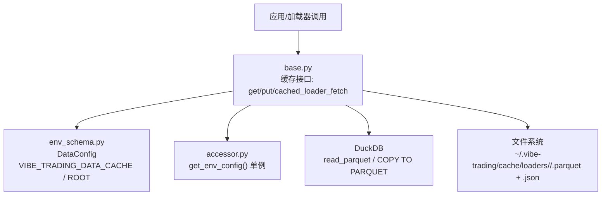
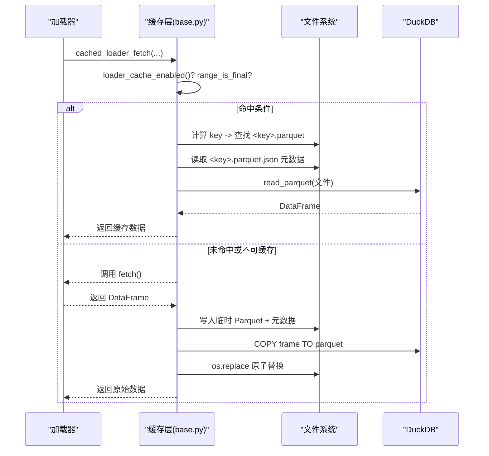
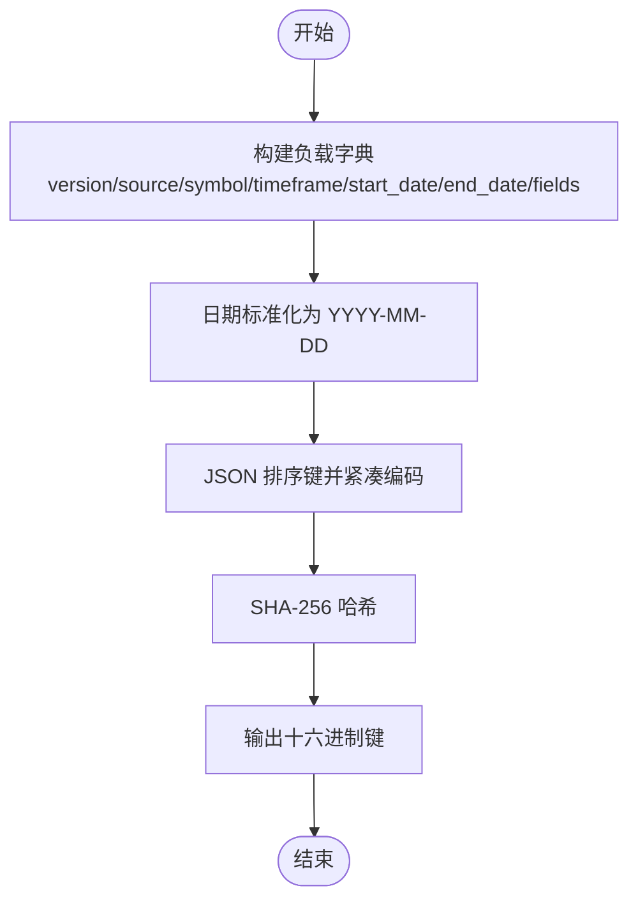
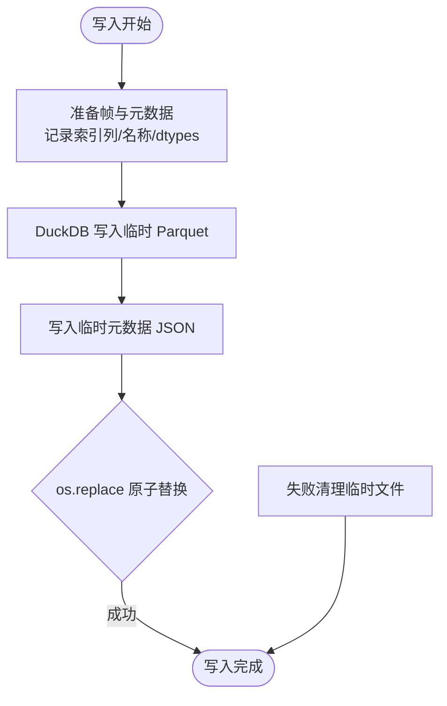
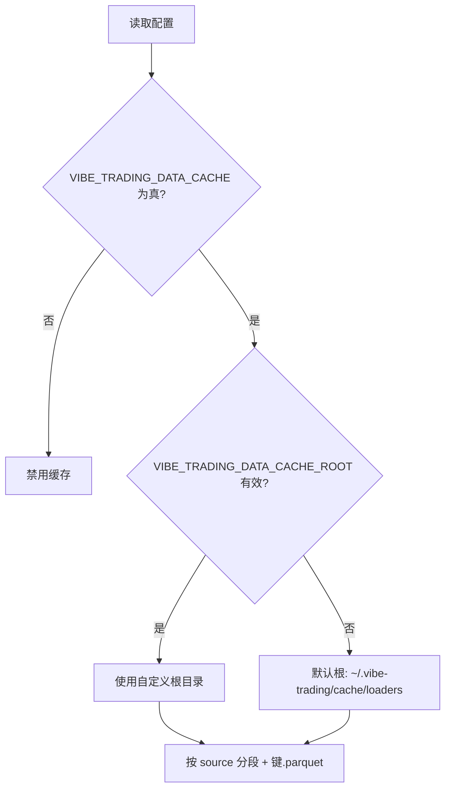
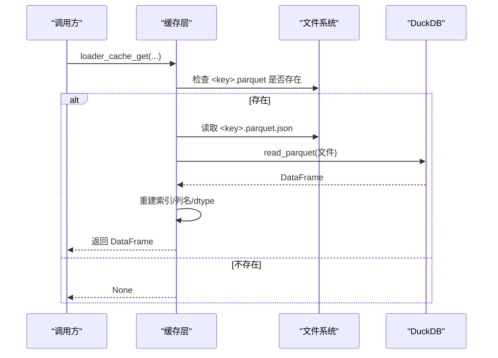
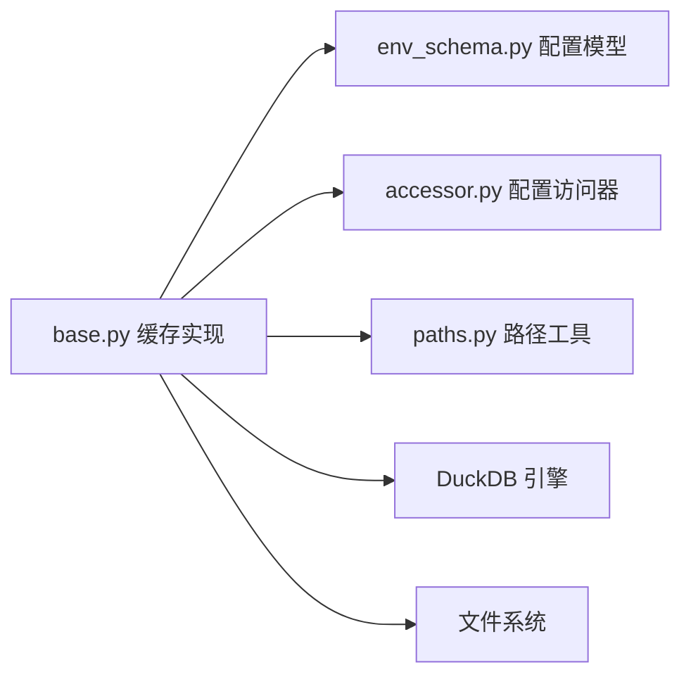

# 数据缓存系统

<cite>
**本文引用的文件**
- [agent/backtest/loaders/base.py](file://agent/backtest/loaders/base.py)
- [agent/src/config/env_schema.py](file://agent/src/config/env_schema.py)
- [agent/src/config/accessor.py](file://agent/src/config/accessor.py)
- [agent/src/config/paths.py](file://agent/src/config/paths.py)
</cite>

## 目录
1. [简介](#简介)
2. [项目结构](#项目结构)
3. [核心组件](#核心组件)
4. [架构总览](#架构总览)
5. [详细组件分析](#详细组件分析)
6. [依赖关系分析](#依赖关系分析)
7. [性能考虑](#性能考虑)
8. [故障排除指南](#故障排除指南)
9. [结论](#结论)
10. [附录](#附录)

## 简介
本文件为 Vibe-Trading 数据缓存系统的权威文档，聚焦于“基于内容寻址的缓存键生成”、“Parquet 文件格式存储与 DuckDB 集成”、“缓存启用配置、存储路径管理与版本兼容性处理”、“缓存读取/写入流程、元数据管理与索引类型恢复机制”、“性能优化策略、清理策略与监控指标”，以及“调试工具使用与故障排除”。该缓存是可选的本地磁盘缓存，用于在回测/数据加载阶段避免重复拉取已结算的数据范围。

## 项目结构
与数据缓存直接相关的代码集中在以下模块：
- 缓存实现与读写逻辑：agent/backtest/loaders/base.py
- 环境变量与配置模型：agent/src/config/env_schema.py
- 配置访问器（线程安全单例）：agent/src/config/accessor.py
- 运行时根路径与默认目录约定：agent/src/config/paths.py

图表来源
- [agent/backtest/loaders/base.py:243-398](file://agent/backtest/loaders/base.py#L243-L398)
- [agent/src/config/env_schema.py:186-187](file://agent/src/config/env_schema.py#L186-L187)
- [agent/src/config/accessor.py:52-76](file://agent/src/config/accessor.py#L52-L76)
- [agent/src/config/paths.py:13-34](file://agent/src/config/paths.py#L13-L34)

章节来源
- [agent/backtest/loaders/base.py:243-398](file://agent/backtest/loaders/base.py#L243-L398)
- [agent/src/config/env_schema.py:186-187](file://agent/src/config/env_schema.py#L186-L187)
- [agent/src/config/accessor.py:52-76](file://agent/src/config/accessor.py#L52-L76)
- [agent/src/config/paths.py:13-34](file://agent/src/config/paths.py#L13-L34)

## 核心组件
- 内容寻址键生成：将 source/symbol/timeframe/start_date/end_date/fields 等参数标准化后 JSON 序列化并 SHA-256 哈希，得到稳定且可复现的缓存键。
- Parquet 存储与 DuckDB 集成：通过 DuckDB 将 DataFrame 写入 Parquet，并以内存连接读取；同时记录元数据以恢复索引列名、索引数据类型和列轴名称。
- 缓存开关与路径管理：通过环境变量控制是否启用缓存及自定义根目录；默认根目录位于用户家目录下的 ~/.vibe-trading/cache/loaders。
- 版本兼容：内部维护 _LOADER_CACHE_VERSION，当键负载或磁盘布局变化时升级版本号，使旧缓存自然失效，便于后续清理。

章节来源
- [agent/backtest/loaders/base.py:284-325](file://agent/backtest/loaders/base.py#L284-L325)
- [agent/backtest/loaders/base.py:475-511](file://agent/backtest/loaders/base.py#L475-L511)
- [agent/backtest/loaders/base.py:536-595](file://agent/backtest/loaders/base.py#L536-L595)
- [agent/src/config/env_schema.py:186-187](file://agent/src/config/env_schema.py#L186-L187)
- [agent/src/config/accessor.py:52-76](file://agent/src/config/accessor.py#L52-L76)

## 架构总览
缓存系统围绕“按内容寻址的键 -> Parquet 文件 + 元数据 JSON”展开，读写均通过 DuckDB 完成，确保高性能列式存储与查询。

图表来源
- [agent/backtest/loaders/base.py:343-439](file://agent/backtest/loaders/base.py#L343-L439)
- [agent/backtest/loaders/base.py:475-511](file://agent/backtest/loaders/base.py#L475-L511)
- [agent/backtest/loaders/base.py:536-595](file://agent/backtest/loaders/base.py#L536-L595)

## 详细组件分析

### 内容寻址键生成算法
- 输入字段：source、symbol、timeframe、start_date、end_date、fields。
- 标准化：日期统一格式化为 YYYY-MM-DD；字段列表转为字符串数组；所有键值排序后 JSON 紧凑编码。
- 哈希：对字节串执行 SHA-256，输出十六进制字符串作为键。
- 稳定性：相同输入必得相同键；任何输入变更都会产生新键，保证一致性。

图表来源
- [agent/backtest/loaders/base.py:284-303](file://agent/backtest/loaders/base.py#L284-L303)
- [agent/backtest/loaders/base.py:442-463](file://agent/backtest/loaders/base.py#L442-L463)

章节来源
- [agent/backtest/loaders/base.py:284-303](file://agent/backtest/loaders/base.py#L284-L303)
- [agent/backtest/loaders/base.py:442-463](file://agent/backtest/loaders/base.py#L442-L463)

### Parquet 存储与 DuckDB 集成
- 写路径：将 DataFrame 转换为适合缓存的格式（重置索引、记录索引列映射），使用 DuckDB 注册表并 COPY TO PARQUET 写入临时文件；随后写入元数据 JSON；最后原子替换目标文件。
- 读路径：若存在 Parquet 与对应元数据，则通过 DuckDB read_parquet 读取为 DataFrame，并按元数据重建 MultiIndex、列轴名与索引 dtype。
- 容错：读写异常不会中断主流程，仅记录警告并回退到在线获取。

图表来源
- [agent/backtest/loaders/base.py:536-595](file://agent/backtest/loaders/base.py#L536-L595)

章节来源
- [agent/backtest/loaders/base.py:475-511](file://agent/backtest/loaders/base.py#L475-L511)
- [agent/backtest/loaders/base.py:536-595](file://agent/backtest/loaders/base.py#L536-L595)

### 缓存启用配置与存储路径管理
- 启用开关：环境变量 VIBE_TRADING_DATA_CACHE 设置为真值（如 "true"/"1"/"yes"/"on"）才启用缓存。
- 根路径：VIBE_TRADING_DATA_CACHE_ROOT 指定自定义根目录；为空或非字符串时回退至默认路径。
- 默认路径：~/.vibe-trading/cache/loaders，按 source 分段存放，文件名以键命名 .parquet。
- 运行期根：由 paths.get_runtime_root 决定用户态根目录，支持 VIBE_TRADING_HOME 覆盖。

图表来源
- [agent/backtest/loaders/base.py:251-281](file://agent/backtest/loaders/base.py#L251-L281)
- [agent/src/config/env_schema.py:186-187](file://agent/src/config/env_schema.py#L186-L187)
- [agent/src/config/paths.py:13-34](file://agent/src/config/paths.py#L13-L34)

章节来源
- [agent/backtest/loaders/base.py:251-281](file://agent/backtest/loaders/base.py#L251-L281)
- [agent/src/config/env_schema.py:186-187](file://agent/src/config/env_schema.py#L186-L187)
- [agent/src/config/paths.py:13-34](file://agent/src/config/paths.py#L13-L34)

### 版本兼容性与清理策略
- 版本字段：键负载中包含 version 字段，当前为 _LOADER_CACHE_VERSION=3。当键负载或磁盘布局变化时，应递增版本号，使旧缓存无法匹配新键，从而成为“不可达垃圾”。
- 清理建议：定期扫描 ~/.vibe-trading/cache/loaders，删除无对应键的孤立文件或过旧版本的缓存条目。可通过脚本比对目录中 .parquet 与 .json 的元数据版本，移除不匹配项。

章节来源
- [agent/backtest/loaders/base.py:243-248](file://agent/backtest/loaders/base.py#L243-L248)
- [agent/backtest/loaders/base.py:442-459](file://agent/backtest/loaders/base.py#L442-L459)

### 缓存读取/写入流程与元数据管理
- 读取流程：检查启用与范围是否可缓存 -> 计算键 -> 定位 Parquet -> 读取元数据 -> DuckDB 读取 -> 重建索引与 dtype -> 返回。
- 写入流程：检查启用与范围 -> 校验非空 DataFrame -> 计算键 -> 写入临时 Parquet + 元数据 -> 原子替换 -> 失败清理。
- 元数据内容：包含 index_columns、index_names、columns_name、index_dtypes、version 等，用于精确恢复索引结构与列轴信息。

图表来源
- [agent/backtest/loaders/base.py:343-368](file://agent/backtest/loaders/base.py#L343-L368)
- [agent/backtest/loaders/base.py:475-511](file://agent/backtest/loaders/base.py#L475-L511)

章节来源
- [agent/backtest/loaders/base.py:343-368](file://agent/backtest/loaders/base.py#L343-L368)
- [agent/backtest/loaders/base.py:475-511](file://agent/backtest/loaders/base.py#L475-L511)
- [agent/backtest/loaders/base.py:536-595](file://agent/backtest/loaders/base.py#L536-L595)

### 索引类型恢复机制
- 背景：DuckDB 的 Parquet 读写可能改变 datetime 精度（例如秒到微秒）。
- 机制：写入时记录每级索引的 dtype；读取时尝试按记录的 dtype 恢复，失败则保留 DuckDB 提供的 dtype，不影响主流程。
- 影响：尽量保持往返一致，减少下游因类型差异导致的比较或计算问题。

章节来源
- [agent/backtest/loaders/base.py:514-533](file://agent/backtest/loaders/base.py#L514-L533)
- [agent/backtest/loaders/base.py:574-595](file://agent/backtest/loaders/base.py#L574-L595)

## 依赖关系分析
- 配置依赖：通过 accessor.get_env_config 获取 EnvConfig，其中 DataConfig 提供 vibe_trading_data_cache 与 vibe_trading_data_cache_root。
- 路径依赖：默认缓存根目录位于用户家目录下；可通过环境变量覆盖。
- 外部依赖：DuckDB 用于高效列式读写；Pandas 用于 DataFrame 操作；标准库 hashlib/json/os/pathlib 用于键生成与文件操作。

图表来源
- [agent/backtest/loaders/base.py:243-398](file://agent/backtest/loaders/base.py#L243-L398)
- [agent/src/config/env_schema.py:186-187](file://agent/src/config/env_schema.py#L186-L187)
- [agent/src/config/accessor.py:52-76](file://agent/src/config/accessor.py#L52-L76)
- [agent/src/config/paths.py:13-34](file://agent/src/config/paths.py#L13-L34)

章节来源
- [agent/backtest/loaders/base.py:243-398](file://agent/backtest/loaders/base.py#L243-L398)
- [agent/src/config/env_schema.py:186-187](file://agent/src/config/env_schema.py#L186-L187)
- [agent/src/config/accessor.py:52-76](file://agent/src/config/accessor.py#L52-L76)
- [agent/src/config/paths.py:13-34](file://agent/src/config/paths.py#L13-L34)

## 性能考虑
- 列式存储：Parquet 提升 I/O 与查询效率，尤其适合时间序列与宽表。
- 内存数据库：DuckDB 内存连接减少磁盘开销，COPY TO PARQUET 与 read_parquet 均为高性能路径。
- 原子写入：临时文件 + os.replace 避免部分写入导致损坏，提高可靠性。
- 范围限制：仅对已结算的时间范围缓存，避免缓存“进行中”的数据造成不一致。
- 并发安全：每个写入使用 pid+uuid 唯一临时名，避免并发冲突。
- 建议优化：
  - 合理设置缓存根目录到高速磁盘（如 SSD/NVMe）。
  - 批量写入时合并多次小写入以减少元数据与 Parquet 文件碎片。
  - 定期清理无用缓存，降低 I/O 压力。

[本节为通用指导，不直接分析具体文件]

## 故障排除指南
- 缓存未生效
  - 检查 VIBE_TRACING_DATA_CACHE 是否为真值。
  - 确认 end_date 对应的范围已结算（range_is_final 判断）。
  - 查看日志中的警告信息，确认是否跳过缓存。
- 读取失败
  - 检查 Parquet 与元数据 JSON 是否成对存在。
  - 关注 DuckDB 读取异常日志，必要时删除损坏文件重新拉取。
- 写入失败
  - 检查磁盘空间与权限。
  - 观察临时文件残留，确认原子替换是否成功。
- 索引类型不一致
  - 确认元数据中的 index_dtypes 是否被正确记录与恢复。
  - 若恢复失败，检查下游对 dtype 的严格性要求。
- 版本不兼容
  - 若升级了缓存版本但仍有旧缓存，可能导致命中失败；清理旧缓存即可。

章节来源
- [agent/backtest/loaders/base.py:328-340](file://agent/backtest/loaders/base.py#L328-L340)
- [agent/backtest/loaders/base.py:475-511](file://agent/backtest/loaders/base.py#L475-L511)
- [agent/backtest/loaders/base.py:536-595](file://agent/backtest/loaders/base.py#L536-L595)

## 结论
Vibe-Trading 的数据缓存系统以内容寻址为核心，结合 Parquet 与 DuckDB 实现了高效、可靠、可恢复的本地缓存。通过环境变量灵活控制启用与路径，借助元数据与版本字段保障一致性与兼容性。建议在生产环境中配合定期清理与监控，以获得最佳性能与稳定性。

[本节为总结，不直接分析具体文件]

## 附录

### 环境变量清单
- VIBE_TRADING_DATA_CACHE：布尔型，启用/禁用缓存。
- VIBE_TRADING_DATA_CACHE_ROOT：字符串，自定义缓存根目录；为空时使用默认路径。

章节来源
- [agent/src/config/env_schema.py:186-187](file://agent/src/config/env_schema.py#L186-L187)

### 默认存储路径
- 默认根：~/.vibe-trading/cache/loaders
- 子目录：按 source 分段（经安全清洗）
- 文件：键.parquet + 键.parquet.json（元数据）

章节来源
- [agent/backtest/loaders/base.py:264-281](file://agent/backtest/loaders/base.py#L264-L281)
- [agent/backtest/loaders/base.py:306-325](file://agent/backtest/loaders/base.py#L306-L325)

### 关键函数参考
- 键生成：make_loader_cache_key
- 路径解析：loader_cache_path、loader_cache_root
- 范围判定：loader_cache_range_is_final
- 读取/写入：loader_cache_get、loader_cache_put、cached_loader_fetch
- 元数据：_frame_for_loader_cache、_restore_cache_index_dtypes

章节来源
- [agent/backtest/loaders/base.py:284-325](file://agent/backtest/loaders/base.py#L284-L325)
- [agent/backtest/loaders/base.py:343-439](file://agent/backtest/loaders/base.py#L343-L439)
- [agent/backtest/loaders/base.py:475-595](file://agent/backtest/loaders/base.py#L475-L595)