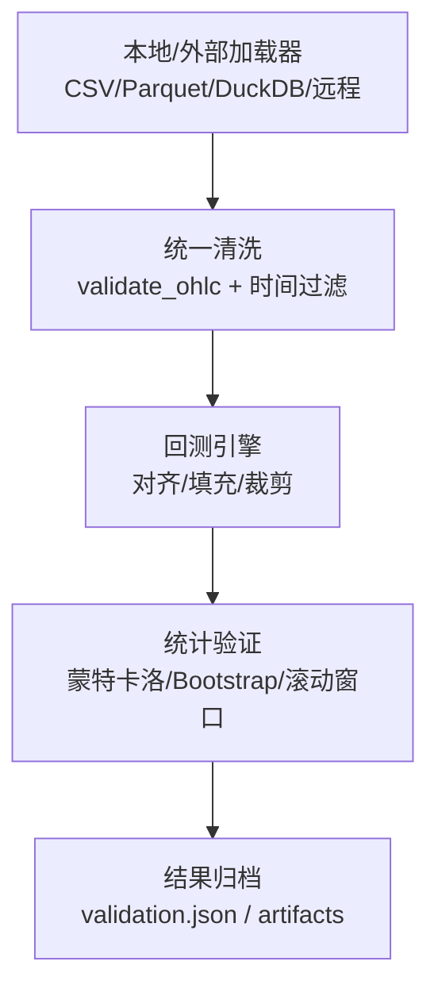
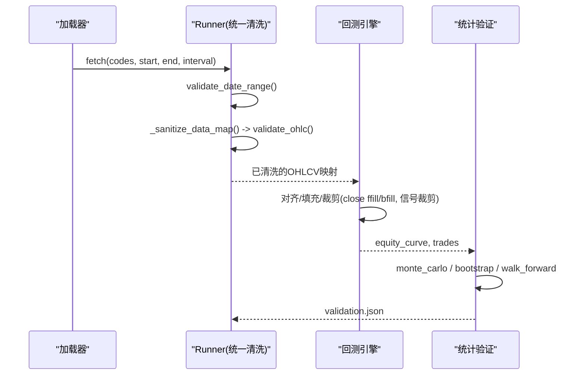
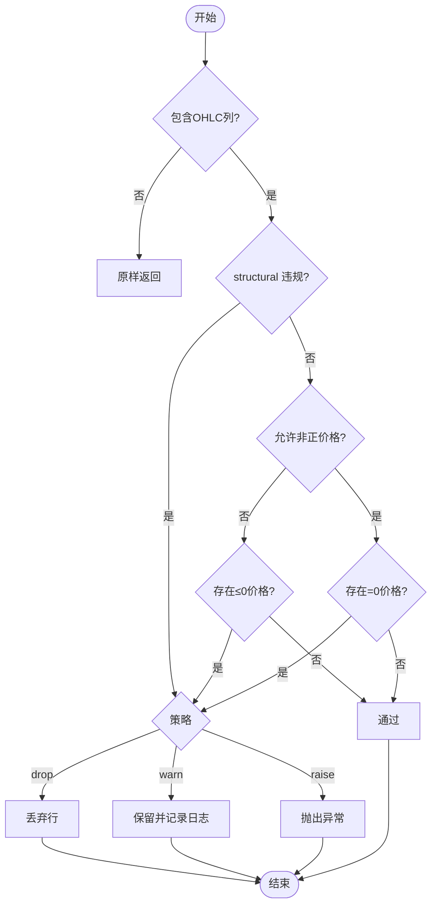
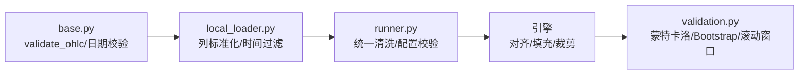

# 数据验证与清洗

<cite>
**本文引用的文件**
- [agent/backtest/loaders/base.py](file://agent/backtest/loaders/base.py)
- [agent/backtest/loaders/local_loader.py](file://agent/backtest/loaders/local_loader.py)
- [agent/backtest/runner.py](file://agent/backtest/runner.py)
- [agent/backtest/validation.py](file://agent/backtest/validation.py)
- [agent/tests/test_ohlc_validation.py](file://agent/tests/test_ohlc_validation.py)
- [agent/tests/test_base_engine.py](file://agent/tests/test_base_engine.py)
- [agent/backtest/risk_xray.py](file://agent/backtest/risk_xray.py)
</cite>

## 目录
1. [简介](#简介)
2. [项目结构](#项目结构)
3. [核心组件](#核心组件)
4. [架构总览](#架构总览)
5. [详细组件分析](#详细组件分析)
6. [依赖关系分析](#依赖关系分析)
7. [性能考量](#性能考量)
8. [故障排查指南](#故障排查指南)
9. [结论](#结论)
10. [附录](#附录)

## 简介
本文件面向 Vibe-Trading 的数据验证与清洗子系统，聚焦 OHLC 数据完整性检查、价格有效性验证、时间范围校验、异常值处理、缺失值填充、不同市场的特殊规则（如允许负价格的场景）、验证级别配置与错误处理策略。同时覆盖数据质量监控指标、清洗报告生成与数据溯源能力，并提供自定义验证规则开发与性能优化建议。

## 项目结构
数据验证与清洗贯穿“加载器 → 统一清洗 → 回测引擎”的流水线：
- 加载器负责从本地或外部源读取原始 OHLCV，并进行基础清洗与格式标准化。
- 统一边界校验在 runner 层对任意来源的数据进行集中式 OHLC 不变量检查。
- 回测引擎内部对信号与价格做对齐、填充与裁剪，保证数值稳定与可序列化。
- 统计验证模块输出蒙特卡洛、Bootstrap 置信区间与滚动窗口一致性等指标。

图表来源
- [agent/backtest/loaders/local_loader.py:249-354](file://agent/backtest/loaders/local_loader.py#L249-L354)
- [agent/backtest/loaders/base.py:31-119](file://agent/backtest/loaders/base.py#L31-L119)
- [agent/backtest/runner.py:68-162](file://agent/backtest/runner.py#L68-L162)
- [agent/backtest/validation.py:286-341](file://agent/backtest/validation.py#L286-L341)

章节来源
- [agent/backtest/loaders/local_loader.py:249-354](file://agent/backtest/loaders/local_loader.py#L249-L354)
- [agent/backtest/loaders/base.py:31-119](file://agent/backtest/loaders/base.py#L31-L119)
- [agent/backtest/runner.py:68-162](file://agent/backtest/runner.py#L68-L162)
- [agent/backtest/validation.py:286-341](file://agent/backtest/validation.py#L286-L341)

## 核心组件
- OHLC 不变量校验：确保 high ≥ low，且 open/close 被 high/low 包围；支持按策略丢弃、警告或抛出异常；可选择是否允许非正价格（零始终拒绝）。
- 时间范围校验：起止日期合法性与顺序校验，避免无效查询。
- 数据对齐与缺失值填充：close 序列前向/后向填充，限制最大填充长度；信号越界裁剪至 [-1, 1]；全空标的剔除。
- 统计验证：蒙特卡洛置换检验、Bootstrap Sharpe 置信区间、滚动窗口一致性评估，并输出严格 JSON。
- 风险透视：历史长度过滤与权重重归一化，避免稀疏标的影响整体评估。

章节来源
- [agent/backtest/loaders/base.py:50-119](file://agent/backtest/loaders/base.py#L50-L119)
- [agent/backtest/loaders/base.py:31-48](file://agent/backtest/loaders/base.py#L31-L48)
- [agent/tests/test_base_engine.py:479-508](file://agent/tests/test_base_engine.py#L479-L508)
- [agent/backtest/validation.py:286-341](file://agent/backtest/validation.py#L286-L341)
- [agent/backtest/risk_xray.py:110-142](file://agent/backtest/risk_xray.py#L110-L142)

## 架构总览
数据从加载器进入系统后，先经过加载器自身的规范化与 OHLC 校验，再经 runner 的统一清洗通道，随后进入引擎对齐与填充阶段，最后由统计验证模块产出质量指标与报告。

图表来源
- [agent/backtest/loaders/local_loader.py:249-354](file://agent/backtest/loaders/local_loader.py#L249-L354)
- [agent/backtest/loaders/base.py:31-119](file://agent/backtest/loaders/base.py#L31-L119)
- [agent/backtest/validation.py:286-341](file://agent/backtest/validation.py#L286-L341)

## 详细组件分析

### OHLC 数据完整性检查与价格有效性验证
- 不变量检查：high < low 直接判定为无效；open/close 必须落在 [low, high] 区间内。
- 价格有效性：默认拒绝任何 ≤ 0 的价格；当 allow_nonpositive_prices=True 时，仅拒绝恰好为零的价格，允许负价格通过（适用于欧洲电力等市场）。
- 策略模式：drop（默认）丢弃无效行；warn 记录日志但保留；raise 直接抛出异常中断流程。
- 测试覆盖：包含有效 doji、高低于低、收盘价高于最高价等边界用例。

图表来源
- [agent/backtest/loaders/base.py:50-119](file://agent/backtest/loaders/base.py#L50-L119)
- [agent/tests/test_ohlc_validation.py:23-64](file://agent/tests/test_ohlc_validation.py#L23-L64)

章节来源
- [agent/backtest/loaders/base.py:50-119](file://agent/backtest/loaders/base.py#L50-L119)
- [agent/tests/test_ohlc_validation.py:23-64](file://agent/tests/test_ohlc_validation.py#L23-L64)

### 时间范围校验
- 起止日期解析与合法性检查，禁止 start > end。
- 加载器在拉取数据前后均会应用起止时间过滤，确保只返回目标区间的 K 线。

章节来源
- [agent/backtest/loaders/base.py:31-48](file://agent/backtest/loaders/base.py#L31-L48)
- [agent/backtest/loaders/local_loader.py:342-347](file://agent/backtest/loaders/local_loader.py#L342-L347)

### 数据清洗策略、异常值处理与缺失值填充
- 加载器层面：
  - 列名标准化、日期解析与去重排序。
  - 数值列强制转换，去除 NaN 行。
  - 调用 validate_ohlc 执行不变量检查。
  - 若未提供 volume，则补零。
- 引擎层面：
  - close 序列使用前向/后向填充，限制最大连续填充长度，防止陈旧价格污染。
  - 信号序列超出 [-1, 1] 的部分会被裁剪。
  - 全空标的在对齐阶段被剔除。
- 风险透视：
  - 历史长度不足标的被跳过，并对剩余标的权重重新归一化。

章节来源
- [agent/backtest/loaders/local_loader.py:136-184](file://agent/backtest/loaders/local_loader.py#L136-L184)
- [agent/tests/test_base_engine.py:479-508](file://agent/tests/test_base_engine.py#L479-L508)
- [agent/backtest/risk_xray.py:110-142](file://agent/backtest/risk_xray.py#L110-L142)

### 不同市场的特殊规则（如负价格市场）
- 通过 allow_nonpositive_prices 控制是否允许负价格通过；零价格一律拒绝，因为名义金额与保证金计算中除以价格是未定义的。
- 对于欧洲电力等可能出清为负的市场，允许负价格比静默填充缺失更合理。

章节来源
- [agent/backtest/loaders/base.py:65-73](file://agent/backtest/loaders/base.py#L65-L73)

### 验证级别配置与错误处理策略
- 配置入口：BacktestConfigSchema 校验 codes、日期、interval、engine、source 等字段，并在模型级校验 start ≤ end。
- 错误处理：
  - 加载器失败记录日志并继续其他标的。
  - 缓存读写失败不阻塞主流程。
  - 统计验证输出严格 JSON，非有限值转为 null。

章节来源
- [agent/backtest/runner.py:68-162](file://agent/backtest/runner.py#L68-L162)
- [agent/backtest/loaders/base.py:343-439](file://agent/backtest/loaders/base.py#L343-L439)
- [agent/backtest/validation.py:419-451](file://agent/backtest/validation.py#L419-L451)

### 数据质量监控指标、清洗报告与数据溯源
- 质量指标：
  - 蒙特卡洛置换检验：比较实际 Sharpe/最大回撤与随机排列分布，给出 p 值与分位数。
  - Bootstrap Sharpe 置信区间：估计风险调整后收益稳定性。
  - 滚动窗口一致性：将回测切分为多段，评估收益与夏普的一致性。
- 报告输出：
  - 统一写入 artifacts/validation.json，使用严格 JSON（allow_nan=False），非有限值转 null。
- 数据溯源：
  - 加载器缓存键基于 source/symbol/timeframe/start/end/fields 的内容寻址，便于追踪数据来源与参数组合。
  - 元数据记录索引列名、名称与 dtype，保障缓存回放一致性。

章节来源
- [agent/backtest/validation.py:286-341](file://agent/backtest/validation.py#L286-L341)
- [agent/backtest/validation.py:419-451](file://agent/backtest/validation.py#L419-L451)
- [agent/backtest/loaders/base.py:284-325](file://agent/backtest/loaders/base.py#L284-L325)
- [agent/backtest/loaders/base.py:574-595](file://agent/backtest/loaders/base.py#L574-L595)

### 自定义验证规则开发指南
- 扩展点：
  - 在 loader 层新增列级或行级校验函数，复用 validate_ohlc 的策略模式（drop/warn/raise）。
  - 在 runner 的 _sanitize_data_map 中接入新的清洗步骤，确保所有来源数据汇聚于此。
  - 在统计验证模块添加新的指标函数，并通过 run_validation 编排执行。
- 最佳实践：
  - 保持输入契约：至少包含 open/high/low/close。
  - 明确策略行为与日志输出，便于问题定位。
  - 对异常值采用保守处理（优先丢弃或标记），避免污染下游指标。

章节来源
- [agent/backtest/loaders/base.py:50-119](file://agent/backtest/loaders/base.py#L50-L119)
- [agent/backtest/validation.py:286-341](file://agent/backtest/validation.py#L286-L341)

### 性能优化建议
- 使用加载器缓存：
  - 仅在 settled 区间（end_date 早于今日）缓存，避免钉住正在形成的 K 线。
  - 使用内容寻址键与原子写入，减少重复 I/O。
- 限制重采样与填充：
  - 设置合理的最大填充步长，避免长缺口用陈旧价格掩盖。
- 统计验证规模控制：
  - 蒙特卡洛路径矩阵按需采样，避免超大内存占用。
  - Bootstrap 样本数与置信度可调，平衡精度与耗时。

章节来源
- [agent/backtest/loaders/base.py:328-439](file://agent/backtest/loaders/base.py#L328-L439)
- [agent/backtest/validation.py:67-113](file://agent/backtest/validation.py#L67-L113)

## 依赖关系分析
- 加载器依赖统一校验工具 validate_ohlc 与日期校验 validate_date_range。
- Runner 作为中央清洗通道，对所有来源数据收敛到同一套不变量检查。
- 引擎依赖对齐与填充逻辑，确保信号与价格一致。
- 统计验证依赖回测产物（equity/trades）并输出严格 JSON。

图表来源
- [agent/backtest/loaders/base.py:31-119](file://agent/backtest/loaders/base.py#L31-L119)
- [agent/backtest/loaders/local_loader.py:249-354](file://agent/backtest/loaders/local_loader.py#L249-L354)
- [agent/backtest/runner.py:68-162](file://agent/backtest/runner.py#L68-L162)
- [agent/backtest/validation.py:286-341](file://agent/backtest/validation.py#L286-L341)

章节来源
- [agent/backtest/loaders/base.py:31-119](file://agent/backtest/loaders/base.py#L31-L119)
- [agent/backtest/loaders/local_loader.py:249-354](file://agent/backtest/loaders/local_loader.py#L249-L354)
- [agent/backtest/runner.py:68-162](file://agent/backtest/runner.py#L68-L162)
- [agent/backtest/validation.py:286-341](file://agent/backtest/validation.py#L286-L341)

## 性能考量
- 缓存命中优先：settled 区间的请求优先走缓存，降低网络与磁盘压力。
- 增量清洗：仅在必要列上做类型转换与校验，减少不必要开销。
- 统计验证采样：对大规模回测结果进行子集采样，控制内存与序列化体积。
- 填充限制：限制最大连续填充步长，避免无意义的前向/后向填充造成计算浪费。

[本节为通用指导，无需特定文件引用]

## 故障排查指南
- OHLC 不变量违规：
  - 现象：出现 high < low 或收盘价超出高低区间。
  - 处理：根据策略丢弃、警告或抛出异常；检查数据源与时间过滤。
- 价格非正：
  - 现象：价格为零或负数。
  - 处理：默认拒绝；如需允许负价格，启用 allow_nonpositive_prices。
- 缺失值过多：
  - 现象：close 序列存在长缺口。
  - 处理：调整填充限制；确认数据源连续性。
- 统计验证失败：
  - 现象：p 值过高或置信区间过宽。
  - 处理：增加样本量或延长回测期；检查交易记录与资金曲线。

章节来源
- [agent/backtest/loaders/base.py:50-119](file://agent/backtest/loaders/base.py#L50-L119)
- [agent/backtest/validation.py:286-341](file://agent/backtest/validation.py#L286-L341)
- [agent/tests/test_base_engine.py:479-508](file://agent/tests/test_base_engine.py#L479-L508)

## 结论
本系统通过“加载器标准化 + 统一不变量校验 + 引擎对齐填充 + 统计验证”的分层设计，确保 OHLC 数据的完整性、价格的有效性与时间范围的合理性。针对不同市场（如允许负价格）提供灵活配置，结合缓存与严格 JSON 输出实现高效、可追溯的数据质量治理。建议在业务侧按需扩展自定义验证规则，并结合性能优化策略提升吞吐与稳定性。

[本节为总结性内容，无需特定文件引用]

## 附录
- 关键函数与路径参考：
  - OHLC 校验：[validate_ohlc:50-119](file://agent/backtest/loaders/base.py#L50-L119)
  - 日期校验：[validate_date_range:31-48](file://agent/backtest/loaders/base.py#L31-L48)
  - 加载器清洗：[local_loader.fetch/_normalize_columns:249-354](file://agent/backtest/loaders/local_loader.py#L249-L354)
  - Runner 配置校验：[BacktestConfigSchema:68-162](file://agent/backtest/runner.py#L68-L162)
  - 统计验证：[run_validation:286-341](file://agent/backtest/validation.py#L286-L341)
  - 风险透视：[risk_xray 历史过滤:110-142](file://agent/backtest/risk_xray.py#L110-L142)

[本节为参考信息，无需特定文件引用]