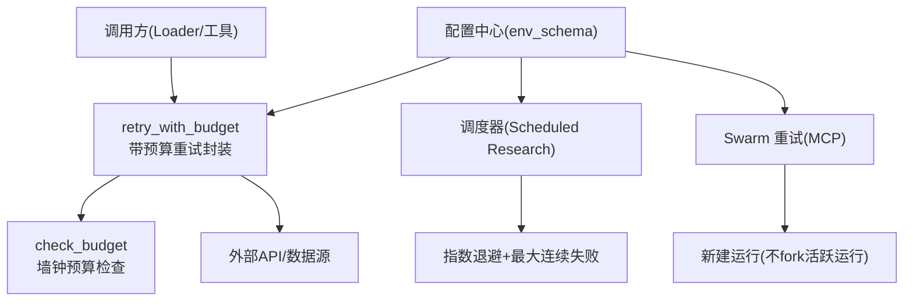
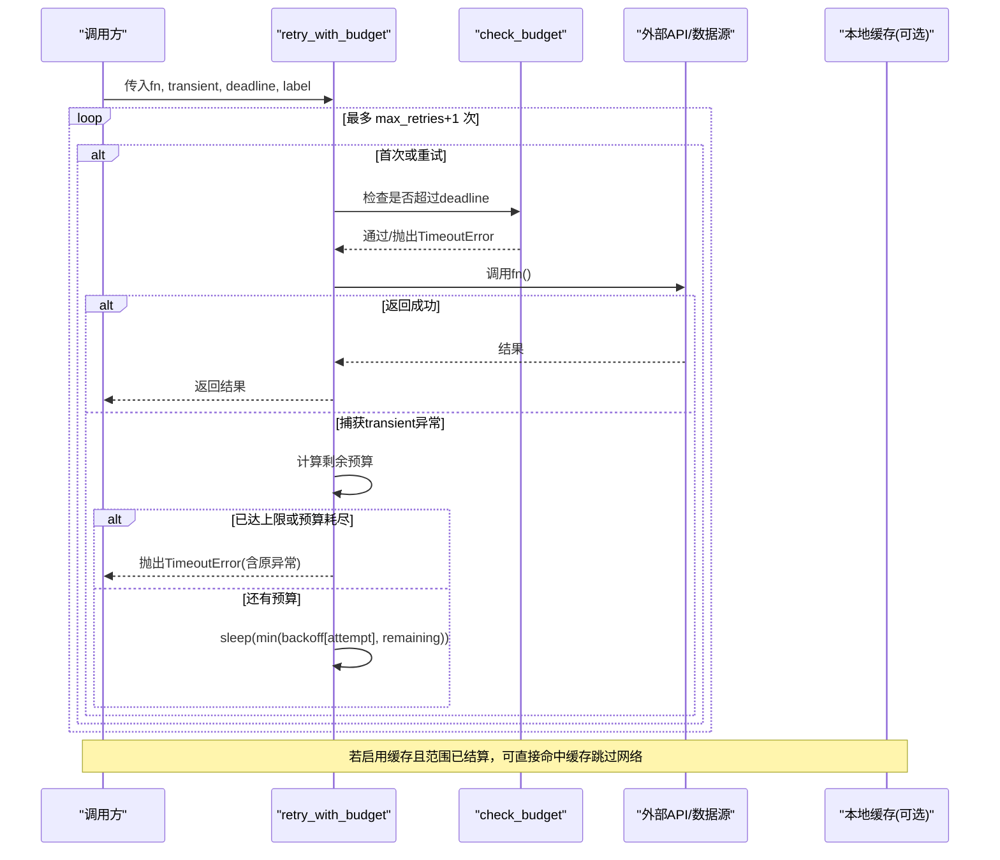
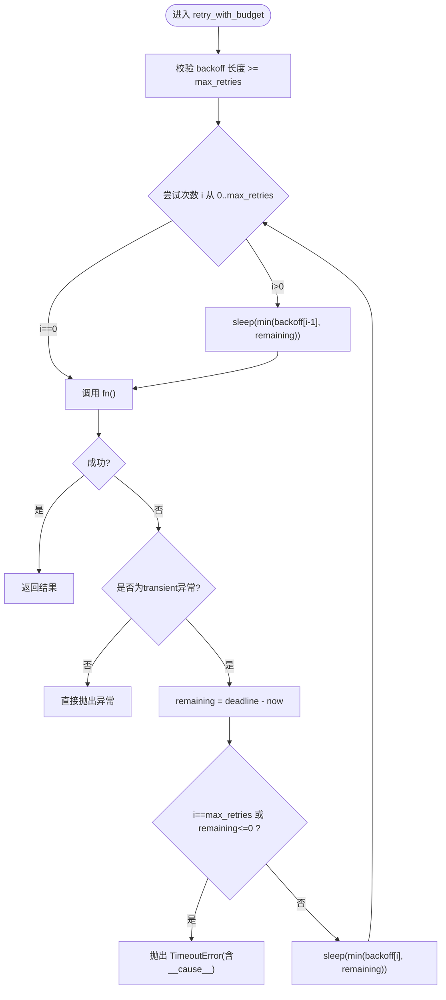
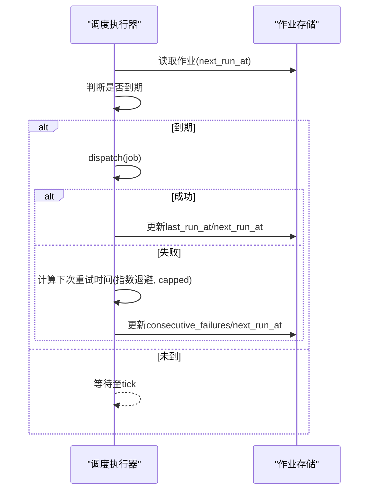
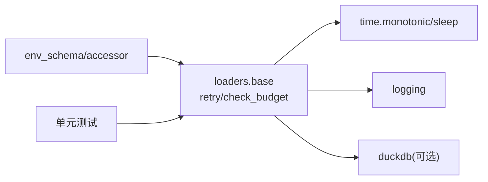

# 重试与容错机制

<cite>
**本文引用的文件**
- [agent/backtest/loaders/base.py](file://agent/backtest/loaders/base.py)
- [agent/src/config/env_schema.py](file://agent/src/config/env_schema.py)
- [agent/src/config/accessor.py](file://agent/src/config/accessor.py)
- [agent/tests/test_loader_retry_helpers.py](file://agent/tests/test_loader_retry_helpers.py)
- [agent/tests/test_scheduled_research_executor.py](file://agent/tests/test_scheduled_research_executor.py)
- [agent/tests/test_swarm_retry.py](file://agent/tests/test_swarm_retry.py)
- [agent/backtest/loaders/_http.py](file://agent/backtest/loaders/_http.py)
- [agent/tests/test_ccxt_loader_bounded.py](file://agent/tests/test_ccxt_loader_bounded.py)
- [agent/tests/test_okx_loader_bounded.py](file://agent/tests/test_okx_loader_bounded.py)
- [agent/src/tools/alpha_bench_tool.py](file://agent/src/tools/alpha_bench_tool.py)
</cite>

## 目录
1. [简介](#简介)
2. [项目结构](#项目结构)
3. [核心组件](#核心组件)
4. [架构总览](#架构总览)
5. [详细组件分析](#详细组件分析)
6. [依赖关系分析](#依赖关系分析)
7. [性能考量](#性能考量)
8. [故障排查指南](#故障排查指南)
9. [结论](#结论)
10. [附录](#附录)

## 简介
本文件系统性说明 Vibe-Trading 的重试与容错机制，覆盖预算限制的重试策略、指数退避算法、超时控制、瞬态异常分类、重试次数限制与失败处理逻辑；并记录环境变量配置选项、性能调优参数与监控日志。同时提供常见网络问题解决方案、API 限流处理与降级策略，以及重试机制的测试方法与性能基准测试指南。

## 项目结构
围绕重试与容错的关键代码集中在数据加载层与调度执行层：
- 数据加载层（backtest/loaders）：提供统一的“带预算的重试”工具函数，供各数据源 loader 复用。
- 调度执行层（scheduled research / swarm）：实现任务级重试、指数退避与最大连续失败保护。
- 配置层（config）：集中管理重试、超时、SSE 等运行时开关与环境变量解析。
- 测试层（tests）：对重试行为、预算截断、缓存回退等进行严格回归验证。

图表来源
- [agent/backtest/loaders/base.py:127-236](file://agent/backtest/loaders/base.py#L127-L236)
- [agent/src/config/env_schema.py:323-377](file://agent/src/config/env_schema.py#L323-L377)
- [agent/tests/test_scheduled_research_executor.py:369-416](file://agent/tests/test_scheduled_research_executor.py#L369-L416)
- [agent/tests/test_swarm_retry.py:1-42](file://agent/tests/test_swarm_retry.py#L1-L42)

章节来源
- [agent/backtest/loaders/base.py:127-236](file://agent/backtest/loaders/base.py#L127-L236)
- [agent/src/config/env_schema.py:323-377](file://agent/src/config/env_schema.py#L323-L377)

## 核心组件
- 带预算重试：retry_with_budget(fn, transient, deadline, label, max_retries, backoff)
  - 仅对声明的瞬态异常重试；非瞬态异常立即抛出。
  - 每次重试前检查剩余预算，避免超支；达到最大重试或截止时间则统一以 TimeoutError 终止，并保留原始异常为 __cause__。
- 预算检查：check_budget(deadline, label, budget_s=None)
  - 在分页拉取等长耗时路径中快速失败，防止继续浪费资源。
- 默认策略：DEFAULT_MAX_RETRIES=3，DEFAULT_BACKOFF=(0.5, 1.5, 4.0)
- 本地缓存（可选）：当启用时，命中缓存可完全绕过网络请求，作为强降级手段。

章节来源
- [agent/backtest/loaders/base.py:127-236](file://agent/backtest/loaders/base.py#L127-L236)
- [agent/backtest/loaders/base.py:243-439](file://agent/backtest/loaders/base.py#L243-L439)

## 架构总览
重试与容错贯穿“调用方—重试封装—外部依赖”的链路，并通过配置中心注入超时与退避策略。

图表来源
- [agent/backtest/loaders/base.py:184-236](file://agent/backtest/loaders/base.py#L184-L236)
- [agent/backtest/loaders/base.py:163-179](file://agent/backtest/loaders/base.py#L163-L179)
- [agent/backtest/loaders/base.py:243-439](file://agent/backtest/loaders/base.py#L243-L439)

## 详细组件分析

### 组件A：数据加载层重试封装（retry_with_budget / check_budget）
- 瞬态异常分类：由调用方显式指定（如网络超时、连接重置、HTTP 429/5xx 等），只有这些异常才会触发重试。
- 重试次数限制：max_retries 表示额外尝试次数，总尝试次数 = max_retries + 1。
- 指数退避：backoff 为每轮重试的等待秒数序列，默认 (0.5, 1.5, 4.0)。实际睡眠时间为 min(backoff[attempt], remaining)，确保短预算不被完整退避消耗。
- 超时控制：deadline 使用 time.monotonic() 比较；一旦到达或超出，立即终止并抛出 TimeoutError。
- 失败处理：所有重试耗尽或预算用尽均包装为 TimeoutError，并保留原始异常为 __cause__，便于诊断。
- 非瞬态异常：直接传播，不做重试。

图表来源
- [agent/backtest/loaders/base.py:184-236](file://agent/backtest/loaders/base.py#L184-L236)

章节来源
- [agent/backtest/loaders/base.py:127-236](file://agent/backtest/loaders/base.py#L127-L236)
- [agent/tests/test_loader_retry_helpers.py:74-166](file://agent/tests/test_loader_retry_helpers.py#L74-L166)

### 组件B：调度器重试（Scheduled Research）
- 指数退避：失败后按 base_delay * 2^k 递增，直至达到 max_delay 上限。
- 最大连续失败：超过阈值后停止自动重试，避免雪崩。
- 配置项：VIBE_TRADING_SCHEDULER_RETRY_BASE_DELAY_MS、VIBE_TRADING_SCHEDULER_RETRY_MAX_DELAY_MS、VIBE_TRADING_SCHEDULER_MAX_CONSECUTIVE_FAILURES。
- 行为验证：测试覆盖了退避增长、上限封顶、非法参数拒绝等场景。

图表来源
- [agent/tests/test_scheduled_research_executor.py:369-416](file://agent/tests/test_scheduled_research_executor.py#L369-L416)
- [agent/src/config/env_schema.py:354-362](file://agent/src/config/env_schema.py#L354-L362)

章节来源
- [agent/tests/test_scheduled_research_executor.py:369-416](file://agent/tests/test_scheduled_research_executor.py#L369-L416)
- [agent/src/config/env_schema.py:354-362](file://agent/src/config/env_schema.py#L354-L362)

### 组件C：Swarm 重试（MCP retry_run）
- 规则：对 failed/cancelled/stale 的运行重新发起全新运行，不 fork 仍在运行的实例。
- 错误处理：找不到运行或参数非法时返回错误信息。
- 用途：用于批量研究任务的恢复与重跑。

章节来源
- [agent/tests/test_swarm_retry.py:1-42](file://agent/tests/test_swarm_retry.py#L1-L42)

### 组件D：HTTP 层超时与重试配合
- HTTP 请求携带 per-request timeout，结合上层 retry_with_budget 形成双重保障。
- 无效超时值会告警并回退到默认值，保证启动稳定性。

章节来源
- [agent/backtest/loaders/_http.py:127-176](file://agent/backtest/loaders/_http.py#L127-L176)
- [agent/tests/test_ccxt_loader_bounded.py:111-144](file://agent/tests/test_ccxt_loader_bounded.py#L111-L144)
- [agent/tests/test_okx_loader_bounded.py:157-185](file://agent/tests/test_okx_loader_bounded.py#L157-L185)

### 组件E：通用指数退避工具（Alpha Bench）
- 简单通用实现：固定 tries 次，base_delay * 2^attempt 退避，最后记录警告日志。
- 适用场景：轻量级网络请求重试，无需复杂预算控制。

章节来源
- [agent/src/tools/alpha_bench_tool.py:591-608](file://agent/src/tools/alpha_bench_tool.py#L591-L608)

## 依赖关系分析
- 重试封装依赖：time.monotonic()、logging、可选的 duckdb（缓存）。
- 配置依赖：EnvConfig 单例，线程安全访问；支持运行时重置。
- 测试依赖：通过 monkeypatch 替换 time.sleep/monotonic，确保测试确定性与瞬时性。

图表来源
- [agent/backtest/loaders/base.py:127-236](file://agent/backtest/loaders/base.py#L127-L236)
- [agent/src/config/accessor.py:1-113](file://agent/src/config/accessor.py#L1-L113)
- [agent/tests/test_loader_retry_helpers.py:44-48](file://agent/tests/test_loader_retry_helpers.py#L44-L48)

章节来源
- [agent/backtest/loaders/base.py:127-236](file://agent/backtest/loaders/base.py#L127-L236)
- [agent/src/config/accessor.py:1-113](file://agent/src/config/accessor.py#L1-L113)

## 性能考量
- 预算优先：short remaining budget 不会消费完整 backoff，减少尾部延迟。
- 缓存降级：启用本地缓存后，历史数据可完全绕过网络，显著降低重试压力。
- 并发与限流：合理设置 max_retries 与 backoff，避免对上游造成突发流量。
- 超时隔离：per-request timeout 与全局 deadline 共同作用，避免长尾阻塞。
- 日志与观测：无效配置会记录 WARNING；建议在生产开启结构化日志以便追踪重试与超时事件。

## 故障排查指南
- 现象：频繁超时
  - 检查 deadline 是否过短；确认 backoff 是否合理；查看是否有大量非瞬态异常导致立即失败。
  - 参考：[agent/backtest/loaders/base.py:184-236](file://agent/backtest/loaders/base.py#L184-L236)
- 现象：重试未生效
  - 确认 transient 类型是否正确；非瞬态异常不会被重试。
  - 参考：[agent/tests/test_loader_retry_helpers.py:100-105](file://agent/tests/test_loader_retry_helpers.py#L100-L105)
- 现象：预算被耗尽但仍有重试
  - 检查是否在分页处调用 check_budget；确认 remaining 计算正确。
  - 参考：[agent/backtest/loaders/base.py:163-179](file://agent/backtest/loaders/base.py#L163-L179)
- 现象：调度任务反复失败
  - 检查指数退避配置与最大连续失败阈值；确认 next_run_at 更新逻辑。
  - 参考：[agent/tests/test_scheduled_research_executor.py:369-416](file://agent/tests/test_scheduled_research_executor.py#L369-L416)
- 现象：Swarm 重试报错
  - 确认运行状态不是 running；检查 run_id 是否存在。
  - 参考：[agent/tests/test_swarm_retry.py:35-42](file://agent/tests/test_swarm_retry.py#L35-L42)
- 现象：网络限流（429）
  - 将 429 纳入 transient 列表；适当增大 backoff；必要时启用本地缓存。
  - 参考：[agent/backtest/loaders/base.py:184-236](file://agent/backtest/loaders/base.py#L184-L236)

章节来源
- [agent/backtest/loaders/base.py:163-236](file://agent/backtest/loaders/base.py#L163-L236)
- [agent/tests/test_loader_retry_helpers.py:100-166](file://agent/tests/test_loader_retry_helpers.py#L100-L166)
- [agent/tests/test_scheduled_research_executor.py:369-416](file://agent/tests/test_scheduled_research_executor.py#L369-L416)
- [agent/tests/test_swarm_retry.py:35-42](file://agent/tests/test_swarm_retry.py#L35-L42)

## 结论
Vibe-Trading 的重试与容错体系以“预算+退避+超时”为核心，结合“瞬态异常分类”和“本地缓存降级”，在保证稳定性的同时兼顾性能与可观测性。调度层与 Swarm 层提供了任务级重试与恢复能力，配合配置中心的集中化管理，使系统在不同网络与上游条件下具备弹性与韧性。

## 附录

### 环境变量与配置选项（与重试/容错相关）
- 数据加载缓存
  - VIBE_TRADING_DATA_CACHE：启用/禁用本地缓存（布尔）
  - VIBE_TRADING_DATA_CACHE_ROOT：缓存根目录（字符串）
- 工具与流控
  - VIBE_TRADING_TOOL_TIMEOUT_SECONDS：工具级超时（秒）
  - VIBE_TRADING_SSE_TIMEOUT：SSE 超时（秒）
- 调度器重试
  - VIBE_TRADING_SCHEDULER_RETRY_BASE_DELAY_MS：基础退避（毫秒）
  - VIBE_TRADING_SCHEDULER_RETRY_MAX_DELAY_MS：最大退避（毫秒）
  - VIBE_TRADING_SCHEDULER_MAX_CONSECUTIVE_FAILURES：最大连续失败次数
- 其他
  - SWARM_*：多智能体运行超时、心跳、重试延迟等
  - CCXT_TIMEOUT_MS / OKX_TIMEOUT_S：数据源请求超时（无效值会回退并告警）

章节来源
- [agent/src/config/env_schema.py:323-377](file://agent/src/config/env_schema.py#L323-L377)
- [agent/tests/test_ccxt_loader_bounded.py:111-144](file://agent/tests/test_ccxt_loader_bounded.py#L111-L144)
- [agent/tests/test_okx_loader_bounded.py:157-185](file://agent/tests/test_okx_loader_bounded.py#L157-L185)

### 常见网络问题与解决方案
- 网络抖动/瞬断：将连接超时、读超时类异常加入 transient；提高 backoff 首项；缩短 deadline。
- API 限流（429）：纳入 transient；增大 backoff；考虑启用本地缓存；必要时分片请求。
- 上游服务不可用（5xx）：纳入 transient；限制 max_retries；结合调度器退避避免雪崩。
- 长尾请求：缩短 per-request timeout；在分页点调用 check_budget；必要时提前降级。

### 降级策略
- 首选：本地缓存命中（历史数据）→ 完全绕过网络。
- 次选：切换到备用数据源（loader 注册表中的 fallback 链）。
- 再次：返回部分结果或空结果，并在日志中标注降级原因。
- 最终：抛出明确的 TimeoutError 或业务异常，便于上层决策。

### 测试方法与基准测试指南
- 单元测试要点
  - 正常路径：一次调用成功。
  - 瞬态异常：重试直到成功或耗尽。
  - 非瞬态异常：立即传播。
  - 预算截断：deadline 中途到达时立即中止。
  - 退避越界保护：backoff 长度不足时报错。
- 推荐用例
  - 模拟网络抖动：交替返回异常与成功。
  - 模拟限流：连续 429 后成功。
  - 模拟长尾：延长单次调用耗时，验证预算截断。
- 基准测试建议
  - 指标：成功率、平均/中位延迟、P95/P99 延迟、重试次数分布、超时率。
  - 场景：不同 backoff 策略、不同 max_retries、不同 deadline。
  - 工具：使用 pytest 的 monkeypatch 冻结 time.sleep/monotonic，确保可重复性。

章节来源
- [agent/tests/test_loader_retry_helpers.py:74-166](file://agent/tests/test_loader_retry_helpers.py#L74-L166)
- [agent/tests/test_scheduled_research_executor.py:369-416](file://agent/tests/test_scheduled_research_executor.py#L369-L416)