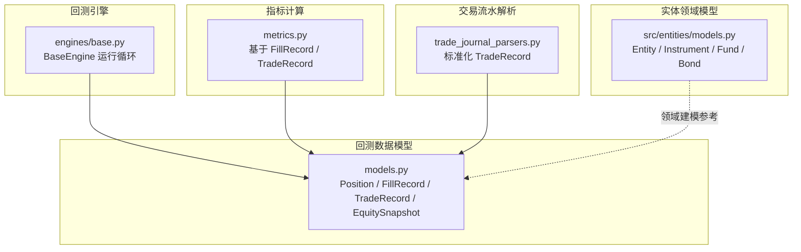
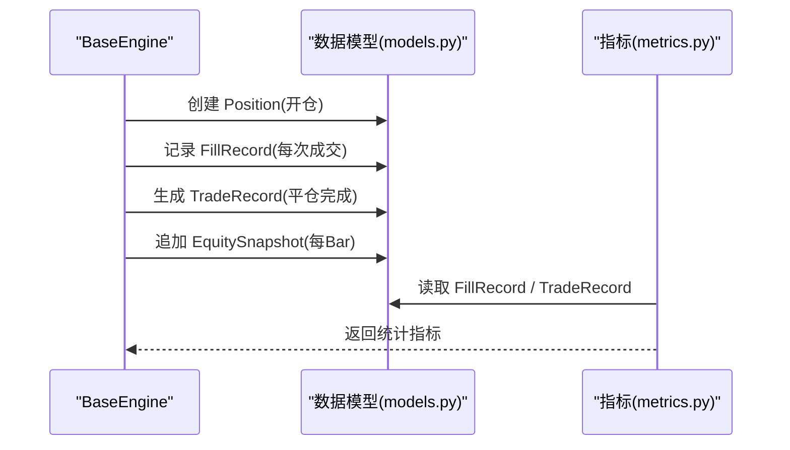
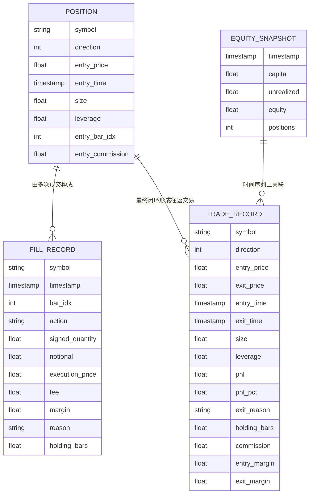
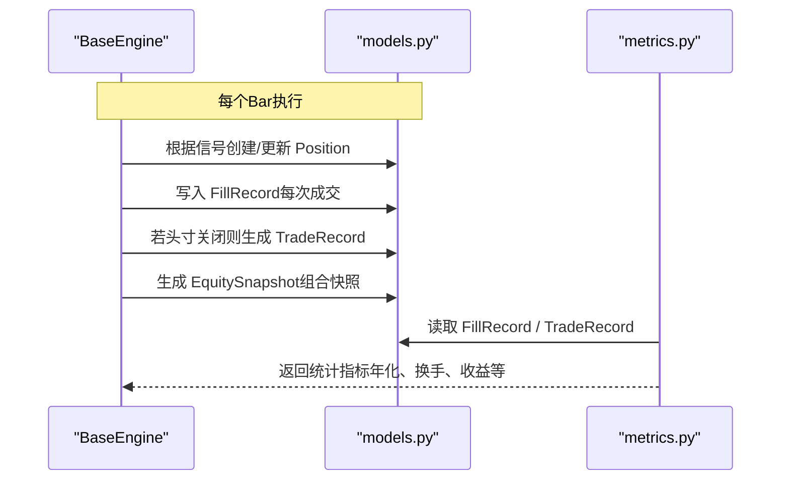
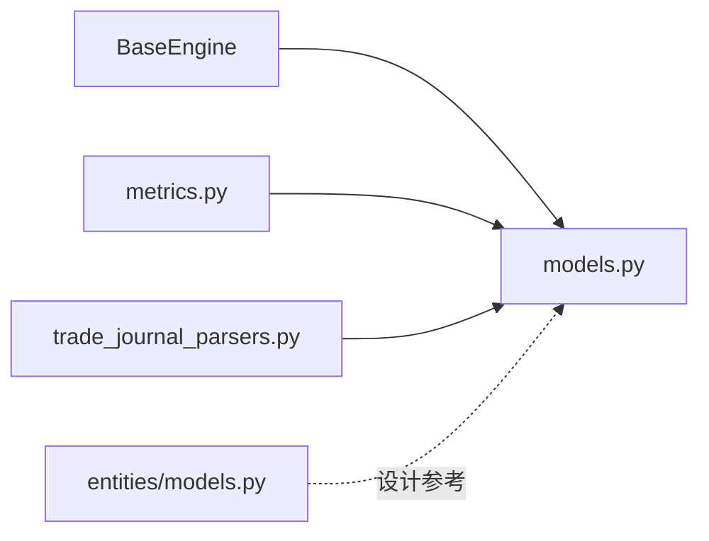

# 数据模型设计

<cite>
**本文引用的文件**
- [agent/backtest/models.py](file://agent/backtest/models.py)
- [agent/backtest/engines/base.py](file://agent/backtest/engines/base.py)
- [agent/backtest/metrics.py](file://agent/backtest/metrics.py)
- [agent/src/entities/models.py](file://agent/src/entities/models.py)
- [agent/src/tools/trade_journal_parsers.py](file://agent/src/tools/trade_journal_parsers.py)
</cite>

## 目录
1. [简介](#简介)
2. [项目结构](#项目结构)
3. [核心组件](#核心组件)
4. [架构总览](#架构总览)
5. [详细组件分析](#详细组件分析)
6. [依赖关系分析](#依赖关系分析)
7. [性能考量](#性能考量)
8. [故障排查指南](#故障排查指南)
9. [结论](#结论)
10. [附录：扩展指南与最佳实践](#附录：扩展指南与最佳实践)

## 简介
本文件面向 Vibe-Trading 的回测引擎数据模型，围绕 Position、FillRecord、TradeRecord、EquitySnapshot 四个核心实体进行系统化说明。文档涵盖设计理念（不可变数据类）、字段定义、验证规则与业务约束、实体关系图、示例数据、在回测引擎中的作用及与其他组件的交互方式，并提供扩展指南与最佳实践，帮助读者在不深入源码的情况下也能准确理解和使用这些模型。

## 项目结构
与数据模型直接相关的代码主要分布在以下位置：
- 回测共享数据模型：agent/backtest/models.py
- 回测引擎基类（使用上述模型）：agent/backtest/engines/base.py
- 回测指标计算（消费 FillRecord、TradeRecord）：agent/backtest/metrics.py
- 非K线资产实体模型（Entity/Instrument/Fund/Bond等，提供领域建模参考）：agent/src/entities/models.py
- 交易流水解析器（输出标准化 TradeRecord）：agent/src/tools/trade_journal_parsers.py

图表来源
- [agent/backtest/models.py:13-118](file://agent/backtest/models.py#L13-L118)
- [agent/backtest/engines/base.py:377-800](file://agent/backtest/engines/base.py#L377-L800)
- [agent/backtest/metrics.py:1-200](file://agent/backtest/metrics.py#L1-L200)
- [agent/src/entities/models.py:141-397](file://agent/src/entities/models.py#L141-L397)
- [agent/src/tools/trade_journal_parsers.py:63-88](file://agent/src/tools/trade_journal_parsers.py#L63-L88)

章节来源
- [agent/backtest/models.py:1-118](file://agent/backtest/models.py#L1-L118)
- [agent/backtest/engines/base.py:377-800](file://agent/backtest/engines/base.py#L377-L800)
- [agent/backtest/metrics.py:1-200](file://agent/backtest/metrics.py#L1-L200)
- [agent/src/entities/models.py:141-397](file://agent/src/entities/models.py#L141-L397)
- [agent/src/tools/trade_journal_parsers.py:63-88](file://agent/src/tools/trade_journal_parsers.py#L63-L88)

## 核心组件
- Position：表示单一标的的未平仓头寸快照，包含方向、入场价、入场时间、数量、杠杆、入场K线索引、入场手续费等。
- FillRecord：记录一次“头寸变动”的执行证据，包括标的、时间、K线索引、动作、数量、名义值、成交价、费用、保证金、原因以及可选的持仓K线数（用于减仓时）。
- TradeRecord：完成的一次往返交易（开仓+平仓），包含方向、进出场价格和时间、数量、杠杆、已实现盈亏、盈亏百分比、平仓原因、持仓K线数、总佣金、入场/出场保证金等。
- EquitySnapshot：单时间点组合状态快照，包含时间、现金、浮动盈亏、权益、持仓数量。

以上均为不可变数据类（frozen dataclass），确保构造后状态不变，便于并发安全、可追溯和可测试。

章节来源
- [agent/backtest/models.py:13-118](file://agent/backtest/models.py#L13-L118)

## 架构总览
回测引擎以 BaseEngine 为核心，按Bar推进执行策略信号，产生 FillRecord；当头寸被完全关闭时生成 TradeRecord；在每个Bar结束时产出 EquitySnapshot。指标模块基于 FillRecord 与 TradeRecord 计算换手率、收益、风险等统计。

图表来源
- [agent/backtest/engines/base.py:377-800](file://agent/backtest/engines/base.py#L377-L800)
- [agent/backtest/models.py:13-118](file://agent/backtest/models.py#L13-L118)
- [agent/backtest/metrics.py:1-200](file://agent/backtest/metrics.py#L1-L200)

## 详细组件分析

### 实体关系图（ER）

图表来源
- [agent/backtest/models.py:13-118](file://agent/backtest/models.py#L13-L118)

### Position 设计要点
- 不可变：冻结数据类，避免运行时修改导致的状态不一致。
- 字段语义清晰：direction 用 1/-1 表示多空；size 为数量绝对值；leverage 默认1（现货/股票场景）。
- 辅助信息：entry_bar_idx 用于持有期统计；entry_commission 记录入场成本。

章节来源
- [agent/backtest/models.py:13-36](file://agent/backtest/models.py#L13-L36)

### FillRecord 设计要点
- 作为“头寸变动”的证据，支持加减仓、部分减仓等复杂场景。
- 关键字段：signed_quantity（带符号数量）、notional（名义值）、margin（保证金等价）、holding_bars（减仓时推导持有期）。
- 业务约束：action 描述动作类型；reason 记录触发原因；fee 记录费用。

章节来源
- [agent/backtest/models.py:38-60](file://agent/backtest/models.py#L38-L60)

### TradeRecord 设计要点
- 完整往返交易的聚合视图，便于绩效归因与统计。
- 关键指标：pnl、pnl_pct、commission、holding_bars、exit_reason、entry_margin/exit_margin。
- 业务约束：direction 与大小写一致；pnl_pct 基于保证金口径；holding_bars 为整数或浮点K线数。

章节来源
- [agent/backtest/models.py:62-99](file://agent/backtest/models.py#L62-L99)

### EquitySnapshot 设计要点
- 组合状态快照：capital（可用现金）、unrealized（浮动盈亏）、equity（权益=现金+占用保证金+浮动盈亏）、positions（持仓数）。
- 用途：绘制净值曲线、计算回撤、滚动统计。

章节来源
- [agent/backtest/models.py:101-118](file://agent/backtest/models.py#L101-L118)

### 回测引擎中的使用流程（序列图）

图表来源
- [agent/backtest/engines/base.py:377-800](file://agent/backtest/engines/base.py#L377-L800)
- [agent/backtest/models.py:13-118](file://agent/backtest/models.py#L13-L118)
- [agent/backtest/metrics.py:1-200](file://agent/backtest/metrics.py#L1-L200)

### 数据验证规则与业务约束
- 不可变性：所有核心模型均使用 frozen=True，构造后不可变，保证证据链稳定。
- 数值合理性：
  - 价格、数量、费用、保证金应为有限数值；负数仅在特定市场允许（如负价格合约需特殊处理）。
  - 方向字段使用 1/-1，避免歧义。
- 时间一致性：
  - 入场/出场时间应满足时序逻辑（exit_time ≥ entry_time）。
  - holding_bars 应与实际持有K线数一致。
- 费用与保证金：
  - commission 为总费用（含进出场）；margin 为保证金等价，用于换手与资金占用统计。
- 平仓原因：
  - exit_reason 需明确（信号触发、强制清算、回测结束等），便于归因分析。

章节来源
- [agent/backtest/models.py:13-118](file://agent/backtest/models.py#L13-L118)
- [agent/backtest/engines/base.py:377-800](file://agent/backtest/engines/base.py#L377-L800)

### 示例数据（示意）
以下为概念性示例，展示各实体的典型取值范围与含义（不直接粘贴源码）：
- Position：symbol="AAPL", direction=1, entry_price=150.0, entry_time="2024-01-01 09:30:00", size=100, leverage=1.0, entry_bar_idx=0, entry_commission=1.0
- FillRecord：symbol="AAPL", timestamp="2024-01-01 09:30:00", bar_idx=0, action="open", signed_quantity=100, notional=15000.0, execution_price=150.0, fee=1.0, margin=15000.0, reason="signal"
- TradeRecord：symbol="AAPL", direction=1, entry_price=150.0, exit_price=155.0, entry_time="2024-01-01 09:30:00", exit_time="2024-01-02 10:00:00", size=100, leverage=1.0, pnl=500.0, pnl_pct=0.0333, exit_reason="signal", holding_bars=2, commission=2.0, entry_margin=15000.0, exit_margin=15500.0
- EquitySnapshot：timestamp="2024-01-02 10:00:00", capital=985000.0, unrealized=500.0, equity=1000000.0, positions=1

[本节为概念性示例，不直接引用具体源码]

## 依赖关系分析
- BaseEngine 依赖 models.py 中的 Position、FillRecord、TradeRecord、EquitySnapshot 来维护运行期状态与证据。
- metrics.py 消费 FillRecord 与 TradeRecord 计算年化因子、换手率、收益、风险等指标。
- trade_journal_parsers.py 将不同券商导出格式统一为标准化的 TradeRecord，便于外部对账与复盘。
- entities/models.py 提供非K线资产的领域建模参考（Entity/Instrument/Fund/Bond），强调不可变与强校验的设计模式。

图表来源
- [agent/backtest/engines/base.py:377-800](file://agent/backtest/engines/base.py#L377-L800)
- [agent/backtest/models.py:13-118](file://agent/backtest/models.py#L13-L118)
- [agent/backtest/metrics.py:1-200](file://agent/backtest/metrics.py#L1-L200)
- [agent/src/entities/models.py:141-397](file://agent/src/entities/models.py#L141-L397)
- [agent/src/tools/trade_journal_parsers.py:63-88](file://agent/src/tools/trade_journal_parsers.py#L63-L88)

章节来源
- [agent/backtest/engines/base.py:377-800](file://agent/backtest/engines/base.py#L377-L800)
- [agent/backtest/models.py:13-118](file://agent/backtest/models.py#L13-L118)
- [agent/backtest/metrics.py:1-200](file://agent/backtest/metrics.py#L1-L200)
- [agent/src/entities/models.py:141-397](file://agent/src/entities/models.py#L141-L397)
- [agent/src/tools/trade_journal_parsers.py:63-88](file://agent/src/tools/trade_journal_parsers.py#L63-L88)

## 性能考量
- 不可变数据类减少锁竞争与拷贝开销，适合高并发回测环境。
- 使用 pandas Timestamp 与 numpy 数组提升时间序列对齐与计算效率。
- 指标计算中对年化因子与每日Bar数进行映射，避免错误年化导致的偏差。
- 建议：
  - 批量生成 EquitySnapshot，避免逐条插入造成内存抖动。
  - 对大样本数据采用分块处理与增量统计，降低峰值内存。
  - 复用 FillRecord/TradeRecord 列表，避免重复对象创建。

[本节提供通用指导，不直接分析具体文件]

## 故障排查指南
常见问题与定位方法：
- 价格异常（零或负数）：检查 can_execute 与 prospective_fill_price 的逻辑，确认是否允许非正价格交易。
- 时间错位：核对 entry_time 与 exit_time 的顺序，确保 holding_bars 与实际K线数一致。
- 费用与保证金不一致：核对 calc_commission 与 _calc_margin 的实现，确保与交易所规则匹配。
- 指标异常：检查 metrics.py 中年化因子映射是否正确，确认 bars_per_year 与 interval/source 匹配。

章节来源
- [agent/backtest/engines/base.py:377-800](file://agent/backtest/engines/base.py#L377-L800)
- [agent/backtest/metrics.py:1-200](file://agent/backtest/metrics.py#L1-L200)

## 结论
Vibe-Trading 的数据模型以不可变数据类为核心，通过 Position、FillRecord、TradeRecord、EquitySnapshot 构建起从执行到绩效的完整证据链。该设计确保了回测过程的可追溯性、可复现性与高性能。结合 BaseEngine 的运行循环与 metrics 的指标计算，形成了稳健的回测基础设施。遵循本文档的扩展指南与最佳实践，可在不破坏现有契约的前提下平滑扩展新资产类别与业务规则。

[本节总结性内容，不直接分析具体文件]

## 附录：扩展指南与最佳实践
- 新增资产类别
  - 在 BaseEngine 中实现 can_execute、round_size、calc_commission、apply_slippage 等市场规则接口。
  - 如需新的头寸管理逻辑，保持 Position/FillRecord/TradeRecord 的不可变契约，仅扩展下游计算。
- 数据验证
  - 在 __post_init__ 中进行字段校验（参考 entities/models.py 的 Entity/Instrument/Fund/Bond）。
  - 对货币、日期等字段进行规范化（normalize_currency、normalize_date）。
- 指标扩展
  - 在 metrics.py 中增加新的统计维度，确保年化因子与 bars_per_day 映射正确。
- 交易流水接入
  - 使用 trade_journal_parsers.py 的解析器将不同券商导出转换为标准 TradeRecord，便于对账与复盘。
- 最佳实践
  - 始终使用不可变数据类，避免运行时状态污染。
  - 对关键路径添加单元测试，覆盖边界条件（零价格、负价格、空数据等）。
  - 对大规模数据采用批处理与流式处理，控制内存峰值。

章节来源
- [agent/backtest/engines/base.py:377-800](file://agent/backtest/engines/base.py#L377-L800)
- [agent/src/entities/models.py:141-397](file://agent/src/entities/models.py#L141-L397)
- [agent/backtest/metrics.py:1-200](file://agent/backtest/metrics.py#L1-L200)
- [agent/src/tools/trade_journal_parsers.py:63-88](file://agent/src/tools/trade_journal_parsers.py#L63-L88)