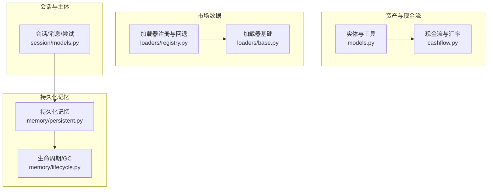
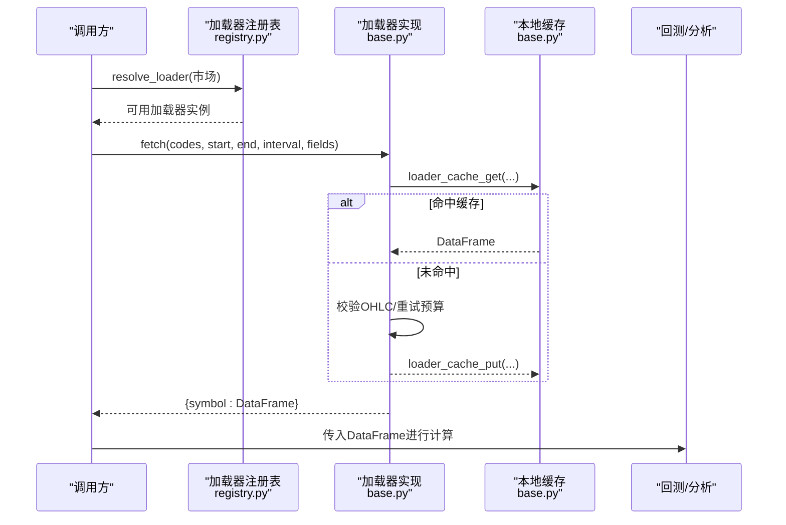
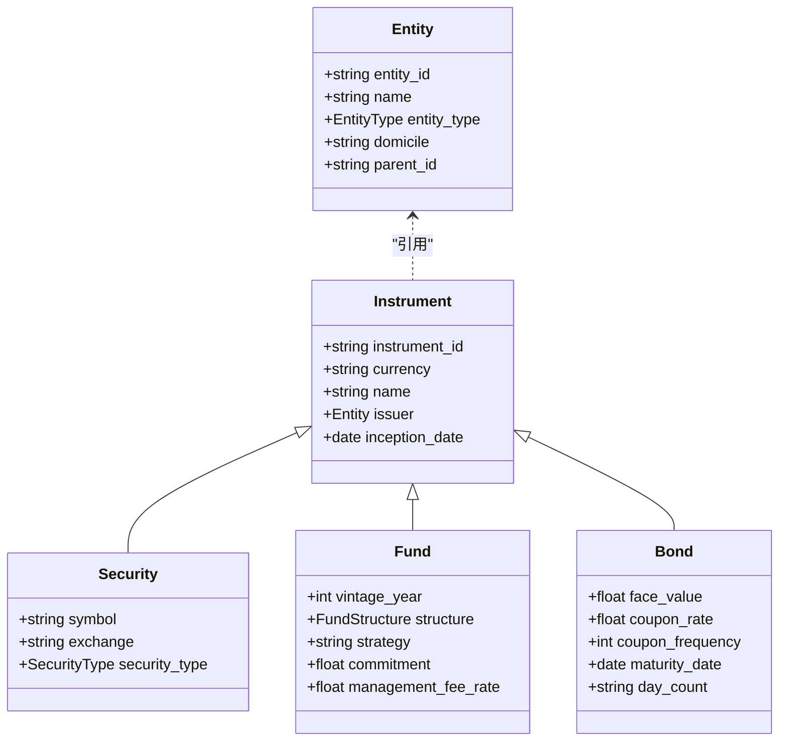
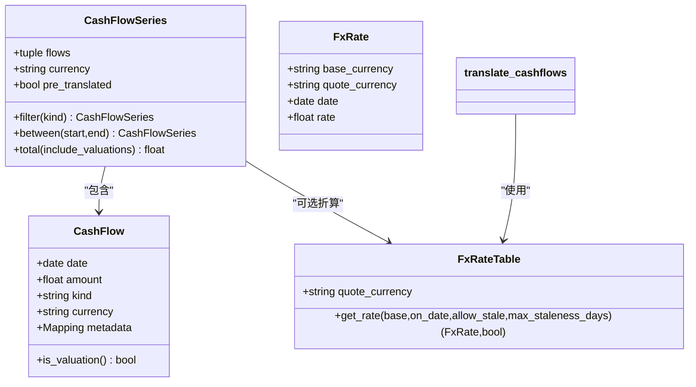
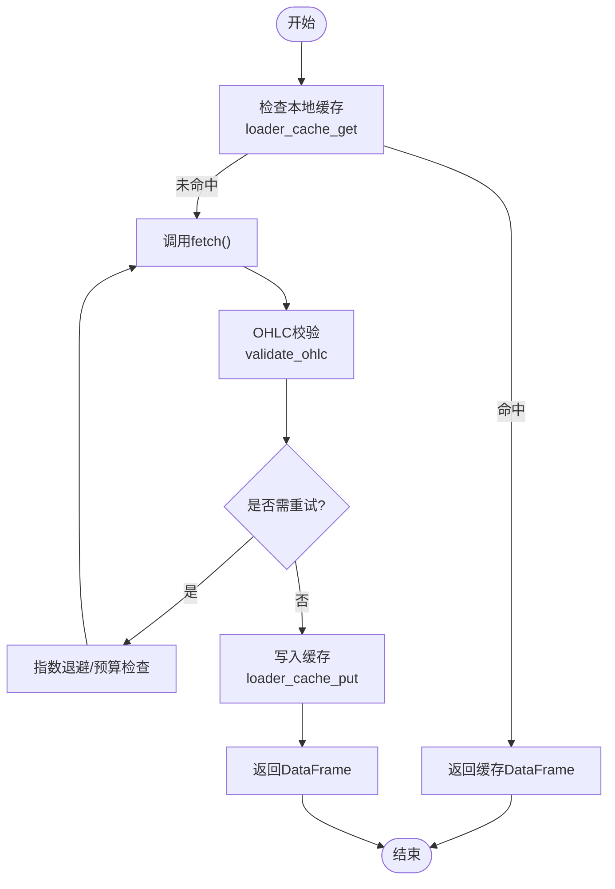
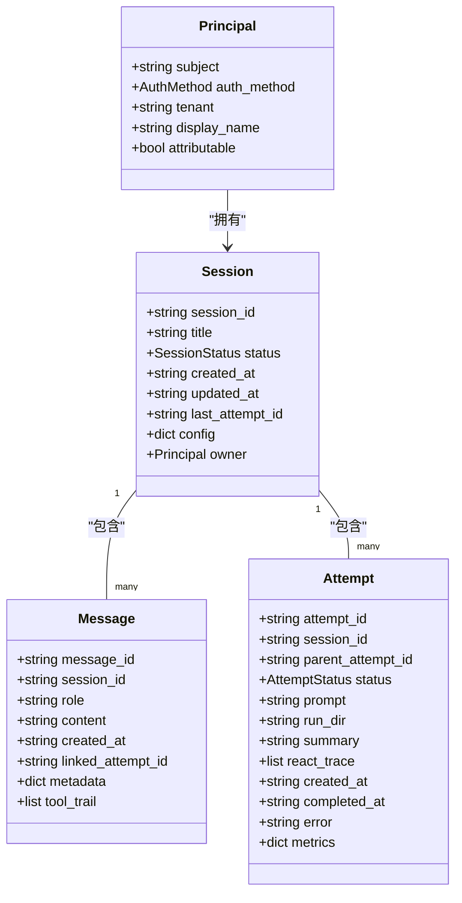
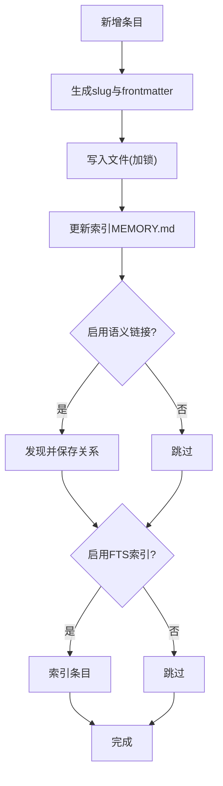
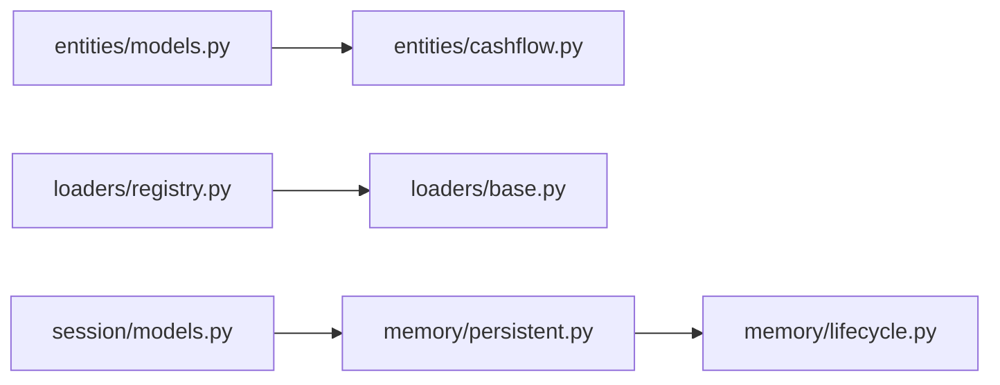

# 数据管理层

<cite>
**本文引用的文件**
- [agent/src/entities/models.py](file://agent/src/entities/models.py)
- [agent/src/entities/cashflow.py](file://agent/src/entities/cashflow.py)
- [agent/backtest/loaders/base.py](file://agent/backtest/loaders/base.py)
- [agent/backtest/loaders/registry.py](file://agent/backtest/loaders/registry.py)
- [agent/src/memory/persistent.py](file://agent/src/memory/persistent.py)
- [agent/src/memory/lifecycle.py](file://agent/src/memory/lifecycle.py)
- [agent/src/session/models.py](file://agent/src/session/models.py)
</cite>

## 目录
1. [简介](#简介)
2. [项目结构](#项目结构)
3. [核心组件](#核心组件)
4. [架构总览](#架构总览)
5. [详细组件分析](#详细组件分析)
6. [依赖关系分析](#依赖关系分析)
7. [性能考虑](#性能考虑)
8. [故障排查指南](#故障排查指南)
9. [结论](#结论)
10. [附录](#附录)

## 简介
本文件为 Vibe-Trading 的数据管理层提供综合数据模型文档，覆盖实体关系、字段定义与数据类型、主键/外键、索引与约束、数据验证规则与业务规则、数据库模式图与示例数据、数据访问模式、缓存策略与性能考量、数据生命周期与归档规则、数据迁移与版本管理、数据安全与隐私以及访问控制。重点说明数据模型设计、缓存系统架构和数据管道处理。

## 项目结构
数据管理层由以下子域组成：
- 资产参考与现金流模型：描述非K线资产（基金、债券、证券）及现金流序列、汇率表等。
- 市场数据加载器：统一的市场数据协议、校验、重试与本地缓存。
- 会话与主体：会话、消息、执行尝试与认证主体模型。
- 持久化记忆：跨会话的本地文件型记忆存储、检索、质量衰减与垃圾回收。

**图表来源**
- [agent/src/entities/models.py:1-397](file://agent/src/entities/models.py#L1-L397)
- [agent/src/entities/cashflow.py:1-769](file://agent/src/entities/cashflow.py#L1-L769)
- [agent/backtest/loaders/base.py:1-645](file://agent/backtest/loaders/base.py#L1-L645)
- [agent/backtest/loaders/registry.py:1-249](file://agent/backtest/loaders/registry.py#L1-L249)
- [agent/src/session/models.py:1-342](file://agent/src/session/models.py#L1-L342)
- [agent/src/memory/persistent.py:1-637](file://agent/src/memory/persistent.py#L1-L637)
- [agent/src/memory/lifecycle.py:1-421](file://agent/src/memory/lifecycle.py#L1-L421)

**章节来源**
- [agent/src/entities/models.py:1-397](file://agent/src/entities/models.py#L1-L397)
- [agent/src/entities/cashflow.py:1-769](file://agent/src/entities/cashflow.py#L1-L769)
- [agent/backtest/loaders/base.py:1-645](file://agent/backtest/loaders/base.py#L1-L645)
- [agent/backtest/loaders/registry.py:1-249](file://agent/backtest/loaders/registry.py#L1-L249)
- [agent/src/session/models.py:1-342](file://agent/src/session/models.py#L1-L342)
- [agent/src/memory/persistent.py:1-637](file://agent/src/memory/persistent.py#L1-L637)
- [agent/src/memory/lifecycle.py:1-421](file://agent/src/memory/lifecycle.py#L1-L421)

## 核心组件
- 实体与工具：Entity、Instrument、Security、Fund、Bond；货币与日期规范化函数。
- 现金流与汇率：CashFlow、CashFlowSeries、FxRate、FxRateTable、translate_cashflows。
- 加载器协议与缓存：DataLoaderProtocol、OHLC校验、重试预算、本地Parquet缓存。
- 会话与主体：Session、Message、Attempt、Principal、AuthMethod。
- 持久化记忆：MemoryEntry、PersistentMemory、重要性衰减、去重、FTS索引、语义链接。
- 生命周期与GC：质量评分、访问追踪、归档/删除阈值、压缩流水线。

**章节来源**
- [agent/src/entities/models.py:1-397](file://agent/src/entities/models.py#L1-L397)
- [agent/src/entities/cashflow.py:1-769](file://agent/src/entities/cashflow.py#L1-L769)
- [agent/backtest/loaders/base.py:1-645](file://agent/backtest/loaders/base.py#L1-L645)
- [agent/src/session/models.py:1-342](file://agent/src/session/models.py#L1-L342)
- [agent/src/memory/persistent.py:1-637](file://agent/src/memory/persistent.py#L1-L637)
- [agent/src/memory/lifecycle.py:1-421](file://agent/src/memory/lifecycle.py#L1-L421)

## 架构总览
数据流从外部数据源经加载器获取OHLCV，经过校验与本地缓存后进入回测引擎；同时，非K线资产通过实体与现金流模型表达，支持多币种折算与汇总。会话层记录用户交互与执行尝试，持久化记忆用于跨会话知识沉淀与检索。

**图表来源**
- [agent/backtest/loaders/registry.py:158-193](file://agent/backtest/loaders/registry.py#L158-L193)
- [agent/backtest/loaders/base.py:343-439](file://agent/backtest/loaders/base.py#L343-L439)
- [agent/backtest/loaders/base.py:50-119](file://agent/backtest/loaders/base.py#L50-L119)

## 详细组件分析

### 实体与工具模型（非K线资产）
- 实体角色：Entity（发行方/管理人/对手方等），带稳定ID、名称、类型、辖区、父实体。
- 工具基类：Instrument（稳定ID、货币、名称、发行方、成立日），强制货币字段并规范化。
- 证券：Security（交易所代码、交易场所、证券类型）。
- 基金：Fund（结构、策略、承诺金额、管理费比率），范围校验。
- 债券：Bond（面值、票息、频率、到期日、计息基准），一致性校验。
- 辅助：normalize_currency、normalize_date。

**图表来源**
- [agent/src/entities/models.py:141-397](file://agent/src/entities/models.py#L141-L397)

**章节来源**
- [agent/src/entities/models.py:38-138](file://agent/src/entities/models.py#L38-L138)
- [agent/src/entities/models.py:141-397](file://agent/src/entities/models.py#L141-L397)

### 现金流与汇率模型
- 现金流：CashFlow（日期、金额、种类、货币、元数据），严格符号约定与种类方向校验。
- 现金流序列：CashFlowSeries（有序、不可变、单币种或显式预折算），过滤、区间选择、合计（默认排除估值标记）。
- 汇率：FxRate（基准/报价货币、日期、汇率）、FxRateTable（固定报价货币的汇率表），查找支持“允许陈旧”与最大陈旧天数。
- 折算：translate_cashflows（按每笔结算日汇率折算，保留原始金额/货币/汇率信息于元数据）。

**图表来源**
- [agent/src/entities/cashflow.py:121-423](file://agent/src/entities/cashflow.py#L121-L423)
- [agent/src/entities/cashflow.py:443-681](file://agent/src/entities/cashflow.py#L443-L681)
- [agent/src/entities/cashflow.py:684-769](file://agent/src/entities/cashflow.py#L684-L769)

**章节来源**
- [agent/src/entities/cashflow.py:62-88](file://agent/src/entities/cashflow.py#L62-L88)
- [agent/src/entities/cashflow.py:121-423](file://agent/src/entities/cashflow.py#L121-L423)
- [agent/src/entities/cashflow.py:443-681](file://agent/src/entities/cashflow.py#L443-L681)
- [agent/src/entities/cashflow.py:684-769](file://agent/src/entities/cashflow.py#L684-L769)

### 市场数据加载器与缓存
- 协议：DataLoaderProtocol（name/markets/requires_auth/is_available/fetch）。
- 校验：validate_ohlc（结构性不变量与正价格策略）。
- 重试与预算：retry_with_budget、check_budget（超时保护）。
- 本地缓存：基于内容寻址的key、Parquet存储、DuckDB读写、原子替换、索引列与dtype恢复、仅对已结算范围缓存。
- 便捷封装：cached_loader_fetch。

**图表来源**
- [agent/backtest/loaders/base.py:343-439](file://agent/backtest/loaders/base.py#L343-L439)
- [agent/backtest/loaders/base.py:50-119](file://agent/backtest/loaders/base.py#L50-L119)
- [agent/backtest/loaders/base.py:184-236](file://agent/backtest/loaders/base.py#L184-L236)

**章节来源**
- [agent/backtest/loaders/base.py:27-119](file://agent/backtest/loaders/base.py#L27-L119)
- [agent/backtest/loaders/base.py:184-236](file://agent/backtest/loaders/base.py#L184-L236)
- [agent/backtest/loaders/base.py:243-439](file://agent/backtest/loaders/base.py#L243-L439)
- [agent/backtest/loaders/base.py:475-595](file://agent/backtest/loaders/base.py#L475-L595)
- [agent/backtest/loaders/base.py:618-645](file://agent/backtest/loaders/base.py#L618-L645)

### 加载器注册与回退链
- 全局注册表：LOADER_REGISTRY，通过@register装饰器自动注册。
- 有效来源集合：VALID_SOURCES（含auto）。
- 回退链：FALLBACK_CHAINS（按市场类型排序，优先低封禁风险与高质量源）。
- 解析：resolve_loader（遍历回退链，首个is_available=true即返回）。
- 指定源回退：get_loader_cls_with_fallback（local/qveris不静默降级到网络源）。

**章节来源**
- [agent/backtest/loaders/registry.py:23-59](file://agent/backtest/loaders/registry.py#L23-L59)
- [agent/backtest/loaders/registry.py:62-124](file://agent/backtest/loaders/registry.py#L62-L124)
- [agent/backtest/loaders/registry.py:136-155](file://agent/backtest/loaders/registry.py#L136-L155)
- [agent/backtest/loaders/registry.py:158-249](file://agent/backtest/loaders/registry.py#L158-L249)

### 会话、消息与执行尝试
- Principal：主体标识、认证方法、可归因性、租户与显示名。
- Session：会话ID、标题、状态、时间戳、配置、所有者。
- Message：消息ID、会话ID、角色、内容、时间戳、关联尝试、元数据、工具轨迹。
- Attempt：尝试ID、会话ID、父尝试、状态、提示、运行目录、摘要、ReAct轨迹、时间戳、错误、指标快照。

**图表来源**
- [agent/src/session/models.py:40-118](file://agent/src/session/models.py#L40-L118)
- [agent/src/session/models.py:140-342](file://agent/src/session/models.py#L140-L342)

**章节来源**
- [agent/src/session/models.py:16-37](file://agent/src/session/models.py#L16-L37)
- [agent/src/session/models.py:40-118](file://agent/src/session/models.py#L40-L118)
- [agent/src/session/models.py:121-138](file://agent/src/session/models.py#L121-L138)
- [agent/src/session/models.py:140-342](file://agent/src/session/models.py#L140-L342)

### 持久化记忆与生命周期
- MemoryEntry：路径、标题、描述、类型、正文、时间戳、ID、关键词、质量分、访问计数、最后访问时间、重要性、相关记忆、分类、压缩级别。
- PersistentMemory：扫描、索引、搜索（FTS5或词法）、去重、添加、删除、重建索引。
- MemoryLifecycle：质量强化、访问追踪、垃圾回收（归档/删除阈值）、压缩流水线集成。

**图表来源**
- [agent/src/memory/persistent.py:462-578](file://agent/src/memory/persistent.py#L462-L578)

**章节来源**
- [agent/src/memory/persistent.py:122-143](file://agent/src/memory/persistent.py#L122-L143)
- [agent/src/memory/persistent.py:196-307](file://agent/src/memory/persistent.py#L196-L307)
- [agent/src/memory/persistent.py:358-438](file://agent/src/memory/persistent.py#L358-L438)
- [agent/src/memory/persistent.py:462-578](file://agent/src/memory/persistent.py#L462-L578)
- [agent/src/memory/lifecycle.py:71-98](file://agent/src/memory/lifecycle.py#L71-L98)
- [agent/src/memory/lifecycle.py:112-158](file://agent/src/memory/lifecycle.py#L112-L158)
- [agent/src/memory/lifecycle.py:183-273](file://agent/src/memory/lifecycle.py#L183-L273)

## 依赖关系分析
- 实体与现金流：依赖货币/日期规范化；现金流系列依赖汇率表进行折算。
- 加载器：依赖注册表进行市场到源的映射与回退；依赖基础模块进行校验与缓存。
- 会话：独立模型，供上层API与服务使用。
- 记忆：依赖配置开关（质量、衰减、GC、FTS、链接）与文件系统锁。

**图表来源**
- [agent/src/entities/models.py:1-397](file://agent/src/entities/models.py#L1-L397)
- [agent/src/entities/cashflow.py:1-769](file://agent/src/entities/cashflow.py#L1-L769)
- [agent/backtest/loaders/registry.py:1-249](file://agent/backtest/loaders/registry.py#L1-L249)
- [agent/backtest/loaders/base.py:1-645](file://agent/backtest/loaders/base.py#L1-L645)
- [agent/src/session/models.py:1-342](file://agent/src/session/models.py#L1-L342)
- [agent/src/memory/persistent.py:1-637](file://agent/src/memory/persistent.py#L1-L637)
- [agent/src/memory/lifecycle.py:1-421](file://agent/src/memory/lifecycle.py#L1-L421)

**章节来源**
- [agent/backtest/loaders/registry.py:158-249](file://agent/backtest/loaders/registry.py#L158-L249)
- [agent/backtest/loaders/base.py:243-439](file://agent/backtest/loaders/base.py#L243-L439)
- [agent/src/memory/persistent.py:196-307](file://agent/src/memory/persistent.py#L196-L307)
- [agent/src/memory/lifecycle.py:183-273](file://agent/src/memory/lifecycle.py#L183-L273)

## 性能考虑
- 加载器缓存：内容寻址key避免重复请求；仅缓存已结算范围；DuckDB读写提升IO效率；原子替换保证一致性。
- OHLC校验：在加载边界一次性清理无效K线，避免下游NaN/Inf污染。
- 重试与预算：限制失败时的重试次数与总耗时，防止长时间阻塞。
- 记忆检索：FTS5加速全文检索；滑动窗口去重减少重复写入；重要性衰减降低冷数据权重。
- GC与压缩：基于重要性阈值归档/删除；压缩流水线降低旧条目体积。

[本节为通用指导，无需特定文件来源]

## 故障排查指南
- 无可用数据源：当所有候选加载器不可用时抛出异常，检查网络与令牌配置。
- 缓存损坏：读取失败时记录警告并回退到在线源；确保缓存目录权限正确。
- OHLC违规：根据策略丢弃/警告/抛出异常；检查数据源质量。
- 现金流符号错误：违反种类方向将抛出异常；核对输入金额符号。
- 汇率缺失：找不到结算日汇率时抛出异常；可选择允许陈旧但会标注。
- 记忆写入冲突：文件锁超时记录警告；确认并发写入场景。

**章节来源**
- [agent/backtest/loaders/registry.py:158-193](file://agent/backtest/loaders/registry.py#L158-L193)
- [agent/backtest/loaders/base.py:50-119](file://agent/backtest/loaders/base.py#L50-L119)
- [agent/backtest/loaders/base.py:184-236](file://agent/backtest/loaders/base.py#L184-L236)
- [agent/src/entities/cashflow.py:144-184](file://agent/src/entities/cashflow.py#L144-L184)
- [agent/src/entities/cashflow.py:610-681](file://agent/src/entities/cashflow.py#L610-L681)
- [agent/src/memory/persistent.py:41-73](file://agent/src/memory/persistent.py#L41-L73)

## 结论
该数据管理层以强类型、不可变模型为核心，结合严格的校验与业务规则，保障数据一致性与可追溯性。市场数据通过统一协议与本地缓存提升鲁棒性与性能；现金流与汇率模型确保多币种处理的严谨性；会话与记忆系统支撑跨会话的知识沉淀与检索。整体设计兼顾可扩展性、安全性与可维护性。

[本节为总结，无需特定文件来源]

## 附录

### 实体关系与字段定义（摘要）
- Entity：entity_id（主键）、name、entity_type、domicile、parent_id（外键指向自身）。
- Instrument：instrument_id（主键）、currency、name、issuer（外键指向Entity）、inception_date。
- Security：继承Instrument，增加symbol、exchange、security_type。
- Fund：继承Instrument，增加vintage_year、structure、strategy、commitment、management_fee_rate。
- Bond：继承Instrument，增加face_value、coupon_rate、coupon_frequency、maturity_date、day_count。
- CashFlow：date、amount、kind、currency、metadata。
- CashFlowSeries：flows（有序）、currency、pre_translated。
- FxRate：base_currency、quote_currency、date、rate。
- FxRateTable：quote_currency、rates（映射）。
- Session：session_id（主键）、title、status、created_at、updated_at、last_attempt_id、config、owner（外键指向Principal）。
- Message：message_id（主键）、session_id（外键）、role、content、created_at、linked_attempt_id、metadata、tool_trail。
- Attempt：attempt_id（主键）、session_id（外键）、parent_attempt_id（自引用）、status、prompt、run_dir、summary、react_trace、created_at、completed_at、error、metrics。

**章节来源**
- [agent/src/entities/models.py:141-397](file://agent/src/entities/models.py#L141-L397)
- [agent/src/entities/cashflow.py:121-423](file://agent/src/entities/cashflow.py#L121-L423)
- [agent/src/entities/cashflow.py:443-681](file://agent/src/entities/cashflow.py#L443-L681)
- [agent/src/session/models.py:140-342](file://agent/src/session/models.py#L140-L342)

### 数据验证规则与业务规则（摘要）
- 货币与日期：统一规范化，拒绝空值与非法格式。
- OHLC：结构性不变量与正价格策略，支持drop/warn/raise。
- 现金流：种类方向与金额符号一致；禁止混币除非显式预折算；估值标记默认不计入合计。
- 汇率：必须为正且有限；查找支持陈旧与最大陈旧天数；避免未来信息泄露。
- 加载器：仅缓存已结算范围；重试预算防止无限等待。
- 记忆：去重窗口、重要性衰减、GC阈值、压缩级别。

**章节来源**
- [agent/src/entities/models.py:68-138](file://agent/src/entities/models.py#L68-L138)
- [agent/backtest/loaders/base.py:50-119](file://agent/backtest/loaders/base.py#L50-L119)
- [agent/backtest/loaders/base.py:328-340](file://agent/backtest/loaders/base.py#L328-L340)
- [agent/src/entities/cashflow.py:144-184](file://agent/src/entities/cashflow.py#L144-L184)
- [agent/src/entities/cashflow.py:610-681](file://agent/src/entities/cashflow.py#L610-L681)
- [agent/src/memory/persistent.py:30-33](file://agent/src/memory/persistent.py#L30-L33)
- [agent/src/memory/lifecycle.py:92-98](file://agent/src/memory/lifecycle.py#L92-L98)

### 数据访问模式与缓存策略（摘要）
- 访问模式：通过注册表解析市场到加载器；统一fetch接口返回DataFrame映射。
- 缓存策略：内容寻址key、Parquet存储、DuckDB读写、索引列与dtype恢复、原子替换；仅对已结算范围缓存。
- 重试与预算：声明式重试与超时保护。

**章节来源**
- [agent/backtest/loaders/registry.py:158-193](file://agent/backtest/loaders/registry.py#L158-L193)
- [agent/backtest/loaders/base.py:243-439](file://agent/backtest/loaders/base.py#L243-L439)
- [agent/backtest/loaders/base.py:475-595](file://agent/backtest/loaders/base.py#L475-L595)

### 数据生命周期、保留策略与归档规则（摘要）
- 重要性衰减：基于质量分、访问次数与最近访问时间计算。
- GC阈值：低于归档阈值则归档；低于删除阈值且启用删除则删除；最小年龄保护。
- 压缩：对老化条目进行压缩以降低体积。

**章节来源**
- [agent/src/memory/persistent.py:75-91](file://agent/src/memory/persistent.py#L75-L91)
- [agent/src/memory/lifecycle.py:92-98](file://agent/src/memory/lifecycle.py#L92-L98)
- [agent/src/memory/lifecycle.py:183-273](file://agent/src/memory/lifecycle.py#L183-L273)

### 数据迁移与版本管理（摘要）
- 加载器缓存版本：通过版本号使旧缓存失效，避免布局变更导致的不一致。
- 会话/主体序列化：to_dict/from_dict保证向后兼容，重新计算派生字段（如attributable）。

**章节来源**
- [agent/backtest/loaders/base.py:243-248](file://agent/backtest/loaders/base.py#L243-L248)
- [agent/src/session/models.py:80-118](file://agent/src/session/models.py#L80-L118)

### 数据安全、隐私与访问控制（摘要）
- 主体与认证：区分可归因与不可归因认证；敏感字段谨慎暴露。
- 记忆安全：文件级锁防止并发写；控制字符清洗；内容截断。
- 加载器安全：本地缓存路径隔离仓库；失败非致命，避免影响主流程。

**章节来源**
- [agent/src/session/models.py:16-37](file://agent/src/session/models.py#L16-L37)
- [agent/src/memory/persistent.py:150-165](file://agent/src/memory/persistent.py#L150-L165)
- [agent/backtest/loaders/base.py:264-281](file://agent/backtest/loaders/base.py#L264-L281)