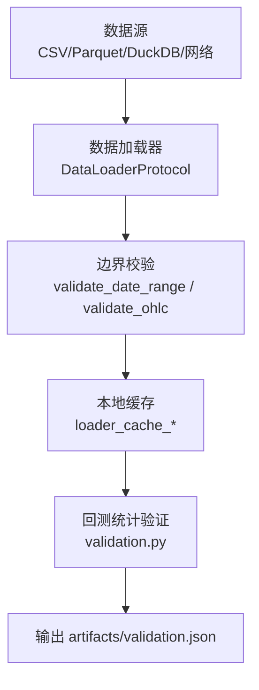
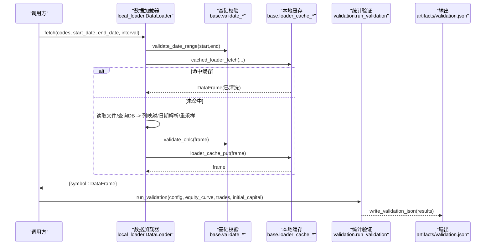
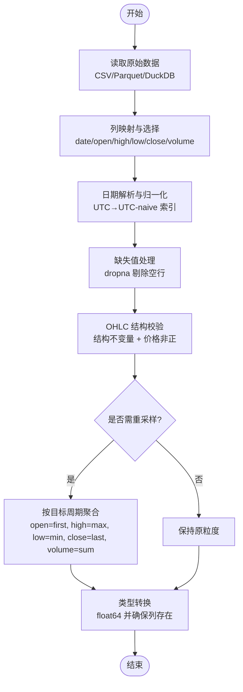
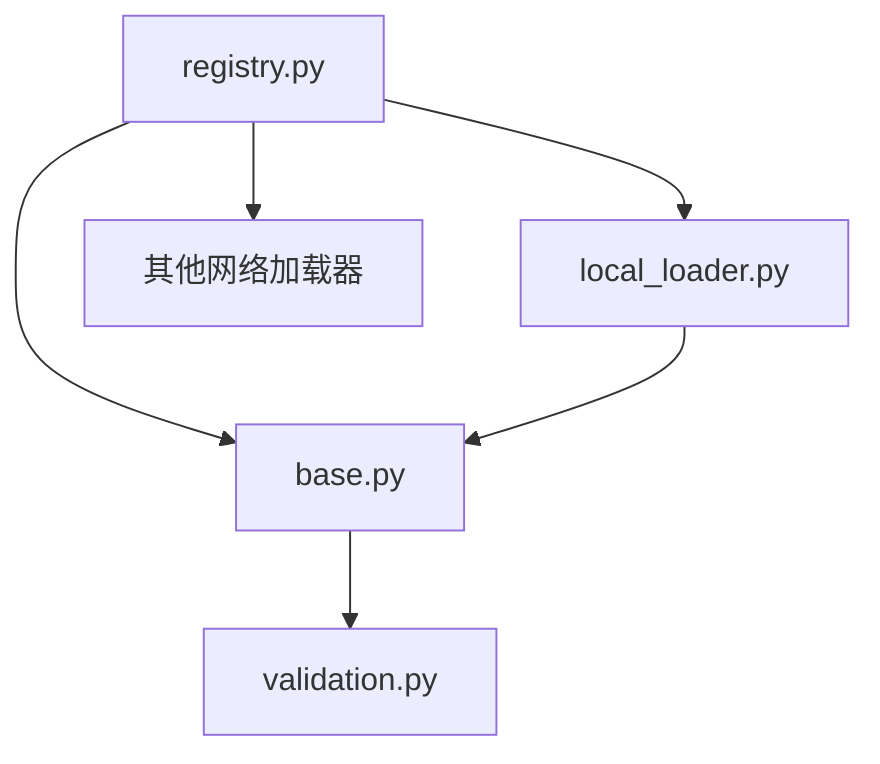

# 数据验证管道

<cite>
**本文引用的文件**
- [agent/backtest/validation.py](file://agent/backtest/validation.py)
- [agent/backtest/loaders/base.py](file://agent/backtest/loaders/base.py)
- [agent/backtest/loaders/local_loader.py](file://agent/backtest/loaders/local_loader.py)
- [agent/backtest/loaders/registry.py](file://agent/backtest/loaders/registry.py)
- [agent/backtest/loaders/_fundamental_schema.py](file://agent/backtest/loaders/_fundamental_schema.py)
- [agent/src/tools/research_reports_tool.py](file://agent/src/tools/research_reports_tool.py)
- [agent/tests/test_engine_robustness.py](file://agent/tests/test_engine_robustness.py)
</cite>

## 目录
1. [简介](#简介)
2. [项目结构](#项目结构)
3. [核心组件](#核心组件)
4. [架构总览](#架构总览)
5. [详细组件分析](#详细组件分析)
6. [依赖关系分析](#依赖关系分析)
7. [性能考量](#性能考量)
8. [故障排查指南](#故障排查指南)
9. [结论](#结论)
10. [附录](#附录)

## 简介
本文件系统化说明 Vibe-Trading 的数据验证管道，覆盖：
- 数据输入验证规则、格式检查与异常处理机制
- 数据清洗流程、缺失值处理与类型转换逻辑
- 验证规则配置、自定义验证器扩展点与错误报告机制
- 数据流图与验证流程图
- 与数据加载器的集成方式及性能优化策略
- 数据质量检查工具与调试方法

该管道贯穿“数据接入 → 清洗校验 → 回测统计验证”的完整链路，确保进入回测引擎的数据具备一致的结构、合理的数值范围与可追溯的质量指标。

## 项目结构
围绕数据验证的关键模块分布如下：
- 数据加载与边界校验：位于 backtest/loaders 下，提供统一的 DataLoader 协议、日期范围校验、OHLC 结构校验、重试与预算控制、本地缓存等能力
- 回测统计验证：backtest/validation.py 提供蒙特卡洛置换检验、Bootstrap Sharpe 置信区间、滚动窗口一致性分析
- 基本面字段规范：_fundamental_schema.py 定义统一字段与派生公式，保证因子计算的一致性
- 工具层通用清洗：research_reports_tool.py 提供文本/日期/数值的通用清洗函数，体现一致的缺失与类型处理范式

图表来源
- [agent/backtest/loaders/base.py:31-119](file://agent/backtest/loaders/base.py#L31-L119)
- [agent/backtest/loaders/base.py:243-439](file://agent/backtest/loaders/base.py#L243-L439)
- [agent/backtest/validation.py:286-341](file://agent/backtest/validation.py#L286-L341)

章节来源
- [agent/backtest/loaders/base.py:31-119](file://agent/backtest/loaders/base.py#L31-L119)
- [agent/backtest/loaders/base.py:243-439](file://agent/backtest/loaders/base.py#L243-L439)
- [agent/backtest/validation.py:286-341](file://agent/backtest/validation.py#L286-L341)

## 核心组件
- 数据加载协议与共享校验
  - DataLoaderProtocol：统一 fetch() 接口，返回 {symbol: DataFrame}
  - validate_date_range：校验起止日期合法性与顺序
  - validate_ohlc：对 OHLC 结构进行不变量校验（高<低、开收被高低包围、价格非正等），支持 drop/warn/raise 策略
- 本地数据加载器
  - local_loader.DataLoader：读取 CSV/Parquet/DuckDB，列映射、日期解析、时间戳归一化、重采样到目标周期、调用 validate_ohlc
- 回测统计验证
  - monte_carlo_test：基于交易 PnL 序列的随机置换检验，评估策略显著性
  - bootstrap_sharpe_ci：基于日收益的 Bootstrap 估计 Sharpe 置信区间
  - walk_forward_analysis：将权益曲线切分为多窗口，评估稳定性与一致性
  - run_validation：按配置启用不同验证项并汇总结果
- 基本面字段规范
  - RAW_FIELDS/DERIVED_FIELDS/SEC_CONCEPT_MAP：统一字段名、派生公式与 SEC 概念别名映射，避免歧义与硬编码

章节来源
- [agent/backtest/loaders/base.py:31-119](file://agent/backtest/loaders/base.py#L31-L119)
- [agent/backtest/loaders/local_loader.py:136-184](file://agent/backtest/loaders/local_loader.py#L136-L184)
- [agent/backtest/loaders/local_loader.py:249-354](file://agent/backtest/loaders/local_loader.py#L249-L354)
- [agent/backtest/validation.py:29-125](file://agent/backtest/validation.py#L29-L125)
- [agent/backtest/validation.py:131-197](file://agent/backtest/validation.py#L131-L197)
- [agent/backtest/validation.py:203-280](file://agent/backtest/validation.py#L203-L280)
- [agent/backtest/validation.py:286-341](file://agent/backtest/validation.py#L286-L341)
- [agent/backtest/loaders/_fundamental_schema.py:28-189](file://agent/backtest/loaders/_fundamental_schema.py#L28-L189)

## 架构总览
数据从多种来源进入，经加载器标准化与校验后，进入回测统计验证阶段，最终产出严格 JSON 的可审计结果。

图表来源
- [agent/backtest/loaders/local_loader.py:249-354](file://agent/backtest/loaders/local_loader.py#L249-L354)
- [agent/backtest/loaders/base.py:31-119](file://agent/backtest/loaders/base.py#L31-L119)
- [agent/backtest/loaders/base.py:343-439](file://agent/backtest/loaders/base.py#L343-L439)
- [agent/backtest/validation.py:286-341](file://agent/backtest/validation.py#L286-L341)
- [agent/backtest/validation.py:434-451](file://agent/backtest/validation.py#L434-L451)

## 详细组件分析

### 数据输入验证规则与格式检查
- 日期范围校验
  - 使用 pd.Timestamp 解析起止日期，若非法或 start > end 抛出 ValueError，阻止后续请求
  - 各加载器在 fetch 入口调用，确保跨源一致性
- OHLC 结构校验
  - 强制结构不变量：high < low、high/low 无法 bracket open/close 视为无效
  - 价格非正校验：默认拒绝 <= 0；允许负价市场时仅拒绝 == 0
  - 策略：drop（默认移除）、warn（记录日志保留）、raise（直接失败）
- 列映射与类型转换
  - 本地加载器支持自定义列名映射，日期列按指定格式解析并转为 UTC-naive 索引
  - OHLCV 列强制 to_numeric 并 dropna，缺失值在清洗阶段剔除
  - volume 缺失时填充为 0.0，保证下游计算稳定

章节来源
- [agent/backtest/loaders/base.py:31-47](file://agent/backtest/loaders/base.py#L31-L47)
- [agent/backtest/loaders/base.py:50-119](file://agent/backtest/loaders/base.py#L50-L119)
- [agent/backtest/loaders/local_loader.py:136-184](file://agent/backtest/loaders/local_loader.py#L136-L184)

### 缺失值处理与类型转换逻辑
- 缺失值
  - 日期解析失败或 OHLC 缺失行会被 dropna 剔除
  - 本地加载器在重采样后再次 dropna，确保无空洞
- 类型转换
  - 日期统一为 UTC-naive 索引，便于跨时区比较
  - 数值列强制 float64，避免混合类型导致的计算异常
- 通用清洗范式
  - research_reports_tool 中的 _clean_text/_clean_date/_to_number 展示了一致的缺失与类型处理模式：空串/非字符串/非数字均返回 None，保持上游契约一致

章节来源
- [agent/backtest/loaders/local_loader.py:157-184](file://agent/backtest/loaders/local_loader.py#L157-L184)
- [agent/src/tools/research_reports_tool.py:305-327](file://agent/src/tools/research_reports_tool.py#L305-L327)

### 异常处理机制
- 加载期异常
  - 日期非法或顺序错误：ValueError，立即中止
  - OHLC 违规：根据策略 raise/warn/drop，warn 时记录日志并继续
  - 网络/IO 异常：通过 retry_with_budget 与 check_budget 实现带预算的重试与快速失败
- 缓存异常
  - 元数据读取失败、Parquet 损坏等均为非致命，记录警告并回退到在线获取
- 验证期异常
  - 参数校验失败（如 n_simulations、confidence、seed）返回含 error 的结果字典，不中断整体流程
  - 权益曲线不足观测数：返回错误信息，避免不稳定估计

章节来源
- [agent/backtest/loaders/base.py:163-236](file://agent/backtest/loaders/base.py#L163-L236)
- [agent/backtest/loaders/base.py:475-511](file://agent/backtest/loaders/base.py#L475-L511)
- [agent/backtest/validation.py:49-58](file://agent/backtest/validation.py#L49-L58)
- [agent/backtest/validation.py:151-165](file://agent/backtest/validation.py#L151-L165)

### 数据清洗流程

图表来源
- [agent/backtest/loaders/local_loader.py:83-126](file://agent/backtest/loaders/local_loader.py#L83-L126)
- [agent/backtest/loaders/local_loader.py:136-184](file://agent/backtest/loaders/local_loader.py#L136-L184)
- [agent/backtest/loaders/base.py:50-119](file://agent/backtest/loaders/base.py#L50-L119)

### 验证规则配置与执行
- 配置入口
  - run_validation 读取 config["validation"] 下的子项：monte_carlo、bootstrap、walk_forward
  - 每个子项为可选字典，包含各自参数（如 n_simulations、confidence、n_windows、seed）
- 执行流程
  - 根据配置逐项运行对应验证函数，收集结果
  - 所有结果通过 write_validation_json 写入 artifacts/validation.json，非有限值被安全转换为 null，确保严格 JSON 兼容
- CLI 独立运行
  - main 自动读取 run_dir 下的 equity.csv、trades.csv、config.json，生成 validation.json 并打印

章节来源
- [agent/backtest/validation.py:286-341](file://agent/backtest/validation.py#L286-L341)
- [agent/backtest/validation.py:434-451](file://agent/backtest/validation.py#L434-L451)
- [agent/backtest/validation.py:454-486](file://agent/backtest/validation.py#L454-L486)

### 自定义验证器开发与扩展点
- 统计验证扩展
  - 可在 run_validation 中新增配置键与分支，封装新的统计检验函数，遵循参数校验与错误返回约定
- 数据加载器扩展
  - 实现 DataLoaderProtocol 并通过 @register 注册，加入 FALLBACK_CHAINS 以参与市场级回退链
  - 复用 base 提供的 validate_date_range、validate_ohlc、retry_with_budget、cached_loader_fetch 等能力
- 基本面字段扩展
  - 在 RAW_FIELDS/DERIVED_FIELDS 中添加新字段与派生公式，必要时补充 SEC_CONCEPT_MAP 别名

章节来源
- [agent/backtest/loaders/registry.py:62-68](file://agent/backtest/loaders/registry.py#L62-L68)
- [agent/backtest/loaders/registry.py:136-155](file://agent/backtest/loaders/registry.py#L136-L155)
- [agent/backtest/loaders/_fundamental_schema.py:196-217](file://agent/backtest/loaders/_fundamental_schema.py#L196-L217)

### 错误报告机制
- 结构化错误
  - 验证函数在参数非法时返回包含 error 字段的字典，便于上层统一处理与展示
- 严格 JSON 输出
  - write_validation_json 使用 _json_safe 将 NaN/Inf 转为 null，并以 allow_nan=False 序列化，确保下游解析器不会崩溃
- 日志与降级
  - 缓存读写失败、网络超时等记录警告并降级，不影响主流程

章节来源
- [agent/backtest/validation.py:49-58](file://agent/backtest/validation.py#L49-L58)
- [agent/backtest/validation.py:151-165](file://agent/backtest/validation.py#L151-L165)
- [agent/backtest/validation.py:419-451](file://agent/backtest/validation.py#L419-L451)
- [agent/backtest/loaders/base.py:475-511](file://agent/backtest/loaders/base.py#L475-L511)

### 数据流图与验证流程图

图表来源
- [agent/backtest/loaders/local_loader.py:249-354](file://agent/backtest/loaders/local_loader.py#L249-L354)
- [agent/backtest/loaders/base.py:31-119](file://agent/backtest/loaders/base.py#L31-L119)
- [agent/backtest/loaders/base.py:343-439](file://agent/backtest/loaders/base.py#L343-L439)
- [agent/backtest/validation.py:286-341](file://agent/backtest/validation.py#L286-L341)
- [agent/backtest/validation.py:434-451](file://agent/backtest/validation.py#L434-L451)

## 依赖关系分析
- 加载器注册与回退链
  - registry 维护 VALID_SOURCES 与 FALLBACK_CHAINS，按市场类型组织优先顺序
  - resolve_loader/get_loader_cls_with_fallback 负责实例化与可用性检查，遇到不可用则沿链条回退
  - local/qveris 标记为禁止静默回退到网络源，避免掩盖用户配置问题
- 与外部库的耦合
  - pandas/numpy：数据处理与统计计算
  - duckdb：缓存读写与高效查询
  - yaml：本地加载器配置解析

图表来源
- [agent/backtest/loaders/registry.py:23-59](file://agent/backtest/loaders/registry.py#L23-L59)
- [agent/backtest/loaders/registry.py:136-155](file://agent/backtest/loaders/registry.py#L136-L155)
- [agent/backtest/loaders/registry.py:158-193](file://agent/backtest/loaders/registry.py#L158-L193)
- [agent/backtest/loaders/base.py:243-439](file://agent/backtest/loaders/base.py#L243-L439)
- [agent/backtest/validation.py:286-341](file://agent/backtest/validation.py#L286-L341)

章节来源
- [agent/backtest/loaders/registry.py:23-59](file://agent/backtest/loaders/registry.py#L23-L59)
- [agent/backtest/loaders/registry.py:136-155](file://agent/backtest/loaders/registry.py#L136-L155)
- [agent/backtest/loaders/registry.py:158-193](file://agent/backtest/loaders/registry.py#L158-L193)

## 性能考量
- 本地缓存
  - 内容寻址 key（source/symbol/timeframe/start/end/fields），仅对已结算日期范围缓存，避免钉住未完成 K 线
  - 使用 Parquet + DuckDB 存储与读取，元数据保存 index 名称与 dtype，尽量保持往返一致性
  - 读/写失败均非致命，保障主流程不受影响
- 重试与预算
  - retry_with_budget 对声明的瞬时异常进行指数退避重试，受 wall-clock deadline 约束，避免无限等待
  - check_budget 用于分页抓取间快速失败，防止超预算
- 统计验证
  - Monte Carlo 与 Bootstrap 支持样本裁剪与内存保护（equity_paths 采样），避免大运行导致内存膨胀
  - walk_forward 将长序列切分，降低单次计算压力并提升稳定性评估可信度

章节来源
- [agent/backtest/loaders/base.py:243-439](file://agent/backtest/loaders/base.py#L243-L439)
- [agent/backtest/loaders/base.py:163-236](file://agent/backtest/loaders/base.py#L163-L236)
- [agent/backtest/validation.py:60-113](file://agent/backtest/validation.py#L60-L113)
- [agent/backtest/validation.py:169-192](file://agent/backtest/validation.py#L169-L192)

## 故障排查指南
- 常见错误定位
  - 日期非法或顺序错误：检查传入 start_date/end_date 格式与大小关系
  - OHLC 违规：确认数据源是否存在 high < low 或非正价格；可通过 validate_ohlc(strategy="warn") 先观察再决定策略
  - 加载器不可用：检查 is_available 条件（网络、令牌、配置文件），查看 registry 的回退链是否命中
- 缓存相关问题
  - 缓存元数据损坏或 Parquet 损坏会触发警告并回退到在线获取；检查缓存根目录与权限
- 验证结果异常
  - 参数非法（如 n_simulations、confidence）会返回 error 字段；检查配置键与取值范围
  - 权益曲线过短会导致 Bootstrap/Walk-Forward 报错；增加数据长度或减少窗口数
- 测试辅助
  - 使用 tests/test_engine_robustness.py 中的断言验证各加载器对反向日期的拒绝行为，确保日期校验生效

章节来源
- [agent/backtest/loaders/base.py:31-47](file://agent/backtest/loaders/base.py#L31-L47)
- [agent/backtest/loaders/base.py:50-119](file://agent/backtest/loaders/base.py#L50-L119)
- [agent/backtest/loaders/base.py:475-511](file://agent/backtest/loaders/base.py#L475-L511)
- [agent/backtest/validation.py:49-58](file://agent/backtest/validation.py#L49-L58)
- [agent/backtest/validation.py:151-165](file://agent/backtest/validation.py#L151-L165)
- [agent/tests/test_engine_robustness.py:476-506](file://agent/tests/test_engine_robustness.py#L476-L506)

## 结论
Vibe-Trading 的数据验证管道以“强边界校验 + 稳健清洗 + 统计验证”为核心，确保进入回测的数据具备一致性与可靠性。通过统一的 DataLoader 协议、可配置的验证规则、严格的 JSON 输出与完善的缓存/重试机制，系统在易用性、鲁棒性与性能之间取得平衡。建议在生产环境中：
- 显式启用 validate_ohlc 并采用 warn/drop 策略逐步收敛脏数据
- 合理配置缓存与重试预算，避免极端场景下的资源耗尽
- 定期审查 validation.json 中的统计指标，识别策略不稳定或数据质量问题

## 附录
- 关键函数路径参考
  - 日期范围校验：[agent/backtest/loaders/base.py:31-47](file://agent/backtest/loaders/base.py#L31-L47)
  - OHLC 校验：[agent/backtest/loaders/base.py:50-119](file://agent/backtest/loaders/base.py#L50-L119)
  - 本地加载器清洗与重采样：[agent/backtest/loaders/local_loader.py:83-126](file://agent/backtest/loaders/local_loader.py#L83-L126), [agent/backtest/loaders/local_loader.py:136-184](file://agent/backtest/loaders/local_loader.py#L136-L184)
  - 统计验证入口：[agent/backtest/validation.py:286-341](file://agent/backtest/validation.py#L286-L341)
  - 严格 JSON 输出：[agent/backtest/validation.py:419-451](file://agent/backtest/validation.py#L419-L451)
  - 基本面字段规范：[agent/backtest/loaders/_fundamental_schema.py:28-189](file://agent/backtest/loaders/_fundamental_schema.py#L28-L189)
  - 加载器注册与回退链：[agent/backtest/loaders/registry.py:23-59](file://agent/backtest/loaders/registry.py#L23-L59), [agent/backtest/loaders/registry.py:136-155](file://agent/backtest/loaders/registry.py#L136-L155)