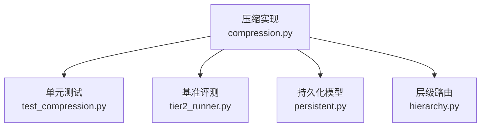
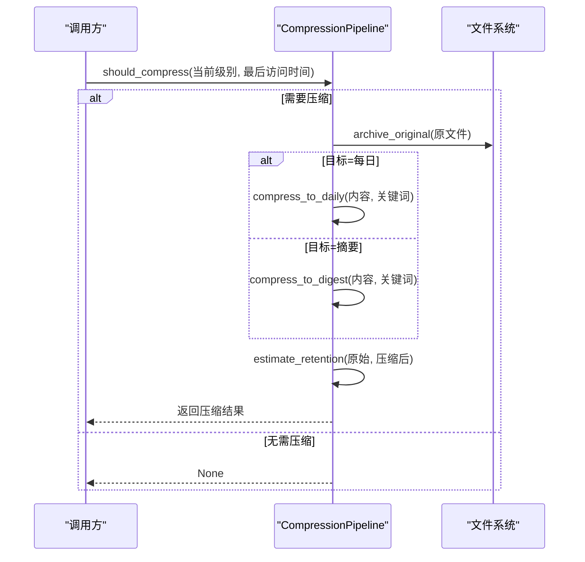
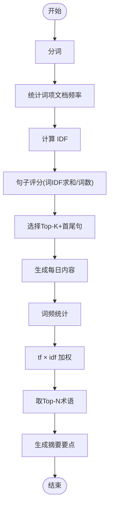
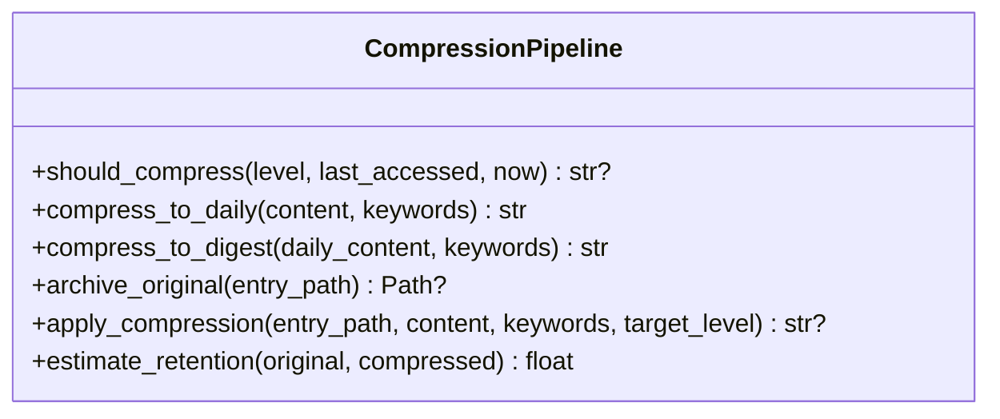
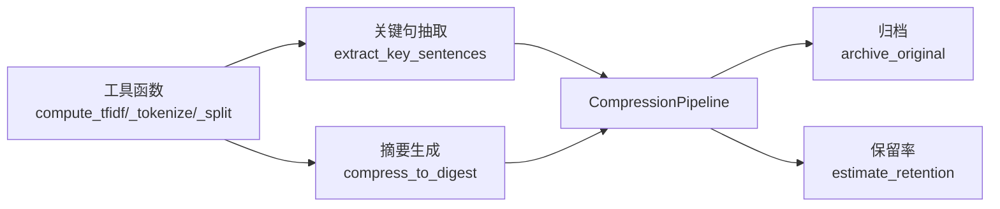

# 压缩管道系统

<cite>
**本文引用的文件**
- [compression.py](file://agent/src/memory/compression.py)
- [test_compression.py](file://agent/tests/memory/test_compression.py)
- [tier2_runner.py](file://agent/tests/memory/benchmarks/tier2_runner.py)
- [persistent.py](file://agent/src/memory/persistent.py)
- [hierarchy.py](file://agent/src/memory/hierarchy.py)
</cite>

## 目录
1. [简介](#简介)
2. [项目结构](#项目结构)
3. [核心组件](#核心组件)
4. [架构总览](#架构总览)
5. [详细组件分析](#详细组件分析)
6. [依赖关系分析](#依赖关系分析)
7. [性能考量](#性能考量)
8. [故障排查指南](#故障排查指南)
9. [结论](#结论)
10. [附录](#附录)

## 简介
本文件为 Vibe-Trading 的“三级压缩管道”提供系统化技术文档。该管道将原始记忆内容按时间衰减策略逐步压缩，形成“原始→每日→摘要”三层表示：
- 原始（raw）：完整文本，保留全部信息。
- 每日（daily）：基于 TF-IDF 的关键句抽取，保留上下文首尾句与 Top-K 高权重句，体积约为原始的约一半。
- 摘要（digest）：基于词频与 IDF 加权的核心概念列表，体积约为原始的 10%–20%，便于快速浏览与检索。

压缩触发条件基于“距上次访问时间”的天数阈值；压缩过程在修改前自动归档原始文件，确保可回溯。系统还提供信息保留率估算（Jaccard 重叠）与基准评测流程，用于评估压缩对检索质量的影响。

## 项目结构
压缩管道位于内存子系统内，围绕以下关键文件组织：
- 实现：agent/src/memory/compression.py
- 单元测试：agent/tests/memory/test_compression.py
- 基准评测：agent/tests/memory/benchmarks/tier2_runner.py
- 持久化模型与生命周期：agent/src/memory/persistent.py
- 层级路由（与压缩配合使用）：agent/src/memory/hierarchy.py

图表来源
- [compression.py:1-353](file://agent/src/memory/compression.py#L1-L353)
- [test_compression.py:1-235](file://agent/tests/memory/test_compression.py#L1-L235)
- [tier2_runner.py:324-424](file://agent/tests/memory/benchmarks/tier2_runner.py#L324-L424)
- [persistent.py:122-143](file://agent/src/memory/persistent.py#L122-L143)
- [hierarchy.py:145-176](file://agent/src/memory/hierarchy.py#L145-L176)

章节来源
- [compression.py:1-353](file://agent/src/memory/compression.py#L1-L353)
- [test_compression.py:1-235](file://agent/tests/memory/test_compression.py#L1-L235)
- [tier2_runner.py:324-424](file://agent/tests/memory/benchmarks/tier2_runner.py#L324-L424)
- [persistent.py:122-143](file://agent/src/memory/persistent.py#L122-L143)
- [hierarchy.py:145-176](file://agent/src/memory/hierarchy.py#L145-L176)

## 核心组件
- CompressionPipeline：三级压缩管道的入口类，封装触发判断、压缩执行、归档与保留率估算。
- TF-IDF 工具函数：compute_tfidf、_score_sentence、extract_key_sentences，负责句子级评分与关键句抽取。
- 关键词提取：compress_to_digest 中通过 tf×idf 计算术语重要性并生成要点列表。
- 归档机制：archive_original 在执行压缩前原子复制原始文件至 archive/ 目录。
- 保留率估算：estimate_retention 使用 Jaccard 相似度衡量压缩前后词汇重叠度。

章节来源
- [compression.py:60-155](file://agent/src/memory/compression.py#L60-L155)
- [compression.py:160-353](file://agent/src/memory/compression.py#L160-L353)

## 架构总览
三级压缩管道以“时间衰减 + 内容抽象”为主线，结合“归档保护”保障数据安全。整体流程如下：

图表来源
- [compression.py:168-334](file://agent/src/memory/compression.py#L168-L334)

## 详细组件分析

### 触发条件与阈值配置
- 触发依据：根据“距上次访问时间”的天数与当前级别决定是否需要压缩及目标级别。
- 阈值：
  - 原始→每日：超过 7 天未访问。
  - 每日→摘要：超过 30 天未访问。
- 决策逻辑：
  - 若当前为 raw 且超过 7 天 → 目标 daily。
  - 若当前为 daily 且超过 30 天 → 目标 digest。
  - 其他情况不触发。

章节来源
- [compression.py:23-39](file://agent/src/memory/compression.py#L23-L39)
- [compression.py:168-192](file://agent/src/memory/compression.py#L168-L192)
- [test_compression.py:58-89](file://agent/tests/memory/test_compression.py#L58-L89)

### 关键词提取与 TF-IDF 应用
- 分词：统一使用非拉丁字符范围与 ASCII 单词（≥3 字符）的正则模式进行分词，保证中英文等多语言一致性。
- IDF 计算：以句子为文档集合，统计词项文档频率 df(t)，IDF = log(N / (1 + df(t)))。
- 句子评分：句子得分 = 句中各词 IDF 之和 / 词数，用于排序。
- 关键句抽取：始终保留首尾句，再从中间句子选取 Top-K 高分句，拼接为压缩后的每日内容。
- 摘要关键词：对每日内容做词频统计，结合句子级 IDF 加权得到术语分数，取 Top-N 作为摘要要点。

图表来源
- [compression.py:60-155](file://agent/src/memory/compression.py#L60-L155)
- [compression.py:220-256](file://agent/src/memory/compression.py#L220-L256)

章节来源
- [compression.py:60-155](file://agent/src/memory/compression.py#L60-L155)
- [compression.py:220-256](file://agent/src/memory/compression.py#L220-L256)
- [test_compression.py:209-235](file://agent/tests/memory/test_compression.py#L209-L235)

### 信息保留率计算
- 指标：Jaccard 相似度，即压缩前后 token 集合交集大小除以并集大小。
- 用途：量化压缩导致的信息损失，辅助调参与回归测试。
- 边界处理：空文本时返回 1.0；仅一方为空时返回 0.0。

章节来源
- [compression.py:336-353](file://agent/src/memory/compression.py#L336-L353)
- [test_compression.py:149-168](file://agent/tests/memory/test_compression.py#L149-L168)

### 压缩策略选择逻辑
- 策略一（原始→每日）：关键句抽取，保留上下文首尾句与 Top-K 句，适合中等压缩比与信息保留。
- 策略二（每日→摘要）：术语要点列表，适合高压缩比与概览阅读。
- 策略选择由 should_compress 决定，结合当前级别与时间阈值。

章节来源
- [compression.py:168-192](file://agent/src/memory/compression.py#L168-L192)
- [compression.py:194-256](file://agent/src/memory/compression.py#L194-L256)

### CompressionPipeline 核心方法
- should_compress(compression_level, last_accessed, now)
  - 输入：当前级别、最后访问时间戳、当前时间。
  - 输出：目标级别或 None。
  - 行为：按天数阈值判定是否触发压缩。
- compress_to_daily(content, keywords)
  - 行为：句子切分 → IDF 计算 → 关键句抽取 → 可选关键词头。
  - 输出：压缩后的每日内容。
- compress_to_digest(daily_content, keywords)
  - 行为：词频统计 → 句子级 IDF 加权 → 取 Top-N 术语 → 生成要点列表。
  - 输出：摘要内容。
- archive_original(entry_path)
  - 行为：原子复制原文件到 archive/ 目录，失败时清理临时文件并记录日志。
  - 输出：归档路径或 None。
- apply_compression(entry_path, content, keywords, target_level)
  - 行为：先归档，再按目标级别执行压缩，计算保留率并记录日志。
  - 输出：压缩内容或 None。
- estimate_retention(original, compressed)
  - 行为：Jaccard 相似度估算。
  - 输出：0.0–1.0 的保留率。

图表来源
- [compression.py:160-353](file://agent/src/memory/compression.py#L160-L353)

章节来源
- [compression.py:160-353](file://agent/src/memory/compression.py#L160-L353)

### 与持久化与层级系统的集成
- 持久化模型 MemoryEntry 包含 compression_level 字段，可用于追踪条目所处压缩级别。
- 层级路由 MemoryHierarchy 支持按类别扫描与归档目录跳过，避免误处理压缩产物。
- 压缩管道与层级系统协同，可在分类目录下安全执行压缩与归档。

章节来源
- [persistent.py:122-143](file://agent/src/memory/persistent.py#L122-L143)
- [hierarchy.py:145-176](file://agent/src/memory/hierarchy.py#L145-L176)

## 依赖关系分析
- 模块内依赖：
  - compute_tfidf、_tokenize_for_tfidf、_split_sentences 被 extract_key_sentences 与 compress_to_digest 复用。
  - CompressionPipeline 组合上述工具函数完成端到端压缩。
- 外部依赖：
  - 标准库：math、re、shutil、os、time、logging、collections.Counter、pathlib.Path。
- 测试与基准：
  - test_compression.py 覆盖触发条件、压缩输出格式、保留率估算与归档行为。
  - tier2_runner.py 提供端到端评测：批量压缩、检索质量对比（P@5）、平均保留率等。

图表来源
- [compression.py:60-155](file://agent/src/memory/compression.py#L60-L155)
- [compression.py:160-353](file://agent/src/memory/compression.py#L160-L353)

章节来源
- [compression.py:60-155](file://agent/src/memory/compression.py#L60-L155)
- [compression.py:160-353](file://agent/src/memory/compression.py#L160-L353)
- [test_compression.py:1-235](file://agent/tests/memory/test_compression.py#L1-L235)
- [tier2_runner.py:324-424](file://agent/tests/memory/benchmarks/tier2_runner.py#L324-L424)

## 性能考量
- 时间复杂度：
  - IDF 计算：O(D·T)，D 为句子数，T 为每句词数。
  - 句子评分：O(S·T)，S 为句子总数。
  - 摘要术语打分：O(U·logU)，U 为唯一词项数。
- 空间复杂度：
  - 主要占用为文档频率计数与评分列表，随语料规模线性增长。
- 优化建议：
  - 对超大语料可分批计算 IDF 或使用近似方法。
  - 调整 DAILY_TOP_K_SENTENCES 与 DIGEST_TOP_KEYWORDS 平衡压缩比与信息保留。
  - 缓存 IDF 结果以减少重复计算（当同一语料多次压缩时）。
  - 使用并行分词与评分以提升吞吐（注意线程安全）。

[本节为通用性能讨论，不直接分析具体文件]

## 故障排查指南
- 归档失败
  - 现象：apply_compression 返回 None 并记录错误日志。
  - 可能原因：权限不足、磁盘空间不足、路径不存在。
  - 处理：检查 archive/ 目录权限与空间，确认 entry_path 存在。
- 压缩结果为空或过短
  - 现象：compress_to_daily/digest 返回内容与预期不符。
  - 可能原因：输入文本过短、分词异常、关键词为空。
  - 处理：检查输入文本长度与编码，确认分词正则匹配预期。
- 保留率过低
  - 现象：estimate_retention 返回值偏低。
  - 可能原因：压缩过度、关键词缺失、TF-IDF 权重分布异常。
  - 处理：调大 DAILY_TOP_K_SENTENCES 或 DIGEST_TOP_KEYWORDS，增加关键词上下文。
- 触发条件不生效
  - 现象：should_compress 返回 None。
  - 可能原因：last_accessed 较新、阈值配置过大、级别已为 digest。
  - 处理：核对时间戳与阈值，确认当前级别。

章节来源
- [compression.py:258-334](file://agent/src/memory/compression.py#L258-L334)
- [test_compression.py:176-202](file://agent/tests/memory/test_compression.py#L176-L202)

## 结论
Vibe-Trading 的三级压缩管道以 TF-IDF 为核心，结合时间衰减触发与原子归档机制，实现了从原始到每日再到摘要的可控压缩流程。通过 Jaccard 保留率与基准评测（P@5、MRR、NDCG），可量化压缩对检索质量的影响。建议在大规模场景下引入缓存与并行优化，并根据业务需求动态调整阈值与参数，以获得最佳压缩比与信息保留平衡。

[本节为总结性内容，不直接分析具体文件]

## 附录

### 使用示例（代码片段路径）
- 压缩到每日：
  - [压缩到每日示例路径:98-119](file://agent/tests/memory/test_compression.py#L98-L119)
- 压缩到摘要：
  - [压缩到摘要示例路径:128-142](file://agent/tests/memory/test_compression.py#L128-L142)
- 归档与执行压缩：
  - [归档与执行压缩示例路径:176-202](file://agent/tests/memory/test_compression.py#L176-L202)
- 保留率估算：
  - [保留率估算示例路径:149-168](file://agent/tests/memory/test_compression.py#L149-L168)
- 基准评测（批量压缩与检索质量）：
  - [基准评测入口路径:324-424](file://agent/tests/memory/benchmarks/tier2_runner.py#L324-L424)

章节来源
- [test_compression.py:98-142](file://agent/tests/memory/test_compression.py#L98-L142)
- [test_compression.py:176-202](file://agent/tests/memory/test_compression.py#L176-L202)
- [test_compression.py:149-168](file://agent/tests/memory/test_compression.py#L149-L168)
- [tier2_runner.py:324-424](file://agent/tests/memory/benchmarks/tier2_runner.py#L324-L424)