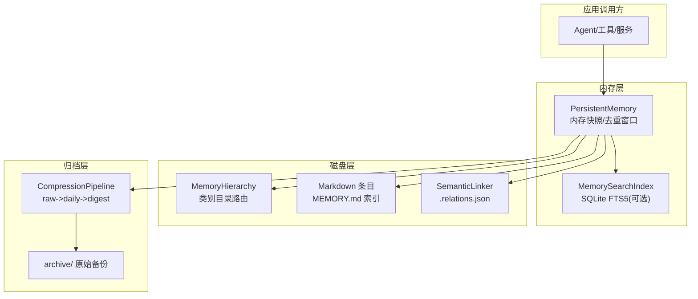
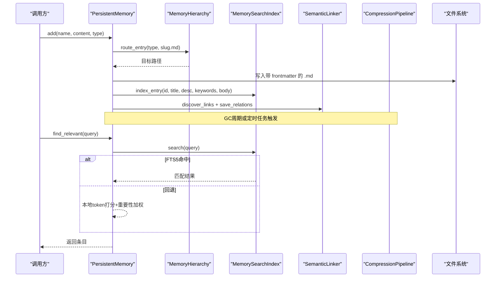
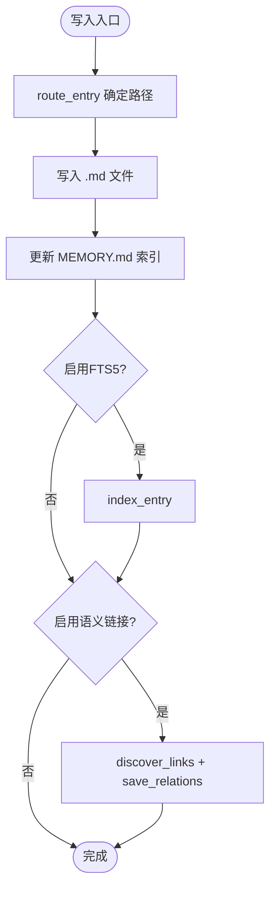
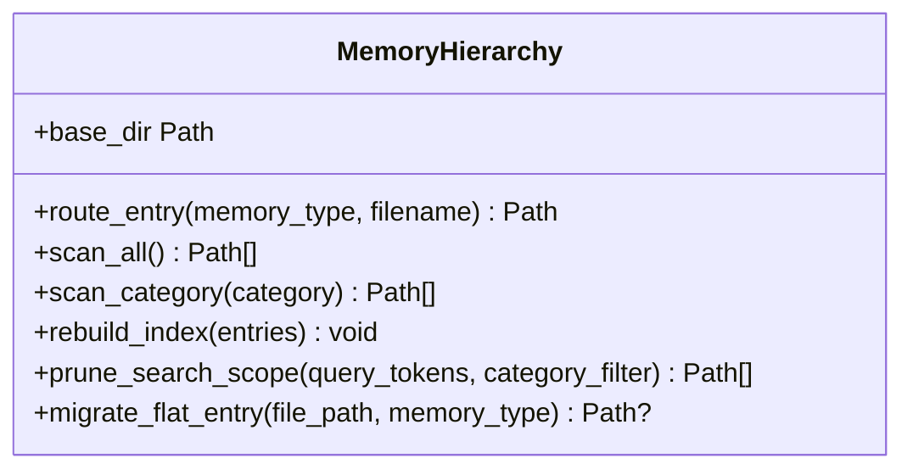
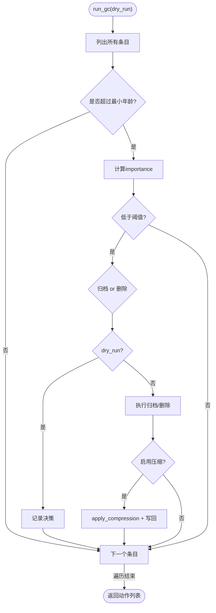
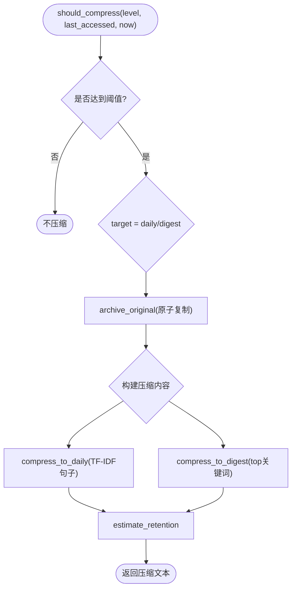
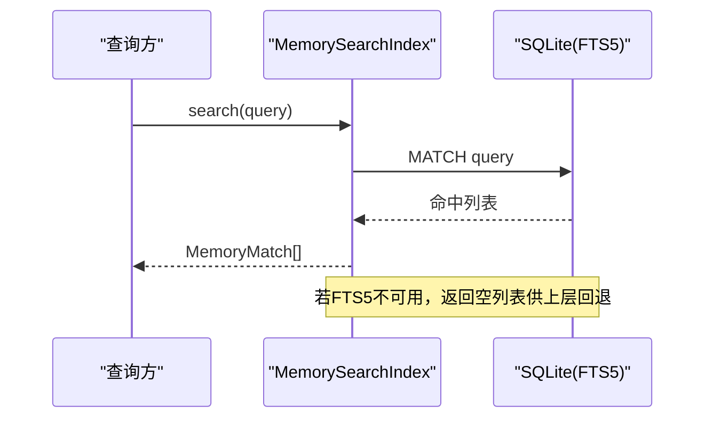
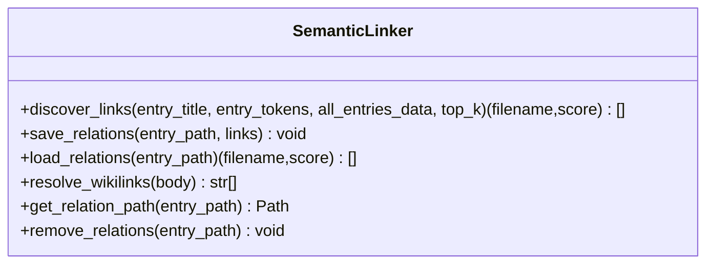
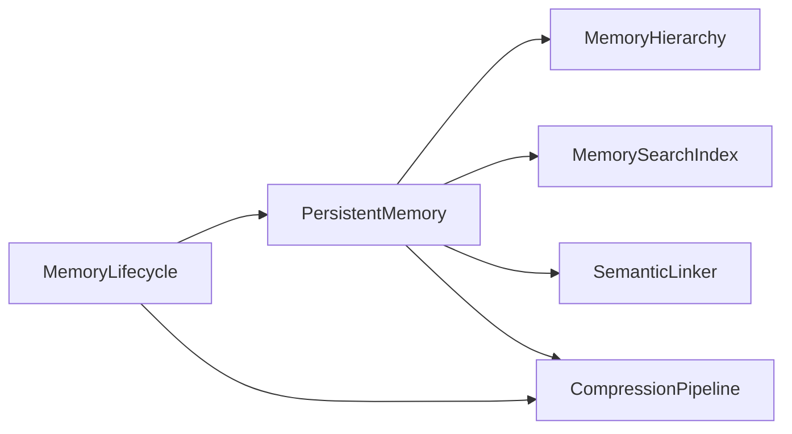
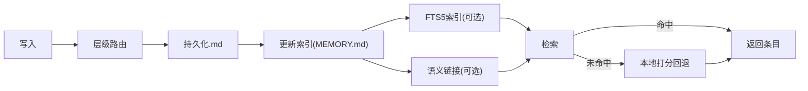

# 层次化存储管理

<cite>
**本文引用的文件**
- [persistent.py](file://agent/src/memory/persistent.py)
- [hierarchy.py](file://agent/src/memory/hierarchy.py)
- [lifecycle.py](file://agent/src/memory/lifecycle.py)
- [compression.py](file://agent/src/memory/compression.py)
- [search_index.py](file://agent/src/memory/search_index.py)
- [semantic_links.py](file://agent/src/memory/semantic_links.py)
- [accessor.py](file://agent/src/config/accessor.py)
- [env_schema.py](file://agent/src/config/env_schema.py)
</cite>

## 目录
1. [简介](#简介)
2. [项目结构](#项目结构)
3. [核心组件](#核心组件)
4. [架构总览](#架构总览)
5. [详细组件分析](#详细组件分析)
6. [依赖关系分析](#依赖关系分析)
7. [性能考量](#性能考量)
8. [故障排查指南](#故障排查指南)
9. [结论](#结论)
10. [附录](#附录)

## 简介
本文件为 Vibe-Trading 的“层次化存储管理系统”提供系统化、可操作的文档。系统围绕三类存储层级组织记忆数据：
- 内存层（热路径）：进程内索引与快照，用于快速写入与检索。
- 磁盘层（温路径）：持久化的 Markdown 条目、FTS5 全文索引、语义链接侧车文件、层级目录路由。
- 归档层（冷路径）：压缩后的摘要与原始备份，支持长期保留与容量治理。

重点覆盖：
- 多级存储的职责划分、迁移策略、一致性保证与访问路径优化。
- 存储节点生命周期管理、容量监控与自动清理机制。
- 不同数据类型在各层的分布策略与检索效率优化。
- 配置参数调优指南与性能监控方案。
- 架构图、数据流转图、故障恢复与备份策略。

## 项目结构
存储子系统位于 agent/src/memory 下，按职责拆分为：
- 持久化与索引：persistent.py、search_index.py
- 层级路由与扫描：hierarchy.py
- 生命周期与清理：lifecycle.py
- 压缩与归档：compression.py
- 语义关联：semantic_links.py
- 配置读取：config/accessor.py、config/env_schema.py

**图表来源**
- [persistent.py:196-578](file://agent/src/memory/persistent.py#L196-L578)
- [hierarchy.py:34-176](file://agent/src/memory/hierarchy.py#L34-L176)
- [search_index.py:113-303](file://agent/src/memory/search_index.py#L113-L303)
- [semantic_links.py:158-319](file://agent/src/memory/semantic_links.py#L158-L319)
- [compression.py:160-334](file://agent/src/memory/compression.py#L160-L334)

**章节来源**
- [persistent.py:196-578](file://agent/src/memory/persistent.py#L196-L578)
- [hierarchy.py:34-176](file://agent/src/memory/hierarchy.py#L34-L176)
- [search_index.py:113-303](file://agent/src/memory/search_index.py#L113-L303)
- [semantic_links.py:158-319](file://agent/src/memory/semantic_links.py#L158-L319)
- [compression.py:160-334](file://agent/src/memory/compression.py#L160-L334)

## 核心组件
- PersistentMemory：跨会话的 Markdown 持久化存储，维护 MEMORY.md 索引、内容去重、重要性衰减计算、搜索（FTS5 优先，回退到本地打分）。
- MemoryHierarchy：按 memory_type 将条目路由到 user/feedback/project/reference 子目录，支持扁平兼容与批量扫描。
- MemoryLifecycle：质量分更新、访问追踪、基于重要性的归档/删除阈值判定、GC 日志与压缩触发。
- CompressionPipeline：三级压缩 pipeline（raw→daily→digest），使用 TF-IDF 句子评分与关键词提取，并先归档原文。
- MemorySearchIndex：SQLite FTS5 全文索引，提供 O(log n) 检索与自动重建；不可用时优雅降级。
- SemanticLinker：BM25 相似度发现与持久化 .relations.json 侧车文件，支持 wikilink 引用解析。

**章节来源**
- [persistent.py:196-578](file://agent/src/memory/persistent.py#L196-L578)
- [hierarchy.py:34-176](file://agent/src/memory/hierarchy.py#L34-L176)
- [lifecycle.py:71-318](file://agent/src/memory/lifecycle.py#L71-L318)
- [compression.py:160-334](file://agent/src/memory/compression.py#L160-L334)
- [search_index.py:113-303](file://agent/src/memory/search_index.py#L113-L303)
- [semantic_links.py:158-319](file://agent/src/memory/semantic_links.py#L158-L319)

## 架构总览
下图展示一次“写入+索引+链接+压缩”的端到端流程，体现各层协作与一致性保障。

**图表来源**
- [persistent.py:462-578](file://agent/src/memory/persistent.py#L462-L578)
- [persistent.py:358-438](file://agent/src/memory/persistent.py#L358-L438)
- [hierarchy.py:70-90](file://agent/src/memory/hierarchy.py#L70-L90)
- [search_index.py:207-303](file://agent/src/memory/search_index.py#L207-L303)
- [semantic_links.py:179-230](file://agent/src/memory/semantic_links.py#L179-L230)
- [compression.py:168-192](file://agent/src/memory/compression.py#L168-L192)

## 详细组件分析

### 持久化与索引（PersistentMemory）
- 写入路径：生成 slug → 通过 hierarchy.route_entry 确定最终路径 → 写入 frontmatter + 正文 → 更新 MEMORY.md 索引 → 可选更新 FTS5 索引与语义链接。
- 读取路径：优先走 FTS5 全文检索；失败或无结果时回退到本地 token 打分，结合重要性衰减与语义链接扩展。
- 一致性：所有写操作通过文件锁（memory_lock）保护；frontmatter 字段更新采用原子写入（临时文件 + rename）。
- 去重：滑动窗口哈希去重，避免并发重试导致的重复写入。
- 重要性：基于质量分、访问次数与最近访问时间，采用 Ebbinghaus 衰减模型。

**图表来源**
- [persistent.py:462-578](file://agent/src/memory/persistent.py#L462-L578)
- [hierarchy.py:70-90](file://agent/src/memory/hierarchy.py#L70-L90)

**章节来源**
- [persistent.py:196-578](file://agent/src/memory/persistent.py#L196-L578)
- [persistent.py:358-438](file://agent/src/memory/persistent.py#L358-L438)

### 层级路由与扫描（MemoryHierarchy）
- 路由规则：按 memory_type 路由至 user/feedback/project/reference 子目录；未知类型回退到根目录。
- 扫描策略：支持全量扫描与按类别扫描；自动修复缺失 .md 后缀的孤儿条目；跳过控制文件与 archive。
- 索引重建：生成 .hierarchy.yaml，记录每类统计与关键词，用于后续搜索范围裁剪。
- 迁移能力：可将扁平存储的条目迁移到对应类别目录。

**图表来源**
- [hierarchy.py:34-176](file://agent/src/memory/hierarchy.py#L34-L176)
- [hierarchy.py:200-261](file://agent/src/memory/hierarchy.py#L200-L261)
- [hierarchy.py:313-379](file://agent/src/memory/hierarchy.py#L313-L379)
- [hierarchy.py:381-436](file://agent/src/memory/hierarchy.py#L381-L436)

**章节来源**
- [hierarchy.py:34-176](file://agent/src/memory/hierarchy.py#L34-L176)
- [hierarchy.py:200-261](file://agent/src/memory/hierarchy.py#L200-L261)
- [hierarchy.py:313-379](file://agent/src/memory/hierarchy.py#L313-L379)
- [hierarchy.py:381-436](file://agent/src/memory/hierarchy.py#L381-L436)

### 生命周期与清理（MemoryLifecycle）
- 质量强化：根据事件（成功/失败/用户确认/拒绝/被动衰减）调整 quality_score，限制单会话增量上限。
- 访问追踪：每次读取后增加 access_count 与 last_accessed。
- 垃圾回收：依据 importance 阈值决定归档或删除；默认仅归档（ENABLE_DELETE=False）；输出 gc.log。
- 压缩联动：在 GC 执行阶段，若启用压缩，则对满足条件的条目进行 daily/digest 压缩并写回。

**图表来源**
- [lifecycle.py:183-273](file://agent/src/memory/lifecycle.py#L183-L273)
- [lifecycle.py:275-318](file://agent/src/memory/lifecycle.py#L275-L318)
- [compression.py:168-192](file://agent/src/memory/compression.py#L168-L192)

**章节来源**
- [lifecycle.py:71-318](file://agent/src/memory/lifecycle.py#L71-L318)

### 压缩与归档（CompressionPipeline）
- 触发条件：基于 last_accessed 的天数阈值从 raw→daily→digest 逐级压缩。
- 算法要点：TF-IDF 句子评分选取关键句；digest 阶段提取 top-N 关键词形成要点清单。
- 安全策略：压缩前先归档原文（atomic copy），失败则中止以避免数据丢失。
- 效果度量：估算信息保留率（Jaccard token 重叠）。

**图表来源**
- [compression.py:168-192](file://agent/src/memory/compression.py#L168-L192)
- [compression.py:194-256](file://agent/src/memory/compression.py#L194-L256)
- [compression.py:258-334](file://agent/src/memory/compression.py#L258-L334)

**章节来源**
- [compression.py:160-334](file://agent/src/memory/compression.py#L160-L334)

### 全文检索（MemorySearchIndex）
- 能力：SQLite FTS5 虚拟表 + 自动同步触发器；支持 CJK 字符展开（unigram+bigram）提升匹配。
- 查询：MATCH 表达式安全过滤；结果包含 snippet 高亮与 rank。
- 重建：支持全量 rebuild；首次空搜时自动重建以对齐磁盘状态。
- 降级：FTS5 不可用时返回空结果，上层回退到本地打分。

**图表来源**
- [search_index.py:147-196](file://agent/src/memory/search_index.py#L147-L196)
- [search_index.py:252-303](file://agent/src/memory/search_index.py#L252-L303)
- [search_index.py:304-355](file://agent/src/memory/search_index.py#L304-L355)

**章节来源**
- [search_index.py:113-303](file://agent/src/memory/search_index.py#L113-L303)
- [search_index.py:304-355](file://agent/src/memory/search_index.py#L304-L355)

### 语义链接（SemanticLinker）
- 发现：基于 BM25 计算当前条目与候选条目的相似度，取 Top-K 且高于阈值。
- 持久化：以 .relations.json 侧车文件保存链接与分数，原子写入。
- 解析：支持 [[id]] 形式的显式引用，便于跨条目导航。

**图表来源**
- [semantic_links.py:158-319](file://agent/src/memory/semantic_links.py#L158-L319)
- [semantic_links.py:321-372](file://agent/src/memory/semantic_links.py#L321-L372)

**章节来源**
- [semantic_links.py:158-372](file://agent/src/memory/semantic_links.py#L158-L372)

## 依赖关系分析
- 模块耦合：
  - PersistentMemory 依赖 Hierarchy（路由）、SearchIndex（FTS5）、SemanticLinker（链接）、CompressionPipeline（压缩）。
  - Lifecycle 依赖 PersistentMemory 与 CompressionPipeline，驱动 GC 与压缩。
  - SearchIndex 独立于文件系统，但需与 PersistentMemory 保持数据一致。
- 外部依赖：
  - SQLite FTS5（可选，不可用时降级）。
  - 操作系统文件锁（fcntl，Windows 下绕过）。
- 潜在循环：通过延迟导入避免循环依赖（如 lifecycle 中按需 import compression）。

**图表来源**
- [persistent.py:462-578](file://agent/src/memory/persistent.py#L462-L578)
- [lifecycle.py:183-273](file://agent/src/memory/lifecycle.py#L183-L273)

**章节来源**
- [persistent.py:462-578](file://agent/src/memory/persistent.py#L462-L578)
- [lifecycle.py:183-273](file://agent/src/memory/lifecycle.py#L183-L273)

## 性能考量
- 检索优化：
  - 优先使用 FTS5 全文检索，O(log n) 级别；失败时回退到本地 token 打分。
  - 层级路由将扫描范围缩小到类别子目录，降低 I/O。
  - 搜索结果可按语义链接扩展，提高召回相关性。
- 写入优化：
  - 滑动窗口去重减少重复写入。
  - 原子写入（临时文件 + rename）防止损坏。
  - 文件级互斥锁避免并发竞争。
- 存储成本：
  - 三级压缩显著降低体积（daily/digest），配合归档保留原文。
  - 重要性衰减与 GC 阈值控制冷热数据比例。
- 建议：
  - 开启 FTS5 以获得最佳检索性能。
  - 合理设置压缩阈值与 GC 频率，平衡空间与可读性。
  - 在高并发场景确保文件系统锁可用，必要时评估分布式锁方案。

[本节为通用性能指导，无需特定文件来源]

## 故障排查指南
- 写入冲突/超时：
  - 现象：add/remove/reinforce 等写操作提示 lock timeout。
  - 处理：检查是否存在长时间占用锁的进程；确认平台锁实现（Windows 行为不同）。
  - 参考：文件锁实现与超时处理。
- FTS5 不可用：
  - 现象：search 返回空，日志提示 FTS5 unavailable。
  - 处理：确认 SQLite 编译选项包含 FTS5；或依赖自动回退到本地打分。
  - 参考：FTS5 初始化与降级逻辑。
- 压缩失败：
  - 现象：归档失败导致压缩中止。
  - 处理：检查 archive 目录权限与磁盘空间；查看错误日志定位 IO 异常。
  - 参考：归档与压缩的错误处理。
- 链接文件损坏：
  - 现象：.relations.json 解析失败。
  - 处理：删除损坏文件后重新生成；检查写入原子性。
  - 参考：链接文件的读写与版本校验。
- 孤儿条目：
  - 现象：类别目录下存在无 .md 后缀的文件。
  - 处理：扫描时自动修复并重命名；必要时手动迁移。
  - 参考：孤儿条目恢复逻辑。

**章节来源**
- [persistent.py:41-73](file://agent/src/memory/persistent.py#L41-L73)
- [search_index.py:147-196](file://agent/src/memory/search_index.py#L147-L196)
- [compression.py:258-334](file://agent/src/memory/compression.py#L258-L334)
- [semantic_links.py:282-319](file://agent/src/memory/semantic_links.py#L282-L319)
- [hierarchy.py:92-143](file://agent/src/memory/hierarchy.py#L92-L143)

## 结论
该层次化存储系统通过“内存层—磁盘层—归档层”的分层设计，实现了高效、可靠、可扩展的记忆数据管理。借助层级路由、FTS5 全文检索、语义链接与三级压缩，系统在吞吐、检索质量与存储成本之间取得良好平衡。配合生命周期管理与 GC 策略，能够自适应地维护数据热度与容量健康。建议在生产环境开启 FTS5 与压缩，并根据业务负载调优阈值与频率。

[本节为总结性内容，无需特定文件来源]

## 附录

### 配置参数与调优指南
- 功能开关（环境变量，统一由 EnvConfig 加载）：
  - VT_MEMORY_HIERARCHY：启用层级目录路由（默认关闭）。
  - VT_MEMORY_FTS_INDEX：启用 FTS5 全文索引（默认关闭）。
  - VT_MEMORY_LINKS：启用语义链接（默认关闭）。
  - VT_MEMORY_COMPRESSION：启用压缩流水线（默认关闭）。
  - VT_MEMORY_QUALITY：启用质量分与访问追踪（默认关闭）。
  - VT_MEMORY_GC：启用垃圾回收（默认关闭）。
  - VT_MEMORY_DECAY：启用重要性衰减公式（默认关闭）。
- 关键阈值（可在代码或配置中调整）：
  - 压缩阈值：DAILY_THRESHOLD_DAYS=7，DIGEST_THRESHOLD_DAYS=30。
  - GC 阈值：ARCHIVE_THRESHOLD=0.15，DELETE_THRESHOLD=0.05，MIN_AGE_DAYS=7，MAX_MEMORY_COUNT=500。
  - 去重窗口：DEDUP_WINDOW_SECONDS=30。
  - 最大索引行数：MAX_INDEX_LINES=200；最大条目长度：MAX_ENTRY_CHARS=8000。
- 调优建议：
  - 高吞吐写入：开启去重与层级路由，适当增大 MAX_INDEX_LINES。
  - 高召回检索：开启 FTS5 与语义链接，合理设置 top_k 与阈值。
  - 低存储成本：开启压缩与 GC，定期运行 dry_run 观察影响。
  - 稳定性优先：确保文件锁可用，谨慎启用删除策略（默认仅归档）。

**章节来源**
- [env_schema.py:461-577](file://agent/src/config/env_schema.py#L461-L577)
- [accessor.py:52-76](file://agent/src/config/accessor.py#L52-L76)
- [persistent.py:21-33](file://agent/src/memory/persistent.py#L21-L33)
- [compression.py:23-36](file://agent/src/memory/compression.py#L23-L36)
- [lifecycle.py:92-98](file://agent/src/memory/lifecycle.py#L92-L98)

### 数据流转流程图（写入与检索）

**图表来源**
- [persistent.py:462-578](file://agent/src/memory/persistent.py#L462-L578)
- [persistent.py:358-438](file://agent/src/memory/persistent.py#L358-L438)
- [hierarchy.py:70-90](file://agent/src/memory/hierarchy.py#L70-L90)
- [search_index.py:207-303](file://agent/src/memory/search_index.py#L207-L303)
- [semantic_links.py:179-230](file://agent/src/memory/semantic_links.py#L179-L230)

### 故障恢复与备份策略
- 备份：
  - 压缩前自动归档原文至 archive/，保留完整副本。
  - 建议定期备份 memory 目录与 memory_index.db。
- 恢复：
  - 若 FTS5 索引损坏，可通过 rebuild_all 重建。
  - 若 .relations.json 损坏，删除后重新生成。
  - 若 MEMORY.md 损坏，可通过 _rebuild_index 重建。
- 一致性：
  - 所有写操作使用文件锁与原子写入，降低崩溃风险。
  - 压缩失败会中止并保留原文，避免数据丢失。

**章节来源**
- [compression.py:258-334](file://agent/src/memory/compression.py#L258-L334)
- [search_index.py:304-355](file://agent/src/memory/search_index.py#L304-L355)
- [persistent.py:609-637](file://agent/src/memory/persistent.py#L609-L637)
- [semantic_links.py:232-281](file://agent/src/memory/semantic_links.py#L232-L281)